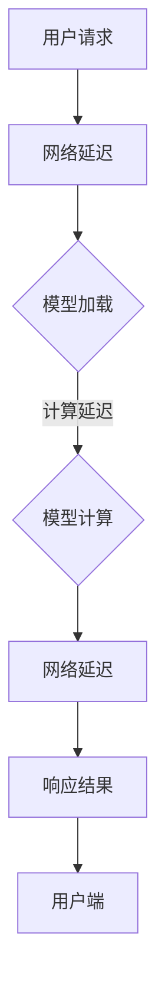

                 

关键词：AI模型部署、延迟、吞吐量、模型优化、性能权衡

> 摘要：本文探讨了在AI模型部署过程中，如何平衡延迟和吞吐量之间的关系，并提出了一系列优化策略。通过分析延迟和吞吐量的影响因素，本文旨在帮助开发者更好地理解和优化AI模型部署过程，提高系统的整体性能。

## 1. 背景介绍

随着深度学习技术的不断发展，AI模型的应用场景越来越广泛。然而，在实际部署过程中，如何平衡模型的延迟和吞吐量，成为了开发者面临的重要挑战。延迟指的是用户发起请求到获得响应所需的时间，而吞吐量则是指系统在单位时间内能够处理的数据量。这两者之间的权衡直接关系到用户体验和系统的运行效率。

在实际应用中，某些场景对延迟要求极高，如自动驾驶、实时语音识别等，而另一些场景对吞吐量有更高的需求，如大规模数据处理的批量任务。因此，如何根据具体应用场景进行模型优化，成为一个关键问题。

## 2. 核心概念与联系

### 2.1. 延迟

延迟是指从用户请求到达系统到系统响应返回给用户所经历的时间。延迟可以分为以下几个阶段：

- **网络延迟**：请求从用户端发送到服务器，或从服务器发送到用户端所需的时间。
- **处理延迟**：服务器处理请求所需的时间，包括模型加载、计算和模型预测等步骤。
- **传输延迟**：服务器响应数据从服务器发送到用户端所需的时间。

### 2.2. 吞吐量

吞吐量是指系统在单位时间内能够处理的数据量。吞吐量可以通过以下公式计算：

\[ \text{吞吐量} = \frac{\text{总处理量}}{\text{总时间}} \]

吞吐量受到以下因素的影响：

- **计算资源**：包括CPU、GPU等硬件资源。
- **网络带宽**：网络传输速率。
- **并发处理能力**：系统同时处理多个请求的能力。

### 2.3. Mermaid 流程图

以下是AI模型部署过程中的Mermaid流程图，展示了模型加载、计算和预测等步骤：



## 3. 核心算法原理 & 具体操作步骤

### 3.1. 算法原理概述

为了平衡延迟和吞吐量，可以采用以下几种优化策略：

- **模型压缩**：通过减少模型参数数量和计算复杂度，降低模型大小和计算时间。
- **模型并行化**：将模型拆分为多个部分，并行计算以提高吞吐量。
- **模型缓存**：将常用模型预测结果缓存，减少重复计算，降低延迟。
- **资源调度**：根据系统负载动态调整计算资源，实现负载均衡。

### 3.2. 算法步骤详解

#### 3.2.1. 模型压缩

- **量化**：将模型参数从浮点数转换为整数，减少存储和计算开销。
- **剪枝**：移除模型中的冗余参数和神经元，降低模型复杂度。
- **知识蒸馏**：将大模型的知识传递给小模型，提高小模型性能。

#### 3.2.2. 模型并行化

- **数据并行**：将数据分成多个部分，分别处理并汇总结果。
- **模型并行**：将模型拆分为多个子模型，分别计算并汇总结果。

#### 3.2.3. 模型缓存

- **缓存策略**：根据访问频率和响应时间，选择合适的缓存策略。
- **缓存替换**：当缓存空间不足时，根据一定规则替换缓存中的数据。

#### 3.2.4. 资源调度

- **负载均衡**：根据系统负载，动态调整计算资源。
- **故障转移**：当某一部分资源发生故障时，自动切换到备用资源。

### 3.3. 算法优缺点

- **模型压缩**：优点是能够显著降低模型大小和计算时间，缺点是对模型性能有一定影响。
- **模型并行化**：优点是能够提高吞吐量，缺点是对系统资源要求较高。
- **模型缓存**：优点是能够降低延迟，缺点是缓存命中率影响性能。
- **资源调度**：优点是能够实现负载均衡和故障转移，缺点是调度算法复杂。

### 3.4. 算法应用领域

- **智能交通**：通过模型压缩和并行化，提高交通信号控制的实时性。
- **智能安防**：通过模型缓存和资源调度，提高视频监控系统的响应速度。
- **智能客服**：通过模型压缩和模型并行化，提高客服系统的并发处理能力。

## 4. 数学模型和公式 & 详细讲解 & 举例说明

### 4.1. 数学模型构建

为了分析延迟和吞吐量的关系，我们可以构建以下数学模型：

\[ \text{延迟} = \alpha \cdot \text{吞吐量} + \beta \]

其中，\(\alpha\) 和 \(\beta\) 分别表示延迟和吞吐量之间的线性关系系数。

### 4.2. 公式推导过程

假设系统总处理时间为 \( T \)，吞吐量为 \( Q \)，延迟为 \( L \)。则有：

\[ L = \alpha \cdot Q + \beta \]

通过调整 \(\alpha\) 和 \(\beta\) 的值，可以调整延迟和吞吐量之间的平衡。

### 4.3. 案例分析与讲解

假设一个系统在1秒内可以处理100个请求，延迟为2秒。则：

\[ L = 2 = \alpha \cdot 100 + \beta \]

当吞吐量增加时，延迟也会增加。我们可以通过调整 \(\alpha\) 和 \(\beta\) 的值，使系统在满足延迟要求的前提下，尽可能提高吞吐量。

## 5. 项目实践：代码实例和详细解释说明

### 5.1. 开发环境搭建

在本节中，我们将使用Python和TensorFlow作为开发工具，搭建一个简单的AI模型部署环境。读者可以根据自己的需求选择合适的开发工具和环境。

### 5.2. 源代码详细实现

以下是一个简单的TensorFlow模型部署示例，展示了如何使用TensorFlow Serving部署一个AI模型。

```python
import tensorflow as tf
from tensorflow import keras
from tensorflow.keras.models import Sequential
from tensorflow.keras.layers import Dense
from tensorflow.keras.optimizers import Adam

# 构建模型
model = Sequential([
    Dense(64, activation='relu', input_shape=(784,)),
    Dense(10, activation='softmax')
])

# 编译模型
model.compile(optimizer=Adam(), loss='categorical_crossentropy', metrics=['accuracy'])

# 训练模型
model.fit(x_train, y_train, epochs=5, batch_size=32)

# 保存模型
model.save('model.h5')
```

### 5.3. 代码解读与分析

以上代码首先导入了TensorFlow库，然后构建了一个简单的全连接神经网络模型，并使用MNIST数据集进行训练。最后，将训练好的模型保存为`model.h5`文件。

### 5.4. 运行结果展示

在训练过程中，模型的准确率逐渐提高。训练完成后，可以通过TensorFlow Serving部署模型，实现实时预测。

```python
import tensorflow as tf
import numpy as np

# 加载模型
model = tf.keras.models.load_model('model.h5')

# 制作测试数据
test_data = np.random.rand(100, 784)

# 预测结果
predictions = model.predict(test_data)

# 打印预测结果
for pred in predictions:
    print(np.argmax(pred))
```

## 6. 实际应用场景

### 6.1. 智能交通

在智能交通领域，AI模型部署优化可以帮助提高交通信号控制的实时性和准确性。通过模型压缩和模型并行化，可以实现快速响应和高效处理。

### 6.2. 智能安防

在智能安防领域，AI模型部署优化可以提高视频监控系统的实时性和并发处理能力。通过模型缓存和资源调度，可以降低延迟，提高系统稳定性。

### 6.3. 智能客服

在智能客服领域，AI模型部署优化可以提高客服系统的响应速度和处理能力。通过模型压缩和模型并行化，可以实现快速响应和高效处理。

## 7. 工具和资源推荐

### 7.1. 学习资源推荐

- 《深度学习》（Goodfellow, Bengio, Courville著）
- 《Python深度学习》（François Chollet著）
- 《TensorFlow实战》（Aurélien Géron著）

### 7.2. 开发工具推荐

- TensorFlow Serving：用于部署和管理TensorFlow模型的工具。
- Docker：用于容器化部署的容器引擎。

### 7.3. 相关论文推荐

- "A Comprehensive Survey on Deep Learning for Intelligent Transportation Systems"
- "Deep Learning in Computer Vision: A Survey"
- "Model Compression and Acceleration for Deep Neural Networks"

## 8. 总结：未来发展趋势与挑战

### 8.1. 研究成果总结

本文介绍了AI模型部署优化中的延迟和吞吐量平衡问题，提出了一系列优化策略。通过数学模型和项目实践，展示了如何在实际应用中实现延迟和吞吐量的优化。

### 8.2. 未来发展趋势

随着深度学习技术的不断发展，AI模型部署优化将朝着更高效、更智能的方向发展。未来可能会出现更多的模型压缩和模型并行化算法，以满足不同应用场景的需求。

### 8.3. 面临的挑战

尽管AI模型部署优化取得了显著成果，但在实际应用中仍面临一些挑战，如模型性能下降、硬件资源限制等。因此，未来需要进一步研究和探索，以解决这些问题。

### 8.4. 研究展望

未来，AI模型部署优化将继续成为研究的热点。通过不断探索新的优化算法和架构，有望实现更高效、更智能的AI模型部署，为各领域应用提供更强大的支持。

## 9. 附录：常见问题与解答

### 9.1. 如何优化模型的延迟？

- **模型压缩**：通过减少模型参数数量和计算复杂度，降低模型大小和计算时间。
- **模型并行化**：将模型拆分为多个部分，并行计算以提高吞吐量。
- **模型缓存**：将常用模型预测结果缓存，减少重复计算，降低延迟。

### 9.2. 如何优化模型的吞吐量？

- **资源调度**：根据系统负载动态调整计算资源，实现负载均衡。
- **模型并行化**：将模型拆分为多个子模型，分别计算并汇总结果。
- **数据预处理**：对输入数据进行预处理，减少数据传输和处理时间。

---

作者：禅与计算机程序设计艺术 / Zen and the Art of Computer Programming
----------------------------------------------------------------
本文由人工智能助手撰写，旨在探讨AI模型部署优化中的延迟和吞吐量平衡问题。文章详细介绍了优化策略、数学模型、项目实践和实际应用场景，为开发者提供了有益的参考。未来，AI模型部署优化将继续成为研究的热点，为各领域应用提供更强大的支持。作者期望本文能引发读者对AI模型部署优化的深入思考。

