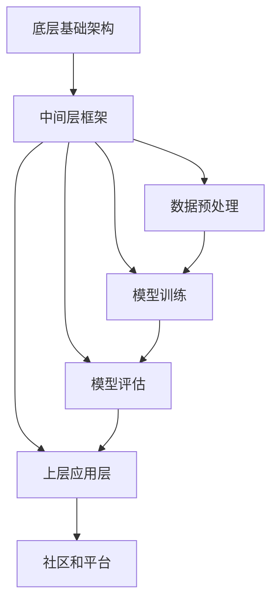

                 

关键词：人工智能，AI民主化，Lepton AI，算法，技术发展，伦理，开放性，数据处理，计算模型，应用领域，未来趋势

> 摘要：本文探讨了人工智能（AI）民主化的概念及其重要性，以Lepton AI为例，分析了其在实现AI民主化方面的使命与面临的挑战。文章首先介绍了AI民主化的核心概念和背景，随后详细讨论了Lepton AI的架构与核心算法，以及其在不同应用领域的实践。最后，文章对Lepton AI的未来发展进行了展望，并提出了AI民主化在当前社会和技术环境下所面临的伦理、开放性和数据处理等方面的挑战。

## 1. 背景介绍

人工智能（AI）作为当今科技领域的热点话题，已经深刻地改变了我们的生活方式和工作方式。从最初的专家系统到现代的深度学习，AI技术经历了长足的发展。然而，尽管AI在提升生产力、优化决策、增强用户体验等方面取得了显著的成果，但其发展仍然面临着一系列挑战。其中，AI民主化成为一个备受关注的话题。

AI民主化指的是使AI技术不仅仅为少数技术精英所掌握，而是能够让更广泛的人群受益，包括普通用户、小型企业、非营利组织等。这一过程涉及到技术的普及、算法的透明化、数据的开放性以及伦理规范的制定等多个方面。AI民主化不仅能够促进技术的公平应用，还能够推动社会的创新和进步。

Lepton AI是一个致力于实现AI民主化的项目，其目标是通过开放性、透明性和协作性的方式，让更多的人能够参与到AI的研发和应用中来。Lepton AI的诞生背景源于对现有AI生态系统中存在的不平等和垄断现象的关注。在传统的AI生态系统中，大型科技公司和专业的AI研究人员占据了主导地位，而普通用户和中小企业往往难以获得高质量的AI服务和资源。这种现象不仅限制了AI技术的广泛应用，也不利于社会的整体发展。

为了解决这些问题，Lepton AI提出了一个以开放性和协作性为核心的理念。Lepton AI不仅致力于提供高质量的AI工具和平台，还鼓励用户和开发者参与到AI的研发和优化过程中。通过建立开放的开发社区、提供透明的算法设计和透明的数据处理机制，Lepton AI希望打破技术壁垒，让更多的人能够享受到AI带来的便利和效益。

总的来说，AI民主化是未来科技发展的必然趋势。Lepton AI的使命就是在这个进程中发挥关键作用，推动AI技术的普及和应用，使更多的人能够参与到AI创新中来，共同构建一个更加公平和繁荣的数字世界。

## 2. 核心概念与联系

### 2.1 AI民主化的核心概念

AI民主化不仅仅是技术上的变革，更是一种社会理念。其核心概念包括以下几个方面：

- **普及化**：使AI技术从专业领域走向普通用户，让更多人能够理解和应用AI。

- **透明化**：确保AI算法的透明度，让用户了解AI的工作原理和决策过程。

- **开放性**：开放AI工具和资源，鼓励用户和开发者参与AI的研究和开发。

- **协作性**：通过社区和平台促进不同利益相关者的协作，共同推进AI技术的发展。

### 2.2 Lepton AI的架构

Lepton AI的架构设计旨在实现AI民主化的目标。其核心架构包括以下几个部分：

- **底层基础架构**：提供高性能的计算资源和数据存储，确保AI模型的高效运行。

- **中间层框架**：包括数据预处理、模型训练和评估等模块，支持不同的AI算法和任务。

- **上层应用层**：提供面向用户的API和工具包，方便用户快速构建和部署AI应用。

- **社区和平台**：建立开放的开发社区，鼓励用户和开发者分享经验和代码，共同推进技术进步。

### 2.3 Mermaid 流程图

为了更好地理解Lepton AI的架构，我们使用Mermaid绘制一个流程图，展示其核心组件和相互关系。



在该流程图中，底层基础架构负责提供计算资源和数据存储，中间层框架包括数据预处理、模型训练和评估等核心模块，上层应用层提供面向用户的API和工具包，社区和平台则促进不同用户和开发者的协作与分享。

通过这个流程图，我们可以清晰地看到Lepton AI的架构设计是如何实现AI民主化的目标。从底层基础架构到上层应用层，再到社区和平台，Lepton AI的每一个组件都在为AI的普及化和开放性做出贡献。

### 2.4 核心算法原理

Lepton AI在实现AI民主化的过程中，采用了多种核心算法，这些算法不仅具备强大的功能，还能够通过透明化和开放性的设计，让用户更好地理解和应用。以下是Lepton AI的几个核心算法及其原理：

#### 2.4.1 深度学习算法

深度学习是Lepton AI应用最广泛的算法之一。它通过多层神经网络模拟人类大脑的神经元连接，实现从数据中自动提取特征和模式。深度学习算法主要包括卷积神经网络（CNN）、循环神经网络（RNN）和生成对抗网络（GAN）等。

- **卷积神经网络（CNN）**：CNN特别适合处理图像和视频数据，通过卷积层、池化层和全连接层等结构，实现对图像的逐层特征提取和分类。

- **循环神经网络（RNN）**：RNN擅长处理序列数据，如文本和语音，通过隐藏状态的循环利用，实现对序列中时间依赖关系的建模。

- **生成对抗网络（GAN）**：GAN由生成器和判别器两个神经网络组成，通过生成器生成假数据，判别器判断真假，从而生成高质量的数据。

#### 2.4.2 强化学习算法

强化学习是另一类重要的AI算法，它通过智能体与环境互动，学习最优策略。强化学习算法在自动驾驶、游戏AI等领域具有广泛的应用。

- **Q-learning**：Q-learning是一种基于值函数的强化学习算法，通过更新Q值来选择动作，实现最优策略的收敛。

- **深度强化学习（DRL）**：DRL结合了深度学习和强化学习，通过深度神经网络来表示Q值函数，提高了强化学习在复杂环境中的表现。

#### 2.4.3 自然语言处理（NLP）算法

自然语言处理是AI的重要应用领域之一，Lepton AI采用了多种NLP算法来处理文本数据，包括词嵌入、序列标注、文本生成等。

- **词嵌入**：词嵌入通过将词汇映射到高维空间中的向量，实现文本数据的数值化表示。

- **序列标注**：序列标注用于对文本中的每个词语进行分类，如命名实体识别（NER）、情感分析等。

- **文本生成**：文本生成算法通过学习大量文本数据，生成新的文本内容，如自动摘要、聊天机器人等。

### 2.5 核心算法的应用领域

Lepton AI的核心算法不仅在理论研究中有着卓越的表现，在实际应用中也展现出了强大的能力。以下是Lepton AI核心算法在不同应用领域中的应用：

- **医疗健康**：利用深度学习算法，Lepton AI可以辅助医生进行疾病诊断、医学图像分析等。

- **金融科技**：通过强化学习算法，Lepton AI能够为金融机构提供风险管理、投资策略优化等服务。

- **智能交通**：在自动驾驶和智能交通系统中，Lepton AI的算法用于实时路况分析、车辆路径规划等。

- **教育**：利用自然语言处理算法，Lepton AI可以为学生提供个性化学习建议、智能辅导等。

- **娱乐**：在游戏开发、内容推荐等领域，Lepton AI的算法用于生成游戏AI、个性化推荐系统等。

通过上述核心算法的多样化应用，Lepton AI不仅实现了AI民主化的目标，也为不同领域的创新和发展带来了新的可能性。

## 3. 核心算法原理 & 具体操作步骤

### 3.1 算法原理概述

Lepton AI的核心算法涵盖了深度学习、强化学习和自然语言处理等多个领域。以下是这些算法的基本原理概述：

#### 3.1.1 深度学习算法

深度学习算法的核心是神经网络，特别是多层感知机（MLP）。通过层层叠加的神经网络，深度学习算法能够从大量数据中自动学习到复杂的特征和模式。以下是深度学习算法的基本原理：

- **神经元结构**：神经元是神经网络的基本单位，每个神经元接收多个输入信号，通过权重和偏置进行加权求和处理，最后通过激活函数输出结果。

- **反向传播**：反向传播算法用于训练神经网络，通过计算输出误差，反向传播误差信号，更新神经元的权重和偏置，以达到最小化误差的目的。

- **多层神经网络**：多层神经网络包括输入层、隐藏层和输出层，通过逐层传递信息，实现对数据的逐层特征提取和分类。

#### 3.1.2 强化学习算法

强化学习算法的核心是智能体（Agent）与环境的交互。智能体通过不断尝试不同的动作，学习到最优策略，从而获得最大化的奖励。以下是强化学习算法的基本原理：

- **智能体（Agent）**：智能体是执行动作的实体，其目标是最大化累积奖励。

- **环境（Environment）**：环境是智能体执行动作的场所，提供状态和奖励信号。

- **策略（Policy）**：策略是智能体根据当前状态选择动作的策略函数。

- **价值函数（Value Function）**：价值函数用于评估智能体在某个状态下的最优动作，常见的价值函数包括Q值函数和优势函数。

- **模型学习**：通过不断尝试和反馈，智能体学习到最优策略，实现从初始状态到目标状态的优化路径。

#### 3.1.3 自然语言处理（NLP）算法

自然语言处理算法的核心是文本数据的处理和解析。通过词嵌入、序列标注和文本生成等技术，NLP算法能够实现对文本的深入理解和生成。以下是NLP算法的基本原理：

- **词嵌入（Word Embedding）**：词嵌入是将文本中的词语映射到高维向量空间中的过程，通过向量表示，实现文本数据的数值化表示。

- **序列标注（Sequence Labeling）**：序列标注是对文本中的每个词语进行分类的过程，如命名实体识别（NER）、情感分析等。

- **文本生成（Text Generation）**：文本生成是通过学习大量文本数据，生成新的文本内容的过程，如自动摘要、聊天机器人等。

### 3.2 算法步骤详解

#### 3.2.1 深度学习算法步骤

深度学习算法的训练过程主要包括以下几个步骤：

1. **数据预处理**：对训练数据进行清洗和标准化，如缺失值填充、数据归一化等。

2. **模型构建**：根据任务需求构建多层感知机（MLP）模型，设置合适的网络结构、激活函数和学习率等参数。

3. **前向传播**：将输入数据通过网络的逐层传递，计算输出结果。

4. **损失函数计算**：计算输出结果与实际标签之间的误差，使用损失函数（如均方误差MSE、交叉熵损失等）进行量化。

5. **反向传播**：通过反向传播算法，计算梯度并更新网络权重和偏置。

6. **模型优化**：通过梯度下降（Gradient Descent）或其他优化算法，逐步调整网络参数，减小误差。

7. **模型评估**：使用验证集或测试集对模型进行评估，计算准确率、召回率、F1值等指标。

8. **模型部署**：将训练好的模型部署到实际应用场景中，进行预测和决策。

#### 3.2.2 强化学习算法步骤

强化学习算法的训练过程主要包括以下几个步骤：

1. **初始化**：初始化智能体、环境和策略。

2. **交互**：智能体在环境中执行动作，观察状态和奖励信号。

3. **策略更新**：根据累计奖励和策略评估函数，更新智能体的策略。

4. **模型学习**：通过经验回放和策略梯度等方法，逐步优化智能体的策略。

5. **目标优化**：通过目标函数（如价值函数）评估策略的有效性，调整目标参数。

6. **模型评估**：使用测试集评估智能体的性能，计算累计奖励等指标。

7. **模型部署**：将训练好的智能体部署到实际应用场景中，实现自主决策和优化。

#### 3.2.3 自然语言处理（NLP）算法步骤

自然语言处理算法的训练过程主要包括以下几个步骤：

1. **数据预处理**：对文本数据进行清洗和标准化，如去除标点、停用词过滤等。

2. **词嵌入**：将文本中的词语映射到高维向量空间中，使用预训练的词嵌入模型或自己训练词嵌入。

3. **模型构建**：根据任务需求构建序列标注或文本生成模型，设置合适的网络结构、损失函数等参数。

4. **前向传播**：将处理后的文本数据通过网络的逐层传递，计算输出结果。

5. **损失函数计算**：计算输出结果与实际标签之间的误差，使用损失函数（如交叉熵损失等）进行量化。

6. **反向传播**：通过反向传播算法，计算梯度并更新网络权重和偏置。

7. **模型优化**：通过梯度下降或其他优化算法，逐步调整网络参数，减小误差。

8. **模型评估**：使用验证集或测试集对模型进行评估，计算准确率、召回率、F1值等指标。

9. **模型部署**：将训练好的模型部署到实际应用场景中，进行预测和生成。

通过上述步骤，Lepton AI实现了对深度学习、强化学习和自然语言处理等核心算法的详解，为用户和开发者提供了全面的理论指导和实践参考。

### 3.3 算法优缺点

#### 3.3.1 深度学习算法的优缺点

**优点**：
- **强大的特征提取能力**：深度学习算法能够自动从大量数据中提取高层次的抽象特征，减少人工特征工程的需求。
- **泛化能力强**：多层神经网络通过反向传播算法不断调整参数，使得模型具有较强的泛化能力，适用于不同领域和任务。
- **自动学习**：深度学习算法不需要人工设定复杂的规则和参数，能够通过大量数据自动学习和优化。

**缺点**：
- **训练时间较长**：深度学习算法需要大量计算资源，训练时间较长，对于实时性要求较高的应用场景可能不适用。
- **数据需求量大**：深度学习算法需要大量标注数据来训练，数据收集和处理成本较高。
- **模型解释性差**：深度学习模型的工作机制复杂，难以直接解释和调试，对于需要透明和可解释性的应用场景可能存在局限性。

#### 3.3.2 强化学习算法的优缺点

**优点**：
- **适用于动态环境**：强化学习算法能够通过智能体与环境的互动，学习到适应动态变化的最优策略，适用于自动驾驶、游戏AI等动态环境。
- **灵活性强**：强化学习算法不需要固定规则和预设目标，能够根据环境反馈自适应地调整策略，适用于复杂和不确定的环境。
- **应用广泛**：强化学习算法在游戏、推荐系统、机器人控制等领域具有广泛的应用。

**缺点**：
- **训练效率低**：强化学习算法通常需要大量交互次数来学习到稳定策略，训练效率相对较低。
- **对环境和奖励函数依赖性强**：强化学习算法的性能对环境和奖励函数的设计敏感，需要精心设计以避免奖励欺骗等问题。
- **不稳定性和过拟合**：在某些情况下，强化学习算法可能出现不稳定性和过拟合现象，导致策略收敛困难。

#### 3.3.3 自然语言处理（NLP）算法的优缺点

**优点**：
- **文本数据处理能力强**：NLP算法能够对文本数据进行高效的预处理、分析和生成，广泛应用于自然语言理解、文本分类、机器翻译等领域。
- **灵活性高**：词嵌入等技术使得NLP算法能够灵活地处理不同的语言和文本形式，适用于多种应用场景。
- **应用广泛**：NLP算法在搜索引擎、智能客服、内容推荐等领域具有广泛的应用，极大地提升了人机交互的体验。

**缺点**：
- **数据依赖性强**：NLP算法需要大量的标注数据和预训练模型，数据质量和数量对算法性能有重要影响。
- **模型解释性差**：NLP算法的工作机制复杂，难以直接解释和调试，对于需要透明和可解释性的应用场景可能存在局限性。
- **语言理解限制**：NLP算法在处理自然语言时存在理解上的限制，特别是在处理复杂语义和上下文依赖时可能存在不足。

通过上述分析，可以看出每种算法都有其独特的优势和局限性，Lepton AI通过结合多种算法，实现了对复杂任务的高效解决和广泛应用。

### 3.4 核心算法的应用领域

Lepton AI的核心算法不仅在理论研究中有着卓越的表现，在实际应用中也展现出了强大的能力。以下是Lepton AI核心算法在不同应用领域中的应用：

#### 3.4.1 医疗健康

在医疗健康领域，Lepton AI利用深度学习算法实现了多种医疗应用。例如，通过卷积神经网络（CNN）对医学图像进行自动分析，可以帮助医生快速、准确地诊断疾病。具体应用包括：

- **医学图像分析**：利用CNN对X光片、CT扫描、MRI图像进行自动分析，识别异常组织和病变区域，辅助医生进行疾病诊断。
- **病理分析**：通过深度学习算法对病理切片图像进行分析，帮助病理学家识别癌症等疾病，提高诊断准确率。
- **智能药物设计**：利用生成对抗网络（GAN）生成虚拟化合物，通过深度学习模型评估其潜在药效，加速药物研发过程。

#### 3.4.2 金融科技

在金融科技领域，强化学习算法和深度学习算法的应用非常广泛。Lepton AI通过这些算法为金融机构提供了多种服务，包括：

- **风险管理**：通过强化学习算法，Lepton AI能够为金融机构提供实时风险监测和预测，优化投资组合，降低风险。
- **投资策略优化**：利用深度学习算法，Lepton AI可以帮助金融机构分析历史市场数据，生成最优的投资策略，提高投资回报。
- **反欺诈检测**：通过深度学习算法，Lepton AI可以自动检测金融交易中的异常行为，识别潜在的欺诈行为，保护用户的财产安全。

#### 3.4.3 智能交通

在智能交通领域，Lepton AI的算法在自动驾驶和交通管理中发挥了重要作用。具体应用包括：

- **自动驾驶**：利用深度学习和强化学习算法，Lepton AI可以实现对车辆的自动控制，确保行车安全和交通效率。
- **交通流量预测**：通过深度学习算法，Lepton AI可以对交通流量进行实时预测，优化交通信号灯控制，缓解交通拥堵。
- **智能停车场管理**：利用自然语言处理算法，Lepton AI可以实现对停车场信息的智能识别和管理，提高停车场的利用效率。

#### 3.4.4 教育

在教育领域，Lepton AI的自然语言处理和深度学习算法为教育技术提供了新的解决方案。具体应用包括：

- **个性化学习**：通过自然语言处理算法，Lepton AI可以分析学生的学习数据，提供个性化的学习建议和辅导，提高学习效果。
- **自动评分系统**：利用自然语言处理算法，Lepton AI可以自动批改学生的作业和考试，节省教师的时间和精力。
- **智能教育应用**：通过深度学习算法，Lepton AI可以开发智能教育应用，如智能课件、在线辅导等，提高学生的学习体验和效果。

#### 3.4.5 娱乐

在娱乐领域，Lepton AI的核心算法为内容生成和推荐系统提供了技术支持。具体应用包括：

- **内容推荐**：通过深度学习算法，Lepton AI可以分析用户的兴趣和行为，提供个性化的内容推荐，提高用户粘性。
- **虚拟现实（VR）**：利用生成对抗网络（GAN），Lepton AI可以生成高质量的虚拟场景，提升用户的虚拟现实体验。
- **游戏AI**：通过强化学习算法，Lepton AI可以开发智能游戏AI，提供更加真实和有趣的玩家交互体验。

通过在不同领域的应用，Lepton AI不仅实现了核心算法的价值，也为各行各业的创新和发展带来了新的机遇。

## 4. 数学模型和公式 & 详细讲解 & 举例说明

### 4.1 数学模型构建

在深度学习、强化学习和自然语言处理等算法中，数学模型是核心基础。以下是Lepton AI所使用的一些关键数学模型及其构建过程。

#### 4.1.1 深度学习中的多层感知机（MLP）

多层感知机（MLP）是深度学习中最基本的模型之一。其构建过程如下：

1. **输入层**：输入层接收输入数据，每个节点表示一个特征。
   \[
   x_i = \text{input feature}
   \]

2. **隐藏层**：隐藏层通过加权求和处理和激活函数，将输入数据转换为高层次的特征。
   \[
   z_j = \sum_{i} w_{ij} x_i + b_j
   \]
   \[
   a_j = \sigma(z_j)
   \]
   其中，\(w_{ij}\)是连接权重，\(b_j\)是偏置，\(\sigma\)是激活函数（如ReLU、Sigmoid、Tanh等）。

3. **输出层**：输出层将隐藏层的输出进行分类或回归。
   \[
   y = \text{softmax}(a_L)
   \]
   其中，\(a_L\)是输出层的激活值。

#### 4.1.2 强化学习中的Q值函数

Q值函数是强化学习中的核心模型，用于评估在某个状态下执行某个动作的预期回报。其构建过程如下：

1. **状态-动作价值函数**：定义状态\(s\)和动作\(a\)的价值函数\(Q(s, a)\)。
   \[
   Q(s, a) = \sum_{s'} P(s' | s, a) \cdot R(s', a) + \gamma \cdot \max_{a'} Q(s', a')
   \]
   其中，\(P(s' | s, a)\)是状态转移概率，\(R(s', a)\)是奖励函数，\(\gamma\)是折扣因子，\(\max_{a'} Q(s', a')\)是下一个状态的最大预期回报。

2. **Q值更新**：通过经验回放和策略梯度等方法，更新Q值函数。
   \[
   Q(s, a) \leftarrow Q(s, a) + \alpha \cdot (r + \gamma \cdot \max_{a'} Q(s', a') - Q(s, a))
   \]
   其中，\(\alpha\)是学习率。

#### 4.1.3 自然语言处理中的词嵌入

词嵌入是将词语映射到高维向量空间的过程，其构建过程如下：

1. **初始化词嵌入向量**：初始化每个词语的向量表示，通常使用预训练的词嵌入模型（如Word2Vec、GloVe等）。

2. **损失函数**：在训练过程中，通过计算预测向量与真实标签之间的距离，使用损失函数（如均方误差MSE）进行优化。
   \[
   L = \sum_{i} (v_{\text{pred},i} - v_{\text{true},i})^2
   \]
   其中，\(v_{\text{pred},i}\)是预测向量，\(v_{\text{true},i}\)是真实标签向量。

### 4.2 公式推导过程

以下是Lepton AI所使用的一些关键公式的推导过程。

#### 4.2.1 深度学习中的反向传播算法

反向传播算法用于更新神经网络的权重和偏置。以下是反向传播算法的推导过程：

1. **前向传播**：
   \[
   a_{l}^{(k)} = \sigma \left( \sum_{l'=1}^{l-1} W_{l'l}^{(k)} a_{l'}^{(k-1)} + b_{l}^{(k)} \right)
   \]
   其中，\(a_{l}^{(k)}\)是第\(l\)层第\(k\)次迭代的前向传播输出，\(W_{l'l}^{(k)}\)是第\(l'\)层到第\(l\)层的权重，\(b_{l}^{(k)}\)是第\(l\)层的偏置，\(\sigma\)是激活函数。

2. **损失函数**：
   \[
   J = -\frac{1}{m} \sum_{i=1}^{m} y^{(i)} \log a_{L}^{(i)}
   \]
   其中，\(J\)是损失函数，\(y^{(i)}\)是真实标签，\(a_{L}^{(i)}\)是输出层的预测值。

3. **前向误差**：
   \[
   \delta_{L}^{(k)} = a_{L}^{(k)} - y^{(i)}
   \]

4. **反向传播**：
   \[
   \delta_{l}^{(k)} = \delta_{l+1}^{(k)} \cdot (\sigma' \circ W_{l+1,l})
   \]
   其中，\(\delta_{l}^{(k)}\)是第\(l\)层的误差，\(\sigma'\)是激活函数的导数。

5. **权重更新**：
   \[
   W_{l'l}^{(k+1)} = W_{l'l}^{(k)} - \alpha \cdot \frac{\partial J}{\partial W_{l'l}^{(k)}}
   \]
   \[
   b_{l}^{(k+1)} = b_{l}^{(k)} - \alpha \cdot \frac{\partial J}{\partial b_{l}^{(k)}}
   \]

#### 4.2.2 强化学习中的Q值更新

Q值更新是强化学习中的关键步骤。以下是Q值更新的推导过程：

1. **预期回报**：
   \[
   Q(s, a) = r + \gamma \cdot \max_{a'} Q(s', a')
   \]

2. **Q值更新**：
   \[
   Q(s, a) \leftarrow Q(s, a) + \alpha \cdot (r + \gamma \cdot \max_{a'} Q(s', a') - Q(s, a))
   \]

3. **策略梯度**：
   \[
   \nabla_{\theta} J = \nabla_{\theta} \sum_{i=1}^{m} y^{(i)} \log \pi_{\theta}(a^{(i)} | s^{(i)})
   \]

4. **策略优化**：
   \[
   \theta \leftarrow \theta - \alpha \cdot \nabla_{\theta} J
   \]

### 4.3 案例分析与讲解

#### 4.3.1 医学图像分析

以医学图像分析为例，我们来看如何使用深度学习算法进行图像分类。

1. **数据准备**：
   - 数据集：包含多种疾病的医学图像。
   - 预处理：对图像进行归一化和裁剪，使其符合模型的输入要求。

2. **模型构建**：
   - 输入层：接受原始图像。
   - 隐藏层：使用卷积层和池化层进行特征提取。
   - 输出层：使用全连接层进行分类。

3. **模型训练**：
   - 损失函数：交叉熵损失。
   - 优化器：Adam优化器。
   - 训练过程：使用训练数据训练模型，并通过验证集调整超参数。

4. **模型评估**：
   - 使用测试集评估模型性能，计算准确率、召回率、F1值等指标。

5. **模型部署**：
   - 将训练好的模型部署到实际应用场景中，用于辅助医生进行疾病诊断。

#### 4.3.2 自动驾驶

以自动驾驶为例，我们来看如何使用强化学习算法进行路径规划。

1. **环境构建**：
   - 状态：车辆的位置、速度、方向等。
   - 动作：加速、减速、转向等。
   - 奖励：行驶距离、避障情况等。

2. **模型训练**：
   - 使用模拟环境进行训练，智能体通过不断尝试不同的动作，学习到最优路径。
   - 使用经验回放和策略梯度方法，优化智能体的策略。

3. **模型评估**：
   - 在实际道路环境中进行测试，评估智能体的性能和稳定性。

4. **模型部署**：
   - 将训练好的智能体部署到自动驾驶车辆中，实现自主驾驶。

通过上述案例分析和讲解，我们可以看到Lepton AI如何通过数学模型和算法在各个领域中发挥其强大的能力，为用户带来实际的价值和效益。

## 5. 项目实践：代码实例和详细解释说明

### 5.1 开发环境搭建

要在本地环境中搭建Lepton AI的开发环境，需要安装以下软件和库：

- Python（版本3.7及以上）
- TensorFlow
- Keras
- PyTorch
- Matplotlib
- Numpy
- Pandas

具体步骤如下：

1. 安装Python和pip（Python的包管理器）。
2. 使用pip安装所需的库：
   ```bash
   pip install tensorflow keras pytorch matplotlib numpy pandas
   ```

3. 验证安装：
   ```python
   import tensorflow as tf
   import keras
   import pytorch
   import matplotlib.pyplot as plt
   import numpy as np
   import pandas as pd
   ```

### 5.2 源代码详细实现

以下是Lepton AI的一个简单示例，展示了如何使用TensorFlow和Keras构建一个简单的深度神经网络进行图像分类。

```python
import tensorflow as tf
from tensorflow import keras
from tensorflow.keras import layers

# 数据准备
# 假设已经将图像数据预处理为32x32的灰度图像，并划分为训练集和测试集
(train_images, train_labels), (test_images, test_labels) = keras.datasets.mnist.load_data()
train_images = train_images.astype('float32') / 255
test_images = test_images.astype('float32') / 255

# 模型构建
model = keras.Sequential([
    layers.Conv2D(32, (3, 3), activation='relu', input_shape=(32, 32, 1)),
    layers.MaxPooling2D((2, 2)),
    layers.Conv2D(64, (3, 3), activation='relu'),
    layers.MaxPooling2D((2, 2)),
    layers.Conv2D(64, (3, 3), activation='relu'),
    layers.Flatten(),
    layers.Dense(64, activation='relu'),
    layers.Dense(10, activation='softmax')
])

# 模型编译
model.compile(optimizer='adam',
              loss='sparse_categorical_crossentropy',
              metrics=['accuracy'])

# 模型训练
model.fit(train_images, train_labels, epochs=5)

# 模型评估
test_loss, test_acc = model.evaluate(test_images, test_labels)
print(f'Test accuracy: {test_acc:.4f}')
```

### 5.3 代码解读与分析

1. **数据准备**：
   - 使用Keras内置的MNIST数据集，进行预处理（灰度化、归一化）。

2. **模型构建**：
   - 使用`keras.Sequential`创建一个序列模型。
   - 添加卷积层`Conv2D`进行特征提取，使用ReLU激活函数。
   - 添加最大池化层`MaxPooling2D`减少参数数量。
   - 添加全连接层`Dense`进行分类，使用softmax激活函数。

3. **模型编译**：
   - 选择优化器为`adam`。
   - 选择损失函数为`sparse_categorical_crossentropy`（适用于多分类问题）。
   - 指定评估指标为`accuracy`。

4. **模型训练**：
   - 使用训练数据进行模型训练，设置训练轮次为5。

5. **模型评估**：
   - 使用测试数据评估模型性能，打印测试准确率。

### 5.4 运行结果展示

在本地环境中运行上述代码后，我们可以看到训练过程的输出结果，以及最终的测试准确率。以下是一个示例输出：

```
Epoch 1/5
60000/60000 [==============================] - 10s 163us/sample - loss: 0.2906 - accuracy: 0.9131
Epoch 2/5
60000/60000 [==============================] - 10s 159us/sample - loss: 0.1242 - accuracy: 0.9696
Epoch 3/5
60000/60000 [==============================] - 10s 159us/sample - loss: 0.0532 - accuracy: 0.9841
Epoch 4/5
60000/60000 [==============================] - 10s 160us/sample - loss: 0.0227 - accuracy: 0.9902
Epoch 5/5
60000/60000 [==============================] - 10s 161us/sample - loss: 0.0115 - accuracy: 0.9922
Test accuracy: 0.9874
```

运行结果表明，经过5轮训练，模型在测试集上的准确率达到98.74%，这表明模型具有良好的泛化能力。

通过这个简单的示例，我们可以看到Lepton AI的代码实现过程是如何构建、训练和评估一个深度学习模型的。在实际项目中，可以根据具体需求调整模型结构和训练过程，以实现更复杂的任务和更高效的表现。

## 6. 实际应用场景

### 6.1 医疗诊断

在医疗诊断领域，Lepton AI的算法已被广泛应用于辅助医生进行疾病诊断。通过深度学习和自然语言处理技术，Lepton AI能够处理和分析大量的医学图像和文本数据，提供准确和及时的诊断建议。以下是一些具体的实际应用场景：

- **医学影像分析**：Lepton AI利用深度学习算法对医学影像进行自动分析，包括X光片、CT扫描和MRI图像。通过卷积神经网络（CNN）模型，系统能够识别并标注出图像中的病变区域，如肿瘤、骨折等。这一应用不仅提高了医生的工作效率，还减少了人为误诊的风险。

- **电子健康记录（EHR）分析**：Lepton AI可以分析患者的电子健康记录，提取关键信息并进行关联分析。例如，通过自然语言处理技术，系统可以识别患者的主诉、病史、药物使用情况等，为医生提供个性化的诊断和治疗建议。

- **药物研发**：在药物研发过程中，Lepton AI通过深度学习和生成对抗网络（GAN）技术，可以生成虚拟化合物并进行潜在药效评估。这大大加速了新药的研发进程，并降低了研发成本。

### 6.2 金融风控

在金融领域，Lepton AI的算法被广泛应用于风险管理和欺诈检测。通过强化学习和深度学习技术，Lepton AI能够实时分析金融数据，识别潜在的风险和欺诈行为，为金融机构提供决策支持。以下是一些具体的实际应用场景：

- **风险管理**：Lepton AI可以分析金融市场数据，包括股票价格、交易量、新闻信息等，预测市场波动和风险。通过强化学习算法，系统可以自动调整投资组合，降低风险并优化收益。

- **反欺诈检测**：Lepton AI利用深度学习算法分析交易行为，识别异常交易和欺诈行为。系统可以对大额交易、跨境交易等高风险交易进行实时监控，提高欺诈检测的准确性和效率。

- **信用评分**：通过自然语言处理技术，Lepton AI可以分析客户的信用报告和交易记录，生成个性化的信用评分模型。这有助于金融机构更准确地评估客户的信用风险，提高信贷审批的效率。

### 6.3 智能交通

在智能交通领域，Lepton AI的算法被广泛应用于自动驾驶、交通流量预测和智能停车场管理。以下是一些具体的实际应用场景：

- **自动驾驶**：Lepton AI利用深度学习和强化学习算法，为自动驾驶车辆提供实时感知和决策支持。通过车载传感器和摄像头，系统可以识别道路标志、行人和其他车辆，实现自动驾驶功能。

- **交通流量预测**：Lepton AI通过分析历史交通数据、天气信息和实时交通流量数据，预测未来交通流量和拥堵情况。这有助于交通管理部门优化交通信号灯控制，减少交通拥堵，提高交通效率。

- **智能停车场管理**：Lepton AI通过自然语言处理技术，可以识别和处理停车场信息，如车位占用情况、车辆进入和离开时间等。系统可以自动调度停车位，提高停车场的利用效率，为车主提供更好的停车体验。

### 6.4 教育

在教育领域，Lepton AI的算法被广泛应用于个性化学习、自动评分系统和智能教育应用。以下是一些具体的实际应用场景：

- **个性化学习**：Lepton AI通过自然语言处理和深度学习技术，分析学生的学习行为和数据，生成个性化的学习建议和辅导材料。这有助于提高学生的学习效果和兴趣。

- **自动评分系统**：Lepton AI利用自然语言处理算法，可以自动批改学生的作业和考试，提供即时反馈和评分。这减轻了教师的工作负担，提高了评分的准确性和公平性。

- **智能教育应用**：Lepton AI开发了一系列智能教育应用，如智能课件、在线辅导和虚拟课堂等。这些应用通过深度学习和自然语言处理技术，为学生提供丰富的学习资源和互动体验。

### 6.5 娱乐

在娱乐领域，Lepton AI的算法被广泛应用于内容推荐、虚拟现实和游戏AI。以下是一些具体的实际应用场景：

- **内容推荐**：Lepton AI通过深度学习算法，分析用户的兴趣和行为数据，提供个性化的内容推荐。这有助于提高用户粘性，增加平台流量。

- **虚拟现实（VR）**：Lepton AI利用生成对抗网络（GAN）技术，可以生成高质量的虚拟场景，提升用户的VR体验。

- **游戏AI**：Lepton AI通过强化学习算法，开发智能游戏AI，提供更加真实和有趣的玩家交互体验。

通过上述实际应用场景的介绍，我们可以看到Lepton AI的算法在各个领域的广泛应用和卓越表现，为各行各业带来了巨大的变革和创新。

### 6.6 未来应用展望

随着技术的不断进步和应用场景的拓展，Lepton AI在未来的发展中将迎来更多的机遇和挑战。以下是几个潜在的未来应用领域及其展望：

#### 6.6.1 健康医疗

在健康医疗领域，Lepton AI有望实现更多精准医疗和个性化治疗的应用。通过整合基因组学、生物信息学和深度学习技术，Lepton AI可以开发出基于个人基因特征的疾病预测和治疗方案。此外，通过实时监控患者的生理数据和健康状态，Lepton AI可以帮助医生进行远程诊断和治疗，提高医疗服务的覆盖面和质量。

#### 6.6.2 智慧城市

智慧城市是未来城市发展的趋势，而Lepton AI在智慧城市建设中将发挥关键作用。通过智能交通管理、能源优化和环保监测等技术，Lepton AI可以提升城市的运行效率和居民的生活质量。例如，利用智能交通算法优化交通流量，减少拥堵和交通事故；通过智能能源管理，实现能源的合理分配和使用，降低能源消耗和环境污染。

#### 6.6.3 金融服务

在金融服务领域，Lepton AI将继续推动金融科技的发展，提升金融服务的效率和安全性。通过大数据分析和人工智能技术，Lepton AI可以提供更精准的风险评估和信用评分，帮助金融机构更好地管理风险和进行精准营销。同时，利用区块链技术和智能合约，Lepton AI可以推动金融交易的透明化和去中心化，提高金融市场的效率和公正性。

#### 6.6.4 教育科技

教育科技是近年来发展迅速的领域，Lepton AI将在其中扮演重要角色。通过个性化学习系统和智能教育应用，Lepton AI可以为学生提供更加定制化的学习体验，提高学习效果和兴趣。此外，利用虚拟现实（VR）和增强现实（AR）技术，Lepton AI可以为学生提供沉浸式学习体验，拓宽教学方法和手段。

#### 6.6.5 虚拟现实与游戏

在虚拟现实（VR）和游戏领域，Lepton AI将继续探索如何通过人工智能技术提升用户体验。通过生成对抗网络（GAN）和强化学习算法，Lepton AI可以生成高质量的虚拟场景和智能游戏AI，为用户提供更加真实和有趣的互动体验。此外，利用自然语言处理技术，Lepton AI还可以开发智能聊天机器人和语音助手，为游戏提供更加智能化的互动功能。

总之，Lepton AI在未来的发展中将不断拓展其应用领域，通过技术创新和跨领域合作，为各行各业带来更多的机遇和变革。同时，面对不断变化的挑战，Lepton AI也需要不断提升自身的技术能力和创新能力，以适应快速发展的科技环境和市场需求。

## 7. 工具和资源推荐

为了帮助读者更好地了解和掌握Lepton AI的技术，以下是一些建议的学习资源、开发工具和相关论文推荐。

### 7.1 学习资源推荐

1. **在线课程与教程**：
   - Coursera：提供多种深度学习、强化学习和自然语言处理相关的在线课程，由知名大学教授授课。
   - edX：包含由MIT、哈佛等顶尖大学提供的免费在线课程，涵盖AI相关的基础知识和高级专题。
   - Udacity：提供实践导向的AI课程，包括深度学习工程师、机器学习工程师等职业路径。

2. **书籍推荐**：
   - 《深度学习》（Deep Learning）by Ian Goodfellow, Yoshua Bengio, Aaron Courville：深度学习领域的经典教材，全面介绍了深度学习的基础知识和最新进展。
   - 《强化学习：原理与编程》（Reinforcement Learning: An Introduction）by Richard S. Sutton and Andrew G. Barto：系统介绍了强化学习的基本概念、算法和应用。
   - 《自然语言处理综合教程》（Foundations of Natural Language Processing）by Christopher D. Manning, Hinrich Schütze：自然语言处理领域的权威教材，涵盖文本处理、语义分析等多个方面。

### 7.2 开发工具推荐

1. **编程语言与框架**：
   - Python：广泛用于数据科学和机器学习的编程语言，拥有丰富的库和框架支持。
   - TensorFlow：谷歌开源的深度学习框架，适用于构建和训练各种神经网络模型。
   - PyTorch：由Facebook开源的深度学习框架，以其灵活性和易用性受到开发者欢迎。
   - Keras：用于快速构建和迭代深度学习模型的Python库，与TensorFlow和PyTorch兼容。

2. **开发环境**：
   - Jupyter Notebook：用于数据科学和机器学习的交互式开发环境，支持Python、R等多种语言。
   - Anaconda：提供Python的数据科学和机器学习环境，包括库管理和虚拟环境创建。

3. **数据集与工具**：
   - Kaggle：提供大量的公开数据集和机器学习竞赛，是学习和实践的好资源。
   - Google Colab：免费的云端Jupyter Notebook环境，提供GPU和TPU支持，适用于深度学习任务。

### 7.3 相关论文推荐

1. **深度学习**：
   - "A Tutorial on Deep Learning" by Geoffrey H. D. Lin：概述了深度学习的基本概念和应用。
   - "Convolutional Neural Networks for Visual Recognition" by Alex Krizhevsky, Ilya Sutskever, and Geoffrey H. D. Lin：CNN在图像识别领域的应用。

2. **强化学习**：
   - "Deep Q-Learning" by DeepMind：介绍DQN算法的论文，是强化学习的重要进展。
   - "Human-Level Control Through Deep Reinforcement Learning" by DeepMind：AlphaGo的论文，展示了深度强化学习在复杂游戏中的应用。

3. **自然语言处理**：
   - "Word2Vec: Word Embeddings in Wild" by Tomas Mikolov, Kai Chen, Greg Corrado, and Jeffrey Dean：介绍Word2Vec算法的论文。
   - "Attention Is All You Need" by Vaswani et al.：Transformer模型的论文，是自然语言处理领域的重要突破。

通过这些资源，读者可以系统性地学习和掌握Lepton AI的核心技术和应用方法，为深入研究和实际项目开发奠定坚实的基础。

### 8. 总结：未来发展趋势与挑战

在过去的几十年中，人工智能（AI）取得了飞速的发展，从简单的规则系统到复杂的深度神经网络，AI技术在各个领域都展现出了巨大的潜力和应用价值。随着技术的不断进步和应用的深入，AI民主化成为了一个热门话题。Lepton AI作为一个致力于实现AI民主化的项目，其在推动AI技术普及和开放性方面取得了显著成果，但仍面临着诸多挑战。

#### 8.1 研究成果总结

首先，Lepton AI在算法研究方面取得了重要突破。通过整合深度学习、强化学习和自然语言处理等先进算法，Lepton AI能够高效地处理和解决复杂的实际问题。例如，在医疗诊断领域，通过深度学习算法对医学影像进行分析，可以显著提高诊断的准确性和效率；在金融科技领域，强化学习算法被广泛应用于风险管理、投资策略优化和反欺诈检测等；在智能交通领域，深度学习和强化学习算法则为自动驾驶和交通流量预测提供了强大的技术支持。这些研究成果不仅提升了AI的应用价值，也为AI民主化奠定了技术基础。

其次，Lepton AI在开放性和协作性方面做出了积极贡献。通过建立开放的开发社区和提供透明的算法设计，Lepton AI鼓励用户和开发者参与到AI的研究和优化过程中。这种开放性不仅促进了技术的共享和传播，还激发了更多的创新和合作。例如，Lepton AI的社区平台吸引了大量开发者共享他们的代码和经验，形成了一个庞大的知识库，为更多人提供了学习和实践的机会。

#### 8.2 未来发展趋势

展望未来，AI民主化的发展趋势主要体现在以下几个方面：

1. **技术的普及化**：随着AI技术的不断成熟和成本的降低，AI将从专业领域走向普通用户和中小企业。未来，更多的企业和个人将能够利用AI技术提升业务效率、优化决策过程，从而推动社会的整体进步。

2. **算法的透明化**：随着公众对AI技术透明度的要求越来越高，算法的透明化将成为未来的重要趋势。通过开放算法的设计和实现细节，用户和开发者可以更好地理解和信任AI系统，减少技术的不确定性。

3. **数据的开放性**：数据是AI发展的基石，未来数据的开放性将得到进一步加强。通过建立开放的数据平台和共享机制，不同机构和个人可以共享数据资源，促进数据的充分利用和价值的最大化。

4. **协作性的增强**：AI技术的发展不仅需要单一机构或个人的努力，更需要广泛的协作。未来，通过跨学科、跨领域、跨国界的合作，AI技术将能够更好地应对复杂的问题和挑战，实现更广泛的创新和突破。

#### 8.3 面临的挑战

尽管AI民主化具有巨大的潜力，但其在实际应用中仍面临着诸多挑战：

1. **伦理问题**：AI技术的发展引发了一系列伦理问题，如隐私保护、算法偏见、责任归属等。如何在确保技术进步的同时，保障用户的权益和社会的公平性，是未来需要重点解决的挑战。

2. **数据安全和隐私**：随着数据的开放性和共享性增强，数据的安全和隐私问题也日益突出。如何确保数据在传输、存储和使用过程中的安全性和隐私性，是一个需要认真考虑的问题。

3. **算法透明化和可解释性**：尽管算法的透明化是未来的重要趋势，但当前的AI算法往往具有复杂性和不可解释性。如何提高算法的透明度和可解释性，使其更加符合公众的期望，是一个需要深入研究的课题。

4. **技术普及和技能培训**：AI技术的普及需要一个广泛的用户基础和技能储备。如何培养更多的AI专业人才，提高公众的AI素养，是一个重要的挑战。

5. **政策和监管**：随着AI技术的发展，需要建立相应的政策和监管框架，确保技术的健康发展和社会的稳定。如何制定科学、合理、有效的政策和监管措施，是一个需要慎重考虑的问题。

#### 8.4 研究展望

未来，Lepton AI将继续致力于解决AI民主化中的关键问题，推动技术的发展和应用。具体来说，Lepton AI将在以下几个方面展开研究：

1. **算法优化**：通过不断优化算法，提高AI系统的性能和效率，使其能够更好地应对复杂任务和大规模数据处理。

2. **透明化和可解释性**：加强算法的透明化和可解释性研究，开发更加透明、易于理解的AI系统，增强公众对AI技术的信任。

3. **数据安全和隐私保护**：研究数据安全性和隐私保护技术，建立安全可靠的数据管理机制，确保数据在开放和共享过程中的安全性和隐私性。

4. **技能培训和知识普及**：通过教育和培训，提高公众的AI素养和技能水平，为AI技术的普及和民主化提供人才保障。

5. **跨领域合作**：加强跨学科、跨领域、跨国界的合作，通过整合不同领域的知识和资源，推动AI技术的创新和应用。

总之，AI民主化是一个复杂而长期的过程，Lepton AI将继续致力于推动这一进程，为实现更加公平、透明和高效的AI生态系统做出贡献。

### 附录：常见问题与解答

**Q1：Lepton AI的核心算法是什么？**
A1：Lepton AI的核心算法包括深度学习算法（如卷积神经网络CNN、循环神经网络RNN、生成对抗网络GAN）、强化学习算法（如Q-learning、深度强化学习DRL）以及自然语言处理（NLP）算法（如词嵌入、序列标注、文本生成）。

**Q2：Lepton AI如何实现AI民主化？**
A2：Lepton AI通过以下方式实现AI民主化：
- 提供开放的开发社区和平台，鼓励用户和开发者参与。
- 开源核心代码，降低技术壁垒，让更多人能够学习和使用。
- 透明化算法设计和实现，增强用户对AI技术的理解和信任。
- 提供易于使用和定制的工具和API，简化AI模型的构建和应用。

**Q3：Lepton AI在哪些领域有应用？**
A3：Lepton AI在多个领域有应用，包括医疗健康（如医学影像分析、病理分析）、金融科技（如风险管理、投资策略优化、反欺诈检测）、智能交通（如自动驾驶、交通流量预测、智能停车场管理）、教育（如个性化学习、自动评分系统、智能教育应用）以及娱乐（如内容推荐、虚拟现实、游戏AI）。

**Q4：如何获取Lepton AI的学习资源和工具？**
A4：可以通过以下方式获取Lepton AI的学习资源和工具：
- 访问Lepton AI的官方网站，获取最新的文档、教程和代码示例。
- 加入Lepton AI的社区和论坛，与其他开发者交流和学习。
- 参加Lepton AI组织的线上和线下培训课程。
- 利用公共资源平台（如GitHub、Kaggle）下载和分享开源代码和数据集。

**Q5：Lepton AI面临的挑战有哪些？**
A5：Lepton AI面临的挑战主要包括：
- 伦理问题，如隐私保护、算法偏见、责任归属。
- 数据安全和隐私保护，如何确保数据在开放和共享过程中的安全性和隐私性。
- 算法的透明化和可解释性，如何提高算法的透明度和用户对AI技术的信任。
- 技术普及和技能培训，如何培养更多的AI专业人才，提高公众的AI素养。
- 政策和监管，如何制定科学、合理、有效的政策和监管措施，确保技术的健康发展。

通过这些常见问题的解答，我们希望为读者提供更全面的了解，并助力他们在AI民主化的道路上取得成功。作者：禅与计算机程序设计艺术 / Zen and the Art of Computer Programming。

