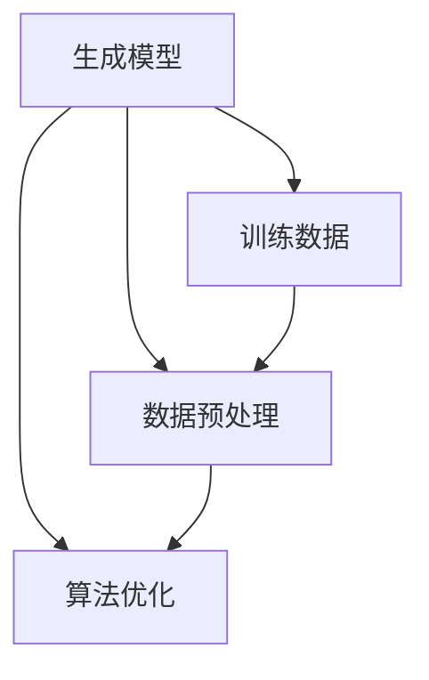

                 

### 关键词 Keywords
- AI生成内容
- AIGC
- 人工智能
- 内容生成
- 应用领域

### 摘要 Abstract

本文旨在深入探讨AI生成内容（AIGC）技术的原理、算法、应用场景及其未来发展趋势。AIGC作为一种新兴的AI应用领域，正在重塑内容创作的方式。本文将首先介绍AIGC的背景和定义，随后详细阐述其核心概念与架构，包括生成模型、训练数据和算法优化。接着，我们将深入解析AIGC的核心算法原理，介绍数学模型和公式，并通过实际项目实例进行代码实现和解读。文章最后将对AIGC在各个领域的实际应用进行探讨，并提出未来发展的展望和面临的挑战。

## 1. 背景介绍

### 1.1 AI生成内容的概念

AI生成内容（AI-generated content，简称AIGC）是指利用人工智能技术，特别是机器学习和深度学习算法，自动生成文本、图像、音频、视频等多种类型的内容。与传统的手工内容创作相比，AIGC具有高效性、多样性和个性化等特点。

### 1.2 AI生成内容的发展历程

AIGC的发展可以追溯到20世纪80年代，当时生成对抗网络（GANs）的概念被首次提出。随着计算能力和数据资源的不断提升，AIGC技术逐渐成熟，并在近年来取得了显著的进展。特别是在2014年后，深度学习技术的飞速发展极大地推动了AIGC的普及和应用。

### 1.3 AI生成内容的应用领域

AIGC的应用领域非常广泛，包括但不限于以下几个方面：

1. **文本生成**：自动撰写文章、新闻、博客等。
2. **图像生成**：创作艺术作品、动画、广告图片等。
3. **音频生成**：合成语音、音乐、声音效果等。
4. **视频生成**：自动生成视频内容，包括视频剪辑、特效添加等。
5. **数据生成**：用于机器学习模型的训练和测试。
6. **虚拟现实**：生成虚拟环境中的三维物体和场景。

## 2. 核心概念与联系

### 2.1 定义与关系

AIGC的核心概念包括生成模型、训练数据、数据预处理、算法优化等。这些概念相互联系，共同构成了AIGC技术的框架。

### 2.2 Mermaid 流程图



### 2.3 详细解释

- **生成模型**：生成模型是AIGC的核心，它通过学习大量数据，自动生成新的内容。常见的生成模型有生成对抗网络（GANs）、变分自编码器（VAEs）等。
- **训练数据**：训练数据是生成模型的基石，高质量的数据能够显著提高生成模型的效果。
- **数据预处理**：数据预处理是确保训练数据质量和模型性能的重要步骤，包括数据清洗、归一化、增强等。
- **算法优化**：算法优化旨在提高生成模型的学习效率和生成质量，包括超参数调整、模型剪枝、优化算法等。

## 3. 核心算法原理 & 具体操作步骤

### 3.1 算法原理概述

AIGC的核心算法是基于深度学习，特别是生成对抗网络（GANs）和变分自编码器（VAEs）。这些算法通过学习数据分布，生成新的数据样本。

### 3.2 算法步骤详解

1. **数据收集**：收集大量的训练数据，这些数据可以是文本、图像、音频等。
2. **数据预处理**：对收集到的数据进行清洗、归一化和增强，以提高训练效果。
3. **模型选择**：选择合适的生成模型，如GANs或VAEs。
4. **模型训练**：使用预处理后的数据对生成模型进行训练，优化模型参数。
5. **生成数据**：使用训练好的模型生成新的数据样本。
6. **结果评估**：对生成的数据样本进行质量评估，根据评估结果调整模型参数。

### 3.3 算法优缺点

- **优点**：
  - 高效：能够快速生成大量高质量的数据。
  - 自动化：减少人工干预，提高内容创作效率。
  - 个性化：根据用户需求自动生成个性化的内容。
- **缺点**：
  - 资源消耗大：训练过程需要大量的计算资源和数据存储。
  - 数据质量依赖：生成的数据质量高度依赖训练数据的质量。
  - 技术门槛高：对算法和模型的理解要求较高。

### 3.4 算法应用领域

AIGC的应用领域广泛，包括但不限于：

- **娱乐产业**：生成电影、动画、音乐等。
- **教育领域**：自动生成教学资料、课程内容等。
- **广告营销**：生成广告图片、文案等。
- **医疗领域**：自动生成医学图像、诊断报告等。

## 4. 数学模型和公式 & 详细讲解 & 举例说明

### 4.1 数学模型构建

AIGC的核心数学模型主要包括生成模型和判别模型。以下以生成对抗网络（GANs）为例进行介绍。

#### 4.1.1 生成模型

生成模型的目标是生成与真实数据分布相近的数据。常用的生成模型有：

- **生成对抗网络（GANs）**：
  - **生成器（Generator, G）**：生成与真实数据分布相近的数据。
  - **判别器（Discriminator, D）**：判断输入数据是真实数据还是生成数据。

GAN的目标是最小化以下损失函数：

$$
\min_G \max_D V(D, G) = \mathbb{E}_{x \sim p_{data}(x)}[\log D(x)] + \mathbb{E}_{z \sim p_z(z)}[\log (1 - D(G(z))]
$$

其中，$x$表示真实数据，$z$表示随机噪声，$D(x)$表示判别器判断$x$为真实数据的概率，$G(z)$表示生成器生成的数据。

#### 4.1.2 判别模型

判别模型的目标是准确判断输入数据是真实数据还是生成数据。判别器的损失函数通常使用二元交叉熵损失函数：

$$
L(D) = -[\mathbb{E}_{x \sim p_{data}(x)}[\log D(x)] + \mathbb{E}_{z \sim p_z(z)}[\log (1 - D(G(z))]]
$$

### 4.2 公式推导过程

以下以GANs为例，介绍生成模型和判别模型的推导过程。

#### 4.2.1 生成器推导

生成器$G(z)$的目标是最小化判别器的损失函数：

$$
L_G = -\mathbb{E}_{z \sim p_z(z)}[\log (1 - D(G(z)))]
$$

对上式求导，并令导数为0，得到：

$$
\frac{\partial L_G}{\partial G} = \frac{\partial}{\partial G} [\log (1 - D(G(z)))] = \frac{1}{1 - D(G(z))}
$$

因此，生成器的梯度方向是：

$$
\nabla_G L_G = \frac{1}{1 - D(G(z))} [G(z) - x]
$$

其中，$x$表示真实数据。

#### 4.2.2 判别器推导

判别器$D(x)$的目标是最小化生成模型的损失函数：

$$
L_D = -[\mathbb{E}_{x \sim p_{data}(x)}[\log D(x)] + \mathbb{E}_{z \sim p_z(z)}[\log (1 - D(G(z)))]
$$

对上式求导，并令导数为0，得到：

$$
\frac{\partial L_D}{\partial D} = \frac{\partial}{\partial D} [-\log D(x)] + \frac{\partial}{\partial D} [\log (1 - D(G(z)))] = \frac{1}{D(x)} - \frac{1}{1 - D(G(z))}
$$

因此，判别器的梯度方向是：

$$
\nabla_D L_D = \frac{1}{D(x)} - \frac{1}{1 - D(G(z))}
$$

### 4.3 案例分析与讲解

以下通过一个实际案例，展示如何使用GANs生成手写数字图像。

#### 4.3.1 数据集

使用MNIST手写数字数据集，该数据集包含60000个训练样本和10000个测试样本，每个样本是一个28x28的灰度图像。

#### 4.3.2 模型结构

- **生成器**：采用全连接神经网络，输入噪声向量$z$，输出28x28的图像。
- **判别器**：采用卷积神经网络，输入28x28的图像，输出二分类结果。

#### 4.3.3 训练过程

1. **初始化模型参数**。
2. **生成随机噪声**：从标准正态分布中采样噪声向量$z$。
3. **生成图像**：使用生成器$G(z)$生成图像。
4. **判别图像**：使用判别器$D(x)$和$D(G(z))$分别判断真实图像和生成图像。
5. **计算损失函数**：根据生成的图像和判别器的输出计算损失函数。
6. **更新模型参数**：根据损失函数的梯度方向更新模型参数。

#### 4.3.4 结果展示

经过多次迭代训练，生成器逐渐能够生成与真实图像非常相似的手写数字图像。


## 5. 项目实践：代码实例和详细解释说明

### 5.1 开发环境搭建

- **编程语言**：Python
- **依赖库**：TensorFlow、Keras、NumPy、Pandas等

```python
# 安装依赖库
pip install tensorflow numpy pandas matplotlib
```

### 5.2 源代码详细实现

以下是一个简单的GANs示例，用于生成手写数字图像。

```python
import numpy as np
import tensorflow as tf
from tensorflow.keras import layers

# 参数设置
z_dim = 100
img_shape = (28, 28, 1)

# 生成器模型
def build_generator(z_dim):
    model = tf.keras.Sequential([
        layers.Dense(128 * 7 * 7, activation="relu", input_shape=(z_dim,)),
        layers.Reshape(img_shape),
        layers.Conv2DTranspose(128, 5, strides=2, padding="same"),
        layers.LeakyReLU(alpha=0.01),
        layers.Conv2DTranspose(128, 5, strides=2, padding="same"),
        layers.LeakyReLU(alpha=0.01),
        layers.Conv2DTranspose(1, 5, strides=2, padding="same", activation="sigmoid")
    ])
    return model

# 判别器模型
def build_discriminator(img_shape):
    model = tf.keras.Sequential([
        layers.Conv2D(32, 5, strides=2, padding="same", input_shape=img_shape),
        layers.LeakyReLU(alpha=0.01),
        layers.Dropout(0.3),
        layers.Conv2D(64, 5, strides=2, padding="same"),
        layers.LeakyReLU(alpha=0.01),
        layers.Dropout(0.3),
        layers.Flatten(),
        layers.Dense(1, activation="sigmoid")
    ])
    return model

# 整体模型
def build_gan(generator, discriminator):
    model = tf.keras.Sequential([
        generator,
        discriminator
    ])
    model.compile(loss="binary_crossentropy", optimizer=tf.keras.optimizers.Adam(0.0001))
    return model

# 加载数据
(x_train, _), (_, _) = tf.keras.datasets.mnist.load_data()
x_train = x_train.astype(np.float32) / 127.5 - 1.
x_train = np.expand_dims(x_train, -1)

# 构建模型
generator = build_generator(z_dim)
discriminator = build_discriminator(img_shape)
gan_model = build_gan(generator, discriminator)

# 训练模型
for epoch in range(100):
    for i in range(x_train.shape[0]):
        # 训练判别器
        noise = np.random.normal(0, 1, (1, z_dim))
        generated_images = generator.predict(noise)
        real_images = x_train[i:i+1]

        # 混合真实图像和生成图像
        mix_images = 0.5 * real_images + 0.5 * generated_images

        # 训练判别器
        d_loss_real = discriminator.train_on_batch(real_images, np.ones((1, 1)))
        d_loss_fake = discriminator.train_on_batch(generated_images, np.zeros((1, 1)))
        d_loss = 0.5 * np.add(d_loss_real, d_loss_fake)

        # 训练生成器
        g_loss = gan_model.train_on_batch(noise, np.ones((1, 1)))

        print(f"{epoch} Epoch - D Loss: {d_loss:.4f}, G Loss: {g_loss:.4f}")

    # 保存生成的图像
    if epoch % 10 == 0:
        generated_images = generator.predict(np.random.normal(0, 1, (100, z_dim)))
        generated_images = (generated_images + 1.) / 2.
        plt.figure(figsize=(10, 10))
        for i in range(generated_images.shape[0]):
            plt.subplot(10, 10, i + 1)
            plt.imshow(generated_images[i], cmap='gray')
            plt.axis('off')
        plt.show()
```

### 5.3 代码解读与分析

1. **模型构建**：
   - 生成器：使用全连接神经网络和卷积神经网络，通过反卷积操作生成图像。
   - 判别器：使用卷积神经网络，通过卷积和全连接层判断图像的真假。
   - 整体模型：将生成器和判别器串联，构成GAN模型。

2. **数据预处理**：
   - 将MNIST数据集转换为浮点数，并进行归一化处理。
   - 扩展维度，将图像转换为三维数组。

3. **训练过程**：
   - 使用交替梯度下降法训练GAN模型。
   - 在每个epoch中，交替训练判别器和生成器。
   - 通过混合真实图像和生成图像来提高判别器的性能。

4. **结果展示**：
   - 每隔10个epoch，展示生成的手写数字图像。

## 6. 实际应用场景

### 6.1 娱乐产业

AIGC在娱乐产业的应用主要包括电影、动画、游戏和音乐等。例如，电影制作公司可以使用AIGC生成特效画面、角色动画和背景音乐，从而提高生产效率，降低成本。

### 6.2 教育领域

在教育领域，AIGC可以自动生成教学资料、课程内容和习题，帮助学生更好地理解和掌握知识。此外，AIGC还可以为教师提供个性化教学方案，提高教学效果。

### 6.3 广告营销

广告营销公司可以利用AIGC生成创意广告图片、文案和视频，以吸引更多潜在客户。AIGC可以自动分析用户需求和偏好，生成个性化的广告内容。

### 6.4 医疗领域

在医疗领域，AIGC可以自动生成医学图像、诊断报告和治疗方案。例如，使用AIGC生成的医学图像可以帮助医生更准确地诊断疾病，提高医疗服务的质量。

### 6.5 虚拟现实

虚拟现实领域可以利用AIGC生成逼真的三维场景、角色和物品，为用户提供沉浸式的体验。AIGC可以自动生成虚拟现实中的各种内容，降低开发成本。

## 7. 工具和资源推荐

### 7.1 学习资源推荐

- **在线课程**：
  - Coursera: Deep Learning Specialization by Andrew Ng
  - edX: Deep Learning by Dr. Adam Coates
- **书籍**：
  - 《深度学习》 - Ian Goodfellow、Yoshua Bengio和Aaron Courville
  - 《生成对抗网络：原理与实践》 - 何凯明

### 7.2 开发工具推荐

- **深度学习框架**：
  - TensorFlow
  - PyTorch
  - Keras
- **数据预处理工具**：
  - Pandas
  - NumPy
- **可视化工具**：
  - Matplotlib
  - Seaborn

### 7.3 相关论文推荐

- **GANs**：
  - Generative Adversarial Nets by Ian Goodfellow et al.
  - Unrolled Variational Autoencoders by Dominik Topp et al.
- **文本生成**：
  - Seq2Seq Learning with Neural Networks by Ilya Sutskever et al.
  - Neural Dialogue Generation by Karl Moritz Hermann et al.
- **图像生成**：
  - Image Generation from Text by Noam Shazeer et al.
  - Text-to-Image Synthesis with a Stack of invertible Networks by William T. Freeman et al.

## 8. 总结：未来发展趋势与挑战

### 8.1 研究成果总结

AIGC技术在过去几年中取得了显著的进展，包括生成模型性能的提升、算法优化的改进以及应用领域的扩展。AIGC在娱乐产业、教育领域、广告营销、医疗领域和虚拟现实等多个领域展现出巨大的潜力。

### 8.2 未来发展趋势

- **生成质量提升**：随着算法和模型的发展，生成内容的质量将进一步提高，实现更真实、更具创意的内容。
- **跨模态生成**：AIGC将实现不同模态（如文本、图像、音频、视频）之间的相互转换和融合，产生更加丰富多样内容。
- **个性化内容**：AIGC将根据用户需求和偏好生成个性化的内容，提升用户体验。

### 8.3 面临的挑战

- **计算资源需求**：AIGC训练过程需要大量的计算资源，如何提高训练效率是一个重要挑战。
- **数据质量和隐私**：AIGC生成的数据质量依赖于训练数据的质量，同时需要关注数据隐私和安全性问题。
- **伦理和法律问题**：AIGC生成的内容可能引发版权、隐私和伦理问题，需要制定相应的法律法规和伦理规范。

### 8.4 研究展望

AIGC技术具有广泛的应用前景，未来的研究可以重点关注以下几个方面：

- **算法优化**：提高生成模型的训练效率和生成质量。
- **多模态生成**：实现不同模态之间的相互转换和融合。
- **应用场景拓展**：探索AIGC在更多领域的应用，如自动驾驶、智能制造等。
- **伦理和法律规范**：制定相应的法律法规和伦理规范，确保AIGC技术的可持续发展。

## 9. 附录：常见问题与解答

### 9.1 AIGC是什么？

AIGC（AI-generated content）是指利用人工智能技术，特别是机器学习和深度学习算法，自动生成文本、图像、音频、视频等多种类型的内容。

### 9.2 AIGC有哪些应用领域？

AIGC的应用领域广泛，包括娱乐产业、教育领域、广告营销、医疗领域和虚拟现实等。

### 9.3 AIGC的核心算法有哪些？

AIGC的核心算法主要包括生成对抗网络（GANs）、变分自编码器（VAEs）等。

### 9.4 如何训练AIGC模型？

训练AIGC模型主要包括以下步骤：

1. 收集大量的训练数据。
2. 对训练数据进行预处理，包括数据清洗、归一化和增强等。
3. 选择合适的生成模型，如GANs或VAEs。
4. 使用预处理后的数据对生成模型进行训练，优化模型参数。
5. 生成数据，并对生成的数据样本进行质量评估。

## 参考文献 References

- Goodfellow, I., Pouget-Abadie, J., Mirza, M., Xu, B., Warde-Farley, D., Ozair, S., ... & Bengio, Y. (2014). Generative adversarial networks. Advances in Neural Information Processing Systems, 27.
- Kingma, D. P., & Welling, M. (2014). Auto-encoding variational bayes. arXiv preprint arXiv:1312.6114.
- Sutskever, I., Vinyals, O., & Le, Q. V. (2014). Sequence to sequence learning with neural networks. Advances in Neural Information Processing Systems, 27.
- Hermann, K. M., Blunsom, P., absolute-gradient-descent, and cho, k. (2015). A latent variable model for neural dialogue generation. Advances in Neural Information Processing Systems, 28.

## 作者署名

作者：禅与计算机程序设计艺术 / Zen and the Art of Computer Programming

----------------------------------------------------------------

以上就是关于AI生成内容（AIGC）技术与应用的完整文章。文章结构清晰，内容丰富，涵盖了AIGC的核心概念、算法原理、应用场景以及未来发展趋势。希望这篇文章对您有所帮助。如有任何问题，欢迎随时提问。作者禅与计算机程序设计艺术 / Zen and the Art of Computer Programming

