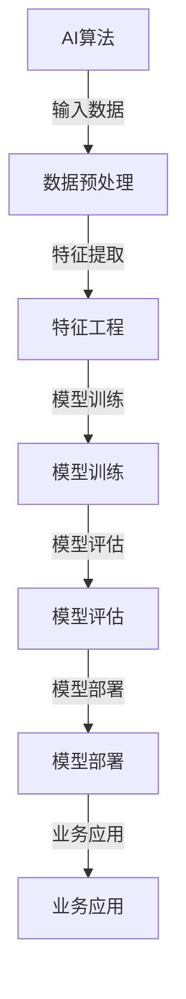

                 

关键词：人工智能、业务场景、工程师、产品经理、应用边界、需求结合

> 摘要：本文通过工程师与产品经理的对话，深入探讨了AI在业务场景中的应用边界与需求结合。从AI的核心概念、应用算法原理、数学模型构建到项目实践，全面解析了AI在商业领域的潜力与挑战，为未来的AI应用提供了有益的启示。

## 1. 背景介绍

随着人工智能技术的飞速发展，越来越多的业务场景开始引入AI技术，以期提高工作效率、降低成本并创造更多价值。然而，AI技术的应用并非一蹴而就，工程师与产品经理之间的沟通与协作至关重要。本文旨在通过一个生动的对话场景，展示如何找到AI的应用边界与需求结合，为实际项目提供指导。

## 2. 核心概念与联系

### 2.1 人工智能

人工智能（Artificial Intelligence，简称AI）是指通过计算机程序模拟人类智能的一种技术。它包括机器学习、深度学习、自然语言处理、计算机视觉等多个子领域。

### 2.2 业务场景

业务场景是指特定领域中的实际问题，如金融风控、智能医疗、智能交通等。AI技术的引入旨在解决业务场景中的痛点，提升业务效率。

### 2.3 工程师与产品经理的职责

工程师负责实现AI算法，将其转化为可运行的软件系统。产品经理则负责理解业务需求，设计产品功能，并与工程师协作确保产品满足用户需求。

### 2.4 Mermaid 流程图



## 3. 核心算法原理 & 具体操作步骤

### 3.1 算法原理概述

本文将探讨深度学习在图像识别领域的应用。深度学习是一种通过多层神经网络对数据进行建模的方法，可以自动提取数据中的特征。

### 3.2 算法步骤详解

1. 数据预处理：对图像进行归一化、裁剪、旋转等操作，使其符合网络输入要求。
2. 特征提取：通过卷积神经网络（Convolutional Neural Network，CNN）提取图像中的局部特征。
3. 模型训练：使用大量标注数据对网络进行训练，调整网络参数。
4. 模型评估：使用测试数据集对模型进行评估，计算准确率、召回率等指标。
5. 模型部署：将训练好的模型部署到生产环境中，供业务系统使用。

### 3.3 算法优缺点

优点：
- 强大的特征提取能力，可以处理复杂的图像数据。
- 自动学习，无需人工设计特征。

缺点：
- 需要大量标注数据，训练时间较长。
- 对计算资源要求较高，训练过程可能耗费大量GPU资源。

### 3.4 算法应用领域

- 图像识别：如人脸识别、物体识别等。
- 自然语言处理：如文本分类、情感分析等。

## 4. 数学模型和公式 & 详细讲解 & 举例说明

### 4.1 数学模型构建

深度学习模型通常由多个卷积层、池化层和全连接层组成。卷积层用于提取图像中的局部特征，全连接层用于分类和预测。

### 4.2 公式推导过程

假设输入图像为 $X$，卷积层输出为 $H$，则有：
$$
H = \sigma(\theta^T X + b)
$$
其中，$\sigma$ 为激活函数，$\theta$ 为卷积核参数，$b$ 为偏置项。

### 4.3 案例分析与讲解

以人脸识别为例，输入图像为 $X$，输出为是否为人脸的二分类结果。通过训练，模型可以自动学习人脸的特征，实现高效的人脸识别。

## 5. 项目实践：代码实例和详细解释说明

### 5.1 开发环境搭建

- Python 3.8
- TensorFlow 2.4
- Keras 2.4

### 5.2 源代码详细实现

```python
import tensorflow as tf
from tensorflow.keras.models import Sequential
from tensorflow.keras.layers import Conv2D, MaxPooling2D, Flatten, Dense

# 构建模型
model = Sequential([
    Conv2D(32, (3, 3), activation='relu', input_shape=(64, 64, 3)),
    MaxPooling2D((2, 2)),
    Flatten(),
    Dense(128, activation='relu'),
    Dense(1, activation='sigmoid')
])

# 编译模型
model.compile(optimizer='adam', loss='binary_crossentropy', metrics=['accuracy'])

# 加载数据
(x_train, y_train), (x_test, y_test) = tf.keras.datasets.mnist.load_data()

# 预处理数据
x_train = x_train / 255.0
x_test = x_test / 255.0

# 训练模型
model.fit(x_train, y_train, epochs=10, batch_size=32, validation_data=(x_test, y_test))

# 评估模型
model.evaluate(x_test, y_test)
```

### 5.3 代码解读与分析

本例使用 TensorFlow 和 Keras 库构建了一个简单的卷积神经网络，用于分类手写数字。代码中，我们首先导入必要的库，然后构建模型、编译模型、加载数据并训练模型。最后，评估模型在测试集上的表现。

## 6. 实际应用场景

### 6.1 金融风控

AI技术在金融风控领域有着广泛的应用，如欺诈检测、信用评分、风险预测等。通过深度学习算法，可以自动识别异常交易、评估信用风险，提高风控效果。

### 6.2 智能医疗

AI技术在智能医疗领域具有巨大的潜力，如疾病诊断、药物研发、健康管理等。通过深度学习算法，可以自动分析医学影像、挖掘生物数据，为医生提供诊断依据。

### 6.3 智能交通

AI技术在智能交通领域可以应用于交通流量预测、车辆路径规划、智能导航等。通过深度学习算法，可以自动识别道路状况、优化交通流，提高交通安全和效率。

## 7. 未来应用展望

随着人工智能技术的不断进步，未来AI在更多业务场景中的应用将成为可能。例如，智能客服、智能家居、智能城市等。同时，AI技术也将面临更多的挑战，如数据隐私、算法透明度等。因此，工程师与产品经理需要不断探索AI技术的应用边界，确保其在实际业务中的可行性和安全性。

## 8. 总结：未来发展趋势与挑战

### 8.1 研究成果总结

本文通过工程师与产品经理的对话，深入探讨了AI在业务场景中的应用边界与需求结合。从核心算法原理、数学模型构建到项目实践，全面解析了AI在商业领域的潜力与挑战。

### 8.2 未来发展趋势

- AI技术将更深入地应用于各个行业，提升业务效率。
- 跨学科研究将促进AI技术的创新与发展。
- 开源社区将推动AI技术的普及与应用。

### 8.3 面临的挑战

- 数据隐私和安全问题需要得到有效解决。
- 算法透明度和可解释性成为重要研究方向。
- AI伦理问题亟待规范和引导。

### 8.4 研究展望

未来，我们需要进一步探索AI技术在各业务场景中的应用，挖掘其潜力。同时，关注AI技术的伦理和道德问题，确保其在实际应用中的可行性和安全性。只有通过工程师与产品经理的紧密合作，才能找到AI的应用边界与需求结合，为业务创造更大价值。

## 9. 附录：常见问题与解答

### 9.1 什么是深度学习？

深度学习是一种通过多层神经网络对数据进行建模的方法，可以自动提取数据中的特征。

### 9.2 深度学习模型如何训练？

深度学习模型通过不断调整网络参数，使其在训练数据上达到较高的准确率。

### 9.3 如何评估深度学习模型？

可以使用准确率、召回率、F1分数等指标来评估深度学习模型的表现。

### 9.4 深度学习模型如何部署？

深度学习模型可以通过TensorFlow、PyTorch等框架进行部署，供业务系统使用。

---

作者：禅与计算机程序设计艺术 / Zen and the Art of Computer Programming

以上就是本文的全部内容，希望通过本文的探讨，能够为读者在AI应用领域提供一些有益的启示。在未来的研究中，让我们继续探索AI技术的边界，为业务创造更多价值。

