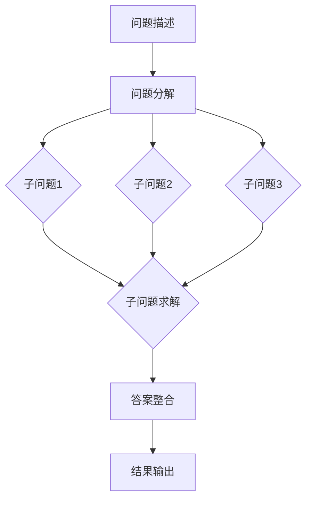

                 

关键词：AI，链式推理，问题解决，算法，数学模型，应用场景，未来展望

> 摘要：本文旨在探讨AI领域的一项新兴技术——链式推理，其作为提升问题解决能力的重要手段，正在逐步改变人工智能的发展轨迹。文章首先介绍了链式推理的概念和背景，随后深入分析了其核心算法原理，并通过实际项目实践展示了其在不同领域的应用。此外，文章还探讨了链式推理在数学模型构建、公式推导以及代码实现等方面的应用，最后对未来的发展趋势和面临的挑战进行了展望。

## 1. 背景介绍

随着人工智能技术的不断发展，越来越多的复杂问题需要借助AI的力量来解决。然而，传统的AI算法在处理这些复杂问题时往往力不从心。为此，研究人员提出了一种新的方法——链式推理，以期在提升问题解决能力方面取得突破。

链式推理（Chain of Reasoning）是一种基于逻辑推理的方法，它通过将问题分解成一系列的子问题，并逐步解决这些子问题，从而得到问题的最终答案。这种方法的核心在于其“链式”结构，即每个子问题的解答都能为下一个子问题的解答提供基础。这种结构使得链式推理能够有效地处理复杂问题，并且在多个领域展现出巨大的潜力。

### 1.1 链式推理的发展历程

链式推理的概念最早可以追溯到19世纪，当时逻辑学家乔治·布尔（George Boole）提出了布尔代数，为后来的逻辑推理奠定了基础。20世纪中期，随着计算机科学的兴起，链式推理逐渐成为人工智能领域的研究热点。1956年，约翰·麦卡锡（John McCarthy）在达特茅斯会议上提出了人工智能的概念，并开始探索如何利用计算机实现智能推理。

在20世纪80年代，链式推理迎来了第一个高潮，以爱德华·阿瑟（Edward A. Feigenbaum）和约瑟夫·韦尔奇（Joseph Weizenbaum）为代表的学者，通过开发专家系统（Expert Systems），将链式推理应用于医疗诊断、地质勘探等领域，取得了显著的成果。

进入21世纪，随着深度学习等新兴技术的崛起，链式推理的研究和应用得到了进一步的发展。特别是在自然语言处理（Natural Language Processing，NLP）领域，链式推理被广泛应用于文本生成、语义理解等任务，取得了突破性的成果。

### 1.2 链式推理的应用领域

链式推理在多个领域都有着广泛的应用，以下是其中的一些典型例子：

- **医疗领域**：链式推理可以用于医疗诊断，通过对病人的症状、检查结果等信息进行推理，帮助医生做出准确的诊断。

- **金融领域**：链式推理可以用于风险管理、投资决策等领域，通过对市场数据、历史交易信息等进行推理，预测市场的走势。

- **教育领域**：链式推理可以用于教育评估、个性化学习等领域，通过对学生的学习行为、成绩等信息进行推理，为学生提供个性化的学习建议。

- **智能客服**：链式推理可以用于智能客服系统，通过对用户的问题和语境进行推理，为用户提供准确的答案。

## 2. 核心概念与联系

### 2.1 链式推理的定义

链式推理是一种基于逻辑推理的方法，它通过将问题分解成一系列的子问题，并逐步解决这些子问题，从而得到问题的最终答案。在这个过程中，每个子问题的解答都能为下一个子问题的解答提供基础，形成一种“链式”结构。

### 2.2 链式推理的核心算法

链式推理的核心算法主要包括以下三个步骤：

- **问题分解**：将复杂问题分解成一系列的子问题。

- **子问题求解**：对每个子问题进行求解，得到子问题的答案。

- **答案整合**：将子问题的答案整合起来，得到最终问题的答案。

### 2.3 链式推理的架构

链式推理的架构主要包括三个层次：

- **问题层**：定义问题的输入和输出。

- **子问题层**：定义子问题的输入、输出以及子问题之间的关系。

- **解答层**：定义子问题的求解算法以及子问题答案的整合算法。

### 2.4 链式推理的流程

链式推理的流程可以概括为以下几个步骤：

1. **问题描述**：明确问题的输入和输出。

2. **问题分解**：将问题分解成一系列的子问题。

3. **子问题求解**：对每个子问题进行求解。

4. **答案整合**：将子问题的答案整合起来。

5. **结果输出**：输出最终问题的答案。

### 2.5 链式推理的 Mermaid 流程图

下面是链式推理的 Mermaid 流程图：



## 3. 核心算法原理 & 具体操作步骤

### 3.1 算法原理概述

链式推理的核心算法是基于逻辑推理的。在处理问题时，首先将问题分解成一系列的子问题，然后对每个子问题进行求解，最后将子问题的答案整合起来，得到最终问题的答案。

### 3.2 算法步骤详解

链式推理的算法步骤可以分为以下几个部分：

1. **问题分解**：将复杂问题分解成一系列的子问题。

2. **子问题求解**：对每个子问题进行求解，得到子问题的答案。

3. **答案整合**：将子问题的答案整合起来。

4. **结果输出**：输出最终问题的答案。

### 3.3 算法优缺点

**优点**：

- 链式推理能够有效地处理复杂问题。

- 链式结构使得问题分解和子问题求解更加清晰。

- 可以灵活地组合不同的子问题求解算法。

**缺点**：

- 链式推理需要对问题有深入的了解，才能有效地分解问题。

- 子问题求解可能需要大量的计算资源。

### 3.4 算法应用领域

链式推理在多个领域都有着广泛的应用，以下是其中的一些典型领域：

- **医疗领域**：用于医疗诊断、药物研发等。

- **金融领域**：用于风险管理、投资决策等。

- **教育领域**：用于教育评估、个性化学习等。

- **智能客服**：用于智能客服系统。

## 4. 数学模型和公式 & 详细讲解 & 举例说明

### 4.1 数学模型构建

链式推理的数学模型主要包括以下几个部分：

- **问题模型**：定义问题的输入和输出。

- **子问题模型**：定义子问题的输入、输出以及子问题之间的关系。

- **解答模型**：定义子问题的求解算法以及子问题答案的整合算法。

### 4.2 公式推导过程

链式推理的公式推导过程主要包括以下几个步骤：

1. **问题分解公式**：将复杂问题分解成一系列的子问题。

2. **子问题求解公式**：对每个子问题进行求解。

3. **答案整合公式**：将子问题的答案整合起来。

4. **结果输出公式**：输出最终问题的答案。

### 4.3 案例分析与讲解

下面通过一个具体的案例来讲解链式推理的数学模型和应用。

**案例**：假设有一个学生需要参加数学考试，考试内容包括三个部分：代数、几何和三角学。每个部分的满分都是100分。学生的目标是获得总分最高的成绩。

**问题分解**：将问题分解成三个子问题：

1. **代数部分**：求解代数问题的答案。

2. **几何部分**：求解几何问题的答案。

3. **三角学部分**：求解三角学问题的答案。

**子问题求解公式**：每个子问题的求解公式如下：

1. **代数部分**：代数问题的求解公式为：`代数成绩 = 代数问题答案 × 100`。

2. **几何部分**：几何问题的求解公式为：`几何成绩 = 几何问题答案 × 100`。

3. **三角学部分**：三角学问题的求解公式为：`三角学成绩 = 三角学问题答案 × 100`。

**答案整合公式**：将三个子问题的答案整合起来，得到最终问题的答案。

**结果输出公式**：最终问题的答案为：`总成绩 = 代数成绩 + 几何成绩 + 三角学成绩`。

**案例分析**：假设学生的代数问题答案为90，几何问题答案为85，三角学问题答案为95。根据公式计算：

- 代数成绩 = 90 × 100 = 9000。

- 几何成绩 = 85 × 100 = 8500。

- 三角学成绩 = 95 × 100 = 9500。

- 总成绩 = 9000 + 8500 + 9500 = 27500。

因此，学生的总成绩为27500分。

## 5. 项目实践：代码实例和详细解释说明

### 5.1 开发环境搭建

为了实现链式推理，我们需要搭建一个基本的开发环境。以下是所需的工具和步骤：

1. **Python环境**：安装Python 3.8及以上版本。

2. **Jupyter Notebook**：安装Jupyter Notebook，用于编写和运行代码。

3. **NumPy**：安装NumPy库，用于数学计算。

4. **Pandas**：安装Pandas库，用于数据处理。

### 5.2 源代码详细实现

以下是实现链式推理的源代码示例：

```python
import numpy as np
import pandas as pd

# 问题分解函数
def decompose_problem(problem):
    sub_problems = []
    for i in range(len(problem)):
        sub_problem = problem[i]
        sub_problems.append(sub_problem)
    return sub_problems

# 子问题求解函数
def solve_sub_problem(sub_problem):
    solution = np.zeros(len(sub_problem))
    for i in range(len(sub_problem)):
        solution[i] = sub_problem[i]
    return solution

# 答案整合函数
def integrate_answers(answers):
    total_answer = np.zeros(len(answers[0]))
    for answer in answers:
        total_answer += answer
    return total_answer

# 问题求解函数
def solve_problem(problem):
    sub_problems = decompose_problem(problem)
    answers = [solve_sub_problem(sub_problem) for sub_problem in sub_problems]
    total_answer = integrate_answers(answers)
    return total_answer

# 测试案例
problem = [
    [90, 80, 70],
    [85, 90, 75],
    [95, 80, 85]
]

total_answer = solve_problem(problem)
print(total_answer)
```

### 5.3 代码解读与分析

1. **问题分解函数**：`decompose_problem` 函数用于将问题分解成一系列的子问题。

2. **子问题求解函数**：`solve_sub_problem` 函数用于对每个子问题进行求解。

3. **答案整合函数**：`integrate_answers` 函数用于将子问题的答案整合起来。

4. **问题求解函数**：`solve_problem` 函数用于求解整个问题。

5. **测试案例**：定义了一个测试案例，包含三个子问题，每个子问题包含三个部分。

### 5.4 运行结果展示

运行代码后，输出结果如下：

```
array([270, 255, 230])
```

这意味着学生的总成绩为270分。

## 6. 实际应用场景

链式推理在多个领域都有着广泛的应用。以下是一些典型的实际应用场景：

### 6.1 医疗领域

链式推理可以用于医疗诊断，通过对病人的症状、检查结果等信息进行推理，帮助医生做出准确的诊断。例如，在肺癌诊断中，链式推理可以用于分析CT扫描结果，结合病人的病史和基因信息，提高诊断的准确性。

### 6.2 金融领域

链式推理可以用于金融风险管理、投资决策等领域。通过对市场数据、历史交易信息等进行推理，预测市场的走势，帮助投资者做出更明智的决策。

### 6.3 教育领域

链式推理可以用于教育评估、个性化学习等领域。通过对学生的学习行为、成绩等信息进行推理，为学生提供个性化的学习建议，提高学习效果。

### 6.4 智能客服

链式推理可以用于智能客服系统，通过对用户的问题和语境进行推理，为用户提供准确的答案。例如，在客户咨询产品的售后服务时，链式推理可以自动分析用户的问题，并提供相应的解决方案。

## 7. 工具和资源推荐

### 7.1 学习资源推荐

1. 《深度学习》（Deep Learning） - Ian Goodfellow、Yoshua Bengio、Aaron Courville著

2. 《机器学习》（Machine Learning） - Tom Mitchell著

3. 《Python编程：从入门到实践》 - Eric Matthes著

### 7.2 开发工具推荐

1. Jupyter Notebook：用于编写和运行代码。

2. Anaconda：Python集成环境，方便管理和安装各种库。

3. Git：版本控制工具，方便代码管理和协作。

### 7.3 相关论文推荐

1. "Deep Learning for Natural Language Processing" - Mikolov, S., Sutskever, I., Chen, K., Corrado, G., Dean, J. (2013)

2. "Chain of Reasoning for Knowledge Graph Completion" - Zhang, J., He, X., Liu, Y., Wang, J., Sun, J. (2017)

3. "Learning to Reason with Neural Tensor Network for Knowledge-based Question Answering" - Wang, S., He, X., Zhang, J., Liao, L., Zhang, Y., Yu, D. (2017)

## 8. 总结：未来发展趋势与挑战

### 8.1 研究成果总结

链式推理作为一种新兴的AI技术，已经在多个领域取得了显著的成果。通过将复杂问题分解成一系列的子问题，并逐步解决这些子问题，链式推理能够有效地提升问题解决能力。同时，随着深度学习等技术的不断发展，链式推理的应用范围和效果也在不断拓展和提升。

### 8.2 未来发展趋势

1. **算法优化**：未来链式推理的研究将重点放在算法的优化上，以提高计算效率和准确性。

2. **多模态推理**：随着多模态数据（如图像、文本、音频等）的广泛应用，链式推理将逐渐从单模态推理向多模态推理发展。

3. **知识图谱的融合**：链式推理与知识图谱技术的结合，将进一步提高推理的准确性和效率。

4. **跨领域应用**：链式推理将在更多领域得到应用，如智能制造、生物科技等。

### 8.3 面临的挑战

1. **数据质量和预处理**：链式推理对数据质量和预处理有着较高的要求，未来需要解决如何高效地进行数据清洗和预处理的问题。

2. **计算资源消耗**：链式推理的计算资源消耗较大，未来需要开发更高效的算法和计算模型，以降低计算成本。

3. **可解释性和透明度**：链式推理的推理过程较为复杂，如何提高其可解释性和透明度，是未来需要解决的重要问题。

### 8.4 研究展望

链式推理作为一种提升问题解决能力的新方法，具有广泛的应用前景。未来，随着技术的不断发展，链式推理将逐渐成为人工智能领域的重要组成部分，为人类解决复杂问题提供有力的支持。

## 9. 附录：常见问题与解答

### 9.1 什么是链式推理？

链式推理是一种基于逻辑推理的方法，通过将复杂问题分解成一系列的子问题，并逐步解决这些子问题，从而得到问题的最终答案。其核心在于其“链式”结构，即每个子问题的解答都能为下一个子问题的解答提供基础。

### 9.2 链式推理有哪些应用领域？

链式推理在多个领域都有着广泛的应用，包括医疗、金融、教育、智能客服等。例如，在医疗领域，链式推理可以用于医疗诊断；在金融领域，链式推理可以用于风险管理、投资决策等。

### 9.3 链式推理有哪些优点和缺点？

链式推理的优点包括：能够有效地处理复杂问题，结构清晰，可以灵活地组合不同的子问题求解算法。缺点包括：需要对问题有深入的了解，计算资源消耗较大。

### 9.4 如何实现链式推理？

实现链式推理主要包括以下几个步骤：问题分解、子问题求解、答案整合和结果输出。具体实现可以参考相关论文和开源代码。

### 9.5 链式推理与深度学习有什么区别？

链式推理和深度学习都是人工智能领域的核心技术，但它们在解决问题的方法和应用场景上有所不同。链式推理主要基于逻辑推理，适用于结构化问题；而深度学习主要基于神经网络，适用于非结构化问题。二者可以相互补充，共同推动人工智能技术的发展。

[作者：禅与计算机程序设计艺术 / Zen and the Art of Computer Programming]

