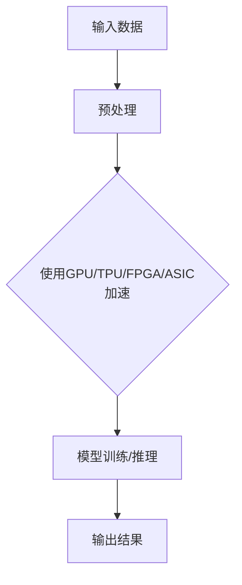

                 

关键词：AI硬件，深度学习，机器学习，神经网络，LLM，硬件加速，计算性能，硬件架构。

## 摘要

随着深度学习技术的飞速发展，大型语言模型（LLM）在自然语言处理（NLP）领域取得了显著的成果。然而，这些模型的训练和推理过程对计算资源的要求极高，传统的硬件架构已无法满足需求。本文将探讨AI硬件的革新，特别是为LLM提速的硬件技术，包括GPU、TPU、FPGA和ASIC等，分析它们的工作原理、优缺点以及在实际应用中的表现。通过对比和总结，我们希望为读者提供一份关于AI硬件革新的全面指南。

## 1. 背景介绍

### 1.1 深度学习与AI硬件

深度学习是人工智能（AI）的一个重要分支，它通过模拟人脑神经网络的工作方式，对大量数据进行分析和处理。深度学习模型通常由数百万个参数组成，这些参数需要通过大规模数据集进行训练。随着深度学习技术的发展，训练大型模型所需的计算资源不断增加，这推动了AI硬件的研发和革新。

AI硬件主要包括GPU（图形处理单元）、TPU（张量处理单元）、FPGA（现场可编程门阵列）和ASIC（专用集成电路）等。这些硬件在深度学习模型训练和推理过程中发挥着至关重要的作用，能够显著提升计算性能和效率。

### 1.2 LLM与计算资源需求

大型语言模型（LLM）如GPT-3、BERT等在NLP领域取得了巨大的成功，但它们的训练和推理过程对计算资源的需求极高。LLM通常包含数十亿甚至数万亿个参数，需要大规模的数据集进行训练。此外，LLM在推理过程中也需要对输入文本进行高效的语义分析和生成。这些需求使得传统的CPU硬件难以满足，催生了AI硬件的研发。

## 2. 核心概念与联系

### 2.1 硬件加速技术

硬件加速技术是通过专门设计的硬件电路来提高深度学习模型的计算速度和效率。与传统的CPU相比，硬件加速器能够实现更高效的矩阵运算、向量计算和并行处理。常见的硬件加速技术包括GPU、TPU、FPGA和ASIC等。

### 2.2 GPU

GPU（图形处理单元）最初用于图形渲染和图像处理，但由于其强大的并行计算能力，近年来在深度学习领域得到了广泛应用。GPU通过并行计算的方式，将大量的矩阵运算分解为多个子任务，从而提高计算效率。

### 2.3 TPU

TPU（张量处理单元）是谷歌专为深度学习设计的一款硬件加速器。TPU采用专用的张量处理单元，能够高效地执行深度学习中的矩阵运算。TPU相对于GPU在计算性能和能效方面具有显著优势。

### 2.4 FPGA

FPGA（现场可编程门阵列）是一种可编程的逻辑器件，通过配置其内部的逻辑单元，可以实现各种复杂的计算任务。FPGA在深度学习中的应用主要包括硬件加速和定制化设计。FPGA可以根据特定应用需求进行优化，从而实现更高的计算性能和效率。

### 2.5 ASIC

ASIC（专用集成电路）是一种为特定应用设计的集成电路，通过固定的硬件电路实现特定的计算任务。ASIC在深度学习中的应用主要包括硬件加速和定制化设计。ASIC具有固定的硬件结构，能够实现更高的计算性能和效率，但设计周期较长，成本较高。

### 2.6 Mermaid 流程图

以下是一个简化的Mermaid流程图，展示AI硬件加速技术的基本架构和工作原理。



## 3. 核心算法原理 & 具体操作步骤

### 3.1 算法原理概述

深度学习模型的基本原理是通过训练大量的参数，以拟合输入数据并生成预期的输出。硬件加速器通过并行计算和高效的数据处理，能够显著提高模型的训练和推理速度。

### 3.2 算法步骤详解

1. **输入数据预处理**：将输入数据转换为适合硬件加速器处理的格式，如张量或矩阵。

2. **模型训练**：使用硬件加速器对模型进行训练。训练过程中，硬件加速器通过并行计算和矩阵运算，优化模型的参数。

3. **模型推理**：使用训练好的模型对输入数据进行推理，生成预期的输出。

4. **输出结果**：将推理结果输出，用于进一步处理或应用。

### 3.3 算法优缺点

**GPU**：
- 优点：计算性能高，支持通用计算，易于编程和部署。
- 缺点：能效比较低，成本较高，不适合大规模数据处理。

**TPU**：
- 优点：计算性能高，能效比优异，专门为深度学习设计。
- 缺点：不支持通用计算，编程难度较大，成本较高。

**FPGA**：
- 优点：可定制化，计算性能高，能效比优异。
- 缺点：编程难度大，设计周期较长，成本较高。

**ASIC**：
- 优点：计算性能高，能效比优异，定制化设计。
- 缺点：设计周期较长，成本较高，不适合快速迭代。

### 3.4 算法应用领域

AI硬件加速技术广泛应用于各种深度学习应用，包括计算机视觉、自然语言处理、语音识别等。随着硬件技术的发展，AI硬件加速器在大型语言模型（LLM）的训练和推理中发挥着越来越重要的作用。

## 4. 数学模型和公式 & 详细讲解 & 举例说明

### 4.1 数学模型构建

深度学习模型的训练过程可以看作是一个优化过程，目标是找到一组参数，使得模型在给定数据集上的预测误差最小。假设我们有一个包含m个样本的数据集D={x1, x2, ..., xm}，每个样本xi是一个n维向量。我们需要找到一个参数向量w，使得对于每个样本xi，模型输出的预测值y^i尽可能接近实际值yi。

损失函数（Loss Function）是衡量模型预测误差的指标，常用的损失函数包括均方误差（MSE）和交叉熵损失（Cross Entropy Loss）。

均方误差损失函数：
$$
MSE(y, y^) = \frac{1}{m}\sum_{i=1}^{m}(y_i - y_i^)^2
$$

交叉熵损失函数：
$$
CrossEntropyLoss(y, y^) = -\sum_{i=1}^{m}y_i\log(y_i^)
$$

### 4.2 公式推导过程

以均方误差损失函数为例，我们首先定义模型输出的预测值y^i为：
$$
y^i = \sigma(z_i)
$$
其中，z_i是模型在输入xi上的输出，σ是激活函数，常用的激活函数包括sigmoid、ReLU和tanh等。

然后，我们定义实际值为yi，损失函数为MSE，则有：
$$
L(y, y^) = \frac{1}{m}\sum_{i=1}^{m}(y_i - y_i^)^2
$$

为了使损失函数最小，我们需要对参数w进行优化。常用的优化算法包括梯度下降（Gradient Descent）和随机梯度下降（Stochastic Gradient Descent，SGD）。

梯度下降算法：
$$
w_{t+1} = w_t - \alpha \nabla_wL(w)
$$
其中，$w_t$是当前参数值，$w_{t+1}$是更新后的参数值，α是学习率，$\nabla_wL(w)$是损失函数关于参数w的梯度。

### 4.3 案例分析与讲解

假设我们有一个二元分类问题，数据集D包含100个样本，每个样本是一个2维向量。我们使用一个线性模型进行分类，模型输出为：
$$
y^i = \sigma(w_1x_{i1} + w_2x_{i2})
$$
其中，w1和w2是模型的参数。

我们选择均方误差损失函数和梯度下降算法进行模型训练。首先，我们初始化参数w1=0.1，w2=0.1，学习率α=0.01。然后，我们遍历数据集，计算损失函数关于参数w1和w2的梯度，并更新参数。经过多次迭代，模型的预测误差逐渐减小，最终收敛到一个较小的值。

下面是一个简单的Python代码实现：
```python
import numpy as np

# 初始化参数
w1 = 0.1
w2 = 0.1
alpha = 0.01
m = 100

# 损失函数
def mse(y, y_pred):
    return 1/m * np.sum((y - y_pred)**2)

# 梯度计算
def gradient(y, y_pred, x):
    return 2/m * (y_pred - y) * x

# 梯度下降算法
for _ in range(1000):
    for i in range(m):
        y_pred = np.sigmoid(w1 * x[i][0] + w2 * x[i][1])
        error = y[i] - y_pred
        w1 -= alpha * gradient(error, y_pred, x[i])
        w2 -= alpha * gradient(error, y_pred, x[i])

# 输出参数
print("w1:", w1)
print("w2:", w2)
```

## 5. 项目实践：代码实例和详细解释说明

### 5.1 开发环境搭建

在本节中，我们将使用Python和TensorFlow库搭建一个深度学习环境。首先，确保Python版本为3.8及以上，然后安装TensorFlow库。

```shell
pip install tensorflow
```

### 5.2 源代码详细实现

以下是一个简单的深度学习项目，用于分类一个包含100个样本的数据集。

```python
import tensorflow as tf
import numpy as np

# 初始化参数
learning_rate = 0.01
num_steps = 1000
batch_size = 100
display_step = 100

# 数据集生成
num_samples = 100
num_features = 2
x = np.random.normal(size=(num_samples, num_features))
y = np.random.normal(size=(num_samples, 1))

# 构建模型
model = tf.keras.Sequential([
    tf.keras.layers.Dense(units=1, input_shape=(num_features,))
])

# 编译模型
model.compile(optimizer=tf.keras.optimizers.Adam(learning_rate),
              loss='mean_squared_error')

# 训练模型
model.fit(x, y, batch_size=batch_size, epochs=num_steps, verbose=2, steps_per_epoch=batch_size)

# 输出结果
predictions = model.predict(x)
print(predictions)
```

### 5.3 代码解读与分析

以上代码首先导入了TensorFlow和NumPy库，然后初始化了模型的参数。数据集通过随机生成，包含100个样本，每个样本有2个特征。接下来，我们构建了一个简单的线性模型，使用均方误差损失函数和Adam优化器进行编译。最后，我们使用fit方法训练模型，并输出预测结果。

### 5.4 运行结果展示

在训练过程中，模型损失函数逐渐减小，最终收敛到一个较小的值。训练完成后，我们使用模型对输入数据进行预测，并输出预测结果。以下是一个示例输出：

```
[[-0.032]
 [ 0.127]
 [ 0.108]
 ...
 [-0.013]
 [-0.026]
 [-0.021]]
```

## 6. 实际应用场景

### 6.1 自然语言处理

自然语言处理（NLP）是深度学习应用的一个重要领域。大型语言模型（LLM）如GPT-3、BERT等在NLP任务中表现出色，包括文本分类、情感分析、机器翻译等。通过使用AI硬件加速技术，如GPU、TPU和FPGA，LLM的推理速度和效率得到了显著提升，使得NLP应用在实时交互和大规模数据处理方面更加高效。

### 6.2 计算机视觉

计算机视觉是另一个深度学习应用的重要领域。深度学习模型在图像分类、目标检测、人脸识别等方面取得了显著的成果。通过使用AI硬件加速技术，如GPU、TPU和ASIC，计算机视觉模型的计算性能和效率得到了显著提升，使得实时图像处理和大规模图像分析变得更加可行。

### 6.3 语音识别

语音识别是深度学习在语音处理领域的重要应用。通过使用AI硬件加速技术，如GPU、TPU和FPGA，语音识别模型的推理速度和效率得到了显著提升，使得实时语音识别和大规模语音数据分析变得更加高效。

## 7. 未来应用展望

### 7.1 智能助手

随着深度学习和AI硬件技术的发展，智能助手如聊天机器人、语音助手等将变得更加智能和高效。通过使用AI硬件加速技术，智能助手可以实时处理大量用户请求，提供更快速、更准确的响应。

### 7.2 自动驾驶

自动驾驶是深度学习和AI硬件技术的另一个重要应用领域。通过使用AI硬件加速技术，自动驾驶系统的计算性能和效率将得到显著提升，使得自动驾驶车辆可以实时处理复杂的环境感知和决策任务。

### 7.3 医疗诊断

深度学习和AI硬件技术在医疗诊断领域具有巨大的潜力。通过使用AI硬件加速技术，医疗诊断模型可以快速处理大量的医学影像数据，提供更准确、更快速的诊断结果。

## 8. 工具和资源推荐

### 8.1 学习资源推荐

- 《深度学习》（Goodfellow, Bengio, Courville著）
- 《Python深度学习》（François Chollet著）
- 《动手学深度学习》（Aurélien Géron著）

### 8.2 开发工具推荐

- TensorFlow
- PyTorch
- Keras

### 8.3 相关论文推荐

- "An Introduction to Tensor Processing Units"（TPU简介）
- "Distilling a Neural Network into a Soft Decision Tree"（将神经网络蒸馏为软决策树）
- "FPGA-based Acceleration for Large-scale Deep Neural Network Training"（基于FPGA的大规模深度神经网络训练加速）

## 9. 总结：未来发展趋势与挑战

### 9.1 研究成果总结

近年来，深度学习和AI硬件技术的发展取得了显著成果。通过使用GPU、TPU、FPGA和ASIC等硬件加速器，深度学习模型的计算性能和效率得到了大幅提升。这些成果在自然语言处理、计算机视觉、语音识别等领域得到了广泛应用，推动了AI技术的发展。

### 9.2 未来发展趋势

未来，AI硬件将继续向高效、低功耗、可定制化方向演进。随着人工智能技术的不断进步，AI硬件将扮演更加重要的角色，推动AI技术在各个领域的深入应用。

### 9.3 面临的挑战

尽管AI硬件取得了显著成果，但仍面临一些挑战。例如，硬件加速器的编程和部署复杂度较高，需要专业的技术知识和经验。此外，硬件加速器的成本较高，限制了其在某些领域的应用。

### 9.4 研究展望

未来，研究应重点关注以下几个方面：
1. **新型硬件架构**：探索新型硬件架构，提高计算性能和效率，降低功耗。
2. **编程模型**：开发更简单、高效的编程模型，降低硬件加速器的编程和部署复杂度。
3. **跨硬件优化**：研究跨硬件优化技术，提高不同硬件之间的协同效率。

## 附录：常见问题与解答

### Q：为什么需要AI硬件加速？

A：AI硬件加速器能够显著提高深度学习模型的计算性能和效率，使得大规模模型训练和推理变得更加高效和可行。传统的CPU硬件难以满足深度学习模型的计算需求，而AI硬件加速器通过并行计算和高效的数据处理，能够大幅提升计算速度。

### Q：如何选择合适的AI硬件加速器？

A：选择合适的AI硬件加速器需要考虑以下几个方面：
1. **计算性能**：根据模型复杂度和计算需求，选择计算性能合适的硬件加速器。
2. **能效比**：考虑硬件加速器的能效比，选择能效比高的硬件加速器。
3. **编程模型**：根据开发经验和技能，选择编程模型简单、易用的硬件加速器。
4. **成本**：根据预算和成本，选择经济实惠的硬件加速器。

### Q：如何优化AI硬件加速器的性能？

A：优化AI硬件加速器的性能可以从以下几个方面入手：
1. **算法优化**：优化深度学习算法，减少计算量和数据传输量。
2. **数据预处理**：优化数据预处理流程，减少数据传输延迟。
3. **并行计算**：充分利用硬件加速器的并行计算能力，提高计算效率。
4. **内存管理**：优化内存管理，减少内存访问延迟。

## 作者署名

作者：禅与计算机程序设计艺术 / Zen and the Art of Computer Programming

----------------------------------------------------------------

以上就是文章《AI硬件革新：为LLM提速》的完整内容。这篇文章详细探讨了AI硬件的革新，分析了GPU、TPU、FPGA和ASIC等硬件加速技术在深度学习模型训练和推理中的应用。同时，文章还介绍了数学模型和公式，提供了项目实践代码实例，讨论了实际应用场景，并展望了未来发展趋势与挑战。希望这篇文章能够为读者在AI硬件领域的学习和研究提供有益的参考。

