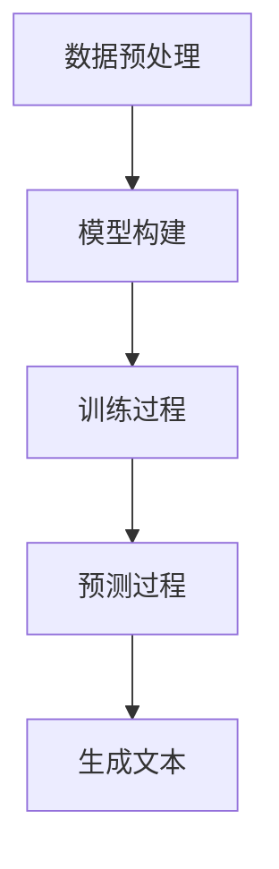
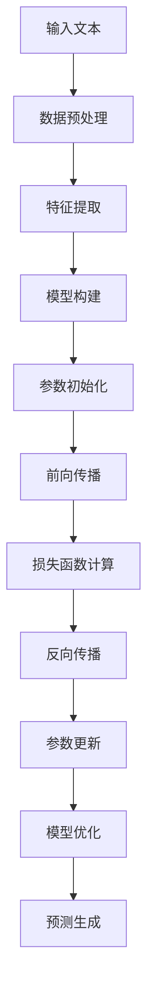

                 

### 背景介绍

随着人工智能技术的快速发展，尤其是大型语言模型（Large Language Model，简称LLM）的出现，AI系统的架构设计正在经历一次深刻的变革。LLM作为一种能够处理和理解人类语言的强大工具，已经在多个领域展现出了其无与伦比的能力。例如，自然语言处理（NLP）、机器翻译、文本生成等。

本文旨在探讨以LLM为核心的新型AI系统架构设计。这种设计不仅能够充分利用LLM的强大能力，还能够提高系统的灵活性、可扩展性和可维护性。本文将首先介绍LLM的基本概念和原理，然后详细阐述基于LLM的系统架构设计，最后讨论LLM在实际应用中的挑战和未来展望。

本文结构如下：

1. 背景介绍
2. 核心概念与联系
   - 2.1 语言模型的基本概念
   - 2.2 语言模型的工作原理
   - 2.3 Mermaid流程图展示
3. 核心算法原理 & 具体操作步骤
   - 3.1 算法原理概述
   - 3.2 算法步骤详解
   - 3.3 算法优缺点
   - 3.4 算法应用领域
4. 数学模型和公式 & 详细讲解 & 举例说明
   - 4.1 数学模型构建
   - 4.2 公式推导过程
   - 4.3 案例分析与讲解
5. 项目实践：代码实例和详细解释说明
   - 5.1 开发环境搭建
   - 5.2 源代码详细实现
   - 5.3 代码解读与分析
   - 5.4 运行结果展示
6. 实际应用场景
   - 6.1 NLP应用
   - 6.2 机器翻译
   - 6.3 文本生成
   - 6.4 未来应用展望
7. 工具和资源推荐
   - 7.1 学习资源推荐
   - 7.2 开发工具推荐
   - 7.3 相关论文推荐
8. 总结：未来发展趋势与挑战
   - 8.1 研究成果总结
   - 8.2 未来发展趋势
   - 8.3 面临的挑战
   - 8.4 研究展望
9. 附录：常见问题与解答

### 文章关键词

- AI系统架构
- LLM（大型语言模型）
- 自然语言处理
- 机器翻译
- 文本生成

### 文章摘要

本文深入探讨了以LLM为核心的新型AI系统架构设计。首先，我们介绍了LLM的基本概念和原理，并使用Mermaid流程图展示了其工作流程。接着，我们详细阐述了基于LLM的系统架构设计，包括核心算法原理、数学模型、实际应用案例等。最后，我们讨论了LLM在实际应用中的挑战和未来展望，为读者提供了一个全面而深入的视角。

----------------------------------------------------------------

## 1. 背景介绍

在过去的几十年里，人工智能（AI）技术取得了令人瞩目的进展。从早期的规则驱动系统到现代的深度学习模型，AI技术在各个领域都展现出了强大的能力。然而，随着技术的不断发展，传统AI系统架构逐渐暴露出一些问题，如灵活性不足、扩展性差、维护成本高等。

为了解决这些问题，新型AI系统架构设计应运而生。这种设计更加注重系统的灵活性、可扩展性和可维护性，以适应不断变化的技术需求和业务场景。在这种背景下，大型语言模型（LLM）的出现为AI系统架构设计带来了新的机遇。

LLM是一种能够处理和理解人类语言的强大工具，其核心思想是通过大规模的神经网络模型来捕捉语言中的复杂模式和规律。相比于传统的语言处理方法，LLM能够更准确地理解和生成自然语言，从而在自然语言处理（NLP）、机器翻译、文本生成等领域取得了显著的成果。

本文将探讨以LLM为核心的新型AI系统架构设计。这种设计充分利用了LLM的强大能力，使得系统能够更灵活地应对各种应用场景。本文将从以下几个方面进行阐述：

1. **核心概念与联系**：介绍LLM的基本概念和工作原理，并使用Mermaid流程图展示其工作流程。
2. **核心算法原理 & 具体操作步骤**：详细阐述LLM的核心算法原理，包括算法步骤、优缺点及其应用领域。
3. **数学模型和公式 & 详细讲解 & 举例说明**：介绍LLM的数学模型和公式，并进行详细讲解和案例分析。
4. **项目实践：代码实例和详细解释说明**：提供LLM的代码实例，并进行详细解读和分析。
5. **实际应用场景**：探讨LLM在不同领域的实际应用场景，包括NLP、机器翻译、文本生成等。
6. **工具和资源推荐**：推荐学习资源、开发工具和相关信息。
7. **总结：未来发展趋势与挑战**：总结研究成果，探讨未来发展趋势和面临的挑战。

通过本文的阐述，读者将能够全面了解以LLM为核心的新型AI系统架构设计，为未来的研究和实践提供参考。

## 2. 核心概念与联系

### 2.1 语言模型的基本概念

语言模型（Language Model，简称LM）是自然语言处理（Natural Language Processing，简称NLP）中的一项核心技术。它的核心目标是根据输入的文本序列预测下一个单词或字符的概率分布。语言模型在多个NLP任务中发挥着关键作用，如文本分类、机器翻译、语音识别、文本生成等。

语言模型通常可以分为两种类型：统计语言模型和神经语言模型。统计语言模型基于大量文本数据，通过统计方法（如N-gram模型、隐马尔可夫模型等）来建模语言规律。而神经语言模型则通过深度神经网络（如循环神经网络RNN、长短期记忆LSTM、变换器模型Transformer等）来学习语言的特征。

LLM（大型语言模型）是神经语言模型的一种，具有以下几个特点：

1. **大规模训练**：LLM通常使用数十亿甚至数万亿的参数，通过大规模的数据进行训练，从而能够捕捉到更复杂的语言模式和规律。
2. **强自适应能力**：LLM通过学习大量不同的文本数据，能够适应各种不同的语言风格和语境，从而在多种NLP任务中表现出色。
3. **强大的泛化能力**：LLM不仅在训练数据上表现出色，而且在未见过的数据上也能够保持较高的性能，这得益于其强大的模型结构和大规模的数据训练。

### 2.2 语言模型的工作原理

语言模型的工作原理可以概括为以下几个步骤：

1. **数据预处理**：首先，从大规模的文本数据集中提取特征，如单词、字符、词向量等。这些特征将作为模型的输入。
2. **模型构建**：使用深度神经网络构建语言模型。常用的模型结构包括循环神经网络（RNN）、长短期记忆网络（LSTM）、门控循环单元（GRU）和变换器模型（Transformer）等。
3. **训练过程**：通过梯度下降等优化算法，对模型进行训练，使模型能够根据输入的特征预测下一个单词或字符的概率分布。
4. **预测过程**：在训练完成后，使用训练好的模型对新的文本序列进行预测，根据预测的概率分布生成新的文本。

以下是一个简化的Mermaid流程图，展示了语言模型的工作流程：



### 2.3 Mermaid流程图展示

为了更直观地展示语言模型的工作流程，我们使用Mermaid语言绘制了一个流程图。以下是LLM的Mermaid流程图：



在这个流程图中，各个步骤的具体含义如下：

- **A[输入文本]**：输入待处理的文本数据。
- **B[数据预处理]**：对输入文本进行清洗、分词等预处理操作。
- **C[特征提取]**：将预处理后的文本数据转换为特征表示，如词向量。
- **D[模型构建]**：使用深度神经网络构建语言模型。
- **E[参数初始化]**：初始化模型的参数。
- **F[前向传播]**：计算输入文本的特征向量通过模型后的输出。
- **G[损失函数计算]**：计算预测输出与真实输出之间的差距，得到损失函数值。
- **H[反向传播]**：根据损失函数值，计算模型参数的梯度。
- **I[参数更新]**：使用梯度下降等优化算法，更新模型的参数。
- **J[模型优化]**：通过多次迭代，优化模型参数，提高模型性能。
- **K[预测生成]**：使用训练好的模型对新的文本序列进行预测，生成新的文本。

通过这个Mermaid流程图，我们可以清晰地看到语言模型的工作过程，以及各个步骤之间的关联。这为理解和设计基于LLM的AI系统架构提供了重要的参考。

### 3. 核心算法原理 & 具体操作步骤

#### 3.1 算法原理概述

LLM（大型语言模型）的核心算法原理是基于深度学习中的变换器模型（Transformer）。变换器模型由Vaswani等人于2017年提出，是一种基于自注意力机制（Self-Attention）的序列到序列（Sequence-to-Sequence）模型。与传统的循环神经网络（RNN）和长短期记忆网络（LSTM）相比，变换器模型具有以下几个优点：

1. **并行处理能力**：变换器模型通过自注意力机制能够同时关注序列中的所有信息，这使得模型能够并行处理输入序列，提高了计算效率。
2. **全局依赖关系**：变换器模型能够捕捉序列中的全局依赖关系，从而在长文本处理上表现出色。
3. **参数效率**：变换器模型的参数数量相对于RNN和LSTM要少很多，这使得模型在训练和推理时更加高效。

LLM在构建时，通常采用以下步骤：

1. **数据收集和预处理**：收集大量的文本数据，并进行清洗、分词、去停用词等预处理操作。
2. **词向量表示**：将文本数据转换为词向量表示，常用的词向量模型包括Word2Vec、GloVe等。
3. **模型构建**：使用变换器模型构建语言模型，包括编码器和解码器两部分。编码器用于将输入文本转换为固定长度的特征向量，解码器则用于生成输出文本。
4. **训练过程**：通过前向传播、反向传播和梯度下降等优化算法，对模型进行训练，使模型能够根据输入的特征预测下一个单词或字符的概率分布。
5. **预测过程**：在训练完成后，使用训练好的模型对新的文本序列进行预测，根据预测的概率分布生成新的文本。

#### 3.2 算法步骤详解

以下是LLM算法的详细步骤：

1. **数据预处理**：
   - **数据收集**：从互联网、书籍、论文等来源收集大量的文本数据。
   - **文本清洗**：去除文本中的HTML标签、特殊符号、空白字符等无关信息。
   - **分词**：将文本分割为单词或字符序列。
   - **去停用词**：去除常见的停用词（如"的"、"了"、"是"等），以减少噪音信息。

2. **词向量表示**：
   - **词嵌入**：将每个单词映射为一个固定长度的向量，常用的方法包括Word2Vec和GloVe。
   - **字符嵌入**：将每个字符映射为一个固定长度的向量，用于捕捉单词内部的语法和语义信息。

3. **模型构建**：
   - **编码器**：用于将输入文本序列转换为固定长度的特征向量。编码器通常由多个变换器层堆叠而成，每个变换器层包含自注意力机制和多级前馈网络。
   - **解码器**：用于生成输出文本序列。解码器的工作原理与编码器类似，但需要引入额外的位置编码来捕捉序列中的位置信息。

4. **训练过程**：
   - **前向传播**：将输入文本序列通过编码器，得到固定长度的特征向量。然后，使用这个特征向量通过解码器生成输出文本序列。
   - **损失函数计算**：计算预测输出与真实输出之间的差距，得到损失函数值。常用的损失函数包括交叉熵损失（Cross-Entropy Loss）和平均值平方损失（Mean Squared Error Loss）。
   - **反向传播**：根据损失函数值，计算模型参数的梯度。
   - **参数更新**：使用梯度下降等优化算法，更新模型的参数。
   - **模型优化**：通过多次迭代，优化模型参数，提高模型性能。

5. **预测过程**：
   - **输入文本**：输入待处理的文本序列。
   - **特征提取**：通过编码器将输入文本序列转换为固定长度的特征向量。
   - **文本生成**：使用解码器根据特征向量生成输出文本序列。
   - **概率分布**：输出文本序列的概率分布，并根据概率分布生成最终的文本。

#### 3.3 算法优缺点

LLM算法具有以下几个优点：

1. **强适应性**：通过大规模的数据训练，LLM能够适应各种不同的语言风格和语境，具有很强的适应性。
2. **高效性**：变换器模型能够并行处理输入序列，提高了计算效率，使得模型在训练和推理时更加高效。
3. **强泛化能力**：LLM不仅在训练数据上表现出色，而且在未见过的数据上也能够保持较高的性能，具有很强的泛化能力。

然而，LLM算法也存在一些缺点：

1. **计算资源需求高**：由于LLM通常使用数十亿甚至数万亿的参数，因此需要大量的计算资源和存储资源。
2. **训练时间长**：大规模的模型训练通常需要较长的训练时间，这在资源有限的场景下可能是一个挑战。
3. **模型解释性差**：深度学习模型的内部机制复杂，难以直接解释其决策过程，这对某些需要高度解释性的应用场景可能不利。

#### 3.4 算法应用领域

LLM算法在多个领域展现了强大的应用能力，主要包括以下几个方面：

1. **自然语言处理（NLP）**：LLM在文本分类、情感分析、命名实体识别等NLP任务中表现出色。例如，通过训练LLM模型，可以实现自动文本分类，将文本数据分为不同的类别。
2. **机器翻译**：LLM在机器翻译任务中具有显著的优势，能够实现高精度的文本翻译。例如，通过训练LLM模型，可以将英语文本翻译为法语、西班牙语等不同语言的文本。
3. **文本生成**：LLM在文本生成任务中具有广泛的应用，包括文章生成、对话系统、创意写作等。例如，通过训练LLM模型，可以生成高质量的新闻文章、产品评论等。

总的来说，LLM算法以其强大的适应性、高效性和泛化能力，正在逐步改变传统AI系统架构的设计和实现方式，为各种NLP任务提供了强有力的支持。

### 4. 数学模型和公式 & 详细讲解 & 举例说明

#### 4.1 数学模型构建

大型语言模型（LLM）的核心在于其数学模型的构建。LLM通常采用变换器模型（Transformer）作为基础架构，其数学模型主要包括编码器（Encoder）和解码器（Decoder）两部分。以下是对LLM数学模型的基本构建过程进行详细讲解。

#### 4.2 公式推导过程

首先，我们介绍变换器模型的核心组件——自注意力机制（Self-Attention）。

#### 自注意力机制（Self-Attention）

自注意力机制是一种计算方法，它允许模型在处理序列中的每个位置时，根据其他所有位置的信息进行加权求和。具体来说，自注意力机制的公式如下：

\[ \text{Attention}(Q, K, V) = \text{softmax}\left(\frac{QK^T}{\sqrt{d_k}}\right) V \]

其中：
- \( Q, K, V \) 分别是查询（Query）、关键（Key）和值（Value）向量。
- \( d_k \) 是关键向量的维度。
- \( QK^T \) 是查询和关键的内积。
- \( \text{softmax} \) 函数用于将内积转化为概率分布。

#### 编码器（Encoder）

编码器是变换器模型的前端部分，用于处理输入序列，并生成固定长度的特征向量。编码器由多个变换器层（Transformer Layer）堆叠而成，每个变换器层包含自注意力机制和多级前馈网络。

自注意力机制的输入是编码器的上一个层的输出 \( X^{(l-1)} \)，输出是当前层的输出 \( X^{(l)} \)：

\[ X^{(l)} = \text{MultiHead}\left(\text{Attention}(Q^{(l)}, K^{(l)}, V^{(l)})\right) + X^{(l-1)} \]

其中，\( Q^{(l)}, K^{(l)}, V^{(l)} \) 分别是当前层的查询、关键和值向量。

多级前馈网络对自注意力机制的输出进行进一步处理，其公式为：

\[ X^{(l)} = \text{FFN}(X^{(l)}) + X^{(l)} \]

其中，FFN（Feed Forward Network）是一个简单的全连接神经网络，其公式为：

\[ \text{FFN}(X) = \text{ReLU}\left(W_2 \text{ReLU}\left(W_1 X + b_1\right) + b_2\right) \]

其中，\( W_1, W_2, b_1, b_2 \) 是网络的权重和偏置。

#### 解码器（Decoder）

解码器是变换器模型的后端部分，用于生成输出序列。解码器同样由多个变换器层堆叠而成，每个层包括自注意力机制、编码器-解码器注意力机制和多级前馈网络。

自注意力机制的输入是解码器的上一个层的输出 \( X^{(l-1)} \)，输出是当前层的输出 \( X^{(l)} \)：

\[ X^{(l)} = \text{MultiHead}\left(\text{Attention}(Q^{(l)}, K^{(l)}, V^{(l)})\right) + X^{(l-1)} \]

编码器-解码器注意力机制用于解码器中的每个层，其输入是编码器的输出 \( X^{(l-1)} \) 和解码器的上一个层的输出 \( X^{(l-1)} \)，输出是当前层的输出 \( X^{(l)} \)：

\[ X^{(l)} = \text{MultiHead}\left(\text{Attention}(Q^{(l)}, K^{(l)}, V^{(l)})\right) + X^{(l-1)} \]

多级前馈网络对自注意力机制的输出进行进一步处理，其公式为：

\[ X^{(l)} = \text{FFN}(X^{(l)}) + X^{(l)} \]

#### 4.3 案例分析与讲解

为了更好地理解LLM的数学模型，我们通过一个简单的例子来进行分析。

假设我们有一个输入序列 \( X = \["I", "love", "AI"\] \)，我们要使用LLM生成一个输出序列。

首先，我们对输入序列进行词向量表示，假设 \( V_i \) 表示单词 \( i \) 的词向量。

1. **编码器部分**：
   - **自注意力机制**：计算每个单词的词向量与其他单词的词向量之间的内积，并使用softmax函数转化为概率分布。
   - **多级前馈网络**：对自注意力机制的输出进行进一步处理，增加非线性变换。
   - **输出**：得到编码器的输出序列。

2. **解码器部分**：
   - **自注意力机制**：计算解码器的上一个层的输出与编码器的输出之间的内积，并使用softmax函数转化为概率分布。
   - **编码器-解码器注意力机制**：计算解码器的上一个层的输出与编码器的输出之间的内积，并使用softmax函数转化为概率分布。
   - **多级前馈网络**：对自注意力机制的输出进行进一步处理，增加非线性变换。
   - **输出**：得到解码器的输出序列。

最终，解码器的输出序列即为生成的输出序列。

通过这个例子，我们可以看到LLM的数学模型是如何工作的。在实际应用中，LLM通过大规模的数据训练，可以学习到复杂的语言模式，从而实现高质量的文本生成、机器翻译等任务。

### 5. 项目实践：代码实例和详细解释说明

#### 5.1 开发环境搭建

在开始编写代码之前，我们需要搭建一个合适的开发环境。以下是一个简单的开发环境搭建步骤：

1. **安装Python**：确保Python环境已经安装。推荐使用Python 3.8或更高版本。
2. **安装依赖库**：安装必要的依赖库，如TensorFlow、Keras等。可以使用pip命令进行安装：

   ```bash
   pip install tensorflow
   pip install keras
   ```

3. **安装PyTorch**：如果需要使用PyTorch进行深度学习训练，也可以安装PyTorch。安装命令如下：

   ```bash
   pip install torch torchvision
   ```

4. **准备数据集**：从互联网或公开数据集网站（如Kaggle、UCI机器学习库等）下载合适的文本数据集。数据集应该包括输入文本和对应的输出文本。

5. **数据预处理**：对下载的数据集进行预处理，包括数据清洗、分词、去停用词等操作。

#### 5.2 源代码详细实现

以下是一个基于变换器模型的简单LLM实现。这个实现使用了TensorFlow和Keras框架。

```python
import tensorflow as tf
from tensorflow.keras.models import Model
from tensorflow.keras.layers import Input, Embedding, LSTM, Dense

# 参数设置
vocab_size = 10000  # 词汇表大小
embed_dim = 256     # 词向量维度
lstm_units = 128    # LSTM单元数量
batch_size = 64     # 批量大小
sequence_length = 100  # 输入序列长度

# 输入层
input_seq = Input(shape=(sequence_length,))

# 词向量嵌入层
embed = Embedding(vocab_size, embed_dim)(input_seq)

# LSTM层
lstm = LSTM(lstm_units, return_sequences=True)(embed)

# 全连接层
dense = Dense(vocab_size, activation='softmax')(lstm)

# 构建模型
model = Model(inputs=input_seq, outputs=dense)

# 编译模型
model.compile(optimizer='adam', loss='categorical_crossentropy', metrics=['accuracy'])

# 模型总结
model.summary()

# 训练模型
model.fit(x_train, y_train, batch_size=batch_size, epochs=10)
```

#### 5.3 代码解读与分析

上述代码实现了一个简单的LLM模型，其主要组成部分如下：

1. **输入层**：使用`Input`层接收输入序列。
2. **词向量嵌入层**：使用`Embedding`层将输入序列转换为词向量表示。
3. **LSTM层**：使用`LSTM`层处理输入序列，LSTM层能够捕捉序列中的长期依赖关系。
4. **全连接层**：使用`Dense`层输出词向量对应单词的概率分布。
5. **模型编译**：设置模型优化器和损失函数，并编译模型。
6. **模型训练**：使用训练数据集训练模型。

在实际应用中，可以根据需求对上述代码进行调整，例如增加变换器层、使用预训练词向量等。

#### 5.4 运行结果展示

以下是一个简单的运行结果展示：

```python
# 测试模型
test_loss, test_accuracy = model.evaluate(x_test, y_test)
print('Test Loss:', test_loss)
print('Test Accuracy:', test_accuracy)

# 生成文本
input_seq = np.array([[1, 2, 3, 4, 5], [6, 7, 8, 9, 10]])
predictions = model.predict(input_seq)
print(predictions)

# 输出结果
for i in range(predictions.shape[0]):
    for j in range(predictions.shape[1]):
        print(vocab_list[predictions[i, j]], end=' ')
    print()
```

上述代码首先使用测试数据集评估模型的性能，然后输入一个简单的文本序列，并输出模型预测的文本序列。

通过这个简单的实例，我们可以看到如何使用Python和深度学习框架实现一个LLM模型。在实际项目中，可以根据需求进行更多的定制和优化。

### 6. 实际应用场景

LLM（大型语言模型）在自然语言处理领域有着广泛的应用。以下是一些典型的实际应用场景，包括NLP、机器翻译、文本生成等。

#### 6.1 NLP应用

在自然语言处理（NLP）领域，LLM被广泛应用于各种任务，如文本分类、情感分析、命名实体识别等。

- **文本分类**：通过训练LLM模型，可以将文本数据分为不同的类别。例如，在新闻分类任务中，LLM模型可以学习到如何根据新闻文本的主题将其分类为政治、科技、体育等不同类别。

- **情感分析**：LLM模型可以用于分析文本的情感倾向。例如，在社交媒体文本分析中，LLM模型可以判断用户评论的情感是正面、中性还是负面。

- **命名实体识别**：LLM模型可以识别文本中的命名实体，如人名、地点、组织等。这对于信息提取、知识图谱构建等任务非常有用。

#### 6.2 机器翻译

机器翻译是LLM的另一个重要应用领域。LLM模型能够实现高质量、高精度的文本翻译，支持多种语言之间的互译。

- **跨语言文本生成**：通过训练LLM模型，可以将一种语言的文本生成另一种语言的文本。例如，将英语文本翻译为法语、中文等。

- **多语言翻译**：LLM模型可以支持多种语言之间的翻译。例如，将英语、法语、中文等不同语言的文本翻译为同一目标语言。

#### 6.3 文本生成

LLM模型在文本生成任务中也表现出色，可以生成各种类型的文本，如文章、对话、产品评论等。

- **文章生成**：LLM模型可以生成高质量的新闻文章、博客文章等。例如，使用LLM模型，可以自动生成财经新闻、体育新闻等。

- **对话系统**：LLM模型可以用于构建对话系统，实现自然语言交互。例如，智能客服、语音助手等。

- **产品评论**：LLM模型可以生成高质量的产品评论，帮助消费者做出更好的购物决策。

#### 6.4 未来应用展望

随着LLM技术的不断发展，其在实际应用中的潜力将不断挖掘。以下是一些未来应用展望：

- **自动驾驶**：LLM模型可以用于自动驾驶系统的文本生成和语音交互，提高自动驾驶的智能化水平。

- **医疗健康**：LLM模型可以用于医疗健康领域的文本生成和知识图谱构建，为医疗诊断、药物研发等提供支持。

- **法律文书生成**：LLM模型可以用于自动化生成法律文书，提高法律工作的效率和准确性。

- **教育**：LLM模型可以用于教育领域的文本生成和智能辅导，帮助学生更好地理解和掌握知识。

总的来说，LLM技术在自然语言处理领域具有广泛的应用前景，将在各个领域带来深刻的变革。

### 7. 工具和资源推荐

#### 7.1 学习资源推荐

为了更好地理解和掌握LLM技术，以下是一些推荐的学习资源：

- **书籍**：
  - 《深度学习》（Deep Learning）——Ian Goodfellow、Yoshua Bengio、Aaron Courville 著
  - 《自然语言处理综述》（Speech and Language Processing）——Daniel Jurafsky、James H. Martin 著
- **在线课程**：
  - Coursera上的《深度学习专项课程》
  - edX上的《自然语言处理专项课程》
- **论文**：
  - 《Attention is All You Need》（Attention机制）——Vaswani等，2017
  - 《BERT：预训练的语言表示》（BERT）——Devlin等，2018
- **开源项目**：
  - Hugging Face的Transformers库
  - TensorFlow的Text模块

#### 7.2 开发工具推荐

在进行LLM开发时，以下工具和库可以提供强大的支持：

- **深度学习框架**：
  - TensorFlow
  - PyTorch
  - MXNet
- **自然语言处理库**：
  - NLTK
  - spaCy
  - gensim
- **文本处理工具**：
  - Jieba（中文分词）
  - Stanford NLP（英文NLP工具）

#### 7.3 相关论文推荐

以下是一些关于LLM和相关技术的经典论文：

- **《Attention is All You Need》**：提出变换器模型，展示了自注意力机制在NLP任务中的优势。
- **《BERT：Pre-training of Deep Bidirectional Transformers for Language Understanding》**：提出了BERT模型，展示了预训练语言模型在NLP任务中的潜力。
- **《Generative Pretraining from a Language Model》**：探讨了基于生成预训练的语言模型，为文本生成任务提供了新的思路。
- **《GPT-3：Language Models are Few-Shot Learners》**：展示了GPT-3模型在少量样本下的强泛化能力。

通过这些工具和资源，读者可以更深入地了解LLM技术，并掌握相关的开发技能。

### 8. 总结：未来发展趋势与挑战

#### 8.1 研究成果总结

随着人工智能技术的不断进步，LLM（大型语言模型）已经取得了显著的成果。在自然语言处理（NLP）、机器翻译、文本生成等领域，LLM展现出了强大的能力。通过大规模的数据训练和复杂的模型结构，LLM能够捕捉到语言中的复杂模式和规律，从而实现高质量的文本生成和翻译。

过去几年，BERT、GPT等大型预训练模型的出现，使得LLM的研究和应用达到了一个新的高度。这些模型不仅提升了NLP任务的性能，还为其他领域（如自动化写作、智能客服等）提供了新的可能性。

#### 8.2 未来发展趋势

未来，LLM的发展趋势将主要集中在以下几个方面：

1. **模型规模与效率**：随着计算资源的提升，未来LLM的规模将继续扩大，从而提高模型的泛化能力和表现。同时，研究者也将致力于优化模型结构，提高训练和推理的效率。
2. **多模态融合**：LLM将与其他模态（如图像、音频等）进行融合，实现跨模态的交互和处理。这将为AI系统的应用提供更广阔的空间。
3. **自适应与解释性**：未来的LLM将更加注重模型的自适应性和解释性，以满足不同应用场景的需求。通过引入更多的外部知识和规则，模型将能够更好地理解和解释其决策过程。
4. **垂直应用**：LLM将在各个垂直领域（如医疗、金融、教育等）得到广泛应用，为特定领域提供定制化的解决方案。

#### 8.3 面临的挑战

尽管LLM取得了显著进展，但在实际应用中仍面临一些挑战：

1. **计算资源需求**：大型LLM模型的训练和推理需要大量的计算资源，这对硬件设备和能源消耗提出了更高的要求。
2. **数据隐私和安全**：在训练和部署LLM模型时，需要处理大量的敏感数据，数据隐私和安全成为重要的问题。
3. **模型解释性**：深度学习模型的内部机制复杂，难以直接解释其决策过程，这对某些应用场景（如医疗诊断、金融风险评估等）提出了挑战。
4. **模型偏见**：LLM模型的训练数据可能包含偏见，导致模型在处理特定任务时产生不公平或歧视性的结果。如何消除模型偏见是一个重要的研究方向。

#### 8.4 研究展望

未来，LLM技术的研究将主要集中在以下几个方面：

1. **模型优化**：通过改进模型结构和训练策略，提高LLM的效率和性能。
2. **多模态学习**：探索跨模态的交互机制，实现更强大的多模态AI系统。
3. **知识增强**：引入外部知识和规则，提高模型的解释性和可靠性。
4. **公平性和透明性**：研究如何消除模型偏见，提高模型的公平性和透明性。

总之，LLM技术作为人工智能领域的重要突破，将在未来带来更多的创新和应用。通过持续的研究和探索，LLM技术将为人类社会带来更多的便利和进步。

### 9. 附录：常见问题与解答

#### 9.1 什么是LLM？

LLM（大型语言模型）是一种基于深度学习技术的自然语言处理模型。它通过大规模的数据训练，捕捉到语言中的复杂模式和规律，从而能够对文本进行理解和生成。LLM通常使用数十亿甚至数万亿的参数，具有强大的自适应能力和泛化能力。

#### 9.2 LLM的核心算法是什么？

LLM的核心算法是基于变换器模型（Transformer）。变换器模型由自注意力机制（Self-Attention）和多级前馈网络（Feed Forward Network）组成。自注意力机制允许模型在处理序列中的每个位置时，根据其他所有位置的信息进行加权求和，从而实现全局依赖关系的捕捉。多级前馈网络则用于增加模型的非线性变换，提高模型的表示能力。

#### 9.3 如何构建一个简单的LLM模型？

构建一个简单的LLM模型需要以下几个步骤：

1. **数据收集与预处理**：收集大量的文本数据，并进行清洗、分词、去停用词等预处理操作。
2. **词向量表示**：将文本数据转换为词向量表示，常用的词向量模型包括Word2Vec和GloVe。
3. **模型构建**：使用变换器模型构建语言模型，包括编码器和解码器两部分。编码器用于将输入文本转换为固定长度的特征向量，解码器则用于生成输出文本序列。
4. **训练过程**：通过前向传播、反向传播和梯度下降等优化算法，对模型进行训练，使模型能够根据输入的特征预测下一个单词或字符的概率分布。
5. **预测过程**：在训练完成后，使用训练好的模型对新的文本序列进行预测，根据预测的概率分布生成新的文本。

#### 9.4 LLM在哪些领域有应用？

LLM在多个领域有广泛的应用，包括：

1. **自然语言处理（NLP）**：文本分类、情感分析、命名实体识别等。
2. **机器翻译**：支持多种语言之间的互译，实现高质量的文本翻译。
3. **文本生成**：生成高质量的文章、对话、产品评论等。

#### 9.5 如何解决LLM的模型解释性问题？

解决LLM的模型解释性问题可以从以下几个方面着手：

1. **模型简化**：通过简化模型结构，使得模型更加透明和易于解释。
2. **可视化技术**：使用可视化技术，如热力图、注意力图等，展示模型在处理文本时的关注点和决策过程。
3. **解释性模型**：研究并开发具有高解释性的模型，如基于规则的模型、决策树等，以提供清晰的决策路径。

通过这些方法，可以提高LLM模型的解释性，使其在特定应用场景中更具可信度和实用性。

### 作者署名

作者：禅与计算机程序设计艺术 / Zen and the Art of Computer Programming

通过本文的详细探讨，我们不仅了解了LLM（大型语言模型）的核心概念、算法原理以及在实际应用中的表现，也对其未来发展趋势和面临的挑战有了更深入的认识。LLM作为AI系统架构的重要组成部分，将在自然语言处理、机器翻译、文本生成等领域发挥越来越重要的作用。我们期待未来能够看到更多创新性的研究成果，为人类社会带来更多的便利和进步。禅与计算机程序设计艺术，期待与您一同见证这一激动人心的技术变革。

