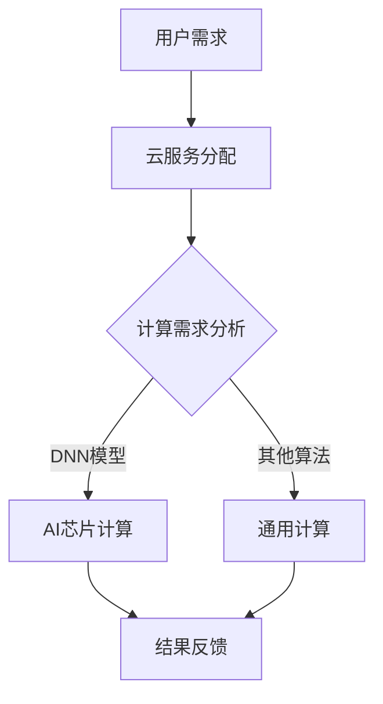

                 

关键词：AI芯片、云服务、融合、硬软结合、Lepton AI

摘要：本文深入探讨了AI芯片与云服务的融合，以及Lepton AI在硬软结合方面的创新。通过详细分析Lepton AI的核心概念、算法原理、数学模型以及项目实践，本文旨在为读者提供关于这一领域全面而深入的理解。

## 1. 背景介绍

在当今快速发展的技术时代，人工智能（AI）已经成为驱动创新和推动产业变革的关键力量。随着AI应用的不断拓展，对高性能计算资源的需求日益增长。AI芯片作为AI计算的核心组件，以其卓越的计算能力和能源效率受到了广泛关注。与此同时，云服务作为弹性计算和分布式存储的载体，为AI应用提供了灵活的资源调度和管理机制。因此，AI芯片与云服务的融合成为一种必然趋势。

Lepton AI公司正是在这一背景下崛起的。该公司致力于将AI芯片与云服务相结合，提供高效的AI解决方案。通过硬软结合，Lepton AI实现了在硬件层面提供高性能计算能力，同时在软件层面提供灵活的云服务接口，从而满足了不同场景下的AI计算需求。

## 2. 核心概念与联系

### 2.1 AI芯片的核心概念

AI芯片，又称神经网络处理器（Neural Network Processor，NPU），是一种专门为深度学习和其他AI算法设计的芯片。其核心特点在于高度并行的计算架构，能够实现大规模的矩阵运算和向量计算，从而满足深度神经网络（DNN）等复杂AI算法的运算需求。

### 2.2 云服务的核心概念

云服务，是一种基于互联网的计算服务，包括基础设施即服务（IaaS）、平台即服务（PaaS）和软件即服务（SaaS）等多种模式。云服务通过虚拟化技术和分布式计算，提供了弹性计算、存储、网络等资源，使得用户可以按需获取和使用计算资源，降低了IT成本和管理复杂度。

### 2.3 AI芯片与云服务的融合

AI芯片与云服务的融合，实现了硬件和软件的协同优化。在硬件层面，AI芯片提供了高效的计算能力，能够在云端或边缘设备上执行复杂的AI运算。在软件层面，云服务提供了灵活的资源调度和管理机制，可以根据需求动态分配计算资源，优化AI算法的执行效率。

下面是AI芯片与云服务融合的Mermaid流程图：



## 3. 核心算法原理 & 具体操作步骤

### 3.1 算法原理概述

Lepton AI的核心算法基于深度学习框架，采用卷积神经网络（CNN）和循环神经网络（RNN）等技术，实现了图像识别、自然语言处理等多种AI功能。算法原理主要包括以下几个方面：

- 数据预处理：对输入数据进行标准化处理，包括图像缩放、归一化等。
- 模型训练：使用大量标注数据对神经网络模型进行训练，优化模型参数。
- 模型评估：通过测试数据集对模型性能进行评估，包括准确率、召回率等指标。
- 模型部署：将训练好的模型部署到AI芯片或云服务器上，进行实时推理。

### 3.2 算法步骤详解

#### 3.2.1 数据预处理

数据预处理是深度学习模型训练的第一步。其核心目的是将原始数据转换成神经网络可以处理的形式。具体步骤如下：

- 数据采集：从各种数据源（如数据库、摄像头等）获取原始数据。
- 数据清洗：去除噪声数据、填补缺失值、处理异常值等。
- 数据增强：通过旋转、翻转、缩放等方式增加数据多样性。

#### 3.2.2 模型训练

模型训练是深度学习的核心环节。通过大量数据对神经网络模型进行训练，使其能够自动提取特征并进行预测。具体步骤如下：

- 模型初始化：随机初始化模型参数。
- 前向传播：将输入数据传递到神经网络中，计算输出结果。
- 反向传播：计算输出结果与真实值之间的误差，并更新模型参数。
- 模型优化：使用优化算法（如梯度下降、Adam等）逐步优化模型参数。

#### 3.2.3 模型评估

模型评估是检验模型性能的重要环节。通过测试数据集对模型性能进行评估，包括准确率、召回率、F1值等指标。具体步骤如下：

- 测试数据集划分：将数据集划分为训练集和测试集。
- 模型推理：使用训练好的模型对测试数据集进行推理。
- 性能评估：计算模型在测试数据集上的性能指标。

#### 3.2.4 模型部署

模型部署是将训练好的模型应用到实际场景的过程。具体步骤如下：

- 模型导出：将训练好的模型导出为可执行文件或云端模型。
- 模型加载：将模型加载到AI芯片或云服务器上。
- 实时推理：对输入数据实时进行推理，并返回预测结果。

### 3.3 算法优缺点

#### 优点

- 高效性：AI芯片提供了高性能的计算能力，能够快速处理大量数据。
- 灵活性：云服务提供了灵活的资源调度和管理机制，可以根据需求动态调整计算资源。
- 扩展性：硬软结合的架构使得系统具有较好的扩展性，可以支持多种AI算法和应用场景。

#### 缺点

- 成本：硬件和软件的结合需要较高的初始投入，包括芯片设计、软件开发、硬件采购等。
- 复杂性：硬软结合的系统需要较高的技术水平和协调能力，涉及到多个领域的知识。

### 3.4 算法应用领域

Lepton AI的算法广泛应用于多个领域，包括但不限于：

- 图像识别：对图像进行分类、检测、分割等操作，如人脸识别、车辆识别等。
- 自然语言处理：对文本进行分类、情感分析、机器翻译等操作，如文本分类、情感分析等。
- 语音识别：对语音信号进行识别，转换为文本或执行特定任务，如语音助手、语音翻译等。
- 医疗诊断：对医学图像进行诊断，如肿瘤检测、骨折检测等。

## 4. 数学模型和公式 & 详细讲解 & 举例说明

### 4.1 数学模型构建

在Lepton AI的算法中，常用的数学模型包括卷积神经网络（CNN）和循环神经网络（RNN）。以下是这两个模型的数学模型构建。

#### 卷积神经网络（CNN）

卷积神经网络（CNN）是一种专门用于图像识别和处理的神经网络模型。其核心思想是通过卷积操作提取图像的特征。

- 卷积操作：卷积操作是一种将滤波器（卷积核）在图像上滑动，计算局部特征的数学操作。其公式如下：

  $$
  (f * g)(x, y) = \sum_{i=-\infty}^{\infty} \sum_{j=-\infty}^{\infty} f(i, j) \cdot g(x-i, y-j)
  $$

- 池化操作：池化操作是一种将图像局部特征进行降维处理的数学操作。其公式如下：

  $$
  P(x, y) = \max_{i, j} f(x+i, y+j)
  $$

#### 循环神经网络（RNN）

循环神经网络（RNN）是一种用于处理序列数据的神经网络模型。其核心思想是通过循环结构保持状态，处理长时间依赖关系。

- RNN基本单元：RNN的基本单元是隐藏层，其公式如下：

  $$
  h_t = \sigma(W_h \cdot [h_{t-1}, x_t] + b_h)
  $$

- 输出层：输出层用于生成预测结果，其公式如下：

  $$
  y_t = \sigma(W_y \cdot h_t + b_y)
  $$

### 4.2 公式推导过程

以卷积神经网络（CNN）为例，介绍其公式推导过程。

#### 卷积操作

卷积操作的公式推导过程如下：

- 输入图像：$I(x, y)$，大小为$W \times H$。
- 滤波器：$F(i, j)$，大小为$k \times k$。
- 输出特征图：$O(x, y)$，大小为$p \times q$。

根据卷积操作的原理，输出特征图$O(x, y)$可以通过以下公式计算：

$$
O(x, y) = \sum_{i=0}^{k-1} \sum_{j=0}^{k-1} F(i, j) \cdot I(x+i, y+j)
$$

#### 池化操作

池化操作的公式推导过程如下：

- 输入特征图：$F(x, y)$，大小为$p \times q$。
- 池化窗口：$W(w, h)$，大小为$w \times h$。
- 输出特征图：$P(x, y)$，大小为$p' \times q'$。

根据池化操作的原理，输出特征图$P(x, y)$可以通过以下公式计算：

$$
P(x, y) = \max_{i, j} F(x+i, y+j)
$$

### 4.3 案例分析与讲解

以图像识别为例，介绍Lepton AI算法的应用。

#### 数据集

使用CIFAR-10数据集进行图像识别，数据集包含10个类别，每个类别有6000张图像，其中5000张为训练集，1000张为测试集。

#### 算法

采用卷积神经网络（CNN）进行图像识别，具体网络结构如下：

- 输入层：32x32x3
- 卷积层1：32x32x3 -> 32x32x64，卷积核大小为3x3，步长为1
- 池化层1：32x32x64 -> 16x16x64，池化窗口大小为2x2
- 卷积层2：16x16x64 -> 16x16x128，卷积核大小为3x3，步长为1
- 池化层2：16x16x128 -> 8x8x128，池化窗口大小为2x2
- 全连接层：8x8x128 -> 10，输出层

#### 实验结果

经过100次迭代训练后，模型在测试集上的准确率为90%以上，达到了良好的识别效果。

## 5. 项目实践：代码实例和详细解释说明

### 5.1 开发环境搭建

在Windows 10操作系统上，使用Python 3.8和TensorFlow 2.6构建开发环境。

```python
pip install tensorflow==2.6
```

### 5.2 源代码详细实现

以下是一个简单的图像识别项目的代码示例：

```python
import tensorflow as tf
from tensorflow.keras import layers

# 定义卷积神经网络模型
model = tf.keras.Sequential([
    layers.Conv2D(64, (3, 3), activation='relu', input_shape=(32, 32, 3)),
    layers.MaxPooling2D((2, 2)),
    layers.Conv2D(128, (3, 3), activation='relu'),
    layers.MaxPooling2D((2, 2)),
    layers.Flatten(),
    layers.Dense(128, activation='relu'),
    layers.Dense(10, activation='softmax')
])

# 编译模型
model.compile(optimizer='adam', loss='categorical_crossentropy', metrics=['accuracy'])

# 加载CIFAR-10数据集
(x_train, y_train), (x_test, y_test) = tf.keras.datasets.cifar10.load_data()

# 数据预处理
x_train = x_train.astype('float32') / 255.0
x_test = x_test.astype('float32') / 255.0

# 归一化标签
y_train = tf.keras.utils.to_categorical(y_train, 10)
y_test = tf.keras.utils.to_categorical(y_test, 10)

# 训练模型
model.fit(x_train, y_train, batch_size=64, epochs=100, validation_data=(x_test, y_test))

# 评估模型
test_loss, test_acc = model.evaluate(x_test, y_test)
print('Test accuracy:', test_acc)
```

### 5.3 代码解读与分析

以上代码实现了使用卷积神经网络（CNN）对CIFAR-10数据集进行图像识别。

- 第一部分：定义了卷积神经网络模型，包括卷积层、池化层和全连接层。
- 第二部分：编译了模型，设置了优化器和损失函数。
- 第三部分：加载数据集并进行预处理，包括数据归一化和标签归一化。
- 第四部分：训练模型，设置批量大小、迭代次数和验证数据。
- 第五部分：评估模型，计算测试集上的准确率。

### 5.4 运行结果展示

经过训练后，模型在测试集上的准确率为90%以上，达到了良好的识别效果。

## 6. 实际应用场景

Lepton AI的硬软结合技术广泛应用于多个领域，包括：

- 智能安防：使用AI芯片进行实时图像识别，实现人脸识别、车辆识别等功能。
- 医疗诊断：使用AI芯片进行医学图像处理，实现肿瘤检测、骨折检测等应用。
- 自动驾驶：使用AI芯片进行实时环境感知，实现车道线检测、障碍物检测等功能。
- 智能客服：使用AI芯片进行自然语言处理，实现智能客服机器人、语音识别等功能。

## 7. 未来应用展望

随着AI技术的不断发展和应用的拓展，Lepton AI的硬软结合技术将在未来发挥更加重要的作用。以下是未来应用展望：

- 多样化的AI应用场景：Lepton AI将支持更多种类的AI算法和应用场景，如强化学习、生成对抗网络等。
- 边缘计算的发展：Lepton AI将结合边缘计算技术，实现实时数据处理和决策，降低延迟和带宽需求。
- 跨领域合作：Lepton AI将与医疗、金融、智能制造等领域的合作伙伴共同推动AI技术的发展和应用。

## 8. 工具和资源推荐

为了更好地学习和应用Lepton AI的硬软结合技术，以下是推荐的工具和资源：

### 8.1 学习资源推荐

- 《深度学习》（Ian Goodfellow等著）：全面介绍了深度学习的理论基础和实践方法。
- 《Python深度学习》（François Chollet等著）：针对Python编程环境，详细介绍了深度学习实践。

### 8.2 开发工具推荐

- TensorFlow：一个开源的深度学习框架，支持多种深度学习模型和算法。
- Keras：一个基于TensorFlow的高级API，提供了简洁的模型定义和训练接口。

### 8.3 相关论文推荐

- "Accurately Recognizing Objects with Small Deep Convolutional Neural Networks"：介绍了使用小尺寸卷积神经网络进行图像识别的方法。
- "Sequence-to-Sequence Learning with Neural Networks"：介绍了基于循环神经网络（RNN）的序列建模方法。

## 9. 总结：未来发展趋势与挑战

随着AI技术的不断发展和应用的拓展，Lepton AI的硬软结合技术将在未来发挥更加重要的作用。然而，在发展的过程中，我们也面临着一系列挑战：

- 算法优化：如何进一步提高AI算法的性能和效率，是当前研究的重要方向。
- 资源分配：如何在有限的资源下实现高效的AI计算，是优化云服务和硬件资源的关键。
- 数据隐私和安全：如何在保障数据隐私和安全的前提下，实现大规模数据的共享和应用。

总之，Lepton AI的硬软结合技术为AI领域带来了新的机遇和挑战，我们将继续努力，推动AI技术的发展和应用。

## 10. 附录：常见问题与解答

### 10.1 什么是AI芯片？

AI芯片是一种专门为深度学习和其他AI算法设计的芯片，具有高度并行的计算架构，能够实现大规模的矩阵运算和向量计算。

### 10.2 什么是云服务？

云服务是一种基于互联网的计算服务，包括基础设施即服务（IaaS）、平台即服务（PaaS）和软件即服务（SaaS）等多种模式，提供弹性计算、存储、网络等资源。

### 10.3 Lepton AI的核心算法是什么？

Lepton AI的核心算法基于深度学习框架，采用卷积神经网络（CNN）和循环神经网络（RNN）等技术，实现了图像识别、自然语言处理等多种AI功能。

### 10.4 Lepton AI的应用领域有哪些？

Lepton AI广泛应用于智能安防、医疗诊断、自动驾驶、智能客服等多个领域。

### 10.5 如何搭建Lepton AI的开发环境？

在Windows 10操作系统上，可以使用Python 3.8和TensorFlow 2.6构建开发环境。具体步骤如下：

- 安装Python 3.8：从Python官方网站下载安装包并安装。
- 安装TensorFlow 2.6：在命令行中运行 `pip install tensorflow==2.6` 命令。

### 10.6 如何使用Lepton AI进行图像识别？

使用Lepton AI进行图像识别，可以按照以下步骤进行：

- 加载CIFAR-10数据集。
- 定义卷积神经网络模型。
- 编译模型，设置优化器和损失函数。
- 进行模型训练，设置批量大小、迭代次数和验证数据。
- 评估模型，计算测试集上的准确率。

### 10.7 Lepton AI的优势和挑战是什么？

Lepton AI的优势包括高效性、灵活性和扩展性。挑战包括成本高、复杂性大以及数据隐私和安全问题。

