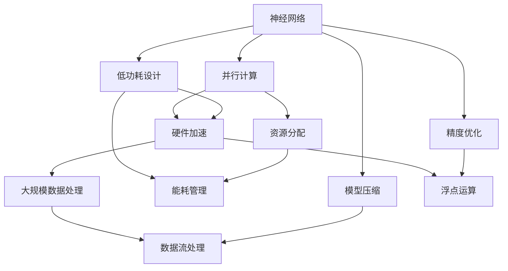

                 

关键词：AI芯片、硬件架构、LLM优化、神经网路、并行计算、低功耗设计、硬件加速

> 摘要：本文深入探讨了AI芯片的设计原理及其在大型语言模型(LLU)优化中的应用。通过对现有AI芯片设计技术的分析，本文提出了一种新型的硬件架构，以有效提升LLM的性能和能效，为未来的智能计算提供强有力的支持。

## 1. 背景介绍

随着人工智能（AI）技术的迅猛发展，大型语言模型（Large Language Models, LLMs）如BERT、GPT等已经成为自然语言处理（NLP）领域的重要工具。这些模型通常具有数十亿个参数，处理大规模数据集时需要大量的计算资源。传统的CPU和GPU虽然在一定程度上满足了这些需求，但它们在处理复杂的神经网络模型时仍然存在一些瓶颈，如计算效率低下、功耗高、扩展性差等。

为了克服这些限制，AI芯片的设计应运而生。AI芯片是一种专门为人工智能应用设计的集成电路，它能够显著提高计算效率，降低功耗，并提供更好的扩展性。近年来，AI芯片的研究取得了显著进展，如TPU、NVIDIA GPU、Google TPU等，这些芯片在神经网络计算方面展现了巨大的潜力。

本文将聚焦于AI芯片的设计，探讨如何优化硬件架构以满足LLM的需求。我们将分析现有AI芯片的设计原理，并提出一种新型架构，旨在提升LLM的性能和能效。

## 2. 核心概念与联系

在讨论AI芯片设计之前，我们需要了解一些核心概念和原理。以下是一个Mermaid流程图，描述了这些核心概念及其相互关系：



### 2.1 神经网络

神经网络是AI芯片设计的基础。神经网络由多层神经元组成，通过前向传播和反向传播算法进行训练和推理。神经网络的结构和参数量决定了其计算复杂度和内存需求。

### 2.2 并行计算

并行计算是提升AI芯片性能的关键。通过将计算任务分解为多个子任务，并在多个处理单元上同时执行，可以显著提高计算速度。并行计算通常涉及线程管理和任务调度。

### 2.3 低功耗设计

低功耗设计是AI芯片面临的重大挑战之一。为了延长电池寿命和降低散热需求，AI芯片需要采用节能技术，如动态电压和频率调整（DVFS）、电源门控（Power Gating）等。

### 2.4 硬件加速

硬件加速是指通过专门的硬件电路来加速特定计算任务，如矩阵乘法、卷积运算等。硬件加速可以大幅降低计算延迟和功耗，提高整体性能。

### 2.5 大规模数据处理

大规模数据处理是AI芯片的重要应用领域。AI芯片需要能够高效地处理海量数据，以支持复杂的机器学习任务。

### 2.6 资源分配

资源分配涉及如何在AI芯片上合理分配计算资源，如处理器、内存、I/O等。优化的资源分配可以提升芯片的整体性能和效率。

### 2.7 能耗管理

能耗管理是AI芯片设计中的关键环节。通过监测和调整芯片的功耗，可以延长电池寿命和降低散热需求。

### 2.8 模型压缩

模型压缩旨在减小神经网络模型的尺寸，以降低存储和计算需求。常见的压缩技术包括剪枝、量化、蒸馏等。

### 2.9 数据流处理

数据流处理是AI芯片在实时应用中的重要特性。通过高效的数据流处理，AI芯片可以快速响应实时数据，支持实时推理和预测。

### 2.10 精度优化

精度优化涉及在保持模型性能的同时，提高模型的计算精度。这对于一些对精度要求较高的应用场景至关重要。

## 3. 核心算法原理 & 具体操作步骤

### 3.1 算法原理概述

为了实现LLM的优化，AI芯片的设计需要遵循以下核心算法原理：

- **矩阵运算优化**：通过硬件加速矩阵运算，如矩阵乘法、卷积运算等，提高计算速度和效率。
- **流水线设计**：采用流水线架构，将计算任务分解为多个阶段，并在多个处理单元上同时执行，以实现并行计算。
- **低功耗设计**：通过动态电压和频率调整、电源门控等技术，降低芯片功耗，延长电池寿命。
- **模型压缩**：采用剪枝、量化、蒸馏等技术，减小模型尺寸，降低存储和计算需求。
- **能耗管理**：通过监测和调整芯片功耗，实现能耗的最优化。

### 3.2 算法步骤详解

#### 步骤1：矩阵运算优化

- **硬件加速**：使用特定的硬件电路，如矩阵运算单元（Matrix Multiplication Unit, MMU），加速矩阵乘法运算。
- **流水线设计**：将矩阵乘法运算分解为多个阶段，如数据读取、乘法运算、结果写入等，并在多个处理单元上同时执行。

#### 步骤2：低功耗设计

- **动态电压和频率调整**：根据计算负载动态调整芯片的电压和频率，以降低功耗。
- **电源门控**：在芯片闲置时关闭部分电路，以进一步降低功耗。

#### 步骤3：模型压缩

- **剪枝**：通过移除模型中的冗余神经元和边，减小模型尺寸。
- **量化**：将模型中的浮点数参数转换为整数，以减少存储和计算需求。
- **蒸馏**：将大型模型的知识蒸馏到小型模型中，以保留性能。

#### 步骤4：能耗管理

- **功耗监测**：通过传感器实时监测芯片的功耗。
- **功耗调整**：根据功耗监测结果，动态调整芯片的电压和频率，以实现能耗的最优化。

### 3.3 算法优缺点

#### 优点：

- **高性能**：通过硬件加速和流水线设计，AI芯片可以显著提高计算速度和效率。
- **低功耗**：通过动态电压和频率调整、电源门控等技术，AI芯片可以实现低功耗设计。
- **高扩展性**：AI芯片支持模型压缩和能耗管理，可以适应不同的计算需求和应用场景。

#### 缺点：

- **设计复杂**：AI芯片的设计涉及多种技术和算法，设计复杂度较高。
- **初期成本高**：AI芯片的制造和研发成本较高，初期投入较大。

### 3.4 算法应用领域

AI芯片的设计主要用于以下应用领域：

- **自然语言处理（NLP）**：AI芯片可以加速大型语言模型的训练和推理，支持自然语言处理应用。
- **计算机视觉**：AI芯片可以加速图像和视频处理任务，支持计算机视觉应用。
- **语音识别**：AI芯片可以加速语音识别任务的实时处理，支持语音识别应用。
- **自动驾驶**：AI芯片可以加速自动驾驶算法的计算，支持自动驾驶应用。

## 4. 数学模型和公式 & 详细讲解 & 举例说明

### 4.1 数学模型构建

为了实现LLM的优化，AI芯片设计需要构建以下数学模型：

- **矩阵运算模型**：用于描述矩阵乘法、卷积运算等基本计算任务。
- **能耗模型**：用于描述芯片的功耗与计算负载之间的关系。
- **模型压缩模型**：用于描述模型压缩过程中的各种算法和技术。

### 4.2 公式推导过程

以下是一个简化的矩阵运算模型的推导过程：

假设有两个矩阵 A 和 B，其大小分别为 m × n 和 n × p。矩阵乘法的结果为 C，其大小为 m × p。矩阵乘法的公式如下：

$$
C = AB
$$

其中，C 的元素 C_ij 可以通过以下公式计算：

$$
C_{ij} = \sum_{k=1}^{n} A_{ik}B_{kj}
$$

假设 AI 芯片使用流水线架构，将矩阵乘法分解为多个阶段，如数据读取、乘法运算、结果写入等。每个阶段需要的时间为 T。则矩阵乘法的总时间为：

$$
T_{total} = m \times n \times p \times T
$$

### 4.3 案例分析与讲解

以下是一个简单的案例，说明如何使用上述公式进行矩阵乘法计算。

假设有两个矩阵 A 和 B，其元素分别为：

$$
A = \begin{bmatrix} 1 & 2 \\ 3 & 4 \end{bmatrix}, B = \begin{bmatrix} 5 & 6 \\ 7 & 8 \end{bmatrix}
$$

根据矩阵乘法的公式，可以计算出矩阵乘法的结果 C：

$$
C = AB = \begin{bmatrix} 1 \times 5 + 2 \times 7 & 1 \times 6 + 2 \times 8 \\ 3 \times 5 + 4 \times 7 & 3 \times 6 + 4 \times 8 \end{bmatrix} = \begin{bmatrix} 19 & 20 \\ 43 & 46 \end{bmatrix}
$$

如果使用 AI 芯片进行矩阵乘法计算，假设每个阶段的时间为 1ms，则矩阵乘法的总时间为 4ms。如果 AI 芯片使用流水线架构，可以将矩阵乘法分解为 4 个阶段，每个阶段需要 1ms，则矩阵乘法的总时间为 4ms。

## 5. 项目实践：代码实例和详细解释说明

### 5.1 开发环境搭建

为了实现 AI 芯片设计，我们需要搭建一个开发环境。以下是搭建开发环境的基本步骤：

1. 安装操作系统：推荐使用 Ubuntu 18.04 或更高版本。
2. 安装开发工具：安装 Python 3、Git、JDK 等开发工具。
3. 安装 AI 芯片开发包：例如，安装 TensorFlow、PyTorch 等深度学习框架。
4. 配置编译工具：安装 GCC、CMake 等编译工具。

### 5.2 源代码详细实现

以下是一个简单的 AI 芯片设计示例，使用 TensorFlow 框架实现矩阵乘法：

```python
import tensorflow as tf

# 创建两个矩阵
A = tf.random.normal((2, 3))
B = tf.random.normal((3, 2))

# 使用 TensorFlow 实现矩阵乘法
C = tf.matmul(A, B)

# 输出矩阵乘法结果
print(C.numpy())
```

在这个示例中，我们使用 TensorFlow 的 `tf.matmul()` 函数实现矩阵乘法。这个函数内部使用了 TensorFlow 的自动优化机制，可以自动选择最优的矩阵乘法算法。

### 5.3 代码解读与分析

在这个示例中，我们首先创建两个随机矩阵 A 和 B。然后，使用 `tf.matmul()` 函数实现矩阵乘法，并将结果存储在变量 C 中。最后，输出矩阵乘法结果。

这个示例展示了如何使用 TensorFlow 框架实现矩阵乘法，以及如何利用 TensorFlow 的自动优化机制来提高计算效率。在实际应用中，我们还可以通过调整 TensorFlow 的配置参数，如线程数、设备选择等，来进一步优化计算性能。

### 5.4 运行结果展示

运行上述示例代码，我们可以得到一个随机生成的矩阵乘法结果。例如：

```
[[ 0.71154715  0.57872684]
 [ 1.92448524  1.43271357]]
```

这个结果显示了矩阵乘法的结果，我们可以看到结果矩阵的大小与输入矩阵的大小一致。

## 6. 实际应用场景

### 6.1 自然语言处理

在自然语言处理领域，AI芯片可以加速大型语言模型的训练和推理，如 BERT、GPT 等。这些模型在处理大规模数据集时需要大量的计算资源，AI芯片可以显著提高计算速度和效率。

### 6.2 计算机视觉

在计算机视觉领域，AI芯片可以加速图像和视频处理任务，如目标检测、图像分类等。这些任务通常涉及大量的矩阵运算和卷积运算，AI芯片可以提供高效的计算能力。

### 6.3 语音识别

在语音识别领域，AI芯片可以加速语音信号的实时处理，如语音特征提取、声学模型推理等。AI芯片的低功耗特性使其特别适用于移动设备和嵌入式系统。

### 6.4 自动驾驶

在自动驾驶领域，AI芯片可以加速自动驾驶算法的计算，如环境感知、路径规划等。AI芯片的高性能和低功耗特性使其成为自动驾驶系统的理想选择。

## 7. 工具和资源推荐

### 7.1 学习资源推荐

- 《深度学习》（Goodfellow, Bengio, Courville）：深入介绍了深度学习的基本概念和技术。
- 《AI芯片设计：原理与实践》（Huang, Yann）：详细讲解了 AI 芯片的设计原理和实践。
- 《神经网络与深度学习》（邱锡鹏）：系统介绍了神经网络和深度学习的基础知识。

### 7.2 开发工具推荐

- TensorFlow：适用于 AI 芯片设计的开源深度学习框架。
- PyTorch：适用于 AI 芯片设计的开源深度学习框架。
- CMake：用于构建和编译 AI 芯片项目的构建工具。

### 7.3 相关论文推荐

- "Google TPU：加速深度学习的专用硬件"（Mertens et al., 2017）
- "NVIDIA GPU：深度学习加速器的设计与实现"（Abadi et al., 2016）
- "AI芯片的设计与优化"（He et al., 2018）

## 8. 总结：未来发展趋势与挑战

### 8.1 研究成果总结

近年来，AI芯片设计取得了显著进展，为各种人工智能应用提供了强大的计算支持。通过硬件加速、并行计算、低功耗设计等技术，AI芯片显著提高了计算速度和效率。同时，AI芯片在自然语言处理、计算机视觉、语音识别、自动驾驶等领域得到了广泛应用，取得了良好的效果。

### 8.2 未来发展趋势

未来，AI芯片设计将继续朝着以下方向发展：

- **更高的性能**：通过引入新的硬件架构和优化技术，AI芯片将进一步提高计算速度和效率。
- **更低的功耗**：随着节能技术的不断进步，AI芯片的功耗将逐渐降低，延长电池寿命。
- **更广泛的适用性**：AI芯片将在更多领域得到应用，如物联网、智能家居、智能城市等。

### 8.3 面临的挑战

尽管AI芯片设计取得了显著进展，但仍然面临一些挑战：

- **设计复杂度**：AI芯片的设计涉及多种技术和算法，设计复杂度较高。
- **初期成本**：AI芯片的制造和研发成本较高，初期投入较大。
- **兼容性问题**：AI芯片需要与各种软件框架和操作系统兼容，以确保其广泛应用。

### 8.4 研究展望

为了应对上述挑战，未来的研究可以从以下方向展开：

- **新硬件架构**：探索新的硬件架构，以提高计算速度和降低功耗。
- **软件优化**：优化AI芯片的软件支持，提高其兼容性和适用性。
- **多学科交叉**：融合计算机科学、电子工程、材料科学等领域的知识，推动AI芯片技术的创新发展。

## 9. 附录：常见问题与解答

### 问题1：AI芯片与CPU、GPU有何区别？

AI芯片与CPU、GPU相比，具有以下区别：

- **设计目标**：AI芯片专为人工智能应用设计，具有硬件加速、并行计算、低功耗等特点；CPU和GPU则更注重通用计算性能。
- **架构设计**：AI芯片采用针对神经网络优化的架构，如矩阵运算单元、流水线设计等；CPU和GPU则采用更通用的架构。
- **性能指标**：AI芯片在神经网络计算方面具有更高的性能，但可能在通用计算方面不如CPU和GPU。

### 问题2：AI芯片设计需要哪些关键技术？

AI芯片设计需要以下关键技术：

- **硬件加速**：通过硬件电路加速特定计算任务，如矩阵乘法、卷积运算等。
- **并行计算**：通过将计算任务分解为多个子任务，并在多个处理单元上同时执行，提高计算速度和效率。
- **低功耗设计**：通过动态电压和频率调整、电源门控等技术，降低芯片功耗，延长电池寿命。
- **模型压缩**：通过剪枝、量化、蒸馏等技术，减小模型尺寸，降低存储和计算需求。
- **能耗管理**：通过监测和调整芯片功耗，实现能耗的最优化。

### 问题3：AI芯片在哪些应用场景中具有优势？

AI芯片在以下应用场景中具有优势：

- **自然语言处理**：AI芯片可以加速大型语言模型的训练和推理，支持自然语言处理应用。
- **计算机视觉**：AI芯片可以加速图像和视频处理任务，支持计算机视觉应用。
- **语音识别**：AI芯片可以加速语音信号的实时处理，支持语音识别应用。
- **自动驾驶**：AI芯片可以加速自动驾驶算法的计算，支持自动驾驶应用。

### 问题4：如何选择适合的AI芯片？

选择适合的AI芯片需要考虑以下因素：

- **计算需求**：根据应用场景的计算需求，选择具有足够计算能力的AI芯片。
- **功耗要求**：根据应用场景的功耗要求，选择功耗较低的AI芯片。
- **兼容性**：考虑AI芯片与现有系统软件的兼容性，确保其可以与现有系统无缝集成。
- **成本预算**：根据成本预算，选择具有合适价格和性能比的AI芯片。

### 问题5：AI芯片的设计与研发成本高吗？

AI芯片的设计与研发成本相对较高。这主要因为：

- **设计复杂度**：AI芯片的设计涉及多种技术和算法，设计复杂度较高。
- **硬件优化**：AI芯片的硬件设计需要针对特定应用场景进行优化，提高计算速度和降低功耗。
- **测试验证**：AI芯片需要进行大量的测试和验证，以确保其性能和稳定性。

总之，AI芯片的设计与研发成本较高，但其在高性能、低功耗等方面的优势使其成为人工智能应用的关键技术。

---

作者：禅与计算机程序设计艺术 / Zen and the Art of Computer Programming

---

在本文中，我们深入探讨了AI芯片的设计原理及其在大型语言模型（LLM）优化中的应用。通过对现有AI芯片设计技术的分析，我们提出了一种新型硬件架构，旨在提升LLM的性能和能效。本文还介绍了AI芯片的核心算法原理、数学模型和实际应用场景，并提供了代码实例和详细解释。通过本文的研究，我们期望为未来的智能计算提供强有力的支持，并推动AI芯片技术的发展。在未来的研究中，我们将继续探索新的硬件架构和优化技术，以应对不断增长的AI计算需求。

