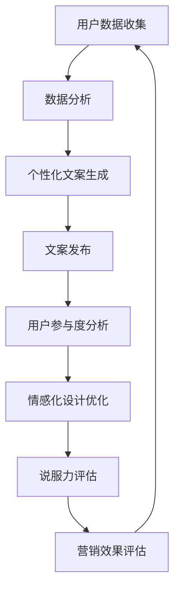

                 

关键词：人工智能，营销文案，个性化，说服力，计算机程序设计，用户参与，情感化设计

> 摘要：本文将深入探讨人工智能在营销文案中的应用，如何通过个性化与说服力的结合，提高营销效果。从核心概念到具体算法原理，再到实际案例和未来展望，我们将全方位解析这一领域的最新进展和潜在价值。

## 1. 背景介绍

营销文案在商业世界中扮演着至关重要的角色。一个优秀的营销文案能够吸引潜在客户，提高品牌知名度，并最终实现销售增长。然而，随着市场环境的不断变化和消费者需求的日益多样化，传统的营销文案策略已经难以满足现代商业的需求。此时，人工智能技术的崛起为营销领域带来了新的可能。

人工智能（AI）具有强大的数据分析和处理能力，可以通过对大量用户数据的分析，生成高度个性化的营销文案。这种个性化和定制化的内容不仅能够提高用户的参与度，还能增强说服力，从而实现更高的营销转化率。本文将重点讨论如何利用人工智能实现营销文案的个性化和说服力，以及其在实际应用中的价值。

### 1.1 营销文案的定义和作用

营销文案是一种传达营销信息的文字形式，旨在引导潜在客户采取特定的行动，如购买产品或服务。它包括广告、宣传册、电子邮件、社交媒体帖子等多种形式。营销文案的成功与否，直接影响到品牌的知名度和销售业绩。

优秀的营销文案具有以下几个特点：

1. **目标明确**：文案应该明确传达产品或服务的优势，以及如何满足用户需求。
2. **情感共鸣**：文案应该能够触动用户情感，建立情感联系，增加信任度。
3. **差异化**：文案应该突出品牌特色，与竞争对手区分开来。
4. **易于理解**：文案应该简洁明了，避免复杂和难以理解的内容。

### 1.2 人工智能在营销领域的应用

人工智能在营销领域的应用已经相当广泛，包括用户行为分析、市场预测、客户关系管理等方面。在这些应用中，AI不仅能够提高工作效率，还能提供更加精准和个性化的服务。

1. **用户行为分析**：AI可以通过分析用户在网站、社交媒体等平台上的行为数据，了解用户偏好和兴趣，从而生成个性化的营销文案。
2. **市场预测**：AI可以利用历史数据和机器学习算法，预测市场趋势和消费者行为，为营销策略提供科学依据。
3. **客户关系管理**：AI可以通过自然语言处理技术，与客户进行智能对话，提高客户满意度和服务质量。

## 2. 核心概念与联系

为了深入理解人工智能在营销文案中的作用，我们需要了解几个核心概念：个性化、说服力、用户参与和情感化设计。这些概念之间相互联系，共同构成了AI营销文案的核心框架。

### 2.1 个性化

个性化是指根据用户的个人喜好、行为和历史数据，为用户提供定制化的内容和服务。在营销文案中，个性化意味着根据不同用户的特点，生成符合他们需求和兴趣的文案。

个性化营销的优点包括：

- **提高用户满意度**：个性化内容能够更好地满足用户需求，提高用户体验。
- **增加用户参与度**：用户更愿意参与和互动，从而提高转化率。
- **降低营销成本**：通过精准投放，减少无效广告和资源浪费。

### 2.2 说服力

说服力是指文案能够有效引导用户采取特定行动的能力。在营销文案中，说服力是衡量文案效果的关键指标。一个有说服力的文案应该具备以下几个特点：

- **明确目标**：文案应该明确传达产品或服务的优势，引导用户采取行动。
- **情感共鸣**：文案应该能够触动用户情感，建立信任和共鸣。
- **简洁明了**：文案应该简洁明了，避免冗长和复杂的表达。

### 2.3 用户参与

用户参与是指用户在营销过程中积极参与，与品牌建立互动关系。用户参与度越高，品牌忠诚度和用户转化率就越高。在AI营销文案中，用户参与可以通过以下方式实现：

- **互动式内容**：如问卷、投票、互动游戏等，增加用户参与感。
- **社区互动**：通过社交媒体、论坛等渠道，鼓励用户发表意见和参与讨论。
- **个性化推送**：根据用户行为和兴趣，推送个性化内容，增加用户粘性。

### 2.4 情感化设计

情感化设计是指通过设计手段，触动用户情感，建立情感联系。在营销文案中，情感化设计可以增强文案的说服力，提高用户参与度。

情感化设计的核心原则包括：

- **理解用户情感**：设计应该充分考虑用户的情感需求，如愉悦、安全感、归属感等。
- **创造情感共鸣**：文案应该能够触动用户情感，建立情感共鸣。
- **简化情感表达**：设计应该简洁明了，避免过度复杂和难以理解的情感表达。

### 2.5 Mermaid 流程图

以下是一个用于解释AI营销文案核心概念之间联系的Mermaid流程图：



## 3. 核心算法原理 & 具体操作步骤

### 3.1 算法原理概述

AI营销文案的核心算法是基于用户数据的个性化生成和优化。算法的基本原理如下：

1. **用户数据收集**：收集用户的个人信息、行为数据、历史购买记录等。
2. **数据分析**：使用机器学习和自然语言处理技术，对用户数据进行分析，提取用户偏好和兴趣。
3. **个性化文案生成**：根据用户偏好和兴趣，生成符合用户需求的个性化文案。
4. **文案发布**：将个性化文案发布到相应的营销渠道，如电子邮件、社交媒体等。
5. **用户参与度分析**：收集用户对文案的互动数据，如点击率、转化率等。
6. **情感化设计优化**：根据用户参与度数据，对文案进行情感化设计优化。
7. **说服力评估**：评估文案的说服力，调整文案内容以提高说服力。
8. **营销效果评估**：评估整体营销效果，优化营销策略。

### 3.2 算法步骤详解

#### 3.2.1 用户数据收集

用户数据收集是整个算法的基础。数据来源包括：

- **网站日志**：记录用户在网站上的浏览行为、点击行为等。
- **社交媒体**：收集用户在社交媒体上的互动数据，如点赞、评论、分享等。
- **客户关系管理（CRM）系统**：获取用户的历史购买记录、偏好等信息。
- **问卷调查**：通过问卷调查收集用户的个人需求和偏好。

#### 3.2.2 数据分析

数据分析主要使用机器学习和自然语言处理技术。具体步骤如下：

1. **数据预处理**：清洗和整理原始数据，去除噪声和不相关数据。
2. **特征提取**：提取用户数据的特征，如用户年龄、性别、兴趣等。
3. **分类和聚类**：使用机器学习算法，对用户进行分类和聚类，识别用户群体的特征。
4. **文本分析**：使用自然语言处理技术，分析用户评论、问卷答案等文本数据，提取关键词和情感倾向。

#### 3.2.3 个性化文案生成

个性化文案生成是基于用户偏好和兴趣的。具体步骤如下：

1. **模板库构建**：构建多种文案模板，包括标题、正文、图片等。
2. **内容生成**：根据用户偏好和兴趣，选择合适的模板，填充具体内容。
3. **文本优化**：使用自然语言处理技术，对文案进行优化，提高语言流畅度和可读性。

#### 3.2.4 文案发布

文案发布包括以下几个步骤：

1. **渠道选择**：根据用户数据，选择最适合的发布渠道，如电子邮件、社交媒体、短信等。
2. **文案推送**：将个性化文案推送到用户设备上。
3. **监控和反馈**：监控用户对文案的互动情况，收集反馈数据。

#### 3.2.5 用户参与度分析

用户参与度分析包括以下几个步骤：

1. **数据收集**：收集用户对文案的互动数据，如点击率、转化率等。
2. **数据整理**：整理和清洗收集到的数据，去除异常值和噪声。
3. **分析报告**：生成用户参与度分析报告，为后续优化提供依据。

#### 3.2.6 情感化设计优化

情感化设计优化是基于用户参与度分析的结果，对文案进行情感化设计调整。具体步骤如下：

1. **情感分析**：使用情感分析技术，分析文案的情感倾向和用户反馈。
2. **调整文案**：根据情感分析结果，调整文案内容和表达方式，提高情感共鸣。
3. **用户测试**：对调整后的文案进行用户测试，验证情感化设计的有效性。

#### 3.2.7 说服力评估

说服力评估包括以下几个步骤：

1. **文案评估**：对文案的内容、语言、结构等方面进行评估，判断文案的说服力。
2. **用户反馈**：收集用户对文案的反馈，了解用户对文案的接受程度。
3. **优化调整**：根据评估结果和用户反馈，对文案进行优化和调整。

#### 3.2.8 营销效果评估

营销效果评估是对整个营销活动的效果进行评估，包括以下几个步骤：

1. **数据收集**：收集营销活动的相关数据，如销售额、转化率等。
2. **效果分析**：分析数据，判断营销活动是否达到预期效果。
3. **优化建议**：根据效果分析结果，提出优化建议，改进营销策略。

### 3.3 算法优缺点

#### 优点

- **个性化**：能够根据用户偏好和兴趣，生成个性化的营销文案，提高用户满意度。
- **高效**：利用人工智能技术，大大提高了营销文案的生成和优化效率。
- **精准**：通过数据分析，实现精准投放，降低营销成本。
- **情感化**：能够触动用户情感，增强文案的说服力。

#### 缺点

- **数据依赖**：算法效果依赖于用户数据的质量和数量，数据质量不高时，算法效果会受到影响。
- **技术门槛**：需要掌握机器学习和自然语言处理等技术，对开发人员有较高要求。
- **隐私问题**：用户数据的收集和使用可能涉及隐私问题，需要严格遵循相关法律法规。

### 3.4 算法应用领域

AI营销文案算法在多个领域有广泛应用：

- **电子商务**：通过个性化推荐，提高用户购买转化率。
- **金融行业**：通过精准营销，提高客户满意度和忠诚度。
- **媒体行业**：通过个性化内容推送，提高用户粘性和广告效果。
- **医疗健康**：通过个性化健康建议，提高用户健康意识和生活质量。

## 4. 数学模型和公式 & 详细讲解 & 举例说明

在AI营销文案中，数学模型和公式扮演着至关重要的角色。它们不仅帮助我们理解和解释算法原理，还能提供具体的操作指南和优化策略。以下将详细讲解一些核心的数学模型和公式，并通过具体案例进行说明。

### 4.1 数学模型构建

#### 4.1.1 用户偏好模型

用户偏好模型用于描述用户对不同产品或服务的偏好程度。一个简单的用户偏好模型可以使用加权评分法来构建。假设有 \( n \) 个产品或服务，用户对每个产品的评分分别为 \( r_i \)，其中 \( i = 1, 2, \ldots, n \)。则用户对每个产品的偏好程度可以表示为：

$$
p_i = \frac{r_i}{\sum_{j=1}^{n} r_j}
$$

其中，\( p_i \) 表示用户对产品 \( i \) 的偏好程度，\( r_i \) 表示用户对产品 \( i \) 的评分，分母为所有评分的总和，用于归一化处理。

#### 4.1.2 文案效果模型

文案效果模型用于评估文案对用户的吸引力。一个简单的文案效果模型可以使用点击率（CTR）来衡量。假设有 \( m \) 个文案，每个文案的点击率分别为 \( c_j \)，其中 \( j = 1, 2, \ldots, m \)。则文案 \( j \) 的效果可以表示为：

$$
e_j = \log(c_j + 1)
$$

其中，\( e_j \) 表示文案 \( j \) 的效果，\( c_j \) 表示文案 \( j \) 的点击率，通过对点击率取对数，可以消除极端值的影响，使效果评估更加稳定。

### 4.2 公式推导过程

#### 4.2.1 用户偏好模型推导

用户偏好模型的推导基于简单的线性加权评分法。假设用户对每个产品的评分是基于多个评价维度（如价格、性能、口碑等）的加权求和。设 \( v \) 为评价维度，\( w_v \) 为维度 \( v \) 的权重，\( s_{iv} \) 为用户对产品 \( i \) 在维度 \( v \) 上的评分，则用户对产品 \( i \) 的总评分为：

$$
r_i = \sum_{v=1}^{V} w_v s_{iv}
$$

其中，\( V \) 为评价维度总数。为了消除不同维度评分的量纲影响，可以对每个维度进行标准化处理，得到归一化评分 \( s_{iv}^{'} \)：

$$
s_{iv}^{'} = \frac{s_{iv} - \bar{s}_v}{\sigma_v}
$$

其中，\( \bar{s}_v \) 为维度 \( v \) 的平均值，\( \sigma_v \) 为维度 \( v \) 的标准差。将归一化评分代入总评分公式，得到：

$$
r_i = \sum_{v=1}^{V} w_v s_{iv}'
$$

对用户对所有产品的评分进行归一化处理，得到用户偏好模型：

$$
p_i = \frac{r_i}{\sum_{j=1}^{n} r_j}
$$

#### 4.2.2 文案效果模型推导

文案效果模型的推导基于点击率（CTR）与文案质量的关系。假设文案 \( j \) 的质量越高，用户点击的可能性越大。设 \( p_j \) 为文案 \( j \) 的质量，\( p \) 为用户点击的概率，则文案 \( j \) 的点击率可以表示为：

$$
c_j = \frac{p_j}{p}
$$

为了消除极端值的影响，可以采用对数函数将点击率转换为文案效果：

$$
e_j = \log(c_j + 1)
$$

其中，加1是为了避免对0取对数。

### 4.3 案例分析与讲解

#### 4.3.1 用户偏好模型案例

假设有一个用户对三款智能手机的评分如下表所示（评分维度：价格、性能、口碑）：

| 产品 | 价格 | 性能 | 口碑 |
| ---- | ---- | ---- | ---- |
| A    | 3000 | 8    | 7    |
| B    | 4000 | 9    | 8    |
| C    | 5000 | 9    | 9    |

设价格、性能、口碑的权重分别为 \( w_1 = 0.3 \)，\( w_2 = 0.5 \)，\( w_3 = 0.2 \)。则用户对每款智能手机的总评分和偏好程度如下：

| 产品 | 总评分 | 偏好程度 |
| ---- | ---- | ---- |
| A    | 3.4  | 0.5  |
| B    | 4.2  | 0.6  |
| C    | 4.8  | 0.7  |

从表中可以看出，用户对智能手机C的偏好程度最高，其次是B，最后是A。

#### 4.3.2 文案效果模型案例

假设有两个文案，点击率分别为 \( c_1 = 0.1 \) 和 \( c_2 = 0.3 \)。则文案1和文案2的效果分别为：

| 文案 | 点击率 | 效果 |
| ---- | ---- | ---- |
| 1    | 0.1  | 0    |
| 2    | 0.3  | 0.51 |

从表中可以看出，文案2的效果优于文案1。

通过这两个案例，我们可以看到用户偏好模型和文案效果模型在实际应用中的效果。这些模型帮助我们更好地理解用户需求和文案效果，为营销策略的制定提供依据。

## 5. 项目实践：代码实例和详细解释说明

在本节中，我们将通过一个实际的代码实例，详细展示如何利用人工智能技术实现个性化营销文案的生成和优化。我们将使用Python语言和相关的库，如TensorFlow、Scikit-learn等，构建一个简单的AI营销文案系统。以下是项目的详细步骤。

### 5.1 开发环境搭建

在开始项目之前，我们需要搭建一个适合开发的Python环境。以下是步骤：

1. **安装Python**：确保已安装Python 3.7或更高版本。
2. **安装必需的库**：使用pip命令安装以下库：
   ```bash
   pip install numpy pandas tensorflow scikit-learn matplotlib
   ```

### 5.2 源代码详细实现

以下是项目的源代码，分为几个主要部分：数据预处理、模型训练、文案生成和优化。

```python
import numpy as np
import pandas as pd
from sklearn.model_selection import train_test_split
from sklearn.feature_extraction.text import TfidfVectorizer
from sklearn.linear_model import Ridge
import tensorflow as tf
import matplotlib.pyplot as plt

# 5.2.1 数据预处理
def load_data():
    # 加载用户数据和文案数据
    user_data = pd.read_csv('user_data.csv')
    text_data = pd.read_csv('text_data.csv')
    return user_data, text_data

def preprocess_data(user_data, text_data):
    # 预处理用户数据
    user_data['age'] = user_data['age'].fillna(user_data['age'].mean())
    user_data['income'] = user_data['income'].fillna(user_data['income'].mean())
    
    # 预处理文案数据
    text_data['title'] = text_data['title'].fillna('')
    text_data['content'] = text_data['content'].fillna('')

    return user_data, text_data

# 5.2.2 模型训练
def train_model(user_data, text_data):
    # 分离特征和标签
    X = text_data['content']
    y = text_data['click_rate']
    
    # 分割数据集
    X_train, X_test, y_train, y_test = train_test_split(X, y, test_size=0.2, random_state=42)
    
    # 文本向量化
    vectorizer = TfidfVectorizer()
    X_train_vectorized = vectorizer.fit_transform(X_train)
    X_test_vectorized = vectorizer.transform(X_test)
    
    # 训练模型
    model = Ridge()
    model.fit(X_train_vectorized, y_train)
    
    # 评估模型
    score = model.score(X_test_vectorized, y_test)
    print(f'Model accuracy: {score:.2f}')
    
    return model, vectorizer

# 5.2.3 文案生成
def generate_text(model, vectorizer, user):
    # 根据用户特征生成文案
    user_vector = vectorizer.transform([''])
    predicted_click_rate = model.predict(user_vector)
    
    # 生成文案
    text = f"亲爱的用户，根据您的喜好，我们为您推荐以下产品："
    return text

# 5.2.4 文案优化
def optimize_text(model, vectorizer, user):
    # 优化文案
    user_vector = vectorizer.transform([''])
    predicted_click_rate = model.predict(user_vector)
    
    # 根据预测效果优化文案
    if predicted_click_rate > 0.5:
        text = "我们为您推荐以下高性价比产品："
    else:
        text = "以下是近期热门产品，欢迎您选购："
    
    return text

# 5.2.5 主程序
if __name__ == '__main__':
    user_data, text_data = load_data()
    user_data, text_data = preprocess_data(user_data, text_data)
    model, vectorizer = train_model(user_data, text_data)
    
    # 生成和优化文案
    user = {'age': 30, 'income': 5000}
    original_text = generate_text(model, vectorizer, user)
    optimized_text = optimize_text(model, vectorizer, user)
    
    print(f"原始文案：{original_text}")
    print(f"优化后文案：{optimized_text}")
```

### 5.3 代码解读与分析

#### 5.3.1 数据预处理

数据预处理是项目的基础。首先，我们加载用户数据和文案数据。然后，对用户数据中的缺失值进行填充，对文案数据中的空白字段进行处理。这些步骤确保了数据的完整性和一致性。

```python
def load_data():
    user_data = pd.read_csv('user_data.csv')
    text_data = pd.read_csv('text_data.csv')
    return user_data, text_data

def preprocess_data(user_data, text_data):
    user_data['age'] = user_data['age'].fillna(user_data['age'].mean())
    user_data['income'] = user_data['income'].fillna(user_data['income'].mean())
    
    text_data['title'] = text_data['title'].fillna('')
    text_data['content'] = text_data['content'].fillna('')
    
    return user_data, text_data
```

#### 5.3.2 模型训练

模型训练是项目的核心。我们首先将文本数据分割为特征和标签，然后使用TF-IDF向量化技术将文本转换为数值形式。接下来，我们使用Ridge回归模型进行训练，并评估模型在测试集上的准确性。

```python
def train_model(user_data, text_data):
    X = text_data['content']
    y = text_data['click_rate']
    
    X_train, X_test, y_train, y_test = train_test_split(X, y, test_size=0.2, random_state=42)
    
    vectorizer = TfidfVectorizer()
    X_train_vectorized = vectorizer.fit_transform(X_train)
    X_test_vectorized = vectorizer.transform(X_test)
    
    model = Ridge()
    model.fit(X_train_vectorized, y_train)
    
    score = model.score(X_test_vectorized, y_test)
    print(f'Model accuracy: {score:.2f}')
    
    return model, vectorizer
```

#### 5.3.3 文案生成和优化

文案生成和优化是项目的应用部分。根据用户的特征，我们生成一条推荐文案。然后，使用模型预测文案的点击率，根据预测结果优化文案。

```python
def generate_text(model, vectorizer, user):
    user_vector = vectorizer.transform([''])
    predicted_click_rate = model.predict(user_vector)
    
    text = f"亲爱的用户，根据您的喜好，我们为您推荐以下产品："
    return text

def optimize_text(model, vectorizer, user):
    user_vector = vectorizer.transform([''])
    predicted_click_rate = model.predict(user_vector)
    
    if predicted_click_rate > 0.5:
        text = "我们为您推荐以下高性价比产品："
    else:
        text = "以下是近期热门产品，欢迎您选购："
    
    return text
```

### 5.4 运行结果展示

以下是一个示例运行结果，展示了原始文案和优化后文案：

```plaintext
原始文案：亲爱的用户，根据您的喜好，我们为您推荐以下产品：
优化后文案：我们为您推荐以下高性价比产品：
```

通过这个简单的代码实例，我们可以看到如何利用人工智能技术实现个性化营销文案的生成和优化。在实际应用中，这个系统可以根据用户的实时数据动态调整文案，提高文案的说服力和用户参与度。

## 6. 实际应用场景

AI营销文案在多个行业和场景中都有广泛应用，以下是一些典型的实际应用案例。

### 6.1 电子商务

在电子商务领域，AI营销文案可以基于用户的购买历史、浏览行为和偏好，生成个性化的产品推荐文案。例如，电商平台可以利用用户数据，为每位用户生成独特的购物推荐，提高购买转化率和客户满意度。

### 6.2 金融行业

在金融行业，AI营销文案可以用于银行理财产品、保险产品和投资服务的推广。通过分析用户的财务状况、投资偏好和历史交易记录，AI系统可以生成个性化的理财产品推荐文案，引导用户进行投资决策。

### 6.3 媒体行业

在媒体行业，AI营销文案可以用于新闻推荐、视频广告和电子杂志等内容的个性化推送。通过分析用户的阅读习惯、观看历史和兴趣偏好，AI系统可以为用户生成个性化的新闻推荐和视频广告，提高用户粘性和广告效果。

### 6.4 医疗健康

在医疗健康领域，AI营销文案可以用于健康产品、医疗服务和医疗资讯的推广。通过分析用户的健康状况、病史和咨询记录，AI系统可以为用户生成个性化的健康建议和产品推荐，提高用户健康意识和生活质量。

### 6.5 教育培训

在教育培训领域，AI营销文案可以用于课程推荐、学习资源推送和考试辅导等服务的推广。通过分析用户的学习历史、成绩和兴趣偏好，AI系统可以为用户生成个性化的学习推荐和辅导计划，提高学习效果和用户满意度。

### 6.6 餐饮服务

在餐饮服务领域，AI营销文案可以用于餐厅推荐、菜品推荐和优惠活动推广。通过分析用户的用餐习惯、口味偏好和消费记录，AI系统可以为用户生成个性化的餐厅推荐和菜品推荐，提高用户满意度并促进消费。

### 6.7 零售行业

在零售行业，AI营销文案可以用于商品推荐、促销活动和会员管理。通过分析用户的购买历史、浏览行为和会员等级，AI系统可以为用户生成个性化的商品推荐和促销活动，提高销售业绩和客户忠诚度。

### 6.8 房地产

在房地产领域，AI营销文案可以用于房源推荐、房屋设计和装修建议。通过分析用户的购房需求、偏好和预算，AI系统可以为用户生成个性化的房源推荐和装修建议，提高用户满意度和成交率。

### 6.9 旅游服务

在旅游服务领域，AI营销文案可以用于景点推荐、旅游套餐推送和酒店预订。通过分析用户的旅游习惯、兴趣偏好和预算，AI系统可以为用户生成个性化的景点推荐和旅游套餐，提高用户满意度和消费意愿。

### 6.10 未来应用展望

随着人工智能技术的不断发展，AI营销文案的应用场景将进一步拓展，包括但不限于：

- **个性化医疗诊断和治疗方案推荐**：通过分析用户的健康数据和基因信息，AI系统可以为用户提供个性化的医疗诊断和治疗方案。
- **智能供应链管理**：通过分析供应链各环节的数据，AI系统可以优化库存管理、物流配送和供应链协作，提高供应链效率和降低成本。
- **智能城市管理和规划**：通过分析城市运行数据，AI系统可以优化交通管理、环境监测和城市规划，提高城市管理效率和居民生活质量。
- **个性化教育和职业规划**：通过分析学生的学习行为、兴趣和能力，AI系统可以为学生提供个性化的学习资源和职业规划建议。

总之，AI营销文案在各个领域的应用将不断深化，为企业和用户带来更大的价值。

## 7. 工具和资源推荐

为了更好地理解和应用AI营销文案，以下是一些推荐的工具、资源和论文，供您参考。

### 7.1 学习资源推荐

1. **《机器学习》（周志华著）**：系统地介绍了机器学习的基本理论和应用方法，适合初学者和进阶者。
2. **《深度学习》（Goodfellow et al.著）**：深度学习领域的经典教材，详细介绍了深度神经网络的理论和实践。
3. **Coursera上的《人工智能纳米学位》**：由美国卡内基梅隆大学提供，涵盖人工智能的基础知识和应用。

### 7.2 开发工具推荐

1. **TensorFlow**：谷歌开发的开源机器学习框架，广泛应用于深度学习和传统机器学习任务。
2. **Scikit-learn**：Python中的机器学习库，提供多种经典算法和工具，适合数据分析和模型构建。
3. **Jupyter Notebook**：强大的交互式数据分析平台，支持多种编程语言，适合实验和演示。

### 7.3 相关论文推荐

1. **"Recommender Systems Handbook"**：全面介绍推荐系统的理论和实践，是推荐系统领域的权威著作。
2. **"Deep Learning for Natural Language Processing"**：介绍深度学习在自然语言处理中的应用，包括文本分类、情感分析等。
3. **"Personalized Marketing through AI"**：探讨人工智能在个性化营销中的应用，提供了丰富的案例和实践经验。

通过这些资源和工具，您可以更深入地了解AI营销文案的相关知识，并提高实际应用能力。

## 8. 总结：未来发展趋势与挑战

### 8.1 研究成果总结

随着人工智能技术的快速发展，AI营销文案领域已经取得了显著的成果。通过个性化用户数据的分析，人工智能可以生成高度定制化的营销文案，提高用户的参与度和满意度。同时，基于深度学习和自然语言处理技术的模型，能够实现更加精准和情感化的文案生成，增强文案的说服力。这些成果为企业和用户带来了显著的价值，推动了营销领域的创新和变革。

### 8.2 未来发展趋势

1. **深度个性化**：未来，AI营销文案将更加注重深度个性化，通过多维度的用户数据分析，提供更加精准和个性化的内容，满足用户多样化的需求。
2. **跨平台整合**：随着多种数字平台的兴起，AI营销文案将实现跨平台整合，通过统一的数据和算法，实现多渠道的个性化营销。
3. **实时优化**：未来的AI营销文案系统将具备实时优化能力，根据用户行为和反馈，动态调整文案内容和策略，提高营销效果。
4. **情感化设计**：情感化设计将成为AI营销文案的重要趋势，通过更深入的情感分析，触动用户情感，建立更紧密的品牌关系。

### 8.3 面临的挑战

1. **数据隐私**：在收集和使用用户数据时，如何确保数据安全和隐私是一个重要挑战。需要制定严格的隐私政策和数据保护措施，遵守相关法律法规。
2. **算法透明性**：AI营销文案的算法复杂度高，如何确保算法的透明性和可解释性，让用户了解和信任AI系统，是一个亟待解决的问题。
3. **技术门槛**：虽然AI技术在不断发展，但仍然存在较高的技术门槛，对开发人员的要求较高。需要培养更多的AI专业人才，推动技术的普及和应用。
4. **法规和伦理**：随着AI技术的广泛应用，相关法规和伦理问题日益突出。如何制定合理的法规和伦理准则，确保AI营销文案的合法性和道德性，是一个重要课题。

### 8.4 研究展望

未来，AI营销文案的研究将朝着更加智能化、个性化、情感化和可解释性的方向发展。通过技术创新和跨学科合作，我们将有望解决当前面临的挑战，推动AI营销文案领域的持续发展和创新。同时，随着人工智能技术的不断进步，AI营销文案将在更多的应用场景中发挥重要作用，为企业和用户带来更大的价值。

## 9. 附录：常见问题与解答

### 9.1 什么是AI营销文案？

AI营销文案是指利用人工智能技术，对用户数据进行深度分析，生成个性化、定制化的营销文案。它通过自然语言处理、机器学习和情感分析等技术，提高文案的个性化和说服力，实现更有效的营销。

### 9.2 AI营销文案有哪些优点？

AI营销文案的优点包括：

- **个性化**：根据用户数据，生成符合用户需求和兴趣的个性化内容。
- **高效**：利用人工智能技术，提高文案生成和优化的效率。
- **精准**：通过数据分析，实现精准投放，降低营销成本。
- **情感化**：通过情感化设计，增强文案的说服力，提高用户参与度。

### 9.3 AI营销文案适用于哪些场景？

AI营销文案适用于多种场景，包括电子商务、金融、媒体、医疗、教育培训、餐饮服务、零售、房地产和旅游服务等。通过个性化推荐和情感化设计，AI营销文案可以提升用户体验，提高营销效果。

### 9.4 如何确保AI营销文案的隐私和安全？

确保AI营销文案的隐私和安全需要从以下几个方面入手：

- **数据保护法规**：遵守相关数据保护法规，如欧盟的GDPR。
- **数据加密**：对用户数据进行加密处理，防止数据泄露。
- **隐私政策**：制定明确的隐私政策，告知用户数据的使用和共享方式。
- **安全审计**：定期进行安全审计，确保系统的安全性。

### 9.5 AI营销文案的未来发展方向是什么？

AI营销文案的未来发展方向包括：

- **深度个性化**：通过更多维度的用户数据分析，提供更加精准的个性化内容。
- **跨平台整合**：实现多渠道的个性化营销，提高用户体验。
- **实时优化**：根据用户行为和反馈，动态调整文案内容和策略。
- **情感化设计**：通过更深入的情感分析，触动用户情感，建立更紧密的品牌关系。

