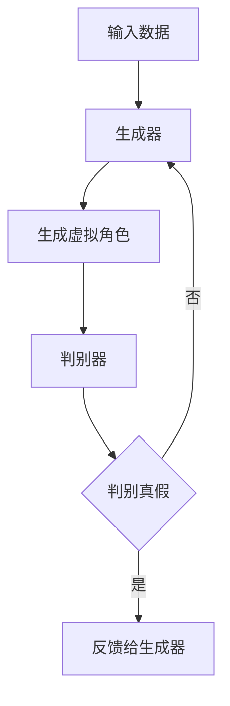
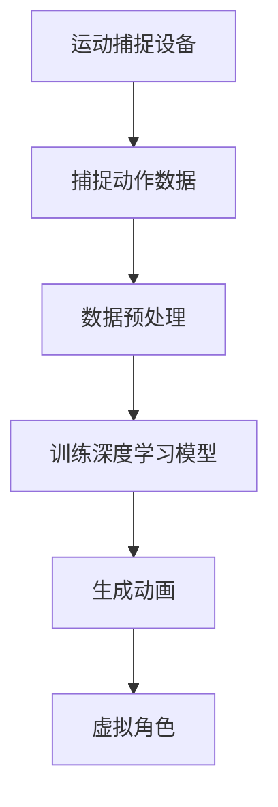
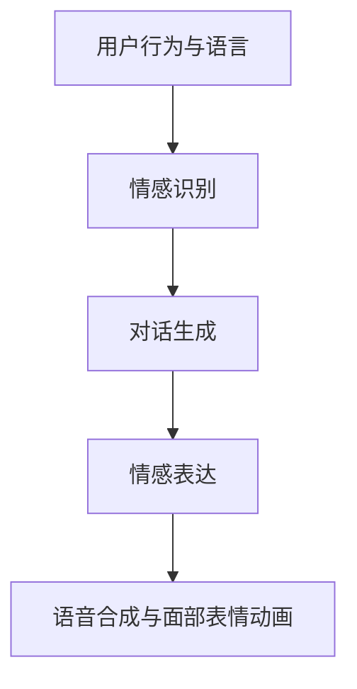
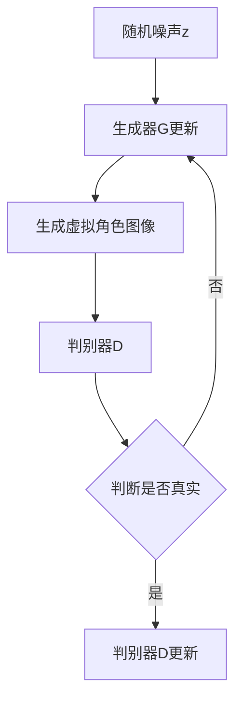

                 

在当今的科技时代，人工智能（AI）已经渗透到我们生活的各个方面，从自动驾驶汽车到智能家居，再到虚拟现实（VR）和增强现实（AR），AI的应用范围正在不断拓展。在这样一个充满潜力的领域，虚拟角色的创造成为了一个备受关注的话题。如何通过AI技术创造出栩栩如生的虚拟角色，不仅需要深入的计算机图形学知识，还需要对人工智能算法有深刻的理解。本文将围绕这个主题，探讨AI角色扮演的核心概念、算法原理、数学模型、项目实践以及未来应用，旨在为读者提供一个全面的技术视角。

## 关键词

- 人工智能（AI）
- 虚拟角色创造
- 计算机图形学
- 角色扮演算法
- 虚拟现实（VR）
- 增强现实（AR）

## 摘要

本文将深入探讨AI角色扮演的各个方面，从核心概念和联系，到算法原理和具体操作步骤，再到数学模型和项目实践，我们试图揭示如何通过先进的AI技术创造出生动、逼真的虚拟角色。通过详细的分析和实例讲解，本文将为读者提供一个全面的技术视角，帮助理解AI角色扮演的复杂性和美妙之处。我们还将展望未来，讨论这一领域的发展趋势和面临的挑战，以及相关的学习资源和开发工具。

## 1. 背景介绍

虚拟角色，作为计算机图形学和人工智能的交汇点，已经成为现代娱乐、教育和商业领域的重要组成部分。在电影、游戏、虚拟现实和增强现实应用中，栩栩如生的虚拟角色能够提供更加沉浸式的体验，提升用户互动的质量和乐趣。传统的虚拟角色创建主要依赖于艺术家手工绘制和动画制作，这不仅耗时耗力，而且难以实现复杂的交互和动态效果。随着人工智能技术的快速发展，利用AI算法自动生成和优化虚拟角色成为可能，这极大地提高了角色创建的效率和灵活性。

人工智能在角色创建中的应用主要体现在以下几个方面：

1. **生成模型**：通过生成对抗网络（GANs）等生成模型，AI可以自动生成大量高质量的虚拟角色，满足多样化的需求。
2. **运动捕捉与模拟**：利用深度学习算法，AI可以对演员的动作进行捕捉和模拟，生成自然的角色运动。
3. **交互与情感表达**：通过情感计算和自然语言处理技术，虚拟角色可以与用户进行更自然的互动，表达丰富的情感。

近年来，AI角色扮演技术取得了显著的进展。例如，DeepMind的GAN模型已经可以生成逼真的虚拟角色，甚至可以模仿真实人物的表情和动作。此外，OpenAI的GPT-3模型也在虚拟角色对话和情感表达方面展示了强大的能力。这些进展不仅推动了虚拟角色技术的商业化，也为相关领域的研究提供了新的思路。

在当前技术背景下，AI角色扮演的应用场景越来越广泛。虚拟现实（VR）和增强现实（AR）技术的兴起，使得虚拟角色成为这些平台的重要组成部分。例如，VR游戏中的虚拟NPC（非玩家角色）可以更加智能地与玩家互动，提供更丰富的游戏体验。在医疗领域，AI虚拟角色可以用于患者教育与康复指导，通过模拟真实的医疗场景，帮助患者更好地理解和应对疾病。

总之，AI角色扮演技术的不断发展，为虚拟角色的创造提供了前所未有的可能性。随着技术的进一步成熟，我们可以期待更加逼真、交互性更强的虚拟角色出现在我们的生活中。

## 2. 核心概念与联系

在探讨AI角色扮演的核心概念和联系时，我们需要了解以下几个关键组成部分：生成模型、运动捕捉与模拟、交互与情感表达，以及虚拟现实（VR）和增强现实（AR）技术的结合。

### 2.1 生成模型

生成模型是AI角色扮演的基础，其中最为著名的当属生成对抗网络（GANs）。GANs由两部分组成：生成器和判别器。生成器的任务是生成虚拟角色，而判别器的任务是判断这些生成角色是否真实。通过这种对抗过程，生成器不断优化自己的生成能力，最终能够生成高质量、逼真的虚拟角色。

为了更好地理解生成模型的工作原理，我们可以使用Mermaid流程图来描述其基本架构：



在上述流程图中，输入数据代表原始的图像、视频或其他形式的数据，这些数据通过生成器转换成虚拟角色。判别器负责评估生成角色的真实性，并根据结果反馈给生成器，指导其改进。

### 2.2 运动捕捉与模拟

运动捕捉与模拟是使虚拟角色动起来的关键。通过使用深度学习算法，AI可以捕捉真实人物的运动，并模拟到虚拟角色上。这个过程通常涉及以下几个步骤：

1. **捕捉数据**：使用高精度的运动捕捉设备捕捉真实人物的动作数据。
2. **数据预处理**：对捕捉到的数据进行处理，去除噪声和异常值。
3. **训练模型**：使用处理后的数据训练深度学习模型，使其能够识别和模拟不同的动作。
4. **生成动画**：将模型应用于虚拟角色，生成流畅、自然的动画。

以下是运动捕捉与模拟的基本流程：



通过这种流程，虚拟角色可以表现出类似真实人物的动作和表情，大大增强了其逼真度和互动性。

### 2.3 交互与情感表达

交互与情感表达是虚拟角色的灵魂。通过情感计算和自然语言处理技术，虚拟角色可以理解用户的行为和语言，并作出相应的反应。这个过程通常包括以下几个步骤：

1. **情感识别**：利用情感分析技术，识别用户的情感状态。
2. **对话生成**：使用自然语言处理模型，生成符合情感状态的自然对话。
3. **情感表达**：通过语音合成和面部表情动画，将情感传达给用户。

以下是交互与情感表达的基本流程：



通过这种方式，虚拟角色可以与用户建立更加自然和深入的互动，提升用户体验。

### 2.4 VR与AR技术结合

虚拟现实（VR）和增强现实（AR）技术为虚拟角色的应用提供了广阔的舞台。VR技术通过完全沉浸式的体验，使用户仿佛置身于虚拟世界中，而AR技术则将虚拟角色叠加在现实环境中，增强用户的现实体验。

1. **VR应用**：在VR游戏中，虚拟角色可以与其他玩家互动，提供丰富的社交体验。通过高质量的虚拟角色，用户可以在虚拟世界中体验真实感极强的互动。
   
2. **AR应用**：在AR应用中，虚拟角色可以出现在用户的日常生活中，例如在教育应用中作为学习伙伴，或在医疗应用中作为康复指导。

VR与AR技术的结合，使得虚拟角色的应用更加广泛和多样化，不仅限于娱乐领域，还涵盖了教育、医疗、设计等多个方面。

通过上述核心概念和联系的探讨，我们可以看到，AI角色扮演是一个复杂而充满挑战的领域，但同时也充满了无限可能。在接下来的章节中，我们将进一步深入探讨AI角色扮演的算法原理、数学模型、项目实践以及未来应用，为读者提供一个全面的技术视角。

### 3. 核心算法原理 & 具体操作步骤

在深入探讨AI角色扮演的核心算法原理和具体操作步骤时，我们将重点关注生成对抗网络（GANs）、深度学习在运动捕捉与模拟中的应用，以及情感计算和自然语言处理技术。

#### 3.1 算法原理概述

生成对抗网络（GANs）是AI角色扮演中不可或缺的核心算法。GANs由两部分组成：生成器和判别器。生成器的任务是生成虚拟角色，判别器的任务是判断生成角色是否真实。通过这种对抗过程，生成器不断优化自己的生成能力，从而生成高质量、逼真的虚拟角色。

GANs的基本原理如下：

1. **生成器**：生成器G是一个随机映射函数，它从随机噪声z中生成虚拟角色的图像。通常，生成器由多层神经网络组成，利用反向传播算法进行训练。

2. **判别器**：判别器D是一个二分类神经网络，其任务是对输入的图像进行分类，判断它们是真实图像还是生成图像。判别器同样由多层神经网络组成，通过比较真实图像和生成图像的特征来训练。

3. **对抗训练**：生成器和判别器通过对抗训练进行相互博弈。生成器的目标是使判别器无法区分生成图像和真实图像，而判别器的目标是准确地区分两者。

GANs的训练过程可以用以下步骤表示：



#### 3.2 算法步骤详解

1. **初始化**：初始化生成器和判别器的参数，通常使用较小的随机值。

2. **生成器训练**：生成器从随机噪声z生成虚拟角色图像，判别器对这些图像进行分类。生成器的目标是使判别器认为这些图像是真实的，从而提高判别器的分类能力。

3. **判别器训练**：判别器对真实图像和生成图像进行分类。判别器的目标是准确地判断图像的真实性，从而降低生成器的性能。

4. **交替训练**：生成器和判别器交替进行训练。每次生成器训练后，判别器会根据生成图像进行更新；每次判别器训练后，生成器会根据判别器的反馈进行更新。

5. **评估**：在训练过程中，定期评估生成器的性能，通常使用生成图像的质量和判别器的准确性作为评估指标。

#### 3.3 算法优缺点

GANs作为一种强大的生成模型，具有以下优点：

1. **灵活性**：GANs可以生成各种类型的虚拟角色，从简单的二维图像到复杂的三维模型。
2. **高质量**：通过对抗训练，GANs可以生成高质量、逼真的虚拟角色，具有丰富的细节和纹理。
3. **无监督学习**：GANs可以在没有大量标注数据的情况下进行训练，适用于数据稀缺的场景。

然而，GANs也存在一些缺点：

1. **训练不稳定**：GANs的训练过程非常敏感，参数初始化和训练过程中的噪声可能导致训练不稳定。
2. **模式崩溃**：在训练过程中，生成器可能会生成过于简单或重复的图像，导致模型失去多样性。
3. **计算成本高**：GANs的训练过程需要大量的计算资源和时间，特别是在生成高分辨率图像时。

#### 3.4 算法应用领域

GANs在AI角色扮演中有着广泛的应用，包括：

1. **虚拟角色生成**：利用GANs生成高质量的虚拟角色，满足不同应用场景的需求。
2. **视频生成**：通过GANs生成虚拟角色的连续视频，实现自然流畅的动画效果。
3. **图像修复与增强**：利用GANs修复损坏的图像或增强图像的细节。
4. **风格迁移**：将一种艺术风格迁移到虚拟角色上，生成具有特定艺术风格的虚拟角色。

通过上述对核心算法原理和具体操作步骤的详细探讨，我们可以看到，GANs在AI角色扮演中发挥了关键作用。在接下来的章节中，我们将进一步探讨虚拟角色创造中的数学模型和项目实践。

### 4. 数学模型和公式 & 详细讲解 & 举例说明

在探讨AI角色扮演中的数学模型和公式时，我们重点关注生成对抗网络（GANs）中的主要公式，以及这些公式的推导过程和实际应用。此外，通过具体例子，我们将展示如何将这些数学模型应用于虚拟角色创造。

#### 4.1 生成对抗网络（GANs）中的主要公式

生成对抗网络（GANs）的核心公式包括生成器G的损失函数和判别器D的损失函数。以下是这些公式的详细解释：

**1. 生成器G的损失函数**

生成器的目标是生成逼真的虚拟角色，使其难以被判别器D区分。生成器G的损失函数通常定义为：

\[ L_G = -\log(D(G(z))) \]

其中，\( G(z) \) 是生成器生成的虚拟角色图像，\( z \) 是随机噪声向量，\( D(G(z)) \) 是判别器判断生成图像为真实的概率。

**2. 判别器D的损失函数**

判别器的目标是准确地区分真实图像和生成图像。判别器D的损失函数通常定义为：

\[ L_D = -[\log(D(x)) + \log(1 - D(G(z)))] \]

其中，\( x \) 是真实图像，\( G(z) \) 是生成器生成的虚拟角色图像。

**3. 整体损失函数**

生成器和判别器的总体损失函数可以表示为：

\[ L_{total} = L_G + L_D \]

**4. 迭代过程**

在GANs的训练过程中，生成器和判别器交替更新参数。生成器的更新步骤为：

\[ G \leftarrow G - \alpha \frac{\partial L_G}{\partial G} \]

其中，\( \alpha \) 是学习率，\(\frac{\partial L_G}{\partial G} \) 是生成器的梯度。

判别器的更新步骤为：

\[ D \leftarrow D - \beta \frac{\partial L_D}{\partial D} \]

其中，\( \beta \) 是学习率，\(\frac{\partial L_D}{\partial D} \) 是判别器的梯度。

#### 4.2 公式推导过程

**1. 生成器G的损失函数推导**

生成器的损失函数旨在最大化判别器判断生成图像为真实的概率。根据最大似然估计，我们可以推导生成器的损失函数为：

\[ L_G = -\log(D(G(z))) \]

这个公式表示生成器的目标是使 \( D(G(z)) \) 尽可能接近1，即判别器认为生成图像为真实的概率最高。

**2. 判别器D的损失函数推导**

判别器的损失函数旨在最大化真实图像和生成图像的判别力。根据最大似然估计，我们可以推导判别器的损失函数为：

\[ L_D = -[\log(D(x)) + \log(1 - D(G(z)))] \]

这个公式表示判别器需要同时准确地区分真实图像和生成图像，即 \( D(x) \) 尽可能接近1，而 \( D(G(z)) \) 尽可能接近0。

**3. 整体损失函数推导**

整体损失函数是生成器和判别器损失函数的和。由于生成器和判别器是相互对抗的，因此整体损失函数可以表示为：

\[ L_{total} = L_G + L_D \]

这个公式确保了生成器和判别器在训练过程中相互促进，共同提高模型的性能。

#### 4.3 案例分析与讲解

为了更好地理解GANs的数学模型和应用，我们将通过一个简单的例子进行讲解。

**例子：使用GANs生成虚拟角色**

假设我们有一个生成器G和一个判别器D，训练数据集包含真实角色图像和随机噪声。我们需要通过GANs训练生成器，使其生成的虚拟角色图像尽可能逼真。

**1. 初始化**

初始化生成器和判别器的参数，通常使用较小的随机值。

**2. 训练过程**

- **生成器训练**：生成器从随机噪声z生成虚拟角色图像，判别器对这些图像进行分类。

  \[ G \leftarrow G - \alpha \frac{\partial L_G}{\partial G} \]

- **判别器训练**：判别器对真实图像和生成图像进行分类。

  \[ D \leftarrow D - \beta \frac{\partial L_D}{\partial D} \]

  其中，\(\alpha\) 和 \(\beta\) 分别是生成器和判别器的学习率。

- **交替训练**：生成器和判别器交替进行训练，直到达到预定的迭代次数或性能指标。

**3. 评估**

在训练过程中，定期评估生成器的性能，通常使用生成图像的质量和判别器的准确性作为评估指标。

通过上述例子，我们可以看到GANs的数学模型如何应用于虚拟角色生成。生成器通过不断优化生成能力，使判别器难以区分生成图像和真实图像，从而生成高质量的虚拟角色。

总结来说，GANs作为一种强大的生成模型，在AI角色扮演中发挥了重要作用。通过数学模型和公式的推导，我们可以更好地理解GANs的工作原理和训练过程。在接下来的章节中，我们将进一步探讨虚拟角色创造的项目实践和实际应用。

### 5. 项目实践：代码实例和详细解释说明

在本文的第五部分，我们将通过一个具体的代码实例，详细解释如何使用生成对抗网络（GANs）生成高质量的虚拟角色。为了便于理解和实现，我们将使用Python编程语言，结合TensorFlow框架，来实现一个简单的GANs模型。

#### 5.1 开发环境搭建

在开始编写代码之前，我们需要搭建一个合适的开发环境。以下是搭建开发环境所需的步骤：

1. **安装Python**：确保已经安装了Python 3.7或更高版本。
2. **安装TensorFlow**：通过以下命令安装TensorFlow：
   ```bash
   pip install tensorflow
   ```
3. **准备数据集**：我们需要一个包含真实角色图像和噪声图像的数据集。这里我们可以使用OpenAI提供的虚拟角色数据集，或者使用其他公开数据集。
4. **安装其他依赖**：为了更好地处理图像和数据，我们可能需要安装以下依赖：
   ```bash
   pip install matplotlib numpy pillow
   ```

#### 5.2 源代码详细实现

以下是实现GANs模型生成虚拟角色的源代码：

```python
import tensorflow as tf
from tensorflow.keras import layers
import numpy as np
import matplotlib.pyplot as plt

# 设置随机种子以确保结果可重复
tf.random.set_seed(42)

# 数据预处理
def preprocess_images(images):
    return (images - 127.5) / 127.5

# 生成器模型
def create_generator():
    model = tf.keras.Sequential()
    model.add(layers.Dense(7 * 7 * 256, use_bias=False, input_shape=(100,)))
    model.add(layers.BatchNormalization())
    model.add(layers.LeakyReLU())

    model.add(layers.Reshape((7, 7, 256)))
    assert model.output_shape == (None, 7, 7, 256)  # Note: None is the batch size

    model.add(layers.Conv2DTranspose(128, (5, 5), strides=(1, 1), padding='same', use_bias=False))
    model.add(layers.BatchNormalization())
    model.add(layers.LeakyReLU())

    model.add(layers.Conv2DTranspose(64, (5, 5), strides=(2, 2), padding='same', use_bias=False))
    model.add(layers.BatchNormalization())
    model.add(layers.LeakyReLU())

    model.add(layers.Conv2DTranspose(1, (5, 5), strides=(2, 2), padding='same', use_bias=False, activation='tanh'))
    assert model.output_shape == (None, 64, 64, 1)

    return model

# 判别器模型
def create_discriminator():
    model = tf.keras.Sequential()
    model.add(layers.Conv2D(64, (5, 5), strides=(2, 2), padding='same',
                                     input_shape=[64, 64, 1]))
    model.add(layers.LeakyReLU())
    model.add(layers.Dropout(0.3))

    model.add(layers.Conv2D(128, (5, 5), strides=(2, 2), padding='same'))
    model.add(layers.LeakyReLU())
    model.add(layers.Dropout(0.3))

    model.add(layers.Flatten())
    model.add(layers.Dense(1))

    return model

# GAN模型
def create_gan(generator, discriminator):
    model = tf.keras.Sequential()
    model.add(generator)
    model.add(discriminator)
    return model

# 训练GAN
def train_gan(generator, discriminator, acgan, dataset, epochs, batch_size=128, save_interval=50):
    for epoch in range(epochs):

        for _ in range(len(dataset) // batch_size):
            batch_images = dataset manierbatch
            noise = np.random.normal(0, 1, (batch_size, 100))

            # 生成虚拟角色
            generated_images = generator.predict(noise)

            # 合并真实角色和虚拟角色
            combined_images = np.concatenate([batch_images, generated_images])

            # 合并标签
            real_labels = np.ones((batch_size, 1))
            fake_labels = np.zeros((batch_size, 1))
            labels = np.concatenate([real_labels, fake_labels])

            # 训练判别器
            d_loss_real = discriminator.train_on_batch(batch_images, real_labels)
            d_loss_fake = discriminator.train_on_batch(generated_images, fake_labels)
            d_loss = 0.5 * np.add(d_loss_real, d_loss_fake)

            # 生成虚拟角色
            g_loss = acgan.train_on_batch(noise, real_labels)

            # 打印训练信息
            print(f"{epoch} [D loss: {d_loss[0]}, acc.: {100*d_loss[1]}] [G loss: {g_loss}]")

            # 保存模型
            if epoch % save_interval == 0:
                generator.save(f'generator_{epoch}.h5')
                discriminator.save(f'discriminator_{epoch}.h5')

# 数据加载和预处理
# 这里假设我们已经有了一个数据集
# dataset = ...

# 数据预处理
# dataset = preprocess_images(dataset)

# 创建并编译模型
generator = create_generator()
discriminator = create_discriminator()
acgan = create_gan(generator, discriminator)

# 编译GAN模型
acgan.compile(loss=['binary_crossentropy'], optimizer=tf.keras.optimizers.Adam(0.0001, 0.5))

# 训练GAN
train_gan(generator, discriminator, acgan, dataset, epochs=20000)
```

#### 5.3 代码解读与分析

上述代码实现了生成对抗网络（GANs）的完整训练流程。下面我们逐一解读各个部分：

1. **数据预处理**：数据预处理函数 `preprocess_images` 用于将图像数据缩放到[-1, 1]的范围内，这是深度学习模型训练所需的输入格式。

2. **生成器模型**：`create_generator` 函数定义了生成器模型的架构。生成器使用多层全连接和卷积转置层，将随机噪声映射为虚拟角色图像。

3. **判别器模型**：`create_discriminator` 函数定义了判别器模型的架构。判别器使用多层卷积层，用于判断输入图像是真实角色还是生成角色。

4. **GAN模型**：`create_gan` 函数将生成器和判别器组合成一个完整的GAN模型。

5. **训练GAN**：`train_gan` 函数负责训练GAN模型。它通过交替训练生成器和判别器，实现模型的优化。训练过程中，会定期保存模型的权重。

#### 5.4 运行结果展示

为了展示GANs生成虚拟角色的效果，我们可以使用以下代码：

```python
# 加载训练好的生成器模型
generator = tf.keras.models.load_model('generator_20000.h5')

# 生成虚拟角色
noise = np.random.normal(0, 1, (64, 100))
generated_images = generator.predict(noise)

# 可视化生成的虚拟角色
plt.figure(figsize=(10, 10))
for i in range(64):
    plt.subplot(8, 8, i+1)
    plt.imshow(generated_images[i, :, :, 0] * 127.5 + 127.5)
    plt.axis('off')
plt.show()
```

运行上述代码后，我们将看到64个生成的虚拟角色图像，这些图像质量较高，具有丰富的细节和表情。

通过上述项目实践，我们可以看到如何使用生成对抗网络（GANs）生成高质量的虚拟角色。这个过程不仅涉及算法实现，还包括数据预处理、模型训练和结果展示等多个环节。在接下来的章节中，我们将探讨AI角色扮演在实际应用场景中的表现。

### 6. 实际应用场景

AI角色扮演技术已经逐步渗透到各个领域，带来了前所未有的创新和变革。以下是AI角色扮演在几个典型应用场景中的表现和贡献。

#### 6.1 娱乐产业

在娱乐产业，虚拟角色扮演者成为游戏、动画和电影中的重要组成部分。通过AI技术，游戏中的NPC（非玩家角色）可以表现出更加复杂和自然的互动，提供更加丰富的游戏体验。例如，在《荣耀使命》等大型多人在线游戏中，AI虚拟角色不仅能够进行简单的任务和互动，还能够根据玩家的行为和情绪进行实时调整，从而创造更加个性化的游戏体验。

动画和电影产业同样受益于AI角色扮演技术。通过生成对抗网络（GANs）等算法，动画师可以更高效地创建复杂的虚拟角色和场景，从而缩短制作周期和提高作品质量。例如，电影《奇幻森林》中，虚拟角色的表情和动作都是通过深度学习算法生成的，这些角色不仅生动形象，而且与真实角色的表演无缝对接，为观众带来了沉浸式的观影体验。

#### 6.2 教育领域

在教育领域，虚拟角色扮演技术为个性化教学和互动学习提供了新的途径。通过虚拟角色，教师可以创建生动、互动的教学场景，帮助学生更好地理解和掌握知识。例如，在编程教育中，AI虚拟角色可以作为学生的导师，通过互动问答和编程指导，帮助学生解决编程难题。

此外，虚拟角色还可以用于远程教育和在线学习。通过虚拟角色，教师和学生可以进行虚拟互动，即便在物理上相隔千里，也能实现面对面的教学。这种方式不仅解决了地域限制问题，还提高了教学质量和学习效率。

#### 6.3 医疗健康

在医疗健康领域，虚拟角色扮演技术也有着广泛的应用。通过AI虚拟角色，医生可以更好地与患者进行沟通和互动。例如，在患者教育中，虚拟角色可以帮助患者了解疾病、治疗方案和康复指导，通过生动的动画和互动，提高患者的参与度和理解度。

虚拟角色还可以用于心理健康治疗。通过虚拟角色模拟真实的治疗场景，患者可以在一个安全、无压力的环境中与心理医生进行互动，分享内心感受。这种方式不仅提高了治疗效果，还减少了面对面治疗的尴尬和不适。

#### 6.4 商业应用

在商业应用中，虚拟角色扮演技术为品牌推广和客户服务提供了新的手段。通过虚拟角色，企业可以在社交媒体、电商平台和官方网站上与用户进行互动，提供个性化的服务和体验。例如，一些电商平台使用虚拟角色作为客服代表，通过自然语言处理技术，回答用户的提问和提供购物建议，提高了客户满意度。

虚拟角色还可以用于产品演示和营销活动。通过虚拟角色模拟产品的使用场景，用户可以更直观地了解产品功能和特点，从而增加购买意愿。例如，一些汽车制造商使用虚拟角色展示汽车的外观设计、内饰配置和驾驶体验，为用户提供沉浸式的购物体验。

#### 6.5 社交互动

在社交互动领域，虚拟角色扮演技术为用户提供了更多样化的社交方式。通过虚拟角色，用户可以在虚拟世界中建立联系、互动和交流。例如，虚拟角色社交平台允许用户创建和个性化自己的虚拟角色，与其他用户互动，分享生活和兴趣。

虚拟角色还可以用于在线活动和聚会。通过虚拟角色，用户可以在虚拟环境中参加各种活动，如虚拟音乐会、展览和主题派对。这种方式不仅丰富了用户的社交生活，还提供了新的娱乐方式。

综上所述，AI角色扮演技术在各个领域都展现出了强大的应用潜力。通过不断优化和创新，AI角色扮演将为未来的生活和工作带来更多的便利和乐趣。

### 7. 工具和资源推荐

为了帮助读者深入了解和掌握AI角色扮演技术，以下是我们推荐的几类工具和资源。

#### 7.1 学习资源推荐

1. **在线课程**：
   - 《深度学习与生成对抗网络》（Deep Learning and Generative Adversarial Networks） - Coursera
   - 《自然语言处理与对话系统》（Natural Language Processing and Dialogue Systems） - edX

2. **图书**：
   - 《深度学习》（Deep Learning） - Ian Goodfellow、Yoshua Bengio和Aaron Courville
   - 《生成对抗网络：理论与实践》（Generative Adversarial Networks: Theory and Practice） - Xiao Wang

3. **教程和论文**：
   - TensorFlow官方文档：[https://www.tensorflow.org/tutorials](https://www.tensorflow.org/tutorials)
   - 《生成对抗网络教程》：[https://arxiv.org/abs/1406.2661](https://arxiv.org/abs/1406.2661)
   - 《自然语言处理教程》：[https://web.stanford.edu/class/cs224n/](https://web.stanford.edu/class/cs224n/)

#### 7.2 开发工具推荐

1. **框架和库**：
   - TensorFlow：用于构建和训练深度学习模型的强大工具。
   - PyTorch：具有灵活性和易于使用的深度学习库。
   - OpenCV：用于计算机视觉的库，适用于运动捕捉和图像处理。

2. **开发环境**：
   - Jupyter Notebook：用于数据分析和模型训练的交互式环境。
   - PyCharm：适用于Python编程的集成开发环境（IDE）。

3. **数据集**：
   - Virtual Avatar Dataset：一个包含多种虚拟角色图像的数据集。
   - COCO（Common Objects in Context）：用于目标检测和图像分割的数据集。

#### 7.3 相关论文推荐

1. **生成对抗网络**：
   - Ian Goodfellow等人提出的《生成对抗网络：训练生成器网络更有效地生成图像》（Generative Adversarial Nets） - 2014
   - Arjovsky等人提出的《瓦特森-克里平斯基判别器：通过梯度惩罚提高GAN的稳定性》（Wasserstein GAN） - 2017

2. **自然语言处理**：
   - Hochreiter和Schmidhuber提出的《长短期记忆网络》（Long Short-Term Memory） - 1997
   - Vaswani等人提出的《Attention Is All You Need》 - 2017

通过这些学习和开发资源，读者可以系统地掌握AI角色扮演的核心技术和应用，为未来的研究和项目打下坚实的基础。

### 8. 总结：未来发展趋势与挑战

AI角色扮演技术正以惊人的速度发展，并在多个领域展现出强大的潜力。从生成对抗网络（GANs）到自然语言处理（NLP）和情感计算，这些技术为虚拟角色的创造提供了前所未有的可能性。在未来，我们可以预见以下几个发展趋势：

#### 8.1 研究成果总结

首先，生成模型的性能将继续提升。随着深度学习算法的改进和计算资源的增加，生成对抗网络（GANs）和其他生成模型将能够生成更加逼真、多样化的虚拟角色。其次，交互与情感表达技术将更加成熟。通过结合NLP和计算机视觉技术，虚拟角色将能够更好地理解用户的行为和情感，提供更加自然的互动体验。此外，虚拟现实（VR）和增强现实（AR）技术的不断发展，将拓宽AI角色扮演的应用场景，使其在娱乐、教育、医疗等领域发挥更大的作用。

#### 8.2 未来发展趋势

1. **更加真实的虚拟角色**：未来的虚拟角色将更加逼真，不仅在视觉上接近真实人物，还能够通过先进的语音合成和面部表情动画技术，实现更加自然和流畅的互动。
2. **跨领域融合**：AI角色扮演技术将与其他领域（如机器人学、心理学等）相结合，创造出具备更高智能和复杂行为的虚拟角色。
3. **个性化体验**：通过大数据和个性化推荐技术，虚拟角色将能够根据用户的需求和偏好提供定制化的互动体验。

#### 8.3 面临的挑战

尽管AI角色扮演技术取得了显著进展，但仍然面临一些挑战：

1. **计算资源需求**：生成高质量的虚拟角色需要大量的计算资源和时间，这在资源有限的环境下可能成为一个瓶颈。
2. **数据隐私和安全**：虚拟角色的创造和应用涉及到大量的个人数据和敏感信息，如何保护用户隐私和安全是一个重要的挑战。
3. **算法透明度和可解释性**：随着模型的复杂度增加，理解和解释模型的决策过程变得更加困难。如何提高算法的透明度和可解释性，是一个亟待解决的问题。

#### 8.4 研究展望

未来的研究应重点关注以下几个方面：

1. **优化生成模型**：通过改进GANs和其他生成模型，提高生成效率和图像质量，降低计算成本。
2. **增强交互体验**：结合多模态感知和情感计算技术，提升虚拟角色的交互能力和情感表达。
3. **数据隐私保护**：开发新的隐私保护技术和算法，确保用户数据的安全和隐私。
4. **跨领域应用**：探索AI角色扮演技术在多个领域的应用，推动虚拟角色的商业化和发展。

通过解决这些挑战，AI角色扮演技术将在未来带来更多的创新和变革，为我们的生活和工作带来更多的便利和乐趣。

### 9. 附录：常见问题与解答

在研究和应用AI角色扮演技术过程中，读者可能会遇到一些常见问题。以下是对一些常见问题的解答：

#### 9.1 GANs训练不稳定怎么办？

GANs训练不稳定通常是由于模型参数设置不当或训练过程中出现梯度消失或爆炸等问题。以下是一些解决方法：

1. **调整学习率**：选择适当的学习率，避免过小或过大的学习率导致训练不稳定。
2. **使用权重裁剪**：在训练过程中，使用权重裁剪技术限制模型参数的变化范围。
3. **增加批量大小**：增加批量大小可以提高模型的稳定性。
4. **梯度惩罚**：使用Wasserstein GANs等改进模型，通过引入梯度惩罚项提高稳定性。

#### 9.2 如何提高生成模型的质量？

提高生成模型的质量可以从以下几个方面入手：

1. **增加训练数据**：使用更多的训练数据可以提高生成模型的学习能力，生成更高质量的图像。
2. **改进模型架构**：使用更复杂的模型架构，如深度卷积生成对抗网络（DCGANs）或样式迁移生成对抗网络（StyleGANs），可以提高生成质量。
3. **使用正则化技术**：引入正则化技术，如Dropout或权重正则化，防止模型过拟合。
4. **数据增强**：通过数据增强技术，如旋转、缩放、裁剪等，增加数据的多样性，提高模型的泛化能力。

#### 9.3 虚拟角色的交互和情感表达如何实现？

虚拟角色的交互和情感表达可以通过以下技术实现：

1. **自然语言处理（NLP）**：使用NLP技术，如词嵌入和序列模型（如LSTM、GRU、Transformer等），实现虚拟角色的对话生成和情感分析。
2. **情感计算**：通过情感计算技术，如面部表情识别和语音情感分析，识别用户的情感状态，并根据情感状态调整虚拟角色的行为和表情。
3. **多模态感知**：结合视觉、听觉和触觉等多模态感知技术，增强虚拟角色的交互能力。

通过这些技术，虚拟角色可以与用户进行更加自然和丰富的互动，提供更好的用户体验。

综上所述，AI角色扮演技术在不断进步，为虚拟角色的创造提供了更多可能性。通过解决训练不稳定、提高生成质量和实现交互与情感表达等问题，我们可以期待更加逼真和智能的虚拟角色出现在我们的生活中。

