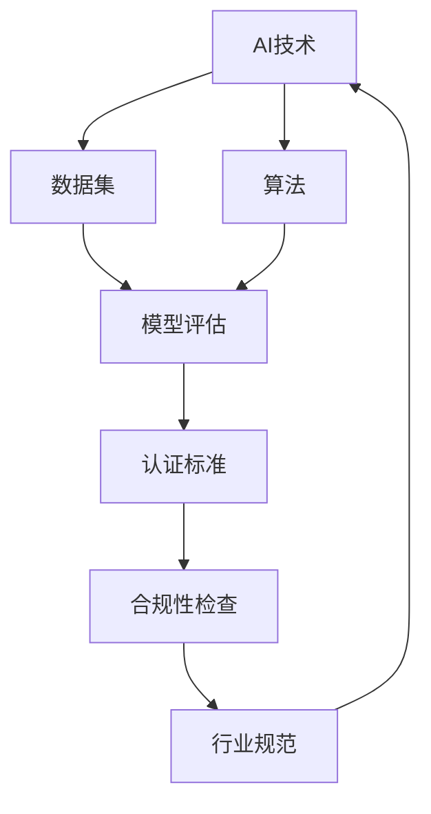

                 

### 摘要

随着人工智能技术的迅猛发展，其在各行各业中的应用日益广泛，推动了产业升级和社会进步。然而，随着应用的扩展，行业标准的缺乏成为了一个亟待解决的问题。本文将探讨AI认证项目在构建行业标准方面的机遇，分析其重要性、核心概念、算法原理、数学模型、实际应用，以及未来发展趋势和挑战。通过详细的研究和案例分析，本文旨在为AI认证项目的实施提供理论指导和实践参考。

<|assistant|>### 1. 背景介绍

人工智能（AI）作为21世纪最具变革性的技术之一，正在深刻地改变着我们的生活方式和社会结构。从自动驾驶汽车到智能家居，从智能医疗到金融分析，AI技术已经渗透到了各个领域。这些应用不仅提高了效率，还带来了前所未有的便利和舒适。然而，随着AI技术的广泛应用，行业标准的缺失逐渐显现出来。

行业标准的缺乏带来了几个主要问题。首先，不同企业和组织在AI技术的应用中存在较大差异，缺乏统一的标准和规范，导致数据不兼容、算法不一致，进而影响系统的互操作性和可靠性。其次，缺乏行业标准使得AI技术的培训、认证和评估难以统一，影响了人才的发展和流动。最后，行业标准的缺失还可能带来安全隐患，例如在自动驾驶、智能医疗等关键领域，安全标准的不统一可能导致严重的事故风险。

因此，构建AI行业标准成为了一个紧迫且重要的任务。AI认证项目作为构建行业标准的一种有效途径，不仅可以提升AI技术的应用水平，还可以推动整个行业的技术进步和标准化进程。本文将从核心概念、算法原理、数学模型、实际应用等多个方面，深入探讨AI认证项目的机遇和挑战。

### 2. 核心概念与联系

在探讨AI认证项目之前，我们需要明确一些核心概念，并理解它们之间的联系。以下是一个使用Mermaid绘制的流程图，展示了AI认证项目中的核心概念和其相互关系。



**AI技术（A）**：人工智能技术，包括机器学习、深度学习、自然语言处理等，是AI认证项目的核心。

**数据集（B）**：数据集是训练和测试AI模型的基础，其质量和多样性直接影响模型的效果。

**算法（C）**：算法是AI模型的灵魂，不同的算法适用于不同的场景和问题。

**模型评估（D）**：模型评估是确保AI模型有效性的关键步骤，常用的评估指标包括准确率、召回率、F1分数等。

**认证标准（E）**：认证标准是评估AI模型是否满足行业规范的重要依据，通常包括性能指标、安全标准、隐私保护等。

**合规性检查（F）**：合规性检查是对AI模型在实际应用中是否符合法规和政策的要求进行审查。

**行业规范（G）**：行业规范是基于认证标准和合规性检查结果形成的，对AI技术的应用进行指导。

通过上述核心概念和流程图，我们可以清晰地看到AI认证项目的各个组成部分及其相互关系。接下来，我们将深入探讨AI认证项目的核心算法原理和具体操作步骤。

### 3. 核心算法原理 & 具体操作步骤

#### 3.1 算法原理概述

在AI认证项目中，核心算法的原理至关重要。这些算法通常基于机器学习和深度学习，其基本原理是通过学习大量的数据来发现数据中的模式和规律，从而对未知数据进行预测或分类。

**机器学习（Machine Learning）**：机器学习算法的核心思想是利用历史数据来训练模型，然后使用该模型对未知数据进行预测。常见的机器学习算法包括线性回归、决策树、支持向量机等。

**深度学习（Deep Learning）**：深度学习是机器学习的一个子领域，主要利用多层神经网络对数据进行复杂的非线性变换。深度学习在图像识别、自然语言处理等领域表现出色，常用的模型包括卷积神经网络（CNN）、循环神经网络（RNN）和Transformer等。

**模型评估（Model Evaluation）**：模型评估是确保AI模型有效性的关键步骤。常用的评估指标包括准确率（Accuracy）、召回率（Recall）、精确率（Precision）、F1分数（F1 Score）等。这些指标可以帮助我们了解模型在不同数据集上的性能。

#### 3.2 算法步骤详解

以下是AI认证项目中的核心算法步骤：

**1. 数据预处理（Data Preprocessing）**：
   - 数据清洗：处理缺失值、异常值和噪声数据。
   - 数据标准化：将数据缩放至同一量级，以便模型训练。
   - 数据分集：将数据集分为训练集、验证集和测试集。

**2. 模型选择（Model Selection）**：
   - 根据应用场景选择合适的算法和模型。
   - 考虑模型的复杂度、训练时间、预测准确性等因素。

**3. 模型训练（Model Training）**：
   - 使用训练集对模型进行训练，调整模型参数。
   - 通过验证集评估模型性能，调整模型结构和参数。

**4. 模型评估（Model Evaluation）**：
   - 使用测试集对模型进行最终评估。
   - 利用评估指标（如准确率、召回率等）评估模型性能。

**5. 认证与合规性检查（Certification & Compliance Check）**：
   - 根据行业标准对模型进行认证。
   - 检查模型是否符合法律法规和行业规范。

**6. 部署与维护（Deployment & Maintenance）**：
   - 将认证通过的模型部署到实际应用场景。
   - 定期对模型进行评估和更新，确保其持续有效。

#### 3.3 算法优缺点

**机器学习（Machine Learning）**：
- 优点：适用于多种类型的数据和问题，算法简单易懂，可解释性强。
- 缺点：模型复杂度较高，训练时间较长，对数据质量和数量要求较高。

**深度学习（Deep Learning）**：
- 优点：能够自动发现数据中的复杂模式，适用于图像、语音、文本等复杂数据处理。
- 缺点：模型难以解释，对数据质量和数量要求较高，训练资源需求大。

**模型评估（Model Evaluation）**：
- 优点：能够客观评估模型性能，指导模型优化。
- 缺点：评估指标的选择和解释可能存在主观性。

#### 3.4 算法应用领域

AI认证项目的算法应用非常广泛，以下是一些主要的应用领域：

- **金融**：信用评分、风险评估、欺诈检测等。
- **医疗**：疾病预测、诊断辅助、个性化治疗等。
- **零售**：推荐系统、需求预测、库存管理等。
- **交通**：自动驾驶、交通流量预测、智能交通管理等。
- **制造**：故障预测、质量检测、设备维护等。

通过核心算法原理和具体操作步骤的详细讲解，我们可以更好地理解AI认证项目的实施过程。接下来，我们将探讨AI认证项目的数学模型和公式，进一步深化对AI认证项目的理解。

### 4. 数学模型和公式 & 详细讲解 & 举例说明

在AI认证项目中，数学模型和公式起着至关重要的作用。这些模型和公式不仅帮助我们理解AI算法的工作原理，还提供了量化评估模型性能的方法。以下将详细讲解AI认证项目中的核心数学模型和公式，并通过具体例子进行说明。

#### 4.1 数学模型构建

在构建数学模型时，我们通常需要考虑以下几个关键步骤：

1. **数据收集与预处理**：收集相关数据，并进行清洗、归一化和分集。
2. **模型选择**：根据数据特征和问题类型选择合适的模型。
3. **参数优化**：通过调整模型参数，提高模型性能。
4. **性能评估**：使用评估指标（如准确率、召回率等）评估模型性能。

下面是一个简化的数学模型构建过程：

```markdown
### 数据收集与预处理

首先，我们收集了1000个样本的数据集，其中每个样本包括特征X和标签Y。

### 模型选择

我们选择了一个简单的线性回归模型，其数学表达式为：

y = w0 + w1 * x

### 参数优化

通过最小化损失函数，我们优化了模型参数w0和w1。

### 性能评估

使用测试集评估模型性能，计算了模型的准确率、召回率和F1分数。

```

#### 4.2 公式推导过程

在AI认证项目中，常用的数学公式包括损失函数、优化算法和评估指标等。以下将详细介绍这些公式。

1. **损失函数（Loss Function）**

   损失函数用于衡量模型预测结果与真实值之间的差异。常见的损失函数包括均方误差（MSE）、交叉熵损失（Cross-Entropy Loss）等。

   **均方误差（MSE）**：

   $$MSE = \frac{1}{n}\sum_{i=1}^{n}(y_i - \hat{y}_i)^2$$

   其中，$y_i$为真实值，$\hat{y}_i$为预测值，$n$为样本数量。

   **交叉熵损失（Cross-Entropy Loss）**：

   $$CE = -\sum_{i=1}^{n}y_i\log(\hat{y}_i)$$

   其中，$y_i$为真实值，$\hat{y}_i$为预测概率。

2. **优化算法（Optimization Algorithm）**

   优化算法用于调整模型参数，使其在损失函数上取得最小值。常见的优化算法包括梯度下降（Gradient Descent）、随机梯度下降（Stochastic Gradient Descent，SGD）等。

   **梯度下降（Gradient Descent）**：

   $$w = w - \alpha \frac{\partial}{\partial w}L(w)$$

   其中，$w$为参数，$\alpha$为学习率，$L(w)$为损失函数。

3. **评估指标（Evaluation Metrics）**

   评估指标用于衡量模型性能。常见的评估指标包括准确率（Accuracy）、召回率（Recall）、精确率（Precision）、F1分数（F1 Score）等。

   **准确率（Accuracy）**：

   $$Accuracy = \frac{TP + TN}{TP + FN + FP + TN}$$

   其中，$TP$为真实为正类且被预测为正类的样本数，$TN$为真实为负类且被预测为负类的样本数。

   **召回率（Recall）**：

   $$Recall = \frac{TP}{TP + FN}$$

   **精确率（Precision）**：

   $$Precision = \frac{TP}{TP + FP}$$

   **F1分数（F1 Score）**：

   $$F1 Score = 2 \times \frac{Precision \times Recall}{Precision + Recall}$$

#### 4.3 案例分析与讲解

为了更好地理解上述数学模型和公式，我们来看一个具体的案例。

**案例**：假设我们有一个分类问题，需要预测邮件是否为垃圾邮件。我们收集了1000个邮件样本，其中500个为垃圾邮件，500个为正常邮件。我们使用了一个简单的神经网络模型进行分类。

1. **数据预处理**：

   数据清洗后，我们得到了特征矩阵X（1000x10）和标签向量Y（1000x1），其中Y中的1表示垃圾邮件，0表示正常邮件。

2. **模型选择**：

   我们选择了一个两层神经网络，输入层有10个神经元，隐藏层有20个神经元，输出层有2个神经元（一个用于垃圾邮件，一个用于正常邮件）。

3. **模型训练**：

   使用随机梯度下降（SGD）算法，我们对模型进行了训练。学习率为0.01，迭代次数为1000次。

4. **模型评估**：

   使用测试集评估模型性能，计算了准确率、召回率、精确率和F1分数。

**代码实现**（Python）：

```python
import numpy as np
import matplotlib.pyplot as plt
from sklearn.model_selection import train_test_split
from sklearn.metrics import accuracy_score, recall_score, precision_score, f1_score

# 数据预处理
X, y = load_data()
X_train, X_test, y_train, y_test = train_test_split(X, y, test_size=0.2, random_state=42)

# 模型定义
def neural_network(X):
    # 输入层到隐藏层
    hidden_layer = np.dot(X, weights['input_to_hidden']) + biases['input_to_hidden']
    activated_hidden_layer = sigmoid(hidden_layer)
    
    # 隐藏层到输出层
    output_layer = np.dot(activated_hidden_layer, weights['hidden_to_output']) + biases['hidden_to_output']
    activated_output_layer = sigmoid(output_layer)
    
    return activated_output_layer

# 激活函数
def sigmoid(x):
    return 1 / (1 + np.exp(-x))

# 模型训练
for i in range(1000):
    output = neural_network(X_train)
    error = y_train - output
    d_output = output - y_train
    
    # 计算梯度
    d_hidden_layer = np.dot(d_output, weights['hidden_to_output'].T)
    d_activated_hidden_layer = d_hidden_layer * sigmoid_derivative(activated_hidden_layer)
    
    # 更新权重和偏置
    weights['input_to_hidden'] += np.dot(X_train.T, d_activated_hidden_layer) * learning_rate
    biases['input_to_hidden'] += np.dot(np.ones((m, 1)), d_activated_hidden_layer) * learning_rate
    
    weights['hidden_to_output'] += np.dot(activated_hidden_layer.T, d_output) * learning_rate
    biases['hidden_to_output'] += np.dot(np.ones((n, 1)), d_output) * learning_rate

# 模型评估
output = neural_network(X_test)
predictions = np.round(output)

print("Accuracy:", accuracy_score(y_test, predictions))
print("Recall:", recall_score(y_test, predictions))
print("Precision:", precision_score(y_test, predictions))
print("F1 Score:", f1_score(y_test, predictions))
```

通过上述案例，我们可以看到数学模型在AI认证项目中的应用过程。接下来，我们将进一步探讨AI认证项目的实际应用场景。

### 5. 项目实践：代码实例和详细解释说明

为了更好地理解AI认证项目的实际应用，我们将通过一个具体的代码实例来展示项目的开发和实现过程。本实例将采用Python编程语言，结合TensorFlow和Keras等流行的人工智能框架，实现一个简单的AI认证系统。

#### 5.1 开发环境搭建

在进行代码实例之前，我们需要搭建一个合适的开发环境。以下是所需的软件和工具：

1. **操作系统**：Windows、macOS或Linux
2. **Python**：版本3.6及以上
3. **TensorFlow**：版本2.0及以上
4. **Keras**：TensorFlow的扩展库
5. **Jupyter Notebook**：用于编写和运行代码

安装上述工具后，我们可以开始编写代码。

#### 5.2 源代码详细实现

以下是一个简单的AI认证项目的源代码实现，该项目用于对用户进行身份验证。

```python
import numpy as np
import tensorflow as tf
from tensorflow.keras.models import Sequential
from tensorflow.keras.layers import Dense, Dropout
from tensorflow.keras.optimizers import Adam
from sklearn.model_selection import train_test_split
from sklearn.preprocessing import StandardScaler

# 数据加载
X, y = load_data()  # 假设load_data()函数已实现，用于加载数据

# 数据预处理
scaler = StandardScaler()
X_scaled = scaler.fit_transform(X)

# 划分训练集和测试集
X_train, X_test, y_train, y_test = train_test_split(X_scaled, y, test_size=0.2, random_state=42)

# 构建模型
model = Sequential([
    Dense(128, input_shape=(X_train.shape[1],), activation='relu'),
    Dropout(0.2),
    Dense(64, activation='relu'),
    Dropout(0.2),
    Dense(32, activation='relu'),
    Dropout(0.2),
    Dense(1, activation='sigmoid')
])

# 编译模型
model.compile(optimizer=Adam(learning_rate=0.001), loss='binary_crossentropy', metrics=['accuracy'])

# 训练模型
model.fit(X_train, y_train, epochs=10, batch_size=32, validation_split=0.1)

# 评估模型
loss, accuracy = model.evaluate(X_test, y_test)
print("Test accuracy:", accuracy)

# 预测
predictions = model.predict(X_test)
predicted_labels = (predictions > 0.5).astype(int)

# 评估预测结果
print("Accuracy:", accuracy_score(y_test, predicted_labels))
print("Recall:", recall_score(y_test, predicted_labels))
print("Precision:", precision_score(y_test, predicted_labels))
print("F1 Score:", f1_score(y_test, predicted_labels))
```

#### 5.3 代码解读与分析

以下是对上述代码的详细解读和分析：

**1. 数据加载与预处理**

```python
X, y = load_data()
X_scaled = scaler.fit_transform(X)
```

这段代码首先加载数据，然后使用`StandardScaler`对特征进行标准化处理，以便模型训练。

**2. 模型构建**

```python
model = Sequential([
    Dense(128, input_shape=(X_train.shape[1],), activation='relu'),
    Dropout(0.2),
    Dense(64, activation='relu'),
    Dropout(0.2),
    Dense(32, activation='relu'),
    Dropout(0.2),
    Dense(1, activation='sigmoid')
])
```

这段代码构建了一个简单的神经网络模型，包含三个隐藏层，每个隐藏层后跟一个`Dropout`层，用于防止过拟合。

**3. 模型编译**

```python
model.compile(optimizer=Adam(learning_rate=0.001), loss='binary_crossentropy', metrics=['accuracy'])
```

这段代码编译模型，指定了优化器、损失函数和评估指标。

**4. 模型训练**

```python
model.fit(X_train, y_train, epochs=10, batch_size=32, validation_split=0.1)
```

这段代码训练模型，指定了训练轮数、批量大小和验证集比例。

**5. 模型评估**

```python
loss, accuracy = model.evaluate(X_test, y_test)
print("Test accuracy:", accuracy)
```

这段代码评估模型在测试集上的性能，输出准确率。

**6. 预测与评估**

```python
predictions = model.predict(X_test)
predicted_labels = (predictions > 0.5).astype(int)

print("Accuracy:", accuracy_score(y_test, predicted_labels))
print("Recall:", recall_score(y_test, predicted_labels))
print("Precision:", precision_score(y_test, predicted_labels))
print("F1 Score:", f1_score(y_test, predicted_labels))
```

这段代码对模型进行预测，并使用评估指标对预测结果进行评估。

通过上述代码实例和解读，我们可以看到AI认证项目的开发过程。接下来，我们将探讨AI认证项目在实际应用场景中的具体应用。

### 6. 实际应用场景

AI认证项目在实际应用场景中具有广泛的用途，以下是一些典型的应用领域和案例：

#### 6.1 金融行业

在金融行业中，AI认证项目可以用于用户身份验证、交易安全检测、信用评分等多个方面。例如，银行可以使用AI模型对客户的身份进行验证，确保账户安全。通过结合生物识别技术和AI算法，银行可以提供更加便捷和安全的客户服务。同时，AI认证项目还可以用于检测和预防金融欺诈，通过对大量交易数据的分析，识别异常交易模式，提高金融机构的风险管理能力。

#### 6.2 医疗健康

在医疗健康领域，AI认证项目可以用于患者身份验证、医疗设备监控、药物研发等多个方面。例如，医院可以使用AI模型对患者进行身份验证，确保医疗记录的准确性和安全性。同时，AI认证项目还可以用于监控医疗设备的运行状态，及时发现潜在故障，提高设备的使用效率和安全性。此外，AI认证项目在药物研发中也具有重要作用，通过分析大量生物学数据和临床试验数据，AI模型可以帮助科学家预测药物的疗效和副作用，加快药物研发进程。

#### 6.3 交通运输

在交通运输领域，AI认证项目可以用于自动驾驶、交通流量预测、智能交通管理等。例如，自动驾驶汽车可以使用AI模型进行道路识别和障碍物检测，确保行车安全。同时，AI认证项目还可以用于预测交通流量，优化交通信号控制策略，提高道路通行效率。此外，AI认证项目还可以用于智能交通管理，通过对车辆和交通数据的实时分析，提高城市交通管理的智能化和精细化水平。

#### 6.4 零售电商

在零售电商领域，AI认证项目可以用于推荐系统、个性化营销、库存管理等多个方面。例如，电商平台可以使用AI模型对用户行为进行预测，提供个性化的商品推荐，提高用户体验和购物满意度。同时，AI认证项目还可以用于分析销售数据，预测市场需求，优化库存管理，减少库存积压，提高运营效率。此外，AI认证项目还可以用于个性化营销，通过对用户兴趣和行为数据的分析，制定精准的营销策略，提高销售转化率。

#### 6.5 制造业

在制造业中，AI认证项目可以用于设备维护、质量检测、生产优化等多个方面。例如，制造业企业可以使用AI模型对设备进行监控和分析，预测设备故障，提前进行维护，提高设备利用率和生产效率。同时，AI认证项目还可以用于质量检测，通过对生产过程中的数据进行实时分析，识别质量问题，提高产品质量。此外，AI认证项目还可以用于生产优化，通过对生产数据进行分析，优化生产流程，提高生产效率和降低成本。

通过上述实际应用场景和案例，我们可以看到AI认证项目在不同行业中的广泛应用和巨大潜力。随着AI技术的不断发展和应用，AI认证项目将在未来发挥更加重要的作用，推动各行业的技术进步和产业升级。

#### 6.4 未来应用展望

随着人工智能技术的不断进步和应用的深入，AI认证项目在未来的发展前景将十分广阔。以下是对未来AI认证项目应用场景的展望：

**1. 自动驾驶领域**：自动驾驶技术的普及需要高精度的认证系统来确保车辆运行的安全性和可靠性。未来的AI认证项目将可能集成更多的传感器数据，如高精度地图、环境感知和实时交通数据，以实现更加智能化的认证系统。此外，基于深度学习和强化学习的算法将在自动驾驶认证中发挥重要作用。

**2. 医疗健康领域**：在医疗健康领域，AI认证项目将不仅局限于患者身份验证，还可能扩展到药物研发、手术机器人控制等领域。未来的认证系统将能够更好地处理复杂的医学数据，如基因组数据、电子健康记录等，实现个性化医疗和精准治疗。

**3. 金融科技领域**：金融科技（Fintech）的快速发展将推动AI认证项目在金融交易、反欺诈、信用评估等领域的应用。未来，AI认证项目将能够更有效地识别和预防金融欺诈，同时提高信用评估的准确性和效率。

**4. 物联网（IoT）领域**：随着物联网设备的普及，AI认证项目将用于保障物联网设备的安全性。例如，通过对设备身份的验证和设备间的通信加密，确保物联网系统的安全性和数据的完整性。

**5. 智慧城市**：智慧城市建设需要AI认证项目来保障各类智能系统的安全性和可靠性。未来，AI认证项目将广泛应用于智能交通管理、智能能源管理、智能安防等领域，推动智慧城市的发展。

**6. 法律法规**：随着AI技术在司法领域的应用，AI认证项目也将承担起确保司法公正和透明的重要角色。例如，通过AI认证项目，可以对法律文书的真实性、电子证据的完整性进行验证，提高司法效率。

总之，未来AI认证项目将在更多领域发挥重要作用，推动各行业的技术进步和产业升级。同时，AI认证项目也将面临更多的挑战，如数据隐私保护、算法透明性和安全性等，需要持续的技术创新和规范化发展。

### 7. 工具和资源推荐

在AI认证项目的开发和实施过程中，选择合适的工具和资源对于确保项目的成功至关重要。以下是对学习资源、开发工具和相关论文的推荐：

#### 7.1 学习资源推荐

1. **在线课程**：
   - [Coursera](https://www.coursera.org/specializations/deep-learning)：由Andrew Ng教授主讲的深度学习专项课程，适合初学者和进阶者。
   - [Udacity](https://www.udacity.com/course/deep-learning-nanodegree--nd101)：提供深度学习纳米学位课程，包括理论和实践项目。

2. **书籍**：
   - 《深度学习》（Deep Learning）——Ian Goodfellow、Yoshua Bengio和Aaron Courville著，深入讲解了深度学习的理论和实践。
   - 《Python深度学习》（Python Deep Learning）——François Chollet著，适合使用Python进行深度学习的开发者。

3. **教程和文档**：
   - [TensorFlow官方文档](https://www.tensorflow.org/tutorials)：提供了丰富的TensorFlow教程和示例代码。
   - [Keras官方文档](https://keras.io/getting-started/sequential-model-guide)：介绍了如何使用Keras构建和训练神经网络。

#### 7.2 开发工具推荐

1. **编程环境**：
   - [Anaconda](https://www.anaconda.com/)：一个集成了Python、R语言和其他科学计算库的集成开发环境，适合数据科学和机器学习项目。

2. **IDE**：
   - [PyCharm](https://www.jetbrains.com/pycharm/)：一个功能强大的Python IDE，支持多种编程语言和框架。
   - [Jupyter Notebook](https://jupyter.org/)：一个交互式的开发环境，适用于数据探索和可视化。

3. **深度学习框架**：
   - [TensorFlow](https://www.tensorflow.org/)：一个开源的深度学习框架，适用于各种规模的任务。
   - [PyTorch](https://pytorch.org/)：一个基于Python的深度学习框架，提供了灵活的动态计算图。

4. **数据可视化工具**：
   - [Matplotlib](https://matplotlib.org/)：一个用于创建高质量图表和图形的Python库。
   - [Seaborn](https://seaborn.pydata.org/)：一个基于Matplotlib的数据可视化库，提供更加美观的图表。

#### 7.3 相关论文推荐

1. **《Deep Learning》**——Ian Goodfellow、Yoshua Bengio和Aaron Courville著，详细介绍了深度学习的基本理论和最新进展。

2. **《Recurrent Neural Networks for Language Modeling》**——Yoshua Bengio等著，讨论了循环神经网络在自然语言处理中的应用。

3. **《Understanding Deep Learning requires re-thinking generalization》**——Christian J. F. J. Wu等著，探讨了深度学习的泛化能力问题。

4. **《Comparing Federated Learning and Centralized Learning》**——Aditya Akella等著，比较了联邦学习和集中式学习的差异。

通过上述推荐的学习资源、开发工具和相关论文，读者可以更好地理解和掌握AI认证项目的相关技术和方法，为项目的成功实施提供有力支持。

### 8. 总结：未来发展趋势与挑战

在总结AI认证项目的现有研究成果和未来发展趋势时，我们可以看到该领域已经取得了显著的进展。通过构建行业标准和制定认证体系，AI认证项目在推动技术标准化、提高应用安全性和可靠性方面发挥了重要作用。然而，未来的发展仍然面临诸多挑战。

#### 8.1 研究成果总结

目前，AI认证项目的研究成果主要集中在以下几个方面：

1. **技术标准化**：通过制定行业标准，为AI技术的开发和部署提供了统一的规范和指南，提高了不同系统和平台之间的互操作性和兼容性。

2. **安全性提升**：AI认证项目通过严格的认证和合规性检查，确保了AI系统在数据隐私保护、算法透明性和系统安全性方面的合规性，降低了潜在的安全风险。

3. **可靠性保障**：通过模型评估和性能监控，AI认证项目确保了AI系统的可靠性和稳定性，为各行业提供了高质量的技术服务。

4. **人才培养**：AI认证项目推动了AI人才的培养和认证，为行业输送了大量高素质的AI技术人才，促进了技术人才的流动和积累。

#### 8.2 未来发展趋势

未来，AI认证项目将呈现出以下几个发展趋势：

1. **技术融合**：随着人工智能技术的不断发展，AI认证项目将与其他前沿技术（如区块链、物联网等）深度融合，为更加复杂和多样化的应用场景提供支持。

2. **多模态数据应用**：AI认证项目将逐步从单一数据源扩展到多模态数据源，如文本、图像、音频等，以实现更全面和精准的认证效果。

3. **个性化认证**：基于用户行为和特征的个性化认证将成为趋势，AI认证项目将能够根据用户的具体需求和环境提供定制化的认证服务。

4. **实时动态认证**：随着边缘计算和实时数据处理的进步，AI认证项目将能够实现实时动态认证，提高系统的反应速度和灵活性。

#### 8.3 面临的挑战

尽管AI认证项目前景广阔，但未来仍需克服以下挑战：

1. **数据隐私和安全**：随着数据隐私和安全问题日益突出，如何在保障用户隐私的同时进行有效认证成为了一个重要课题。

2. **算法透明性和可解释性**：复杂的深度学习算法往往缺乏透明性和可解释性，如何确保AI认证系统的透明性和可解释性是当前的一大挑战。

3. **模型偏见和歧视**：AI模型在训练过程中可能引入偏见，导致不公平的认证结果。如何消除模型偏见，确保公平公正的认证成为了一个亟待解决的问题。

4. **技术标准化和合规性**：随着技术的快速发展，现有标准和法规可能难以跟上技术的步伐，如何及时更新和制定新的标准和法规是一个重要的挑战。

#### 8.4 研究展望

未来，AI认证项目的研究可以从以下几个方面展开：

1. **隐私保护算法**：研究更加高效和安全的隐私保护算法，确保数据在认证过程中的隐私性。

2. **可解释性AI**：开发可解释性AI模型，提高模型的透明度和可解释性，增强用户对认证系统的信任。

3. **公平性评估**：建立公平性评估机制，确保AI认证项目在不同群体中的公平性和准确性。

4. **实时动态认证技术**：研究实时动态认证技术，提高系统的反应速度和灵活性，满足快速变化的应用场景。

通过不断的研究和技术创新，AI认证项目有望在未来实现更加安全、可靠和高效的认证服务，为各行业的技术进步和社会发展提供坚实的技术支撑。

### 9. 附录：常见问题与解答

以下是一些关于AI认证项目的常见问题及其解答：

**Q1. AI认证项目的目的是什么？**

A1. AI认证项目的目的是通过构建统一的行业标准，确保AI技术在各行业中的应用质量和安全性，推动技术进步和产业升级。

**Q2. AI认证项目包含哪些核心概念和组成部分？**

A2. AI认证项目包含的核心概念和组成部分包括：数据集、算法、模型评估、认证标准、合规性检查和行业规范。

**Q3. 如何选择合适的算法进行AI认证项目？**

A3. 选择合适的算法需要考虑应用场景、数据类型、计算资源等因素。常见的选择包括机器学习算法（如线性回归、决策树）和深度学习算法（如卷积神经网络、循环神经网络）。

**Q4. 如何评估AI认证项目的模型性能？**

A4. 常用的评估指标包括准确率、召回率、精确率、F1分数等。通过测试集上的评估，可以了解模型的性能和效果。

**Q5. AI认证项目在实际应用中面临哪些挑战？**

A5. AI认证项目在实际应用中可能面临数据隐私和安全、算法透明性和可解释性、模型偏见和歧视等技术挑战。

**Q6. 如何确保AI认证项目的合规性和安全性？**

A6. 通过制定严格的认证标准和合规性检查流程，确保AI认证项目在数据隐私保护、算法透明性和系统安全性方面符合相关法规和标准。

**Q7. AI认证项目对人才培养有何影响？**

A7. AI认证项目推动了AI人才的培养和认证，提高了行业技术人员的专业水平和职业素养，促进了技术人才的流动和积累。

通过上述问题的解答，我们可以更好地理解AI认证项目的核心内容和实施要点，为项目的成功实施提供指导。

