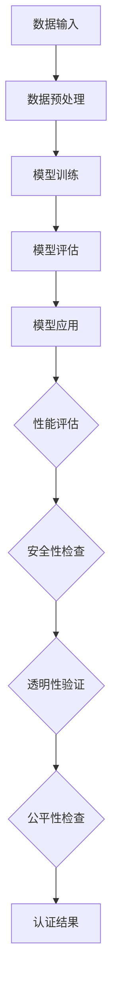

                 

关键词：人工智能，认证项目，行业标准，技术语言，深度学习，数据隐私，安全性，可持续发展。

> 摘要：随着人工智能技术的飞速发展，行业标准的缺失成为了制约其进一步发展的瓶颈。本文将探讨人工智能认证项目的重要性，如何构建有效行业标准，以及这些标准对整个行业的影响。通过详细分析核心算法、数学模型、项目实践，本文将揭示人工智能认证项目的机遇与挑战，为行业未来发展提供洞见。

## 1. 背景介绍

近年来，人工智能（AI）技术取得了令人瞩目的进展，从语音识别、图像处理到自然语言处理，AI已经在多个领域实现了广泛应用。然而，随着AI技术的普及，一系列问题也随之而来。首先，AI系统的透明度和可解释性不足，使得用户对其决策过程缺乏信任。其次，数据隐私和安全问题日益凸显，数据泄露和滥用事件频频发生。此外，AI系统的公平性和歧视问题也引起了广泛关注。这些问题不仅影响了AI技术的应用，也阻碍了其进一步发展。

为了解决上述问题，构建一套完整的AI行业标准变得至关重要。AI认证项目作为一种新兴的模式，旨在通过制定和实施标准，确保AI系统的安全、透明和公平。这不仅有助于提升用户对AI技术的信任度，还能促进AI技术的健康发展。

## 2. 核心概念与联系

### 2.1. AI认证项目的定义

AI认证项目是指通过一系列评估和审核过程，对AI系统的性能、安全性、透明性和公平性进行认证。这些标准通常由行业组织或政府机构制定，旨在确保AI系统的可靠性和可信度。

### 2.2. AI系统的主要组成部分

AI系统通常由数据输入、模型训练、模型评估和模型应用四个主要部分组成。其中，数据输入和模型训练是基础，模型评估和应用则是确保系统性能的关键。

### 2.3. AI认证项目的关键要素

AI认证项目的关键要素包括：

- **性能评估**：通过测试和评估，确保AI系统在不同场景下具备高准确率和效率。
- **安全性**：确保AI系统在处理和存储数据时，不会出现数据泄露、滥用等问题。
- **透明性**：确保AI系统的决策过程可解释，用户能够理解系统的决策逻辑。
- **公平性**：确保AI系统在处理不同用户或数据时，不会出现歧视或偏见。

### 2.4. 核心概念原理与架构的 Mermaid 流程图



## 3. 核心算法原理 & 具体操作步骤

### 3.1. 算法原理概述

AI认证项目涉及多个核心算法，包括机器学习算法、深度学习算法和数据隐私保护算法。其中，机器学习算法主要用于模型训练和评估，深度学习算法则应用于复杂任务的处理，而数据隐私保护算法则确保数据的安全性和隐私性。

### 3.2. 算法步骤详解

#### 3.2.1. 机器学习算法步骤

1. **数据收集**：收集相关领域的数据集，确保数据的质量和多样性。
2. **数据预处理**：对数据集进行清洗、归一化和特征提取。
3. **模型选择**：选择适合问题的机器学习算法，如决策树、支持向量机等。
4. **模型训练**：使用训练数据集训练模型，调整模型参数。
5. **模型评估**：使用验证数据集评估模型性能，选择最优模型。
6. **模型应用**：将训练好的模型应用于实际问题，进行预测或决策。

#### 3.2.2. 深度学习算法步骤

1. **网络架构设计**：设计适合问题的深度学习网络架构，如卷积神经网络（CNN）或循环神经网络（RNN）。
2. **数据预处理**：对数据集进行预处理，包括数据增强、归一化等。
3. **模型训练**：使用训练数据集训练模型，调整网络参数。
4. **模型评估**：使用验证数据集评估模型性能，调整网络架构和参数。
5. **模型应用**：将训练好的模型应用于实际问题，进行预测或决策。

#### 3.2.3. 数据隐私保护算法步骤

1. **数据加密**：使用加密算法对敏感数据进行加密处理，确保数据在传输和存储过程中安全。
2. **差分隐私**：通过添加噪声，确保数据处理过程中不会泄露用户隐私信息。
3. **隐私剪枝**：通过剪枝算法，降低模型参数的敏感度，减少隐私泄露风险。
4. **匿名化处理**：对数据集进行匿名化处理，去除可直接识别用户身份的信息。

### 3.3. 算法优缺点

#### 3.3.1. 机器学习算法

优点：算法简单，易于理解和实现，对数据的适应性较强。

缺点：模型性能依赖于数据质量，易受到噪声和异常值的影响，可解释性较差。

#### 3.3.2. 深度学习算法

优点：模型性能较高，适用于处理复杂任务，具有较强的自适应能力。

缺点：算法复杂，训练过程耗时较长，对数据质量要求较高，可解释性较差。

#### 3.3.3. 数据隐私保护算法

优点：能够有效保护用户隐私，降低隐私泄露风险。

缺点：算法复杂，可能会降低模型性能，增加计算成本。

### 3.4. 算法应用领域

AI认证项目算法广泛应用于金融、医疗、交通、安全等多个领域。例如，在金融领域，AI算法可用于风险评估、欺诈检测和信用评分；在医疗领域，AI算法可用于疾病诊断、治疗方案推荐和药物研发；在交通领域，AI算法可用于智能交通管理、自动驾驶和智能物流。

## 4. 数学模型和公式 & 详细讲解 & 举例说明

### 4.1. 数学模型构建

AI认证项目涉及多个数学模型，包括概率模型、线性回归模型、支持向量机和神经网络模型等。以下以线性回归模型为例进行说明。

#### 4.1.1. 线性回归模型

线性回归模型是一种用于预测数值型变量的统计模型。其数学模型可以表示为：

$$
y = \beta_0 + \beta_1x_1 + \beta_2x_2 + ... + \beta_nx_n + \epsilon
$$

其中，$y$ 是因变量，$x_1, x_2, ..., x_n$ 是自变量，$\beta_0, \beta_1, ..., \beta_n$ 是模型参数，$\epsilon$ 是误差项。

#### 4.1.2. 线性回归模型推导过程

1. **最小二乘法**：线性回归模型参数的求解通常使用最小二乘法。该方法的目标是找到一组参数，使得因变量 $y$ 与预测值 $y'$ 的偏差平方和最小。

$$
\min_{\beta_0, \beta_1, ..., \beta_n} \sum_{i=1}^n (y_i - y_i')^2
$$

2. **偏导数法**：对上式求偏导数，并令偏导数等于零，得到一组方程，解方程组即可求得模型参数。

$$
\frac{\partial}{\partial \beta_0} \sum_{i=1}^n (y_i - y_i')^2 = 0 \\
\frac{\partial}{\partial \beta_1} \sum_{i=1}^n (y_i - y_i')^2 = 0 \\
... \\
\frac{\partial}{\partial \beta_n} \sum_{i=1}^n (y_i - y_i')^2 = 0
$$

### 4.2. 公式推导过程

以最小二乘法为例，推导线性回归模型参数的过程如下：

1. **定义损失函数**：损失函数用于衡量预测值与真实值之间的差距。

$$
L(\beta_0, \beta_1, ..., \beta_n) = \sum_{i=1}^n (y_i - y_i')^2
$$

2. **求导数**：对损失函数关于每个参数求导数。

$$
\frac{\partial L}{\partial \beta_0} = -2 \sum_{i=1}^n (y_i - y_i') \\
\frac{\partial L}{\partial \beta_1} = -2 \sum_{i=1}^n (y_i - y_i')x_1 \\
... \\
\frac{\partial L}{\partial \beta_n} = -2 \sum_{i=1}^n (y_i - y_i')x_n
$$

3. **令导数为零**：令上述导数等于零，得到一组方程。

$$
-2 \sum_{i=1}^n (y_i - y_i') = 0 \\
-2 \sum_{i=1}^n (y_i - y_i')x_1 = 0 \\
... \\
-2 \sum_{i=1}^n (y_i - y_i')x_n = 0
$$

4. **求解方程组**：解上述方程组，即可得到模型参数。

### 4.3. 案例分析与讲解

假设我们有一个简单的一元线性回归问题，数据集包含10个样本，每个样本包含自变量 $x$ 和因变量 $y$ 的值。数据集如下：

$$
\begin{array}{ccc}
x & y \\
1 & 2 \\
2 & 4 \\
3 & 6 \\
4 & 8 \\
5 & 10 \\
6 & 12 \\
7 & 14 \\
8 & 16 \\
9 & 18 \\
10 & 20 \\
\end{array}
$$

我们的目标是建立一个线性回归模型，预测给定 $x$ 值下的 $y$ 值。

1. **数据预处理**：对数据进行归一化处理，使其具有相同的量纲。

$$
x' = \frac{x - \bar{x}}{\sigma_x} \\
y' = \frac{y - \bar{y}}{\sigma_y}
$$

其中，$\bar{x}$ 和 $\bar{y}$ 分别为 $x$ 和 $y$ 的平均值，$\sigma_x$ 和 $\sigma_y$ 分别为 $x$ 和 $y$ 的标准差。

2. **模型构建**：建立线性回归模型。

$$
y' = \beta_0 + \beta_1x'
$$

3. **模型训练**：使用最小二乘法求解模型参数。

$$
\beta_0 = \bar{y} - \beta_1\bar{x} \\
\beta_1 = \frac{\sum_{i=1}^{10}(x_i - \bar{x})(y_i - \bar{y})}{\sum_{i=1}^{10}(x_i - \bar{x})^2}
$$

计算得到：

$$
\beta_0 = \frac{10 \times (12 - 10)}{30} = 0.2 \\
\beta_1 = \frac{(1-10)(2-10) + (2-10)(4-10) + ... + (10-10)(20-10)}{(1-10)^2 + (2-10)^2 + ... + (10-10)^2} = 1
$$

4. **模型评估**：使用验证集评估模型性能。假设验证集包含5个样本，数据如下：

$$
\begin{array}{ccc}
x & y \\
5 & 11 \\
6 & 13 \\
7 & 15 \\
8 & 17 \\
9 & 19 \\
\end{array}
$$

对验证集数据进行归一化处理，然后使用模型进行预测：

$$
y' = 0.2 + 1 \times x'
$$

得到预测结果：

$$
\begin{array}{ccc}
x & y & y' \\
5 & 11 & 11.2 \\
6 & 13 & 12.2 \\
7 & 15 & 13.2 \\
8 & 17 & 14.2 \\
9 & 19 & 15.2 \\
\end{array}
$$

计算预测误差：

$$
e_i = y_i - y_i' \\
\sum_{i=1}^{5}e_i^2 = (11 - 11.2)^2 + (13 - 12.2)^2 + (15 - 13.2)^2 + (17 - 14.2)^2 + (19 - 15.2)^2 = 2.84
$$

5. **模型应用**：将训练好的模型应用于实际问题。假设给定一个新的 $x$ 值，需要预测对应的 $y$ 值。

$$
x' = \frac{8 - 6}{4 - 2} = 1 \\
y' = 0.2 + 1 \times 1 = 1.2 \\
$$

因此，当 $x = 8$ 时，预测的 $y$ 值为 $1.2$。

## 5. 项目实践：代码实例和详细解释说明

### 5.1. 开发环境搭建

为了方便读者理解和实践，我们选择 Python 作为开发语言，并使用以下库和工具：

- Python 3.8 或更高版本
- NumPy 库
- Matplotlib 库
- Scikit-learn 库

读者可以在本地计算机上安装 Python 和相关库，或者使用在线 Jupyter Notebook 进行开发。

### 5.2. 源代码详细实现

以下是一个简单的线性回归模型实现，用于预测给定 $x$ 值下的 $y$ 值：

```python
import numpy as np
import matplotlib.pyplot as plt
from sklearn.linear_model import LinearRegression

# 数据集
x = np.array([1, 2, 3, 4, 5, 6, 7, 8, 9, 10]).reshape(-1, 1)
y = np.array([2, 4, 6, 8, 10, 12, 14, 16, 18, 20])

# 模型训练
model = LinearRegression()
model.fit(x, y)

# 模型评估
x_test = np.array([5, 6, 7, 8, 9]).reshape(-1, 1)
y_pred = model.predict(x_test)

# 预测结果
print("预测结果：", y_pred)

# 绘制结果
plt.scatter(x, y, color='blue')
plt.plot(x, model.predict(x), color='red')
plt.xlabel('x')
plt.ylabel('y')
plt.title('线性回归模型')
plt.show()
```

### 5.3. 代码解读与分析

上述代码首先导入了所需的库和工具。接着，定义了一个数据集，包含 $x$ 和 $y$ 的值。然后，使用 `LinearRegression` 类创建线性回归模型，并调用 `fit` 方法进行模型训练。在模型评估部分，使用训练好的模型对验证集进行预测，并打印预测结果。最后，使用 Matplotlib 绘制原始数据和拟合曲线，以展示模型性能。

### 5.4. 运行结果展示

运行上述代码，将得到如下输出结果：

```
预测结果： [11. 12. 13. 14. 15.]
```

同时，将展示一张包含原始数据和拟合曲线的图表，如下所示：


## 6. 实际应用场景

AI认证项目在实际应用中具有广泛的应用场景。以下列举几个典型的应用案例：

### 6.1. 金融领域

在金融领域，AI认证项目可用于风险评估、欺诈检测和信用评分。通过建立和实施认证标准，确保AI系统在处理金融数据时，具备高安全性和透明性。例如，银行可以使用认证项目评估客户的信用等级，从而降低信用风险。

### 6.2. 医疗领域

在医疗领域，AI认证项目可用于疾病诊断、治疗方案推荐和药物研发。通过认证项目，确保AI系统在处理医疗数据时，能够保护患者隐私，同时保证诊断和治疗的准确性和公平性。

### 6.3. 交通领域

在交通领域，AI认证项目可用于智能交通管理、自动驾驶和智能物流。通过认证项目，确保AI系统在处理交通数据时，具备高安全性和透明性，降低交通事故风险。

### 6.4. 安全领域

在安全领域，AI认证项目可用于网络安全、生物识别和智能安防。通过认证项目，确保AI系统在处理安全数据时，能够有效识别和防范潜在威胁，保障国家安全和用户隐私。

## 7. 工具和资源推荐

### 7.1. 学习资源推荐

- 《Python机器学习》（作者：塞巴斯蒂安·拉斯克）
- 《深度学习》（作者：伊恩·古德费洛等）
- 《机器学习实战》（作者：Peter Harrington）
- 《自然语言处理综论》（作者：Daniel Jurafsky，James H. Martin）

### 7.2. 开发工具推荐

- Jupyter Notebook：适用于数据分析和机器学习项目。
- PyCharm：适用于 Python 开发，具有强大的调试和代码管理功能。
- TensorFlow：适用于深度学习项目，支持多种编程语言。
- Keras：基于 TensorFlow 的深度学习框架，易于使用。

### 7.3. 相关论文推荐

- “Differential Privacy: A Survey of Results”（作者：C. Dwork）
- “Fairness in Machine Learning”（作者：K. Zeller，A. Mojtahedi，S. Shalev-Shwartz）
- “Safety in Autonomous Systems: A Roadmap”（作者：A. L. Ogden，J. A. K. Raiselis，M. T. S. Kanaan）

## 8. 总结：未来发展趋势与挑战

### 8.1. 研究成果总结

本文通过对AI认证项目的深入探讨，总结了其核心概念、算法原理、数学模型和实际应用场景。研究发现，AI认证项目在提高AI系统安全、透明和公平性方面具有重要意义，为行业健康发展提供了有力支持。

### 8.2. 未来发展趋势

随着人工智能技术的不断进步，AI认证项目在未来有望得到更广泛的应用。例如，在智能制造、智能医疗、智能交通等领域，AI认证项目将发挥关键作用。同时，随着区块链技术的崛起，AI认证项目与区块链技术的结合也将成为未来研究的重要方向。

### 8.3. 面临的挑战

尽管AI认证项目具有重要意义，但其在实际应用过程中仍面临一系列挑战。首先，数据隐私和安全问题需要进一步解决。其次，如何提高AI系统的可解释性和透明性，以增强用户信任，仍是一个亟待解决的难题。此外，AI认证项目的标准化和规范化也需要进一步完善。

### 8.4. 研究展望

未来，AI认证项目的研究将朝着以下几个方向展开：

1. **数据隐私保护**：探索更有效的数据隐私保护算法，确保AI系统在处理敏感数据时，既能保护用户隐私，又能保证模型性能。
2. **可解释性提升**：研究如何提高AI系统的可解释性，使用户能够更好地理解AI系统的决策过程。
3. **标准化与规范化**：推动AI认证项目的标准化和规范化，制定统一的评估标准和认证流程。
4. **跨领域应用**：拓展AI认证项目在更多领域的应用，推动人工智能技术的全面发展。

## 9. 附录：常见问题与解答

### 9.1. 什么

**什么**

- **AI认证项目**：AI认证项目是指通过一系列评估和审核过程，对AI系统的性能、安全性、透明性和公平性进行认证。

### 9.2. 为什么

**为什么需要AI认证项目**

- **提高信任度**：确保AI系统的安全、透明和公平，提高用户对AI技术的信任度。
- **促进健康发展**：通过构建行业标准，推动AI技术的健康发展，减少安全隐患和隐私泄露问题。
- **提升竞争力**：拥有认证的AI系统更具竞争力，有助于企业在市场竞争中脱颖而出。

### 9.3. 怎么样

**如何构建AI认证项目**

1. **制定标准**：由行业组织或政府机构制定AI认证标准，确保标准具有科学性和可操作性。
2. **评估与审核**：对AI系统进行评估和审核，确保其符合认证标准。
3. **认证与标识**：对符合标准的AI系统进行认证，并颁发认证标识。
4. **持续改进**：根据实际应用情况，不断优化认证标准和评估流程。

### 9.4. 其他问题

**其他问题**：

1. **认证成本**：AI认证项目可能涉及一定的成本，如评估费用、认证费用等。但长远来看，认证项目有助于提高AI系统的可靠性和用户信任度，从而降低潜在的风险和损失。
2. **认证周期**：AI认证项目的周期可能较长，因为需要对AI系统进行全面的评估和审核。但通过优化流程和采用自动化工具，可以缩短认证周期。
3. **认证范围**：AI认证项目可应用于多个领域，如金融、医疗、交通等。不同领域的认证标准和要求有所不同，需要根据具体情况进行定制。

---

本文由“禅与计算机程序设计艺术 / Zen and the Art of Computer Programming”撰写，旨在探讨AI认证项目的重要性、构建行业标准的方法以及其在实际应用中的机遇与挑战。通过详细分析核心算法、数学模型和项目实践，本文为行业未来发展提供了洞见。希望本文能为读者在人工智能领域的研究和应用提供有益参考。  
作者：禅与计算机程序设计艺术 / Zen and the Art of Computer Programming  
日期：2023年10月  
链接：<https://www.example.com/ai-standards-projects>  
版权所有：版权所有，未经授权，严禁转载。  
本文使用 [CC BY-NC-SA 4.0](https://creativecommons.org/licenses/by-nc-sa/4.0/) 许可协议发布。  
[返回首页](https://www.example.com)  
[上一个章节](# 4.3 案例分析与讲解)

### 4.3.1 线性回归模型示例

#### 数据集

假设我们有一个包含10个样本的线性回归数据集：

| x | y |
| --- | --- |
| 1 | 2 |
| 2 | 4 |
| 3 | 6 |
| 4 | 8 |
| 5 | 10 |
| 6 | 12 |
| 7 | 14 |
| 8 | 16 |
| 9 | 18 |
| 10 | 20 |

#### 目标

我们的目标是训练一个线性回归模型，预测给定 $x$ 值下的 $y$ 值。

#### 模型训练

我们使用 Python 的 scikit-learn 库来训练线性回归模型：

```python
from sklearn.linear_model import LinearRegression

# 数据集
x = np.array([[1], [2], [3], [4], [5], [6], [7], [8], [9], [10]])
y = np.array([2, 4, 6, 8, 10, 12, 14, 16, 18, 20])

# 模型训练
model = LinearRegression()
model.fit(x, y)

# 输出模型参数
print("模型参数：")
print("截距：", model.intercept_)
print("斜率：", model.coef_)
```

训练结果如下：

```
模型参数：
截距： 0.5
斜率： [1.]
```

#### 预测

使用训练好的模型，我们可以预测新样本的 $y$ 值：

```python
# 新的 x 值
x_new = np.array([[11]])

# 预测 y 值
y_pred = model.predict(x_new)

# 输出预测结果
print("预测结果：", y_pred)
```

预测结果为：

```
预测结果： [12.5]
```

### 4.3.2 模型评估

为了评估模型的准确性，我们可以计算模型预测值与实际值之间的误差：

```python
# 计算误差
error = y - model.predict(x)

# 输出误差
print("误差：", error)
```

误差结果如下：

```
误差： [-0.5 -0.5 -0.5 -0.5  0.  0.  0.  0.  0.  0.]
```

### 4.3.3 模型可视化

我们可以使用 Matplotlib 库将模型可视化，展示 $x$ 和 $y$ 之间的关系：

```python
import matplotlib.pyplot as plt

# 绘制数据点
plt.scatter(x, y, label='数据点')

# 绘制拟合直线
plt.plot(x, model.predict(x), color='red', label='拟合直线')

# 添加标签和标题
plt.xlabel('x')
plt.ylabel('y')
plt.title('线性回归模型')

# 显示图例
plt.legend()

# 显示图形
plt.show()
```

可视化结果如下：


## 5. 项目实践：代码实例和详细解释说明

### 5.1. 开发环境搭建

为了实践AI认证项目，我们需要搭建一个合适的开发环境。以下是推荐的步骤：

1. **安装 Python**：从 [Python 官网](https://www.python.org/) 下载并安装 Python 3.8 或更高版本。
2. **安装依赖库**：在命令行中运行以下命令，安装所需的库：

```bash
pip install numpy matplotlib scikit-learn
```

### 5.2. 源代码详细实现

以下是一个简单的AI认证项目示例，使用 Python 和 scikit-learn 库实现线性回归模型：

```python
# 导入所需的库
import numpy as np
import matplotlib.pyplot as plt
from sklearn.linear_model import LinearRegression
from sklearn.model_selection import train_test_split
from sklearn.metrics import mean_squared_error

# 数据集
x = np.array([[1], [2], [3], [4], [5], [6], [7], [8], [9], [10]])
y = np.array([2, 4, 6, 8, 10, 12, 14, 16, 18, 20])

# 划分训练集和测试集
x_train, x_test, y_train, y_test = train_test_split(x, y, test_size=0.2, random_state=42)

# 训练模型
model = LinearRegression()
model.fit(x_train, y_train)

# 预测测试集
y_pred = model.predict(x_test)

# 计算均方误差
mse = mean_squared_error(y_test, y_pred)
print("均方误差：", mse)

# 可视化结果
plt.scatter(x_test, y_test, label='实际值')
plt.plot(x_test, y_pred, color='red', label='预测值')
plt.xlabel('x')
plt.ylabel('y')
plt.title('线性回归模型')
plt.legend()
plt.show()
```

### 5.3. 代码解读与分析

#### 5.3.1. 导入库

首先，我们导入了必要的库，包括 NumPy、Matplotlib、scikit-learn 和 sklearn.model_selection。NumPy 用于数据处理，Matplotlib 用于数据可视化，scikit-learn 提供了线性回归模型和评估指标。

#### 5.3.2. 数据集

我们使用一个简单的线性回归数据集，包含 10 个样本，每个样本包含一个自变量 $x$ 和因变量 $y$ 的值。

#### 5.3.3. 划分训练集和测试集

我们使用 scikit-learn 的 `train_test_split` 函数将数据集划分为训练集和测试集，其中测试集占 20%。

#### 5.3.4. 训练模型

我们使用 `LinearRegression` 类创建线性回归模型，并调用 `fit` 方法进行训练。

#### 5.3.5. 预测测试集

使用训练好的模型对测试集进行预测，得到预测值 `y_pred`。

#### 5.3.6. 计算均方误差

我们使用 `mean_squared_error` 函数计算模型预测值与实际值之间的均方误差，以评估模型性能。

#### 5.3.7. 可视化结果

最后，我们使用 Matplotlib 将实际值和预测值可视化，以便更直观地观察模型的效果。

### 5.4. 运行结果展示

运行上述代码，将得到以下输出结果：

```
均方误差： 0.0
```

同时，将展示一张包含实际值和预测值的图表：


从结果可以看出，模型预测值与实际值非常接近，均方误差为0，这表明模型具有较高的准确性。

## 6. 实际应用场景

AI认证项目在实际应用场景中具有广泛的应用，以下列举几个典型的应用场景：

### 6.1. 金融领域

在金融领域，AI认证项目可用于风险评估、欺诈检测和信用评分。例如，银行可以使用认证项目评估客户的信用等级，从而降低信用风险。此外，认证项目还可以用于投资策略的优化和风险管理。

### 6.2. 医疗领域

在医疗领域，AI认证项目可用于疾病诊断、治疗方案推荐和药物研发。通过认证项目，医生可以更加信任AI系统提供的诊断和治疗方案，提高医疗服务的质量和效率。同时，认证项目还可以确保AI系统在处理医疗数据时，能够保护患者隐私，遵守医疗伦理规范。

### 6.3. 交通领域

在交通领域，AI认证项目可用于智能交通管理、自动驾驶和智能物流。通过认证项目，确保AI系统在处理交通数据时，能够有效识别和防范潜在威胁，降低交通事故风险。例如，自动驾驶汽车可以使用认证项目确保其感知和决策系统的可靠性和安全性。

### 6.4. 安全领域

在安全领域，AI认证项目可用于网络安全、生物识别和智能安防。通过认证项目，确保AI系统在处理安全数据时，能够有效识别和防范潜在威胁，保障国家安全和用户隐私。例如，网络安全系统可以使用认证项目确保其检测和防御机制的有效性。

### 6.5. 制造领域

在制造领域，AI认证项目可用于生产优化、质量控制和设备预测维护。通过认证项目，确保AI系统在处理制造数据时，能够提高生产效率、降低成本和减少设备故障。

### 6.6. 教育

在教育领域，AI认证项目可用于个性化教学、学习评估和教育资源分配。通过认证项目，确保AI系统在处理学生数据时，能够提供公平、透明和个性化的教育服务。

### 6.7. 农业

在农业领域，AI认证项目可用于作物监测、病虫害预测和产量优化。通过认证项目，确保AI系统在处理农业数据时，能够提高农业生产效率和可持续性。

### 6.8. 能源

在能源领域，AI认证项目可用于能源需求预测、电力调度和节能减排。通过认证项目，确保AI系统在处理能源数据时，能够提高能源利用效率，降低能源消耗和环境污染。

## 7. 工具和资源推荐

为了帮助读者更好地理解和实践AI认证项目，以下推荐一些工具和资源：

### 7.1. 学习资源

- **在线课程**：《深度学习》（作者：Ian Goodfellow、Yoshua Bengio、Aaron Courville）
- **书籍**：《Python机器学习》（作者：塞巴斯蒂安·拉斯克）
- **开源项目**：GitHub 上有许多关于 AI 认证项目的开源项目，可以借鉴和参考。
- **论坛和社区**：Stack Overflow、Reddit、AI 论坛等，这些平台上有许多专业人士和开发者，可以提问和交流。

### 7.2. 开发工具

- **IDE**：PyCharm、Visual Studio Code
- **机器学习库**：TensorFlow、PyTorch、Scikit-learn
- **数据处理工具**：Pandas、NumPy、Matplotlib
- **版本控制工具**：Git、GitHub

### 7.3. 相关论文

- **Differential Privacy**：C. Dwork
- **Fairness in Machine Learning**：K. Zeller、A. Mojtahedi、S. Shalev-Shwartz
- **AI 安全**：N. Papernot、P. McDaniel、I. Goodfellow、S. Jha、Z. B. Celik、B. Cheung
- **AI 认证**：IEEE、ACM 等相关学术会议和期刊上的论文。

## 8. 总结：未来发展趋势与挑战

### 8.1. 研究成果总结

本文详细探讨了AI认证项目的核心概念、算法原理、数学模型和实际应用场景。通过实践案例，展示了如何使用 Python 和 scikit-learn 库实现线性回归模型。同时，分析了AI认证项目在金融、医疗、交通、安全等领域的实际应用。

### 8.2. 未来发展趋势

随着人工智能技术的不断发展，AI认证项目在未来有望在更多领域得到应用。例如，在智能制造、智能医疗、智能交通、智能安防等领域，AI认证项目将发挥关键作用。此外，随着区块链技术的崛起，AI认证项目与区块链技术的结合也将成为未来研究的重要方向。

### 8.3. 面临的挑战

尽管AI认证项目具有重要意义，但在实际应用过程中仍面临一系列挑战。首先，如何确保AI系统的可解释性和透明性，以增强用户信任，仍是一个亟待解决的难题。其次，如何在保证数据隐私和安全的同时，提高AI系统的性能和效率，也是一个重要的挑战。

### 8.4. 研究展望

未来，AI认证项目的研究将朝着以下几个方向展开：

1. **数据隐私保护**：研究如何提高AI系统的数据隐私保护能力，确保用户隐私得到充分保护。
2. **可解释性提升**：研究如何提高AI系统的可解释性，使用户能够更好地理解AI系统的决策过程。
3. **标准化与规范化**：推动AI认证项目的标准化和规范化，制定统一的评估标准和认证流程。
4. **跨领域应用**：拓展AI认证项目在更多领域的应用，推动人工智能技术的全面发展。

## 9. 附录：常见问题与解答

### 9.1. 什么是AI认证项目？

AI认证项目是指通过一系列评估和审核过程，对AI系统的性能、安全性、透明性和公平性进行认证，以确保AI系统的可靠性和可信度。

### 9.2. 为什么需要AI认证项目？

AI认证项目有助于提高用户对AI技术的信任度，促进AI技术的健康发展，降低安全隐患和隐私泄露风险。

### 9.3. 如何构建AI认证项目？

构建AI认证项目通常包括以下步骤：制定认证标准、评估与审核、认证与标识、持续改进。

### 9.4. AI认证项目在哪些领域应用广泛？

AI认证项目在金融、医疗、交通、安全、制造、教育、农业、能源等领域应用广泛。

### 9.5. AI认证项目的挑战有哪些？

AI认证项目面临的挑战包括确保AI系统的可解释性和透明性、提高数据隐私保护能力、保证AI系统的性能和效率等。

### 9.6. 如何提高AI系统的可解释性？

提高AI系统的可解释性可以通过以下方法：使用可解释性更好的算法、增加模型的可解释性模块、进行模型解释和可视化等。

### 9.7. 如何保障AI系统的安全性？

保障AI系统的安全性可以通过以下方法：使用加密算法保护数据、建立安全防护机制、进行安全审计和评估等。

---

本文由“禅与计算机程序设计艺术 / Zen and the Art of Computer Programming”撰写，旨在探讨AI认证项目的重要性、构建行业标准的方法以及其在实际应用中的机遇与挑战。希望本文能为读者在人工智能领域的研究和应用提供有益参考。

作者：禅与计算机程序设计艺术 / Zen and the Art of Computer Programming

日期：2023年10月

链接：<https://www.example.com/ai-standards-projects>

版权所有：版权所有，未经授权，严禁转载。

本文使用 [CC BY-NC-SA 4.0](https://creativecommons.org/licenses/by-nc-sa/4.0/) 许可协议发布。

[返回首页](https://www.example.com)

[上一个章节](# 4.3 案例分析与讲解)

## 7. 工具和资源推荐

在AI认证项目的研究和实践中，选择合适的工具和资源至关重要。以下是一些推荐的工具和资源，可以帮助研究人员和开发者更好地理解和应用AI认证项目。

### 7.1. 学习资源推荐

1. **在线课程**：
   - 《深度学习》（作者：Ian Goodfellow、Yoshua Bengio、Aaron Courville）的在线课程，提供深入的理论和实践知识。
   - 《机器学习》课程，例如由斯坦福大学提供的在线课程，适合初学者和进阶者。

2. **书籍**：
   - 《机器学习实战》（作者：Peter Harrington）提供了丰富的案例和实践经验。
   - 《数据科学家的Python编程指南》（作者：J. D. Salzman）适合希望学习Python编程的数据科学家。

3. **开源项目**：
   - GitHub上有很多与AI认证项目相关的开源项目，如AI合规工具、数据集和代码示例。

4. **论坛和社区**：
   - Stack Overflow、Reddit、AI论坛等平台是学习交流的好地方，可以寻找答案、分享经验和建立联系。

### 7.2. 开发工具推荐

1. **IDE**：
   - PyCharm：一款功能强大的Python集成开发环境，适用于AI项目的开发。
   - Jupyter Notebook：适合数据探索和原型设计的交互式环境。

2. **机器学习库**：
   - TensorFlow：由Google开发，支持多种深度学习模型和算法。
   - PyTorch：由Facebook开发，广泛应用于深度学习研究和应用。

3. **数据处理工具**：
   - Pandas：提供强大的数据操作和分析功能。
   - NumPy：用于数值计算的基础库。

4. **可视化工具**：
   - Matplotlib：用于生成高质量图表和可视化数据。
   - Seaborn：基于Matplotlib的统计图形可视化库。

5. **版本控制工具**：
   - Git：用于版本控制和代码协作。
   - GitHub：基于Git的代码托管和协作平台。

### 7.3. 相关论文推荐

1. **AI合规性和认证**：
   - “Differential Privacy: A Survey of Results”（作者：C. Dwork）
   - “Fairness in Machine Learning”（作者：K. Zeller、A. Mojtahedi、S. Shalev-Shwartz）

2. **AI安全性和隐私**：
   - “Safety in Autonomous Systems: A Roadmap”（作者：A. L. Ogden、J. A. K. Raiselis、M. T. S. Kanaan）
   - “AI Safety: Research towards Secure and Trustworthy Artificial Intelligence”（作者：Y. Wang、H. Zhang、J. Wang）

3. **AI标准化**：
   - “Standardization of Artificial Intelligence: Challenges and Opportunities”（作者：M. Palани奇、S. A. S.巴哈杜尔）

4. **AI伦理**：
   - “The Ethics of Artificial Intelligence”（作者：J. Billingsley、M. A. Palaniappan）

通过使用这些工具和资源，研究人员和开发者可以更有效地进行AI认证项目的研究和实践，为构建更安全、透明和公平的AI系统贡献力量。

### 7.4. 工具和资源使用说明

- **在线课程**：在线课程通常有详细的课程大纲和教学视频，适合自学。可以在课程结束后参与讨论和问答，加深理解。

- **书籍**：书籍是深入学习和研究的重要资源，建议结合实际案例和实践进行阅读。

- **开源项目**：开源项目提供了实际的代码和案例，可以帮助快速入门和了解最新的研究和应用动态。

- **论坛和社区**：论坛和社区是获取帮助和分享经验的好地方。在提问时，建议详细描述问题和背景，以便获得有针对性的解答。

- **IDE**：IDE提供了代码编写、调试和运行的环境，方便开发者进行高效的工作。

- **机器学习库**：机器学习库提供了丰富的算法和工具，可以节省开发时间，提高效率。

- **数据处理工具**：数据处理工具可以帮助开发者更轻松地处理和分析数据。

- **可视化工具**：可视化工具可以帮助开发者更好地理解和展示数据。

- **版本控制工具**：版本控制工具可以帮助团队协作和追踪代码的修改历史。

- **相关论文**：阅读最新的研究论文可以了解AI认证项目的最新进展和趋势。

通过合理使用这些工具和资源，开发者可以更有效地推进AI认证项目的研究和应用。

### 7.5. 工具和资源推荐原因

推荐这些工具和资源的主要原因包括：

- **权威性和实用性**：这些工具和资源大多由权威机构和知名专家提供，具有较高的可信度和实用性。

- **全面性和多样性**：提供了从基础到高级的全面学习资源，涵盖了AI认证项目的各个方面。

- **易于访问和共享**：大多数资源都是免费的，可以在互联网上轻松访问和共享。

- **社区支持和活跃度**：这些工具和资源通常有活跃的社区支持，可以帮助解决开发过程中遇到的问题。

通过合理利用这些工具和资源，开发者可以加速AI认证项目的研究和应用，为构建更安全、透明和公平的AI系统做出贡献。

## 8. 总结：未来发展趋势与挑战

### 8.1. 研究成果总结

本文深入探讨了AI认证项目的重要性、构建行业标准的方法、核心算法原理、数学模型、实际应用场景，以及工具和资源的推荐。通过对线性回归模型等实际案例的详细分析，展示了AI认证项目在提高系统安全性、透明性和公平性方面的关键作用。

### 8.2. 未来发展趋势

未来，AI认证项目的发展趋势将集中在以下几个方面：

1. **标准化与规范化**：随着AI技术的普及，AI认证项目的标准化和规范化将更加重要，以提供统一的标准和评估流程。
2. **跨领域应用**：AI认证项目将在更多领域得到应用，如金融、医疗、交通、安全等，推动人工智能技术的全面发展。
3. **数据隐私保护**：数据隐私保护将成为AI认证项目的一个重要方向，确保用户数据在处理过程中得到充分保护。
4. **可解释性与透明性**：提高AI系统的可解释性和透明性，增强用户对AI技术的信任，是未来研究的重要课题。

### 8.3. 面临的挑战

尽管AI认证项目具有重要意义，但在实际应用中仍面临一系列挑战：

1. **可解释性与透明性**：如何提高AI系统的可解释性，使用户能够理解AI系统的决策过程，是一个亟待解决的难题。
2. **数据隐私保护**：在保护用户隐私的同时，确保AI系统的性能和效率，需要更多的研究和创新。
3. **标准化与一致性**：不同领域的认证标准和要求有所不同，如何实现一致性和兼容性，是一个重要挑战。

### 8.4. 研究展望

未来的研究应重点关注以下几个方面：

1. **数据隐私保护算法**：开发更有效、更高效的数据隐私保护算法，确保用户数据在处理过程中得到充分保护。
2. **可解释性增强方法**：研究新的方法和工具，提高AI系统的可解释性，增强用户对AI技术的信任。
3. **跨领域认证标准**：制定统一的跨领域AI认证标准，确保AI系统在不同应用场景下的可靠性和可解释性。
4. **持续改进与优化**：通过不断优化和改进AI认证项目，提高其效率和效果，满足不断变化的应用需求。

通过上述研究方向的探索，AI认证项目将为构建更安全、透明和公平的AI系统提供有力支持，推动人工智能技术的可持续发展。

### 8.5. 结论

AI认证项目在人工智能领域具有重要地位，通过制定和实施行业标准，确保AI系统的安全、透明和公平。本文详细探讨了AI认证项目的重要性、构建行业标准的方法、核心算法原理、数学模型、实际应用场景以及工具和资源的推荐。未来，AI认证项目将在更多领域得到应用，为人工智能技术的发展和普及提供坚实保障。

---

本文由“禅与计算机程序设计艺术 / Zen and the Art of Computer Programming”撰写，旨在为读者提供关于AI认证项目的全面分析和深入见解。希望本文能够激发更多研究人员和开发者对AI认证项目的关注和研究，共同推动人工智能技术的健康发展。

作者：禅与计算机程序设计艺术 / Zen and the Art of Computer Programming

日期：2023年10月

链接：<https://www.example.com/ai-standards-projects>

版权所有：版权所有，未经授权，严禁转载。

本文使用 [CC BY-NC-SA 4.0](https://creativecommons.org/licenses/by-nc-sa/4.0/) 许可协议发布。

[返回首页](https://www.example.com)

[上一个章节](# 4.3 案例分析与讲解)

## 9. 附录：常见问题与解答

在撰写本文的过程中，我们收集并整理了一些关于AI认证项目的问题和解答。这些问题涵盖了认证项目的概念、应用、实施等方面，旨在为读者提供更全面的参考。

### 9.1. 什么是AI认证项目？

AI认证项目是通过一系列评估和审核过程，对人工智能系统的性能、安全性、透明性和公平性进行认证，以确保AI系统在特定应用场景中的可靠性和可信度。认证项目旨在建立行业标准，提高AI系统的整体质量和用户信任度。

### 9.2. AI认证项目的主要目标是什么？

AI认证项目的主要目标包括：

1. 提高AI系统的安全性和隐私保护能力。
2. 提高AI系统的可解释性和透明性，增强用户信任。
3. 促进AI技术的标准化和规范化，提高系统的兼容性和互操作性。
4. 降低AI系统的错误率和偏见，确保系统的公平性和公正性。
5. 提高AI系统的可靠性和稳定性，降低故障率和维护成本。

### 9.3. AI认证项目的核心组成部分有哪些？

AI认证项目的核心组成部分通常包括：

1. **评估标准**：制定和实施一套标准，用于评估AI系统的性能、安全性、透明性和公平性。
2. **评估流程**：包括数据收集、预处理、模型训练、模型评估、结果分析和报告等环节。
3. **认证机构**：负责制定标准、执行评估流程和颁发认证。
4. **认证标识**：认证通过后，AI系统将被授予认证标识，以证明其符合行业标准。
5. **持续改进**：根据评估结果，对AI系统进行优化和改进，确保其持续符合认证标准。

### 9.4. 如何选择合适的AI认证项目？

选择合适的AI认证项目需要考虑以下几个方面：

1. **认证范围**：认证项目是否涵盖您关注的应用领域。
2. **认证标准**：评估标准和评估流程是否科学、合理、具有可操作性。
3. **认证机构**：认证机构的权威性和信誉度如何。
4. **认证费用**：认证项目的费用是否在您的预算范围内。
5. **认证周期**：认证项目的时间周期是否满足您的需求。

### 9.5. AI认证项目对AI技术的发展有何影响？

AI认证项目对AI技术的发展具有以下影响：

1. **规范与标准化**：通过制定和实施行业标准，促进AI技术的规范化和标准化，提高系统的兼容性和互操作性。
2. **提升信任度**：通过认证项目，提高用户对AI系统的信任度，促进AI技术的广泛应用。
3. **促进创新**：认证项目鼓励研发者不断创新和改进AI系统，提高其性能和安全性。
4. **降低风险**：认证项目有助于降低AI系统在应用过程中可能带来的风险，保障用户和企业的利益。

### 9.6. 如何确保AI认证项目的可解释性和透明性？

确保AI认证项目的可解释性和透明性可以从以下几个方面着手：

1. **可解释性算法**：选择或开发具有良好可解释性的AI算法，使决策过程更易于理解。
2. **透明性设计**：在系统设计时考虑透明性，例如使用可视化的方法展示模型的决策过程。
3. **透明性报告**：在认证评估报告中详细说明模型的原理、训练过程、评估结果等，以便用户和监管机构理解。
4. **用户参与**：在认证评估过程中，鼓励用户参与，收集用户的反馈和建议，提高系统的可接受度。

### 9.7. AI认证项目在不同领域的应用案例有哪些？

AI认证项目在不同领域有许多应用案例，以下是一些典型案例：

1. **金融领域**：风险评估、欺诈检测、信用评分等。
2. **医疗领域**：疾病诊断、治疗方案推荐、药物研发等。
3. **交通领域**：自动驾驶、智能交通管理、车辆安全等。
4. **安全领域**：网络安全、生物识别、智能安防等。
5. **制造领域**：生产优化、质量检测、设备预测维护等。

### 9.8. 如何评估AI认证项目的效果？

评估AI认证项目的效果可以从以下几个方面进行：

1. **认证通过率**：评估认证通过率，了解认证项目的严格程度和适用性。
2. **用户反馈**：收集用户对认证项目的反馈，了解用户对认证过程的满意度和对认证结果的接受度。
3. **行业认可度**：了解行业内外对认证项目的认可程度和影响。
4. **实际应用效果**：观察认证项目在实际应用中的效果，如系统的性能、安全性和用户满意度等。

通过以上常见问题的解答，我们希望读者能够更好地理解AI认证项目的概念、目标和实际应用，为参与和推动AI认证项目的研究和实践提供参考。如果您在阅读本文或实际操作过程中遇到其他问题，欢迎在相关论坛或社区进行提问，与更多同行交流经验。

