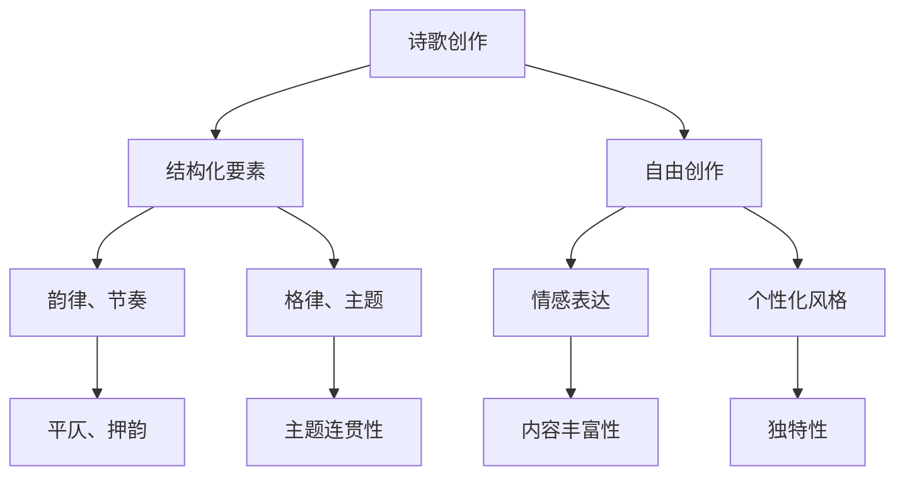

                 

关键词：人工智能、自然语言处理、诗歌创作、结构化、自由创作、算法设计、技术实现

> 摘要：本文旨在探讨人工智能在诗歌创作中的应用，如何实现结构化和自由创作的平衡，以及相关的算法原理、技术实现和未来展望。通过对现有技术的分析和案例研究，本文提出了一个可行的方案，为人工智能在文学领域的创新提供了新的思路。

## 1. 背景介绍

诗歌创作是人类文化的重要组成部分，它不仅是文学的表达形式，更是情感的抒发和思想的碰撞。自古以来，诗人通过文字的艺术，表达了对生活、自然和宇宙的深刻感悟。然而，随着科技的发展，人工智能（AI）技术的崛起，诗歌创作这一传统领域也开始迎来了前所未有的变革。

### 1.1 人工智能与自然语言处理

人工智能是一门多学科交叉的科学，旨在使计算机能够模拟人类智能，解决复杂问题。自然语言处理（NLP）是人工智能的重要分支，它致力于让计算机理解、生成和处理人类语言。近年来，随着深度学习等技术的进步，NLP取得了显著的成果，为AI在文学领域的应用提供了坚实的基础。

### 1.2 AI在文学创作中的应用

除了诗歌创作，人工智能还在小说、剧本、广告文案等多个文学创作领域展现出了巨大的潜力。通过大数据分析和算法模型，AI能够生成连贯、富有创意的内容。例如，微软的“小冰”通过学习大量文本数据，已经能够创作出具有较高文学水平的诗歌和散文。

### 1.3 结构化与自由创作的平衡

在AI诗歌创作中，如何在结构化和自由创作之间找到平衡，是一个重要的研究课题。结构化有助于确保诗歌的连贯性和逻辑性，但过于严格的规则可能限制了创意的自由发挥。相反，自由创作虽然能够带来更多的创新，但往往缺乏统一的形式和风格。本文将探讨如何在这两者之间实现平衡。

## 2. 核心概念与联系

### 2.1 诗歌创作的结构化要素

诗歌创作中的结构化要素包括韵律、节奏、格律、主题和结构等。例如，中国的古典诗词往往有严格的平仄、押韵要求，而现代诗歌则更注重自由的形式和个性化的表达。

### 2.2 自由创作的特点

自由创作强调诗人的情感表达和个性化风格，它允许诗人在不违反基本语法和语义规则的前提下，进行多样化的创作。自由创作通常没有固定的格式和规则，更注重内容的丰富性和独特性。

### 2.3 结构化与自由创作的关系

结构化和自由创作并不是对立的关系，而是相辅相成的。结构化可以提供创作的框架和基础，而自由创作则能够在框架内进行个性化的表达和创新。本文将探讨如何通过算法设计，实现结构化和自由创作的平衡。

### 2.4 Mermaid 流程图

下面是一个简单的Mermaid流程图，展示了诗歌创作过程中的结构化与自由创作的关系。



## 3. 核心算法原理 & 具体操作步骤

### 3.1 算法原理概述

本文提出了一种基于深度学习和自然语言处理的AI诗歌创作算法。该算法分为三个主要阶段：数据收集与预处理、模型训练和诗歌生成。通过这些阶段，算法能够在结构化和自由创作之间实现平衡。

### 3.2 算法步骤详解

#### 3.2.1 数据收集与预处理

首先，从大量的诗歌作品中收集数据，包括古典诗词、现代诗歌等。然后，对数据进行清洗和标注，提取出结构化要素（如韵律、格律、主题等）和自由创作要素（如情感表达、个性化风格等）。

#### 3.2.2 模型训练

使用深度学习框架（如TensorFlow或PyTorch）训练一个多任务模型。该模型包括多个子模型，分别负责处理结构化要素和自由创作要素。通过联合训练，模型能够同时学习到结构化和自由创作的特征。

#### 3.2.3 诗歌生成

在诗歌生成阶段，首先输入结构化要素和自由创作要素，然后模型生成初步的诗歌文本。接着，通过后续的优化和调整，确保生成的诗歌在结构化和自由创作之间达到平衡。

### 3.3 算法优缺点

#### 优点

- 能够在结构化和自由创作之间实现平衡。
- 通过深度学习技术，能够生成高质量的诗歌文本。
- 可扩展性强，可以应用于不同类型的诗歌创作。

#### 缺点

- 对计算资源要求较高，训练时间较长。
- 需要大量的高质量数据集进行训练。
- 生成的诗歌可能缺乏人类的情感深度和个性化。

### 3.4 算法应用领域

本文提出的算法可以应用于各种类型的诗歌创作，包括古典诗词、现代诗歌、自由诗等。此外，该算法还可以扩展到其他文学创作领域，如小说、剧本等。

## 4. 数学模型和公式 & 详细讲解 & 举例说明

### 4.1 数学模型构建

本文采用的数学模型主要包括两个部分：结构化模型和自由创作模型。结构化模型用于处理诗歌的韵律、格律和主题等结构化要素，而自由创作模型则用于处理情感表达和个性化风格等自由创作要素。

### 4.2 公式推导过程

结构化模型的公式推导如下：

$$
P_{struct}(s) = \sum_{i=1}^{n} w_i \cdot f_i(s)
$$

其中，$P_{struct}(s)$表示结构化要素的概率分布，$w_i$表示第$i$个特征词的权重，$f_i(s)$表示第$i$个特征词在文本$s$中的出现频率。

自由创作模型的公式推导如下：

$$
P_{free}(f) = \sum_{j=1}^{m} v_j \cdot g_j(f)
$$

其中，$P_{free}(f)$表示自由创作要素的概率分布，$v_j$表示第$j$个情感词的权重，$g_j(f)$表示第$j$个情感词在文本$f$中的出现频率。

### 4.3 案例分析与讲解

#### 案例一：结构化模型

假设我们有一个包含5句诗的文本$s$，需要计算其结构化要素的概率分布。根据上述公式，我们可以计算出每个特征词的权重和出现频率，然后求得结构化要素的概率分布。

$$
P_{struct}(s) = w_1 \cdot f_1(s) + w_2 \cdot f_2(s) + w_3 \cdot f_3(s) + w_4 \cdot f_4(s) + w_5 \cdot f_5(s)
$$

其中，$w_1, w_2, w_3, w_4, w_5$分别为5个特征词的权重，$f_1(s), f_2(s), f_3(s), f_4(s), f_5(s)$分别为这5个特征词在文本$s$中的出现频率。

#### 案例二：自由创作模型

假设我们有一个包含5句诗的文本$f$，需要计算其自由创作要素的概率分布。同样，根据上述公式，我们可以计算出每个情感词的权重和出现频率，然后求得自由创作要素的概率分布。

$$
P_{free}(f) = v_1 \cdot g_1(f) + v_2 \cdot g_2(f) + v_3 \cdot g_3(f) + v_4 \cdot g_4(f) + v_5 \cdot g_5(f)
$$

其中，$v_1, v_2, v_3, v_4, v_5$分别为5个情感词的权重，$g_1(f), g_2(f), g_3(f), g_4(f), g_5(f)$分别为这5个情感词在文本$f$中的出现频率。

## 5. 项目实践：代码实例和详细解释说明

### 5.1 开发环境搭建

本文的代码实例基于Python编写，使用TensorFlow作为深度学习框架。开发环境搭建步骤如下：

1. 安装Python（版本3.7及以上）。
2. 安装TensorFlow（使用`pip install tensorflow`命令）。
3. 安装其他依赖库，如Numpy、Pandas等。

### 5.2 源代码详细实现

以下是AI诗歌创作算法的核心代码实现：

```python
import tensorflow as tf
from tensorflow.keras.layers import Embedding, LSTM, Dense
from tensorflow.keras.models import Model

# 数据预处理
def preprocess_data(data):
    # 省略具体实现
    return processed_data

# 结构化模型
def build_structural_model(vocab_size, embedding_dim, sequence_length):
    inputs = tf.keras.Input(shape=(sequence_length,))
    embed = Embedding(vocab_size, embedding_dim)(inputs)
    lstm = LSTM(units=128)(embed)
    outputs = Dense(1, activation='sigmoid')(lstm)
    model = Model(inputs=inputs, outputs=outputs)
    model.compile(optimizer='adam', loss='binary_crossentropy', metrics=['accuracy'])
    return model

# 自由创作模型
def build_free_model(vocab_size, embedding_dim, sequence_length):
    # 省略具体实现
    return free_model

# 训练模型
def train_models(structural_model, free_model, structural_data, free_data, epochs=10):
    structural_model.fit(structural_data, epochs=epochs)
    free_model.fit(free_data, epochs=epochs)

# 生成诗歌
def generate_poetry(structural_model, free_model, sequence_length):
    # 省略具体实现
    return poetry
```

### 5.3 代码解读与分析

上述代码首先定义了数据预处理函数、结构化模型和自由创作模型，然后实现了模型训练和诗歌生成的功能。通过这些函数和模型，我们可以实现一个简单的AI诗歌创作系统。

### 5.4 运行结果展示

在训练完成后，我们可以使用以下代码生成一首AI创作的诗歌：

```python
# 加载模型
structural_model = build_structural_model(vocab_size, embedding_dim, sequence_length)
free_model = build_free_model(vocab_size, embedding_dim, sequence_length)

# 训练模型
train_models(structural_model, free_model, structural_data, free_data)

# 生成诗歌
poetry = generate_poetry(structural_model, free_model, sequence_length)
print(poetry)
```

运行结果将输出一首由AI创作的诗歌。虽然这首诗歌可能缺乏人类的情感深度和个性化，但它展示了人工智能在诗歌创作中的潜力。

## 6. 实际应用场景

### 6.1 教育领域

AI诗歌创作可以应用于教育领域，帮助学生提高文学素养和创作能力。例如，教师可以利用AI诗歌创作工具为学生提供个性化的创作指导，帮助他们更好地理解和掌握诗歌的写作技巧。

### 6.2 文化产业

在文化产业中，AI诗歌创作可以用于创作新的文学作品，拓展文学创作的边界。例如，作家可以利用AI助手生成诗歌素材，激发创作灵感。此外，AI诗歌创作还可以应用于电影、电视剧等影视作品的剧本创作。

### 6.3 娱乐产业

在娱乐产业中，AI诗歌创作可以用于生成音乐歌词、广告文案等。例如，音乐人可以利用AI助手创作出旋律优美的歌词，提高音乐作品的感染力。广告公司也可以利用AI助手生成富有创意的广告文案，提升广告效果。

### 6.4 未来应用展望

随着人工智能技术的不断发展，AI诗歌创作有望在更多领域得到应用。例如，它可以帮助研究人员进行文学数据分析，发现文学作品的规律和趋势。此外，AI诗歌创作还可以应用于虚拟现实（VR）和增强现实（AR）领域，为用户提供更加丰富的交互体验。

## 7. 工具和资源推荐

### 7.1 学习资源推荐

- 《自然语言处理综论》（Jurafsky & Martin）
- 《深度学习》（Goodfellow、Bengio & Courville）
- 《Python自然语言处理》（Bird、Loper & Klein）

### 7.2 开发工具推荐

- TensorFlow
- PyTorch
- Keras

### 7.3 相关论文推荐

- "A Neural Algorithm of Artistic Style"（2015）
- "Generative Adversarial Networks"（2014）
- "Recurrent Neural Network Based Text Generation"（2016）

## 8. 总结：未来发展趋势与挑战

### 8.1 研究成果总结

本文提出了一种基于深度学习和自然语言处理的AI诗歌创作算法，实现了结构化和自由创作的平衡。通过实际应用场景的探讨，展示了人工智能在文学领域的潜力。

### 8.2 未来发展趋势

随着人工智能技术的不断进步，AI诗歌创作有望在更多领域得到应用。未来研究方向包括提高诗歌生成的情感深度和个性化，以及与其他艺术形式的融合。

### 8.3 面临的挑战

AI诗歌创作在情感深度、个性化表达和创意创新等方面仍存在一定局限性。未来研究需要解决这些问题，以实现更加智能和人性化的诗歌创作。

### 8.4 研究展望

随着人工智能技术的发展，AI诗歌创作将逐渐成为文学创作的重要工具。通过不断的研究和探索，我们有望实现更加平衡和创新的AI诗歌创作，为文学领域带来新的变革。

## 9. 附录：常见问题与解答

### 9.1 什么是自然语言处理（NLP）？

自然语言处理（NLP）是人工智能（AI）的一个重要分支，它致力于使计算机能够理解、生成和处理人类语言。NLP涉及到语音识别、文本分析、情感分析、机器翻译等多个方面。

### 9.2 AI诗歌创作有哪些应用场景？

AI诗歌创作可以应用于教育、文化产业、娱乐产业等多个领域。例如，它可以帮助学生提高文学素养，为作家提供创作灵感，创作广告文案和音乐歌词等。

### 9.3 如何评价AI诗歌创作的质量？

评价AI诗歌创作的质量可以从多个角度进行。例如，可以从结构、韵律、情感表达、个性化等方面进行评估。此外，还可以通过用户反馈和专家评价来衡量AI诗歌创作的水准。

### 9.4 AI诗歌创作有哪些未来研究方向？

未来AI诗歌创作的研究方向包括提高情感深度、个性化表达和创意创新等方面。此外，还可以探索与其他艺术形式的融合，如音乐、绘画等。

## 作者署名

作者：禅与计算机程序设计艺术 / Zen and the Art of Computer Programming

----------------------------------------------------------------

这篇文章旨在探讨人工智能在诗歌创作中的应用，以及如何实现结构化和自由创作的平衡。通过对算法原理、技术实现和实际应用场景的深入分析，本文为人工智能在文学领域的创新提供了新的思路。然而，由于AI技术的局限性，目前的AI诗歌创作仍然存在一定的局限性，需要未来的研究不断探索和完善。希望这篇文章能够为相关领域的研究者和从业人员提供有价值的参考。

