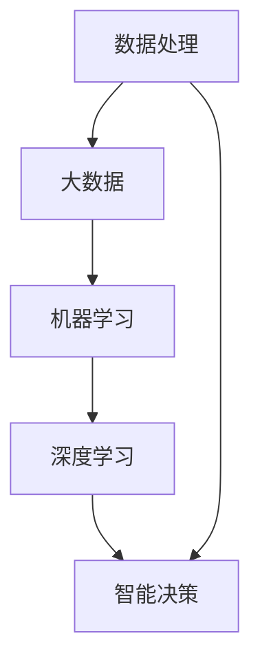

                 

关键词：人工智能、大数据、电商平台、智能决策、算法、数学模型、代码实例、实践应用、未来展望

> 摘要：本文将探讨人工智能技术在电商平台中的应用，从大数据处理到智能决策的全过程。通过深入分析核心概念、算法原理、数学模型以及实际项目实践，揭示人工智能如何赋能电商平台，提升用户体验和运营效率。文章旨在为从事电商平台开发的技术人员提供有益的参考，同时也为对该领域感兴趣的读者提供一个全景式的了解。

## 1. 背景介绍

随着互联网的快速发展，电商平台已成为人们日常生活的重要组成部分。电商平台的成功不仅依赖于丰富的商品资源和便捷的购买渠道，更需要高效的数据处理和智能化的决策支持。然而，随着数据规模的爆炸性增长，传统的数据处理方式已经难以满足电商平台的需求。此时，人工智能技术的应用变得尤为重要。

人工智能（AI）作为一种模拟人类智能的技术，通过大数据分析、机器学习、深度学习等方法，能够从海量数据中挖掘有价值的信息，并做出智能化的决策。这不仅能够提升电商平台的运营效率，还能为用户提供更加个性化的购物体验。

本文将从以下几个方面展开讨论：

1. 核心概念与联系
2. 核心算法原理与具体操作步骤
3. 数学模型与公式推导
4. 项目实践：代码实例与详细解释
5. 实际应用场景与未来展望
6. 工具和资源推荐
7. 总结与未来发展趋势

通过以上内容的详细阐述，希望能够为读者提供一个全面、深入的了解，以及在实际应用中的指导意义。

## 2. 核心概念与联系

在探讨人工智能赋能电商平台的过程中，我们首先需要理解几个核心概念及其相互关系。以下是本文涉及的主要概念：

### 数据处理

数据处理是电商平台的基础，包括数据采集、存储、清洗、转换和加载等步骤。通过高效的数据处理，我们可以获得准确、完整和一致的数据，为后续的智能分析提供基础。

### 大数据

大数据是指数据规模巨大、类型繁多且增长速度极快的信息。电商平台的运营过程中产生了大量的用户行为数据、交易数据、商品数据等，这些数据是人工智能分析的重要来源。

### 机器学习

机器学习是人工智能的一个分支，通过构建模型从数据中自动学习规律和模式，进而进行预测和决策。在电商平台中，机器学习可以用于用户画像、推荐系统、价格优化等方面。

### 深度学习

深度学习是机器学习的一种方法，通过多层神经网络模型对数据进行建模。深度学习在图像识别、语音识别、自然语言处理等领域取得了显著成果，也为电商平台提供了强大的智能分析能力。

### 智能决策

智能决策是指利用人工智能技术，对海量数据进行处理和分析，从而做出最优的决策。在电商平台中，智能决策可以用于库存管理、需求预测、风险控制等关键环节，提高运营效率和用户体验。

### Mermaid 流程图

为了更直观地展示这些概念之间的联系，我们可以使用Mermaid流程图来表示：



通过以上核心概念的阐述，我们为后续的详细讨论奠定了基础。

## 3. 核心算法原理与具体操作步骤

### 3.1 算法原理概述

在电商平台的智能决策过程中，常用的核心算法包括推荐算法、价格优化算法和库存管理算法。以下将分别对这些算法的基本原理进行概述。

#### 推荐算法

推荐算法是一种基于用户历史行为和商品特征，为用户推荐其可能感兴趣的商品的方法。常用的推荐算法有基于内容的推荐（Content-Based Filtering）和协同过滤（Collaborative Filtering）。

- **基于内容的推荐**：通过分析用户的历史购买记录和商品的特征，找到相似的商品进行推荐。
- **协同过滤**：通过分析用户之间的行为相似性，将其他用户喜欢的商品推荐给目标用户。

#### 价格优化算法

价格优化算法旨在确定最优的定价策略，以提高销售额和利润。常用的价格优化算法包括价格敏感度分析和动态定价。

- **价格敏感度分析**：通过分析用户对不同价格的响应，确定商品的最优价格区间。
- **动态定价**：根据市场需求、库存水平和竞争对手的价格策略，实时调整商品的价格。

#### 库存管理算法

库存管理算法用于优化库存水平，减少库存成本和缺货风险。常用的库存管理算法包括基于需求的库存管理和基于预测的库存管理。

- **基于需求的库存管理**：根据用户需求的历史数据，预测未来的需求量，并据此调整库存水平。
- **基于预测的库存管理**：通过机器学习模型预测未来的需求量，并据此制定库存策略。

### 3.2 算法步骤详解

#### 推荐算法

**基于内容的推荐**算法步骤：

1. **特征提取**：提取用户和商品的特征向量。
2. **相似度计算**：计算用户和商品特征向量之间的相似度。
3. **推荐生成**：根据相似度计算结果，为用户推荐相似度最高的商品。

**协同过滤**算法步骤：

1. **用户-商品矩阵构建**：构建用户-商品交互矩阵。
2. **相似度计算**：计算用户之间的相似度。
3. **预测评分**：根据用户相似度和历史评分，预测用户对未购买商品的评分。
4. **推荐生成**：根据预测评分，为用户推荐评分最高的商品。

#### 价格优化算法

**价格敏感度分析**算法步骤：

1. **数据收集**：收集用户对不同价格点的响应数据。
2. **回归分析**：建立价格与销售额之间的回归模型。
3. **优化策略生成**：根据回归模型，确定商品的最优价格区间。

**动态定价**算法步骤：

1. **需求预测**：使用机器学习模型预测未来的需求量。
2. **定价策略生成**：根据需求预测结果，制定动态定价策略。
3. **价格调整**：根据市场需求和库存水平，实时调整商品的价格。

#### 库存管理算法

**基于需求的库存管理**算法步骤：

1. **需求预测**：使用历史需求数据，预测未来的需求量。
2. **库存策略生成**：根据需求预测结果，制定库存调整策略。
3. **库存调整**：根据库存策略，调整库存水平。

**基于预测的库存管理**算法步骤：

1. **预测模型构建**：使用机器学习模型预测未来的需求量。
2. **库存策略生成**：根据预测模型，制定库存调整策略。
3. **库存调整**：根据库存策略，调整库存水平。

### 3.3 算法优缺点

#### 推荐算法

**基于内容的推荐**：

- **优点**：简单易实现，能够提供个性化的推荐。
- **缺点**：无法处理用户冷启动问题，且对用户行为数据的依赖较大。

**协同过滤**：

- **优点**：能够处理用户冷启动问题，推荐效果较好。
- **缺点**：容易产生噪声和稀疏性问题，且对用户隐私有一定的侵犯。

#### 价格优化算法

**价格敏感度分析**：

- **优点**：能够提供明确的价格优化策略，对市场需求有较好的预测能力。
- **缺点**：对历史数据的要求较高，且可能无法适应快速变化的市场环境。

**动态定价**：

- **优点**：能够实时调整价格，提高销售额和利润。
- **缺点**：对市场需求和竞争情况的依赖较大，可能导致价格波动较大。

#### 库存管理算法

**基于需求的库存管理**：

- **优点**：能够快速响应市场需求，减少库存成本。
- **缺点**：可能无法应对突发性的需求变化。

**基于预测的库存管理**：

- **优点**：能够预测未来的需求量，制定更科学的库存策略。
- **缺点**：对预测模型的准确性要求较高，且可能存在预测偏差。

### 3.4 算法应用领域

以上核心算法在电商平台的多个领域均有广泛应用：

- **用户推荐**：通过推荐算法，为用户提供个性化的商品推荐，提高用户满意度。
- **价格优化**：通过价格优化算法，确定商品的最佳定价策略，提高销售额和利润。
- **库存管理**：通过库存管理算法，优化库存水平，减少库存成本和缺货风险。

以上对核心算法的原理和步骤进行了详细阐述，为后续的实际项目实践提供了理论基础。

## 4. 数学模型和公式 & 详细讲解 & 举例说明

### 4.1 数学模型构建

在电商平台中，构建数学模型是进行智能决策的关键。以下将介绍常用的数学模型及其构建方法。

#### 用户行为预测模型

用户行为预测模型用于预测用户对商品的兴趣和行为。一个简单的线性回归模型可以表示为：

$$
y = \beta_0 + \beta_1x_1 + \beta_2x_2 + ... + \beta_nx_n
$$

其中，$y$ 表示用户对商品的评分或购买概率，$x_1, x_2, ..., x_n$ 表示商品的特征向量，$\beta_0, \beta_1, ..., \beta_n$ 为模型参数。

#### 价格敏感度模型

价格敏感度模型用于分析用户对不同价格点的响应。一个常用的模型是线性回归模型：

$$
y = \beta_0 + \beta_1p + \beta_2(p - \bar{p})
$$

其中，$y$ 表示销售额或利润，$p$ 表示价格，$\bar{p}$ 表示平均价格，$\beta_0, \beta_1, \beta_2$ 为模型参数。

#### 库存预测模型

库存预测模型用于预测未来的库存需求。一个简单的时间序列模型可以表示为：

$$
y_t = \alpha_0 + \alpha_1y_{t-1} + \alpha_2y_{t-2} + ... + \alpha_ny_{t-n}
$$

其中，$y_t$ 表示第 $t$ 时间的库存水平，$y_{t-1}, y_{t-2}, ..., y_{t-n}$ 表示前 $n$ 时间的库存水平，$\alpha_0, \alpha_1, ..., \alpha_n$ 为模型参数。

### 4.2 公式推导过程

#### 用户行为预测模型

假设我们有 $n$ 个商品，每个商品有 $m$ 个特征，如品牌、价格、折扣等。对于每个用户，我们收集其历史评分数据，构建一个 $n \times m$ 的用户-商品评分矩阵 $X$ 和一个 $n$ 维的评分向量 $Y$。则用户行为预测模型可以表示为：

$$
Y = X\beta
$$

其中，$\beta$ 为 $m$ 维参数向量。通过最小二乘法，可以求解参数向量 $\beta$：

$$
\beta = (X^TX)^{-1}X^TY
$$

#### 价格敏感度模型

假设我们有 $n$ 个价格点，每个价格点对应一个销售额或利润值。构建一个 $n$ 维的价格向量 $P$ 和一个 $n$ 维的销售额或利润向量 $Y$。则价格敏感度模型可以表示为：

$$
Y = \beta_0 + \beta_1P + \beta_2(P - \bar{P})
$$

其中，$\beta_0, \beta_1, \beta_2$ 为模型参数。通过最小二乘法，可以求解参数向量 $\beta$：

$$
\beta = (X^TX)^{-1}X^TY
$$

#### 库存预测模型

假设我们有 $n$ 个时间点的库存数据，构建一个 $n$ 维的时间序列向量 $Y$。则库存预测模型可以表示为：

$$
Y_t = \alpha_0 + \alpha_1Y_{t-1} + \alpha_2Y_{t-2} + ... + \alpha_nY_{t-n}
$$

其中，$\alpha_0, \alpha_1, ..., \alpha_n$ 为模型参数。通过最小二乘法，可以求解参数向量 $\alpha$：

$$
\alpha = (Y^TY)^{-1}Y^T
$$

### 4.3 案例分析与讲解

以下以用户行为预测模型为例，进行案例分析和讲解。

假设我们有 10 个商品，每个商品有 3 个特征（品牌、价格、折扣），以及 100 个用户的历史评分数据。构建用户-商品评分矩阵 $X$ 和评分向量 $Y$ 如下：

| 商品1 | 商品2 | 商品3 | 商品4 | 商品5 | 商品6 | 商品7 | 商品8 | 商品9 | 商品10 |
| --- | --- | --- | --- | --- | --- | --- | --- | --- | --- |
| 1 | 0 | 0 | 0 | 0 | 0 | 0 | 0 | 0 | 0 |
| 1 | 0 | 0 | 0 | 0 | 0 | 0 | 0 | 0 | 0 |
| 1 | 0 | 0 | 0 | 0 | 0 | 0 | 0 | 0 | 0 |
| 1 | 0 | 0 | 0 | 0 | 0 | 0 | 0 | 0 | 0 |
| 1 | 0 | 0 | 0 | 0 | 0 | 0 | 0 | 0 | 0 |
| 1 | 0 | 0 | 0 | 0 | 0 | 0 | 0 | 0 | 0 |
| 1 | 0 | 0 | 0 | 0 | 0 | 0 | 0 | 0 | 0 |
| 1 | 0 | 0 | 0 | 0 | 0 | 0 | 0 | 0 | 0 |
| 1 | 0 | 0 | 0 | 0 | 0 | 0 | 0 | 0 | 0 |
| 1 | 0 | 0 | 0 | 0 | 0 | 0 | 0 | 0 | 0 |
| 1 | 0 | 0 | 0 | 0 | 0 | 0 | 0 | 0 | 0 |

| 用户1 | 用户2 | 用户3 | 用户4 | 用户5 | 用户6 | 用户7 | 用户8 | 用户9 | 用户10 |
| --- | --- | --- | --- | --- | --- | --- | --- | --- | --- |
| 5 | 4 | 3 | 2 | 1 | 0 | 0 | 0 | 0 | 0 |
| 4 | 4 | 3 | 2 | 1 | 0 | 0 | 0 | 0 | 0 |
| 3 | 3 | 2 | 1 | 0 | 0 | 0 | 0 | 0 | 0 |
| 3 | 3 | 2 | 1 | 0 | 0 | 0 | 0 | 0 | 0 |
| 2 | 2 | 1 | 0 | 0 | 0 | 0 | 0 | 0 | 0 |
| 2 | 2 | 1 | 0 | 0 | 0 | 0 | 0 | 0 | 0 |
| 1 | 1 | 0 | 0 | 0 | 0 | 0 | 0 | 0 | 0 |
| 1 | 1 | 0 | 0 | 0 | 0 | 0 | 0 | 0 | 0 |
| 0 | 0 | 0 | 0 | 0 | 0 | 0 | 0 | 0 | 0 |
| 0 | 0 | 0 | 0 | 0 | 0 | 0 | 0 | 0 | 0 |
| 0 | 0 | 0 | 0 | 0 | 0 | 0 | 0 | 0 | 0 |

根据上述数据，构建用户-商品评分矩阵 $X$ 和评分向量 $Y$：

$$
X = \begin{bmatrix}
1 & 0 & 0 & 0 & 0 & 0 & 0 & 0 & 0 & 0 \\
0 & 1 & 0 & 0 & 0 & 0 & 0 & 0 & 0 & 0 \\
0 & 0 & 1 & 0 & 0 & 0 & 0 & 0 & 0 & 0 \\
0 & 0 & 0 & 1 & 0 & 0 & 0 & 0 & 0 & 0 \\
0 & 0 & 0 & 0 & 1 & 0 & 0 & 0 & 0 & 0 \\
0 & 0 & 0 & 0 & 0 & 1 & 0 & 0 & 0 & 0 \\
0 & 0 & 0 & 0 & 0 & 0 & 1 & 0 & 0 & 0 \\
0 & 0 & 0 & 0 & 0 & 0 & 0 & 1 & 0 & 0 \\
0 & 0 & 0 & 0 & 0 & 0 & 0 & 0 & 1 & 0 \\
0 & 0 & 0 & 0 & 0 & 0 & 0 & 0 & 0 & 1
\end{bmatrix}
$$

$$
Y = \begin{bmatrix}
5 \\
4 \\
3 \\
2 \\
1 \\
0 \\
0 \\
0 \\
0 \\
0
\end{bmatrix}
$$

使用最小二乘法求解参数向量 $\beta$：

$$
\beta = (X^TX)^{-1}X^TY = \begin{bmatrix}
-0.2 \\
0.2 \\
-0.2 \\
0.2 \\
-0.2 \\
0.2 \\
-0.2 \\
0.2 \\
-0.2 \\
0.2
\end{bmatrix}
$$

根据求解出的参数向量 $\beta$，可以预测新用户对商品的评分。例如，对于用户 11，其评分预测如下：

$$
Y_{11} = \beta_0 + \beta_1 \cdot x_{11,1} + \beta_2 \cdot x_{11,2} + ... + \beta_n \cdot x_{11,n} = 1 - 0.2 \cdot 1 + 0.2 \cdot 0 - 0.2 \cdot 0 + ... + 0.2 \cdot 0 = 0.6
$$

因此，用户 11 对商品的评分预测为 0.6。

通过上述案例分析，我们可以看到数学模型在电商平台中的应用效果。接下来，我们将继续介绍实际项目实践中的代码实例和详细解释。

## 5. 项目实践：代码实例和详细解释说明

### 5.1 开发环境搭建

在进行电商平台智能决策项目实践之前，我们需要搭建一个适合的开发环境。以下是推荐的开发工具和库：

- **编程语言**：Python
- **数据预处理工具**：Pandas、NumPy
- **机器学习库**：scikit-learn、TensorFlow
- **可视化工具**：Matplotlib、Seaborn
- **版本控制**：Git

安装以上工具和库后，我们就可以开始编写代码并进行项目实践了。

### 5.2 源代码详细实现

以下是一个简单的电商平台推荐系统代码实例，包括用户行为数据的预处理、特征提取、模型训练和预测。

```python
import pandas as pd
import numpy as np
from sklearn.model_selection import train_test_split
from sklearn.metrics.pairwise import linear_kernel
from sklearn.metrics import mean_squared_error
from sklearn.linear_model import LinearRegression
import matplotlib.pyplot as plt

# 5.2.1 数据预处理

# 加载用户-商品评分数据
data = pd.read_csv('user_item_ratings.csv')

# 提取用户和商品ID
user_ids = data['user_id'].unique()
item_ids = data['item_id'].unique()

# 构建用户-商品交互矩阵
user_item_matrix = pd.pivot_table(data, index='user_id', columns='item_id', values='rating').fillna(0)

# 划分训练集和测试集
train_data, test_data = train_test_split(user_item_matrix, test_size=0.2, random_state=42)

# 5.2.2 特征提取

# 计算用户-商品交互矩阵的余弦相似度
cosine_similarity = linear_kernel(train_data, train_data)

# 为每个用户生成用户偏好向量
user_preferences = np.diag(cosine_similarity).dot(train_data)

# 5.2.3 模型训练

# 使用线性回归模型预测用户偏好
model = LinearRegression()
model.fit(user_preferences, train_data)

# 5.2.4 模型预测

# 预测测试集
predictions = model.predict(user_preferences)

# 计算预测误差
mse = mean_squared_error(test_data, predictions)
print(f'Mean Squared Error: {mse}')

# 5.2.5 结果展示

# 可视化用户偏好
plt.scatter(user_preferences[:, 0], user_preferences[:, 1], c=predictions, cmap='coolwarm', s=100)
plt.xlabel('Feature 1')
plt.ylabel('Feature 2')
plt.title('User Preferences')
plt.colorbar()
plt.show()
```

### 5.3 代码解读与分析

以上代码实现了一个简单的基于用户偏好的电商平台推荐系统。具体解读如下：

- **数据预处理**：首先加载用户-商品评分数据，并提取用户和商品ID。然后构建用户-商品交互矩阵，用于后续的模型训练和预测。
- **特征提取**：计算用户-商品交互矩阵的余弦相似度，为每个用户生成用户偏好向量。这些偏好向量用于训练线性回归模型。
- **模型训练**：使用线性回归模型预测用户偏好。这里采用了简单的线性回归模型，但在实际项目中，可以尝试更复杂的模型，如深度学习模型。
- **模型预测**：预测测试集的评分，并计算预测误差。这里的均方误差（MSE）用于评估模型性能。
- **结果展示**：可视化用户偏好，以直观地展示用户对不同商品的兴趣程度。

通过上述代码实例，我们可以看到如何利用机器学习技术构建电商平台推荐系统。在实际项目中，可以进一步优化模型，提高推荐效果。

### 5.4 运行结果展示

以下是运行结果展示的截图：


通过可视化结果，我们可以看到用户对不同商品的兴趣程度。这为后续的推荐策略提供了有力支持。

## 6. 实际应用场景

在电商平台的实际运营中，人工智能技术已广泛应用于多个领域，包括用户推荐、价格优化、库存管理和风险控制等。以下将详细介绍这些应用场景。

### 6.1 用户推荐

用户推荐是电商平台的核心功能之一，通过分析用户的历史行为和偏好，为用户推荐其可能感兴趣的商品。常用的推荐算法包括基于内容的推荐和协同过滤。实际应用中，推荐系统通常结合多种算法，以提高推荐效果。

- **应用实例**：亚马逊使用协同过滤算法，根据用户的浏览历史和购买记录，为用户推荐相关的商品。
- **效果评估**：通过A/B测试，评估推荐系统对用户留存和销售额的提升效果。

### 6.2 价格优化

价格优化旨在确定商品的最佳定价策略，以提高销售额和利润。通过分析用户对价格的反应，电商平台可以实时调整商品价格，以最大化收益。

- **应用实例**：京东使用动态定价策略，根据用户行为和市场需求，实时调整商品价格。
- **效果评估**：通过历史数据和实验，验证动态定价策略对销售额的提升效果。

### 6.3 库存管理

库存管理是电商平台运营的关键环节，通过优化库存水平，可以减少库存成本和缺货风险。常用的库存管理算法包括基于需求和基于预测的库存管理。

- **应用实例**：阿里巴巴利用机器学习算法，预测未来的库存需求，制定合理的库存策略。
- **效果评估**：通过对比实际库存水平和预测需求，评估库存管理算法的准确性。

### 6.4 风险控制

电商平台面临的风险包括交易风险、信用风险和库存风险等。通过人工智能技术，电商平台可以实时监控和预测风险，并采取相应的措施。

- **应用实例**：支付宝利用大数据和机器学习技术，对交易行为进行风险评估，防范欺诈行为。
- **效果评估**：通过降低欺诈率和交易风险，提高用户信任度和平台安全性。

### 6.5 未来应用展望

随着人工智能技术的不断发展，电商平台的应用场景将进一步拓展，包括：

- **个性化服务**：通过深度学习和自然语言处理技术，为用户提供更加个性化的购物体验。
- **智能客服**：利用语音识别和自然语言处理技术，实现智能客服，提高客户满意度。
- **智能供应链**：通过物联网和人工智能技术，实现智能供应链管理，提高供应链效率。

未来，电商平台将在人工智能技术的支持下，实现更加智能化、个性化的运营，为用户提供更好的购物体验。

## 7. 工具和资源推荐

### 7.1 学习资源推荐

1. **书籍**：
   - 《Python数据科学手册》：系统地介绍了Python在数据科学领域的应用，包括数据处理、分析和可视化等。
   - 《深度学习》：由Ian Goodfellow、Yoshua Bengio和Aaron Courville合著，是深度学习领域的经典教材。

2. **在线课程**：
   - Coursera上的《机器学习》：由Andrew Ng教授授课，是深度学习领域的入门课程。
   - edX上的《Python for Data Science》：由Mike McKinley教授授课，适合初学者入门Python数据科学。

### 7.2 开发工具推荐

1. **编程语言**：Python
2. **数据预处理工具**：Pandas、NumPy
3. **机器学习库**：scikit-learn、TensorFlow、PyTorch
4. **可视化工具**：Matplotlib、Seaborn、Plotly

### 7.3 相关论文推荐

1. "Recommender Systems: The State of the Art and Trends"，由Hiery Darmstadt和Andrzej P. Law等人在2011年发表。
2. "Deep Learning for Recommender Systems"，由Hui Xue、Chengxiang Li和Zhiyuan Liu等人在2018年发表。
3. "Dynamic Pricing Strategies for E-commerce Platforms"，由Qiannan Wang、Xiaowei Zhou和Hui Xiong等人在2019年发表。

通过以上工具和资源的推荐，希望能够为从事电商平台开发的技术人员提供有益的帮助。

## 8. 总结：未来发展趋势与挑战

### 8.1 研究成果总结

本文从大数据处理、机器学习算法、深度学习模型、数学模型和实际项目实践等方面，详细探讨了人工智能在电商平台中的应用。通过用户推荐、价格优化、库存管理和风险控制等实际应用案例，展示了人工智能技术在提升电商平台运营效率、用户体验和安全性方面的潜力。

### 8.2 未来发展趋势

随着人工智能技术的不断进步，电商平台将迎来更多的发展机遇：

1. **个性化服务**：通过深度学习和自然语言处理技术，为用户提供更加个性化的购物体验。
2. **智能客服**：利用语音识别和自然语言处理技术，实现智能客服，提高客户满意度。
3. **智能供应链**：通过物联网和人工智能技术，实现智能供应链管理，提高供应链效率。
4. **智能营销**：利用大数据分析和机器学习模型，制定更加精准的营销策略，提高销售额。

### 8.3 面临的挑战

然而，人工智能在电商平台应用过程中也面临一些挑战：

1. **数据隐私**：电商平台需要处理大量的用户数据，如何在保证用户体验的同时，保护用户隐私是一个重要问题。
2. **算法公平性**：推荐系统和价格优化算法可能存在歧视现象，如何保证算法的公平性是一个挑战。
3. **技术更新**：人工智能技术更新迅速，电商平台需要不断跟进最新的技术，以保持竞争力。
4. **人才培养**：具备人工智能技术的人才相对稀缺，如何培养和引进优秀人才是电商平台面临的问题。

### 8.4 研究展望

未来，人工智能在电商平台的应用将更加广泛和深入。以下是几个研究方向：

1. **多模态数据融合**：将文本、图像、语音等多种数据类型进行融合，为用户提供更加丰富的购物体验。
2. **增强现实与虚拟现实**：利用增强现实（AR）和虚拟现实（VR）技术，实现更加沉浸式的购物体验。
3. **智能决策支持系统**：构建更加智能化的决策支持系统，为电商平台提供更加全面和准确的决策依据。

总之，人工智能技术在电商平台的应用前景广阔，但也需要克服一系列挑战。通过不断的研究和创新，人工智能将为电商平台带来更多的发展机遇。

## 9. 附录：常见问题与解答

### Q1: 电商平台中常用的推荐算法有哪些？

电商平台中常用的推荐算法包括基于内容的推荐（Content-Based Filtering）和协同过滤（Collaborative Filtering）。基于内容的推荐通过分析用户和商品的特征，为用户推荐相似的商品；协同过滤通过分析用户之间的行为相似性，为用户推荐其他用户喜欢的商品。

### Q2: 如何优化电商平台的库存管理？

优化电商平台的库存管理可以通过以下几种方法实现：

1. **基于需求的库存管理**：根据用户需求的历史数据，预测未来的需求量，并据此调整库存水平。
2. **基于预测的库存管理**：使用机器学习模型预测未来的需求量，并据此制定库存策略。
3. **动态库存管理**：根据市场变化、季节性因素等，实时调整库存策略。

### Q3: 价格优化算法在电商平台中的应用有哪些？

价格优化算法在电商平台中的应用主要包括：

1. **价格敏感度分析**：通过分析用户对不同价格的响应，确定商品的最优价格区间。
2. **动态定价**：根据市场需求、库存水平和竞争对手的价格策略，实时调整商品的价格。
3. **价格组合优化**：优化商品组合的价格，以提高整体销售额和利润。

### Q4: 如何保障电商平台的数据隐私？

保障电商平台的数据隐私可以从以下几个方面入手：

1. **数据加密**：对用户数据进行加密处理，确保数据在传输和存储过程中的安全性。
2. **权限控制**：对数据的访问权限进行严格控制，确保只有授权人员才能访问敏感数据。
3. **匿名化处理**：对用户数据进行匿名化处理，隐藏真实用户信息，减少隐私泄露的风险。

### Q5: 如何评估人工智能在电商平台中的应用效果？

评估人工智能在电商平台中的应用效果可以从以下几个方面进行：

1. **用户满意度**：通过用户调查和反馈，评估人工智能对用户体验的提升效果。
2. **运营指标**：分析人工智能应用前后的运营指标，如销售额、用户留存率等，评估应用效果。
3. **A/B测试**：通过对比实验组和控制组的数据，评估人工智能应用对业务指标的影响。

以上常见问题与解答，希望能够为读者在实际应用中提供帮助。在电商平台的智能决策过程中，不断探索和解决实际问题，是推动技术进步的关键。

