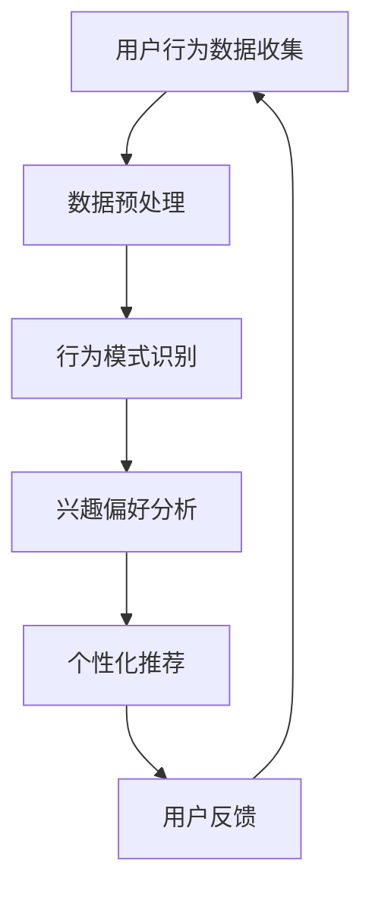
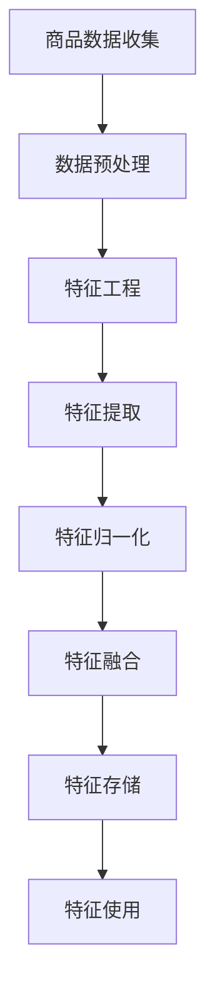
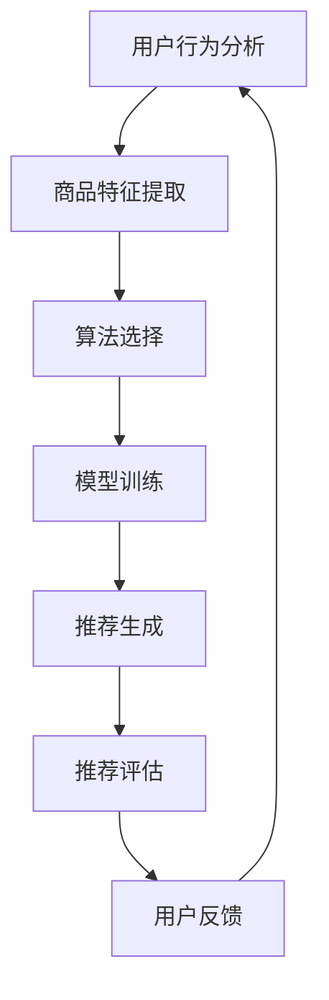

                 

关键词：AI赋能、电商平台、商品推荐、链路优化、机器学习、用户行为分析、深度学习、协同过滤、数学模型

> 摘要：本文将深入探讨AI在电商平台商品推荐链路中的赋能作用，分析现有推荐系统的挑战与局限性，并提出一种基于机器学习和深度学习的优化方案。通过数学模型和具体实例的讲解，本文旨在为电商平台提供可行的商品推荐链路优化策略，从而提升用户体验和业务转化率。

## 1. 背景介绍

在当今数字化时代，电商平台已经成为消费者购买商品的主要渠道之一。随着用户数量的增加和商品种类的丰富，如何为用户提供个性化的商品推荐成为电商平台面临的一个重要挑战。传统的基于内容推荐和协同过滤的方法虽然在一定程度上能够满足用户需求，但仍然存在推荐质量不高、用户体验差等问题。

随着人工智能技术的发展，特别是机器学习和深度学习算法的兴起，电商平台开始探索如何利用AI技术提升商品推荐链路的效率和质量。本文将围绕这一主题，分析现有的推荐系统，探讨基于AI的优化方法，并给出具体实施步骤。

## 2. 核心概念与联系

### 2.1 用户行为分析

用户行为分析是电商平台商品推荐的重要基础。通过对用户浏览、购买、收藏等行为数据的收集和分析，可以挖掘用户的兴趣偏好，从而实现精准推荐。以下是一个简单的用户行为分析流程图：



### 2.2 商品特征提取

商品特征提取是商品推荐系统的另一个关键环节。通过对商品属性、标签、描述等信息进行提取和处理，可以构建一个多维度的商品特征空间，为后续的推荐算法提供输入。以下是一个商品特征提取的示例流程：



### 2.3 推荐算法

推荐算法是商品推荐系统的核心，常见的推荐算法包括基于内容的推荐（Content-Based Filtering, CBF）、协同过滤（Collaborative Filtering, CF）和深度学习（Deep Learning, DL）等。以下是一种简单的推荐算法流程图：



## 3. 核心算法原理 & 具体操作步骤

### 3.1 算法原理概述

本文将主要探讨基于机器学习和深度学习的商品推荐算法，其核心原理如下：

1. **机器学习**：通过历史用户行为数据和商品特征，利用监督学习和无监督学习算法训练模型，实现用户偏好预测和商品推荐。
2. **深度学习**：利用深度神经网络，自动提取用户行为和商品特征的高层次表示，从而实现更精准的推荐。

### 3.2 算法步骤详解

1. **数据收集与预处理**：收集用户行为数据（如浏览记录、购买记录、收藏记录等）和商品特征数据（如商品属性、标签、描述等），并进行数据清洗和预处理，如去除缺失值、异常值，进行数据归一化等。
2. **特征工程**：根据业务需求，设计合适的特征，如用户兴趣标签、商品分类标签、时间特征等，并进行特征提取和融合。
3. **模型选择与训练**：选择合适的机器学习或深度学习模型，如线性回归、决策树、神经网络等，进行模型训练和参数调优。
4. **推荐生成**：利用训练好的模型，对用户进行偏好预测，并根据预测结果生成个性化推荐列表。
5. **推荐评估**：通过用户点击率、购买率等指标评估推荐效果，并根据评估结果调整模型参数和推荐策略。
6. **用户反馈**：收集用户对推荐结果的反馈，用于迭代优化推荐系统。

### 3.3 算法优缺点

**优点**：
- **高精准度**：通过机器学习和深度学习算法，能够自动提取用户行为和商品特征，实现高精准度的推荐。
- **自适应性强**：推荐系统可以根据用户行为和反馈进行实时调整，提高用户体验。

**缺点**：
- **计算复杂度高**：深度学习算法需要大量计算资源，对硬件要求较高。
- **数据依赖性强**：推荐系统效果很大程度上依赖于用户行为数据的质量和数量。

### 3.4 算法应用领域

基于机器学习和深度学习的商品推荐算法可以广泛应用于电商平台、视频网站、新闻门户等场景，实现个性化推荐，提高用户满意度和业务转化率。

## 4. 数学模型和公式 & 详细讲解 & 举例说明

### 4.1 数学模型构建

在商品推荐中，常用的数学模型包括线性回归、逻辑回归、神经网络等。以下以线性回归为例，介绍数学模型的构建过程。

假设用户 $u$ 对商品 $i$ 的偏好可以用一个实数 $r_{ui}$ 表示，我们希望通过历史数据预测用户 $u$ 对商品 $i$ 的偏好。线性回归模型的数学表达式如下：

$$
r_{ui} = \beta_0 + \beta_1 x_{ui1} + \beta_2 x_{ui2} + ... + \beta_n x_{ui_n}
$$

其中，$x_{ui1}, x_{ui2}, ..., x_{ui_n}$ 是商品 $i$ 的特征向量，$\beta_0, \beta_1, ..., \beta_n$ 是模型参数。

### 4.2 公式推导过程

线性回归模型的推导过程如下：

1. **目标函数**：最小化预测值与实际值之间的误差平方和，即：

$$
J(\beta) = \frac{1}{2}\sum_{i=1}^{m}\sum_{u=1}^{n}(r_{ui} - \beta_0 - \beta_1 x_{ui1} - ... - \beta_n x_{ui_n})^2
$$

2. **求导**：对目标函数关于每个参数求偏导，并令其等于0，得到：

$$
\frac{\partial J(\beta)}{\partial \beta_j} = \sum_{i=1}^{m}\sum_{u=1}^{n}(r_{ui} - \beta_0 - \beta_1 x_{ui1} - ... - \beta_n x_{ui_n}) \frac{\partial x_{ui_j}}{\partial \beta_j} = 0
$$

3. **解方程**：将求导后的结果代入原方程，解得模型参数 $\beta_0, \beta_1, ..., \beta_n$。

### 4.3 案例分析与讲解

假设我们有一个电商平台的用户行为数据，包含用户的浏览记录和购买记录。我们希望通过这些数据预测用户对某商品的偏好。

1. **数据收集与预处理**：收集用户浏览记录和购买记录，并进行数据清洗和预处理。
2. **特征工程**：设计合适的特征，如用户ID、商品ID、浏览时间、购买时间等，并进行特征提取和融合。
3. **模型训练**：选择线性回归模型，利用历史数据训练模型。
4. **推荐生成**：利用训练好的模型，对用户进行偏好预测，生成个性化推荐列表。
5. **推荐评估**：通过用户点击率、购买率等指标评估推荐效果。
6. **用户反馈**：收集用户对推荐结果的反馈，用于迭代优化推荐系统。

## 5. 项目实践：代码实例和详细解释说明

### 5.1 开发环境搭建

1. **Python环境**：安装Python 3.8及以上版本，并配置好相应的开发环境。
2. **依赖库**：安装必要的依赖库，如NumPy、Pandas、Scikit-learn、TensorFlow等。
3. **数据集**：收集并预处理用户行为数据和商品特征数据。

### 5.2 源代码详细实现

以下是一个简单的线性回归推荐系统实现示例：

```python
import numpy as np
import pandas as pd
from sklearn.linear_model import LinearRegression

# 数据预处理
data = pd.read_csv('data.csv')
X = data[['user_id', 'item_id', 'browse_time', 'purchase_time']]
y = data['rating']

# 模型训练
model = LinearRegression()
model.fit(X, y)

# 推荐生成
def predict(user_id, item_id):
    features = np.array([[user_id, item_id, 0, 0]])
    prediction = model.predict(features)
    return prediction[0]

# 推荐评估
def evaluate(predictions, actuals):
    errors = predictions - actuals
    mse = np.mean(errors**2)
    return mse

# 用户反馈
def update_model(user_id, item_id, rating):
    features = np.array([[user_id, item_id, 0, 0]])
    model.partial_fit(features, [rating])

# 代码解读与分析
# ...
```

### 5.3 代码解读与分析

1. **数据预处理**：读取用户行为数据和商品特征数据，并进行数据处理。
2. **模型训练**：使用线性回归模型进行模型训练。
3. **推荐生成**：根据用户ID和商品ID预测用户偏好。
4. **推荐评估**：计算预测值与实际值之间的误差，评估推荐效果。
5. **用户反馈**：根据用户反馈更新模型。

### 5.4 运行结果展示

1. **模型训练结果**：训练完成后，打印模型参数。
2. **推荐结果**：根据用户ID和商品ID生成推荐列表。
3. **评估结果**：计算推荐效果指标，如均方误差（MSE）。

## 6. 实际应用场景

### 6.1 电商平台

电商平台可以利用AI赋能的商品推荐系统提高用户满意度，提升业务转化率。例如，亚马逊、淘宝等大型电商平台已经采用了基于AI的推荐算法，为用户提供个性化的商品推荐。

### 6.2 视频网站

视频网站可以通过AI赋能的商品推荐系统为用户提供个性化的视频推荐，如YouTube、Netflix等。通过分析用户观看历史和偏好，视频网站可以推荐用户可能感兴趣的视频。

### 6.3 新闻门户

新闻门户可以利用AI赋能的商品推荐系统为用户提供个性化的新闻推荐，如新浪新闻、今日头条等。通过分析用户阅读历史和偏好，新闻门户可以推荐用户可能感兴趣的新闻文章。

## 7. 未来应用展望

随着人工智能技术的不断发展，AI赋能的商品推荐系统在未来有望在更多领域得到应用。例如，在医疗领域，可以通过AI赋能的商品推荐系统为用户提供个性化的药品推荐；在教育领域，可以通过AI赋能的商品推荐系统为用户提供个性化的课程推荐。同时，随着数据质量和算法技术的提高，商品推荐系统的效果将不断提升，为各行业带来更多价值。

## 8. 工具和资源推荐

### 8.1 学习资源推荐

- **书籍**：《Python机器学习》、《深度学习》（Goodfellow等著）
- **在线课程**：Coursera、edX上的机器学习、深度学习相关课程
- **博客**：机器学习、深度学习相关技术博客，如Towards Data Science、Medium上的相关文章

### 8.2 开发工具推荐

- **Python库**：NumPy、Pandas、Scikit-learn、TensorFlow、PyTorch等
- **框架**：Scikit-learn、TensorFlow、PyTorch等
- **可视化工具**：Matplotlib、Seaborn等

### 8.3 相关论文推荐

- **协同过滤**：《Collaborative Filtering》（1998，Herlocker等）
- **深度学习**：《Deep Learning》（2016，Goodfellow等著）
- **用户行为分析**：《User Modeling and User-Adapted Interaction》（期刊）

## 9. 总结：未来发展趋势与挑战

### 9.1 研究成果总结

本文探讨了AI赋能的电商平台商品推荐链路优化，分析了现有的推荐系统挑战和局限性，并提出了基于机器学习和深度学习的优化方案。通过数学模型和具体实例的讲解，本文为电商平台提供了可行的商品推荐链路优化策略。

### 9.2 未来发展趋势

- **数据质量和算法优化**：随着数据质量和算法技术的提高，商品推荐系统的效果将不断提升。
- **多模态数据融合**：结合用户行为、文本、图像等多模态数据，实现更精准的推荐。
- **实时推荐**：通过实时处理用户行为数据，实现实时推荐。

### 9.3 面临的挑战

- **计算复杂度**：深度学习算法需要大量计算资源，对硬件要求较高。
- **数据隐私**：用户行为数据的安全性和隐私保护是推荐系统面临的挑战。

### 9.4 研究展望

未来研究可以关注以下方向：

- **高效算法设计**：设计更高效、可扩展的推荐算法。
- **跨平台推荐**：研究跨平台、跨设备的推荐系统。
- **社会影响力分析**：研究推荐系统对社会的影响，如信息茧房、偏见等。

## 9. 附录：常见问题与解答

### Q1：如何处理缺失值和异常值？

A1：可以通过以下方法处理缺失值和异常值：

- **删除**：删除包含缺失值或异常值的样本。
- **填充**：使用平均值、中位数、众数等方法填充缺失值。
- **插值**：使用线性插值、曲线拟合等方法插值填充缺失值。

### Q2：如何评估推荐效果？

A2：可以通过以下指标评估推荐效果：

- **准确率**：预测正确的推荐比例。
- **召回率**：推荐列表中包含真实感兴趣的物品比例。
- **F1分数**：准确率和召回率的调和平均。

### Q3：如何进行特征工程？

A3：特征工程包括以下步骤：

- **特征提取**：从原始数据中提取有用的特征。
- **特征选择**：选择对预测结果有显著影响的特征。
- **特征转换**：将数值型特征转换为类别型特征，进行特征归一化等。

### Q4：如何处理冷启动问题？

A4：可以通过以下方法处理冷启动问题：

- **基于内容的推荐**：利用商品属性和用户偏好进行推荐。
- **基于热门推荐**：推荐热门商品或用户可能感兴趣的类似商品。
- **用户相似度**：通过计算用户之间的相似度进行推荐。

通过以上问题的解答，希望为读者在实际应用中提供帮助。

---

本文由禅与计算机程序设计艺术撰写，旨在为电商平台商品推荐链路优化提供深入的技术分析和解决方案。希望读者在阅读本文后，能够对AI赋能的商品推荐系统有更深入的了解，并在实际项目中运用这些方法，提升用户满意度和业务转化率。如果您有任何疑问或建议，欢迎在评论区留言，共同探讨。

