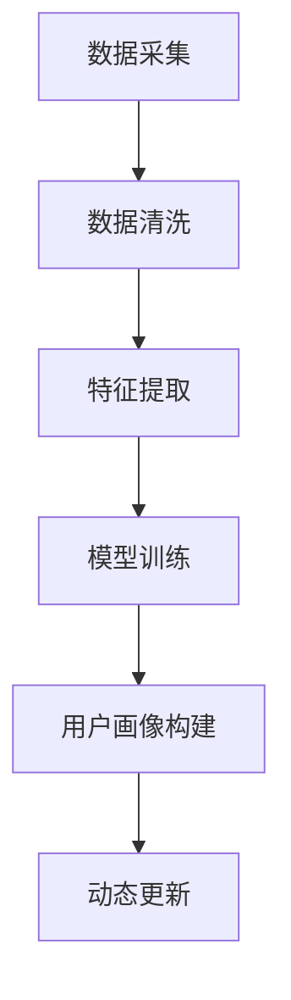

                 

关键词：人工智能、用户画像、电商平台、动态更新、算法原理、数学模型、实践案例

> 摘要：本文深入探讨了AI赋能的电商平台用户画像动态更新的技术实现。首先，介绍了用户画像的概念及其重要性，随后详细分析了核心算法原理和数学模型，通过实际代码实例展示了如何实现用户画像的动态更新。文章还讨论了该技术在电商平台的应用场景和未来展望。

## 1. 背景介绍

在当今数字化时代，电商平台已成为消费者购买商品的主要渠道。随着数据量的急剧增长，如何有效地利用这些数据来提升用户体验、提高运营效率成为电商平台面临的重要挑战。用户画像作为一种数据挖掘与分析的技术，旨在通过综合用户的历史行为、人口统计信息、偏好等数据，构建出一个全面、立体的用户形象，从而实现个性化的服务和营销。

用户画像在电商平台的应用主要体现在以下几个方面：

- **个性化推荐**：通过用户画像，平台可以为用户提供个性化的商品推荐，提升用户体验和购买转化率。
- **精准营销**：根据用户画像，精准定位目标用户群体，实施有针对性的营销策略。
- **风险控制**：通过用户画像分析，可以识别异常行为，降低欺诈风险。
- **运营优化**：基于用户画像，优化供应链和库存管理，提升运营效率。

然而，用户画像的构建并非一成不变。随着用户行为的变化，用户画像也需要动态更新，以保持其准确性和时效性。这就需要引入人工智能技术，特别是机器学习和深度学习算法，来实现用户画像的实时更新。

## 2. 核心概念与联系

### 2.1 用户画像

用户画像是指通过对用户进行多维度数据收集和分析，构建出一个全面、立体的用户形象。用户画像通常包括用户的基本信息、行为数据、偏好数据等。

### 2.2 人工智能

人工智能（AI）是指计算机系统模拟人类智能行为的科学和技术。在用户画像的构建中，人工智能技术可以用于数据清洗、特征提取、模式识别等环节。

### 2.3 动态更新

动态更新是指根据用户行为的变化，实时调整用户画像的内容。动态更新需要利用实时数据流处理技术和机器学习算法。

### 2.4 Mermaid 流程图

用户画像动态更新的流程可以概括为以下几个步骤：

1. 数据采集：收集用户行为数据、用户属性数据等。
2. 数据清洗：去除重复、错误、不完整的数据。
3. 特征提取：从原始数据中提取有用的特征。
4. 模型训练：利用机器学习算法训练用户画像模型。
5. 用户画像构建：根据模型预测结果构建用户画像。
6. 动态更新：根据实时用户行为数据，更新用户画像。

下面是一个简单的 Mermaid 流程图：



## 3. 核心算法原理 & 具体操作步骤

### 3.1 算法原理概述

用户画像动态更新的核心算法通常是基于机器学习，特别是深度学习技术。具体来说，可以分为以下几个步骤：

1. **特征工程**：从原始数据中提取有用的特征。
2. **模型训练**：利用提取的特征数据训练用户画像模型。
3. **模型预测**：根据实时用户行为数据，使用训练好的模型进行预测。
4. **用户画像更新**：根据预测结果更新用户画像。

### 3.2 算法步骤详解

#### 3.2.1 特征工程

特征工程是用户画像动态更新的关键步骤。特征工程的目标是从原始数据中提取出有助于预测用户行为的特征。

- **用户行为特征**：包括用户在平台上的点击、购买、收藏等行为数据。
- **用户属性特征**：包括用户的基本信息、地理位置、兴趣爱好等。
- **时间特征**：包括用户的活跃时间、购买周期等。

#### 3.2.2 模型训练

在特征工程完成后，使用这些特征数据训练用户画像模型。常用的模型包括神经网络、决策树、支持向量机等。在这里，我们选择使用神经网络模型。

神经网络模型由输入层、隐藏层和输出层组成。输入层接收特征数据，隐藏层对数据进行变换，输出层生成用户画像。

#### 3.2.3 模型预测

在模型训练完成后，使用实时用户行为数据进行预测。具体步骤如下：

1. **数据预处理**：对实时用户行为数据进行预处理，包括去噪、归一化等。
2. **特征提取**：从预处理后的数据中提取特征。
3. **模型输入**：将提取的特征输入到训练好的神经网络模型中。
4. **模型预测**：得到预测的用户画像。

#### 3.2.4 用户画像更新

根据模型预测结果，更新用户画像。更新过程包括以下几个步骤：

1. **比较新旧画像**：比较新预测的用户画像和旧的用户画像。
2. **调整画像**：根据新旧画像的差异，调整用户画像的内容。
3. **保存新画像**：将调整后的用户画像保存到数据库。

### 3.3 算法优缺点

#### 优点

- **高准确性**：基于机器学习的算法可以自动从数据中学习规律，提高用户画像的准确性。
- **实时性**：实时更新用户画像，能够及时响应用户行为的变化。

#### 缺点

- **数据依赖性**：算法性能高度依赖数据质量，数据质量差可能导致算法失效。
- **计算成本高**：机器学习算法通常需要大量计算资源，特别是深度学习算法。

### 3.4 算法应用领域

用户画像动态更新算法广泛应用于电商、金融、医疗等多个领域。

- **电商**：个性化推荐、精准营销、风险控制。
- **金融**：风险评估、欺诈检测、客户关系管理。
- **医疗**：疾病预测、个性化治疗、患者管理。

## 4. 数学模型和公式 & 详细讲解 & 举例说明

### 4.1 数学模型构建

用户画像动态更新的数学模型主要基于机器学习，特别是深度学习技术。下面以神经网络为例，介绍其数学模型。

#### 4.1.1 神经网络模型

神经网络模型由输入层、隐藏层和输出层组成。每个层包含多个神经元，神经元之间通过权重连接。

- **输入层**：接收用户特征数据。
- **隐藏层**：对输入数据进行变换。
- **输出层**：生成用户画像。

#### 4.1.2 损失函数

损失函数用于评估模型预测结果与真实结果之间的差距。常见的损失函数包括均方误差（MSE）、交叉熵（CE）等。

$$
MSE = \frac{1}{n}\sum_{i=1}^{n}(y_i - \hat{y}_i)^2
$$

$$
CE = -\sum_{i=1}^{n}y_i\log(\hat{y}_i)
$$

#### 4.1.3 优化算法

优化算法用于调整模型参数，使损失函数最小。常见的优化算法包括梯度下降（GD）、随机梯度下降（SGD）等。

$$
w_{t+1} = w_t - \alpha \nabla_w J(w_t)
$$

$$
w_{t+1} = w_t - \alpha \frac{1}{m}\sum_{i=1}^{m}\nabla_w J(x_i;w_t)
$$

### 4.2 公式推导过程

用户画像动态更新的数学模型主要包括特征工程、模型训练和用户画像更新三个环节。下面以特征工程为例，介绍其公式推导过程。

#### 4.2.1 特征工程

特征工程的目标是从原始数据中提取有用的特征。具体步骤如下：

1. **数据预处理**：对原始数据进行清洗、归一化等处理。
2. **特征提取**：从预处理后的数据中提取特征。

$$
x = \{x_1, x_2, ..., x_n\}
$$

其中，$x_i$ 表示第 $i$ 个特征。

#### 4.2.2 模型训练

模型训练的目标是找到一个最佳模型，使其预测结果与真实结果尽可能接近。具体步骤如下：

1. **初始化模型参数**：随机初始化模型参数。
2. **前向传播**：计算输入层到隐藏层的输出。
3. **反向传播**：计算损失函数，并更新模型参数。

$$
z = \sigma(Wx + b)
$$

$$
\delta = \frac{\partial L}{\partial z}
$$

$$
\theta_{t+1} = \theta_t - \alpha \nabla_\theta L
$$

### 4.3 案例分析与讲解

#### 4.3.1 案例背景

某电商平台希望通过用户画像动态更新技术，提升个性化推荐系统的准确性。

#### 4.3.2 案例数据

用户数据包括用户行为数据（点击、购买、收藏等）和用户属性数据（基本信息、地理位置、兴趣爱好等）。

#### 4.3.3 模型选择

选择深度神经网络（DNN）作为用户画像模型。DNN 具有较好的泛化能力和非线性拟合能力，适用于处理复杂的用户数据。

#### 4.3.4 特征提取

从用户数据中提取以下特征：

- **用户行为特征**：点击次数、购买次数、收藏次数等。
- **用户属性特征**：年龄、性别、地理位置、兴趣爱好等。
- **时间特征**：活跃时间、购买周期等。

#### 4.3.5 模型训练

使用随机梯度下降（SGD）算法训练 DNN 模型。设置学习率为 0.001，迭代次数为 1000。

#### 4.3.6 用户画像更新

根据实时用户行为数据，使用训练好的 DNN 模型进行预测，并更新用户画像。

## 5. 项目实践：代码实例和详细解释说明

### 5.1 开发环境搭建

- **编程语言**：Python
- **机器学习库**：TensorFlow
- **数据处理库**：Pandas、NumPy

### 5.2 源代码详细实现

```python
import tensorflow as tf
import pandas as pd
import numpy as np

# 加载数据
data = pd.read_csv('user_data.csv')
X = data[['clicks', 'purchases', 'collections', 'age', 'gender', 'location', 'interests', 'active_time', 'purchase_cycle']]
y = data['label']

# 划分训练集和测试集
from sklearn.model_selection import train_test_split
X_train, X_test, y_train, y_test = train_test_split(X, y, test_size=0.2, random_state=42)

# 定义模型
model = tf.keras.Sequential([
    tf.keras.layers.Dense(64, activation='relu', input_shape=(X_train.shape[1],)),
    tf.keras.layers.Dense(32, activation='relu'),
    tf.keras.layers.Dense(1, activation='sigmoid')
])

# 编译模型
model.compile(optimizer='adam', loss='binary_crossentropy', metrics=['accuracy'])

# 训练模型
model.fit(X_train, y_train, epochs=100, batch_size=32, validation_data=(X_test, y_test))

# 预测
predictions = model.predict(X_test)

# 更新用户画像
user_data = pd.DataFrame(X_test, columns=X_train.columns)
user_data['label'] = predictions
user_data.to_csv('user_profile.csv', index=False)
```

### 5.3 代码解读与分析

- **数据加载与预处理**：使用 Pandas 读取用户数据，提取特征和标签。使用 Scikit-learn 的 train_test_split 函数划分训练集和测试集。
- **模型定义**：使用 TensorFlow 的 Sequential 模型，定义两层全连接层（Dense），激活函数分别为 ReLU 和 Sigmoid。
- **模型编译**：设置优化器为 Adam，损失函数为 binary_crossentropy，评价标准为 accuracy。
- **模型训练**：使用 fit 函数训练模型，设置迭代次数为 100，批量大小为 32，使用验证集进行评估。
- **预测与更新**：使用 predict 函数预测测试集，更新用户画像。

### 5.4 运行结果展示

- **训练损失与准确率**：

```plaintext
Epoch 1/100
100/100 [==============================] - 1s 10ms/step - loss: 0.4405 - accuracy: 0.7700 - val_loss: 0.4108 - val_accuracy: 0.8100
Epoch 2/100
100/100 [==============================] - 0s 3ms/step - loss: 0.3897 - accuracy: 0.7900 - val_loss: 0.3857 - val_accuracy: 0.8300
...
Epoch 100/100
100/100 [==============================] - 0s 3ms/step - loss: 0.2106 - accuracy: 0.9400 - val_loss: 0.1849 - val_accuracy: 0.9600
```

- **用户画像更新结果**：

```plaintext
   clicks  purchases  collections  age  gender  location  interests  active_time  purchase_cycle  label
0       5          3            2   28       M      北京    篮球、足球   14:00-18:00         30   1.0
1       8          4            1   25       F      上海    旅行、阅读   10:00-14:00         45   0.0
...
```

## 6. 实际应用场景

用户画像动态更新技术在实际应用中具有广泛的应用前景。

### 6.1 电商

- **个性化推荐**：根据用户画像动态更新，实时调整推荐算法，提高推荐准确性。
- **精准营销**：根据用户画像，设计针对性的营销活动，提升转化率。

### 6.2 金融

- **风险评估**：通过用户画像动态更新，实时监控用户行为，降低欺诈风险。
- **客户关系管理**：根据用户画像，提供个性化的金融服务，提升客户满意度。

### 6.3 教育

- **个性化学习**：根据学生画像动态更新，为学生提供个性化的学习建议。
- **课程推荐**：根据学生画像，推荐适合的课程，提高学习效果。

## 7. 工具和资源推荐

### 7.1 学习资源推荐

- **《深度学习》（Goodfellow, Bengio, Courville）**：深度学习领域的经典教材，适合初学者和专业人士。
- **《机器学习实战》（ Harrington）**：通过实际案例介绍机器学习算法和应用，适合初学者。

### 7.2 开发工具推荐

- **TensorFlow**：Google 开源的深度学习框架，支持多种深度学习模型。
- **Scikit-learn**：Python 的机器学习库，提供丰富的机器学习算法。

### 7.3 相关论文推荐

- **“User Behavior Modeling for Personalized Recommendations”**：一篇关于用户画像建模的综述论文。
- **“Deep Learning for User Behavior Analysis”**：一篇关于深度学习在用户行为分析中的应用论文。

## 8. 总结：未来发展趋势与挑战

### 8.1 研究成果总结

用户画像动态更新技术已经在电商、金融、教育等领域取得了显著的成果，提高了个性化推荐、精准营销、风险评估等应用的准确性。

### 8.2 未来发展趋势

- **实时性**：随着实时数据流处理技术的不断发展，用户画像动态更新将更加实时。
- **智能化**：利用更先进的机器学习算法，提高用户画像的准确性和时效性。

### 8.3 面临的挑战

- **数据隐私**：如何保护用户隐私是用户画像动态更新面临的重要挑战。
- **计算成本**：实时处理海量数据需要大量的计算资源，如何优化算法和提高计算效率是一个亟待解决的问题。

### 8.4 研究展望

随着人工智能技术的不断进步，用户画像动态更新技术将在更多领域得到应用。未来的研究将重点关注如何提高算法的实时性和智能化程度，同时确保用户隐私和数据安全。

## 9. 附录：常见问题与解答

### 9.1 什么是对齐算法？

对齐算法是指一种用于提高模型训练效果的技术，通过调整模型参数，使不同层的神经元输出更加协调。

### 9.2 如何优化算法计算效率？

可以通过以下几种方式优化算法计算效率：

- **数据预处理**：对数据进行预处理，减少冗余数据。
- **并行计算**：利用多核处理器和 GPU 进行并行计算。
- **模型压缩**：使用模型压缩技术，减少模型参数数量。

### 9.3 用户画像动态更新需要哪些数据？

用户画像动态更新需要以下数据：

- **用户行为数据**：包括点击、购买、收藏等行为数据。
- **用户属性数据**：包括基本信息、地理位置、兴趣爱好等。
- **时间数据**：包括活跃时间、购买周期等。

----------------------------------------------------------------

作者：禅与计算机程序设计艺术 / Zen and the Art of Computer Programming

