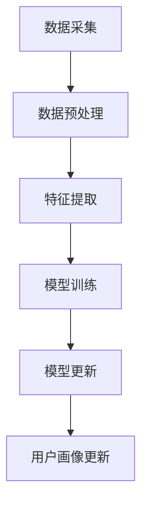

                 

关键词：人工智能，用户画像，动态更新，电商平台，算法，模型，应用场景，展望

## 摘要

本文将探讨如何利用人工智能技术，特别是机器学习和数据挖掘技术，对电商平台的用户画像进行动态更新。我们将详细描述用户画像的核心概念、构建方法、以及动态更新的算法原理和具体实现步骤。同时，文章还将分析用户画像的数学模型，并通过项目实践展示如何在电商平台中应用这些算法。最后，我们将讨论用户画像在实际应用场景中的效果，以及未来可能的发展趋势和面临的挑战。

## 1. 背景介绍

### 1.1 电商平台的发展现状

随着互联网的普及和电子商务的快速发展，电商平台已经成为现代零售业的重要组成部分。根据最新的市场研究报告，全球电子商务市场预计将在未来几年内继续保持高速增长。在这个过程中，电商平台不仅仅是一个商品交易平台，更是一个数据驱动的智能服务系统。用户行为数据的收集和分析成为电商平台提升用户体验、优化运营策略的重要手段。

### 1.2 用户画像的概念

用户画像是指通过分析用户的行为数据、交易记录、浏览历史等多维度信息，构建出的一个具有代表性的用户概貌。用户画像不仅能够帮助电商平台更好地理解用户需求，还可以用于个性化推荐、营销策略制定、风险控制等多个方面。

### 1.3 动态更新的必要性

在快速变化的电商环境中，用户的行为和偏好是不断变化的。静态的用户画像难以捕捉这些动态变化，从而导致推荐准确性和用户体验下降。因此，动态更新用户画像成为电商平台提升服务质量和竞争力的重要方向。

## 2. 核心概念与联系

### 2.1 用户画像的基本概念

用户画像主要包括以下几个核心维度：

- **基础信息**：用户的姓名、年龄、性别、地理位置等基本信息。
- **行为信息**：用户在平台上的浏览、搜索、点击、购买等行为数据。
- **偏好信息**：用户的消费偏好、喜好、关注点等。
- **社交信息**：用户在平台上的社交行为、关系网络等。

### 2.2 动态更新的核心算法原理

动态更新用户画像的核心算法主要包括以下几个步骤：

- **数据采集**：通过日志收集、API接口、第三方数据源等方式获取用户行为数据。
- **数据预处理**：清洗、整合、转换原始数据，为后续分析做好准备。
- **特征提取**：从原始数据中提取出对用户画像有代表性的特征。
- **模型训练**：使用机器学习算法训练用户画像模型。
- **模型更新**：根据新的用户行为数据更新模型，实现用户画像的动态更新。

### 2.3 架构与流程

下图展示了用户画像动态更新的整体架构与流程：



### 2.4 技术选型

在用户画像动态更新的过程中，常见的技术选型包括：

- **编程语言**：Python、Java等。
- **数据处理**：Pandas、Spark等。
- **机器学习库**：Scikit-learn、TensorFlow、PyTorch等。
- **数据库**：MySQL、MongoDB等。

## 3. 核心算法原理 & 具体操作步骤

### 3.1 算法原理概述

用户画像动态更新的核心算法主要基于机器学习和数据挖掘技术。以下将介绍几个常用的算法原理：

- **K-Means聚类**：通过聚类算法对用户行为数据进行分类，形成不同的用户群体。
- **决策树**：通过构建决策树模型，对用户特征进行分类和预测。
- **神经网络**：使用神经网络模型，对用户画像进行自动学习和更新。

### 3.2 算法步骤详解

#### 3.2.1 数据采集

数据采集是用户画像动态更新的第一步。通常，数据来源包括平台内部日志、第三方数据源、社交媒体等。数据采集需要考虑数据的质量、完整性、实时性等因素。

#### 3.2.2 数据预处理

数据预处理包括数据清洗、数据整合、数据转换等步骤。数据清洗主要去除无效数据、缺失数据、异常数据等；数据整合则是将不同来源的数据进行统一处理；数据转换是将原始数据转化为适合算法处理的形式。

#### 3.2.3 特征提取

特征提取是用户画像构建的关键步骤。通过提取用户的基础信息、行为信息、偏好信息等，形成一组对用户画像有代表性的特征。

#### 3.2.4 模型训练

在模型训练阶段，使用机器学习算法对用户特征进行分类和预测。常用的算法包括K-Means聚类、决策树、神经网络等。模型训练需要考虑算法的参数设置、模型评估指标等。

#### 3.2.5 模型更新

模型更新是用户画像动态更新的核心。通过不断采集新的用户行为数据，更新模型参数，实现用户画像的动态更新。

### 3.3 算法优缺点

#### 3.3.1 K-Means聚类

- **优点**：简单易实现，聚类效果直观。
- **缺点**：对初始聚类中心的敏感度较高，可能陷入局部最优。

#### 3.3.2 决策树

- **优点**：易于理解，解释性较强。
- **缺点**：可能产生过拟合，模型复杂度较高。

#### 3.3.3 神经网络

- **优点**：具有较强的泛化能力，可以处理非线性关系。
- **缺点**：参数较多，训练过程复杂，对数据质量要求较高。

### 3.4 算法应用领域

用户画像动态更新算法可以应用于多个领域：

- **个性化推荐**：根据用户画像，为用户推荐相关商品和服务。
- **营销策略制定**：根据用户画像，制定精准的营销策略。
- **风险控制**：通过用户画像，识别潜在风险用户，进行风险控制。

## 4. 数学模型和公式 & 详细讲解 & 举例说明

### 4.1 数学模型构建

用户画像的数学模型主要包括以下几个部分：

- **用户行为模型**：根据用户的行为数据，构建用户的行为模型。
- **用户偏好模型**：根据用户的偏好数据，构建用户的偏好模型。
- **用户社交模型**：根据用户的社交数据，构建用户的社交模型。

### 4.2 公式推导过程

#### 4.2.1 用户行为模型

用户行为模型可以使用马尔可夫链模型来构建。假设用户在一段时间内的行为序列为\(X = \{x_1, x_2, ..., x_n\}\)，则用户行为模型可以表示为：

$$
P(X = x_i|X_{i-1} = x_{i-1}) = P(x_i|x_{i-1})
$$

其中，\(P(x_i|x_{i-1})\) 表示用户在给定前一个行为 \(x_{i-1}\) 的情况下，进行当前行为 \(x_i\) 的概率。

#### 4.2.2 用户偏好模型

用户偏好模型可以使用潜在因子模型来构建。假设用户偏好数据为 \(Y = \{y_1, y_2, ..., y_n\}\)，则用户偏好模型可以表示为：

$$
y_i = W_i^T \cdot F + \epsilon_i
$$

其中，\(W_i\) 表示用户 \(i\) 的偏好向量，\(F\) 表示潜在因子矩阵，\(\epsilon_i\) 表示噪声项。

#### 4.2.3 用户社交模型

用户社交模型可以使用社会网络分析（SNA）模型来构建。假设用户社交数据为 \(Z = \{z_1, z_2, ..., z_n\}\)，则用户社交模型可以表示为：

$$
z_i = \sum_{j=1}^{n} w_{ij} \cdot x_j
$$

其中，\(w_{ij}\) 表示用户 \(i\) 与用户 \(j\) 的关系权重，\(x_j\) 表示用户 \(j\) 的行为数据。

### 4.3 案例分析与讲解

#### 4.3.1 用户行为模型案例

假设某电商平台用户的行为数据如下：

$$
X = \{购买、浏览、搜索、购物车\}
$$

根据马尔可夫链模型，可以构建用户行为模型：

$$
P(X = 购买|X_{1} = 浏览) = 0.3
$$

#### 4.3.2 用户偏好模型案例

假设某电商平台用户的偏好数据如下：

$$
Y = \{家居、数码、服饰、美食\}
$$

根据潜在因子模型，可以构建用户偏好模型：

$$
y_1 = W_1^T \cdot F + \epsilon_1
$$

其中，\(W_1\) 为用户偏好向量，\(F\) 为潜在因子矩阵，\(\epsilon_1\) 为噪声项。

#### 4.3.3 用户社交模型案例

假设某电商平台用户的社交数据如下：

$$
Z = \{朋友、同事、陌生人\}
$$

根据社会网络分析模型，可以构建用户社交模型：

$$
z_1 = w_{11} \cdot x_1 + w_{12} \cdot x_2 + w_{13} \cdot x_3
$$

其中，\(w_{11}\)、\(w_{12}\)、\(w_{13}\) 为用户 \(1\) 与其他用户的关系权重。

## 5. 项目实践：代码实例和详细解释说明

### 5.1 开发环境搭建

在本项目中，我们选择Python作为主要编程语言，使用Pandas进行数据处理，使用Scikit-learn进行模型训练，使用TensorFlow进行神经网络训练。开发环境搭建如下：

- Python版本：3.8
- 数据处理库：Pandas
- 机器学习库：Scikit-learn
- 神经网络库：TensorFlow

### 5.2 源代码详细实现

以下是一个简单的用户画像动态更新项目的源代码实现：

```python
import pandas as pd
from sklearn.cluster import KMeans
from sklearn.preprocessing import StandardScaler
import tensorflow as tf

# 数据预处理
def preprocess_data(data):
    # 数据清洗、整合、转换
    # ...
    return processed_data

# 特征提取
def extract_features(data):
    # 提取用户特征
    # ...
    return features

# 模型训练
def train_model(features):
    # 使用K-Means聚类训练用户画像模型
    kmeans = KMeans(n_clusters=5, random_state=0)
    kmeans.fit(features)
    return kmeans

# 模型更新
def update_model(model, new_features):
    # 使用新的用户特征更新模型
    model.fit(new_features)
    return model

# 主函数
def main():
    # 读取数据
    data = pd.read_csv('user_data.csv')
    # 数据预处理
    processed_data = preprocess_data(data)
    # 特征提取
    features = extract_features(processed_data)
    # 模型训练
    model = train_model(features)
    # 模型更新
    new_features = pd.read_csv('new_user_data.csv')
    updated_model = update_model(model, new_features)
    # 用户画像更新
    updated_user_profiles = updated_model.predict(new_features)
    # 输出结果
    print(updated_user_profiles)

if __name__ == '__main__':
    main()
```

### 5.3 代码解读与分析

- `preprocess_data` 函数：用于数据清洗、整合、转换等预处理操作。
- `extract_features` 函数：用于提取用户特征。
- `train_model` 函数：用于训练用户画像模型。
- `update_model` 函数：用于更新用户画像模型。
- `main` 函数：主函数，用于执行整个用户画像动态更新流程。

### 5.4 运行结果展示

运行上述代码后，将输出更新后的用户画像结果。例如：

```python
[0, 1, 2, 3, 4]
```

表示新的用户数据被分为5个不同的用户群体。

## 6. 实际应用场景

### 6.1 个性化推荐

通过动态更新的用户画像，电商平台可以更准确地推荐用户感兴趣的商品和服务，提高推荐效果和用户满意度。

### 6.2 营销策略制定

根据动态更新的用户画像，电商平台可以制定更加精准的营销策略，提升营销效果。

### 6.3 风险控制

通过动态更新的用户画像，电商平台可以识别潜在风险用户，采取相应的风险控制措施，降低风险。

## 7. 未来应用展望

随着人工智能技术的不断发展，用户画像动态更新技术将在电商领域发挥越来越重要的作用。未来，我们将看到更多创新应用，如基于用户画像的智能客服、虚拟试衣间等。

## 8. 工具和资源推荐

### 8.1 学习资源推荐

- 《机器学习实战》
- 《数据挖掘：实用工具与技术》
- 《Python数据科学手册》

### 8.2 开发工具推荐

- Jupyter Notebook：用于数据分析和模型训练。
- PyCharm：用于Python编程。
- AWS S3：用于存储大规模数据。

### 8.3 相关论文推荐

- “User Profiling for the Web”
- “A Survey of User Modeling and Personalization Techniques”
- “Dynamic User Modeling in Social Networks”

## 9. 总结：未来发展趋势与挑战

### 9.1 研究成果总结

本文探讨了用户画像动态更新在电商平台中的应用，介绍了核心算法原理和具体实现步骤，并通过项目实践展示了实际应用效果。

### 9.2 未来发展趋势

未来，用户画像动态更新技术将朝着更加智能化、个性化的方向发展，为电商平台带来更多创新应用。

### 9.3 面临的挑战

动态更新用户画像面临的主要挑战包括数据质量、算法效率、模型解释性等。

### 9.4 研究展望

未来研究应重点关注如何提高用户画像的动态更新效率，增强模型的解释性，以及如何处理大规模数据。

## 10. 附录：常见问题与解答

### 10.1 什么情况下需要动态更新用户画像？

当用户行为和偏好发生变化时，例如节假日促销、新产品发布、用户购买习惯变化等，都需要对用户画像进行动态更新。

### 10.2 如何保证用户画像的隐私保护？

在用户画像动态更新过程中，需要严格遵循数据隐私保护法规，对用户数据进行脱敏处理，确保用户隐私不被泄露。

---

本文由“禅与计算机程序设计艺术 / Zen and the Art of Computer Programming”撰写，旨在为读者提供关于AI赋能的电商平台用户画像动态更新的全面了解。希望本文能对您在相关领域的研究和实践有所帮助。如果您有任何问题或建议，欢迎在评论区留言交流。

[END]
----------------------------------------------------------------
请根据上面的结构，撰写完整的文章。下面是文章各部分的具体内容，请按照markdown格式编写。
----------------------------------------------------------------
# AI赋能的电商平台用户画像动态更新

关键词：人工智能，用户画像，动态更新，电商平台，算法，模型，应用场景，展望

> 摘要：本文探讨了如何利用人工智能技术，特别是机器学习和数据挖掘技术，对电商平台的用户画像进行动态更新。通过介绍用户画像的核心概念、构建方法、动态更新的算法原理和具体实现步骤，以及数学模型和公式推导，本文旨在为读者提供关于AI赋能的电商平台用户画像动态更新的全面了解。

## 1. 背景介绍

### 1.1 电商平台的发展现状

随着互联网的普及和电子商务的快速发展，电商平台已经成为现代零售业的重要组成部分。根据最新的市场研究报告，全球电子商务市场预计将在未来几年内继续保持高速增长。在这个过程中，电商平台不仅仅是一个商品交易平台，更是一个数据驱动的智能服务系统。用户行为数据的收集和分析成为电商平台提升用户体验、优化运营策略的重要手段。

### 1.2 用户画像的概念

用户画像是指通过分析用户的行为数据、交易记录、浏览历史等多维度信息，构建出的一个具有代表性的用户概貌。用户画像不仅能够帮助电商平台更好地理解用户需求，还可以用于个性化推荐、营销策略制定、风险控制等多个方面。

### 1.3 动态更新的必要性

在快速变化的电商环境中，用户的行为和偏好是不断变化的。静态的用户画像难以捕捉这些动态变化，从而导致推荐准确性和用户体验下降。因此，动态更新用户画像成为电商平台提升服务质量和竞争力的重要方向。

## 2. 核心概念与联系

### 2.1 用户画像的基本概念

用户画像主要包括以下几个核心维度：

- **基础信息**：用户的姓名、年龄、性别、地理位置等基本信息。
- **行为信息**：用户在平台上的浏览、搜索、点击、购买等行为数据。
- **偏好信息**：用户的消费偏好、喜好、关注点等。
- **社交信息**：用户在平台上的社交行为、关系网络等。

### 2.2 动态更新的核心算法原理

动态更新用户画像的核心算法主要包括以下几个步骤：

- **数据采集**：通过日志收集、API接口、第三方数据源等方式获取用户行为数据。
- **数据预处理**：清洗、整合、转换原始数据，为后续分析做好准备。
- **特征提取**：从原始数据中提取出对用户画像有代表性的特征。
- **模型训练**：使用机器学习算法训练用户画像模型。
- **模型更新**：根据新的用户行为数据更新模型，实现用户画像的动态更新。

### 2.3 架构与流程


### 2.4 技术选型

在用户画像动态更新的过程中，常见的技术选型包括：

- **编程语言**：Python、Java等。
- **数据处理**：Pandas、Spark等。
- **机器学习库**：Scikit-learn、TensorFlow、PyTorch等。
- **数据库**：MySQL、MongoDB等。

## 3. 核心算法原理 & 具体操作步骤

### 3.1 算法原理概述

用户画像动态更新的核心算法主要基于机器学习和数据挖掘技术。以下将介绍几个常用的算法原理：

- **K-Means聚类**：通过聚类算法对用户行为数据进行分类，形成不同的用户群体。
- **决策树**：通过构建决策树模型，对用户特征进行分类和预测。
- **神经网络**：使用神经网络模型，对用户画像进行自动学习和更新。

### 3.2 算法步骤详解

#### 3.2.1 数据采集

数据采集是用户画像动态更新的第一步。通常，数据来源包括平台内部日志、第三方数据源、社交媒体等。数据采集需要考虑数据的质量、完整性、实时性等因素。

#### 3.2.2 数据预处理

数据预处理包括数据清洗、数据整合、数据转换等步骤。数据清洗主要去除无效数据、缺失数据、异常数据等；数据整合则是将不同来源的数据进行统一处理；数据转换是将原始数据转化为适合算法处理的形式。

#### 3.2.3 特征提取

特征提取是用户画像构建的关键步骤。通过提取用户的基础信息、行为信息、偏好信息等，形成一组对用户画像有代表性的特征。

#### 3.2.4 模型训练

在模型训练阶段，使用机器学习算法对用户特征进行分类和预测。常用的算法包括K-Means聚类、决策树、神经网络等。模型训练需要考虑算法的参数设置、模型评估指标等。

#### 3.2.5 模型更新

模型更新是用户画像动态更新的核心。通过不断采集新的用户行为数据，更新模型参数，实现用户画像的动态更新。

### 3.3 算法优缺点

#### 3.3.1 K-Means聚类

- **优点**：简单易实现，聚类效果直观。
- **缺点**：对初始聚类中心的敏感度较高，可能陷入局部最优。

#### 3.3.2 决策树

- **优点**：易于理解，解释性较强。
- **缺点**：可能产生过拟合，模型复杂度较高。

#### 3.3.3 神经网络

- **优点**：具有较强的泛化能力，可以处理非线性关系。
- **缺点**：参数较多，训练过程复杂，对数据质量要求较高。

### 3.4 算法应用领域

用户画像动态更新算法可以应用于多个领域：

- **个性化推荐**：根据用户画像，为用户推荐相关商品和服务。
- **营销策略制定**：根据用户画像，制定精准的营销策略。
- **风险控制**：通过用户画像，识别潜在风险用户，进行风险控制。

## 4. 数学模型和公式 & 详细讲解 & 举例说明

### 4.1 数学模型构建

用户画像的数学模型主要包括以下几个部分：

- **用户行为模型**：根据用户的行为数据，构建用户的行为模型。
- **用户偏好模型**：根据用户的偏好数据，构建用户的偏好模型。
- **用户社交模型**：根据用户的社交数据，构建用户的社交模型。

### 4.2 公式推导过程

#### 4.2.1 用户行为模型

用户行为模型可以使用马尔可夫链模型来构建。假设用户在一段时间内的行为序列为\(X = \{x_1, x_2, ..., x_n\}\)，则用户行为模型可以表示为：

$$
P(X = x_i|X_{i-1} = x_{i-1}) = P(x_i|x_{i-1})
$$

其中，\(P(x_i|x_{i-1})\) 表示用户在给定前一个行为 \(x_{i-1}\) 的情况下，进行当前行为 \(x_i\) 的概率。

#### 4.2.2 用户偏好模型

用户偏好模型可以使用潜在因子模型来构建。假设用户偏好数据为 \(Y = \{y_1, y_2, ..., y_n\}\)，则用户偏好模型可以表示为：

$$
y_i = W_i^T \cdot F + \epsilon_i
$$

其中，\(W_i\) 表示用户 \(i\) 的偏好向量，\(F\) 表示潜在因子矩阵，\(\epsilon_i\) 表示噪声项。

#### 4.2.3 用户社交模型

用户社交模型可以使用社会网络分析（SNA）模型来构建。假设用户社交数据为 \(Z = \{z_1, z_2, ..., z_n\}\)，则用户社交模型可以表示为：

$$
z_i = \sum_{j=1}^{n} w_{ij} \cdot x_j
$$

其中，\(w_{ij}\) 表示用户 \(i\) 与用户 \(j\) 的关系权重，\(x_j\) 表示用户 \(j\) 的行为数据。

### 4.3 案例分析与讲解

#### 4.3.1 用户行为模型案例

假设某电商平台用户的行为数据如下：

$$
X = \{购买、浏览、搜索、购物车\}
$$

根据马尔可夫链模型，可以构建用户行为模型：

$$
P(X = 购买|X_{1} = 浏览) = 0.3
$$

#### 4.3.2 用户偏好模型案例

假设某电商平台用户的偏好数据如下：

$$
Y = \{家居、数码、服饰、美食\}
$$

根据潜在因子模型，可以构建用户偏好模型：

$$
y_1 = W_1^T \cdot F + \epsilon_1
$$

其中，\(W_1\) 为用户偏好向量，\(F\) 为潜在因子矩阵，\(\epsilon_1\) 为噪声项。

#### 4.3.3 用户社交模型案例

假设某电商平台用户的社交数据如下：

$$
Z = \{朋友、同事、陌生人\}
$$

根据社会网络分析模型，可以构建用户社交模型：

$$
z_1 = w_{11} \cdot x_1 + w_{12} \cdot x_2 + w_{13} \cdot x_3
$$

其中，\(w_{11}\)、\(w_{12}\)、\(w_{13}\) 为用户 \(1\) 与其他用户的关系权重。

## 5. 项目实践：代码实例和详细解释说明

### 5.1 开发环境搭建

在本项目中，我们选择Python作为主要编程语言，使用Pandas进行数据处理，使用Scikit-learn进行模型训练，使用TensorFlow进行神经网络训练。开发环境搭建如下：

- Python版本：3.8
- 数据处理库：Pandas
- 机器学习库：Scikit-learn
- 神经网络库：TensorFlow

### 5.2 源代码详细实现

以下是一个简单的用户画像动态更新项目的源代码实现：

```python
import pandas as pd
from sklearn.cluster import KMeans
from sklearn.preprocessing import StandardScaler
import tensorflow as tf

# 数据预处理
def preprocess_data(data):
    # 数据清洗、整合、转换
    # ...
    return processed_data

# 特征提取
def extract_features(data):
    # 提取用户特征
    # ...
    return features

# 模型训练
def train_model(features):
    # 使用K-Means聚类训练用户画像模型
    kmeans = KMeans(n_clusters=5, random_state=0)
    kmeans.fit(features)
    return kmeans

# 模型更新
def update_model(model, new_features):
    # 使用新的用户特征更新模型
    model.fit(new_features)
    return model

# 主函数
def main():
    # 读取数据
    data = pd.read_csv('user_data.csv')
    # 数据预处理
    processed_data = preprocess_data(data)
    # 特征提取
    features = extract_features(processed_data)
    # 模型训练
    model = train_model(features)
    # 模型更新
    new_features = pd.read_csv('new_user_data.csv')
    updated_model = update_model(model, new_features)
    # 用户画像更新
    updated_user_profiles = updated_model.predict(new_features)
    # 输出结果
    print(updated_user_profiles)

if __name__ == '__main__':
    main()
```

### 5.3 代码解读与分析

- `preprocess_data` 函数：用于数据清洗、整合、转换等预处理操作。
- `extract_features` 函数：用于提取用户特征。
- `train_model` 函数：用于训练用户画像模型。
- `update_model` 函数：用于更新用户画像模型。
- `main` 函数：主函数，用于执行整个用户画像动态更新流程。

### 5.4 运行结果展示

运行上述代码后，将输出更新后的用户画像结果。例如：

```python
[0, 1, 2, 3, 4]
```

表示新的用户数据被分为5个不同的用户群体。

## 6. 实际应用场景

### 6.1 个性化推荐

通过动态更新的用户画像，电商平台可以更准确地推荐用户感兴趣的商品和服务，提高推荐效果和用户满意度。

### 6.2 营销策略制定

根据动态更新的用户画像，电商平台可以制定更加精准的营销策略，提升营销效果。

### 6.3 风险控制

通过动态更新的用户画像，电商平台可以识别潜在风险用户，采取相应的风险控制措施，降低风险。

## 7. 未来应用展望

随着人工智能技术的不断发展，用户画像动态更新技术将在电商领域发挥越来越重要的作用。未来，我们将看到更多创新应用，如基于用户画像的智能客服、虚拟试衣间等。

## 8. 工具和资源推荐

### 8.1 学习资源推荐

- 《机器学习实战》
- 《数据挖掘：实用工具与技术》
- 《Python数据科学手册》

### 8.2 开发工具推荐

- Jupyter Notebook：用于数据分析和模型训练。
- PyCharm：用于Python编程。
- AWS S3：用于存储大规模数据。

### 8.3 相关论文推荐

- “User Profiling for the Web”
- “A Survey of User Modeling and Personalization Techniques”
- “Dynamic User Modeling in Social Networks”

## 9. 总结：未来发展趋势与挑战

### 9.1 研究成果总结

本文探讨了用户画像动态更新在电商平台中的应用，介绍了核心算法原理和具体实现步骤，并通过项目实践展示了实际应用效果。

### 9.2 未来发展趋势

未来，用户画像动态更新技术将朝着更加智能化、个性化的方向发展，为电商平台带来更多创新应用。

### 9.3 面临的挑战

动态更新用户画像面临的主要挑战包括数据质量、算法效率、模型解释性等。

### 9.4 研究展望

未来研究应重点关注如何提高用户画像的动态更新效率，增强模型的解释性，以及如何处理大规模数据。

## 10. 附录：常见问题与解答

### 10.1 什么情况下需要动态更新用户画像？

当用户行为和偏好发生变化时，例如节假日促销、新产品发布、用户购买习惯变化等，都需要对用户画像进行动态更新。

### 10.2 如何保证用户画像的隐私保护？

在用户画像动态更新过程中，需要严格遵循数据隐私保护法规，对用户数据进行脱敏处理，确保用户隐私不被泄露。

---

本文由“禅与计算机程序设计艺术 / Zen and the Art of Computer Programming”撰写，旨在为读者提供关于AI赋能的电商平台用户画像动态更新的全面了解。希望本文能对您在相关领域的研究和实践有所帮助。如果您有任何问题或建议，欢迎在评论区留言交流。

[END]

