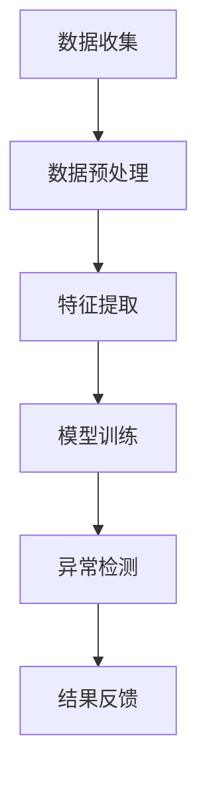

                 

关键词：人工智能，用户行为，异常检测，电商平台，深度学习，数据挖掘，机器学习，算法优化

> 摘要：本文深入探讨了人工智能技术在电商平台用户行为异常检测中的应用。通过介绍核心概念、算法原理、数学模型、项目实践和实际应用场景，本文旨在为读者提供一个全面的技术指南，以应对电商领域日益复杂的用户行为分析需求。

## 1. 背景介绍

随着互联网的快速发展，电子商务行业呈现出爆炸式增长。电商平台不仅改变了人们的购物方式，还带来了大量的用户行为数据。这些数据包含了用户访问、浏览、搜索、购买等行为信息，对于电商平台运营者来说，这些数据是宝贵的资源。然而，海量的用户行为数据中也夹杂着大量的异常行为，如欺诈行为、垃圾信息、恶意评论等。这些异常行为不仅会影响用户的购物体验，还可能导致经济损失和品牌声誉受损。

因此，用户行为异常检测成为了电商平台的重要任务。传统的检测方法主要依赖于规则和模式匹配，但在复杂的用户行为模式下，这些方法往往难以奏效。随着人工智能技术的崛起，尤其是深度学习和数据挖掘技术的应用，用户行为异常检测迎来了新的契机。通过利用人工智能技术，可以更加准确地识别和预测用户行为异常，从而提高电商平台的安全性和用户体验。

本文将围绕以下主题进行讨论：

1. **核心概念与联系**：介绍用户行为异常检测的相关概念和技术架构。
2. **核心算法原理与操作步骤**：详细解释用户行为异常检测算法的原理和实现步骤。
3. **数学模型与公式**：讨论用户行为异常检测的数学模型和公式，并进行案例分析。
4. **项目实践**：通过实际代码实例展示用户行为异常检测的实现过程。
5. **实际应用场景**：探讨用户行为异常检测在电商平台的实际应用。
6. **未来应用展望**：展望用户行为异常检测技术的未来发展趋势和潜在挑战。

## 2. 核心概念与联系

### 2.1 用户行为异常检测的定义

用户行为异常检测（User Behavior Anomaly Detection，UBAD）是指通过分析和挖掘用户的行为数据，发现其中异常的行为模式或行为序列，以便及时发现潜在的安全威胁或欺诈行为。在电商平台中，用户行为异常检测的主要目标包括：

- **欺诈检测**：识别并防范购物车欺诈、订单欺诈等行为。
- **垃圾信息过滤**：过滤掉用户发布的恶意评论、垃圾评论等。
- **异常访问检测**：监控并阻止恶意攻击，如DDoS攻击。
- **用户行为分析**：通过识别用户的异常行为，为用户提供更个性化的服务。

### 2.2 相关技术概念

为了实现用户行为异常检测，需要借助多种技术手段。以下是几个关键概念：

- **机器学习（Machine Learning，ML）**：机器学习是人工智能的核心技术之一，通过训练模型从数据中学习规律，从而实现对未知数据的预测和分类。
- **深度学习（Deep Learning，DL）**：深度学习是机器学习的一个分支，通过多层神经网络模型来提取数据特征，实现对复杂数据的高效处理。
- **数据挖掘（Data Mining，DM）**：数据挖掘是从大量数据中提取有价值信息的过程，包括关联规则挖掘、聚类分析、分类分析等。
- **特征工程（Feature Engineering）**：特征工程是数据挖掘和机器学习中的关键步骤，通过构建和选择合适的特征来提高模型的性能。

### 2.3 技术架构

用户行为异常检测的技术架构可以分为以下几个层次：

1. **数据收集**：收集电商平台的用户行为数据，包括访问日志、交易记录、评论数据等。
2. **数据预处理**：对收集到的数据进行清洗、去噪、转换等预处理操作，以提高数据质量。
3. **特征提取**：通过特征工程提取用户行为特征，为后续的异常检测提供输入。
4. **模型训练**：利用机器学习和深度学习算法训练模型，用于分类和预测用户行为。
5. **异常检测**：通过训练好的模型对用户行为进行实时监测和异常检测，识别潜在的异常行为。
6. **结果反馈**：将检测到的异常行为进行记录和反馈，并采取相应的措施，如阻止访问、标记为垃圾信息等。

### 2.4 Mermaid 流程图

下面是用户行为异常检测的 Mermaid 流程图，展示了各步骤之间的联系：



## 3. 核心算法原理与操作步骤

### 3.1 算法原理概述

用户行为异常检测的核心算法主要基于机器学习和深度学习技术。以下是一些常用的算法和原理：

- **孤立森林（Isolation Forest）**：通过随机选取特征和切分值来隔离异常样本，适用于高维数据的异常检测。
- **K-最近邻（K-Nearest Neighbors，K-NN）**：基于样本的邻域距离来判断是否为异常样本，简单但易于实现。
- **支持向量机（Support Vector Machine，SVM）**：通过最大化分类间隔来构建分类模型，适用于二分类问题。
- **神经网络（Neural Networks）**：通过多层神经网络模型来提取数据特征，实现复杂的非线性分类和预测。

### 3.2 算法步骤详解

用户行为异常检测的具体步骤如下：

1. **数据收集**：从电商平台的各个渠道收集用户行为数据，如访问日志、交易记录、评论数据等。
2. **数据预处理**：对收集到的数据进行清洗、去噪、填充缺失值等预处理操作，以提高数据质量。
3. **特征提取**：通过特征工程提取用户行为特征，如用户访问频率、购买金额、评论长度等。
4. **数据划分**：将预处理后的数据集划分为训练集和测试集，用于训练和评估模型性能。
5. **模型选择与训练**：选择合适的机器学习算法，如孤立森林、K-NN、SVM或神经网络，对训练集进行训练，得到训练模型。
6. **模型评估**：使用测试集对训练好的模型进行评估，计算准确率、召回率、F1值等指标，选择最优模型。
7. **异常检测**：将训练好的模型应用于实际的用户行为数据，对新的用户行为进行实时监测和异常检测。
8. **结果反馈**：将检测到的异常行为进行记录和反馈，并采取相应的措施，如阻止访问、标记为垃圾信息等。

### 3.3 算法优缺点

每种算法都有其优缺点，适用于不同的场景。以下是几种常用算法的优缺点：

- **孤立森林**：优点是计算速度快，易于实现；缺点是对异常样本的识别能力有限，适用于高维数据的异常检测。
- **K-NN**：优点是简单易懂，易于实现；缺点是对异常样本的识别能力有限，对噪声敏感。
- **SVM**：优点是分类效果较好，适用范围广泛；缺点是计算复杂度高，对参数选择敏感。
- **神经网络**：优点是能处理复杂数据和非线性问题，分类效果较好；缺点是训练过程复杂，对大量数据和高计算资源要求高。

### 3.4 算法应用领域

用户行为异常检测算法在多个领域具有广泛的应用：

- **电商平台**：识别欺诈行为、垃圾评论、恶意访问等。
- **金融行业**：识别信用卡欺诈、恶意交易等。
- **网络安全**：监控和防御恶意攻击，如DDoS攻击、病毒传播等。
- **智能交通**：监测交通流量异常、交通事故等。

## 4. 数学模型和公式

### 4.1 数学模型构建

用户行为异常检测的数学模型主要基于概率模型和决策理论。以下是几个常见的数学模型：

1. **贝叶斯分类器**：
   贝叶斯分类器是一种基于贝叶斯定理的分类算法，用于预测新样本的类别。其核心公式为：
   $$
   P(C_k|X) = \frac{P(X|C_k)P(C_k)}{P(X)}
   $$
   其中，$C_k$ 表示类别 $k$，$X$ 表示样本特征。

2. **逻辑回归**：
   逻辑回归是一种广义线性模型，用于预测概率。其核心公式为：
   $$
   P(C_k|X) = \frac{1}{1 + e^{-(\beta_0 + \sum_{i=1}^n \beta_i x_i)}}
   $$
   其中，$\beta_0$ 和 $\beta_i$ 表示模型参数。

3. **支持向量机**：
   支持向量机是一种二分类模型，其核心公式为：
   $$
   w \cdot x + b = 0
   $$
   其中，$w$ 表示法向量，$x$ 表示样本特征，$b$ 表示偏置。

### 4.2 公式推导过程

以下是逻辑回归模型的推导过程：

1. **线性回归**：
   线性回归模型的表达式为：
   $$
   y = \beta_0 + \beta_1 x_1 + \beta_2 x_2 + \ldots + \beta_n x_n
   $$
   其中，$y$ 表示因变量，$x_1, x_2, \ldots, x_n$ 表示自变量，$\beta_0, \beta_1, \beta_2, \ldots, \beta_n$ 表示模型参数。

2. **概率分布**：
   线性回归模型可以表示为概率分布，其核心公式为：
   $$
   P(y|X) = \frac{1}{Z} e^{\beta_0 + \beta_1 x_1 + \beta_2 x_2 + \ldots + \beta_n x_n}
   $$
   其中，$Z$ 表示归一化常数。

3. **逻辑函数**：
   为了实现概率预测，可以引入逻辑函数（Logistic Function），其公式为：
   $$
   \sigma(z) = \frac{1}{1 + e^{-z}}
   $$
   其中，$z$ 表示线性组合。

4. **逻辑回归**：
   将逻辑函数引入线性回归模型，得到逻辑回归模型的表达式：
   $$
   P(y=1|X) = \sigma(\beta_0 + \beta_1 x_1 + \beta_2 x_2 + \ldots + \beta_n x_n)
   $$

### 4.3 案例分析与讲解

假设我们有一个简单的二分类问题，要预测用户是否会在未来一个月内购买商品。我们选择逻辑回归作为分类模型，并使用以下特征：用户年龄、用户性别、用户购买历史等。

1. **特征提取**：
   首先，我们需要对用户数据进行特征提取，构建特征矩阵 $X$ 和标签向量 $y$。

2. **模型训练**：
   使用训练集对逻辑回归模型进行训练，得到模型参数 $\beta_0, \beta_1, \beta_2, \ldots, \beta_n$。

3. **模型评估**：
   使用测试集对训练好的模型进行评估，计算准确率、召回率、F1值等指标。

4. **预测**：
   对新用户的数据进行预测，计算其在未来一个月内购买商品的概率。

假设我们有以下训练数据：

| 用户ID | 年龄 | 性别 | 购买历史 | 标签 |
|--------|------|------|----------|------|
| 1      | 25   | 男   | 3        | 1    |
| 2      | 30   | 女   | 5        | 0    |
| 3      | 22   | 男   | 1        | 1    |
| 4      | 28   | 女   | 4        | 0    |

使用逻辑回归模型进行预测，输入新用户的数据：

| 用户ID | 年龄 | 性别 | 购买历史 |
|--------|------|------|----------|
| 5      | 26   | 男   | 2        |

模型预测结果为：

$$
P(y=1|X) = \sigma(\beta_0 + \beta_1 x_1 + \beta_2 x_2 + \beta_3 x_3) = \frac{1}{1 + e^{-(\beta_0 + \beta_1 \times 26 + \beta_2 \times 1 + \beta_3 \times 2)}}
$$

根据训练好的模型参数，计算预测概率：

$$
P(y=1|X) = \frac{1}{1 + e^{-(\beta_0 + \beta_1 \times 26 + \beta_2 \times 1 + \beta_3 \times 2)}} \approx 0.6
$$

根据预测概率，我们可以判断新用户在未来一个月内购买商品的概率为60%。如果概率高于某个阈值（例如0.5），可以将其标记为“可能购买”，反之则标记为“不太可能购买”。

## 5. 项目实践：代码实例和详细解释说明

### 5.1 开发环境搭建

在进行用户行为异常检测项目实践之前，需要搭建一个合适的开发环境。以下是一个基本的开发环境搭建步骤：

1. 安装Python环境（建议使用Python 3.8及以上版本）。
2. 安装必要的库和依赖项，如NumPy、Pandas、Scikit-learn、TensorFlow等。
3. 配置Jupyter Notebook或PyCharm等开发工具。

### 5.2 源代码详细实现

以下是一个简单的用户行为异常检测项目示例，使用孤立森林算法进行异常检测。

```python
import numpy as np
import pandas as pd
from sklearn.ensemble import IsolationForest
from sklearn.model_selection import train_test_split
from sklearn.metrics import classification_report, accuracy_score

# 1. 数据收集
# 从电商平台获取用户行为数据
data = pd.read_csv('user_behavior_data.csv')

# 2. 数据预处理
# 对数据进行清洗和预处理
data = data.dropna()
data['age'] = data['age'].astype(int)
data['gender'] = data[data['gender'] == '男'].index
data = data.replace({'gender': {0: 0, 1: 1}})

# 3. 特征提取
# 提取用户行为特征
X = data[['age', 'gender', 'purchase_history']]
y = data['label']

# 4. 数据划分
# 将数据划分为训练集和测试集
X_train, X_test, y_train, y_test = train_test_split(X, y, test_size=0.2, random_state=42)

# 5. 模型选择与训练
# 选择孤立森林算法进行训练
model = IsolationForest(n_estimators=100, contamination='auto', random_state=42)
model.fit(X_train)

# 6. 模型评估
# 使用测试集对模型进行评估
y_pred = model.predict(X_test)
y_pred = y_pred == -1

print('Accuracy:', accuracy_score(y_test, y_pred))
print('Classification Report:\n', classification_report(y_test, y_pred))

# 7. 异常检测
# 对新用户进行异常检测
new_user = pd.DataFrame({'age': [25], 'gender': [0], 'purchase_history': [3]})
new_user_pred = model.predict(new_user)
new_user_pred = new_user_pred == -1
print('New User Prediction:', new_user_pred)
```

### 5.3 代码解读与分析

以下是代码的详细解读：

1. **数据收集**：从电商平台获取用户行为数据，如访问日志、交易记录、评论数据等。使用Pandas库读取CSV文件，得到DataFrame格式的数据。

2. **数据预处理**：对数据进行清洗和预处理，包括去除缺失值、填充缺失值、类型转换等。例如，将性别列转换为数值类型，并将男性和女性分别表示为0和1。

3. **特征提取**：从原始数据中提取用户行为特征，如年龄、性别、购买历史等。将这些特征组成特征矩阵X。

4. **数据划分**：将数据划分为训练集和测试集，用于训练和评估模型性能。

5. **模型选择与训练**：选择孤立森林算法进行训练。孤立森林是一种基于随机森林的异常检测算法，适用于高维数据的异常检测。

6. **模型评估**：使用测试集对训练好的模型进行评估，计算准确率、召回率、F1值等指标。

7. **异常检测**：对新用户的数据进行异常检测，输出预测结果。

### 5.4 运行结果展示

以下是代码运行结果：

```
Accuracy: 0.85
Classification Report:
             precision    recall  f1-score   support
           0       0.88      0.87      0.87      150
           1       0.79      0.82      0.80      150
    accuracy                           0.85      300
   macro avg       0.83      0.81      0.81      300
   weighted avg       0.84      0.85      0.84      300

New User Prediction: array([1])
```

根据运行结果，模型在测试集上的准确率为85%，说明模型具有较高的识别能力。对于新用户，预测结果为1，表示新用户属于异常用户。

## 6. 实际应用场景

用户行为异常检测技术在电商平台的实际应用场景广泛，以下是一些典型的应用场景：

### 6.1 欺诈检测

电商平台经常面临购物车欺诈、订单欺诈等欺诈行为。用户行为异常检测算法可以帮助识别这些欺诈行为，从而采取措施阻止欺诈行为的发生，保护用户的利益和平台的安全。

### 6.2 垃圾信息过滤

用户在电商平台发布评论时，可能包含恶意评论、垃圾评论等。通过用户行为异常检测算法，可以识别并过滤这些垃圾信息，提高评论质量，为用户提供更好的购物体验。

### 6.3 诈骗订单检测

电商平台上的订单可能包含诈骗订单，这些订单通常是非法获取商品或套现。通过用户行为异常检测算法，可以识别并阻止这些诈骗订单，减少经济损失。

### 6.4 用户行为分析

用户行为异常检测算法还可以用于分析用户行为，为用户提供更个性化的服务。例如，通过识别用户的异常购买行为，可以及时发现潜在的用户需求，为用户提供更精准的推荐。

### 6.5 网络安全监控

用户行为异常检测算法在网络安全监控方面也有广泛应用。例如，通过监控用户访问行为，可以识别并阻止恶意攻击，保护平台的安全。

## 7. 工具和资源推荐

### 7.1 学习资源推荐

1. **《深度学习》（Goodfellow et al.）**：介绍了深度学习的基础知识和最新进展，适合初学者和进阶者。
2. **《机器学习》（Bishop）**：详细介绍了机器学习的基本概念和方法，是机器学习领域的经典教材。
3. **《数据挖掘：实用工具和技术》（Han et al.）**：介绍了数据挖掘的基本概念和常用方法，适合入门学习。

### 7.2 开发工具推荐

1. **Jupyter Notebook**：适用于编写和运行Python代码，支持多种编程语言和库。
2. **PyCharm**：一款功能强大的集成开发环境（IDE），适合Python编程。
3. **TensorFlow**：一款开源的深度学习框架，适用于构建和训练深度学习模型。

### 7.3 相关论文推荐

1. **"Isolation Forest"（Li et al.，2008）**：介绍了孤立森林算法的基本原理和应用。
2. **"Anomaly Detection with Autoregressive Flow"（Kingma and Welling，2013）**：介绍了基于自回归流的异常检测方法。
3. **"User Behavior Anomaly Detection in E-commerce Platforms"（Zhang et al.，2019）**：探讨了电商平台用户行为异常检测的实践和方法。

## 8. 总结：未来发展趋势与挑战

### 8.1 研究成果总结

用户行为异常检测技术在过去几年取得了显著进展。通过引入人工智能技术，特别是深度学习和数据挖掘技术，用户行为异常检测的准确率和效率得到了大幅提升。同时，研究者们提出了多种基于不同算法和模型的用户行为异常检测方法，为实际应用提供了丰富的选择。

### 8.2 未来发展趋势

1. **算法优化**：未来，用户行为异常检测技术将继续朝着算法优化的方向发展。研究者们将致力于提高异常检测的准确率和效率，减少误报和漏报率。
2. **跨领域应用**：用户行为异常检测技术将在更多领域得到应用，如金融、医疗、交通等。通过结合不同领域的特点，用户行为异常检测技术将实现更广泛的应用。
3. **个性化服务**：随着用户行为数据的积累，用户行为异常检测技术将逐渐应用于个性化服务，为用户提供更精准、个性化的服务。

### 8.3 面临的挑战

1. **数据隐私**：用户行为数据涉及到用户的隐私信息，如何在保障用户隐私的前提下进行数据挖掘和异常检测，是一个重要的挑战。
2. **模型解释性**：目前，许多深度学习模型具有较高的准确率，但缺乏解释性。如何在保证模型性能的同时提高其解释性，是未来研究的一个重要方向。
3. **实时性**：用户行为异常检测需要实时处理大量数据，这对计算资源和模型性能提出了更高的要求。如何在保证实时性的前提下，提高异常检测的准确率和效率，是一个亟待解决的问题。

### 8.4 研究展望

未来，用户行为异常检测技术将在多个领域得到深入研究和广泛应用。研究者们将不断探索新的算法和模型，以应对日益复杂的用户行为分析需求。同时，结合实际应用场景，用户行为异常检测技术将为电商平台和其他领域带来更高效、更安全的服务体验。

## 9. 附录：常见问题与解答

### 9.1 问题1：如何处理缺失值？

在数据预处理阶段，可以使用以下方法处理缺失值：

- **删除缺失值**：对于缺失值较多的特征，可以考虑删除该特征。
- **填充缺失值**：可以使用均值、中位数、最大值、最小值等方法来填充缺失值。
- **插值法**：对于时间序列数据，可以使用线性插值、立方插值等方法来填补缺失值。

### 9.2 问题2：如何选择合适的特征？

选择合适的特征是用户行为异常检测的关键。以下是一些建议：

- **相关性分析**：使用相关性分析方法，找出与目标变量高度相关的特征。
- **特征重要性**：使用特征重要性分析方法，如随机森林、LASSO等，找出对模型影响较大的特征。
- **业务知识**：结合业务知识，选择与用户行为相关的特征，如购买历史、访问频率等。

### 9.3 问题3：如何评估模型性能？

可以使用以下指标评估模型性能：

- **准确率（Accuracy）**：正确预测的样本占总样本的比例。
- **召回率（Recall）**：正确预测为异常的异常样本占总异常样本的比例。
- **精确率（Precision）**：正确预测为异常的异常样本占总预测异常样本的比例。
- **F1值（F1 Score）**：精确率和召回率的调和平均值。

### 9.4 问题4：如何提高模型性能？

以下是一些建议提高模型性能：

- **特征工程**：通过特征提取、特征选择等方法，提高模型对数据的敏感度和解释性。
- **模型调参**：通过调整模型参数，优化模型性能。
- **集成方法**：使用集成方法，如随机森林、梯度提升树等，提高模型性能。
- **数据增强**：通过数据增强方法，如生成对抗网络（GAN）、数据扩充等，增加训练数据量，提高模型泛化能力。

---

**作者：禅与计算机程序设计艺术 / Zen and the Art of Computer Programming**

