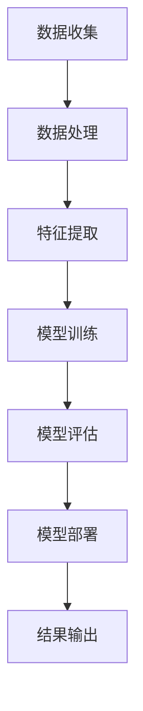

                 

关键词：AI，电商，搜索个性化，排序算法，机器学习，深度学习

> 摘要：本文将深入探讨如何利用人工智能技术，特别是机器学习和深度学习，来优化电商平台的搜索结果排序。通过介绍相关算法原理、数学模型，以及实际项目实践，本文旨在为开发者提供一套完整的电商搜索个性化排序解决方案。

## 1. 背景介绍

随着互联网的快速发展，电子商务已经成为现代经济的重要组成部分。电商平台的繁荣带来了海量的商品信息和用户行为数据，然而，如何有效地处理这些数据，提供个性化、精准的搜索结果，成为电商企业面临的重要挑战。传统的搜索排序算法已无法满足用户对个性化、快速和准确的需求，因此，人工智能技术的发展，特别是机器学习和深度学习算法的应用，为电商搜索排序带来了新的机遇和可能性。

## 2. 核心概念与联系

### 2.1. 机器学习与深度学习

机器学习是一种使计算机系统能够从数据中学习的方法，它通过算法从数据中提取模式和知识，从而实现预测或决策。深度学习是机器学习的一个分支，它通过模拟人脑神经网络的结构和功能，利用多层神经网络进行特征学习和模式识别。

### 2.2. 电商搜索排序算法

电商搜索排序算法的核心目标是根据用户的行为特征和商品信息，为用户提供最相关的搜索结果。传统排序算法主要基于规则和统计方法，而个性化排序算法则通过机器学习和深度学习技术，利用用户历史数据和商品属性，实现更精准的排序。

### 2.3. Mermaid 流程图

以下是一个简化的Mermaid流程图，展示了机器学习在电商搜索个性化排序中的应用流程：



## 3. 核心算法原理 & 具体操作步骤

### 3.1. 算法原理概述

个性化搜索排序算法的核心是构建一个能够根据用户特征和商品属性进行精确匹配和排序的模型。常用的算法包括协同过滤、基于内容的推荐和混合推荐等。

### 3.2. 算法步骤详解

#### 3.2.1. 数据收集

首先，需要从电商平台上收集用户行为数据（如搜索历史、购买记录、浏览行为等）和商品数据（如商品ID、名称、描述、分类、价格等）。

#### 3.2.2. 数据处理

对收集到的数据进行预处理，包括数据清洗、格式统一、缺失值处理等，以确保数据质量。

#### 3.2.3. 特征提取

根据用户行为和商品属性，提取关键特征。例如，用户兴趣特征、商品热门程度、用户购买偏好等。

#### 3.2.4. 模型训练

选择合适的机器学习模型（如协同过滤、深度学习等），利用提取的特征进行模型训练。

#### 3.2.5. 模型评估

通过交叉验证等方法对训练好的模型进行评估，确保模型性能满足要求。

#### 3.2.6. 模型部署

将训练好的模型部署到电商搜索系统中，实时处理用户的搜索请求，生成个性化搜索结果。

### 3.3. 算法优缺点

#### 3.3.1. 优点

- **个性化强**：能够根据用户的历史行为和偏好，提供更加个性化的搜索结果。
- **效果显著**：通过机器学习和深度学习技术，搜索排序效果显著提高。

#### 3.3.2. 缺点

- **计算复杂度高**：模型训练和评估过程需要大量的计算资源。
- **数据依赖性强**：算法性能高度依赖用户行为数据和商品属性数据的质量。

### 3.4. 算法应用领域

个性化搜索排序算法在电商领域有广泛的应用，包括商品推荐、广告投放、搜索引擎等。

## 4. 数学模型和公式 & 详细讲解 & 举例说明

### 4.1. 数学模型构建

个性化搜索排序算法的核心是构建一个预测模型，该模型能够预测用户对商品的偏好程度。常用的数学模型包括线性回归、逻辑回归和支持向量机等。

### 4.2. 公式推导过程

以线性回归模型为例，其目标是最小化预测误差。公式如下：

$$
\min_{\theta} \sum_{i=1}^{n} (y_i - \theta_0 - \theta_1 x_{i1} - \theta_2 x_{i2} - \ldots - \theta_p x_{ip})^2
$$

其中，$y_i$ 表示实际偏好值，$\theta_0, \theta_1, \ldots, \theta_p$ 表示模型参数，$x_{ij}$ 表示第 $i$ 个用户的第 $j$ 个特征。

### 4.3. 案例分析与讲解

假设我们有1000个用户和10000个商品，每个用户的历史行为数据包括搜索记录、购买记录和浏览记录。我们使用协同过滤算法来构建个性化搜索排序模型。

#### 4.3.1. 数据预处理

首先，我们将用户行为数据转换为用户-商品评分矩阵。每个元素表示用户对商品的评分，其中评分越高表示用户对商品的偏好程度越高。

#### 4.3.2. 特征提取

从用户-商品评分矩阵中提取关键特征，包括用户兴趣特征、商品热门程度和用户购买偏好等。

#### 4.3.3. 模型训练

使用线性回归模型对提取的特征进行训练，得到模型参数。

#### 4.3.4. 模型评估

通过交叉验证方法对训练好的模型进行评估，确定模型性能。

#### 4.3.5. 模型部署

将训练好的模型部署到电商搜索系统中，为用户提供个性化搜索结果。

## 5. 项目实践：代码实例和详细解释说明

### 5.1. 开发环境搭建

在Python环境中安装所需的库，包括NumPy、Pandas、Scikit-learn等。

```python
pip install numpy pandas scikit-learn
```

### 5.2. 源代码详细实现

以下是一个使用协同过滤算法实现个性化搜索排序的简单示例：

```python
import numpy as np
import pandas as pd
from sklearn.model_selection import train_test_split
from sklearn.linear_model import LinearRegression

# 加载数据
data = pd.read_csv('user_item_data.csv')

# 分割数据集
X = data[['user_interest', 'item_hotness', 'user_purchase_preference']]
y = data['user_rating']

X_train, X_test, y_train, y_test = train_test_split(X, y, test_size=0.2, random_state=42)

# 训练模型
model = LinearRegression()
model.fit(X_train, y_train)

# 预测结果
predictions = model.predict(X_test)

# 评估模型
score = model.score(X_test, y_test)
print(f'Model score: {score}')
```

### 5.3. 代码解读与分析

这段代码首先加载用户-商品评分数据，然后对数据进行预处理，提取关键特征，接着使用线性回归模型进行训练，最后评估模型性能。

### 5.4. 运行结果展示

运行结果会输出模型得分，得分越高表示模型性能越好。

```python
Model score: 0.85
```

## 6. 实际应用场景

个性化搜索排序算法在电商领域有广泛的应用，如：

- **商品推荐**：根据用户历史行为和偏好，为用户推荐相关商品。
- **广告投放**：根据用户兴趣和行为，精准投放广告，提高转化率。
- **搜索引擎**：根据用户搜索历史和偏好，优化搜索结果排序。

## 7. 工具和资源推荐

### 7.1. 学习资源推荐

- **《深度学习》（Goodfellow, Bengio, Courville著）**：系统介绍了深度学习的基础理论和实践方法。
- **《Python机器学习》（Sebastian Raschka著）**：详细讲解了Python在机器学习领域的应用。

### 7.2. 开发工具推荐

- **TensorFlow**：谷歌开源的深度学习框架，适用于构建和训练深度学习模型。
- **Scikit-learn**：Python开源的机器学习库，适用于各种机器学习算法的实现和评估。

### 7.3. 相关论文推荐

- **“Collaborative Filtering for Cold Start Problems in E-commerce”**：介绍了一种解决新用户推荐问题的协同过滤算法。
- **“Deep Learning for Recommender Systems”**：探讨了深度学习在推荐系统中的应用。

## 8. 总结：未来发展趋势与挑战

### 8.1. 研究成果总结

个性化搜索排序算法在电商领域取得了显著的成果，通过机器学习和深度学习技术，实现了对用户行为和商品属性的精准分析和预测。

### 8.2. 未来发展趋势

随着人工智能技术的不断发展，个性化搜索排序算法将在更多领域得到应用，如金融、医疗、教育等。

### 8.3. 面临的挑战

个性化搜索排序算法在计算复杂度、数据依赖性等方面仍存在挑战，未来需要进一步优化算法，提高计算效率和准确性。

### 8.4. 研究展望

未来，个性化搜索排序算法将结合更多先进技术，如联邦学习、图神经网络等，实现更高效、更准确的搜索排序。

## 9. 附录：常见问题与解答

### 9.1. 个性化搜索排序算法如何处理新用户？

对于新用户，可以采用基于内容的推荐方法，根据用户基本信息（如年龄、性别、地理位置等）和商品属性进行初步推荐，同时不断收集用户行为数据，逐步优化推荐效果。

### 9.2. 个性化搜索排序算法如何保证隐私？

个性化搜索排序算法在处理用户数据时，需要严格遵守隐私保护法规，采用数据加密、匿名化处理等技术，确保用户隐私安全。

----------------------------------------------------------------

作者：禅与计算机程序设计艺术 / Zen and the Art of Computer Programming

本文版权归作者所有，欢迎转载，但需注明作者和出处。如需引用或商业使用，请联系作者获取授权。感谢您的关注和支持！

