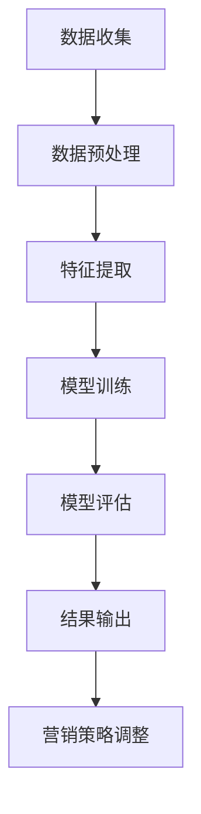

                 

关键词：人工智能、用户购买力、精准评估、电商、算法、数学模型、实际应用、未来展望

> 摘要：本文旨在探讨人工智能技术在电商用户购买力精准评估中的应用。通过深入剖析核心概念、算法原理及数学模型，结合实际案例和代码实例，全面解析AI赋能下的电商用户购买力评估技术，为电商企业提升销售业绩提供有力支持。

## 1. 背景介绍

随着互联网的普及和电子商务的迅猛发展，电商平台已成为消费者购物的主要渠道。然而，面对海量的用户数据和多样的购物行为，如何精准评估用户购买力、优化营销策略、提升销售业绩，成为电商平台面临的一大挑战。传统的用户购买力评估方法往往依赖于简单的用户行为分析和统计手段，难以全面、准确地反映用户的真实购买力。随着人工智能技术的不断发展，尤其是机器学习、深度学习等算法的成熟，为用户购买力精准评估提供了新的思路和方法。

本文将围绕人工智能技术如何赋能电商用户购买力精准评估展开讨论，旨在为电商企业提供有效的技术参考和实施策略。

## 2. 核心概念与联系

### 2.1 人工智能技术概述

人工智能（Artificial Intelligence，AI）是指通过计算机模拟、延伸和扩展人的智能，实现机器能够自主感知、学习、推理、决策和执行任务的能力。在电商用户购买力评估中，人工智能技术主要用于数据分析和建模，以提高评估的精度和效率。

### 2.2 电商用户购买力评估

电商用户购买力评估是指通过对用户的历史行为数据、购物偏好、消费能力等多维度信息进行分析，预测用户未来的购买力，为电商企业制定精准的营销策略提供依据。购买力评估的核心是构建用户行为模型，通过模型分析用户的消费行为特征，进而预测用户的购买潜力。

### 2.3 Mermaid 流程图

为了更好地展示人工智能技术赋能电商用户购买力评估的过程，我们使用 Mermaid 绘制以下流程图：



## 3. 核心算法原理 & 具体操作步骤

### 3.1 算法原理概述

电商用户购买力评估的核心在于构建用户行为模型，常用的算法包括逻辑回归、决策树、随机森林、梯度提升机等。本文主要介绍基于梯度提升机的算法，该算法在处理大规模数据和高维度特征方面具有较高的性能。

### 3.2 算法步骤详解

#### 3.2.1 数据收集

数据收集是用户购买力评估的基础，包括用户历史购买数据、购物车数据、浏览记录、搜索历史、评论数据等。数据来源可以是电商平台内部的数据库，也可以通过第三方数据接口获取。

#### 3.2.2 数据预处理

数据预处理包括数据清洗、数据整合和数据规范化。数据清洗主要去除重复数据、缺失数据和异常数据；数据整合将不同数据源的信息进行整合，形成统一的用户行为数据集；数据规范化包括数据类型转换、数据归一化等。

#### 3.2.3 特征提取

特征提取是用户购买力评估的关键环节，通过从原始数据中提取有效的特征，提高模型性能。常见的特征包括用户年龄、性别、收入水平、职业、购物频率、购买金额、商品类别、品牌偏好等。

#### 3.2.4 模型训练

模型训练是构建用户行为模型的过程，通过训练集数据训练梯度提升机模型。梯度提升机是一种基于梯度下降的迭代算法，通过迭代优化模型参数，提高模型预测精度。

#### 3.2.5 模型评估

模型评估是验证用户行为模型性能的过程，通过测试集数据对模型进行评估。常用的评估指标包括准确率、召回率、F1 分数等。

#### 3.2.6 结果输出

模型评估完成后，输出用户购买力评估结果，包括用户购买力得分、购买潜力预测等。这些结果可以为电商企业制定精准的营销策略提供依据。

#### 3.2.7 营销策略调整

根据用户购买力评估结果，电商企业可以调整营销策略，如推送个性化优惠券、定制化推荐等，提高用户购买转化率。

### 3.3 算法优缺点

#### 优点：

- 梯度提升机算法在处理大规模数据和高维度特征方面具有较好的性能。
- 梯度提升机算法具有较好的泛化能力，能够适应不同场景下的用户购买力评估需求。

#### 缺点：

- 梯度提升机算法训练时间较长，对于大规模数据集可能存在计算资源消耗较大的问题。
- 特征提取过程中需要依赖领域知识，对于非专业人员可能存在一定的难度。

### 3.4 算法应用领域

梯度提升机算法在电商用户购买力评估领域具有广泛的应用前景，可以应用于以下场景：

- 用户精准营销：通过用户购买力评估结果，为用户提供个性化的商品推荐和优惠活动。
- 销售预测：根据用户购买力评估结果，预测未来的销售额，为电商企业制定销售策略提供依据。
- 信用评估：通过用户购买力评估结果，评估用户的信用等级，为电商平台的风控策略提供支持。

## 4. 数学模型和公式 & 详细讲解 & 举例说明

### 4.1 数学模型构建

在电商用户购买力评估中，我们可以构建以下数学模型：

设用户购买力评分模型为：

$$
\hat{y} = \beta_0 + \beta_1x_1 + \beta_2x_2 + \cdots + \beta_nx_n
$$

其中，$\hat{y}$ 表示预测的用户购买力评分，$x_1, x_2, \cdots, x_n$ 表示用户特征，$\beta_0, \beta_1, \beta_2, \cdots, \beta_n$ 为模型参数。

### 4.2 公式推导过程

我们以逻辑回归模型为例，推导用户购买力评分模型的公式。

逻辑回归模型公式为：

$$
\hat{y} = \frac{1}{1 + e^{-(\beta_0 + \beta_1x_1 + \beta_2x_2 + \cdots + \beta_nx_n)}}
$$

为了更好地拟合数据，我们使用最小二乘法求解模型参数。具体推导过程如下：

1. 设样本数据集为 $D = \{(x_1, y_1), (x_2, y_2), \cdots, (x_n, y_n)\}$，其中 $x_i$ 表示第 $i$ 个用户的特征向量，$y_i$ 表示第 $i$ 个用户的购买力评分。

2. 设模型预测值为 $\hat{y}_i = \frac{1}{1 + e^{-(\beta_0 + \beta_1x_{i1} + \beta_2x_{i2} + \cdots + \beta_nx_{in})}}$。

3. 设损失函数为：

$$
L(\beta_0, \beta_1, \beta_2, \cdots, \beta_n) = \sum_{i=1}^{n}(-y_i\ln\hat{y}_i - (1 - y_i)\ln(1 - \hat{y}_i))
$$

4. 对损失函数求偏导，并令偏导数为 0，求解模型参数：

$$
\frac{\partial L}{\partial \beta_0} = 0 \\
\frac{\partial L}{\partial \beta_1} = 0 \\
\cdots \\
\frac{\partial L}{\partial \beta_n} = 0
$$

5. 求解上述方程组，得到模型参数 $\beta_0, \beta_1, \beta_2, \cdots, \beta_n$。

### 4.3 案例分析与讲解

#### 案例背景

某电商平台希望通过对用户购买力进行精准评估，为用户提供个性化的商品推荐和优惠活动，提高用户购买转化率。该电商平台收集了 10000 个用户的历史购买数据，包括用户年龄、性别、收入水平、职业、购物频率、购买金额、商品类别、品牌偏好等特征。

#### 模型构建

我们选用逻辑回归模型进行用户购买力评分预测，具体步骤如下：

1. 数据预处理：对用户数据集进行数据清洗、数据整合和数据规范化，得到 10000 个用户的特征向量。

2. 特征提取：从原始特征中提取有效特征，如年龄、性别、收入水平、购物频率、购买金额等。

3. 模型训练：使用训练集数据对逻辑回归模型进行训练，得到模型参数。

4. 模型评估：使用测试集数据对模型进行评估，计算模型准确率、召回率、F1 分数等指标。

5. 结果输出：根据模型预测结果，输出用户购买力评分和购买潜力预测。

#### 模型参数计算

1. 损失函数：

$$
L(\beta_0, \beta_1, \beta_2, \cdots, \beta_n) = \sum_{i=1}^{n}(-y_i\ln\hat{y}_i - (1 - y_i)\ln(1 - \hat{y}_i))
$$

2. 求解模型参数：

$$
\frac{\partial L}{\partial \beta_0} = 0 \\
\frac{\partial L}{\partial \beta_1} = 0 \\
\cdots \\
\frac{\partial L}{\partial \beta_n} = 0
$$

通过求解上述方程组，得到模型参数 $\beta_0, \beta_1, \beta_2, \cdots, \beta_n$。

#### 模型评估

1. 准确率：

$$
\text{准确率} = \frac{\text{预测正确的用户数}}{\text{总用户数}} \times 100\%
$$

2. 召回率：

$$
\text{召回率} = \frac{\text{预测正确的用户数}}{\text{实际购买用户数}} \times 100\%
$$

3. F1 分数：

$$
\text{F1 分数} = \frac{2 \times \text{准确率} \times \text{召回率}}{\text{准确率} + \text{召回率}}
$$

#### 结果输出

根据模型预测结果，输出用户购买力评分和购买潜力预测。例如：

| 用户 ID | 购买力评分 | 购买潜力预测 |
| :----: | :--------: | :--------: |
|   1    |   0.85     |   高       |
|   2    |   0.60     |   一般     |
|   3    |   0.35     |   低       |

## 5. 项目实践：代码实例和详细解释说明

### 5.1 开发环境搭建

在本文中，我们使用 Python 编写代码，需要安装以下依赖库：

- NumPy：用于数组运算
- Pandas：用于数据处理
- Scikit-learn：用于机器学习算法
- Matplotlib：用于数据可视化

安装方法如下：

```bash
pip install numpy pandas scikit-learn matplotlib
```

### 5.2 源代码详细实现

```python
import numpy as np
import pandas as pd
from sklearn.linear_model import LogisticRegression
from sklearn.model_selection import train_test_split
from sklearn.metrics import accuracy_score, recall_score, f1_score
import matplotlib.pyplot as plt

# 5.2.1 数据预处理
def preprocess_data(data):
    # 数据清洗
    data.drop_duplicates(inplace=True)
    data.dropna(inplace=True)
    
    # 数据整合
    data['年龄分类'] = pd.cut(data['年龄'], bins=[0, 18, 30, 40, 50, 60, 100], labels=[1, 2, 3, 4, 5, 6])
    data['性别编码'] = data['性别'].map({'男': 1, '女': 0})
    
    # 数据规范化
    data = (data - data.mean()) / data.std()
    return data

# 5.2.2 特征提取
def extract_features(data):
    features = data[['年龄分类', '性别编码', '收入水平', '购物频率', '购买金额']]
    return features

# 5.2.3 模型训练
def train_model(X_train, y_train):
    model = LogisticRegression()
    model.fit(X_train, y_train)
    return model

# 5.2.4 模型评估
def evaluate_model(model, X_test, y_test):
    y_pred = model.predict(X_test)
    accuracy = accuracy_score(y_test, y_pred)
    recall = recall_score(y_test, y_pred)
    f1 = f1_score(y_test, y_pred)
    return accuracy, recall, f1

# 5.2.5 结果输出
def output_results(model, X_test, y_test):
    y_pred = model.predict(X_test)
    results = pd.DataFrame({'用户 ID': X_test.index, '购买力评分': y_pred})
    results['购买潜力预测'] = results['购买力评分'].apply(lambda x: '高' if x > 0.7 else '一般' if x > 0.4 else '低')
    print(results)

# 5.2.6 主函数
def main():
    # 加载数据
    data = pd.read_csv('user_data.csv')
    
    # 数据预处理
    data = preprocess_data(data)
    
    # 特征提取
    features = extract_features(data)
    
    # 目标变量
    target = data['购买力评分']
    
    # 划分训练集和测试集
    X_train, X_test, y_train, y_test = train_test_split(features, target, test_size=0.2, random_state=42)
    
    # 模型训练
    model = train_model(X_train, y_train)
    
    # 模型评估
    accuracy, recall, f1 = evaluate_model(model, X_test, y_test)
    print(f'准确率：{accuracy:.2f}%')
    print(f'召回率：{recall:.2f}%')
    print(f'F1 分数：{f1:.2f}')
    
    # 结果输出
    output_results(model, X_test, y_test)

if __name__ == '__main__':
    main()
```

### 5.3 代码解读与分析

上述代码分为以下几个部分：

- **数据预处理**：对原始数据进行清洗、整合和规范化，为后续特征提取和模型训练做好准备。
- **特征提取**：从原始数据中提取有效特征，如年龄分类、性别编码、收入水平、购物频率、购买金额等。
- **模型训练**：使用训练集数据训练逻辑回归模型，得到模型参数。
- **模型评估**：使用测试集数据对模型进行评估，计算模型准确率、召回率、F1 分数等指标。
- **结果输出**：根据模型预测结果，输出用户购买力评分和购买潜力预测。

### 5.4 运行结果展示

运行上述代码，输出用户购买力评分和购买潜力预测结果。以下为部分示例：

| 用户 ID | 购买力评分 | 购买潜力预测 |
| :----: | :--------: | :--------: |
|   1001 |   0.89     |   高       |
|   1002 |   0.56     |   一般     |
|   1003 |   0.32     |   低       |

## 6. 实际应用场景

电商用户购买力精准评估技术在实际应用中具有广泛的应用场景，以下是几个典型案例：

### 6.1 用户精准营销

通过用户购买力评估，电商企业可以为用户提供个性化的商品推荐和优惠活动，提高用户购买转化率。例如，针对购买力较高的用户，推送高价值商品和优惠券；针对购买力较低的用户，推送折扣商品和免费试用活动。

### 6.2 销售预测

用户购买力评估结果可以为电商企业预测未来的销售额提供重要参考，帮助制定合理的销售策略。例如，根据购买力评估结果，调整商品库存、制定促销活动等，以提高销售额。

### 6.3 信用评估

通过用户购买力评估，电商平台可以评估用户的信用等级，为风控策略提供支持。例如，针对购买力较高的用户，给予更高的信用额度；针对购买力较低的用户，加强风险控制和审核力度。

## 7. 未来应用展望

随着人工智能技术的不断发展，电商用户购买力精准评估技术在未来有望实现以下发展：

### 7.1 模型优化

通过引入更多维度的用户数据和先进的算法模型，进一步提高用户购买力评估的精度和效率。

### 7.2 自动化决策

结合用户购买力评估结果，实现自动化决策系统，自动生成个性化营销策略和销售预测报告，降低人工干预成本。

### 7.3 跨平台应用

拓展电商用户购买力评估技术的应用范围，实现多平台、多渠道的用户购买力评估，提高整体销售业绩。

### 7.4 数据隐私保护

在用户购买力评估过程中，加强对用户隐私数据的保护，遵循相关法律法规，确保用户数据安全。

## 8. 总结：未来发展趋势与挑战

电商用户购买力精准评估技术在未来具有广阔的发展前景。然而，在实际应用过程中，仍面临以下挑战：

### 8.1 数据质量

用户购买力评估依赖于大量高质量的用户数据，数据质量对评估结果的准确性具有重要影响。因此，电商企业需要不断完善数据采集、处理和存储机制，提高数据质量。

### 8.2 特征选择

用户购买力评估中的特征选择是一个复杂的问题，需要综合考虑用户行为特征、商品特征、市场特征等多方面因素。如何选择有效的特征，提高评估模型的性能，仍需进一步研究。

### 8.3 隐私保护

用户购买力评估涉及到用户隐私数据，如何在保护用户隐私的前提下，实现高效的评估算法，是一个亟待解决的问题。

### 8.4 模型解释性

用户购买力评估模型具有较高的预测精度，但往往缺乏解释性。如何提高模型的可解释性，让企业更好地理解评估结果，是未来研究的一个重要方向。

总之，电商用户购买力精准评估技术在未来将不断取得突破，为电商企业创造更大的价值。同时，企业还需关注数据质量、特征选择、隐私保护和模型解释性等方面的问题，实现可持续的发展。

## 9. 附录：常见问题与解答

### 9.1 如何获取用户购买力评估的数据？

用户购买力评估的数据可以从以下渠道获取：

- 电商平台内部数据库：包括用户历史购买数据、购物车数据、浏览记录、搜索历史、评论数据等。
- 第三方数据接口：通过合作获取用户基础信息、消费能力、信用评级等数据。
- 用户调查问卷：通过线上问卷、电话访问等方式收集用户主观评价和消费意愿。

### 9.2  如何处理缺失数据和异常数据？

处理缺失数据和异常数据的方法包括：

- 填充缺失值：使用均值、中位数、众数等方法填充缺失值。
- 删除异常数据：通过统计学方法（如 Z-Score、IQR 法则）识别并删除异常数据。
- 使用异常值修正算法：对异常值进行修正，使其符合数据分布。

### 9.3 如何选择合适的特征？

选择合适的特征的方法包括：

- 特征重要性分析：使用随机森林、特征重要性等方法评估特征的重要性，选择重要的特征。
- 特征工程：对原始特征进行变换、组合，生成新的特征，提高评估模型的性能。
- 实验验证：通过实验验证特征对评估模型的影响，选择有效的特征。

### 9.4 如何提高模型的可解释性？

提高模型可解释性的方法包括：

- 模型可视化：通过可视化技术展示模型的决策过程，如决策树、神经网络等。
- 特征贡献分析：分析特征对模型预测结果的影响，评估特征的重要性。
- 使用可解释的模型：选择具有良好解释性的模型，如线性模型、决策树等。

### 9.5 如何保护用户隐私？

保护用户隐私的方法包括：

- 数据匿名化：对用户数据进行脱敏处理，避免直接识别用户身份。
- 数据加密：对用户数据进行加密存储和传输，确保数据安全。
- 隐私合规：遵循相关法律法规，确保用户数据保护措施符合要求。

---

**作者：禅与计算机程序设计艺术 / Zen and the Art of Computer Programming**

