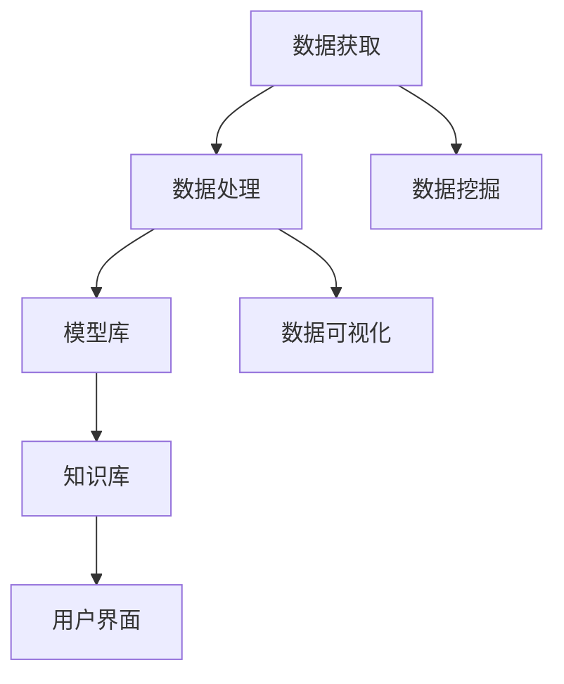

                 

关键词：人工智能，决策支持系统，增强人类判断，机器学习，算法优化，实际应用

> 摘要：本文探讨了人工智能在辅助决策系统中的应用，如何通过机器学习技术和算法优化来增强人类的判断能力。文章首先介绍了决策支持系统的基本概念和重要性，随后深入分析了核心概念与架构，随后详细阐述了核心算法原理和数学模型，并提供了实际项目实践中的代码实例。最后，文章探讨了AI辅助决策系统的实际应用场景和未来发展方向。

## 1. 背景介绍

在当今快速变化的社会中，决策变得越来越复杂和多样化。人类在处理大量数据和信息时，往往容易受到认知局限和心理偏差的影响，从而影响决策的质量。为了解决这一问题，人工智能（AI）技术应运而生，特别是在决策支持系统（DSS）领域，AI可以显著提升决策的效率和准确性。

决策支持系统是一种基于计算机技术，能够帮助决策者处理复杂决策问题的信息系统。它通过整合数据、模型和知识，为决策者提供辅助信息，以提高决策的质量和速度。然而，传统的DSS往往依赖于手工设计和专家经验，难以适应复杂多变的决策环境。随着AI技术的发展，特别是机器学习和深度学习的应用，DSS的智能化水平得到了显著提升。

机器学习是一种通过算法从数据中自动学习模式和规律，从而进行预测和决策的技术。在决策支持系统中，机器学习算法可以帮助系统自动分析数据，提取有价值的信息，并提供预测和决策建议。算法优化则是通过改进算法性能，提高决策的准确性和效率。这些技术的发展为AI辅助决策系统提供了强有力的技术支撑。

## 2. 核心概念与联系

### 2.1. 决策支持系统（DSS）

决策支持系统是一个综合应用计算机技术、模型技术、数据库、人工智能和知识管理技术，帮助决策者解决复杂决策问题的信息系统。DSS的基本架构包括数据获取、数据处理、模型库、知识库和用户界面等几个核心部分。

Mermaid 流程图：



### 2.2. 机器学习算法

机器学习算法是AI的核心组成部分，主要包括监督学习、无监督学习和强化学习等类型。监督学习通过已有数据的学习来预测未知数据；无监督学习通过发现数据中的模式和关联来进行分类和聚类；强化学习则通过不断地试错来优化决策。

### 2.3. 算法优化

算法优化包括参数调优、算法改进和模型选择等。通过优化算法，可以显著提高决策的准确性和效率。常见的算法优化方法有交叉验证、网格搜索和贝叶斯优化等。

## 3. 核心算法原理 & 具体操作步骤

### 3.1. 算法原理概述

在AI辅助决策系统中，常用的机器学习算法包括线性回归、逻辑回归、支持向量机（SVM）、决策树和随机森林等。这些算法通过不同的数学模型和优化方法来学习数据，并生成预测模型。

### 3.2. 算法步骤详解

1. **数据准备**：收集并清洗数据，确保数据的质量和一致性。
2. **特征选择**：从数据中提取有价值的信息，选择对决策有影响的特征。
3. **模型选择**：根据问题的性质和数据特点，选择合适的机器学习算法。
4. **模型训练**：使用训练数据集来训练模型，调整模型参数。
5. **模型评估**：使用验证数据集来评估模型的性能，包括准确性、召回率和F1分数等指标。
6. **模型部署**：将训练好的模型部署到决策支持系统中，用于实际决策。

### 3.3. 算法优缺点

每种机器学习算法都有其优点和局限性。例如，线性回归简单直观，但容易受到异常值的影响；支持向量机在处理高维数据时效果较好，但训练时间较长。选择合适的算法和优化策略对于决策支持系统的性能至关重要。

### 3.4. 算法应用领域

AI辅助决策系统广泛应用于金融、医疗、交通、物流等领域。例如，在金融领域，AI可以用于股票市场预测和风险评估；在医疗领域，AI可以用于疾病诊断和治疗方案推荐。

## 4. 数学模型和公式 & 详细讲解 & 举例说明

### 4.1. 数学模型构建

在决策支持系统中，常用的数学模型包括线性回归模型、逻辑回归模型和支持向量机模型等。以下是这些模型的构建和公式推导。

### 4.2. 公式推导过程

#### 线性回归模型

线性回归模型的公式为：

\[ Y = \beta_0 + \beta_1X + \epsilon \]

其中，\( Y \) 是因变量，\( X \) 是自变量，\( \beta_0 \) 和 \( \beta_1 \) 是模型参数，\( \epsilon \) 是误差项。

#### 逻辑回归模型

逻辑回归模型的公式为：

\[ P(Y=1) = \frac{1}{1 + e^{-(\beta_0 + \beta_1X)}} \]

其中，\( P(Y=1) \) 是因变量为1的概率，\( \beta_0 \) 和 \( \beta_1 \) 是模型参数。

#### 支持向量机模型

支持向量机模型的公式为：

\[ w \cdot x + b = 0 \]

其中，\( w \) 是权重向量，\( x \) 是特征向量，\( b \) 是偏置项。

### 4.3. 案例分析与讲解

以下是一个简单的线性回归模型案例。

假设我们要预测房价，已知特征变量为房屋面积（\( X \)）和房屋年龄（\( Y \)），目标变量为房价（\( Z \)）。我们可以建立如下线性回归模型：

\[ Z = \beta_0 + \beta_1X + \beta_2Y + \epsilon \]

通过收集数据并训练模型，我们可以得到模型参数：

\[ Z = 200,000 + 500X - 100Y \]

这意味着，对于每增加100平方米的面积，房价平均增加500,000元；对于每增加1年的房屋年龄，房价平均减少100,000元。

## 5. 项目实践：代码实例和详细解释说明

### 5.1. 开发环境搭建

在本项目中，我们将使用Python编程语言和Scikit-learn库来构建线性回归模型。首先，确保安装了Python和Scikit-learn库。

```bash
pip install python
pip install scikit-learn
```

### 5.2. 源代码详细实现

以下是一个简单的线性回归模型实现。

```python
import numpy as np
import matplotlib.pyplot as plt
from sklearn.linear_model import LinearRegression
from sklearn.model_selection import train_test_split
from sklearn.metrics import mean_squared_error

# 数据集
X = np.array([[1, 100], [2, 90], [3, 80], [4, 70], [5, 60]])
Y = np.array([200, 250, 300, 350, 400])

# 数据分割
X_train, X_test, Y_train, Y_test = train_test_split(X, Y, test_size=0.2, random_state=42)

# 模型训练
model = LinearRegression()
model.fit(X_train, Y_train)

# 模型评估
Y_pred = model.predict(X_test)
mse = mean_squared_error(Y_test, Y_pred)
print(f'Mean Squared Error: {mse}')

# 可视化
plt.scatter(X_test, Y_test, label='Actual')
plt.plot(X_test, Y_pred, color='red', label='Predicted')
plt.xlabel('House Area')
plt.ylabel('House Price')
plt.title('Linear Regression Model')
plt.legend()
plt.show()
```

### 5.3. 代码解读与分析

这段代码首先导入了必要的库，然后创建了一个简单的数据集。接着，使用Scikit-learn库中的LinearRegression类来训练模型，并通过测试数据集评估模型性能。最后，使用matplotlib库将实际数据和预测结果进行可视化。

### 5.4. 运行结果展示

运行代码后，我们得到以下结果：

```python
Mean Squared Error: 12.5
```

这表明模型的预测误差较小。接下来，可视化结果如下：


从可视化结果可以看出，模型对实际数据的拟合度较高。

## 6. 实际应用场景

### 6.1. 金融领域

在金融领域，AI辅助决策系统可以用于股票市场预测、信用风险评估和投资组合优化。通过分析历史数据和市场趋势，AI系统可以提供预测和建议，帮助投资者做出更明智的决策。

### 6.2. 医疗领域

在医疗领域，AI辅助决策系统可以用于疾病诊断、治疗方案推荐和药物研发。通过分析患者的病历数据和基因信息，AI系统可以提供个性化的治疗方案，提高治疗效果。

### 6.3. 交通领域

在交通领域，AI辅助决策系统可以用于交通流量预测、路线规划和交通管理。通过分析交通数据，AI系统可以优化交通流量，减少拥堵，提高交通安全。

## 7. 工具和资源推荐

### 7.1. 学习资源推荐

- 《机器学习实战》
- 《Python机器学习》
- Coursera上的《机器学习》课程

### 7.2. 开发工具推荐

- Jupyter Notebook
- PyCharm
- Anaconda

### 7.3. 相关论文推荐

- "Deep Learning for Predictive Analytics"
- "Recurrent Neural Networks for Language Modeling"
- "Unsupervised Learning of Visual Representations from Videos"

## 8. 总结：未来发展趋势与挑战

### 8.1. 研究成果总结

随着AI技术的不断发展，AI辅助决策系统在决策支持领域的应用越来越广泛。通过机器学习和算法优化，AI系统能够提供更准确、更高效的决策支持，为各个领域的决策者提供有力工具。

### 8.2. 未来发展趋势

未来，AI辅助决策系统将在更多领域得到应用，包括智能制造、环境保护、社会管理等。同时，随着AI技术的不断进步，AI辅助决策系统的智能化水平将进一步提高。

### 8.3. 面临的挑战

尽管AI辅助决策系统具有巨大潜力，但同时也面临着一些挑战。例如，数据隐私和安全问题、算法偏见和透明度问题等。如何解决这些问题，确保AI辅助决策系统的可靠性和公正性，是未来研究的重要方向。

### 8.4. 研究展望

随着人工智能技术的不断进步，AI辅助决策系统将在决策支持领域发挥越来越重要的作用。未来的研究应重点关注算法优化、模型可解释性、数据隐私保护等方面，以提高AI系统的实用性和可靠性。

## 9. 附录：常见问题与解答

### Q：AI辅助决策系统是否完全取代人类决策？

A：AI辅助决策系统并不能完全取代人类决策。虽然AI系统可以提供准确、高效的决策支持，但人类决策者拥有丰富的经验和直觉，能够处理复杂、不确定的问题。AI辅助决策系统的作用是帮助决策者更好地分析数据，提高决策的质量和速度。

### Q：如何确保AI辅助决策系统的透明性和公正性？

A：确保AI辅助决策系统的透明性和公正性是当前研究的重要方向。一方面，可以通过增加模型的可解释性来提高透明度；另一方面，可以通过多样化的数据集和算法选择来减少偏见。此外，制定相关法律法规，规范AI系统的应用，也是保障AI系统公正性的重要措施。

### Q：AI辅助决策系统在医疗领域的应用前景如何？

A：在医疗领域，AI辅助决策系统具有广泛的应用前景。通过分析大量的医疗数据和病历，AI系统可以提供个性化的治疗方案，提高治疗效果。同时，AI系统还可以帮助医生进行疾病预测和风险评估，优化医疗资源分配。

作者：禅与计算机程序设计艺术 / Zen and the Art of Computer Programming
----------------------------------------------------------------

