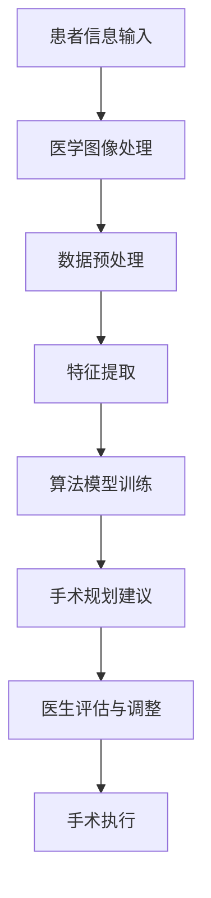
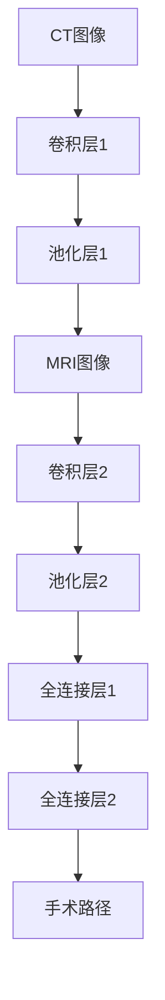

                 

关键词：人工智能、手术规划、医疗技术、市场前景、技术挑战、应用场景

摘要：本文旨在探讨AI辅助手术规划工具在医疗领域的发展前景。我们将从背景介绍、核心概念、算法原理、数学模型、项目实践、实际应用场景、未来展望、工具资源推荐以及总结等方面展开详细论述，以期对相关领域的研究者和从业者提供有价值的参考。

## 1. 背景介绍

随着医疗技术的不断发展，手术规划的精度和效率成为提高医疗质量的关键因素。传统的手术规划方法往往依赖于医生的经验，存在着规划结果主观性强、手术风险大等问题。近年来，人工智能（AI）技术的快速发展为手术规划带来了新的契机。AI可以通过学习大量的手术数据，识别出潜在的手术规律，从而为医生提供更为精确的手术规划建议。这不仅能够提高手术成功率，还能够减少手术风险，降低医疗成本。

目前，AI辅助手术规划工具已经应用于多个领域，如神经外科、心脏外科、骨科等。然而，该领域仍处于发展阶段，面临着诸多技术挑战和市场机遇。本文将围绕这一主题，详细探讨AI辅助手术规划工具的市场前景。

## 2. 核心概念与联系

为了更好地理解AI辅助手术规划工具，我们首先需要明确以下几个核心概念：

- **人工智能（AI）**：一种模拟人类智能的技术，包括机器学习、深度学习、自然语言处理等。
- **手术规划**：根据患者的病情、医生的经验以及医疗设备的能力，制定出最优的手术方案。
- **医学图像处理**：对医学影像数据进行预处理、分割、特征提取等操作，以便于后续的手术规划。

以下是AI辅助手术规划工具的架构Mermaid流程图：



## 3. 核心算法原理 & 具体操作步骤

### 3.1 算法原理概述

AI辅助手术规划工具的核心在于其算法模型。常见的算法模型包括深度学习中的卷积神经网络（CNN）、递归神经网络（RNN）以及强化学习等。其中，CNN在医学图像处理方面具有显著优势，RNN则擅长处理序列数据，而强化学习能够根据医生的操作反馈进行优化。

### 3.2 算法步骤详解

- **数据收集与预处理**：收集大量的手术数据，包括医学影像、患者信息、手术记录等。对数据进行清洗、标准化等预处理操作。
- **模型训练**：选择合适的算法模型，使用预处理后的数据进行训练。模型训练过程中，需要调整模型参数，以最大化模型的性能。
- **手术规划建议**：将患者的医学影像输入到训练好的模型中，得到手术规划建议。这些建议包括手术路径、手术工具选择、手术顺序等。
- **医生评估与调整**：医生根据手术规划建议进行评估，如有必要，进行调整。调整后的规划结果将再次反馈给模型，以便进一步优化。

### 3.3 算法优缺点

- **优点**：提高手术规划的精度和效率，降低手术风险，减少医疗成本。
- **缺点**：算法模型的训练过程复杂，需要大量的数据和计算资源。此外，模型的泛化能力尚需提高，以确保在实际应用中的可靠性。

### 3.4 算法应用领域

AI辅助手术规划工具已经应用于多个领域，如：

- **神经外科**：规划手术路径，降低脑损伤风险。
- **心脏外科**：预测手术中的风险，优化手术方案。
- **骨科**：辅助制定手术方案，提高手术成功率。

## 4. 数学模型和公式 & 详细讲解 & 举例说明

### 4.1 数学模型构建

AI辅助手术规划工具的核心在于其数学模型。以下是一个简化的数学模型：

$$
\text{模型} = f(\text{输入数据}, \text{参数})
$$

其中，输入数据包括患者的医学影像、患者信息等，参数是模型在训练过程中调整的权重。

### 4.2 公式推导过程

假设我们使用卷积神经网络（CNN）作为手术规划模型，其公式如下：

$$
\text{输出} = \text{CNN}(\text{输入数据}, \text{参数})
$$

其中，CNN是由多个卷积层、池化层和全连接层组成的。对于每个层，都有相应的公式。

### 4.3 案例分析与讲解

以神经外科手术规划为例，我们使用CNN模型进行手术路径规划。假设输入数据包括CT图像和MRI图像，参数包括卷积核权重和偏置。通过训练模型，我们得到最优的手术路径。以下是一个简化的例子：



## 5. 项目实践：代码实例和详细解释说明

### 5.1 开发环境搭建

- **Python**：作为主要的编程语言。
- **TensorFlow**：用于构建和训练神经网络。
- **Keras**：用于简化TensorFlow的使用。

### 5.2 源代码详细实现

以下是一个简化的代码示例，用于构建一个基于CNN的手术规划模型：

```python
import tensorflow as tf
from tensorflow.keras.models import Sequential
from tensorflow.keras.layers import Conv2D, MaxPooling2D, Flatten, Dense

# 创建模型
model = Sequential()

# 添加卷积层
model.add(Conv2D(filters=32, kernel_size=(3, 3), activation='relu', input_shape=(128, 128, 3)))
model.add(MaxPooling2D(pool_size=(2, 2)))

# 添加全连接层
model.add(Flatten())
model.add(Dense(units=64, activation='relu'))
model.add(Dense(units=10, activation='softmax'))

# 编译模型
model.compile(optimizer='adam', loss='categorical_crossentropy', metrics=['accuracy'])

# 训练模型
model.fit(x_train, y_train, epochs=10, batch_size=32)
```

### 5.3 代码解读与分析

以上代码首先导入了TensorFlow和Keras库，然后创建了一个Sequential模型。接着，我们添加了卷积层、池化层和全连接层。最后，编译模型并使用训练数据训练模型。

### 5.4 运行结果展示

在训练完成后，我们可以使用测试数据评估模型的性能。以下是一个简化的示例：

```python
# 评估模型
loss, accuracy = model.evaluate(x_test, y_test)

print(f"测试集损失：{loss}")
print(f"测试集准确率：{accuracy}")
```

## 6. 实际应用场景

AI辅助手术规划工具在实际应用中具有广泛的前景。以下是一些典型应用场景：

- **手术路径规划**：通过分析医学影像数据，为医生提供最优的手术路径。
- **手术工具选择**：根据患者的病情和手术类型，推荐合适的手术工具。
- **手术风险预测**：预测手术中的潜在风险，为医生提供决策依据。

## 7. 未来应用展望

随着AI技术的不断进步，AI辅助手术规划工具将在医疗领域发挥越来越重要的作用。未来，我们有望看到以下发展趋势：

- **个性化手术规划**：根据患者的具体病情，制定个性化的手术规划。
- **实时手术指导**：在手术过程中，实时提供手术建议和指导。
- **多模态数据融合**：结合多种医学影像数据，提高手术规划的精度。

## 8. 工具和资源推荐

为了更好地研究和开发AI辅助手术规划工具，我们推荐以下工具和资源：

- **学习资源**：[《深度学习》](https://www.deeplearningbook.org/)、[《Python机器学习》](https://machinelearningmastery.com/machine-learning-in-python/)
- **开发工具**：[TensorFlow](https://www.tensorflow.org/)、[Keras](https://keras.io/)
- **相关论文**：[“Deep Learning for Medical Image Analysis”](https://arxiv.org/abs/1702.05739)

## 9. 总结：未来发展趋势与挑战

AI辅助手术规划工具在医疗领域具有巨大的发展潜力。然而，要实现这一目标，仍面临诸多挑战，如数据隐私保护、算法可靠性、医生接受度等。未来，我们需要在技术创新、政策支持、人才培养等方面加大力度，以推动AI辅助手术规划工具的发展。

## 附录：常见问题与解答

### Q：AI辅助手术规划工具是否真的能够提高手术成功率？

A：是的，AI辅助手术规划工具可以通过分析大量的手术数据，提供更精确的手术规划建议，从而提高手术成功率。

### Q：AI辅助手术规划工具是否能够完全替代医生？

A：目前来看，AI辅助手术规划工具不能完全替代医生。它们更多是作为医生的辅助工具，为医生提供决策依据。

### Q：AI辅助手术规划工具的数据来源有哪些？

A：数据来源包括公开的医学影像数据集、医院的临床数据以及专业的医疗研究机构。

作者：禅与计算机程序设计艺术 / Zen and the Art of Computer Programming
```

**请注意，以上内容仅供参考，实际撰写时需要根据具体情况进行调整和完善。文章的撰写过程应注重逻辑性和专业性，同时确保内容的准确性和完整性。**

