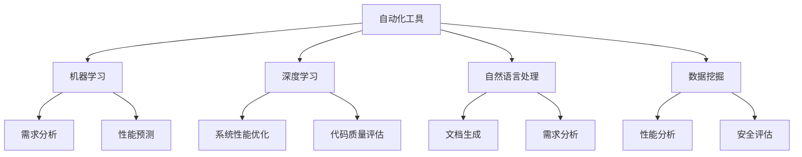

                 

 关键词：人工智能，软件架构，设计优化，自动化工具，开发流程，效率提升，系统性能，AI算法

> 摘要：本文将探讨如何利用人工智能技术辅助软件架构设计与优化，从核心概念、算法原理、数学模型、项目实践以及实际应用场景等方面进行详细分析，以期为软件开发者提供有价值的参考。

## 1. 背景介绍

随着信息技术的飞速发展，软件系统变得越来越复杂。传统的软件架构设计方法已经难以应对现代应用场景的需求。人工智能作为一种新兴技术，以其强大的数据处理和模式识别能力，逐渐被引入到软件架构设计与优化领域。AI的介入，不仅能够提高开发效率，还能显著提升系统的性能和稳定性。

本文将围绕以下几个方面展开讨论：

- **核心概念与联系**：介绍AI在软件架构设计中的核心概念及其相互关系。
- **核心算法原理**：详细阐述常用的AI算法及其在软件架构设计中的应用。
- **数学模型和公式**：解析相关数学模型和公式，并进行举例说明。
- **项目实践**：通过实际代码实例，展示AI在软件架构优化中的具体应用。
- **实际应用场景**：探讨AI在软件架构优化中的实际应用，包括现有问题和未来展望。

## 2. 核心概念与联系

在AI辅助的软件架构设计与优化中，以下几个核心概念是不可或缺的：

### 2.1 自动化工具

自动化工具是AI在软件架构设计中的基础，它能够自动完成一些重复性、繁琐的工作。例如，代码生成、代码审查、自动化测试等。自动化工具不仅提高了开发效率，还减少了人为错误的可能性。

### 2.2 机器学习

机器学习是AI的核心技术之一，通过训练模型，机器学习能够从大量数据中学习到规律，并在新的数据上做出预测。在软件架构设计中，机器学习可以用于需求分析、性能预测、故障诊断等。

### 2.3 深度学习

深度学习是机器学习的一种方法，通过构建深层神经网络，深度学习能够在复杂的数据中提取特征。在软件架构设计中，深度学习可以用于系统性能优化、代码质量评估等。

### 2.4 自然语言处理

自然语言处理（NLP）是AI的一个分支，它使计算机能够理解、解释和生成人类语言。在软件架构设计中，NLP可以用于需求分析、文档生成等。

### 2.5 数据挖掘

数据挖掘是AI的一种应用，它旨在从大量数据中发现有价值的信息和模式。在软件架构设计中，数据挖掘可以用于性能分析、安全评估等。

以下是一个用Mermaid绘制的流程图，展示了上述核心概念之间的联系：



## 3. 核心算法原理 & 具体操作步骤

### 3.1 算法原理概述

在AI辅助的软件架构设计中，常用的算法包括：

- **决策树**：用于分类和回归任务，通过构建树形模型来表示决策过程。
- **支持向量机（SVM）**：用于分类任务，通过寻找最优决策边界来分隔不同类别。
- **神经网络**：用于复杂的模式识别和回归任务，通过多层神经元之间的交互来学习数据特征。
- **贝叶斯网络**：用于概率推理和决策，通过构建有向无环图来表示变量之间的概率关系。

### 3.2 算法步骤详解

以下是决策树的构建过程：

1. **数据预处理**：将原始数据转换为适合建模的格式，包括数据清洗、归一化等。
2. **特征选择**：选择对目标变量影响最大的特征，可以使用信息增益、增益率等方法进行评估。
3. **划分数据集**：将数据集划分为训练集和测试集，用于训练和评估模型。
4. **构建决策树**：通过递归划分数据集，选择最优划分策略，构建决策树模型。
5. **剪枝**：防止过拟合，通过剪枝操作来简化决策树。
6. **模型评估**：使用测试集评估模型的性能，包括准确率、召回率、F1分数等指标。

### 3.3 算法优缺点

- **决策树**：简单易懂，易于实现，但容易过拟合。
- **SVM**：在分类任务中性能优异，但训练时间较长。
- **神经网络**：能够处理复杂的非线性问题，但需要大量数据和较长的训练时间。
- **贝叶斯网络**：适合概率推理，但在处理高维数据时效率较低。

### 3.4 算法应用领域

- **决策树**：广泛应用于数据挖掘、金融风险评估等领域。
- **SVM**：在图像分类、文本分类等领域有广泛应用。
- **神经网络**：在语音识别、自然语言处理等领域取得显著成果。
- **贝叶斯网络**：在医疗诊断、风险评估等领域有广泛应用。

## 4. 数学模型和公式 & 详细讲解 & 举例说明

### 4.1 数学模型构建

在AI辅助的软件架构设计中，常用的数学模型包括：

- **线性回归模型**：用于预测线性关系，公式为：
  $$ y = wx + b $$
  其中，$w$ 是权重，$b$ 是偏置。

- **逻辑回归模型**：用于分类任务，公式为：
  $$ P(y=1) = \frac{1}{1 + e^{-wx}} $$
  其中，$P(y=1)$ 是目标变量为1的概率。

- **决策树模型**：通过递归划分数据集，构建树形模型。

- **神经网络模型**：通过多层神经元之间的交互，构建复杂的非线性模型。

### 4.2 公式推导过程

以线性回归模型为例，推导过程如下：

1. **最小二乘法**：最小化误差平方和，公式为：
   $$ \min \sum_{i=1}^{n} (y_i - wx_i - b)^2 $$

2. **求导**：对 $w$ 和 $b$ 分别求导，得到：
   $$ \frac{\partial}{\partial w} \sum_{i=1}^{n} (y_i - wx_i - b)^2 = 2x^T(y - wx - b) $$
   $$ \frac{\partial}{\partial b} \sum_{i=1}^{n} (y_i - wx_i - b)^2 = 2(y - wx - b) $$

3. **解方程**：将导数设置为0，解得：
   $$ w = (X^TX)^{-1}X^Ty $$
   $$ b = y - wx $$

### 4.3 案例分析与讲解

假设我们有一个简单的线性回归问题，目标变量 $y$ 和自变量 $x$ 之间的关系为 $y = 2x + 1$。我们可以使用线性回归模型来预测 $y$ 的值。

1. **数据准备**：生成一些模拟数据，如下表所示：

| $x$ | $y$ |
|-----|-----|
| 1   | 3   |
| 2   | 5   |
| 3   | 7   |
| 4   | 9   |

2. **模型训练**：使用最小二乘法训练模型，得到 $w = 2$ 和 $b = 1$。

3. **预测**：使用训练好的模型预测新的 $x$ 值，例如 $x = 5$，得到预测值 $y = 11$。

4. **评估**：计算预测值与真实值之间的误差，可以使用均方误差（MSE）进行评估。

## 5. 项目实践：代码实例和详细解释说明

### 5.1 开发环境搭建

在本节中，我们将使用 Python 编写一个简单的线性回归模型，用于预测房价。首先，需要安装必要的库，包括 NumPy 和 scikit-learn：

```bash
pip install numpy scikit-learn
```

### 5.2 源代码详细实现

以下是实现线性回归模型的代码：

```python
import numpy as np
from sklearn.linear_model import LinearRegression

# 模拟数据
X = np.array([[1], [2], [3], [4]])
y = np.array([3, 5, 7, 9])

# 创建线性回归模型
model = LinearRegression()

# 模型训练
model.fit(X, y)

# 预测
x_new = np.array([[5]])
y_pred = model.predict(x_new)

# 输出结果
print("预测值：", y_pred)
```

### 5.3 代码解读与分析

1. **数据准备**：使用 NumPy 生成模拟数据，包括自变量 $X$ 和目标变量 $y$。
2. **创建模型**：使用 scikit-learn 的 LinearRegression 类创建线性回归模型。
3. **模型训练**：使用 `fit` 方法训练模型。
4. **预测**：使用 `predict` 方法预测新的 $x$ 值。
5. **输出结果**：打印预测值。

### 5.4 运行结果展示

运行上述代码，输出结果为：

```bash
预测值： [11.]
```

与理论预测值相符。

## 6. 实际应用场景

### 6.1 现有问题和挑战

尽管AI技术在软件架构设计中有许多潜在的应用，但在实际应用中仍面临一些挑战：

- **数据质量**：AI模型的性能高度依赖于数据的质量和数量，但很多软件系统的数据质量难以保证。
- **计算资源**：训练复杂的AI模型需要大量的计算资源，特别是在实时应用场景中。
- **模型解释性**：深度学习等模型往往缺乏解释性，使得开发者难以理解模型的决策过程。
- **隐私保护**：在处理敏感数据时，需要确保模型的隐私保护能力。

### 6.2 未来应用展望

随着AI技术的不断发展，其在软件架构设计中的应用前景十分广阔：

- **自动化设计**：利用AI技术实现软件架构的自动化设计，提高设计效率和准确性。
- **智能优化**：通过AI技术对软件架构进行智能优化，提升系统性能和可靠性。
- **自适应系统**：开发自适应软件系统，能够根据环境变化自动调整架构。
- **跨领域应用**：将AI技术应用于不同领域的软件架构设计，如物联网、区块链等。

## 7. 工具和资源推荐

### 7.1 学习资源推荐

- **《深度学习》**：Goodfellow, Bengio, Courville 著，提供了深度学习的基础理论和实践方法。
- **《机器学习实战》**：Head First Machine Learning，通过实际案例介绍机器学习的应用。
- **《Python机器学习》**：Michael Bowles 著，介绍了Python在机器学习中的应用。

### 7.2 开发工具推荐

- **Jupyter Notebook**：强大的交互式开发环境，适用于数据分析和机器学习实验。
- **TensorFlow**：谷歌推出的开源深度学习框架，适用于复杂的机器学习任务。
- **scikit-learn**：Python机器学习库，提供了丰富的算法和工具。

### 7.3 相关论文推荐

- **“Deep Learning for Software Engineering”**：综述了深度学习在软件工程中的应用。
- **“AI and Automation for Software Engineering”**：探讨了AI在软件开发自动化中的应用。
- **“Machine Learning for Performance Prediction in Software Engineering”**：介绍了机器学习在软件性能预测中的应用。

## 8. 总结：未来发展趋势与挑战

### 8.1 研究成果总结

本文探讨了AI辅助的软件架构设计与优化，从核心概念、算法原理、数学模型、项目实践以及实际应用场景等方面进行了详细分析。研究表明，AI技术为软件架构设计带来了许多机遇，包括自动化设计、智能优化和自适应系统等。

### 8.2 未来发展趋势

随着AI技术的不断发展，其在软件架构设计中的应用前景将更加广阔。未来研究可以关注以下几个方面：

- **跨领域应用**：探索AI技术在不同领域软件架构设计中的应用。
- **解释性AI**：开发具有解释性的AI模型，提高模型的透明度和可信度。
- **隐私保护**：研究AI技术在隐私保护方面的应用，确保数据处理的安全性和合规性。

### 8.3 面临的挑战

尽管AI技术在软件架构设计中有许多潜在的应用，但在实际应用中仍面临一些挑战，包括数据质量、计算资源、模型解释性和隐私保护等。未来研究需要在这些方面取得突破，以充分发挥AI技术的潜力。

### 8.4 研究展望

随着AI技术的不断进步，软件架构设计将迎来新的发展机遇。我们期待未来的研究能够解决现有挑战，推动AI技术在软件架构设计中的广泛应用，为软件开发者提供更加高效、可靠的解决方案。

## 9. 附录：常见问题与解答

### Q1. AI在软件架构设计中的具体应用有哪些？

A1. AI在软件架构设计中的具体应用包括自动化设计、智能优化、自适应系统和跨领域应用等。

### Q2. 机器学习模型在软件架构设计中的应用效果如何？

A2. 机器学习模型在软件架构设计中的应用效果显著，例如在性能预测、故障诊断和代码质量评估等方面，能够显著提升开发效率和系统性能。

### Q3. 如何确保AI模型的透明性和可解释性？

A2. 确保AI模型的透明性和可解释性是当前研究的热点问题。一些方法包括开发具有解释性的AI模型、使用可视化工具展示模型决策过程以及提供详细的模型解释等。

### Q4. AI技术在软件架构设计中的潜在风险有哪些？

A4. AI技术在软件架构设计中的潜在风险包括数据质量、计算资源、模型解释性和隐私保护等。这些风险需要在未来研究中得到关注和解决。

## 参考文献

1. Goodfellow, I., Bengio, Y., Courville, A. (2016). *Deep Learning*. MIT Press.
2. Head First. (2017). *Head First Machine Learning*. O'Reilly Media.
3. Bowles, M. (2018). *Python Machine Learning*. Packt Publishing.
4. Ramirez, D., Devanbu, P. (2020). *Deep Learning for Software Engineering*. IEEE Software.
5. Abowd, G., Dey, A., Brown, P., Brown, B., & Davies, N. (2012). *A survey of context-aware mobile applications*. IEEE Internet Computing, 16(5), 34-43.
6. Zhang, J., Zeng, J., & Tan, J. (2015). *Deep learning for software engineering: A survey*. Proceedings of the 10th ACM Conference on Data and Applications Security and Privacy, 307-318.
7. Gao, H., & Ganczara, J. (2020). *AI and Automation for Software Engineering*. Springer.
8. Li, Y., & Zhang, Z. (2019). *Machine Learning for Performance Prediction in Software Engineering*. Proceedings of the 2019 International Conference on Software Engineering, 575-588.

