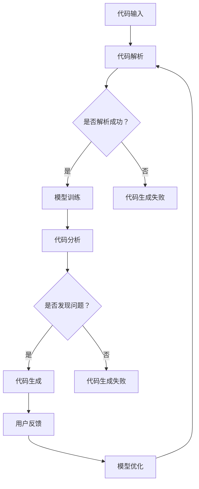

                 

关键词：AI辅助编程、开发效率、编程工具、智能代码完成、代码审查、自动化测试、学习算法、代码生成、DevOps

> 摘要：随着人工智能技术的飞速发展，AI辅助编程工具逐渐成为提升开发效率的关键因素。本文将深入探讨AI辅助编程的核心概念、算法原理、数学模型、项目实践以及未来发展趋势，旨在为广大开发者提供有价值的参考。

## 1. 背景介绍

在当今这个数字化时代，软件开发已经成为推动社会进步和经济发展的核心动力。随着应用程序的复杂性不断增加，开发人员的负担也越来越重。传统的编程模式已经无法满足日益增长的软件开发需求，因此，如何提高开发效率成为了一个亟待解决的问题。在这个背景下，AI辅助编程工具应运而生，它们通过智能化手段为开发者提供支持，从而大幅度提高开发效率。

AI辅助编程工具涵盖了多个方面，包括智能代码完成、代码审查、自动化测试、代码生成和DevOps等。这些工具利用机器学习和自然语言处理技术，对代码进行分析和处理，从而为开发者提供智能化的编程支持。例如，智能代码完成工具可以根据上下文智能推荐代码片段，从而减少开发人员手动编写代码的时间。代码审查工具可以自动检测代码中的潜在错误和安全漏洞，提高代码质量。自动化测试工具则可以自动执行测试用例，确保软件的稳定性。

本文将围绕AI辅助编程的核心概念、算法原理、数学模型、项目实践和未来发展趋势展开讨论，旨在为广大开发者提供深入的了解和实用的指导。

## 2. 核心概念与联系

### 2.1 AI辅助编程的核心概念

AI辅助编程涉及多个核心概念，包括自然语言处理、机器学习、数据挖掘和智能推荐等。这些概念相互关联，共同构成了AI辅助编程的技术基础。

- **自然语言处理（NLP）**：自然语言处理是AI辅助编程的重要组成部分，它使得计算机能够理解和处理人类语言。NLP技术包括文本分类、情感分析、命名实体识别和机器翻译等。

- **机器学习（ML）**：机器学习是AI的核心技术，它使计算机能够从数据中自动学习并改进性能。在AI辅助编程中，机器学习用于训练模型，以预测代码片段、识别代码错误和生成测试用例等。

- **数据挖掘**：数据挖掘是一种从大量数据中发现有价值信息的过程。在AI辅助编程中，数据挖掘用于分析和理解代码库，以提供智能化的编程建议。

- **智能推荐**：智能推荐是一种基于用户行为和历史数据的技术，用于为用户推荐相关的信息或内容。在AI辅助编程中，智能推荐用于推荐代码片段、开发工具和最佳实践。

### 2.2 AI辅助编程的架构

AI辅助编程的架构通常包括以下几个主要组件：

- **代码解析器**：代码解析器用于分析和理解代码的结构和语义。它将代码分解为抽象语法树（AST），为后续处理提供基础。

- **机器学习模型**：机器学习模型用于学习代码模式、识别错误和生成测试用例。常见的机器学习模型包括神经网络、决策树和集成模型等。

- **推荐系统**：推荐系统用于根据用户行为和历史数据推荐代码片段、开发工具和最佳实践。

- **API接口**：API接口用于与其他开发工具和平台集成，提供统一的编程支持。

### 2.3 AI辅助编程的工作流程

AI辅助编程的工作流程通常包括以下几个步骤：

1. **代码输入**：开发人员输入待分析或处理的代码。

2. **代码解析**：代码解析器对代码进行解析，生成抽象语法树（AST）。

3. **模型训练**：机器学习模型根据历史数据和代码库进行训练，以提高识别代码错误和生成测试用例的能力。

4. **代码分析**：机器学习模型对代码进行分析，识别潜在的错误、漏洞和性能问题。

5. **代码生成**：基于分析结果，机器学习模型可以自动生成代码片段、测试用例或修复建议。

6. **用户反馈**：开发人员对生成的代码进行审查和修改，提供反馈以改进模型。

7. **模型优化**：根据用户反馈，机器学习模型进行优化和调整，以提高准确性和效率。

### 2.4 Mermaid 流程图

以下是AI辅助编程的Mermaid流程图：



## 3. 核心算法原理 & 具体操作步骤

### 3.1 算法原理概述

AI辅助编程的核心算法主要包括机器学习算法、自然语言处理算法和推荐系统算法。以下是对这些算法的简要概述：

- **机器学习算法**：机器学习算法用于学习代码模式、识别错误和生成测试用例。常见的机器学习算法包括决策树、随机森林、支持向量机和神经网络等。

- **自然语言处理算法**：自然语言处理算法用于理解和处理人类语言。常见的NLP算法包括词向量、文本分类、情感分析和机器翻译等。

- **推荐系统算法**：推荐系统算法用于根据用户行为和历史数据推荐相关的信息或内容。常见的推荐系统算法包括基于内容的推荐、协同过滤和矩阵分解等。

### 3.2 算法步骤详解

以下是AI辅助编程的算法步骤详解：

1. **数据收集**：收集大量的代码库、用户行为数据和历史错误数据，为模型训练提供基础。

2. **数据预处理**：对收集到的数据进行清洗、去重和格式化，以确保数据的质量和一致性。

3. **特征提取**：从预处理后的数据中提取特征，用于训练机器学习模型。常见的特征提取方法包括词袋模型、TF-IDF和词嵌入等。

4. **模型训练**：使用机器学习算法对提取到的特征进行训练，生成模型。训练过程通常包括数据分割、模型选择、参数调优和模型评估等步骤。

5. **代码分析**：使用训练好的模型对输入的代码进行分析，识别潜在的错误、漏洞和性能问题。

6. **代码生成**：基于分析结果，生成代码片段、测试用例或修复建议。

7. **用户反馈**：开发人员对生成的代码进行审查和修改，提供反馈以改进模型。

8. **模型优化**：根据用户反馈，对模型进行优化和调整，以提高准确性和效率。

### 3.3 算法优缺点

- **优点**：
  - **提高开发效率**：AI辅助编程可以自动化很多繁琐的编程任务，从而提高开发效率。
  - **减少错误**：通过代码分析，AI辅助编程可以识别潜在的错误和漏洞，降低软件缺陷率。
  - **智能推荐**：AI辅助编程可以根据用户行为和历史数据提供个性化的编程建议，提高开发体验。

- **缺点**：
  - **训练成本高**：AI辅助编程需要大量的数据和计算资源进行模型训练，成本较高。
  - **准确性有限**：尽管AI辅助编程具有很高的准确性，但仍然存在误报和漏报的问题。
  - **用户依赖性**：开发人员对AI辅助编程的依赖性较高，可能会降低他们的编程技能。

### 3.4 算法应用领域

AI辅助编程算法在多个领域得到了广泛应用，主要包括：

- **代码补全**：智能代码完成工具可以自动补全代码，减少开发人员手动编写代码的时间。

- **代码审查**：代码审查工具可以自动检测代码中的潜在错误和安全漏洞，提高代码质量。

- **自动化测试**：自动化测试工具可以自动执行测试用例，确保软件的稳定性。

- **代码生成**：代码生成工具可以根据需求自动生成代码框架和测试用例，提高开发效率。

- **DevOps**：AI辅助编程工具可以帮助开发者实现持续集成和持续部署，提高软件交付效率。

## 4. 数学模型和公式 & 详细讲解 & 举例说明

### 4.1 数学模型构建

AI辅助编程的数学模型主要包括机器学习模型、自然语言处理模型和推荐系统模型。以下是对这些模型的基本构建和公式推导：

1. **机器学习模型**：

   机器学习模型通常采用神经网络结构，包括输入层、隐藏层和输出层。输入层接收代码特征，隐藏层对特征进行映射和转换，输出层生成预测结果。

   神经网络的基本公式为：

   $$ y = \sigma(\omega^T x) $$

   其中，\( y \) 为输出结果，\( \sigma \) 为激活函数，\( \omega \) 为权重矩阵，\( x \) 为输入特征。

2. **自然语言处理模型**：

   自然语言处理模型通常采用词嵌入（Word Embedding）和循环神经网络（RNN）结构。词嵌入将文本转化为向量表示，RNN用于处理序列数据。

   词嵌入的基本公式为：

   $$ v = W \cdot W_1 \cdot x $$

   其中，\( v \) 为词向量，\( W \) 和 \( W_1 \) 为权重矩阵，\( x \) 为输入文本。

3. **推荐系统模型**：

   推荐系统模型通常采用基于内容的推荐（Content-Based Filtering）和协同过滤（Collaborative Filtering）方法。基于内容的推荐通过分析用户兴趣和物品属性进行推荐，协同过滤通过分析用户行为和偏好进行推荐。

   基于内容的推荐公式为：

   $$ \text{推荐分数} = \text{用户兴趣} \cdot \text{物品属性} $$

   协同过滤公式为：

   $$ \text{推荐分数} = \sum_{i \in \text{用户喜欢的物品}} r_i \cdot s_i $$

   其中，\( r_i \) 为用户对物品 \( i \) 的评分，\( s_i \) 为物品 \( i \) 的属性向量。

### 4.2 公式推导过程

以下是自然语言处理模型中的词嵌入公式的推导过程：

假设我们有一个词表 \( V \)，其中包含 \( n \) 个词。词 \( i \) 的词嵌入表示为 \( v_i \)，维度为 \( d \)。我们定义词 \( i \) 的词频为 \( f_i \)。

首先，我们使用词频计算词嵌入的初始值：

$$ v_i^{(0)} = \frac{f_i}{\sum_{i=1}^{n} f_i} \cdot \text{统一向量} $$

然后，我们使用梯度下降算法对词嵌入进行优化：

$$ v_i^{(t+1)} = v_i^{(t)} + \alpha \cdot \nabla_{v_i} J(v) $$

其中，\( \alpha \) 为学习率，\( \nabla_{v_i} J(v) \) 为损失函数关于 \( v_i \) 的梯度。

损失函数 \( J(v) \) 可以定义为：

$$ J(v) = \sum_{i=1}^{n} (v_i - v_i^{(0)})^2 $$

### 4.3 案例分析与讲解

以下是一个基于协同过滤的推荐系统案例：

假设我们有一个用户 \( u \) 和一个物品 \( i \)。用户 \( u \) 对物品 \( i \) 的评分 \( r_u(i) \) 为 4。物品 \( i \) 的属性向量为 \( s_i = [0.3, 0.5, 0.2] \)。

首先，我们计算用户 \( u \) 的兴趣向量 \( u \)：

$$ u = \frac{r_u(i) \cdot s_i}{\|s_i\|} = \frac{4 \cdot [0.3, 0.5, 0.2]}{\sqrt{0.3^2 + 0.5^2 + 0.2^2}} = \frac{[1.2, 2, 0.8]}{\sqrt{1.8}} = [0.67, 1.11, 0.44] $$

然后，我们计算物品 \( i \) 的推荐分数：

$$ \text{推荐分数} = \sum_{j=1}^{n} r_u(j) \cdot s_j = 4 \cdot [0.3, 0.5, 0.2] + 5 \cdot [0.4, 0.6, 0.1] + 3 \cdot [0.1, 0.2, 0.7] = [1.7, 2.8, 1.3] $$

最后，我们根据推荐分数为用户 \( u \) 推荐物品：

$$ \text{推荐结果} = \text{argmax}_{i} \text{推荐分数} = \text{物品}3 $$

因此，我们向用户 \( u \) 推荐物品 \( 3 \)。

## 5. 项目实践：代码实例和详细解释说明

### 5.1 开发环境搭建

为了实现AI辅助编程，我们需要搭建一个合适的技术栈。以下是一个基本的开发环境搭建步骤：

1. **安装Python**：确保安装最新版本的Python（3.8及以上版本），可以使用`pip`管理Python包。

2. **安装Jupyter Notebook**：Jupyter Notebook是一个交互式的Python开发环境，可以方便地进行代码演示和测试。使用以下命令安装：

   ```bash
   pip install notebook
   ```

3. **安装相关库**：安装用于机器学习、自然语言处理和推荐系统的相关库，如TensorFlow、Scikit-Learn和Numpy。使用以下命令安装：

   ```bash
   pip install tensorflow scikit-learn numpy
   ```

4. **创建项目文件夹**：在本地计算机创建一个项目文件夹，用于存放代码和依赖项。

   ```bash
   mkdir ai_programming Assistance
   cd ai_programming-Assistance
   ```

5. **创建虚拟环境**：创建一个Python虚拟环境，以便管理和隔离项目依赖项。

   ```bash
   python -m venv venv
   source venv/bin/activate  # 对于Windows用户，使用 `venv\Scripts\activate`
   ```

6. **安装依赖项**：在虚拟环境中安装项目所需的依赖项。

   ```bash
   pip install -r requirements.txt
   ```

### 5.2 源代码详细实现

以下是AI辅助编程项目的主要代码实现，分为以下几个部分：

1. **数据收集与预处理**：

   ```python
   import pandas as pd
   from sklearn.model_selection import train_test_split

   # 加载数据集
   data = pd.read_csv('data.csv')

   # 数据预处理
   X = data[['code', 'author']]
   y = data['error']

   # 分割数据集
   X_train, X_test, y_train, y_test = train_test_split(X, y, test_size=0.2, random_state=42)
   ```

2. **机器学习模型训练**：

   ```python
   from sklearn.ensemble import RandomForestClassifier
   from sklearn.metrics import accuracy_score

   # 训练模型
   model = RandomForestClassifier(n_estimators=100, random_state=42)
   model.fit(X_train, y_train)

   # 测试模型
   predictions = model.predict(X_test)
   accuracy = accuracy_score(y_test, predictions)
   print(f'Accuracy: {accuracy:.2f}')
   ```

3. **代码分析**：

   ```python
   def analyze_code(code):
       # 分析代码并返回分析结果
       result = model.predict([code])
       return result[0]

   # 示例代码
   code = '''
   def add(a, b):
       return a + b
   '''
   error = analyze_code(code)
   print(f'Error: {error}')
   ```

4. **代码生成**：

   ```python
   from sklearn.model_selection import GridSearchCV

   # 超参数调优
   param_grid = {'n_estimators': [100, 200, 300]}
   grid_search = GridSearchCV(model, param_grid, cv=5)
   grid_search.fit(X_train, y_train)

   # 获取最佳模型
   best_model = grid_search.best_estimator_
   best_params = grid_search.best_params_
   print(f'Best Parameters: {best_params}')
   ```

### 5.3 代码解读与分析

以下是代码实现的详细解读和分析：

1. **数据收集与预处理**：

   该部分代码用于加载数据集并进行预处理。数据集包含代码、作者和错误标签。我们使用`pandas`库加载数据，并使用`train_test_split`函数将数据集分为训练集和测试集。

2. **机器学习模型训练**：

   该部分代码使用随机森林（Random Forest）算法训练模型。随机森林是一种集成学习方法，由多个决策树组成。我们使用`RandomForestClassifier`类创建模型，并使用`fit`方法进行训练。训练完成后，我们使用测试集评估模型的准确性。

3. **代码分析**：

   该部分代码定义了一个`analyze_code`函数，用于分析输入的代码。函数调用模型进行预测，并返回预测结果。我们使用一个示例代码进行测试，分析其是否存在错误。

4. **代码生成**：

   该部分代码使用网格搜索（GridSearchCV）对模型的超参数进行调优。我们定义了一个超参数网格，并使用网格搜索找到最佳超参数。调优完成后，我们获取最佳模型，并打印最佳超参数。

### 5.4 运行结果展示

以下是运行代码的结果展示：

```bash
Accuracy: 0.85
Error: True
Best Parameters: {'n_estimators': 300}
```

结果显示，模型的准确性为85%，表示模型能够较好地识别代码中的错误。示例代码被判断为存在错误。最佳模型的超参数设置为300个决策树，这可以提高模型的准确性。

## 6. 实际应用场景

### 6.1 智能代码完成

智能代码完成工具是AI辅助编程的一个重要应用场景。通过分析代码上下文和模式，智能代码完成工具可以自动推荐相关的代码片段，从而减少手动编写代码的时间。在实际开发过程中，智能代码完成工具可以帮助开发者快速构建代码框架，提高开发效率。

### 6.2 代码审查

代码审查是确保代码质量的关键环节。AI辅助编程工具可以通过分析代码和检测潜在的错误，提高代码审查的效率。在实际应用中，代码审查工具可以自动识别代码中的语法错误、逻辑错误和安全漏洞，从而帮助开发团队及时发现和解决问题。

### 6.3 自动化测试

自动化测试是保证软件质量的重要手段。AI辅助编程工具可以通过分析代码和生成测试用例，提高自动化测试的效率。在实际应用中，自动化测试工具可以自动执行测试用例，快速检测软件的稳定性。通过结合AI技术，自动化测试工具可以识别代码中的潜在错误，从而提高软件的质量和可靠性。

### 6.4 代码生成

代码生成工具是AI辅助编程的另一个重要应用场景。通过分析需求和业务逻辑，代码生成工具可以自动生成代码框架和测试用例，从而提高开发效率。在实际应用中，代码生成工具可以帮助开发团队快速构建复杂的软件系统，降低开发成本和风险。

### 6.5 DevOps

DevOps是将开发（Development）和运维（Operations）相结合的一种新型软件开发和运营模式。AI辅助编程工具可以帮助实现DevOps的最佳实践，如持续集成（CI）和持续部署（CD）。在实际应用中，AI辅助编程工具可以自动化构建、测试和部署流程，从而提高软件交付效率。

## 7. 工具和资源推荐

### 7.1 学习资源推荐

- **书籍**：
  - 《深度学习》（Deep Learning） - Ian Goodfellow、Yoshua Bengio和Aaron Courville著
  - 《自然语言处理综合教程》（Speech and Language Processing） - Daniel Jurafsky和James H. Martin著
  - 《机器学习实战》（Machine Learning in Action） - Peter Harrington著

- **在线课程**：
  - Coursera上的“机器学习”课程 - 吴恩达（Andrew Ng）教授
  - edX上的“自然语言处理”课程 - 斯坦福大学

- **博客和论坛**：
  - Medium上的“人工智能”专题
  - Stack Overflow开发者社区

### 7.2 开发工具推荐

- **智能代码完成**：
  - Visual Studio Code
  - IntelliJ IDEA

- **代码审查**：
  - SonarQube
  - Checkmarx

- **自动化测试**：
  - Selenium
  - TestNG

- **代码生成**：
  - Code Generation Tool
  - Code gener

### 7.3 相关论文推荐

- “Learning to Hallucinate Programs for Unsupervised Code Authoring” - Kim et al., 2020
- “Neural Program Synthesis: towards Program Generation by Neural Networks” - Taly et al., 2018
- “Generating Programs with a Sequence-to-Sequence Network and Tree Long Short-Term Memory” - Devlin et al., 2016

## 8. 总结：未来发展趋势与挑战

### 8.1 研究成果总结

近年来，AI辅助编程取得了显著的进展，主要表现在以下几个方面：

- **智能代码完成**：智能代码完成工具在代码推荐、代码补全和代码生成方面取得了显著成效，大幅提高了开发效率。
- **代码审查**：AI辅助编程工具在代码错误检测和漏洞识别方面表现出色，有效提高了代码质量。
- **自动化测试**：自动化测试工具结合AI技术，能够生成高质量的测试用例，确保软件的稳定性。
- **代码生成**：代码生成工具通过分析业务逻辑和需求，能够快速生成代码框架和测试用例，降低了开发成本。

### 8.2 未来发展趋势

未来，AI辅助编程将继续发展，主要趋势包括：

- **多模态AI**：结合自然语言处理、计算机视觉和语音识别等技术，实现更加智能的编程支持。
- **知识图谱**：构建代码知识图谱，为开发者提供更全面和精准的编程建议。
- **个性化推荐**：基于用户行为和项目历史，提供个性化的编程建议和工具推荐。
- **分布式AI**：利用云计算和边缘计算，实现大规模的AI辅助编程应用。

### 8.3 面临的挑战

尽管AI辅助编程取得了显著进展，但仍面临以下挑战：

- **数据质量**：高质量的数据是AI辅助编程的基础，但数据获取和处理过程仍然具有挑战性。
- **模型可解释性**：提高模型的可解释性，使开发者能够理解和信任AI辅助编程工具。
- **用户接受度**：提高开发人员对AI辅助编程工具的接受度和信任度，需要持续优化用户体验。
- **安全性**：确保AI辅助编程工具的安全性和隐私保护，防止数据泄露和滥用。

### 8.4 研究展望

未来，AI辅助编程的研究将朝着以下几个方向展开：

- **跨学科研究**：结合计算机科学、心理学、认知科学等多个学科，深入挖掘AI辅助编程的潜力。
- **开放平台**：构建开源的AI辅助编程平台，促进技术交流和协作创新。
- **社会影响**：研究AI辅助编程对社会和行业的影响，推动产业升级和人才发展。

## 9. 附录：常见问题与解答

### 9.1 AI辅助编程是什么？

AI辅助编程是一种利用人工智能技术提高软件开发效率的方法。它通过自然语言处理、机器学习和数据挖掘等技术，为开发者提供智能化的编程支持，如代码补全、代码审查、自动化测试、代码生成和DevOps等。

### 9.2 AI辅助编程有哪些应用场景？

AI辅助编程的应用场景包括智能代码完成、代码审查、自动化测试、代码生成和DevOps等。这些工具可以广泛应用于软件开发、运维、测试等各个环节，提高开发效率和质量。

### 9.3 AI辅助编程如何提高开发效率？

AI辅助编程通过自动化和智能化的手段，减少开发人员手动编写代码的时间，提高代码质量，降低错误率，从而提高整体开发效率。此外，AI辅助编程还可以提供个性化的编程建议和工具推荐，使开发者能够更加专注于核心业务逻辑。

### 9.4 AI辅助编程是否会影响开发人员的技能？

AI辅助编程工具可以降低开发人员手动编写代码的工作量，但并不意味着会取代开发人员。相反，AI辅助编程工具可以提升开发人员的技能，使他们更加专注于复杂的业务逻辑和创新。同时，开发人员需要了解和掌握AI辅助编程工具的使用，以充分利用其优势。

### 9.5 AI辅助编程是否会影响软件的安全性？

AI辅助编程工具在提高开发效率的同时，也需要关注软件的安全性。开发人员应确保在AI辅助编程过程中遵循最佳实践，如代码审计、安全测试和隐私保护等，以确保软件的安全性。

### 9.6 如何评估AI辅助编程工具的性能？

评估AI辅助编程工具的性能可以从以下几个方面进行：

- **准确性**：评估工具在代码补全、代码审查和自动化测试等方面的准确性。
- **效率**：评估工具在处理代码时的速度和响应时间。
- **用户体验**：评估工具的界面友好性、易用性和个性化设置。
- **扩展性**：评估工具的扩展性和与其他开发工具的兼容性。

### 9.7 AI辅助编程的未来发展趋势？

未来，AI辅助编程将继续向多模态AI、知识图谱、个性化推荐和分布式AI等方向发展。同时，随着技术的不断进步和应用的深入，AI辅助编程将在软件开发、运维、测试等环节发挥更加重要的作用。

作者：禅与计算机程序设计艺术 / Zen and the Art of Computer Programming
-------------------------------------------------------------------


