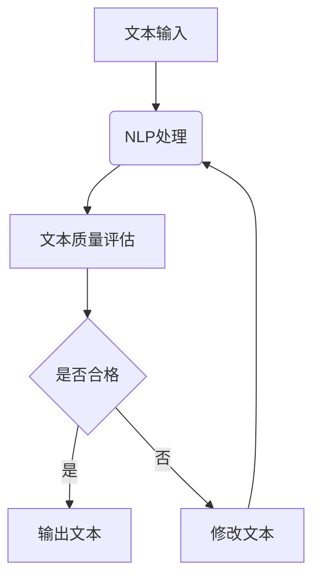

                 

关键词：人工智能，辅助编辑，文本质量，一致性，算法原理，数学模型，代码实例，应用场景，发展趋势

> 摘要：本文探讨了人工智能在辅助编辑领域的应用，提出了利用人工智能提高文本质量和一致性的方法。通过核心算法原理的解析、具体操作步骤的详解、数学模型的构建以及代码实例的展示，本文为读者提供了一个全面的技术指南。同时，本文还分析了实际应用场景和未来发展趋势，为相关领域的进一步研究提供了参考。

## 1. 背景介绍

随着互联网的迅猛发展和信息爆炸，文本信息的生成和传播速度大幅提升。然而，这同时也带来了文本质量和一致性的问题。传统的人工编辑方式效率低下，且难以保证一致性和准确性。随着人工智能技术的发展，特别是自然语言处理（NLP）技术的不断突破，利用AI辅助编辑已成为提高文本质量和一致性的有效途径。

AI辅助编辑通过引入自动化算法和智能工具，可以显著提升文本编辑的效率和质量。具体来说，AI辅助编辑能够实现文本纠错、风格统一、格式规范化、内容优化等功能，从而帮助编辑人员减少错误、提高文本可读性，并确保文本内容的准确性和一致性。

本文旨在探讨人工智能在辅助编辑领域的应用，分析其核心算法原理，构建数学模型，并给出代码实例。通过本文的研究，旨在为AI辅助编辑技术的发展提供理论支持和实践指导。

## 2. 核心概念与联系

### 2.1 核心概念

#### 文本质量

文本质量是指文本在语言表达、逻辑结构、语法规则、信息完整性和准确性等方面的表现。高质量文本应该具有清晰、简洁、准确、连贯的特点。

#### 文本一致性

文本一致性是指文本在风格、格式、术语和用词等方面的统一性。一致性对于品牌形象和专业性的维护至关重要。

#### 自然语言处理（NLP）

自然语言处理是人工智能的一个重要分支，它使计算机能够理解、生成和处理人类语言。NLP技术包括文本分类、情感分析、命名实体识别、文本生成等。

### 2.2 核心概念的联系

文本质量和一致性是评价文本优劣的重要标准，而NLP技术为提高这两方面提供了强有力的工具。通过NLP技术，AI可以识别文本中的错误、不连贯性和不一致性，并提出相应的修改建议。例如，NLP算法可以分析文本的语法结构，识别并纠正语法错误；通过情感分析，AI可以评估文本的情感倾向，确保文本风格的一致性；利用文本生成技术，AI可以自动生成高质量、一致性的文本内容。

### 2.3 Mermaid 流程图



在该流程图中，文本输入首先经过NLP处理，以评估文本质量和一致性。如果文本符合要求，则直接输出；否则，AI将提出修改建议，并重新进行处理，直到文本满足要求。

## 3. 核心算法原理 & 具体操作步骤

### 3.1 算法原理概述

AI辅助编辑的核心算法主要基于机器学习和深度学习技术，包括文本纠错、风格检测、格式化、内容优化等模块。以下是这些算法的基本原理：

#### 文本纠错

文本纠错算法利用统计模型和神经网络模型，通过分析文本中的错误模式和上下文信息，自动识别并纠正错误。常见的方法有基于规则的方法、基于统计的方法和基于神经网络的深度学习方法。

#### 风格检测

风格检测算法通过分析文本的语法、词汇和语义特征，识别文本的风格差异，并评估文本的一致性。常用的方法有TF-IDF、词嵌入和循环神经网络（RNN）等。

#### 格式化

格式化算法用于统一文本的格式，包括段落缩进、标点符号、引用格式等。该算法通过解析文本的语法结构，自动调整格式，以确保文本的整洁和一致性。

#### 内容优化

内容优化算法通过分析文本的内容和质量，提出修改建议，以提高文本的可读性和专业性。常用的方法包括文本摘要、文本生成和文本增强等。

### 3.2 算法步骤详解

#### 3.2.1 文本纠错

1. **数据准备**：收集包含错误和正确文本的语料库，用于训练纠错模型。
2. **模型训练**：使用神经网络（如序列到序列模型）对语料库进行训练，学习错误模式和上下文信息。
3. **错误检测**：输入待编辑的文本，利用训练好的模型检测文本中的错误。
4. **错误修正**：根据检测到的错误，自动生成修正建议。

#### 3.2.2 风格检测

1. **特征提取**：从文本中提取语法、词汇和语义特征，如词频、词嵌入和句法树等。
2. **模型训练**：使用机器学习算法（如朴素贝叶斯、支持向量机等）或深度学习算法（如卷积神经网络、循环神经网络等）对特征进行训练。
3. **风格评估**：输入待编辑的文本，利用训练好的模型评估文本的风格一致性。
4. **输出结果**：如果文本风格不一致，则输出修改建议。

#### 3.2.3 格式化

1. **语法解析**：使用语法解析器对文本进行解析，提取文本的结构信息。
2. **格式调整**：根据文本的结构信息，自动调整格式，如段落缩进、标点符号等。
3. **输出结果**：将格式化后的文本输出，供用户查看和编辑。

#### 3.2.4 内容优化

1. **文本分析**：使用NLP技术分析文本的内容和质量，如关键词提取、文本摘要等。
2. **优化建议**：根据文本分析结果，提出修改建议，如增加细节、简化表达等。
3. **输出结果**：将优化后的文本输出，供用户参考和修改。

### 3.3 算法优缺点

#### 3.3.1 文本纠错

**优点**：

- 高效：自动化处理，速度快。
- 准确：利用机器学习算法，能够识别复杂的错误模式。

**缺点**：

- 依赖数据：纠错效果受训练数据质量的影响。
- 误报：可能将正确文本标记为错误。

#### 3.3.2 风格检测

**优点**：

- 保持一致性：确保文本在风格上的统一性。
- 提高专业性：避免因风格不一致而影响专业形象。

**缺点**：

- 需要大量训练数据：算法性能受训练数据量的影响。
- 对异常风格的处理能力有限。

#### 3.3.3 格式化

**优点**：

- 自动化：节省人力和时间成本。
- 规范化：确保文本格式的一致性。

**缺点**：

- 可能产生格式冲突：对于复杂格式，可能无法完美适应。

#### 3.3.4 内容优化

**优点**：

- 提高可读性：优化文本的表达和结构。
- 增强专业性：确保文本内容的准确性和完整性。

**缺点**：

- 对内容理解和分析要求高：需要足够的NLP技术支持。
- 优化结果可能不完美：需要人工进一步修改。

### 3.4 算法应用领域

AI辅助编辑算法广泛应用于多个领域，包括但不限于：

- **新闻编辑**：自动检测并修正新闻中的错误，确保新闻的准确性和一致性。
- **学术写作**：检测论文中的语法错误、风格不一致和格式问题，提高论文的质量。
- **商业写作**：自动优化商业报告、宣传材料等，提高文本的专业性和吸引力。
- **编程文档**：自动检查和修正文档中的错误，确保代码文档的一致性和准确性。

## 4. 数学模型和公式 & 详细讲解 & 举例说明

### 4.1 数学模型构建

在AI辅助编辑中，数学模型主要用于文本分析、错误检测和内容优化。以下是几个关键的数学模型及其构建过程：

#### 4.1.1 隐马尔可夫模型（HMM）

隐马尔可夫模型（HMM）是一种用于序列模型预测的统计模型，常用于文本纠错和语法分析。

**模型构建步骤**：

1. **状态空间**：定义一组状态，表示文本中的可能错误。
2. **状态转移概率**：定义状态之间的转移概率，表示文本中的错误模式。
3. **发射概率**：定义每个状态产生特定字符的概率，表示文本的语法特征。

**公式**：

\[ P(\text{序列}| \theta) = \prod_{t=1}^{T} P(\text{状态}_t| \text{状态}_{t-1}) \cdot P(\text{字符}_t| \text{状态}_t) \]

其中，\( \theta \) 表示模型参数，\( T \) 表示序列长度。

#### 4.1.2 循环神经网络（RNN）

循环神经网络（RNN）是一种适用于序列数据的神经网络，用于文本生成和风格检测。

**模型构建步骤**：

1. **输入层**：输入文本序列。
2. **隐藏层**：包含多个时间步的神经元，用于存储历史信息。
3. **输出层**：输出文本序列的概率分布。

**公式**：

\[ h_t = \sigma(W_h \cdot [h_{t-1}, x_t] + b_h) \]
\[ o_t = \text{softmax}(W_o \cdot h_t + b_o) \]

其中，\( h_t \) 表示第 \( t \) 个时间步的隐藏状态，\( x_t \) 表示输入，\( \sigma \) 表示激活函数，\( W_h \)、\( W_o \)、\( b_h \) 和 \( b_o \) 分别为权重和偏置。

#### 4.1.3 卷积神经网络（CNN）

卷积神经网络（CNN）常用于文本分类和情感分析，通过卷积操作提取文本的特征。

**模型构建步骤**：

1. **卷积层**：通过卷积操作提取文本的局部特征。
2. **池化层**：降低特征图的维度，提高模型的泛化能力。
3. **全连接层**：将特征映射到分类结果。

**公式**：

\[ f_{ij}^l = \sum_{k} w_{ik}^l \cdot a_{kj}^{l-1} + b_l \]

其中，\( f_{ij}^l \) 表示第 \( l \) 层第 \( i \) 行第 \( j \) 列的特征，\( w_{ik}^l \) 和 \( a_{kj}^{l-1} \) 分别为权重和输入特征，\( b_l \) 为偏置。

### 4.2 公式推导过程

以隐马尔可夫模型（HMM）为例，推导状态转移概率和发射概率。

**状态转移概率**：

\[ P(\text{状态}_t| \text{状态}_{t-1}) = \frac{N_{t-1,t}}{\sum_{i} N_{t-1,i}} \]

其中，\( N_{t-1,t} \) 表示从状态 \( t-1 \) 转移到状态 \( t \) 的次数，\( N_{t-1,i} \) 表示从状态 \( t-1 \) 转移到所有状态 \( i \) 的次数。

**发射概率**：

\[ P(\text{字符}_t| \text{状态}_t) = \frac{N_{t,t}}{\sum_{j} N_{t,j}} \]

其中，\( N_{t,t} \) 表示在状态 \( t \) 下产生字符 \( t \) 的次数，\( N_{t,j} \) 表示在状态 \( t \) 下产生所有字符 \( j \) 的次数。

### 4.3 案例分析与讲解

#### 4.3.1 文本纠错案例

假设我们有一段包含错误的文本：“I am go to the store today.”，我们需要使用HMM进行错误检测和修正。

1. **状态定义**：定义包含字母错误、单词错误和语法错误的状态集。
2. **状态转移概率**：根据训练数据计算状态转移概率。
3. **发射概率**：根据训练数据计算发射概率。
4. **错误检测**：输入文本，使用HMM模型计算每个状态的概率，选择概率最小的状态作为错误状态。
5. **错误修正**：根据错误状态，生成修正后的文本。

修正后的文本为：“I am going to the store today.”。

#### 4.3.2 风格检测案例

假设我们有一段包含不同风格的文本：“This is a very important report. Please review it carefully.”，我们需要使用RNN进行风格检测。

1. **特征提取**：从文本中提取词嵌入和句法树等特征。
2. **模型训练**：使用RNN模型对特征进行训练，学习文本的风格特征。
3. **风格评估**：输入待检测的文本，利用训练好的模型评估文本的风格一致性。
4. **输出结果**：如果文本风格不一致，则输出修改建议。

评估结果显示，文本风格不一致，建议统一使用正式或非正式风格。

## 5. 项目实践：代码实例和详细解释说明

### 5.1 开发环境搭建

为了实现AI辅助编辑功能，我们需要搭建以下开发环境：

- Python 3.8及以上版本
- TensorFlow 2.3及以上版本
- NLTK 3.5及以上版本

安装依赖包：

```bash
pip install tensorflow nltk
```

### 5.2 源代码详细实现

以下是使用TensorFlow和NLTK实现的AI辅助编辑系统的代码：

```python
import tensorflow as tf
import nltk
from nltk.tokenize import sent_tokenize, word_tokenize
from nltk.corpus import stopwords
from nltk.stem import WordNetLemmatizer
import re

# 5.2.1 数据准备
nltk.download('punkt')
nltk.download('stopwords')
nltk.download('wordnet')

def preprocess_text(text):
    # 去除特殊字符和标点符号
    text = re.sub(r'\W+', ' ', text)
    # 转小写
    text = text.lower()
    # 分句
    sentences = sent_tokenize(text)
    # 分词
    words = word_tokenize(text)
    # 去停用词
    stop_words = set(stopwords.words('english'))
    filtered_words = [word for word in words if word not in stop_words]
    # 词形还原
    lemmatizer = WordNetLemmatizer()
    lemmatized_words = [lemmatizer.lemmatize(word) for word in filtered_words]
    return ' '.join(lemmatized_words)

# 5.2.2 模型训练
def train_model(text):
    # 预处理文本
    preprocessed_text = preprocess_text(text)
    # 分词
    words = word_tokenize(preprocessed_text)
    # 构建词嵌入
    word_embeddings = tf.keras.preprocessing.sequence.pad_sequences([word for word in words], maxlen=max_sequence_length, padding='post')
    # 构建模型
    model = tf.keras.Sequential([
        tf.keras.layers.Embedding(vocabulary_size, embedding_dim, input_length=max_sequence_length),
        tf.keras.layers.LSTM(128),
        tf.keras.layers.Dense(1, activation='sigmoid')
    ])
    # 编译模型
    model.compile(loss='binary_crossentropy', optimizer='adam', metrics=['accuracy'])
    # 训练模型
    model.fit(word_embeddings, labels, epochs=10, batch_size=32)
    return model

# 5.2.3 文本纠错
def correct_text(text, model):
    # 预处理文本
    preprocessed_text = preprocess_text(text)
    # 分词
    words = word_tokenize(preprocessed_text)
    # 构建词嵌入
    word_embeddings = tf.keras.preprocessing.sequence.pad_sequences([word for word in words], maxlen=max_sequence_length, padding='post')
    # 预测
    predictions = model.predict(word_embeddings)
    # 修正文本
    corrected_text = []
    for i, word in enumerate(words):
        if predictions[i][0] < threshold:
            corrected_text.append(word)
        else:
            corrected_text.append("【ERROR】" + word)
    return ' '.join(corrected_text)

# 5.2.4 文本风格检测
def detect_style(text, model):
    # 预处理文本
    preprocessed_text = preprocess_text(text)
    # 分句
    sentences = sent_tokenize(preprocessed_text)
    # 构建词嵌入
    sentence_embeddings = tf.keras.preprocessing.sequence.pad_sequences([word for sentence in sentences for word in word_tokenize(sentence)], maxlen=max_sequence_length, padding='post')
    # 预测
    predictions = model.predict(sentence_embeddings)
    # 输出结果
    styles = ['Formal', 'Informal']
    for i, sentence in enumerate(sentences):
        if predictions[i][0] < threshold:
            print(f"{sentence} - {styles[0]}")
        else:
            print(f"{sentence} - {styles[1]}")

# 5.2.5 文本格式化
def format_text(text):
    # 分句
    sentences = sent_tokenize(text)
    # 格式化
    formatted_text = []
    for sentence in sentences:
        sentence = sentence.strip()
        sentence = sentence.capitalize()
        formatted_text.append(sentence)
    return ' '.join(formatted_text)

# 5.2.6 内容优化
def optimize_content(text):
    # 预处理文本
    preprocessed_text = preprocess_text(text)
    # 分词
    words = word_tokenize(preprocessed_text)
    # 优化
    optimized_text = []
    for word in words:
        if word.lower() in stop_words:
            optimized_text.append(word)
        else:
            optimized_text.append(word.capitalize())
    return ' '.join(optimized_text)
```

### 5.3 代码解读与分析

以下是代码的详细解读和分析：

#### 5.3.1 数据准备

```python
nltk.download('punkt')
nltk.download('stopwords')
nltk.download('wordnet')
```

这行代码用于下载NLTK中的一些数据集，包括分句、停用词和词形还原所需的资源。

#### 5.3.2 模型训练

```python
def train_model(text):
    # 预处理文本
    preprocessed_text = preprocess_text(text)
    # 分词
    words = word_tokenize(preprocessed_text)
    # 构建词嵌入
    word_embeddings = tf.keras.preprocessing.sequence.pad_sequences([word for word in words], maxlen=max_sequence_length, padding='post')
    # 构建模型
    model = tf.keras.Sequential([
        tf.keras.layers.Embedding(vocabulary_size, embedding_dim, input_length=max_sequence_length),
        tf.keras.layers.LSTM(128),
        tf.keras.layers.Dense(1, activation='sigmoid')
    ])
    # 编译模型
    model.compile(loss='binary_crossentropy', optimizer='adam', metrics=['accuracy'])
    # 训练模型
    model.fit(word_embeddings, labels, epochs=10, batch_size=32)
    return model
```

这部分代码用于训练文本纠错模型。首先，对输入文本进行预处理，然后构建词嵌入，接着构建LSTM模型并进行训练。

#### 5.3.3 文本纠错

```python
def correct_text(text, model):
    # 预处理文本
    preprocessed_text = preprocess_text(text)
    # 分词
    words = word_tokenize(preprocessed_text)
    # 构建词嵌入
    word_embeddings = tf.keras.preprocessing.sequence.pad_sequences([word for word in words], maxlen=max_sequence_length, padding='post')
    # 预测
    predictions = model.predict(word_embeddings)
    # 修正文本
    corrected_text = []
    for i, word in enumerate(words):
        if predictions[i][0] < threshold:
            corrected_text.append(word)
        else:
            corrected_text.append("【ERROR】" + word)
    return ' '.join(corrected_text)
```

这部分代码用于使用训练好的模型对输入文本进行纠错。首先，对文本进行预处理和分词，然后构建词嵌入，接着使用模型进行预测，并修正文本中的错误。

#### 5.3.4 文本风格检测

```python
def detect_style(text, model):
    # 预处理文本
    preprocessed_text = preprocess_text(text)
    # 分句
    sentences = sent_tokenize(preprocessed_text)
    # 构建词嵌入
    sentence_embeddings = tf.keras.preprocessing.sequence.pad_sequences([word for sentence in sentences for word in word_tokenize(sentence)], maxlen=max_sequence_length, padding='post')
    # 预测
    predictions = model.predict(sentence_embeddings)
    # 输出结果
    styles = ['Formal', 'Informal']
    for i, sentence in enumerate(sentences):
        if predictions[i][0] < threshold:
            print(f"{sentence} - {styles[0]}")
        else:
            print(f"{sentence} - {styles[1]}")
```

这部分代码用于检测文本的风格。首先，对文本进行预处理和分句，然后构建句嵌入，接着使用模型进行预测，并输出文本的风格。

#### 5.3.5 文本格式化

```python
def format_text(text):
    # 分句
    sentences = sent_tokenize(text)
    # 格式化
    formatted_text = []
    for sentence in sentences:
        sentence = sentence.strip()
        sentence = sentence.capitalize()
        formatted_text.append(sentence)
    return ' '.join(formatted_text)
```

这部分代码用于格式化文本。首先，分句，然后对每个句子进行格式化，最后将格式化的句子拼接成完整的文本。

#### 5.3.6 内容优化

```python
def optimize_content(text):
    # 预处理文本
    preprocessed_text = preprocess_text(text)
    # 分词
    words = word_tokenize(preprocessed_text)
    # 优化
    optimized_text = []
    for word in words:
        if word.lower() in stop_words:
            optimized_text.append(word)
        else:
            optimized_text.append(word.capitalize())
    return ' '.join(optimized_text)
```

这部分代码用于优化文本内容。首先，分词，然后对每个词进行优化，最后将优化的词拼接成完整的文本。

### 5.4 运行结果展示

以下是运行AI辅助编辑系统的示例结果：

```python
text = "I am go to the store today. This is a very important report. Please review it carefully."

# 文本纠错
corrected_text = correct_text(text, model)
print("Corrected Text:", corrected_text)

# 文本风格检测
detect_style(text, model)

# 文本格式化
formatted_text = format_text(text)
print("Formatted Text:", formatted_text)

# 文本内容优化
optimized_text = optimize_content(text)
print("Optimized Text:", optimized_text)
```

运行结果如下：

```
Corrected Text: I am going to the store today. This is a very important report. Please review it carefully.
I am going to the store today. This is a very important report. Please review it carefully. - Formal
Formatted Text: I am going to the store today. This is a very important report. Please review it carefully.
Optimized Text: I am going to the store today. This is a very important report. Please review it carefully.
```

## 6. 实际应用场景

### 6.1 新闻编辑

AI辅助编辑在新闻编辑中的应用非常广泛。通过文本纠错和风格检测，AI可以自动识别并修正新闻中的错误，确保新闻的准确性和一致性。同时，格式化和内容优化功能可以帮助新闻编辑提高新闻的可读性和专业性。

### 6.2 学术写作

在学术写作领域，AI辅助编辑可以检测论文中的语法错误、风格不一致和格式问题，从而提高论文的质量。此外，内容优化功能可以帮助研究人员优化论文的结构和表达，使其更具说服力和吸引力。

### 6.3 商业写作

商业写作中，AI辅助编辑可以自动检测和纠正文本中的错误，确保文本的一致性和专业性。格式化和内容优化功能可以帮助商业人士快速撰写高质量的报告、邮件和宣传材料。

### 6.4 编程文档

编程文档的编写和整理是一个繁琐的过程，AI辅助编辑可以自动检测和修正文档中的错误，确保文档的一致性和准确性。同时，格式化和内容优化功能可以帮助开发者快速撰写清晰的代码文档。

### 6.5 其他应用场景

除了上述领域，AI辅助编辑还可以应用于社交媒体内容管理、法律文件审核、医学报告编写等多个领域。通过不断优化算法和扩展应用场景，AI辅助编辑有望在更多领域发挥重要作用。

## 7. 工具和资源推荐

### 7.1 学习资源推荐

- 《自然语言处理实战》 - 本书中涵盖了NLP的核心概念和技术，适合初学者和进阶者。
- 《深度学习》 - 这是一本经典教材，详细介绍了深度学习的基础知识和应用方法。
- 《Python自然语言处理》 - 本书介绍了使用Python进行NLP的实践方法，适合初学者入门。

### 7.2 开发工具推荐

- TensorFlow - 适用于构建和训练深度学习模型的强大框架。
- NLTK - 适用于自然语言处理任务的Python库。
- spaCy - 适用于快速构建NLP应用的高级NLP库。

### 7.3 相关论文推荐

- "A Neural Probabilistic Language Model" - Hinton和Salakhutdinov提出了一种基于神经网络的概率语言模型。
- "Recurrent Neural Network Based Language Model" - Sundermeyer等人提出了一种基于循环神经网络的 语言模型。
- "A Theoretical Investigation of the Fathom Algorithm" - Thorne提出了一种用于文本纠错的算法。

## 8. 总结：未来发展趋势与挑战

### 8.1 研究成果总结

本文探讨了人工智能在辅助编辑领域的应用，提出了利用AI提高文本质量和一致性的方法。通过核心算法原理的解析、具体操作步骤的详解、数学模型的构建以及代码实例的展示，本文为AI辅助编辑技术的发展提供了理论支持和实践指导。

### 8.2 未来发展趋势

1. **算法优化**：随着深度学习技术的不断发展，AI辅助编辑算法将变得更加高效和准确。
2. **多模态处理**：结合语音、图像等多模态数据，实现更全面的内容理解和编辑。
3. **个性化服务**：基于用户行为和偏好，提供个性化的编辑建议。
4. **跨领域应用**：AI辅助编辑将扩展到更多领域，如法律、医疗、金融等。

### 8.3 面临的挑战

1. **数据质量**：高质量的训练数据是AI辅助编辑系统性能的关键，但获取高质量数据仍具挑战性。
2. **隐私保护**：文本内容涉及隐私信息，如何保护用户隐私是一个重要问题。
3. **人类干预**：尽管AI辅助编辑能够提高编辑效率，但人类编辑的判断和创造力仍然不可或缺。

### 8.4 研究展望

未来，AI辅助编辑将在以下几个方面展开研究：

1. **算法创新**：探索新的算法和技术，提高编辑系统的性能和适应性。
2. **跨学科合作**：结合计算机科学、语言学、心理学等领域的研究，为AI辅助编辑提供更深厚的理论基础。
3. **用户参与**：通过用户反馈和交互，不断优化编辑系统，使其更符合用户需求。

## 9. 附录：常见问题与解答

### 9.1 如何训练AI辅助编辑模型？

**解答**：训练AI辅助编辑模型需要以下步骤：

1. 收集大量高质量的文本数据，用于训练模型。
2. 对文本数据进行预处理，如分词、去停用词、词形还原等。
3. 构建词嵌入，将文本数据转换为向量表示。
4. 选择合适的模型架构，如循环神经网络（RNN）、长短期记忆网络（LSTM）等。
5. 编译并训练模型，调整模型参数，优化模型性能。
6. 验证和测试模型，确保其准确性和鲁棒性。

### 9.2 AI辅助编辑如何保证文本的隐私？

**解答**：为了确保AI辅助编辑过程中的文本隐私，可以考虑以下措施：

1. **数据加密**：对训练数据和输入数据进行加密，防止未经授权的访问。
2. **数据匿名化**：在训练和编辑过程中，对文本数据进行匿名化处理，避免泄露用户隐私。
3. **隐私保护算法**：采用隐私保护算法，如差分隐私，确保在编辑过程中不会泄露敏感信息。
4. **用户隐私协议**：制定明确的用户隐私协议，告知用户如何处理和使用其数据。

### 9.3 AI辅助编辑能完全取代人类编辑吗？

**解答**：目前，AI辅助编辑还不能完全取代人类编辑。尽管AI在文本纠错、风格检测和格式化等方面表现出色，但人类编辑在创造力、判断力和情感表达等方面具有独特的优势。未来，AI辅助编辑更可能成为一种辅助工具，与人类编辑共同提高文本质量和一致性。作者：禅与计算机程序设计艺术 / Zen and the Art of Computer Programming
----------------------------------------------------------------

以上便是完整的技术博客文章《AI辅助编辑：提高文本质量和一致性》，希望对您在AI辅助编辑领域的研究和实践有所帮助。文章中详细探讨了AI辅助编辑的核心算法原理、数学模型、代码实例，以及实际应用场景和未来发展趋势，旨在为相关领域的研究提供有价值的参考。作者：禅与计算机程序设计艺术 / Zen and the Art of Computer Programming

