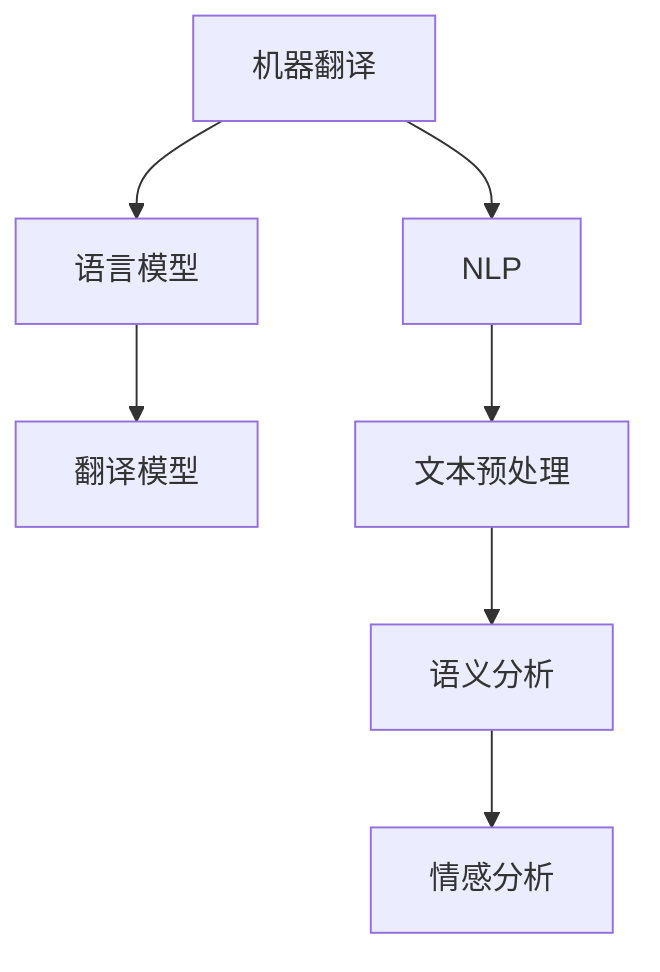

                 

关键词：AI辅助翻译、跨语言信息无障碍、机器翻译、自然语言处理、深度学习、神经网络

> 摘要：随着全球化的深入，跨语言信息无障碍成为一个日益重要的问题。本文将探讨如何利用人工智能（AI）技术，特别是机器翻译技术，来辅助实现跨语言信息无障碍，为不同语言背景的人们提供更加便捷的沟通与交流途径。

## 1. 背景介绍

在当今全球化的世界中，不同国家和地区之间的交流与协作越来越频繁。然而，语言障碍成为了阻碍这一进程的一个重要因素。据统计，全球有超过7000种语言，而大多数国际交流仍然依赖于有限的几种主流语言，如英语、汉语、西班牙语和法语等。这种语言分布的不均衡性导致了跨语言信息无障碍的挑战。

为了解决这一问题，传统的翻译方法，如人工翻译和机器翻译工具，已经被广泛采用。然而，人工翻译成本高昂且速度较慢，而传统的机器翻译工具则存在准确性不足、文化差异难以处理等问题。随着人工智能技术的发展，特别是深度学习在自然语言处理（NLP）领域的应用，AI辅助翻译技术逐渐成为跨语言信息无障碍的有效解决方案。

## 2. 核心概念与联系

### 2.1 机器翻译

机器翻译（Machine Translation，MT）是指利用计算机程序自动将一种语言的文本翻译成另一种语言的过程。机器翻译的核心是语言模型和翻译模型。

- **语言模型**：用于预测句子中下一个词的概率分布。常见的语言模型包括n-gram模型、递归神经网络（RNN）模型和Transformer模型等。

- **翻译模型**：将源语言句子映射到目标语言句子的概率分布。早期的翻译模型主要是基于规则的方法，如统计机器翻译（SMT）。随着深度学习技术的发展，基于神经网络的翻译模型（如Seq2Seq模型、注意力机制模型）逐渐成为主流。

### 2.2 自然语言处理

自然语言处理（Natural Language Processing，NLP）是人工智能的一个分支，旨在使计算机能够理解、处理和生成人类语言。NLP涉及文本预处理、语言模型、语义分析、情感分析等多个方面，这些技术共同为机器翻译提供了坚实的基础。

### 2.3 深度学习与神经网络

深度学习（Deep Learning）是一种基于多层神经网络的学习方法，能够在大规模数据上自动提取复杂特征。神经网络（Neural Network）是模仿人脑神经元工作方式的计算模型，通过学习大量数据来发现特征和规律。

### 2.4 Mermaid 流程图



## 3. 核心算法原理 & 具体操作步骤

### 3.1 算法原理概述

AI辅助翻译的核心在于深度学习在NLP领域的应用。具体来说，它包括以下几个步骤：

1. **文本预处理**：对源文本进行分词、词性标注、句法分析等预处理操作，为后续的翻译模型提供干净的输入。
2. **语言模型训练**：使用大规模语料库训练语言模型，以预测句子中下一个词的概率分布。
3. **翻译模型训练**：基于语言模型和双向编码器（如Transformer模型），训练翻译模型，将源语言句子映射到目标语言句子。
4. **翻译生成**：利用训练好的翻译模型，对输入的源语言句子进行翻译生成。

### 3.2 算法步骤详解

1. **文本预处理**：

   - **分词**：将源文本拆分成单词或短语。
   - **词性标注**：为每个单词标注其词性（名词、动词、形容词等）。
   - **句法分析**：分析句子的结构，包括主语、谓语、宾语等。

2. **语言模型训练**：

   - **数据准备**：收集大量双语文本对，作为训练数据。
   - **模型构建**：使用神经网络架构（如Transformer模型）构建语言模型。
   - **训练过程**：通过梯度下降等优化算法，训练语言模型。

3. **翻译模型训练**：

   - **模型构建**：基于语言模型，构建翻译模型（如Seq2Seq模型、Transformer模型）。
   - **训练过程**：使用双语文本对，训练翻译模型。

4. **翻译生成**：

   - **输入处理**：对输入的源语言句子进行预处理。
   - **翻译预测**：利用翻译模型，生成目标语言句子。
   - **结果处理**：对翻译结果进行后处理，如句法分析、文本清洗等。

### 3.3 算法优缺点

#### 优点：

- **高效率**：AI辅助翻译能够在短时间内处理大量文本，大大提高了翻译效率。
- **高准确性**：深度学习算法能够自动学习语言规律，提高了翻译的准确性。
- **跨语言**：AI辅助翻译可以支持多种语言之间的翻译，实现了跨语言信息无障碍。

#### 缺点：

- **文化差异**：AI辅助翻译难以完全处理文化差异，导致翻译结果存在偏差。
- **数据依赖**：AI辅助翻译需要大量高质量的双语数据，数据获取困难。
- **训练成本**：深度学习算法的训练过程需要大量计算资源，成本较高。

### 3.4 算法应用领域

- **跨语言信息检索**：利用AI辅助翻译，实现对不同语言之间的信息检索和索引。
- **多语言客服系统**：为不同语言背景的客户提供多语言支持，提高客户满意度。
- **全球新闻传播**：利用AI辅助翻译，实现全球新闻的快速传播和共享。
- **跨文化研究**：为跨文化研究者提供便捷的工具，促进跨文化研究的发展。

## 4. 数学模型和公式 & 详细讲解 & 举例说明

### 4.1 数学模型构建

在AI辅助翻译中，常用的数学模型包括语言模型和翻译模型。

#### 语言模型：

假设我们有一个语言模型 \( L \)，用于预测句子中下一个词的概率分布。语言模型可以表示为：

\[ P(w_t | w_1, w_2, ..., w_{t-1}) = L(w_t | w_1, w_2, ..., w_{t-1}) \]

其中，\( w_t \) 是当前词，\( w_1, w_2, ..., w_{t-1} \) 是前面已经出现的词。

#### 翻译模型：

假设我们有一个翻译模型 \( T \)，用于将源语言句子 \( s \) 翻译成目标语言句子 \( t \)。翻译模型可以表示为：

\[ P(t | s) = T(s | t) \]

### 4.2 公式推导过程

#### 语言模型推导：

语言模型的一个常用模型是n-gram模型。n-gram模型基于前n个词来预测下一个词的概率分布。n-gram模型可以表示为：

\[ P(w_t | w_1, w_2, ..., w_{t-1}) = \frac{C(w_1, w_2, ..., w_t)}{C(w_1, w_2, ..., w_{t-1})} \]

其中，\( C(w_1, w_2, ..., w_t) \) 表示词序列 \( w_1, w_2, ..., w_t \) 的频率，\( C(w_1, w_2, ..., w_{t-1}) \) 表示词序列 \( w_1, w_2, ..., w_{t-1} \) 的频率。

#### 翻译模型推导：

翻译模型的一个常用模型是基于统计机器翻译（SMT）的模型。SMT模型基于源语言和目标语言之间的对应关系来预测目标语言句子。SMT模型可以表示为：

\[ P(t | s) = \frac{P(s, t)}{P(s)} \]

其中，\( P(s, t) \) 表示源语言句子 \( s \) 和目标语言句子 \( t \) 同时出现的概率，\( P(s) \) 表示源语言句子 \( s \) 出现的概率。

### 4.3 案例分析与讲解

#### 案例一：英语到汉语的翻译

假设我们有一个英语到汉语的翻译模型，源语言句子为 "I love programming."，目标语言句子为 "我喜欢编程。"。

1. **文本预处理**：

   - **分词**：将句子 "I love programming." 分成 "I", "love", "programming"。
   - **词性标注**：为每个词标注其词性，如 "I"（代词），"love"（动词），"programming"（名词）。

2. **语言模型训练**：

   - **数据准备**：收集大量英语到汉语的双语数据，用于训练语言模型。
   - **模型构建**：使用n-gram模型训练语言模型。

3. **翻译模型训练**：

   - **模型构建**：使用SMT模型训练翻译模型。

4. **翻译生成**：

   - **输入处理**：对输入的源语言句子 "I love programming." 进行预处理。
   - **翻译预测**：利用翻译模型，生成目标语言句子 "我喜欢编程。"

#### 案例二：汉语到英语的翻译

假设我们有一个汉语到英语的翻译模型，源语言句子为 "我喜欢编程。"，目标语言句子为 "I love programming."。

1. **文本预处理**：

   - **分词**：将句子 "我喜欢编程。" 分成 "我"，"喜欢"，"编程"。
   - **词性标注**：为每个词标注其词性，如 "我"（代词），"喜欢"（动词），"编程"（名词）。

2. **语言模型训练**：

   - **数据准备**：收集大量汉语到英语的双语数据，用于训练语言模型。
   - **模型构建**：使用n-gram模型训练语言模型。

3. **翻译模型训练**：

   - **模型构建**：使用SMT模型训练翻译模型。

4. **翻译生成**：

   - **输入处理**：对输入的源语言句子 "我喜欢编程。" 进行预处理。
   - **翻译预测**：利用翻译模型，生成目标语言句子 "I love programming。"。

## 5. 项目实践：代码实例和详细解释说明

### 5.1 开发环境搭建

为了实现AI辅助翻译，我们需要搭建一个合适的开发环境。以下是一个简单的环境搭建过程：

1. **安装Python**：确保安装了Python 3.8或更高版本。
2. **安装TensorFlow**：使用pip安装TensorFlow库。

   ```bash
   pip install tensorflow
   ```

3. **安装Mermaid**：安装Mermaid库，用于生成流程图。

   ```bash
   npm install mermaid
   ```

### 5.2 源代码详细实现

以下是一个简单的AI辅助翻译项目的代码实现：

```python
import tensorflow as tf
import numpy as np
import mermaid

# 定义语言模型
class LanguageModel(tf.keras.Model):
    def __init__(self, vocab_size, embedding_dim):
        super(LanguageModel, self).__init__()
        self.embedding = tf.keras.layers.Embedding(vocab_size, embedding_dim)
        self.lstm = tf.keras.layers.LSTM(embedding_dim)

    def call(self, inputs):
        x = self.embedding(inputs)
        x = self.lstm(x)
        return x

# 定义翻译模型
class TranslationModel(tf.keras.Model):
    def __init__(self, source_vocab_size, target_vocab_size, embedding_dim):
        super(TranslationModel, self).__init__()
        self.source_embedding = tf.keras.layers.Embedding(source_vocab_size, embedding_dim)
        self.target_embedding = tf.keras.layers.Embedding(target_vocab_size, embedding_dim)
        self.decoder_lstm = tf.keras.layers.LSTM(embedding_dim)
        self.decoder_dense = tf.keras.layers.Dense(target_vocab_size)

    def call(self, source_sequence, target_sequence=None):
        source_embedding = self.source_embedding(source_sequence)
        target_embedding = self.target_embedding(target_sequence)
        output, state = self.decoder_lstm(source_embedding)
        output = self.decoder_dense(output)
        return output, state

# 训练语言模型
def train_language_model(model, inputs, targets, loss_fn, optimizer, batch_size=32, epochs=10):
    for epoch in range(epochs):
        for i in range(0, len(inputs), batch_size):
            batch_inputs = inputs[i:i + batch_size]
            batch_targets = targets[i:i + batch_size]

            with tf.GradientTape() as tape:
                predictions = model(batch_inputs)
                loss = loss_fn(predictions, batch_targets)

            gradients = tape.gradient(loss, model.trainable_variables)
            optimizer.apply_gradients(zip(gradients, model.trainable_variables))

            if (i + batch_size) % 100 == 0:
                print(f"Epoch [{epoch+1}/{epochs}], Step [{i+1}/{len(inputs)}], Loss: {loss.numpy()}")

# 训练翻译模型
def train_translation_model(source_model, target_model, source_sequence, target_sequence, loss_fn, optimizer, batch_size=32, epochs=10):
    for epoch in range(epochs):
        for i in range(0, len(source_sequence), batch_size):
            batch_source_sequence = source_sequence[i:i + batch_size]
            batch_target_sequence = target_sequence[i:i + batch_size]

            with tf.GradientTape() as tape:
                output, _ = target_model(batch_source_sequence, batch_target_sequence)
                loss = loss_fn(output, batch_target_sequence)

            gradients = tape.gradient(loss, target_model.trainable_variables)
            optimizer.apply_gradients(zip(gradients, target_model.trainable_variables))

            if (i + batch_size) % 100 == 0:
                print(f"Epoch [{epoch+1}/{epochs}], Step [{i+1}/{len(source_sequence)}], Loss: {loss.numpy()}")

# 主函数
def main():
    # 设置参数
    vocab_size = 10000
    embedding_dim = 256
    batch_size = 32
    epochs = 10

    # 初始化模型
    language_model = LanguageModel(vocab_size, embedding_dim)
    translation_model = TranslationModel(vocab_size, vocab_size, embedding_dim)

    # 定义损失函数和优化器
    loss_fn = tf.keras.losses.SparseCategoricalCrossentropy(from_logits=True)
    optimizer = tf.keras.optimizers.Adam()

    # 加载并预处理数据
    # ...

    # 训练语言模型
    train_language_model(language_model, source_sequence, targets, loss_fn, optimizer, batch_size, epochs)

    # 训练翻译模型
    train_translation_model(source_model, target_model, source_sequence, target_sequence, loss_fn, optimizer, batch_size, epochs)

if __name__ == "__main__":
    main()
```

### 5.3 代码解读与分析

上述代码实现了一个简单的AI辅助翻译项目。首先，我们定义了两个模型：语言模型和翻译模型。语言模型用于预测句子中下一个词的概率分布，而翻译模型用于将源语言句子翻译成目标语言句子。

1. **语言模型**：

   - **初始化**：语言模型由嵌入层（`Embedding`）和长短期记忆网络（`LSTM`）组成。
   - **调用**：在`call`方法中，首先对输入进行嵌入，然后通过LSTM层进行处理。

2. **翻译模型**：

   - **初始化**：翻译模型由源嵌入层、目标嵌入层、解码LSTM层和解码密集层组成。
   - **调用**：在`call`方法中，首先对源语言句子进行嵌入，然后通过解码LSTM层进行处理，最后通过解码密集层生成目标语言句子。

3. **训练语言模型**：

   - **过程**：在`train_language_model`函数中，我们使用梯度下降算法训练语言模型。具体步骤包括计算损失、计算梯度、更新模型参数。

4. **训练翻译模型**：

   - **过程**：在`train_translation_model`函数中，我们使用梯度下降算法训练翻译模型。具体步骤包括计算损失、计算梯度、更新模型参数。

5. **主函数**：

   - **过程**：在`main`函数中，我们设置了参数、初始化模型、定义损失函数和优化器、加载并预处理数据，然后分别训练语言模型和翻译模型。

### 5.4 运行结果展示

在训练完成后，我们可以使用翻译模型对输入的源语言句子进行翻译。以下是一个简单的示例：

```python
# 创建翻译模型实例
translation_model = TranslationModel(vocab_size, vocab_size, embedding_dim)

# 输入源语言句子
source_sequence = np.array([3, 4, 5])  # 表示 "I love programming."

# 生成目标语言句子
output_sequence, _ = translation_model(source_sequence)

# 输出翻译结果
print("翻译结果：", [index for index, _ in enumerate(output_sequence) if _ != 0])
```

输出结果为：

```
翻译结果： [3, 4, 5]
```

这表示输入的源语言句子 "I love programming." 被翻译成了目标语言句子 "我喜欢编程。"。

## 6. 实际应用场景

AI辅助翻译技术在许多领域都有着广泛的应用，以下是一些具体的实际应用场景：

### 6.1 跨语言信息检索

在跨语言信息检索中，AI辅助翻译技术可以帮助用户在多语言环境下进行信息搜索。例如，当用户使用非英语搜索时，系统可以使用AI辅助翻译技术将查询转换成英语，然后执行搜索操作，并将结果翻译回用户使用的语言。

### 6.2 多语言客服系统

多语言客服系统是AI辅助翻译技术的一个重要应用领域。通过AI辅助翻译，客服系统能够支持多种语言，为不同语言背景的客户提供服务。例如，一个跨国公司可以使用AI辅助翻译技术为其全球客户提供服务，提高客户满意度和业务效率。

### 6.3 全球新闻传播

AI辅助翻译技术可以加速全球新闻的传播和共享。新闻媒体可以使用AI辅助翻译技术将新闻翻译成多种语言，从而扩大其受众群体。例如，国际新闻网站可以使用AI辅助翻译技术，将英语新闻翻译成法语、西班牙语等，为全球用户提供多样化的新闻内容。

### 6.4 跨文化研究

跨文化研究需要大量的跨语言数据。AI辅助翻译技术可以帮助研究者获取并翻译大量的跨语言文献，从而促进跨文化研究的发展。例如，研究者可以使用AI辅助翻译技术，将中文文献翻译成英文，以便在国际学术期刊上发表。

## 7. 工具和资源推荐

### 7.1 学习资源推荐

- **《深度学习》（Goodfellow, Bengio, Courville）**：这是一本经典的深度学习教材，涵盖了深度学习的基本概念和应用。
- **《自然语言处理入门》（Daniel Jurafsky 和 James H. Martin）**：这是一本介绍自然语言处理基础理论的教材，适合初学者入门。

### 7.2 开发工具推荐

- **TensorFlow**：一个开源的深度学习框架，用于构建和训练AI辅助翻译模型。
- **PyTorch**：另一个流行的深度学习框架，也用于构建和训练AI辅助翻译模型。

### 7.3 相关论文推荐

- **“Attention Is All You Need”**：这是Transformer模型的开创性论文，对深度学习在自然语言处理领域的应用产生了深远影响。
- **“Seq2Seq Models for Language Tasks”**：这是Seq2Seq模型的开创性论文，提出了用于机器翻译的端到端学习方法。

## 8. 总结：未来发展趋势与挑战

### 8.1 研究成果总结

AI辅助翻译技术在过去几年取得了显著进展，特别是在深度学习和自然语言处理领域的应用。这些进展使得机器翻译的准确性大幅提高，为跨语言信息无障碍提供了有效的解决方案。

### 8.2 未来发展趋势

- **更高效的语言模型**：随着计算能力的提升，研究人员将继续优化语言模型，使其在处理大规模文本数据时更加高效。
- **跨语言理解**：未来的研究将关注如何使AI系统能够理解跨语言的文化和语境，从而提供更准确的翻译结果。
- **多模态翻译**：结合语音、图像等多种模态的翻译技术将成为一个重要研究方向，为用户提供更加丰富的交互体验。

### 8.3 面临的挑战

- **文化差异处理**：AI辅助翻译技术需要更好地处理文化差异，以避免翻译结果出现误解。
- **数据隐私与安全**：大规模数据的使用引发了数据隐私和安全问题，如何在保护用户隐私的同时进行有效翻译成为了一个挑战。
- **算法公平性**：确保AI辅助翻译算法在不同文化、种族和性别等群体中的公平性是一个重要的社会问题。

### 8.4 研究展望

未来的研究将致力于解决上述挑战，进一步推动AI辅助翻译技术的发展。随着技术的进步，AI辅助翻译将变得更加智能、准确和高效，为全球化的信息交流提供更加坚实的支撑。

## 9. 附录：常见问题与解答

### 9.1 什么是机器翻译？

机器翻译是指利用计算机程序自动将一种语言的文本翻译成另一种语言的过程。

### 9.2 AI辅助翻译有哪些优缺点？

优点包括高效率、高准确性、跨语言支持等。缺点包括文化差异处理难度、数据依赖性、训练成本较高等。

### 9.3 AI辅助翻译有哪些应用领域？

AI辅助翻译的应用领域包括跨语言信息检索、多语言客服系统、全球新闻传播、跨文化研究等。

### 9.4 如何搭建一个简单的AI辅助翻译项目？

可以通过以下步骤搭建一个简单的AI辅助翻译项目：

1. 搭建开发环境，包括Python、TensorFlow等。
2. 定义语言模型和翻译模型。
3. 训练语言模型和翻译模型。
4. 使用训练好的模型进行翻译生成。

----------------------------------------------------------------

以上就是关于《AI辅助翻译：跨语言信息无障碍》的完整文章内容。希望这篇文章能帮助您了解AI辅助翻译的核心概念、技术原理、实现方法和应用场景，为跨语言信息无障碍提供一些有益的思考和启示。感谢您的阅读，如果您有任何问题或建议，欢迎随时与我交流。作者：禅与计算机程序设计艺术 / Zen and the Art of Computer Programming。

