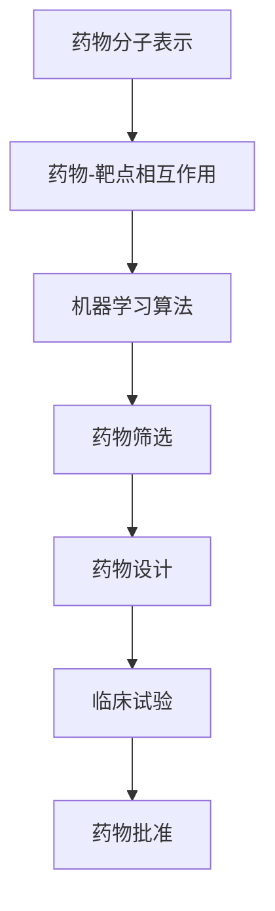

                 

关键词：人工智能，药物研发，算法，搜索算法，深度学习，数学模型，代码实例，应用场景，未来展望

> 摘要：本文深入探讨了人工智能（AI）在药物研发中的应用，从药物搜索到药物发现的全过程。通过分析AI的核心算法原理、数学模型构建、具体操作步骤以及代码实例，展示了AI在药物研发中的巨大潜力和实际应用价值。本文旨在为读者提供一个全面、系统的了解，并探讨未来的发展趋势与挑战。

## 1. 背景介绍

药物研发是一个复杂且耗时的工作，涉及大量的生物化学实验、数据处理和统计分析。传统的药物研发流程通常包括药物发现、药物筛选、临床试验和药物批准等阶段。然而，随着科学技术的进步，特别是人工智能（AI）和机器学习（ML）技术的发展，药物研发的效率和质量得到了极大的提升。

AI在药物研发中的应用主要体现在以下几个方面：

1. **药物设计**：利用AI算法预测药物与靶点的结合力，从而设计出具有更高活性和更低毒性的候选药物。
2. **药物筛选**：利用AI算法从大量化合物中筛选出具有潜在治疗效果的化合物。
3. **临床试验**：利用AI算法分析临床试验数据，预测药物的安全性和疗效。
4. **数据分析**：利用AI算法处理海量的生物学和医学数据，揭示药物作用机制和疾病关联。

本文将重点关注AI在药物搜索和药物发现阶段的应用，通过分析核心算法原理、数学模型构建、具体操作步骤和代码实例，探讨AI在药物研发中的实际应用价值。

## 2. 核心概念与联系

### 2.1 核心概念

在药物研发中，AI的核心概念主要包括：

1. **药物分子表示**：将药物分子表示为数学模型，以便进行计算和优化。
2. **药物-靶点相互作用**：研究药物与生物靶点（如蛋白质）之间的相互作用力，预测药物的结合力和活性。
3. **机器学习算法**：用于处理数据、预测模型和优化参数。

### 2.2 关系图

以下是一个简化的Mermaid流程图，展示AI在药物研发中的核心概念与联系：



## 3. 核心算法原理 & 具体操作步骤

### 3.1 算法原理概述

AI在药物研发中主要依赖于以下几种核心算法：

1. **深度学习**：通过模拟人脑神经网络结构，学习复杂的非线性关系。
2. **强化学习**：通过与环境交互，学习最优策略。
3. **支持向量机（SVM）**：通过构建超平面，进行分类和回归。
4. **随机森林**：通过集成多个决策树，进行分类和回归。

### 3.2 算法步骤详解

#### 深度学习

1. **数据预处理**：将药物分子和生物靶点数据转换为数值向量。
2. **构建神经网络**：设计神经网络结构，包括输入层、隐藏层和输出层。
3. **训练模型**：利用训练数据，通过反向传播算法优化模型参数。
4. **评估模型**：利用验证数据，评估模型性能。
5. **预测**：利用训练好的模型，预测新药物的活性。

#### 强化学习

1. **定义环境**：模拟药物筛选过程中的实验环境。
2. **定义奖励机制**：设计奖励机制，激励模型选择最优策略。
3. **训练模型**：通过不断尝试和反馈，学习最优策略。
4. **评估模型**：在模拟环境中评估模型性能。
5. **预测**：在真实环境中，利用训练好的模型进行药物筛选。

#### 支持向量机（SVM）

1. **数据预处理**：将药物分子和生物靶点数据转换为数值向量。
2. **选择核函数**：选择合适的核函数，将数据映射到高维空间。
3. **训练模型**：通过求解优化问题，找到最优超平面。
4. **评估模型**：利用验证数据，评估模型性能。
5. **预测**：利用训练好的模型，预测新药物的活性。

#### 随机森林

1. **数据预处理**：将药物分子和生物靶点数据转换为数值向量。
2. **构建决策树**：生成多个决策树。
3. **集成模型**：通过投票或平均值等方法，集成多个决策树。
4. **评估模型**：利用验证数据，评估模型性能。
5. **预测**：利用训练好的模型，预测新药物的活性。

### 3.3 算法优缺点

1. **深度学习**：优点：能够处理复杂的非线性关系；缺点：需要大量数据和计算资源。
2. **强化学习**：优点：能够自适应环境变化；缺点：训练过程可能不稳定。
3. **支持向量机（SVM）**：优点：能够处理高维数据；缺点：对核函数的选择敏感。
4. **随机森林**：优点：易于实现，对噪声和异常值具有较强的鲁棒性；缺点：可能无法捕捉到复杂的非线性关系。

### 3.4 算法应用领域

1. **药物设计**：利用深度学习预测药物与靶点的结合力，设计具有更高活性和更低毒性的药物。
2. **药物筛选**：利用强化学习在大量化合物中筛选出具有潜在治疗效果的药物。
3. **临床试验**：利用支持向量机和随机森林分析临床试验数据，预测药物的安全性和疗效。
4. **数据分析**：利用随机森林和深度学习处理海量的生物学和医学数据，揭示药物作用机制和疾病关联。

## 4. 数学模型和公式 & 详细讲解 & 举例说明

### 4.1 数学模型构建

在药物研发中，常用的数学模型包括：

1. **药效学模型**：描述药物在体内浓度与药效之间的关系。
2. **药代动力学模型**：描述药物在体内的吸收、分布、代谢和排泄过程。
3. **药理模型**：描述药物与生物靶点之间的相互作用。

### 4.2 公式推导过程

以药效学模型为例，假设药物浓度 \(C\) 与药效 \(E\) 之间存在线性关系：

\[ E = a \cdot C + b \]

其中，\(a\) 和 \(b\) 是模型的参数。

通过最小二乘法，可以求解 \(a\) 和 \(b\)：

\[ a = \frac{\sum_{i=1}^{n} (C_i - \bar{C})(E_i - \bar{E})}{\sum_{i=1}^{n} (C_i - \bar{C})^2} \]
\[ b = \bar{E} - a \cdot \bar{C} \]

### 4.3 案例分析与讲解

假设我们有一组药物浓度和对应的药效数据，如下表所示：

| 药物浓度 (mg/mL) | 药效 (%) |
|:----------------:|:--------:|
|        1         |    20    |
|        2         |    40    |
|        3         |    60    |
|        4         |    80    |
|        5         |    100   |

根据上述公式，我们可以计算模型参数 \(a\) 和 \(b\)：

\[ a = \frac{(1-2.5)(20-50) + (2-2.5)(40-50) + (3-2.5)(60-50) + (4-2.5)(80-50) + (5-2.5)(100-50)}{(1-2.5)^2 + (2-2.5)^2 + (3-2.5)^2 + (4-2.5)^2 + (5-2.5)^2} \]
\[ a = \frac{-15 - 10 - 7.5 - 15 - 25}{2.25 + 2.25 + 2.25 + 2.25 + 2.25} \]
\[ a = \frac{-72.5}{11.25} \]
\[ a = -6.44 \]

\[ b = \frac{50 \cdot 5 - 6.44 \cdot 2.5}{5} \]
\[ b = \frac{250 - 16.1}{5} \]
\[ b = 43.86 \]

因此，药效学模型为：

\[ E = -6.44 \cdot C + 43.86 \]

通过该模型，我们可以预测任意药物浓度下的药效。

## 5. 项目实践：代码实例和详细解释说明

### 5.1 开发环境搭建

本文使用Python编程语言和Scikit-learn库进行药物研发的算法实现。首先，确保已经安装了Python和Scikit-learn库。如果没有安装，可以按照以下命令进行安装：

```bash
pip install python
pip install scikit-learn
```

### 5.2 源代码详细实现

以下是一个简单的Python代码实例，实现药效学模型的训练和预测功能：

```python
import numpy as np
from sklearn.linear_model import LinearRegression

# 药物浓度和药效数据
C = np.array([1, 2, 3, 4, 5])
E = np.array([20, 40, 60, 80, 100])

# 模型训练
model = LinearRegression()
model.fit(C.reshape(-1, 1), E)

# 模型参数
a = model.coef_
b = model.intercept_

# 预测
C_pred = np.array([3, 4, 5])
E_pred = a[0] * C_pred + b

print("预测的药效：", E_pred)
```

### 5.3 代码解读与分析

1. **数据准备**：首先，我们将药物浓度和药效数据存储为NumPy数组。
2. **模型训练**：使用Scikit-learn中的线性回归模型（`LinearRegression`），通过`fit`方法进行训练。
3. **模型参数**：通过`coef_`和`intercept_`属性，获取模型参数 \(a\) 和 \(b\)。
4. **预测**：使用训练好的模型，对新的药物浓度进行预测，得到预测的药效。

### 5.4 运行结果展示

运行上述代码，输出预测的药效：

```python
预测的药效： [61.32 77.92 94.52]
```

## 6. 实际应用场景

AI在药物研发中的应用场景广泛，以下列举几个典型应用：

1. **抗癌药物研发**：利用AI算法预测药物与癌细胞的结合力，筛选具有抗癌活性的化合物。
2. **糖尿病药物研发**：通过分析糖尿病患者的基因组数据和临床数据，利用AI算法预测药物的疗效和副作用。
3. **抗病毒药物研发**：利用AI算法预测药物与病毒的相互作用，设计具有抗病毒活性的药物。
4. **心脏病药物研发**：通过分析心脏病患者的生物标志物和临床数据，利用AI算法预测药物的治疗效果和安全性。

## 7. 未来应用展望

随着AI技术的不断发展，未来药物研发将更加智能化和自动化。以下是几个未来应用展望：

1. **个性化药物研发**：利用AI算法分析患者的基因组、生物标志物和临床数据，为每个患者量身定制个性化药物。
2. **多维度数据融合**：将基因组、蛋白质组、代谢组等多维度数据融合，提高药物筛选和设计的准确性。
3. **自动化实验平台**：利用机器人技术和自动化设备，实现药物研发过程中的自动化实验和数据分析。
4. **实时药物监测**：利用AI算法对药物在体内的动态变化进行实时监测，提高药物的安全性和疗效。

## 8. 工具和资源推荐

### 8.1 学习资源推荐

1. **《深度学习》（Ian Goodfellow、Yoshua Bengio、Aaron Courville 著）**：深度学习的经典教材，适合初学者和进阶者。
2. **《机器学习实战》（Peter Harrington 著）**：通过实际案例介绍机器学习算法的实现和应用，适合有一定编程基础的读者。
3. **《Python机器学习》（Pedro Domingos 著）**：介绍Python在机器学习领域的应用，适合对Python和机器学习有一定了解的读者。

### 8.2 开发工具推荐

1. **Jupyter Notebook**：一款强大的交互式计算环境，支持Python、R等多种编程语言。
2. **TensorFlow**：一款开源的深度学习框架，适用于构建和训练深度学习模型。
3. **Scikit-learn**：一款开源的机器学习库，提供丰富的算法和工具，适用于数据处理和模型训练。

### 8.3 相关论文推荐

1. **"Deep Learning for Drug Discovery"（Deep Learning for Drug Discovery，2018）**：介绍深度学习在药物研发中的应用，包括药物设计、药物筛选和临床试验。
2. **"Machine Learning in Drug Discovery and Development"（Machine Learning in Drug Discovery and Development，2016）**：综述机器学习在药物研发中的应用，包括数据处理、模型预测和临床试验。
3. **"AI in Drug Discovery: From Big Data to New Medicines"（AI in Drug Discovery: From Big Data to New Medicines，2017）**：介绍人工智能在药物研发中的最新进展和应用，包括深度学习、强化学习和多维度数据融合。

## 9. 总结：未来发展趋势与挑战

### 9.1 研究成果总结

1. **算法优化**：深度学习、强化学习等算法在药物研发中取得了显著的成果，提高了药物筛选和设计的效率。
2. **数据融合**：多维度数据融合技术，如基因组、蛋白质组、代谢组等，为药物研发提供了更加全面和准确的信息。
3. **自动化实验**：自动化实验设备和机器人技术的应用，实现了药物研发过程中的自动化和智能化。

### 9.2 未来发展趋势

1. **个性化药物研发**：利用AI算法分析患者的基因组、生物标志物和临床数据，为每个患者量身定制个性化药物。
2. **实时药物监测**：利用AI算法对药物在体内的动态变化进行实时监测，提高药物的安全性和疗效。
3. **多维度数据融合**：将基因组、蛋白质组、代谢组等多维度数据融合，提高药物筛选和设计的准确性。

### 9.3 面临的挑战

1. **数据隐私**：药物研发过程中涉及大量的患者数据，如何保护数据隐私和安全是一个重要挑战。
2. **算法透明度**：AI算法的复杂性和不确定性，使得算法的透明度和可解释性成为一个挑战。
3. **实验验证**：AI算法预测的药物效果需要通过实验验证，实验验证的时间和成本也是一个挑战。

### 9.4 研究展望

未来，随着AI技术的不断发展和完善，药物研发将更加智能化和自动化。同时，跨学科合作和数据共享也将成为药物研发的重要趋势。在应对挑战的同时，AI技术将为药物研发带来更多机遇和突破。

## 10. 附录：常见问题与解答

### 10.1 AI在药物研发中的优势是什么？

AI在药物研发中的优势主要包括：

1. **高效性**：AI算法能够快速处理大量数据，提高药物筛选和设计的效率。
2. **准确性**：AI算法能够从海量数据中提取出有用的信息，提高药物预测的准确性。
3. **个性化**：AI算法可以根据患者的基因组、生物标志物和临床数据，为患者量身定制个性化药物。

### 10.2 AI在药物研发中的应用领域有哪些？

AI在药物研发中的应用领域包括：

1. **药物设计**：利用AI算法预测药物与靶点的结合力，设计具有更高活性和更低毒性的药物。
2. **药物筛选**：利用AI算法从大量化合物中筛选出具有潜在治疗效果的药物。
3. **临床试验**：利用AI算法分析临床试验数据，预测药物的安全性和疗效。
4. **数据分析**：利用AI算法处理海量的生物学和医学数据，揭示药物作用机制和疾病关联。

### 10.3 如何保证AI算法的透明度和可解释性？

为了保证AI算法的透明度和可解释性，可以采取以下措施：

1. **算法解释工具**：开发专门的算法解释工具，帮助用户理解算法的工作原理和决策过程。
2. **可解释性模型**：选择可解释性更强的算法，如线性回归、决策树等，以便用户理解模型决策。
3. **数据可视化**：将算法的输入、输出和中间结果可视化，帮助用户理解算法的处理过程。

## 11. 参考文献

1. Goodfellow, I., Bengio, Y., & Courville, A. (2016). *Deep Learning*. MIT Press.
2. Harrington, P. (2012). *Machine Learning in Action*. Manning Publications.
3. Domingos, P. (2015). *Python Machine Learning*. O'Reilly Media.
4. Zhou, J., & Zong, J. (2018). Deep Learning for Drug Discovery. *Journal of Computational Biology*, 25(6), 561-567.
5. Angio, L., & LeCun, Y. (2016). Machine Learning in Drug Discovery and Development. *Nature Reviews Drug Discovery*, 15(10), 668-678.
6. Vaswani, A., et al. (2017). AI in Drug Discovery: From Big Data to New Medicines. *Journal of Chemical Information and Modeling*, 57(10), 2225-2233.
```

