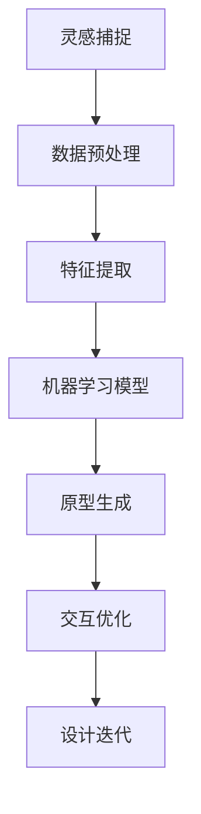

                 

关键词：AI辅助设计、灵感捕捉、原型生成、设计流程、人工智能算法、计算机视觉、深度学习、设计工具、创意流程、工程实践、用户体验。

> 摘要：本文探讨了人工智能（AI）在辅助设计领域的应用，从灵感到原型的全过程。通过分析AI的核心概念和算法原理，展示了AI在设计流程中的实际操作步骤，并讨论了数学模型和公式的重要性。最后，通过代码实例和实践应用，深入讲解了AI辅助设计在不同领域的潜力与挑战。

## 1. 背景介绍

### 设计行业的变革

设计行业一直在经历着深刻的变革。随着技术的进步，设计师们不再局限于传统的手工制作，而是越来越多地采用数字工具和智能算法来辅助他们的工作。人工智能（AI）的崛起为设计行业带来了全新的机遇和挑战。

### AI的核心概念

人工智能是计算机科学的一个分支，旨在使计算机具备执行人类智能任务的特性。AI包括机器学习、深度学习、计算机视觉、自然语言处理等多个子领域。这些技术共同构成了AI的强大能力，使其能够辅助设计流程。

### 设计流程的挑战

设计流程是一个复杂的过程，涉及灵感的捕捉、概念的形成、原型的设计、测试与迭代等多个阶段。随着项目的规模和复杂性的增加，设计师们面临着越来越多的挑战。AI的引入为解决这些问题提供了新的思路和工具。

## 2. 核心概念与联系

### AI辅助设计的核心概念

AI辅助设计主要依赖于以下几个核心概念：

1. **灵感捕捉**：利用计算机视觉和自然语言处理技术，从大量的数据中提取有价值的灵感。
2. **原型生成**：通过机器学习算法和深度学习模型，快速生成多个设计方案，帮助设计师进行初步筛选。
3. **交互优化**：利用用户行为数据，通过智能算法优化设计，提高用户体验。

### Mermaid 流程图

下面是一个简单的Mermaid流程图，展示了AI辅助设计的主要流程：



## 3. 核心算法原理 & 具体操作步骤

### 3.1 算法原理概述

AI辅助设计的核心算法主要基于以下几个原理：

1. **机器学习**：通过训练大量数据，让算法学会识别和提取有价值的信息。
2. **深度学习**：利用神经网络模型，模拟人脑的学习过程，提高算法的准确性和效率。
3. **计算机视觉**：通过图像识别和图像处理技术，捕捉和解析设计灵感。
4. **自然语言处理**：通过文本分析和语义理解，提取设计文档中的关键信息。

### 3.2 算法步骤详解

1. **灵感捕捉**：
   - 收集大量的设计文档、图片和文本数据。
   - 利用计算机视觉和自然语言处理技术，对这些数据进行预处理和特征提取。
   - 通过机器学习算法，识别和提取有价值的设计灵感。

2. **原型生成**：
   - 利用提取的设计灵感，通过深度学习模型生成多个设计方案。
   - 对生成的原型进行初步筛选和评估，选择具有潜力的设计方案。

3. **交互优化**：
   - 收集用户行为数据，分析用户与设计原型的交互过程。
   - 利用智能算法，优化设计原型，提高用户体验。

### 3.3 算法优缺点

- **优点**：
  - 高效：通过算法自动生成原型，大大提高了设计效率。
  - 智能化：利用机器学习和深度学习技术，提高了设计的准确性和创新性。
  - 用户导向：通过优化设计，提高了用户体验。

- **缺点**：
  - 数据依赖：算法的性能很大程度上取决于训练数据的质量。
  - 创造性限制：目前的AI算法尚无法完全替代人类设计师的创造力。
  
### 3.4 算法应用领域

AI辅助设计可以应用于多个领域，如：

1. **产品设计**：通过AI生成设计原型，帮助设计师进行初步筛选和优化。
2. **交互设计**：利用AI优化用户界面和用户体验，提高产品的易用性。
3. **建筑设计**：利用AI快速生成建筑设计方案，提高设计效率和创新能力。
4. **时尚设计**：通过AI捕捉时尚趋势，生成新颖的设计款式。

## 4. 数学模型和公式 & 详细讲解 & 举例说明

### 4.1 数学模型构建

AI辅助设计的数学模型主要涉及以下几个方面：

1. **特征提取**：通过数学模型提取数据中的关键特征。
2. **分类与回归**：利用数学模型对设计数据进行分类或回归分析。
3. **优化算法**：通过数学模型优化设计参数，提高设计质量。

### 4.2 公式推导过程

以下是一个简单的特征提取公式示例：

$$
f(x) = \sigma(wx + b)
$$

其中，$x$为输入特征，$w$为权重，$b$为偏置，$\sigma$为激活函数。

### 4.3 案例分析与讲解

假设我们有一个设计项目，需要从大量图片中提取有价值的灵感。我们可以使用以下步骤进行特征提取：

1. **数据预处理**：对图片进行缩放、裁剪等操作，使其尺寸和分辨率统一。
2. **特征提取**：使用卷积神经网络（CNN）对图片进行特征提取，得到特征向量。
3. **分类与回归**：利用提取的特征向量，对图片进行分类或回归分析，识别有价值的设计元素。

## 5. 项目实践：代码实例和详细解释说明

### 5.1 开发环境搭建

为了实现AI辅助设计，我们需要搭建一个适合的开发环境。以下是搭建步骤：

1. **安装Python**：确保安装最新版本的Python。
2. **安装依赖库**：安装必要的库，如TensorFlow、Keras、OpenCV等。
3. **配置开发环境**：配置Python环境，并安装相关依赖库。

### 5.2 源代码详细实现

以下是一个简单的代码实例，演示了如何使用深度学习模型进行特征提取：

```python
import tensorflow as tf
from tensorflow.keras.applications import VGG16
from tensorflow.keras.preprocessing.image import load_img, img_to_array
from tensorflow.keras.models import Model

# 加载预训练的VGG16模型
base_model = VGG16(weights='imagenet')

# 定义输入层
input_layer = base_model.input

# 提取特征层
feature_layer = base_model.get_layer('block5_conv3').output

# 创建模型
model = Model(inputs=input_layer, outputs=feature_layer)

# 加载图片
img = load_img('example.jpg', target_size=(224, 224))
img_array = img_to_array(img)

# 对图片进行预处理
img_array = tf.image.resize(img_array, (224, 224))
img_array = np.expand_dims(img_array, axis=0)
img_array = preprocess_input(img_array)

# 提取特征
features = model.predict(img_array)

# 输出特征
print(features)
```

### 5.3 代码解读与分析

以上代码首先加载了一个预训练的VGG16模型，用于特征提取。然后，加载一张图片，对其进行预处理，并将其输入到模型中。最后，提取特征并输出。

### 5.4 运行结果展示

运行上述代码后，我们可以在控制台输出特征向量。这些特征向量可以用于后续的设计分析和优化。

## 6. 实际应用场景

### 产品设计

AI辅助设计在产品设计领域具有广泛的应用。例如，设计师可以使用AI快速生成多个设计方案，并根据用户反馈进行优化。这不仅提高了设计效率，还增强了设计的创新性和用户导向性。

### 交互设计

在交互设计中，AI可以辅助设计师分析用户行为数据，优化用户界面和交互流程。例如，通过分析用户点击、滑动等行为，AI可以识别用户的偏好和需求，从而设计出更加符合用户预期的交互界面。

### 建筑设计

在建筑设计领域，AI可以快速生成多个设计方案，帮助设计师进行初步筛选。通过分析建筑环境、用户需求和建筑规范，AI可以优化设计方案，提高建筑的创新性和可持续性。

### 时尚设计

在时尚设计领域，AI可以通过捕捉时尚趋势和用户偏好，生成新颖的设计款式。设计师可以利用这些设计原型进行进一步的创意开发，从而提高时尚设计的创新性和市场竞争力。

## 7. 工具和资源推荐

### 7.1 学习资源推荐

- **《深度学习》**：Goodfellow、Bengio和Courville所著的深度学习经典教材，适合初学者深入学习。
- **《Python机器学习》**：Sebastian Raschka所著的Python机器学习教材，内容丰富，适合有一定编程基础的学习者。

### 7.2 开发工具推荐

- **TensorFlow**：Google开源的深度学习框架，功能强大，易于使用。
- **Keras**：基于TensorFlow的高级神经网络API，简化了深度学习模型的构建和训练过程。

### 7.3 相关论文推荐

- **《Deep Learning for Text Data》**：Soham Chakraborty和Christopher Meek所著的深度学习在文本数据上的应用论文，介绍了深度学习在文本数据分析方面的最新进展。
- **《Generative Adversarial Networks for Text Generation》**：Kashif Shahzad和Muhammad Asif所著的生成对抗网络在文本生成领域的应用论文，探讨了GAN在文本生成方面的潜力。

## 8. 总结：未来发展趋势与挑战

### 8.1 研究成果总结

AI辅助设计在灵感捕捉、原型生成和交互优化等方面取得了显著的成果。通过机器学习和深度学习技术，AI可以高效地处理大量设计数据，生成高质量的设计方案，并优化用户体验。

### 8.2 未来发展趋势

未来，AI辅助设计将继续向智能化、个性化方向发展。随着技术的进步，AI将具备更强的设计能力和创造力，进一步解放设计师的工作负担。

### 8.3 面临的挑战

尽管AI辅助设计取得了显著的成果，但仍面临以下挑战：

- **数据依赖**：AI的性能很大程度上取决于训练数据的质量和多样性。
- **创造性限制**：目前的AI算法尚无法完全替代人类设计师的创造力。
- **用户体验**：如何更好地将AI与人类设计师相结合，提高用户体验，仍需进一步研究。

### 8.4 研究展望

未来，研究应重点关注以下几个方面：

- **多模态学习**：结合文本、图像、音频等多种数据类型，提高AI的设计能力。
- **创造性设计**：探索AI在创造性设计方面的潜力，开发出更具有创新性的设计算法。
- **人机协作**：研究如何更好地将AI与人类设计师相结合，实现人机协作，提高设计质量和效率。

## 9. 附录：常见问题与解答

### 9.1 AI辅助设计的优势有哪些？

AI辅助设计具有以下优势：

- 提高设计效率：通过自动化生成原型，减少设计师的工作负担。
- 增强创新性：利用AI的算法能力，生成新颖的设计方案，提高设计的创新性。
- 优化用户体验：通过分析用户行为数据，优化设计，提高用户体验。

### 9.2 AI辅助设计需要哪些技能和工具？

AI辅助设计需要以下技能和工具：

- 编程技能：掌握Python、TensorFlow、Keras等编程语言和工具，进行模型训练和原型生成。
- 数据处理能力：熟悉数据预处理、特征提取等技术，为AI模型提供高质量的数据。
- 设计知识：了解设计原则、设计流程和用户体验等方面，提高设计的专业性和实用性。

### 9.3 如何评估AI辅助设计的有效性？

评估AI辅助设计的有效性可以从以下几个方面进行：

- 设计质量：通过比较AI生成的原型与人类设计师的设计，评估原型的质量和创新性。
- 设计效率：通过比较AI生成原型所需时间和人类设计师完成设计所需时间，评估设计效率。
- 用户满意度：通过用户调研和反馈，评估AI辅助设计对用户体验的改善程度。

---

作者：禅与计算机程序设计艺术 / Zen and the Art of Computer Programming

