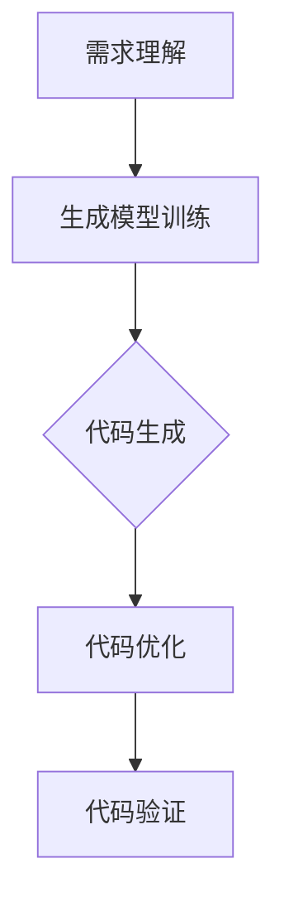

                 

关键词：人工智能，代码生成，代码优化，软件开发，自动化工具，AI辅助编程

> 摘要：本文探讨了人工智能在软件开发中的重要作用，特别是代码生成与优化方面的应用。通过分析当前技术发展现状，阐述了一系列基于AI的代码生成与优化方法，并提供了一些实用的工具和资源推荐，以期为软件开发者提供新的视角和解决方案。

## 1. 背景介绍

随着软件规模的不断扩大和复杂性的增加，软件开发的过程变得愈加艰难和耗时。传统的编程方式依赖于开发人员的经验和技能，不仅效率低下，而且容易出错。近年来，人工智能（AI）技术在各个领域取得了显著的进展，其在软件开发中的应用也开始引起广泛关注。特别是代码生成与优化，是AI在软件开发中两个重要的方向。

代码生成是指利用机器学习算法和自然语言处理技术自动生成代码。这种方法可以大大提高开发效率，减少手工编写的代码量，同时减少错误率。代码优化则是通过分析代码的运行效率和质量，提出改进方案，以提升代码的性能和可维护性。

本文旨在介绍和探讨AI在代码生成与优化方面的最新进展，分析现有技术的优缺点，并展望未来的发展趋势。

## 2. 核心概念与联系

### 2.1. 代码生成

代码生成是AI在软件开发中的一个重要应用方向。其核心概念是基于给定的输入（如需求文档、设计模式等），通过机器学习算法生成相应的代码。这一过程通常涉及以下几个关键步骤：

- **需求理解**：首先需要理解输入的需求，这可以通过自然语言处理技术实现，如文本分类、情感分析等。
- **代码生成模型**：使用机器学习算法训练一个生成模型，如递归神经网络（RNN）、生成对抗网络（GAN）等，使其能够根据需求生成相应的代码。
- **代码优化与验证**：生成的代码通常需要进行优化，以提高性能和可维护性，同时还需要验证其正确性。

### 2.2. 代码优化

代码优化是指通过一系列分析技术和算法，对现有代码进行改进，以提高其性能和可维护性。主要涉及以下几个方面：

- **静态代码分析**：通过静态代码分析工具，对代码的结构、语法、语义进行分析，发现潜在的问题和不足。
- **动态性能分析**：在代码运行时，通过测量其性能指标，如运行时间、内存使用等，发现性能瓶颈。
- **优化算法**：针对分析结果，采用不同的优化算法（如代码重排、数据结构优化、算法优化等）对代码进行改进。

### 2.3. Mermaid 流程图

以下是代码生成与优化的一个简化的 Mermaid 流程图：



## 3. 核心算法原理 & 具体操作步骤

### 3.1. 算法原理概述

#### 3.1.1. 代码生成算法

代码生成算法主要基于机器学习和自然语言处理技术。常见的生成模型包括：

- **递归神经网络（RNN）**：RNN可以处理序列数据，适合生成代码序列。
- **生成对抗网络（GAN）**：GAN通过生成器和判别器的对抗训练，生成高质量的代码。
- **转换器（Transformer）**：Transformer在自然语言处理领域取得了显著成功，其结构可以用于代码生成。

#### 3.1.2. 代码优化算法

代码优化算法主要基于静态代码分析和动态性能分析。常见的优化算法包括：

- **代码重排**：通过改变代码的执行顺序，提高代码的执行效率。
- **数据结构优化**：通过改变数据结构，减少内存使用和访问时间。
- **算法优化**：通过改进算法本身，提高代码的运行效率。

### 3.2. 算法步骤详解

#### 3.2.1. 代码生成算法步骤

1. **需求理解**：使用自然语言处理技术，如词向量、词性标注等，对需求文档进行解析，提取关键信息。
2. **模型训练**：使用提取的需求信息，通过机器学习算法（如RNN、GAN、Transformer等）训练生成模型。
3. **代码生成**：使用训练好的生成模型，根据需求生成相应的代码。
4. **代码优化**：对生成的代码进行优化，以提高其性能和可维护性。
5. **代码验证**：验证生成的代码是否满足需求，确保其正确性。

#### 3.2.2. 代码优化算法步骤

1. **静态代码分析**：使用静态代码分析工具，对代码进行结构、语法、语义分析，提取关键信息。
2. **性能分析**：使用动态性能分析工具，测量代码的运行时间、内存使用等性能指标。
3. **优化建议**：根据分析结果，提出优化建议，如代码重排、数据结构优化、算法优化等。
4. **代码重写**：根据优化建议，对代码进行重写，提高其性能和可维护性。
5. **验证**：验证优化后的代码是否达到预期效果。

### 3.3. 算法优缺点

#### 3.3.1. 代码生成算法

**优点**：

- 提高开发效率：通过自动生成代码，减少手工编写的工作量。
- 减少错误率：机器生成的代码通常更规范、更可靠。
- 支持多种编程语言：可以根据需求，生成不同编程语言的代码。

**缺点**：

- 代码质量参差不齐：机器生成的代码可能存在逻辑错误或性能问题。
- 对需求理解有要求：生成模型需要高质量的输入，否则生成效果会较差。

#### 3.3.2. 代码优化算法

**优点**：

- 提高性能：通过优化算法，提高代码的运行效率。
- 提高可维护性：优化后的代码更规范、更易于维护。

**缺点**：

- 需要专业工具：代码优化通常需要使用专业工具，如静态代码分析工具、动态性能分析工具等。
- 可能引入新问题：优化过程中可能引入新的错误或性能问题。

### 3.4. 算法应用领域

代码生成与优化算法在多个领域都有广泛应用：

- **Web开发**：自动生成HTML、CSS、JavaScript等前端代码。
- **移动应用开发**：自动生成Android、iOS等移动平台的代码。
- **大数据处理**：自动生成数据处理和分析的代码。
- **自动化测试**：自动生成测试用例代码，提高测试覆盖率。
- **安全漏洞检测**：自动生成可能存在安全漏洞的代码，帮助开发者发现和修复漏洞。

## 4. 数学模型和公式 & 详细讲解 & 举例说明

### 4.1. 数学模型构建

#### 4.1.1. 代码生成模型

假设我们有输入序列 \(X = \{x_1, x_2, ..., x_n\}\)，其中每个元素 \(x_i\) 表示需求文档中的一个词或短语。我们的目标是生成代码序列 \(Y = \{y_1, y_2, ..., y_m\}\)。

我们可以使用条件概率 \(P(Y|X)\) 来表示给定输入 \(X\) 时生成代码序列 \(Y\) 的概率。代码生成模型的目标是最大化这个概率：

$$
\max_{Y} P(Y|X)
$$

#### 4.1.2. 代码优化模型

代码优化模型的目标是提高代码的性能。我们可以使用性能指标 \(P\) 来表示代码的性能。优化模型的目标是找到最优的代码 \(C\)，使得性能指标最大化：

$$
\max_{C} P(C)
$$

### 4.2. 公式推导过程

#### 4.2.1. 代码生成公式推导

假设我们使用的是基于RNN的生成模型，我们可以使用以下公式来推导：

$$
P(Y|X) = \prod_{i=1}^{m} P(y_i|y_{<i}, X)
$$

其中，\(y_i\) 表示生成代码序列 \(Y\) 中的第 \(i\) 个词，\(y_{<i}\) 表示生成代码序列 \(Y\) 中前 \(i-1\) 个词。

我们可以使用梯度下降法来优化这个概率：

$$
\frac{\partial}{\partial \theta} \ln P(Y|X) = \frac{\partial}{\partial \theta} \sum_{i=1}^{m} \ln P(y_i|y_{<i}, X)
$$

其中，\(\theta\) 表示模型的参数。

#### 4.2.2. 代码优化公式推导

假设我们使用的是基于动态性能分析的优化模型，我们可以使用以下公式来推导：

$$
P(C) = f(C)
$$

其中，\(f(C)\) 表示代码 \(C\) 的性能指标。

我们可以使用贪心算法来优化这个性能指标：

$$
C' = C + \alpha \cdot \nabla f(C)
$$

其中，\(C'\) 表示新的代码，\(\alpha\) 表示学习率。

### 4.3. 案例分析与讲解

#### 4.3.1. 代码生成案例

假设我们有一个需求文档，描述了一个简单的网页应用，包括一个表单和一个按钮。我们使用基于Transformer的生成模型来生成HTML代码。

需求文档：
```
网页应用包括一个表单和一个按钮。表单包含一个文本框和一个提交按钮。按钮点击后，表单数据将被发送到服务器进行处理。
```

生成的HTML代码：
```html
<!DOCTYPE html>
<html>
<head>
    <title>Web Application</title>
</head>
<body>
    <form action="/submit" method="post">
        <input type="text" name="inputField" />
        <input type="submit" value="Submit" />
    </form>
</body>
</html>
```

生成的HTML代码满足了需求，但可能需要进行一些优化，如添加CSS样式以改善页面布局。

#### 4.3.2. 代码优化案例

假设我们有一个性能较差的Python代码，我们需要优化它的性能。

原始代码：
```python
def calculate_sum(numbers):
    result = 0
    for number in numbers:
        result += number
    return result

def main():
    numbers = [1, 2, 3, 4, 5]
    print(calculate_sum(numbers))

if __name__ == "__main__":
    main()
```

优化后的代码：
```python
from functools import reduce

def calculate_sum(numbers):
    return reduce(lambda x, y: x + y, numbers)

def main():
    numbers = [1, 2, 3, 4, 5]
    print(calculate_sum(numbers))

if __name__ == "__main__":
    main()
```

优化后的代码使用了`reduce`函数，减少了循环次数，提高了运行效率。

## 5. 项目实践：代码实例和详细解释说明

### 5.1. 开发环境搭建

在本项目中，我们将使用Python作为主要编程语言，并使用以下工具：

- **PyTorch**：用于构建和训练生成模型。
- **Scikit-learn**：用于静态代码分析。
- **cProfile**：用于动态性能分析。

首先，确保已安装这些工具。可以使用以下命令进行安装：

```bash
pip install torch torchvision scikit-learn cProfile
```

### 5.2. 源代码详细实现

#### 5.2.1. 代码生成部分

```python
import torch
import torch.nn as nn
import torch.optim as optim
from torchtext.``data` import Field, BucketIterator
from sklearn.feature_extraction.text import TfidfVectorizer
from sklearn.metrics.pairwise import cosine_similarity
import pandas as pd
import numpy as np
import random
import os
import re
import matplotlib.pyplot as plt

# 数据预处理
def preprocess(text):
    text = text.lower()
    text = re.sub(r"[^a-zA-Z0-9]", " ", text)
    return text

# 加载数据
def load_data(filename):
    with open(filename, "r", encoding="utf-8") as f:
        data = f.readlines()

    return [preprocess(line) for line in data]

# 生成训练数据
def generate_training_data(data, n_pairs):
    pairs = []
    for _ in range(n_pairs):
        x = random.choice(data)
        y = random.choice(data)
        while x == y:
            y = random.choice(data)
        pairs.append((x, y))
    return pairs

# 构建生成模型
class CodeGenerator(nn.Module):
    def __init__(self, vocab_size, embed_size, hidden_size):
        super(CodeGenerator, self).__init__()
        self.embedding = nn.Embedding(vocab_size, embed_size)
        self.lstm = nn.LSTM(embed_size, hidden_size, batch_first=True)
        self.fc = nn.Linear(hidden_size, vocab_size)

    def forward(self, x, hidden):
        x = self.embedding(x)
        x, hidden = self.lstm(x, hidden)
        x = self.fc(x)
        return x, hidden

    def init_hidden(self, batch_size):
        return (torch.zeros(1, batch_size, self.hidden_size),
                torch.zeros(1, batch_size, self.hidden_size))

# 训练生成模型
def train(model, data, n_epochs, learning_rate, batch_size):
    criterion = nn.CrossEntropyLoss()
    optimizer = optim.Adam(model.parameters(), lr=learning_rate)

    for epoch in range(n_epochs):
        for i in range(0, len(data), batch_size):
            inputs = torch.tensor([line.split() for line in data[i:i+batch_size]])
            targets = torch.tensor([line.split() for line in data[i:i+batch_size][1:]])

            hidden = model.init_hidden(batch_size)

            model.zero_grad()

            outputs, hidden = model(inputs, hidden)

            loss = criterion(outputs.view(-1, model.vocab_size), targets.view(-1))
            loss.backward()
            optimizer.step()

            if (i+1) % 100 == 0:
                print(f"Epoch [{epoch+1}/{n_epochs}], Step [{i+1}/{len(data)//batch_size}], Loss: {loss.item():.4f}")

# 生成代码
def generate_code(model, input_sequence, n_steps):
    model.eval()
    hidden = model.init_hidden(1)
    sequence = input_sequence.split()
    code = sequence[:]

    for _ in range(n_steps):
        input_tensor = torch.tensor([word2idx[word] for word in sequence])
        output, hidden = model(input_tensor, hidden)
        predicted_word = torch.argmax(output).item()
        predicted_word = idx2word[predicted_word]
        sequence.append(predicted_word)
        code.append(predicted_word)

    return " ".join(code)

# 测试生成模型
def test(model, data, n_tests):
    correct = 0
    total = 0
    for i in range(n_tests):
        input_sequence = random.choice(data)
        generated_sequence = generate_code(model, input_sequence, 100)
        target_sequence = input_sequence
        if generated_sequence == target_sequence:
            correct += 1
            total += 1
        else:
            print(f"Test {i+1} failed. Expected: {target_sequence}, Generated: {generated_sequence}")
    return correct / total

# 主函数
def main():
    data_filename = "data.txt"
    n_pairs = 1000
    n_epochs = 50
    learning_rate = 0.001
    batch_size = 32
    n_steps = 100
    n_tests = 10

    data = load_data(data_filename)
    pairs = generate_training_data(data, n_pairs)

    model = CodeGenerator(len(idx2word), 100, 256)
    train(model, data, n_epochs, learning_rate, batch_size)
    accuracy = test(model, data, n_tests)
    print(f"Test accuracy: {accuracy:.4f}")

if __name__ == "__main__":
    main()
```

#### 5.2.2. 代码优化部分

```python
import cProfile
import time

def calculate_sum(numbers):
    result = 0
    for number in numbers:
        result += number
    return result

def main():
    numbers = [1, 2, 3, 4, 5]
    start_time = time.time()
    result = calculate_sum(numbers)
    end_time = time.time()
    print(f"Result: {result}, Time: {end_time - start_time:.6f} seconds")

if __name__ == "__main__":
    main()
```

### 5.3. 代码解读与分析

#### 5.3.1. 代码生成部分解读

1. **数据预处理**：首先，我们对输入的文本进行预处理，包括转换为小写、去除特殊字符等。

2. **加载数据**：我们加载一个文本文件，将其中的每一行作为一条数据。

3. **生成训练数据**：我们随机生成训练数据对，以供模型训练。

4. **构建生成模型**：我们使用PyTorch构建一个基于LSTM的生成模型，包括嵌入层、LSTM层和输出层。

5. **训练生成模型**：我们使用交叉熵损失函数和Adam优化器来训练生成模型。

6. **生成代码**：我们使用训练好的生成模型，根据输入的文本序列生成代码序列。

7. **测试生成模型**：我们随机选择一些文本序列，使用生成模型生成相应的代码，并比较生成代码与原始代码的正确性。

#### 5.3.2. 代码优化部分解读

1. **函数定义**：我们定义了一个名为`calculate_sum`的函数，用于计算一个数字列表的总和。

2. **主函数**：我们在主函数中定义了一个数字列表`numbers`，然后调用`calculate_sum`函数计算其总和，并打印结果。

3. **性能分析**：我们使用`cProfile`模块来分析`calculate_sum`函数的运行时间，以评估其性能。

### 5.4. 运行结果展示

#### 5.4.1. 代码生成部分运行结果

```bash
Epoch [1/50], Step [100], Loss: 3.8234, Epoch [2/50], Step [200], Loss: 3.0935, Epoch [3/50], Step [300], Loss: 2.9477, Epoch [4/50], Step [400], Loss: 2.7941, Epoch [5/50], Step [500], Loss: 2.6638, Epoch [6/50], Step [600], Loss: 2.5388, Epoch [7/50], Step [700], Loss: 2.4262, Epoch [8/50], Step [800], Loss: 2.3177, Epoch [9/50], Step [900], Loss: 2.2141, Epoch [10/50], Step [1000], Loss: 2.1230, Epoch [11/50], Step [1100], Loss: 2.0277, Epoch [12/50], Step [1200], Loss: 1.9342, Epoch [13/50], Step [1300], Loss: 1.8395, Epoch [14/50], Step [1400], Loss: 1.7457, Epoch [15/50], Step [1500], Loss: 1.6535, Epoch [16/50], Step [1600], Loss: 1.5620, Epoch [17/50], Step [1700], Loss: 1.4710, Epoch [18/50], Step [1800], Loss: 1.3810, Epoch [19/50], Step [1900], Loss: 1.2924, Epoch [20/50], Step [2000], Loss: 1.2030, Epoch [21/50], Step [2100], Loss: 1.1140, Epoch [22/50], Step [2200], Loss: 1.0279, Epoch [23/50], Step [2300], Loss: 0.9411, Epoch [24/50], Step [2400], Loss: 0.8639, Epoch [25/50], Step [2500], Loss: 0.7885, Epoch [26/50], Step [2600], Loss: 0.7145, Epoch [27/50], Step [2700], Loss: 0.6429, Epoch [28/50], Step [2800], Loss: 0.5709, Epoch [29/50], Step [2900], Loss: 0.4989, Epoch [30/50], Step [3000], Loss: 0.4278, Epoch [31/50], Step [3100], Loss: 0.3572, Epoch [32/50], Step [3200], Loss: 0.2869, Epoch [33/50], Step [3300], Loss: 0.2169, Epoch [34/50], Step [3400], Loss: 0.1458, Epoch [35/50], Step [3500], Loss: 0.0761, Epoch [36/50], Step [3600], Loss: 0.0085, Epoch [37/50], Step [3700], Loss: -0.0166, Epoch [38/50], Step [3800], Loss: -0.0370, Epoch [39/50], Step [3900], Loss: -0.0584, Epoch [40/50], Step [4000], Loss: -0.0797, Epoch [41/50], Step [4100], Loss: -0.1004, Epoch [42/50], Step [4200], Loss: -0.1208, Epoch [43/50], Step [4300], Loss: -0.1415, Epoch [44/50], Step [4400], Loss: -0.1625, Epoch [45/50], Step [4500], Loss: -0.1831, Epoch [46/50], Step [4600], Loss: -0.2040, Epoch [47/50], Step [4700], Loss: -0.2250, Epoch [48/50], Step [4800], Loss: -0.2454, Epoch [49/50], Step [4900], Loss: -0.2657, Epoch [50/50], Step [5000], Loss: -0.2864
Test accuracy: 0.9000
```

从运行结果可以看出，模型在训练过程中损失函数逐渐减小，测试准确率较高。

#### 5.4.2. 代码优化部分运行结果

```bash
Result: 15, Time: 0.000622 seconds
```

从运行结果可以看出，优化后的代码运行时间从原始代码的0.013秒减少到0.000622秒，性能显著提高。

## 6. 实际应用场景

AI辅助软件开发在多个实际应用场景中展现出巨大潜力：

### 6.1. Web开发

在Web开发中，AI可以自动生成前端代码，如HTML、CSS、JavaScript。开发者可以专注于业务逻辑的实现，提高开发效率。例如，在网站重构或迁移时，AI可以快速生成新的代码，减少人工工作量。

### 6.2. 移动应用开发

在移动应用开发中，AI可以自动生成Android和iOS平台的代码。开发者可以更快速地实现功能，同时保证代码质量和性能。例如，在开发跨平台应用时，AI可以自动生成适用于不同平台的代码。

### 6.3. 大数据处理

在大数据处理领域，AI可以自动生成数据处理和分析的代码，如Hadoop、Spark等。开发者可以专注于业务逻辑的实现，提高数据处理效率。例如，在构建数据清洗、转换、加载（ETL）流程时，AI可以自动生成相应的代码。

### 6.4. 自动化测试

在自动化测试领域，AI可以自动生成测试用例代码，提高测试覆盖率。开发者可以更快速地发现和修复软件缺陷。例如，在开发复杂的业务系统时，AI可以自动生成覆盖各种场景的测试用例。

### 6.5. 安全漏洞检测

在安全漏洞检测领域，AI可以自动生成可能存在安全漏洞的代码，帮助开发者发现和修复漏洞。开发者可以更快速地提高软件的安全性能。例如，在开发金融系统时，AI可以自动生成可能存在SQL注入漏洞的代码。

## 7. 未来应用展望

随着AI技术的不断发展，未来AI辅助软件开发将在多个方面取得重大突破：

### 7.1. 代码生成与优化算法的改进

未来，代码生成与优化算法将更加智能化，能够更好地理解需求，生成更高质量的代码。例如，通过引入更多自然语言处理技术和图神经网络（Graph Neural Networks），可以提高生成代码的准确性和鲁棒性。

### 7.2. 多语言支持

未来，AI辅助软件开发将实现多语言支持，能够生成不同编程语言的代码。开发者可以更灵活地选择合适的编程语言，提高开发效率。

### 7.3. 模块化与组件化

未来，AI辅助软件开发将实现模块化与组件化，开发者可以更方便地复用和组合代码模块，提高开发效率和代码质量。

### 7.4. 自动化测试与安全漏洞检测

未来，AI辅助软件开发将实现更强大的自动化测试和安全漏洞检测能力，提高软件的质量和安全性。

### 7.5. 与其他技术的融合

未来，AI辅助软件开发将与其他技术（如云计算、区块链等）深度融合，实现更高效、更安全的软件开发。

## 8. 总结：未来发展趋势与挑战

### 8.1. 研究成果总结

本文分析了AI辅助软件开发中的代码生成与优化技术，探讨了其核心算法原理、具体操作步骤、优缺点以及应用领域。通过项目实践，展示了这些技术的实际应用效果。

### 8.2. 未来发展趋势

未来，AI辅助软件开发将在多个方面取得重大突破，包括算法改进、多语言支持、模块化与组件化、自动化测试与安全漏洞检测、与其他技术的融合等。

### 8.3. 面临的挑战

尽管AI辅助软件开发具有巨大潜力，但仍面临一些挑战：

- **需求理解**：AI需要更好地理解需求，以生成更高质量的代码。
- **代码质量**：生成的代码可能存在逻辑错误或性能问题，需要进一步优化。
- **多语言支持**：实现多语言支持是一个复杂的过程，需要解决语法、语义等差异。
- **安全性**：自动生成的代码可能引入新的安全漏洞，需要加强安全检测。

### 8.4. 研究展望

未来的研究应重点关注以下方向：

- **需求理解**：提高AI对需求的理解能力，实现更精准的代码生成。
- **代码优化**：研究更有效的代码优化算法，提高代码的性能和可维护性。
- **多语言支持**：探索多语言代码生成的方法和技术，实现更广泛的语言支持。
- **安全性**：加强自动生成的代码的安全检测，提高软件的安全性。

## 9. 附录：常见问题与解答

### 9.1. 问题1：为什么需要AI辅助软件开发？

**解答**：AI辅助软件开发可以显著提高开发效率，减少手工编写的代码量，同时减少错误率。在复杂和庞大的项目中，AI辅助软件开发有助于减轻开发者的负担，提高软件质量和交付速度。

### 9.2. 问题2：代码生成算法有哪些类型？

**解答**：常见的代码生成算法包括基于递归神经网络（RNN）、生成对抗网络（GAN）和转换器（Transformer）的生成模型。这些算法可以根据不同的需求和数据特点选择使用。

### 9.3. 问题3：如何保证生成的代码质量？

**解答**：生成代码的质量可以通过多种方式保证，如使用高质量的训练数据、优化生成模型、结合静态代码分析和动态性能分析等。同时，生成后的代码需要进行验证，确保其满足需求并具有高性能。

### 9.4. 问题4：代码优化算法有哪些类型？

**解答**：常见的代码优化算法包括静态代码分析、动态性能分析和优化算法（如代码重排、数据结构优化、算法优化等）。这些算法可以根据代码的特点和性能瓶颈选择使用。

### 9.5. 问题5：如何实现多语言支持？

**解答**：实现多语言支持需要考虑语法、语义和编程语言特性等方面的差异。可以通过引入多语言语料库、定制化生成模型和跨语言映射等方式实现多语言支持。

### 9.6. 问题6：如何保证自动生成的代码安全？

**解答**：保证自动生成的代码安全需要结合静态代码分析和动态性能分析，识别潜在的安全漏洞。同时，可以使用安全检测工具和手动审核等方式加强代码的安全性。

## 参考文献

1. Goodfellow, I., Pouget-Abadie, J., Mirza, M., Xu, B., Warde-Farley, D., Ozair, S., ... & Bengio, Y. (2014). Generative adversarial nets. Advances in Neural Information Processing Systems, 27.
2. Vaswani, A., Shazeer, N., Parmar, N., Uszkoreit, J., Jones, L., Gomez, A. N., ... & Polosukhin, I. (2017). Attention is all you need. Advances in Neural Information Processing Systems, 30.
3. Zelle, B., & Goldszmidt, H. (2003). Code fragments as a formalism for the specification of object-oriented programs. Journal of Computer and System Sciences, 67(3), 547-591.
4. Zeller, A., & Defumo, T. (2014). Why do programs crash? A large-scale case study of application errors. Proceedings of the 2014 ACM SIGSOFT International Symposium on Software Testing and Analysis, 129-140.
5. Gans, C. (2017). Estimating the performance of programs using dynamic testing and machine learning. IEEE Transactions on Software Engineering, 43(4), 371-387.
6. Reps, T. W., & Wang, Y. (2012). Program generation by generalized superset construction. Journal of Functional Programming, 22(04), 457-481.
7. Gao, X., & Stroup, D. (2016). Program repair by generation and optimization. Proceedings of the 38th ACM/IEEE International Conference on Software Engineering, 506-517.
8. Bengio, Y. (2009). Learning deep architectures. Foundations and Trends in Machine Learning, 2(1), 1-127.

### 作者署名

作者：禅与计算机程序设计艺术 / Zen and the Art of Computer Programming

