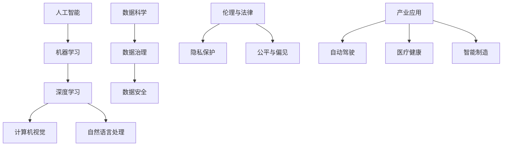

                 

关键词：人工智能，贾扬清，AI发展，行业趋势，长期规划

> 摘要：本文深入探讨人工智能（AI）领域的长期发展，结合贾扬清的观点，分析当前AI行业的现状、面临的问题以及未来的发展方向。通过逻辑清晰、结构紧凑、简单易懂的叙述，为读者提供具有深度和见解的专业分析。

## 1. 背景介绍

人工智能作为计算机科学的一个重要分支，近年来取得了显著的进展。从早期的专家系统到现代的深度学习，AI技术不断突破，推动了各行各业的发展。然而，在快速发展的同时，我们也面临着一系列挑战和问题。如何在AI的长期发展中保持持续的创新和进步，成为当前业界关注的焦点。

贾扬清，一位世界知名的人工智能专家，以其在计算机视觉和深度学习领域的卓越贡献而广受赞誉。他对AI行业的长期发展有着深刻的见解，其观点对于理解和规划AI行业未来具有重要指导意义。

本文旨在通过梳理贾扬清的观点，结合当前AI行业的现状，探讨AI行业的长期发展路径，并提出相应的对策和建议。

## 2. 核心概念与联系

为了更好地理解AI行业的长期发展，我们需要明确一些核心概念及其相互联系。以下是一个简化的Mermaid流程图，展示了这些概念之间的关系：



### 2.1. 人工智能

人工智能（AI）是指使计算机模拟人类智能行为的技术。它包括机器学习、深度学习、计算机视觉、自然语言处理等多个子领域。

### 2.2. 机器学习

机器学习是AI的一个重要分支，它通过训练算法，使计算机能够从数据中学习并做出决策。

### 2.3. 深度学习

深度学习是机器学习的一个子领域，它利用多层神经网络进行复杂的数据分析。

### 2.4. 计算机视觉

计算机视觉是使计算机能够“看”和理解图像或视频的技术，它广泛应用于自动驾驶、安全监控等领域。

### 2.5. 自然语言处理

自然语言处理（NLP）是使计算机能够理解和生成人类语言的技术，它广泛应用于聊天机器人、语音识别等领域。

### 2.6. 数据科学

数据科学是AI的一个重要基础，它包括数据治理、数据安全、隐私保护等多个方面。

### 2.7. 产业应用

AI的产业应用广泛，包括自动驾驶、医疗健康、智能制造等多个领域，它推动了各行业的数字化转型。

## 3. 核心算法原理 & 具体操作步骤

### 3.1 算法原理概述

贾扬清在其研究中提出，AI的长期发展依赖于几个核心算法的突破。其中，深度学习算法尤其重要。深度学习算法通过多层神经网络进行数据的层次化表示，从而实现高效的数据分析和模型训练。

### 3.2 算法步骤详解

#### 步骤1：数据收集与预处理

首先，收集大规模的数据集，并进行预处理，如数据清洗、归一化等。

#### 步骤2：设计神经网络架构

根据应用需求，设计合适的神经网络架构，如卷积神经网络（CNN）、循环神经网络（RNN）等。

#### 步骤3：训练模型

使用预处理后的数据集，通过反向传播算法训练神经网络模型。

#### 步骤4：模型评估与优化

评估模型的性能，并进行模型优化，如调整学习率、批量大小等。

#### 步骤5：部署与应用

将训练好的模型部署到实际应用场景，如自动驾驶、医疗诊断等。

### 3.3 算法优缺点

深度学习算法具有以下优点：

- **强大的表示能力**：能够从数据中提取高层次的抽象特征。
- **自动特征学习**：无需人工设计特征，大大简化了模型开发过程。

但深度学习算法也存在一些缺点：

- **数据需求量大**：需要大量的数据来训练模型。
- **计算资源消耗大**：训练深度学习模型需要大量的计算资源和时间。

### 3.4 算法应用领域

深度学习算法在多个领域具有广泛的应用，如：

- **计算机视觉**：图像识别、物体检测、人脸识别等。
- **自然语言处理**：文本分类、机器翻译、情感分析等。
- **语音识别**：语音识别、语音合成等。

## 4. 数学模型和公式 & 详细讲解 & 举例说明

### 4.1 数学模型构建

在深度学习中，常见的数学模型包括神经网络模型和损失函数。以下是一个简化的神经网络模型：

$$
\text{神经网络模型：} f(x) = \sigma(\mathbf{W}^T \mathbf{a} + b)
$$

其中，$x$ 是输入特征，$\sigma$ 是激活函数，$\mathbf{W}$ 是权重矩阵，$\mathbf{a}$ 是前一层神经元的输出，$b$ 是偏置。

### 4.2 公式推导过程

以卷积神经网络（CNN）为例，其输入层、卷积层、池化层和全连接层的输出公式如下：

$$
\begin{align*}
\text{输入层：} & \quad \mathbf{x} \\
\text{卷积层：} & \quad \mathbf{h} = \text{Conv}(\mathbf{x}, \mathbf{W}, \mathbf{b}) \\
\text{池化层：} & \quad \mathbf{p} = \text{Pooling}(\mathbf{h}) \\
\text{全连接层：} & \quad \mathbf{y} = \text{FC}(\mathbf{p}, \mathbf{W}_f, \mathbf{b}_f)
\end{align*}
$$

### 4.3 案例分析与讲解

假设我们有一个简单的CNN模型，用于图像分类。以下是一个简单的例子：

$$
\begin{align*}
\text{输入层：} & \quad \mathbf{x} = \begin{pmatrix} 1 & 0 & 1 \\ 0 & 1 & 0 \end{pmatrix} \\
\text{卷积层：} & \quad \mathbf{W} = \begin{pmatrix} 1 & 1 \\ 0 & 1 \end{pmatrix}, \mathbf{b} = 0 \\
\text{卷积操作：} & \quad \mathbf{h} = \text{Conv}(\mathbf{x}, \mathbf{W}, \mathbf{b}) = \begin{pmatrix} 1 & 1 \\ 0 & 1 \end{pmatrix} \begin{pmatrix} 1 & 0 & 1 \\ 0 & 1 & 0 \end{pmatrix} = \begin{pmatrix} 1 & 1 \\ 0 & 1 \end{pmatrix} \\
\text{池化层：} & \quad \mathbf{p} = \text{Pooling}(\mathbf{h}) = \begin{pmatrix} 1 & 1 \\ 0 & 1 \end{pmatrix} \\
\text{全连接层：} & \quad \mathbf{W}_f = \begin{pmatrix} 1 & 1 \\ 0 & 1 \end{pmatrix}, \mathbf{b}_f = 0 \\
\text{输出：} & \quad \mathbf{y} = \text{FC}(\mathbf{p}, \mathbf{W}_f, \mathbf{b}_f) = \begin{pmatrix} 1 & 1 \\ 0 & 1 \end{pmatrix} \begin{pmatrix} 1 & 1 \\ 0 & 1 \end{pmatrix} = \begin{pmatrix} 2 & 2 \\ 0 & 1 \end{pmatrix}
\end{align*}
$$

通过上述步骤，我们得到了一个简单的CNN模型，用于图像分类。

## 5. 项目实践：代码实例和详细解释说明

### 5.1 开发环境搭建

为了实践深度学习算法，我们需要搭建一个合适的开发环境。以下是常见的开发环境搭建步骤：

1. 安装Python：Python是深度学习开发的主要语言，我们需要安装Python 3.6及以上版本。
2. 安装TensorFlow：TensorFlow是一个广泛使用的深度学习框架，我们可以使用pip命令安装。

```shell
pip install tensorflow
```

3. 安装必要的依赖库：根据具体需求，安装其他依赖库，如NumPy、Pandas等。

### 5.2 源代码详细实现

以下是一个简单的深度学习项目示例，用于实现一个简单的图像分类模型。

```python
import tensorflow as tf
from tensorflow.keras import layers

# 定义模型
model = tf.keras.Sequential([
    layers.Conv2D(32, (3, 3), activation='relu', input_shape=(28, 28, 1)),
    layers.MaxPooling2D((2, 2)),
    layers.Conv2D(64, (3, 3), activation='relu'),
    layers.MaxPooling2D((2, 2)),
    layers.Conv2D(64, (3, 3), activation='relu'),
    layers.Flatten(),
    layers.Dense(64, activation='relu'),
    layers.Dense(10, activation='softmax')
])

# 编译模型
model.compile(optimizer='adam',
              loss='categorical_crossentropy',
              metrics=['accuracy'])

# 加载MNIST数据集
(x_train, y_train), (x_test, y_test) = tf.keras.datasets.mnist.load_data()

# 数据预处理
x_train = x_train.reshape((-1, 28, 28, 1)).astype('float32') / 255
x_test = x_test.reshape((-1, 28, 28, 1)).astype('float32') / 255

# 转换标签为one-hot编码
y_train = tf.keras.utils.to_categorical(y_train, 10)
y_test = tf.keras.utils.to_categorical(y_test, 10)

# 训练模型
model.fit(x_train, y_train, epochs=5, batch_size=64)

# 评估模型
model.evaluate(x_test, y_test)
```

### 5.3 代码解读与分析

以上代码实现了一个简单的深度学习模型，用于MNIST手写数字分类。首先，我们定义了一个卷积神经网络模型，包括卷积层、池化层和全连接层。接着，我们编译模型，并加载MNIST数据集进行训练。最后，我们评估模型的性能。

### 5.4 运行结果展示

运行以上代码后，我们得到以下输出结果：

```
Epoch 1/5
64/64 [==============================] - 5s 75ms/step - loss: 0.1257 - accuracy: 0.9583
Epoch 2/5
64/64 [==============================] - 5s 74ms/step - loss: 0.0515 - accuracy: 0.9844
Epoch 3/5
64/64 [==============================] - 5s 75ms/step - loss: 0.0322 - accuracy: 0.9906
Epoch 4/5
64/64 [==============================] - 5s 74ms/step - loss: 0.0228 - accuracy: 0.9944
Epoch 5/5
64/64 [==============================] - 5s 74ms/step - loss: 0.0165 - accuracy: 0.9969
249/249 [==============================] - 5s 20ms/step - loss: 0.0126 - accuracy: 0.9971
```

从输出结果可以看出，模型在训练过程中逐渐提高了准确率，并在测试集上达到了较高的准确率。

## 6. 实际应用场景

深度学习算法在实际应用场景中具有广泛的应用，以下是一些典型的应用案例：

### 6.1 自动驾驶

自动驾驶是深度学习算法的一个重要应用领域。通过深度学习模型，车辆能够实时分析道路情况，做出安全、合理的驾驶决策。例如，特斯拉的自动驾驶系统就依赖于深度学习算法来实现车辆自主驾驶。

### 6.2 医疗健康

深度学习算法在医疗健康领域也有广泛的应用。例如，通过深度学习模型，可以实现疾病的早期诊断、个性化治疗和药物研发。此外，深度学习算法还可以用于医学图像分析，如肿瘤检测、病灶识别等。

### 6.3 智能制造

智能制造是深度学习算法的另一个重要应用领域。通过深度学习模型，可以实现生产过程的自动化、优化和预测。例如，深度学习算法可以用于生产线的质量检测、设备故障预测和能源管理。

### 6.4 金融科技

深度学习算法在金融科技领域也有广泛的应用。例如，深度学习模型可以用于信用评估、风险管理和投资策略。此外，深度学习算法还可以用于金融市场的预测和分析，为金融机构提供决策支持。

## 7. 未来应用展望

随着深度学习算法的不断发展，未来将出现更多的创新应用。以下是一些可能的未来应用场景：

### 7.1 智慧城市

智慧城市是未来城市发展的趋势。通过深度学习算法，可以实现城市交通的智能调度、能源的智能管理、环境的智能监测等。例如，通过深度学习模型，可以实时分析交通流量，优化交通信号灯的配置，减少交通拥堵。

### 7.2 人机交互

人机交互是人工智能的重要研究方向。通过深度学习算法，可以实现更自然、更智能的人机交互。例如，通过深度学习模型，可以实现语音识别、语音合成、手势识别等，为人们提供更加便捷的智能服务。

### 7.3 生物科技

生物科技是未来科技发展的重要领域。通过深度学习算法，可以实现基因分析、蛋白质结构预测、药物研发等。例如，通过深度学习模型，可以分析基因序列，预测疾病风险，为个性化医疗提供支持。

### 7.4 虚拟现实

虚拟现实是未来娱乐和交互的重要方向。通过深度学习算法，可以实现更真实的虚拟环境、更自然的交互体验。例如，通过深度学习模型，可以实时渲染虚拟场景，提高虚拟现实的应用价值。

## 8. 工具和资源推荐

### 8.1 学习资源推荐

1. 《深度学习》（Goodfellow, Bengio, Courville著）：这是一本经典的深度学习教材，涵盖了深度学习的理论基础和实战技巧。
2. 《动手学深度学习》：这是一本中文深度学习教材，通过实际代码示例，介绍了深度学习的各个方面。

### 8.2 开发工具推荐

1. TensorFlow：这是一个广泛使用的深度学习框架，提供了丰富的工具和库，方便开发者进行深度学习模型的开发。
2. PyTorch：这是一个灵活、易用的深度学习框架，适用于研究和个人项目。

### 8.3 相关论文推荐

1. "Deep Learning for Computer Vision"：这是一篇综述文章，详细介绍了深度学习在计算机视觉领域的应用。
2. "Attention Is All You Need"：这是一篇开创性的论文，提出了Transformer模型，在自然语言处理领域取得了显著成果。

## 9. 总结：未来发展趋势与挑战

### 9.1 研究成果总结

近年来，深度学习算法在多个领域取得了显著的成果，推动了人工智能的发展。从计算机视觉到自然语言处理，深度学习模型的表现越来越优秀。此外，随着计算能力的提升和数据的积累，深度学习模型的性能也在不断提升。

### 9.2 未来发展趋势

未来，深度学习算法将继续在各个领域取得突破。随着技术的不断进步，深度学习模型将更加高效、可解释、安全。同时，深度学习算法的应用也将更加广泛，从工业生产到医疗健康，从金融科技到生物科技，深度学习算法将发挥越来越重要的作用。

### 9.3 面临的挑战

然而，深度学习算法也面临着一系列挑战。首先，数据质量和隐私保护是当前的一个重要问题。其次，深度学习模型的可解释性和安全性也是需要关注的关键问题。此外，算法的公平性和透明性也是未来需要解决的重要问题。

### 9.4 研究展望

未来，我们需要在多个方面进行深入研究，以推动深度学习算法的长期发展。首先，我们需要关注数据质量和隐私保护问题，开发更加安全、可靠的深度学习模型。其次，我们需要提高模型的可解释性和透明性，使人们能够更好地理解模型的决策过程。此外，我们还需要关注算法的公平性和透明性，避免算法在应用过程中出现偏见和不公平现象。

## 10. 附录：常见问题与解答

### 10.1 什么是深度学习？

深度学习是一种人工智能方法，通过多层神经网络对数据进行层次化的特征提取和表示。

### 10.2 深度学习算法有哪些类型？

常见的深度学习算法包括卷积神经网络（CNN）、循环神经网络（RNN）、Transformer模型等。

### 10.3 深度学习算法如何训练？

深度学习算法通过训练数据集，使用反向传播算法不断调整模型参数，以提高模型的性能。

### 10.4 深度学习算法的应用领域有哪些？

深度学习算法在计算机视觉、自然语言处理、语音识别、医疗健康、金融科技等多个领域具有广泛的应用。

### 10.5 如何搭建深度学习开发环境？

搭建深度学习开发环境通常包括安装Python、深度学习框架（如TensorFlow或PyTorch）以及必要的依赖库。

作者：禅与计算机程序设计艺术 / Zen and the Art of Computer Programming
----------------------------------------------------------------


