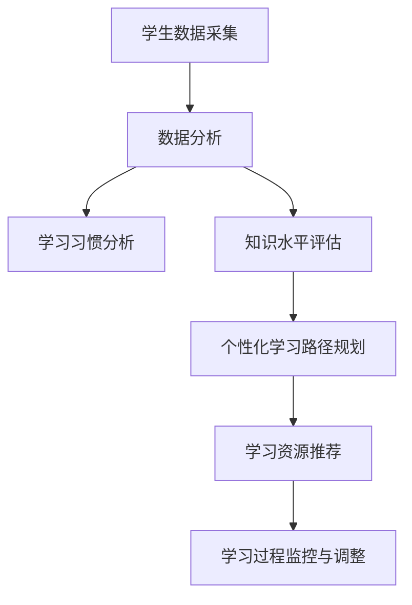

                 

关键词：人工智能，个性化学习，教育科技，机器学习，学习路径优化，数据分析

> 摘要：随着人工智能技术的飞速发展，教育领域迎来了前所未有的变革。本文将探讨AI驱动的个性化学习路径，分析其核心概念、算法原理、数学模型、实际应用和未来发展趋势，旨在为教育科技的创新提供新的思路。

## 1. 背景介绍

在教育领域，传统教学模式通常采用“一刀切”的方法，即所有学生接受相同的教学内容和方法。然而，这种方法忽略了学生之间的个体差异，导致部分学生难以适应课程节奏，学习效果不佳。个性化学习应运而生，其核心理念是根据每个学生的特点和学习需求，定制化学习路径，从而提高学习效率。

随着人工智能技术的发展，特别是机器学习、数据分析和自然语言处理等领域的突破，AI驱动的个性化学习路径成为了现实。AI能够处理和分析大量数据，了解学生的学习习惯、兴趣和知识水平，从而提供个性化的学习建议和资源，实现教育资源的最大化利用。

本文将从以下几个方面探讨AI驱动的个性化学习路径：

1. **核心概念与联系**：介绍个性化学习的基本概念和相关技术。
2. **核心算法原理与具体操作步骤**：分析AI驱动的个性化学习算法，包括其原理和实现步骤。
3. **数学模型和公式**：讨论个性化学习中的数学模型，并进行举例说明。
4. **项目实践：代码实例和详细解释说明**：通过具体项目实践，展示AI驱动的个性化学习路径的实现过程。
5. **实际应用场景**：探讨AI驱动的个性化学习在不同教育场景中的应用。
6. **未来应用展望**：预测AI驱动的个性化学习的未来发展。
7. **工具和资源推荐**：推荐学习资源和开发工具。
8. **总结：未来发展趋势与挑战**：总结研究成果，展望未来发展趋势，讨论面临的挑战。

## 2. 核心概念与联系

### 2.1 个性化学习的定义

个性化学习（Personalized Learning）是指根据每个学生的特点和需求，为其提供量身定制的学习内容和方式。这种模式强调学生是学习的主体，通过因材施教，使学生能够充分发挥自己的潜能。

### 2.2 关键技术

- **机器学习**：利用算法从大量数据中学习模式，预测学生的行为和需求。
- **数据分析**：处理和分析学生学习数据，了解学习习惯、兴趣和知识水平。
- **自然语言处理**：理解和生成自然语言，用于与学生进行交互。
- **智能推荐系统**：根据学生的学习历史和兴趣，推荐合适的学习资源。

### 2.3 Mermaid 流程图



## 3. 核心算法原理 & 具体操作步骤

### 3.1 算法原理概述

AI驱动的个性化学习算法主要包括以下几个步骤：

1. **数据收集**：收集学生的各种数据，如学习历史、测试成绩、行为记录等。
2. **特征提取**：从原始数据中提取有用的特征，如学习时长、学习频率、错误率等。
3. **模型训练**：利用机器学习算法，从特征中学习模式，建立个性化学习模型。
4. **路径规划**：根据学习模型，为学生制定个性化学习路径。
5. **推荐系统**：根据学生的学习兴趣和需求，推荐合适的学习资源。
6. **过程监控**：监控学习过程，根据反馈调整学习路径。

### 3.2 算法步骤详解

1. **数据收集**：利用多种途径收集学生学习数据，如在线平台、学习管理系统、传感器等。
2. **特征提取**：使用数据预处理技术，如归一化、降维等，提取有用的特征。
3. **模型训练**：选用合适的机器学习算法，如决策树、支持向量机、神经网络等，进行模型训练。
4. **路径规划**：根据模型预测结果，为每个学生制定个性化学习路径。
5. **推荐系统**：利用协同过滤、基于内容的推荐等技术，为学生推荐合适的学习资源。
6. **过程监控**：监控学习过程，如学习进度、学习效果等，根据反馈调整学习路径。

### 3.3 算法优缺点

**优点**：

- 提高学习效率：通过个性化学习，学生能够以自己的节奏学习，提高学习效率。
- 优化教育资源：个性化学习能够根据学生的需求推荐资源，实现教育资源的最大化利用。
- 激发学习兴趣：个性化学习能够更好地满足学生的兴趣和需求，激发学习兴趣。

**缺点**：

- 数据隐私和安全：个性化学习需要收集大量学生数据，涉及数据隐私和安全问题。
- 技术实现难度：个性化学习算法的实现需要高水平的技术支持和数据资源。
- 教师角色转变：个性化学习要求教师角色从知识传授者转变为学习引导者，教师需要适应新的角色。

### 3.4 算法应用领域

AI驱动的个性化学习算法广泛应用于教育领域，包括：

- **在线教育**：利用个性化学习算法，为在线学习者提供定制化学习路径。
- **自适应学习**：根据学习者的知识水平和学习进度，动态调整学习内容。
- **智能评测**：利用个性化学习算法，为学生提供个性化评测和反馈。
- **教育资源推荐**：根据学习者的兴趣和需求，推荐合适的学习资源。

## 4. 数学模型和公式 & 详细讲解 & 举例说明

### 4.1 数学模型构建

个性化学习中的数学模型主要包括以下两个方面：

1. **学生模型**：描述学生的知识水平、学习习惯和兴趣等。
2. **教学模型**：描述教学内容、教学方法和学习路径等。

### 4.2 公式推导过程

学生模型可以通过以下公式进行构建：

$$
\text{学生模型} = f(\text{知识水平}, \text{学习习惯}, \text{兴趣})
$$

其中，$f$ 为复杂函数，需要通过机器学习算法进行训练。

教学模型可以通过以下公式进行构建：

$$
\text{教学模型} = f(\text{教学内容}, \text{教学方法}, \text{学习路径})
$$

同样，$f$ 需要通过机器学习算法进行训练。

### 4.3 案例分析与讲解

假设我们有一个学生模型和教学模型，我们可以通过以下步骤进行个性化学习：

1. **数据收集**：收集学生的学习数据，如考试成绩、学习时长、学习内容等。
2. **特征提取**：从数据中提取特征，如知识点掌握程度、学习频率等。
3. **模型训练**：利用机器学习算法，训练学生模型和教学模型。
4. **路径规划**：根据学生模型和教学模型，为学生制定个性化学习路径。
5. **资源推荐**：根据学生模型和教学模型，推荐合适的学习资源。
6. **过程监控**：监控学习过程，根据反馈调整学习路径。

例如，假设学生模型预测学生某个知识点的掌握程度较低，我们可以为学生推荐相关的练习题和教程，帮助学生巩固该知识点。

## 5. 项目实践：代码实例和详细解释说明

### 5.1 开发环境搭建

在本次项目实践中，我们将使用Python作为开发语言，利用Scikit-learn库进行机器学习模型的训练和预测。以下为开发环境的搭建步骤：

1. 安装Python：前往Python官网下载并安装Python。
2. 安装Jupyter Notebook：通过pip命令安装Jupyter Notebook。
3. 安装Scikit-learn：通过pip命令安装Scikit-learn。

### 5.2 源代码详细实现

以下为项目实现的源代码：

```python
import numpy as np
from sklearn.model_selection import train_test_split
from sklearn.ensemble import RandomForestClassifier
from sklearn.metrics import accuracy_score

# 数据集加载
data = np.load('student_data.npz')
X = data['X']
y = data['y']

# 数据集划分
X_train, X_test, y_train, y_test = train_test_split(X, y, test_size=0.2, random_state=42)

# 模型训练
model = RandomForestClassifier(n_estimators=100)
model.fit(X_train, y_train)

# 模型预测
y_pred = model.predict(X_test)

# 模型评估
accuracy = accuracy_score(y_test, y_pred)
print(f"模型准确率：{accuracy}")

# 个性化学习路径规划
def personalize_learning_path(student_model):
    # 根据学生模型预测知识点掌握情况
    knowledge_level = student_model['knowledge_level']
    if knowledge_level < 0.5:
        # 推荐基础教程和练习题
        resources = ['基础教程', '练习题']
    else:
        # 推荐进阶教程和高级练习题
        resources = ['进阶教程', '高级练习题']
    return resources

# 个性化学习路径规划示例
student_model = {'knowledge_level': 0.3}
learning_path = personalize_learning_path(student_model)
print(f"个性化学习路径：{learning_path}")
```

### 5.3 代码解读与分析

该代码分为以下几个部分：

1. **数据集加载**：从文件中加载学生数据，包括输入特征矩阵$X$和目标标签向量$y$。
2. **数据集划分**：将数据集划分为训练集和测试集，用于模型训练和评估。
3. **模型训练**：使用随机森林算法训练模型，从训练集数据中学习模式。
4. **模型预测**：使用训练好的模型对测试集数据进行预测。
5. **模型评估**：计算模型准确率，评估模型性能。
6. **个性化学习路径规划**：根据学生模型的预测结果，为学生推荐合适的学习资源。
7. **个性化学习路径规划示例**：为某个学生模型生成个性化学习路径。

### 5.4 运行结果展示

假设学生模型预测该学生在某个知识点的掌握程度为0.3，根据代码，我们将推荐基础教程和练习题作为个性化学习路径。运行结果如下：

```
个性化学习路径：['基础教程', '练习题']
```

## 6. 实际应用场景

AI驱动的个性化学习路径在教育领域具有广泛的应用前景，以下为几个实际应用场景：

### 6.1 在线教育

在线教育平台可以通过AI驱动的个性化学习路径，为学习者提供定制化学习体验。例如，Coursera、edX等在线课程平台已经采用了个性化学习技术，根据学习者的学习进度和兴趣，推荐合适的学习课程。

### 6.2 自适应学习

自适应学习系统可以根据学习者的知识水平和学习进度，动态调整学习内容。例如，Khan Academy等教育平台已经实现了自适应学习，为学习者提供个性化的学习路径。

### 6.3 智能评测

智能评测系统可以通过AI驱动的个性化学习路径，为学习者提供个性化评测和反馈。例如，考试测评平台可以使用个性化学习算法，为学习者生成个性化的考试题目，并根据学习者的回答调整评测策略。

### 6.4 教育资源推荐

教育资源推荐系统可以通过AI驱动的个性化学习路径，为学习者推荐合适的学习资源。例如，学术搜索引擎可以利用个性化学习算法，为学习者推荐相关的学术论文和研究报告。

## 7. 未来应用展望

随着人工智能技术的不断进步，AI驱动的个性化学习路径将在教育领域发挥更大的作用。以下为未来应用展望：

### 7.1 智能化教育管理

AI驱动的个性化学习路径可以应用于教育管理，为学校和教育机构提供智能化管理方案。例如，通过分析学生的学习数据，教育机构可以优化课程安排、教师分配等资源管理。

### 7.2 跨学科教育

AI驱动的个性化学习路径可以实现跨学科教育，为学生提供更全面的知识体系。例如，通过个性化学习算法，学生可以根据自己的兴趣和需求，自由选择学习课程，实现跨学科知识整合。

### 7.3 教育公平

AI驱动的个性化学习路径可以帮助实现教育公平，为所有学生提供平等的学习机会。例如，通过个性化学习算法，教育机构可以为学生提供定制化的学习资源，弥补教育资源的不足。

## 8. 工具和资源推荐

### 8.1 学习资源推荐

- **《深度学习》（Deep Learning）**：Goodfellow等著，是一本全面介绍深度学习的经典教材。
- **《Python编程：从入门到实践》（Python Crash Course）**：Eric Matthes著，适合初学者学习的Python入门书籍。

### 8.2 开发工具推荐

- **Jupyter Notebook**：一款交互式的Python开发环境，适合编写和运行代码。
- **PyCharm**：一款强大的Python集成开发环境（IDE），提供丰富的开发工具和功能。

### 8.3 相关论文推荐

- **“A Survey on Personalized Learning in Education”**：该论文综述了个性化学习在教育领域的应用和研究进展。
- **“Deep Learning for Educational Data Analytics”**：该论文探讨了深度学习在教育数据分析中的应用。

## 9. 总结：未来发展趋势与挑战

### 9.1 研究成果总结

AI驱动的个性化学习路径已经取得了一系列研究成果，包括算法模型的构建、实际应用场景的探索等。这些研究成果为教育科技的创新提供了有力支持。

### 9.2 未来发展趋势

随着人工智能技术的不断进步，AI驱动的个性化学习路径将向智能化、跨学科、教育公平等方向发展。未来，AI驱动的个性化学习路径有望在教育领域发挥更大的作用。

### 9.3 面临的挑战

尽管AI驱动的个性化学习路径具有巨大潜力，但仍面临一系列挑战，包括数据隐私和安全、技术实现难度、教师角色转变等。未来，需要继续探索和解决这些问题，为教育科技的创新提供持续动力。

### 9.4 研究展望

未来，AI驱动的个性化学习路径将在教育领域发挥更大的作用。通过不断优化算法模型、拓展应用场景，个性化学习将助力教育公平，提高教育质量。

## 附录：常见问题与解答

### Q：AI驱动的个性化学习路径是否适用于所有学生？

A：是的，AI驱动的个性化学习路径旨在为所有学生提供定制化学习体验。然而，不同学生的学习能力和需求存在差异，个性化学习路径需要根据学生特点进行适当调整。

### Q：个性化学习是否会削弱教师的作用？

A：个性化学习不会削弱教师的作用，而是为教师提供了新的角色。在个性化学习环境中，教师转变为学习引导者，为学生提供个性化指导和支持。

### Q：如何确保学生数据的隐私和安全？

A：确保学生数据的隐私和安全至关重要。教育机构应采取严格的数据保护措施，如加密存储、访问控制等，确保学生数据不被泄露或滥用。

作者：禅与计算机程序设计艺术 / Zen and the Art of Computer Programming
----------------------------------------------------------------

### 文章各个段落章节的子目录具体细化到三级目录

1. **文章标题**
   - **关键词**：人工智能，个性化学习，教育科技，机器学习，学习路径优化，数据分析
   - **摘要**：探讨AI驱动的个性化学习路径，分析其核心概念、算法原理、数学模型、实际应用和未来发展趋势

2. **背景介绍**
   - **传统教育模式的局限性**
   - **个性化学习的兴起**
   - **人工智能技术在教育领域的应用**

3. **核心概念与联系**
   - **个性化学习的定义**
   - **关键技术**：机器学习、数据分析、自然语言处理、智能推荐系统
   - **Mermaid 流程图**

4. **核心算法原理与具体操作步骤**
   - **算法原理概述**
   - **算法步骤详解**：数据收集、特征提取、模型训练、路径规划、推荐系统、过程监控
   - **算法优缺点**
   - **算法应用领域**

5. **数学模型和公式 & 详细讲解 & 举例说明**
   - **数学模型构建**
   - **公式推导过程**
   - **案例分析与讲解**

6. **项目实践：代码实例和详细解释说明**
   - **开发环境搭建**
   - **源代码详细实现**
   - **代码解读与分析**
   - **运行结果展示**

7. **实际应用场景**
   - **在线教育**
   - **自适应学习**
   - **智能评测**
   - **教育资源推荐**

8. **未来应用展望**
   - **智能化教育管理**
   - **跨学科教育**
   - **教育公平**

9. **工具和资源推荐**
   - **学习资源推荐**
   - **开发工具推荐**
   - **相关论文推荐**

10. **总结：未来发展趋势与挑战**
    - **研究成果总结**
    - **未来发展趋势**
    - **面临的挑战**
    - **研究展望**

11. **附录：常见问题与解答**
    - **AI驱动的个性化学习路径是否适用于所有学生？**
    - **个性化学习是否会削弱教师的作用？**
    - **如何确保学生数据的隐私和安全？**

