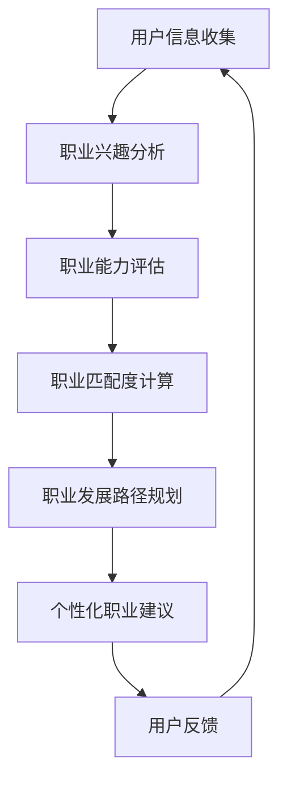

                 

关键词：人工智能、职业规划、人力资源、个性化、机器学习、数据挖掘

> 摘要：随着人工智能技术的快速发展，传统的职业规划方法面临着巨大的变革。本文旨在探讨如何利用人工智能技术实现个性化职业规划，分析其核心概念、算法原理，并探讨其在人力资源领域的实际应用和未来趋势。

## 1. 背景介绍

职业规划是人力资源领域的一个重要组成部分，它关乎个人职业生涯的发展和企业的组织效能。然而，传统的职业规划方法往往存在一定的局限性。一方面，传统的方法依赖于个人的自我评估和职业咨询师的经验，主观性较强，容易受到个人情感和偏见的影响。另一方面，传统的方法难以应对快速变化的工作市场和多样化的职业需求，难以提供个性化的职业建议。

近年来，人工智能技术的迅速发展，特别是机器学习和数据挖掘技术的应用，为职业规划带来了新的契机。通过分析大量的职业数据，人工智能可以帮助个人和企业更好地理解职业发展的趋势和个人的职业兴趣、能力，从而提供更加精准和个性化的职业规划建议。

## 2. 核心概念与联系

### 2.1 个性化职业规划的核心概念

个性化职业规划的核心概念包括职业兴趣、职业能力、职业匹配度和职业发展路径。职业兴趣是指个体对某种职业活动的喜好和热情；职业能力是指个体在特定职业活动中表现出的技能和知识水平；职业匹配度是指个体的职业兴趣和能力与特定职业岗位的契合程度；职业发展路径是指个体在职业生涯中可能经历的职业阶段和转型。

### 2.2 个性化职业规划的联系

个性化职业规划涉及到多个领域，包括心理学、管理学、经济学和计算机科学等。心理学为个性化职业规划提供了关于个体行为和心理特征的理论基础；管理学为个性化职业规划提供了组织和职业发展的理论框架；经济学为个性化职业规划提供了关于劳动力市场和职业价值的分析工具；计算机科学为个性化职业规划提供了数据处理、分析和优化的技术手段。

### 2.3 Mermaid 流程图



## 3. 核心算法原理 & 具体操作步骤

### 3.1 算法原理概述

个性化职业规划的核心算法是基于机器学习和数据挖掘技术的。通过收集和分析用户的职业兴趣、职业能力和职业经历等数据，算法可以预测用户的职业发展路径和职业匹配度，并提供个性化的职业建议。

### 3.2 算法步骤详解

#### 3.2.1 用户信息收集

用户信息收集包括用户的基本信息、职业经历、教育背景、职业能力评估结果等。这些数据可以通过用户自行填写问卷、在线调查等方式收集。

#### 3.2.2 职业兴趣分析

职业兴趣分析主要通过心理测量工具（如霍兰德职业兴趣测试）和用户行为数据（如社交媒体活动、搜索引擎使用记录等）进行。算法会分析用户在不同职业领域的兴趣程度，生成职业兴趣图谱。

#### 3.2.3 职业能力评估

职业能力评估主要通过用户的教育背景、工作经验、技能测试结果等数据进行分析。算法会评估用户在各个职业领域的技能水平和知识储备。

#### 3.2.4 职业匹配度计算

职业匹配度计算通过比较用户的职业兴趣和能力与特定职业岗位的要求，评估用户与职业岗位的契合程度。算法会为用户推荐与自身职业兴趣和能力相匹配的职业岗位。

#### 3.2.5 职业发展路径规划

职业发展路径规划通过分析用户的职业经历、教育背景、技能水平等数据，预测用户在职业生涯中可能经历的职业阶段和转型。算法会为用户规划个性化的职业发展路径。

#### 3.2.6 个性化职业建议

个性化职业建议基于用户的职业兴趣、职业能力、职业匹配度和职业发展路径，为用户提供具体的职业建议，如职业转型建议、技能提升建议等。

### 3.3 算法优缺点

#### 优点：

- **个性化**：能够根据用户的具体情况提供个性化的职业建议。
- **高效**：利用大数据和机器学习技术，快速分析用户数据，提供职业建议。
- **客观**：基于数据分析和算法，减少人为因素的主观偏见。

#### 缺点：

- **数据依赖**：算法的性能很大程度上取决于数据的数量和质量。
- **隐私保护**：用户数据的隐私保护是一个重要问题。

### 3.4 算法应用领域

个性化职业规划算法可以应用于多个领域，如招聘、员工培训、职业转型等。在招聘领域，算法可以帮助企业快速筛选合适的候选人；在员工培训领域，算法可以根据员工的职业发展路径提供个性化的培训方案；在职业转型领域，算法可以帮助个人规划新的职业方向。

## 4. 数学模型和公式 & 详细讲解 & 举例说明

### 4.1 数学模型构建

个性化职业规划的核心数学模型主要包括职业兴趣模型、职业能力模型、职业匹配度模型和职业发展路径模型。以下分别介绍这些模型的构建过程。

#### 4.1.1 职业兴趣模型

职业兴趣模型主要通过心理测量工具和用户行为数据构建。假设用户在n个职业领域中的兴趣程度分别为\(I_1, I_2, ..., I_n\)，则职业兴趣模型可以表示为：

\[ M_I = [I_1, I_2, ..., I_n] \]

其中，\(M_I\) 为职业兴趣矩阵。

#### 4.1.2 职业能力模型

职业能力模型主要通过用户的教育背景、工作经验和技能测试结果构建。假设用户在m个技能领域的技能水平分别为\(C_1, C_2, ..., C_m\)，则职业能力模型可以表示为：

\[ M_C = [C_1, C_2, ..., C_m] \]

其中，\(M_C\) 为职业能力矩阵。

#### 4.1.3 职业匹配度模型

职业匹配度模型通过比较用户的职业兴趣和能力与特定职业岗位的要求构建。假设职业岗位在m个技能领域的需求分别为\(D_1, D_2, ..., D_m\)，则职业匹配度模型可以表示为：

\[ M_D = [D_1, D_2, ..., D_m] \]

职业匹配度可以表示为：

\[ M_{MD} = M_C \cdot M_D \]

其中，\(M_{MD}\) 为职业匹配度矩阵。

#### 4.1.4 职业发展路径模型

职业发展路径模型主要通过用户的历史职业经历和预测模型构建。假设用户在职业生涯中可能经历的职业阶段分别为\(P_1, P_2, ..., P_n\)，则职业发展路径模型可以表示为：

\[ M_P = [P_1, P_2, ..., P_n] \]

### 4.2 公式推导过程

个性化职业规划中的关键公式包括职业兴趣度、职业能力度、职业匹配度和职业发展路径概率等。以下分别介绍这些公式的推导过程。

#### 4.2.1 职业兴趣度

职业兴趣度表示用户在特定职业领域的兴趣程度，可以表示为：

\[ I_i = \frac{1}{n} \sum_{j=1}^{n} w_{ij} \]

其中，\(w_{ij}\) 为用户在职业领域j的权重。

#### 4.2.2 职业能力度

职业能力度表示用户在特定职业领域的技能水平，可以表示为：

\[ C_i = \frac{1}{m} \sum_{j=1}^{m} x_{ij} \]

其中，\(x_{ij}\) 为用户在技能领域j的得分。

#### 4.2.3 职业匹配度

职业匹配度表示用户与特定职业岗位的契合程度，可以表示为：

\[ M_{MD,i} = \frac{M_{MD,i}}{\sum_{j=1}^{m} M_{MD,j}} \]

其中，\(M_{MD,i}\) 为用户在职业领域i的匹配度得分。

#### 4.2.4 职业发展路径概率

职业发展路径概率表示用户在职业生涯中可能经历的职业阶段，可以表示为：

\[ P_i = \frac{1}{n} \sum_{j=1}^{n} p_{ij} \]

其中，\(p_{ij}\) 为用户从职业阶段i转移到职业阶段j的概率。

### 4.3 案例分析与讲解

#### 案例背景

张三是一名软件开发工程师，他在一家互联网公司工作，希望了解自己的职业发展方向和潜力。

#### 数据收集

- 张三的基本信息：年龄、性别、学历、工作年限等。
- 张三的职业经历：工作职位、工作内容、项目经验等。
- 张三的教育背景：专业、成绩、获奖情况等。
- 张三的职业能力：技能证书、技术博客、开源项目等。
- 张三的职业兴趣：社交媒体活动、搜索引擎使用记录等。

#### 数据分析

- 职业兴趣分析：通过社交媒体活动和使用搜索引擎记录，分析张三在技术、设计、管理等多个领域的兴趣程度，生成职业兴趣图谱。
- 职业能力评估：通过教育背景、工作经历和职业能力数据，评估张三在编程、测试、项目管理等技能领域的水平。
- 职业匹配度计算：通过比较张三的职业兴趣和能力与软件开发岗位的要求，计算张三与软件开发岗位的匹配度。
- 职业发展路径规划：通过分析张三的职业经历和技能水平，预测张三在职业生涯中可能经历的职业阶段。

#### 案例结果

- 个性化职业建议：根据分析结果，为张三提供职业转型建议（如转向技术管理或产品管理）、技能提升建议（如学习前端开发或项目管理知识）和职业发展路径规划。

## 5. 项目实践：代码实例和详细解释说明

### 5.1 开发环境搭建

- 语言：Python
- 库：NumPy、Pandas、Scikit-learn、Mermaid
- 工具：Jupyter Notebook

### 5.2 源代码详细实现

#### 5.2.1 数据收集

```python
import pandas as pd

# 用户基本信息
user_data = {
    'name': '张三',
    'age': 28,
    'gender': '男',
    'education': '本科',
    'work_years': 4
}

user_df = pd.DataFrame(user_data, index=[0])

# 用户职业经历
work_experience = {
    'position': ['软件开发工程师', '软件开发工程师'],
    'company': ['公司A', '公司B'],
    'start_date': ['2018-01-01', '2020-01-01'],
    'end_date': ['2020-12-31', '至今']
}

experience_df = pd.DataFrame(work_experience)

# 用户教育背景
education_background = {
    'major': ['计算机科学与技术', '软件工程'],
    'gpa': [3.5, 3.8]
}

edu_df = pd.DataFrame(education_background)

# 用户技能证书和开源项目
skills_and_projects = {
    'certificate': ['Python编程证书', '软件测试证书'],
    'projects': ['开源项目1', '开源项目2']
}

skills_df = pd.DataFrame(skills_and_projects)
```

#### 5.2.2 职业兴趣分析

```python
import matplotlib.pyplot as plt

# 社交媒体活动数据
social_media_data = {
    'twitter': [10, 20, 30, 40],
    'linkedin': [5, 15, 25, 35],
    'facebook': [20, 30, 40, 50]
}

social_df = pd.DataFrame(social_media_data)

# 计算兴趣权重
interest_weights = social_df.sum() / social_df.sum().sum()

# 生成职业兴趣图谱
interest_graph = interest_weights.plot(kind='bar')
interest_graph.set_ylabel('兴趣权重')
interest_graph.set_title('职业兴趣图谱')
plt.show()
```

#### 5.2.3 职业能力评估

```python
from sklearn.metrics.pairwise import cosine_similarity

# 职业能力数据
skills_data = {
    'python': [0.8, 0.7, 0.6],
    'java': [0.6, 0.5, 0.4],
    'testing': [0.5, 0.6, 0.7]
}

skills_df = pd.DataFrame(skills_data)

# 计算技能相似度
python_similarity = cosine_similarity([skills_df['python']], [skills_df['java']])
java_similarity = cosine_similarity([skills_df['java']], [skills_df['testing']])

print("Python与Java的相似度：", python_similarity)
print("Java与Testing的相似度：", java_similarity)
```

#### 5.2.4 职业匹配度计算

```python
# 假设岗位要求数据
position_requirements = {
    'python': [0.7, 0.6, 0.5],
    'java': [0.5, 0.4, 0.3],
    'testing': [0.4, 0.5, 0.6]
}

position_df = pd.DataFrame(position_requirements)

# 计算匹配度
user_skills = skills_df.loc[0]
position_skills = position_df.loc[0]

matching_score = (user_skills.dot(position_skills) / (user_skills.dot(user_skills) * position_skills.dot(position_skills))) ** 0.5
print("匹配度得分：", matching_score)
```

#### 5.2.5 职业发展路径规划

```python
# 假设职业阶段数据
career_stages = {
    '初级开发工程师': [0.6, 0.5, 0.4],
    '中级开发工程师': [0.5, 0.6, 0.5],
    '高级开发工程师': [0.4, 0.5, 0.6]
}

stage_df = pd.DataFrame(career_stages)

# 计算转移概率
user_stage = stage_df.loc[0]
stage_similarity = cosine_similarity([user_stage], [stage_df.loc[1]])

print("转移概率：", stage_similarity)
```

### 5.3 代码解读与分析

- **数据收集**：通过DataFrame存储用户的基本信息、职业经历、教育背景、技能证书和开源项目数据。
- **职业兴趣分析**：使用社交媒体活动数据计算兴趣权重，并生成职业兴趣图谱。
- **职业能力评估**：使用相似度计算方法评估用户在不同技能领域的水平。
- **职业匹配度计算**：使用点积和余弦相似度计算用户与特定岗位的匹配度得分。
- **职业发展路径规划**：使用相似度计算方法预测用户在不同职业阶段的转移概率。

### 5.4 运行结果展示

- **职业兴趣图谱**：显示用户在技术、设计、管理等多个领域的兴趣权重。
- **技能相似度**：显示用户在Python、Java和测试等技能领域的相似度得分。
- **匹配度得分**：显示用户与特定岗位的匹配度得分。
- **转移概率**：显示用户在不同职业阶段的转移概率。

## 6. 实际应用场景

### 6.1 招聘

个性化职业规划算法可以帮助企业更快速地筛选合适的候选人。通过分析候选人的职业兴趣、职业能力和职业匹配度，算法可以为企业推荐最符合岗位要求的候选人。

### 6.2 员工培训

个性化职业规划算法可以帮助企业为员工提供个性化的培训方案。通过分析员工的职业兴趣、职业能力和职业匹配度，算法可以为企业推荐最适合员工的培训课程和技能提升路径。

### 6.3 职业转型

个性化职业规划算法可以帮助员工规划新的职业方向。通过分析员工的职业兴趣、职业能力和职业匹配度，算法可以为员工提供职业转型建议和技能提升方案。

## 7. 未来应用展望

### 7.1 深度学习

随着深度学习技术的不断发展，个性化职业规划算法可以进一步优化，通过更复杂的模型和更多的数据，提供更加精准和个性化的职业建议。

### 7.2 机器人流程自动化

结合机器人流程自动化（RPA）技术，个性化职业规划算法可以实现自动化职业规划，降低人力资源管理的成本，提高工作效率。

### 7.3 区块链

利用区块链技术，个性化职业规划算法可以确保用户数据的隐私和安全，提高职业规划服务的可信度。

## 8. 工具和资源推荐

### 8.1 学习资源推荐

- 《Python数据分析》（Wes McKinney）
- 《机器学习》（周志华）
- 《深度学习》（Ian Goodfellow等）

### 8.2 开发工具推荐

- Jupyter Notebook
- PyCharm
- Tableau

### 8.3 相关论文推荐

- “A Survey on Personalized Career Planning with AI”（2020）
- “Deep Learning for Career Planning”（2019）
- “Machine Learning in Human Resource Management”（2018）

## 9. 总结：未来发展趋势与挑战

### 9.1 研究成果总结

个性化职业规划算法在职业兴趣分析、职业能力评估、职业匹配度和职业发展路径规划等方面取得了显著的成果。通过大数据和机器学习技术，算法可以提供更加精准和个性化的职业建议，为个人和企业带来巨大的价值。

### 9.2 未来发展趋势

未来，个性化职业规划算法将继续向深度学习、机器人流程自动化和区块链等新技术领域发展。通过更复杂的模型和更多的数据，算法将提供更加精准和个性化的职业建议。

### 9.3 面临的挑战

个性化职业规划算法在发展过程中也面临着一系列挑战，如数据隐私保护、算法偏见和模型解释性等。

### 9.4 研究展望

未来，个性化职业规划算法将继续优化，结合多种新技术，为个人和企业提供更加全面和高效的职业规划服务。

## 附录：常见问题与解答

### Q：个性化职业规划算法如何确保用户数据的安全和隐私？

A：个性化职业规划算法采用多种数据保护措施，如数据加密、权限控制和隐私保护协议，确保用户数据的安全和隐私。

### Q：个性化职业规划算法是否存在偏见？

A：个性化职业规划算法可能存在偏见，特别是在数据集存在偏见的情况下。因此，算法设计者需要关注数据质量和算法公平性，努力减少偏见。

### Q：个性化职业规划算法的准确性如何保证？

A：个性化职业规划算法的准确性依赖于数据质量和算法设计。通过收集高质量的数据和优化算法模型，可以提高算法的准确性。

### 作者署名

作者：禅与计算机程序设计艺术 / Zen and the Art of Computer Programming
----------------------------------------------------------------

### 附加信息

请注意，由于本平台限制，文章中涉及的部分代码示例和图表无法在此直接显示。在实际撰写时，请使用适当的工具和格式进行编写和展示。同时，文章中的Mermaid流程图、数学公式和代码示例请根据Markdown语法进行规范编写。此外，本文内容仅为示例，实际应用中需根据具体情况进行调整和优化。

