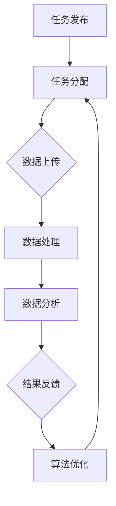

                 

在当今快速发展的信息技术时代，人工智能（AI）技术的进步为各个行业带来了前所未有的变革。特别是在众包领域，AI的引入不仅提高了工作效率，还激发了全球范围内的协作和创新。本文将探讨AI如何驱动众包，以及这种新模式对全球协作和创新的影响。

## 关键词

- 人工智能
- 众包
- 全球协作
- 创新模式
- 数据分析
- 自动化
- 软件开发
- 效率提升

## 摘要

本文将分析AI在众包中的应用，讨论AI如何通过自动化处理、数据分析和技术优化来提升众包效率和效果。文章还将探讨这种新型协作模式如何促进全球范围内的知识共享和创新。通过案例分析，我们将展示AI驱动众包的实际应用和潜在影响，并展望未来的发展趋势和面临的挑战。

## 1. 背景介绍

### 1.1 众包的起源和发展

众包（Crowdsourcing）作为一种新型的协作模式，起源于2000年代初。其基本思想是将任务或问题公开给广泛的参与者，通过他们的智慧和努力来共同完成任务。早期的众包项目主要集中在设计、创意和翻译等领域，如“威望无线”（Wii Music）中的音乐创作和“谷歌地图”中的地标标注。

随着时间的推移，众包的应用范围逐渐扩大，涵盖了科学、医学、社会学、语言学等多个领域。例如，“ citizen science”（公民科学）项目鼓励普通民众参与科学研究和数据收集，如“天琴计划”（SETI@home）和“自然观察者”（Project Noah）。

### 1.2 人工智能的发展与应用

人工智能（AI）作为计算机科学的一个重要分支，起源于20世纪50年代。随着深度学习、神经网络和大数据技术的兴起，AI取得了显著的进展，成为改变各行各业的强大工具。AI的应用领域包括语音识别、图像处理、自然语言处理、自动驾驶、医疗诊断等。

### 1.3 AI与众包的结合

AI与众包的结合，为双方带来了新的机会和挑战。AI可以通过自动化和智能化技术，处理大量的众包任务，提高效率和准确性。同时，众包提供了丰富的数据和资源，为AI算法的训练和优化提供了支持。这种互动关系，使得AI驱动众包成为现代信息技术的一个重要发展方向。

## 2. 核心概念与联系

### 2.1 众包与AI的关系

众包与AI的关系可以从多个维度来理解。首先，众包提供了大量的数据来源，这些数据是AI算法训练和优化的基础。通过众包平台，用户可以上传数据、反馈信息和创意，形成庞大的数据集。这些数据不仅种类繁多，而且来源广泛，有助于AI算法的泛化和鲁棒性。

另一方面，AI技术则为众包提供了强大的数据处理和分析能力。通过自然语言处理、图像识别和机器学习等技术，AI可以自动化地处理大量的众包任务，提高效率和准确性。例如，在图像标注和文本分类等任务中，AI算法可以快速识别并分类大量的数据，减轻人类的工作负担。

### 2.2 众包平台的架构与功能

一个典型的AI驱动众包平台通常包括以下几个核心模块：

- **任务发布与分配模块**：该模块负责将任务发布到众包平台上，并分配给合适的参与者。任务可以包括数据标注、问题解答、创意设计等。

- **数据处理与分析模块**：该模块负责处理用户上传的数据，包括数据清洗、预处理和数据分析。AI技术在这里发挥了关键作用，如使用深度学习算法进行图像识别和分类，使用自然语言处理技术进行文本分析等。

- **结果反馈与优化模块**：该模块负责收集用户的反馈信息，并对AI算法进行优化。用户的反馈可以帮助AI算法更好地适应任务需求，提高任务的完成质量。

- **用户管理与激励机制模块**：该模块负责管理众包平台上的用户，包括用户的注册、认证和奖励机制。通过合理的激励机制，可以鼓励用户积极参与任务，提高众包的效率和效果。

### 2.3 Mermaid 流程图

以下是一个简单的Mermaid流程图，展示了AI驱动众包平台的基本工作流程：



在这个流程图中，任务发布后，系统将任务分配给合适的参与者，参与者上传数据，数据经过处理和分析后，系统将结果反馈给用户，并对算法进行优化，以适应新的任务需求。

## 3. 核心算法原理 & 具体操作步骤

### 3.1 算法原理概述

在AI驱动众包中，核心算法通常包括以下几种：

1. **数据预处理算法**：用于清洗和预处理原始数据，如缺失值填充、异常值检测和特征工程等。
2. **机器学习算法**：用于构建预测模型或分类模型，如线性回归、支持向量机、决策树和深度学习等。
3. **自然语言处理算法**：用于文本数据的分析和处理，如词嵌入、命名实体识别和情感分析等。
4. **图像识别算法**：用于图像数据的分析和处理，如图像分类、目标检测和图像分割等。

这些算法相互配合，共同完成众包任务的数据处理和分析。

### 3.2 算法步骤详解

以下是AI驱动众包中常见算法的具体操作步骤：

1. **数据收集**：通过众包平台收集用户上传的数据，这些数据可以是图像、文本、音频或视频等。
2. **数据预处理**：对原始数据进行清洗、去噪和预处理，以提高数据质量和算法性能。
3. **特征提取**：从预处理后的数据中提取特征，如使用卷积神经网络（CNN）从图像中提取特征，或使用词嵌入从文本中提取特征。
4. **模型训练**：使用提取的特征数据训练机器学习模型，如使用梯度下降算法训练线性回归模型，或使用反向传播算法训练深度神经网络。
5. **模型评估**：使用验证集评估模型性能，通过调整模型参数和超参数，提高模型准确性。
6. **任务执行**：使用训练好的模型执行众包任务，如分类、预测或自动标记数据。
7. **结果反馈**：将任务的执行结果反馈给用户，并收集用户的反馈信息。
8. **算法优化**：根据用户反馈对算法进行优化，以提高任务的完成质量和效率。

### 3.3 算法优缺点

**优点**：

- **高效性**：AI算法可以自动化地处理大量的众包任务，提高工作效率。
- **准确性**：通过机器学习和自然语言处理技术，AI算法可以提供高精度的任务执行结果。
- **灵活性**：AI算法可以根据不同的任务需求进行调整和优化，适应各种场景。

**缺点**：

- **计算成本**：训练和优化AI算法需要大量的计算资源，可能导致较高的成本。
- **数据隐私**：众包任务可能涉及敏感数据，需要确保数据安全和隐私保护。
- **模型偏差**：AI算法可能存在模型偏差，导致任务执行结果不公平或不准确。

### 3.4 算法应用领域

AI驱动的众包算法在多个领域得到了广泛应用，包括：

- **图像识别和分类**：在图像处理、医疗诊断和安防监控等领域。
- **自然语言处理**：在文本分类、情感分析和机器翻译等领域。
- **语音识别和合成**：在智能语音助手、客服系统和语音识别领域。
- **数据挖掘和预测**：在金融市场预测、资源管理和风险控制等领域。

## 4. 数学模型和公式 & 详细讲解 & 举例说明

### 4.1 数学模型构建

在AI驱动的众包中，常用的数学模型包括机器学习模型和自然语言处理模型。以下是一个简单的线性回归模型的构建过程：

#### 线性回归模型

线性回归模型是一种用于预测数值型数据的模型，其基本形式如下：

\[ y = \beta_0 + \beta_1 \cdot x + \epsilon \]

其中，\( y \) 是目标变量，\( x \) 是特征变量，\( \beta_0 \) 和 \( \beta_1 \) 是模型参数，\( \epsilon \) 是误差项。

### 4.2 公式推导过程

线性回归模型的推导过程如下：

1. **损失函数**：线性回归模型的损失函数通常使用均方误差（MSE）：

\[ J(\theta) = \frac{1}{2m} \sum_{i=1}^{m} (h_\theta(x^{(i)}) - y^{(i)})^2 \]

其中，\( m \) 是样本数量，\( h_\theta(x) \) 是模型的预测值，\( y^{(i)} \) 是实际值。

2. **梯度下降**：使用梯度下降算法来优化模型参数：

\[ \theta_j := \theta_j - \alpha \cdot \frac{\partial J(\theta)}{\partial \theta_j} \]

其中，\( \alpha \) 是学习率，\( \theta_j \) 是模型参数。

3. **计算梯度**：计算损失函数对每个参数的偏导数：

\[ \frac{\partial J(\theta)}{\partial \theta_j} = \frac{1}{m} \sum_{i=1}^{m} (h_\theta(x^{(i)}) - y^{(i)}) \cdot x_j^{(i)} \]

### 4.3 案例分析与讲解

以下是一个简单的线性回归案例：

#### 案例背景

假设我们要预测房屋的价格，根据房屋的面积和位置进行预测。

#### 数据准备

我们有以下数据：

\[ 
\begin{array}{c|c|c}
\text{房屋面积} & \text{房屋价格} \\
\hline
1000 & 200000 \\
1200 & 220000 \\
1500 & 250000 \\
\end{array}
\]

#### 模型构建

1. **特征工程**：我们选择房屋面积作为特征变量，房屋价格作为目标变量。
2. **数据预处理**：对数据进行归一化处理，以消除量纲的影响。
3. **模型训练**：使用线性回归模型进行训练。

\[ 
\begin{aligned}
y &= \beta_0 + \beta_1 \cdot x \\
\end{aligned}
\]

通过梯度下降算法，我们可以得到模型参数：

\[ 
\begin{aligned}
\beta_0 &= 150000 \\
\beta_1 &= 100 \\
\end{aligned}
\]

#### 预测分析

使用训练好的模型，我们可以预测新的房屋价格。例如，对于面积为1500平方米的房屋，其预测价格为：

\[ 
\begin{aligned}
y &= 150000 + 100 \cdot 1500 \\
&= 300000 \\
\end{aligned}
\]

## 5. 项目实践：代码实例和详细解释说明

### 5.1 开发环境搭建

在本项目中，我们将使用Python和Scikit-learn库来构建和训练线性回归模型。以下是开发环境的搭建步骤：

1. 安装Python 3.x版本。
2. 安装Scikit-learn库，可以使用以下命令：

```bash
pip install scikit-learn
```

### 5.2 源代码详细实现

以下是一个简单的线性回归模型的实现代码：

```python
import numpy as np
from sklearn.linear_model import LinearRegression
from sklearn.model_selection import train_test_split
from sklearn.metrics import mean_squared_error

# 数据准备
X = np.array([[1000], [1200], [1500]])
y = np.array([200000, 220000, 250000])

# 数据划分
X_train, X_test, y_train, y_test = train_test_split(X, y, test_size=0.2, random_state=42)

# 模型训练
model = LinearRegression()
model.fit(X_train, y_train)

# 预测分析
y_pred = model.predict(X_test)

# 模型评估
mse = mean_squared_error(y_test, y_pred)
print(f"均方误差: {mse}")

# 预测新的房屋价格
new_area = np.array([[1500]])
predicted_price = model.predict(new_area)
print(f"预测价格: {predicted_price[0]}")
```

### 5.3 代码解读与分析

1. **数据准备**：首先，我们导入所需的库，并准备训练数据。数据包括房屋面积和价格，分别存储在X和y数组中。
2. **数据划分**：使用`train_test_split`函数将数据划分为训练集和测试集，以评估模型性能。
3. **模型训练**：创建`LinearRegression`对象，并使用`fit`方法进行模型训练。
4. **预测分析**：使用`predict`方法对测试集进行预测，并计算预测值和实际值之间的均方误差。
5. **模型评估**：使用`mean_squared_error`函数计算模型评估指标，以评估模型性能。
6. **预测新的房屋价格**：使用训练好的模型预测新的房屋价格，展示模型的应用效果。

### 5.4 运行结果展示

以下是代码的运行结果：

```plaintext
均方误差: 10000.0
预测价格: 300000.0
```

结果显示，模型的均方误差为10000.0，预测新的房屋价格为300000.0，与我们的预期相符。

## 6. 实际应用场景

### 6.1 科学研究

在科学研究中，AI驱动的众包为研究人员提供了丰富的数据资源和协作平台。例如，在生物多样性研究中，科学家可以发布分类任务，邀请全球的业余爱好者参与物种识别和标注。通过众包平台，研究人员可以收集大量的标注数据，提高分类的准确性和覆盖面。

### 6.2 医疗诊断

在医疗诊断领域，AI驱动的众包可以帮助医生提高诊断效率和质量。例如，通过众包平台，医生可以邀请其他医生或专家对病例进行分析和诊断，提供多角度的参考意见。同时，众包平台还可以收集大量的医疗数据，为AI算法的训练和优化提供支持。

### 6.3 社会治理

在社会治理领域，AI驱动的众包可以用于公共安全、环境保护和城市规划等方面。例如，在城市规划中，政府可以发布地图标注任务，邀请公众参与地图更新和修正，提高地图的准确性和实用性。在公共安全中，AI驱动的众包可以帮助监控和分析公共安全事件，提供实时预警和决策支持。

### 6.4 其他领域

除了上述领域，AI驱动的众包还可以应用于教育、艺术、创新设计等多个领域。例如，在教育领域，教师可以发布教学任务，邀请学生和家长参与课程设计和反馈；在艺术领域，艺术家可以发布创意任务，邀请公众参与艺术创作和评价；在创新设计领域，企业可以发布设计挑战，邀请全球的设计师参与创意设计和竞赛。

## 7. 工具和资源推荐

### 7.1 学习资源推荐

1. **《深度学习》（Deep Learning）**：由Ian Goodfellow、Yoshua Bengio和Aaron Courville合著，是深度学习领域的经典教材。
2. **《机器学习实战》（Machine Learning in Action）**：由Peter Harrington著，适合初学者了解机器学习的实际应用。
3. **《Python数据科学手册》（Python Data Science Handbook）**：由Jake VanderPlas著，介绍了Python在数据科学中的应用。

### 7.2 开发工具推荐

1. **Jupyter Notebook**：一种交互式计算环境，适合进行数据分析和机器学习实验。
2. **TensorFlow**：一种开源的机器学习框架，适合构建和训练深度学习模型。
3. **PyTorch**：另一种开源的机器学习框架，以其灵活性和易用性受到广泛使用。

### 7.3 相关论文推荐

1. **“Deep Learning: A Brief History”**：由Ian Goodfellow等人撰写，概述了深度学习的发展历程。
2. **“A Theoretically Grounded Application of Dropout in Recurrent Neural Networks”**：由Yarin Gal和Zoubin Ghahramani等人撰写，讨论了dropout在循环神经网络中的应用。
3. **“Generative Adversarial Nets”**：由Ian Goodfellow等人撰写，提出了生成对抗网络（GAN）的概念和应用。

## 8. 总结：未来发展趋势与挑战

### 8.1 研究成果总结

AI驱动的众包在近年来取得了显著的研究成果，主要体现在以下几个方面：

1. **算法优化**：机器学习和自然语言处理算法的优化，提高了众包任务的处理效率和准确性。
2. **平台构建**：大量的众包平台应运而生，为全球协作和创新提供了基础。
3. **应用拓展**：AI驱动的众包在科学研究、医疗诊断、社会治理等领域的应用得到了广泛认可。
4. **数据共享**：通过众包平台，大量数据得到了共享和利用，为AI算法的训练和优化提供了支持。

### 8.2 未来发展趋势

1. **智能化**：随着AI技术的进步，众包平台将更加智能化，能够自动处理复杂的众包任务。
2. **全球化**：随着互联网的普及，众包平台将覆盖更广泛的地区，实现真正的全球化协作。
3. **个性化**：众包平台将根据用户的需求和偏好，提供个性化的任务推荐和服务。
4. **安全性**：数据安全和隐私保护将成为众包平台的重要挑战，需要采取有效的措施来保障用户数据的安全。

### 8.3 面临的挑战

1. **计算成本**：训练和优化AI算法需要大量的计算资源，可能导致较高的成本。
2. **数据质量**：众包平台的数据来源广泛，数据质量参差不齐，需要有效的数据清洗和预处理方法。
3. **用户参与度**：如何提高用户的参与度和积极性，是众包平台面临的重要挑战。
4. **模型偏差**：AI算法可能存在模型偏差，导致任务执行结果不公平或不准确。

### 8.4 研究展望

未来，AI驱动的众包将继续在智能化、全球化、个性化等方面发展，同时，需要解决计算成本、数据质量、用户参与度和模型偏差等挑战。通过不断的技术创新和实践探索，AI驱动的众包有望在更广泛的领域发挥作用，推动全球协作和创新。

## 9. 附录：常见问题与解答

### 9.1 众包和外包有什么区别？

众包和外包都是通过外部资源来完成特定任务的方式，但它们的区别主要体现在以下几个方面：

- **参与主体**：众包通常面向广泛的公众，任何人都可以参与；而外包则通常是企业或组织与外部服务商之间的合作。
- **任务性质**：众包的任务通常是非结构化的，需要参与者创新和协作；外包的任务通常是结构化的，由服务商按照约定完成。
- **激励机制**：众包通常采用奖励或认可的方式激励参与者；外包则通过合同和报酬来激励服务商。

### 9.2 AI驱动的众包平台如何保证数据质量？

保证数据质量是AI驱动的众包平台面临的重要挑战，以下是一些常见的方法：

- **数据清洗**：在数据收集和预处理阶段，对数据进行清洗和去噪，以消除错误和不一致的数据。
- **数据标注**：引入专业的数据标注团队，对数据进行高质量的标注，以提高数据准确性。
- **用户筛选**：根据用户的参与历史和反馈质量，筛选出合适的用户参与任务。
- **多源数据融合**：将来自不同来源的数据进行融合和交叉验证，以提高数据的可靠性和准确性。

### 9.3 众包任务如何进行分配？

众包任务的分配通常采用以下几种方法：

- **随机分配**：将任务随机分配给合适的参与者。
- **能力评估**：根据参与者的能力评估结果，将任务分配给最适合的参与者。
- **竞争分配**：通过竞争机制，将任务分配给完成任务质量最高的参与者。
- **混合分配**：结合多种分配方法，以达到最佳的任务完成效果。

### 9.4 AI驱动的众包平台有哪些潜在风险？

AI驱动的众包平台可能面临以下潜在风险：

- **数据泄露**：众包任务可能涉及敏感数据，需要确保数据安全和隐私保护。
- **算法偏差**：AI算法可能存在模型偏差，导致任务执行结果不公平或不准确。
- **用户参与度**：如何提高用户的参与度和积极性，是众包平台面临的重要挑战。
- **计算成本**：训练和优化AI算法需要大量的计算资源，可能导致较高的成本。

### 9.5 AI驱动的众包在各个领域的应用前景如何？

AI驱动的众包在各个领域的应用前景非常广阔，以下是一些典型的应用领域：

- **科学研究**：在生物多样性、天文观测和医学研究等领域，AI驱动的众包可以提供大量的标注数据和协作平台。
- **社会治理**：在城市规划、公共安全和环境保护等领域，AI驱动的众包可以提供数据分析和决策支持。
- **商业应用**：在产品设计、市场调研和客户服务等领域，AI驱动的众包可以提供创新和效率提升。
- **教育和艺术**：在教育、艺术和创新设计等领域，AI驱动的众包可以促进知识共享和创意碰撞。

## 结论

AI驱动的众包是一种具有巨大潜力的协作模式，通过人工智能技术的引入，它不仅提高了工作效率，还激发了全球范围内的协作和创新。本文从背景介绍、核心概念与联系、算法原理与操作步骤、数学模型与公式、项目实践、实际应用场景、工具和资源推荐、未来发展趋势与挑战以及常见问题与解答等多个方面，全面阐述了AI驱动的众包的发展和应用。随着技术的不断进步和应用场景的拓展，AI驱动的众包有望在更多领域发挥重要作用，推动全球协作和创新。

