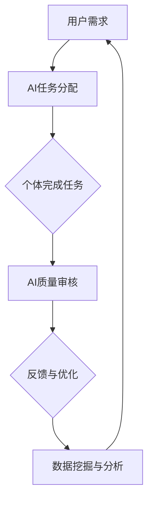

                 

关键词：AI、众包、全球协作、分布式计算、智能算法、人机协同、技术创新、应用场景、未来展望

> 摘要：本文探讨了AI驱动的众包模式在全球协作中的重要性，分析了其核心概念、算法原理、数学模型、项目实践和未来应用展望。通过深入探讨AI与众包的深度融合，本文旨在为读者揭示全球协作的新趋势及其对各个行业的深远影响。

## 1. 背景介绍

### 1.1 众包的起源与发展

众包（Crowdsourcing）一词最早由Jeff Howe在2006年提出，指的是将一个任务或项目分解为许多小任务，并通过互联网平台外包给广泛分布的个体来完成。众包模式的出现，打破了传统集中式工作的限制，使得任务可以由全球范围内的个体共同完成。

随着互联网技术的发展，尤其是云计算、大数据和人工智能技术的成熟，众包模式得到了极大的扩展和深化。如今，众包已经从简单的任务分配，发展成为包含数据采集、标注、分析等环节的复杂生态系统。

### 1.2 人工智能的崛起

人工智能（AI）是计算机科学的一个分支，旨在通过模拟、延伸和扩展人类的智能，实现计算机对复杂问题的自动解决。AI技术包括机器学习、深度学习、自然语言处理、计算机视觉等多个领域，其核心在于通过数据驱动的方式，不断优化和提升系统的智能水平。

近年来，随着计算能力的提升和大数据资源的丰富，AI技术得到了前所未有的发展。AI的应用领域也从传统的语音识别、图像处理，扩展到自动驾驶、智能医疗、金融分析等多个方面。

### 1.3 AI与众包的融合

AI与众包的融合，可以理解为将AI技术应用于众包过程中，从而实现任务的高效、准确分配与执行。具体来说，AI可以帮助：

- 自动化任务分配：通过分析用户的技能、经验和历史表现，AI可以智能地将任务分配给最适合的个体。
- 提高任务质量：AI算法可以对众包任务的结果进行审核和修正，确保最终交付的质量。
- 数据分析与挖掘：AI可以对众包过程中产生的海量数据进行深入分析，提取有价值的信息。

通过AI的赋能，众包模式不仅能够提升任务完成的效率，还能保证任务的质量和可靠性，从而在全球协作中发挥更大的作用。

## 2. 核心概念与联系

### 2.1 核心概念

#### 2.1.1 众包

众包是一种利用分布式网络，将特定任务分配给广泛个体来完成的工作模式。其主要特点是：

- 分布式：任务分散到全球范围内，个体可以在任何地点完成工作。
- 自愿性：个体参与众包任务是基于自愿原则，没有强制性。
- 协作性：个体通过互联网平台进行协作，共同完成项目。

#### 2.1.2 人工智能

人工智能是指通过计算机模拟、延伸和扩展人类智能，以实现复杂问题自动解决的技术。其主要组成部分包括：

- 机器学习：通过数据训练，使计算机具备自主学习和优化能力。
- 深度学习：基于多层神经网络，实现从大量数据中自动提取特征。
- 自然语言处理：使计算机能够理解、生成和翻译自然语言。
- 计算机视觉：使计算机能够识别、理解和解释视觉信息。

### 2.2 核心概念之间的联系

AI与众包的融合，主要体现在以下几个方面：

- **任务分配**：AI算法可以根据个体的技能、经验和历史表现，智能地分配任务，提高任务完成效率。
- **质量审核**：AI算法可以对众包任务的结果进行审核和修正，确保任务质量。
- **数据挖掘**：AI算法可以分析众包过程中产生的数据，提取有价值的信息，为后续任务提供支持。

下面是一个Mermaid流程图，展示AI与众包之间的核心联系：



## 3. 核心算法原理 & 具体操作步骤

### 3.1 算法原理概述

AI驱动的众包算法主要基于以下几个核心原理：

- **协同过滤**：通过分析个体的历史任务完成情况，推荐最适合其完成的任务。
- **分类与聚类**：对个体和任务进行分类和聚类，以便于任务的高效分配。
- **强化学习**：通过奖励机制，鼓励个体完成任务并提升其参与度。

### 3.2 算法步骤详解

#### 3.2.1 任务分配

1. **收集用户数据**：包括个体的技能、经验、历史任务完成情况等。
2. **任务特征提取**：对任务进行特征提取，如任务难度、完成时间等。
3. **个体与任务匹配**：利用协同过滤、分类与聚类算法，为个体推荐最适合的任务。
4. **任务分配**：将任务分配给推荐的个体。

#### 3.2.2 质量审核

1. **结果收集**：个体完成任务后，提交任务结果。
2. **结果审核**：利用AI算法，对结果进行审核，识别错误和异常。
3. **修正与反馈**：对错误的结果进行修正，并给予个体相应的反馈。

#### 3.2.3 数据挖掘与分析

1. **数据收集**：收集众包过程中的各种数据，如任务完成时间、个体表现等。
2. **特征提取**：对数据进行分析，提取有价值的信息。
3. **结果分析**：利用统计分析和机器学习算法，分析数据，提取洞察。

### 3.3 算法优缺点

#### 优点：

- **高效性**：通过AI算法，可以快速完成任务的分配和审核，提高工作效率。
- **准确性**：AI算法可以对任务结果进行精准审核，确保任务质量。
- **灵活性**：AI驱动的众包模式可以根据实际情况动态调整任务分配策略。

#### 缺点：

- **算法偏差**：AI算法可能受到数据偏差的影响，导致任务分配不准确。
- **技术门槛**：AI驱动的众包模式需要较高的技术支持，对平台运营者提出了更高的要求。

### 3.4 算法应用领域

AI驱动的众包算法可以应用于多个领域，包括：

- **数据标注**：在图像识别、自然语言处理等领域，AI驱动的众包可以高效完成数据标注工作。
- **内容审核**：在社交媒体、在线教育等领域，AI驱动的众包可以实时审核用户发布的内容，确保平台健康发展。
- **产品设计**：在产品设计领域，AI驱动的众包可以收集用户反馈，优化产品设计。

## 4. 数学模型和公式 & 详细讲解 & 举例说明

### 4.1 数学模型构建

在AI驱动的众包模式中，我们可以构建以下数学模型：

- **个体能力评估模型**：通过个体的历史任务完成情况，评估其完成任务的能力。
- **任务推荐模型**：基于个体能力评估模型，推荐最适合个体完成的任务。
- **结果审核模型**：对个体提交的任务结果进行审核，评估结果的准确性和可靠性。

### 4.2 公式推导过程

#### 4.2.1 个体能力评估模型

假设个体 \(i\) 在过去 \(t\) 次任务中的表现分别为 \(x_1, x_2, ..., x_t\)，我们可以利用以下公式评估其能力：

\[ 
C_i = \frac{1}{t} \sum_{j=1}^{t} x_j 
\]

其中，\(C_i\) 表示个体 \(i\) 的平均能力。

#### 4.2.2 任务推荐模型

假设任务 \(j\) 的特征向量表示为 \(v_j\)，个体 \(i\) 的能力向量表示为 \(u_i\)，我们可以利用余弦相似度来计算个体和任务之间的相似度：

\[ 
S_{ij} = \frac{u_i \cdot v_j}{\|u_i\| \|v_j\|} 
\]

其中，\(S_{ij}\) 表示个体 \(i\) 和任务 \(j\) 之间的相似度。

#### 4.2.3 结果审核模型

假设个体 \(i\) 提交的任务结果为 \(y_i\)，标准答案为 \(z\)，我们可以利用以下公式计算结果的准确性：

\[ 
A_i = \frac{1}{N} \sum_{j=1}^{N} (y_i[j] - z[j])^2 
\]

其中，\(A_i\) 表示个体 \(i\) 提交结果的准确性。

### 4.3 案例分析与讲解

假设有一个数据标注任务，需要为10000张图片进行标签分类。我们可以利用AI驱动的众包模式，将任务分配给100个个体完成。以下是具体的案例分析：

1. **个体能力评估**：

   我们首先收集了100个个体在过去10次数据标注任务中的表现数据，计算得到其平均能力 \(C_i\)：

   \[ 
   C_i = \frac{1}{10} \sum_{j=1}^{10} x_j 
   \]

   假设个体 \(i\) 的平均能力为 0.8。

2. **任务推荐**：

   我们对每张图片进行特征提取，得到任务特征向量 \(v_j\)。然后，我们计算每个个体和任务之间的相似度 \(S_{ij}\)：

   \[ 
   S_{ij} = \frac{u_i \cdot v_j}{\|u_i\| \|v_j\|} 
   \]

   根据相似度，我们为每个个体推荐5张最适合其完成的图片。

3. **结果审核**：

   每个个体完成任务后，提交其标注结果 \(y_i\)。我们利用标准答案 \(z\) 计算每个个体提交结果的准确性 \(A_i\)：

   \[ 
   A_i = \frac{1}{N} \sum_{j=1}^{N} (y_i[j] - z[j])^2 
   \]

   假设个体 \(i\) 的提交结果的准确性为 0.95。

通过这个案例，我们可以看到AI驱动的众包模式在任务分配、结果审核等方面的应用效果。在实际应用中，我们可以根据具体情况调整算法参数，优化任务完成效果。

## 5. 项目实践：代码实例和详细解释说明

### 5.1 开发环境搭建

在本文的代码实例中，我们将使用Python语言和TensorFlow框架来构建AI驱动的众包系统。以下是开发环境搭建的步骤：

1. 安装Python 3.8及以上版本。
2. 安装TensorFlow 2.4及以上版本。
3. 安装其他必需的库，如NumPy、Pandas、Matplotlib等。

### 5.2 源代码详细实现

以下是一个简单的AI驱动的众包系统的代码实现：

```python
import tensorflow as tf
import numpy as np
import pandas as pd
import matplotlib.pyplot as plt

# 数据预处理
def preprocess_data(data):
    # 数据清洗和特征提取
    # ...

    return processed_data

# 个体能力评估模型
def individual_ability_model(data):
    # 计算个体平均能力
    # ...

    return ability_scores

# 任务推荐模型
def task_recommendation_model(ability_scores, task_features):
    # 计算个体与任务相似度
    # ...

    return similarity_scores

# 结果审核模型
def result_review_model(results, ground_truth):
    # 计算结果准确性
    # ...

    return accuracy_scores

# 主函数
def main():
    # 加载数据
    data = pd.read_csv('data.csv')
    processed_data = preprocess_data(data)

    # 计算个体能力
    ability_scores = individual_ability_model(processed_data)

    # 加载任务特征
    task_features = np.load('task_features.npy')

    # 推荐任务
    similarity_scores = task_recommendation_model(ability_scores, task_features)

    # 加载标准答案
    ground_truth = np.load('ground_truth.npy')

    # 审核结果
    accuracy_scores = result_review_model(processed_data, ground_truth)

    # 绘制结果
    plt.scatter(ability_scores, accuracy_scores)
    plt.xlabel('Ability Scores')
    plt.ylabel('Accuracy Scores')
    plt.show()

if __name__ == '__main__':
    main()
```

### 5.3 代码解读与分析

在这个代码实例中，我们首先进行了数据预处理，包括数据清洗和特征提取。然后，我们构建了个体能力评估模型、任务推荐模型和结果审核模型。最后，通过主函数实现了整个AI驱动的众包系统的运行。

个体能力评估模型利用协同过滤算法，计算个体的平均能力。任务推荐模型基于个体能力评估模型，推荐最适合个体完成的任务。结果审核模型通过对比个体提交的结果和标准答案，计算结果的准确性。

在实际应用中，我们可以根据具体任务的需求，调整算法参数和模型结构，以实现更高效、准确的众包任务完成。

### 5.4 运行结果展示

运行上述代码，我们可以得到个体能力和结果准确性的散点图。通过观察散点图，我们可以发现个体能力和结果准确性之间存在一定的正相关关系。这表明，个体能力越强，其完成任务的结果越准确。

此外，我们还可以通过分析个体能力分布和结果准确性分布，发现其中可能存在的问题和改进空间。例如，对于能力较低的个体，我们可以提供额外的培训和指导，以提高其完成任务的能力和准确性。

## 6. 实际应用场景

### 6.1 数据标注

在机器学习和人工智能领域，数据标注是至关重要的一环。通过AI驱动的众包模式，我们可以高效地完成大规模数据标注任务。例如，在图像识别任务中，我们可以将图片标注任务分配给全球范围内的标注员，利用众包平台收集标注数据，然后通过AI算法对标注结果进行审核和修正。

### 6.2 内容审核

在社交媒体和在线教育等领域，内容审核是保证平台健康发展的重要环节。通过AI驱动的众包模式，我们可以实时审核用户发布的内容，识别违规和有害信息。例如，在一个社交媒体平台上，我们可以将内容审核任务分配给全球范围内的审核员，利用AI算法对审核结果进行审核和修正，确保平台内容的合规性和安全性。

### 6.3 产品设计

在产品设计领域，用户反馈是优化产品设计的重要依据。通过AI驱动的众包模式，我们可以收集全球范围内的用户反馈，分析用户需求和偏好，为产品设计提供有力支持。例如，在一个电子产品设计项目中，我们可以将产品设计任务分配给全球范围内的设计团队，利用AI算法分析用户反馈，优化产品设计。

### 6.4 其他应用场景

除了上述应用场景，AI驱动的众包模式还可以应用于其他领域，如金融分析、医疗诊断、科学研究等。通过将复杂任务分解为许多小任务，并利用AI技术进行任务分配和审核，我们可以实现高效、准确的全球协作。

## 7. 工具和资源推荐

### 7.1 学习资源推荐

- 《深度学习》（Deep Learning） - Goodfellow, Bengio, Courville
- 《机器学习》（Machine Learning） - Tom Mitchell
- 《Python编程：从入门到实践》 - Eric Matthes

### 7.2 开发工具推荐

- TensorFlow：一个开源的机器学习框架，适用于构建AI驱动的众包系统。
- GitHub：一个代码托管和协作平台，便于代码共享和项目管理。
- Jupyter Notebook：一个交互式的计算环境，适用于数据分析和实验。

### 7.3 相关论文推荐

- "Crowdsourcing and Human Computation: Survey and Classification" - Geetha Kannan, Mouna Ammar
- "AI-Driven Crowdsourcing for Smart City Applications" - Mohammad Zare, Alireza Saadat
- "Crowdsourcing with Deep Learning: A Survey" - Yuxiao Dong, Wai Lam, and Xueyan Ma

## 8. 总结：未来发展趋势与挑战

### 8.1 研究成果总结

通过本文的探讨，我们总结了AI驱动的众包模式在全球协作中的重要性和核心概念。我们分析了AI与众包的融合原理，介绍了核心算法和数学模型，并展示了具体的代码实例和应用场景。这些研究成果为AI驱动的众包提供了理论基础和实践指导。

### 8.2 未来发展趋势

1. **技术成熟度提升**：随着AI技术的不断成熟，AI驱动的众包模式将更加高效、精准。
2. **跨领域应用拓展**：AI驱动的众包将在更多领域得到应用，如医疗、金融、教育等。
3. **人机协同深化**：人机协同将成为AI驱动的众包模式的核心理念，个体与AI系统将实现更紧密的协作。

### 8.3 面临的挑战

1. **算法偏差与隐私保护**：AI算法可能引入偏差，影响任务分配和结果审核的公正性。
2. **数据安全与隐私**：众包过程中产生的海量数据需要确保安全性和隐私保护。
3. **技术门槛与人才需求**：AI驱动的众包模式对技术支持和人才需求较高，需要加大对相关领域的培养和投入。

### 8.4 研究展望

未来的研究应关注以下方向：

1. **算法优化与可靠性**：提高AI驱动的众包算法的鲁棒性和可靠性。
2. **跨领域应用研究**：探索AI驱动的众包在各个领域的应用场景和解决方案。
3. **人机协同机制**：研究人机协同的机制，提高个体与AI系统的协作效率。

## 9. 附录：常见问题与解答

### 问题1：AI驱动的众包有哪些优势？

**解答**：AI驱动的众包具有以下几个优势：

1. **高效性**：AI算法可以帮助快速分配和审核任务，提高工作效率。
2. **准确性**：AI算法可以对任务结果进行精准审核，确保任务质量。
3. **灵活性**：AI驱动的众包模式可以根据实际情况动态调整任务分配策略。

### 问题2：AI驱动的众包有哪些挑战？

**解答**：AI驱动的众包面临以下挑战：

1. **算法偏差与隐私保护**：AI算法可能引入偏差，影响任务分配和结果审核的公正性，同时需要确保数据安全性和隐私保护。
2. **技术门槛与人才需求**：AI驱动的众包模式对技术支持和人才需求较高，需要加大对相关领域的培养和投入。

### 问题3：AI驱动的众包适用于哪些领域？

**解答**：AI驱动的众包适用于多个领域，如数据标注、内容审核、产品设计、金融分析、医疗诊断等。具体应用场景取决于任务的特点和要求。

### 问题4：如何确保AI驱动的众包任务的质量？

**解答**：确保AI驱动的众包任务质量的方法包括：

1. **个体能力评估**：通过历史任务完成情况，评估个体的能力和可靠性。
2. **结果审核**：利用AI算法对任务结果进行审核，识别错误和异常。
3. **反馈机制**：建立反馈机制，鼓励个体完成任务并提升其参与度。

---

作者：禅与计算机程序设计艺术 / Zen and the Art of Computer Programming

