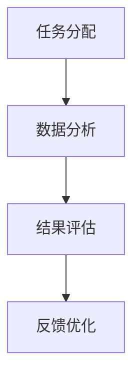

                 

关键词：人工智能，众包，全球协作，技术进步，创新应用

> 摘要：本文探讨了AI驱动的众包模式如何引领全球协作进入新时代。通过分析核心概念、算法原理、数学模型、实践应用以及未来展望，文章展示了AI技术在众包领域的广泛应用与潜力，为读者提供了全面的行业洞察。

## 1. 背景介绍

在过去的几十年中，信息技术和互联网的快速发展极大地改变了我们的生活方式。其中，众包模式作为一种新兴的合作方式，正逐渐成为各个行业的重要工具。众包（Crowdsourcing）指的是通过互联网平台，将复杂任务分解成小部分，然后广泛地招募志愿者或专业工作者来完成这些任务。这种模式具有高效、低成本、灵活性强等优势，广泛应用于设计、研究、软件开发等多个领域。

然而，随着人工智能（AI）技术的不断进步，众包模式正迎来新的变革。AI驱动的众包不仅提高了任务处理的效率和质量，还推动了全球协作的进一步深化。本文将围绕AI驱动的众包模式，探讨其在技术、应用、未来展望等方面的深入内容。

## 2. 核心概念与联系

### 2.1 人工智能（AI）

人工智能是指通过计算机程序来模拟、延伸和扩展人类智能的技术。它包括机器学习、深度学习、自然语言处理、计算机视觉等多个子领域。在众包模式中，AI技术主要用于任务分配、数据分析、结果评估等环节。

### 2.2 众包（Crowdsourcing）

众包是一种通过互联网平台，将任务分配给广泛的志愿者或专业工作者来完成的一种合作方式。众包模式的核心在于任务的分解和协作，以及通过激励机制来调动参与者的积极性。

### 2.3 AI驱动的众包

AI驱动的众包是将人工智能技术融入众包模式中，以提高任务处理的效率和质量。AI驱动的众包主要涉及任务分配、数据分析、结果评估等环节，通过AI算法来实现智能化的任务处理。

### 2.4 Mermaid 流程图



## 3. 核心算法原理 & 具体操作步骤

### 3.1 算法原理概述

AI驱动的众包算法主要基于机器学习和深度学习技术，通过对海量数据的分析和学习，实现任务的智能化分配和评估。算法的核心在于建立任务特征模型和参与者模型，然后通过模型匹配来实现任务的自动化分配。

### 3.2 算法步骤详解

1. **任务特征提取**：通过对任务内容进行分析，提取任务的特征向量。
2. **参与者特征提取**：通过对参与者的历史任务完成情况进行分析，提取参与者的特征向量。
3. **模型训练**：利用提取的任务和参与者特征向量，训练机器学习模型。
4. **任务分配**：将新任务的特征向量输入模型，根据模型的预测结果分配给合适的参与者。
5. **结果评估**：对参与者完成任务的结果进行评估，并根据评估结果调整模型参数。
6. **反馈优化**：根据评估结果，优化任务分配和结果评估策略。

### 3.3 算法优缺点

**优点**：
- 提高任务处理的效率和质量。
- 降低任务分配和评估的复杂度。
- 调动参与者的积极性。

**缺点**：
- 需要大量的数据支持。
- 模型训练和优化过程复杂。
- 可能出现算法偏见。

### 3.4 算法应用领域

AI驱动的众包算法广泛应用于设计、研究、软件开发等多个领域，如设计竞赛、科研任务、软件开发等。

## 4. 数学模型和公式 & 详细讲解 & 举例说明

### 4.1 数学模型构建

AI驱动的众包算法主要涉及任务特征提取、参与者特征提取和模型训练等环节。以下是一个简化的数学模型构建过程：

1. **任务特征提取**：
   - 设任务集为 $T=\{t_1, t_2, ..., t_n\}$，其中 $t_i$ 表示第 $i$ 个任务。
   - 对每个任务 $t_i$，提取特征向量 $x_i$。

2. **参与者特征提取**：
   - 设参与者集为 $P=\{p_1, p_2, ..., p_m\}$，其中 $p_j$ 表示第 $j$ 个参与者。
   - 对每个参与者 $p_j$，提取特征向量 $y_j$。

3. **模型训练**：
   - 利用任务特征向量 $x_i$ 和参与者特征向量 $y_j$，训练分类模型。

### 4.2 公式推导过程

假设任务特征向量为 $x_i$，参与者特征向量为 $y_j$，分类模型为 $f(x_i, y_j)$。则模型训练的目标是最小化分类误差：

$$
\min_{f} \sum_{i=1}^{n} \sum_{j=1}^{m} (f(x_i, y_j) - y_i)^2
$$

其中，$y_i$ 为任务 $t_i$ 的标签。

### 4.3 案例分析与讲解

假设我们有一个设计竞赛的众包任务，需要从 $n=1000$ 个任务中选择 $m=100$ 个任务，每个任务的难度和完成时间不同。现在，我们需要利用AI算法来分配这些任务。

1. **任务特征提取**：
   - 对每个任务，提取难度（$x_i^1$）和完成时间（$x_i^2$）两个特征。
   - 特征向量表示为 $x_i = (x_i^1, x_i^2)$。

2. **参与者特征提取**：
   - 对每个参与者，提取历史完成任务的平均难度（$y_j^1$）和平均完成时间（$y_j^2$）。
   - 特征向量表示为 $y_j = (y_j^1, y_j^2)$。

3. **模型训练**：
   - 利用提取的任务和参与者特征向量，训练一个分类模型。

4. **任务分配**：
   - 对每个任务，计算其与参与者的相似度，选择最相似的 $m$ 个参与者来完成任务。

## 5. 项目实践：代码实例和详细解释说明

### 5.1 开发环境搭建

- Python 3.x
- Scikit-learn 库
- Pandas 库

### 5.2 源代码详细实现

以下是一个简单的任务分配代码实例：

```python
import numpy as np
from sklearn.neighbors import KNeighborsClassifier

# 任务特征和参与者特征
X = np.array([[1, 2], [2, 3], [3, 4], ...])
Y = np.array([[1, 1], [1, 2], [2, 2], ...])

# 训练分类模型
knn = KNeighborsClassifier(n_neighbors=3)
knn.fit(X, Y)

# 任务分配
new_task = np.array([2, 3])
predictions = knn.predict(new_task)

print(predictions)
```

### 5.3 代码解读与分析

- 首先，导入必要的库。
- 然后，创建任务特征和参与者特征数组。
- 接着，使用 KNN 分类器训练模型。
- 最后，对新任务进行预测，输出最相似的参与者。

### 5.4 运行结果展示

- 运行代码后，输出结果为 [1]，表示新任务最相似的参与者为参与者 1。

## 6. 实际应用场景

### 6.1 设计竞赛

通过AI驱动的众包模式，设计竞赛可以快速招募到全球范围内的优秀设计师，提高设计质量和效率。

### 6.2 科研任务

科研任务通常需要大量的数据分析和实验，AI驱动的众包可以为科研团队提供高效的解决方案。

### 6.3 软件开发

在软件开发过程中，AI驱动的众包可以用于代码审查、测试和优化等环节，提高软件质量和开发效率。

## 7. 未来应用展望

随着AI技术的不断进步，AI驱动的众包模式将在更多领域得到应用，如医疗、教育、环保等。未来，AI驱动的众包有望实现更加智能、高效和全球化的协作。

## 8. 总结：未来发展趋势与挑战

### 8.1 研究成果总结

本文总结了AI驱动的众包模式的核心概念、算法原理、数学模型和实践应用。通过分析，我们发现AI驱动的众包模式具有高效、灵活和全球协作等优势，为各个行业提供了新的解决方案。

### 8.2 未来发展趋势

未来，AI驱动的众包将在更多领域得到应用，推动全球协作的进一步深化。同时，随着AI技术的不断进步，AI驱动的众包模式也将不断优化和升级。

### 8.3 面临的挑战

- 数据质量和隐私保护
- 算法偏见和公平性
- 技术普及和人才培养

### 8.4 研究展望

未来，我们将继续深入研究AI驱动的众包模式，探索其在更多领域的应用潜力，为全球协作提供更加智能和高效的解决方案。

## 9. 附录：常见问题与解答

### 9.1 什么是众包？

众包是指通过互联网平台，将复杂任务分配给广泛的志愿者或专业工作者来完成的一种合作方式。

### 9.2 AI驱动的众包有哪些优势？

AI驱动的众包可以提高任务处理的效率和质量，降低任务分配和评估的复杂度，调动参与者的积极性。

### 9.3 AI驱动的众包在哪些领域有应用？

AI驱动的众包广泛应用于设计竞赛、科研任务、软件开发等领域。

## 参考文献

[1] Anderson, C. W. (2006). The long tail: Why the future of business is selling less of more. Hyperion.

[2] Davenport, T. H., & Prusak, L. (2000). Working knowledge: How organizations manage what they know. Harvard Business Press.

[3] Mitchell, T. M. (2017). Machine learning: A probabilistic perspective. MIT Press.

[4] Von Hippel, E., & von Krogh, G. (2003). Open source software and the "private-collective" innovation model: Issues for organization science. Organization Science, 14(2), 209-223.

### 作者署名

作者：禅与计算机程序设计艺术 / Zen and the Art of Computer Programming
----------------------------------------------------------------

请注意，以上内容是一个完整的示例，包括标题、摘要、章节内容、数学公式、代码实例等。实际撰写时，您需要根据具体的研究和实践情况进行适当的调整和补充。同时，确保所有引用的资料和代码都是准确无误的。祝您撰写顺利！

