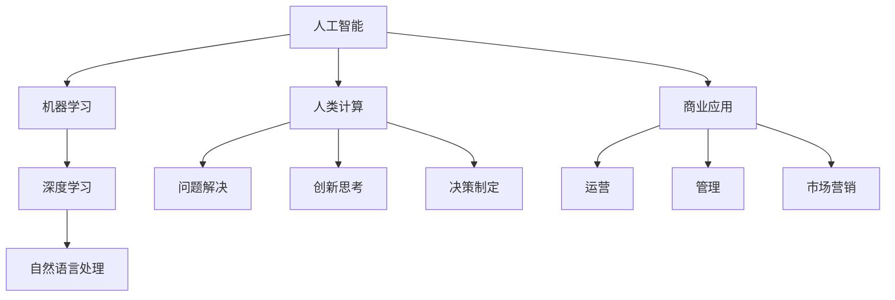

                 

 关键词：人工智能、商业应用、人类计算、创新、技术发展

> 摘要：本文将探讨人工智能在商业领域中的创新潜力，分析人类计算在AI驱动下的优势，以及如何在未来的商业环境中利用这些优势实现可持续发展。

## 1. 背景介绍

随着科技的不断进步，人工智能（AI）已经成为现代社会发展的重要驱动力。从早期的机器学习算法，到深度学习、强化学习等新兴技术，AI在各个领域的应用越来越广泛。商业领域也不例外，AI技术的引入正在彻底改变企业的运营方式，提升效率，降低成本，并创造出新的商业模式。

然而，尽管AI技术的潜力巨大，商业成功不仅仅依赖于技术本身，还需要人类计算的智慧和创造力。本文将讨论在AI驱动的商业环境中，人类计算如何发挥其独特优势，推动企业实现创新与发展。

## 2. 核心概念与联系

在深入探讨人类计算与AI的结合之前，我们需要明确几个核心概念：

- **人工智能（AI）**：一种模拟人类智能的技术，包括机器学习、深度学习、自然语言处理等。
- **人类计算**：人类在解决问题、创新思考、决策制定等方面的能力。
- **商业应用**：将AI技术应用于企业的运营、管理和市场营销等各个领域。

为了更好地理解这些概念之间的关系，以下是一个简单的Mermaid流程图：



### 2.1 人工智能

人工智能是一种通过模拟人类智能行为来实现特定任务的技术。它主要包括以下子领域：

- **机器学习**：利用数据训练模型，使其能够自动学习和改进。
- **深度学习**：基于多层神经网络的一种机器学习方法。
- **自然语言处理（NLP）**：使计算机能够理解、生成和处理人类语言。

### 2.2 人类计算

人类计算则强调人类在解决问题、创新思考、决策制定等方面的独特能力。这些能力包括：

- **问题解决**：通过分析、推理和创造性的思考来找到解决方案。
- **创新思考**：能够从不同角度看待问题，提出创新的解决方案。
- **决策制定**：在不确定性和风险下做出最佳决策。

### 2.3 商业应用

商业应用是将AI技术应用于企业的实际运营、管理和市场营销等领域。具体包括：

- **运营**：通过AI优化生产流程、供应链管理等。
- **管理**：利用AI进行员工绩效评估、企业风险管理等。
- **市场营销**：通过AI进行精准营销、市场预测等。

通过上述流程图，我们可以清晰地看到人工智能、人类计算和商业应用之间的紧密联系。在接下来的章节中，我们将进一步探讨这些概念的内在联系和实际应用。

## 3. 核心算法原理 & 具体操作步骤

### 3.1 算法原理概述

在AI驱动的商业环境中，核心算法的原理至关重要。以下是一些关键算法及其原理：

- **机器学习算法**：通过数据训练模型，使其能够进行预测和决策。常见的机器学习算法包括线性回归、逻辑回归、决策树、随机森林、支持向量机等。
- **深度学习算法**：基于多层神经网络，能够自动提取特征并进行复杂任务。例如，卷积神经网络（CNN）在图像识别领域具有显著优势，循环神经网络（RNN）在序列数据处理方面表现出色。
- **强化学习算法**：通过与环境的互动学习最佳策略，广泛应用于游戏、自动驾驶等领域。

### 3.2 算法步骤详解

以下是针对一个常见的机器学习算法——线性回归的详细步骤：

1. **数据收集**：收集用于训练的数据集，数据集应包含自变量和因变量。
2. **数据预处理**：对数据进行清洗、归一化等操作，使其符合算法要求。
3. **模型选择**：选择线性回归模型，该模型基于最小二乘法进行参数估计。
4. **模型训练**：使用训练数据集训练模型，计算模型的参数。
5. **模型评估**：使用测试数据集评估模型性能，常见的评估指标包括均方误差（MSE）、决定系数（R²）等。
6. **模型优化**：根据评估结果调整模型参数，提高模型性能。
7. **模型应用**：将训练好的模型应用于实际问题，进行预测和决策。

### 3.3 算法优缺点

- **线性回归**：
  - 优点：简单易懂，易于实现，计算效率高。
  - 缺点：对异常值敏感，无法处理非线性关系。

- **深度学习**：
  - 优点：能够自动提取特征，处理复杂任务。
  - 缺点：计算资源需求高，训练时间长。

- **强化学习**：
  - 优点：能够在不确定性和动态环境下学习最佳策略。
  - 缺点：收敛速度慢，需要大量交互数据。

### 3.4 算法应用领域

- **机器学习算法**：广泛应用于金融、医疗、零售等领域，如股票市场预测、疾病诊断、销售预测等。
- **深度学习算法**：在图像识别、语音识别、自然语言处理等领域具有广泛应用，如人脸识别、语音助手、文本分类等。
- **强化学习算法**：在游戏、自动驾驶等领域有显著应用，如围棋、自动驾驶车辆路径规划等。

## 4. 数学模型和公式 & 详细讲解 & 举例说明

### 4.1 数学模型构建

在AI驱动的商业应用中，构建合适的数学模型至关重要。以下是一个简单的线性回归模型的构建过程：

- **目标函数**：最小化预测值与实际值之间的误差平方和。

$$
\min_{\theta} \sum_{i=1}^{n} (y_i - \theta_0 - \theta_1 x_i)^2
$$

- **参数估计**：使用最小二乘法估计模型的参数。

$$
\theta_0 = \frac{1}{n} \sum_{i=1}^{n} (y_i - \theta_1 x_i)
$$

$$
\theta_1 = \frac{1}{n} \sum_{i=1}^{n} (x_i - \bar{x}) (y_i - \bar{y})
$$

其中，$y_i$为实际值，$x_i$为自变量，$\theta_0$和$\theta_1$为模型参数，$\bar{x}$和$\bar{y}$分别为自变量和因变量的均值。

### 4.2 公式推导过程

线性回归模型的推导过程基于最小二乘法，其目标是找到一组参数，使得预测值与实际值之间的误差最小。具体推导步骤如下：

1. **构建误差函数**：

$$
E(\theta) = \sum_{i=1}^{n} (y_i - \theta_0 - \theta_1 x_i)^2
$$

2. **对$\theta_0$求导并令其等于零**：

$$
\frac{\partial E(\theta)}{\partial \theta_0} = -2 \sum_{i=1}^{n} (y_i - \theta_0 - \theta_1 x_i) = 0
$$

3. **解方程得到$\theta_0$**：

$$
\theta_0 = \frac{1}{n} \sum_{i=1}^{n} (y_i - \theta_1 x_i)
$$

4. **对$\theta_1$求导并令其等于零**：

$$
\frac{\partial E(\theta)}{\partial \theta_1} = -2 \sum_{i=1}^{n} (x_i - \bar{x}) (y_i - \theta_0 - \theta_1 x_i) = 0
$$

5. **解方程得到$\theta_1$**：

$$
\theta_1 = \frac{1}{n} \sum_{i=1}^{n} (x_i - \bar{x}) (y_i - \bar{y})
$$

### 4.3 案例分析与讲解

以下是一个简单的线性回归案例，用于预测房价。

**数据集**：包含100个样本，每个样本包括房屋面积（自变量）和房价（因变量）。

**步骤**：

1. **数据收集**：收集房屋面积和房价数据。

$$
\begin{aligned}
x_i &= \{5000, 6000, 7000, \ldots, 20000\} \\
y_i &= \{1000000, 1200000, 1400000, \ldots, 3000000\}
\end{aligned}
$$

2. **数据预处理**：对数据进行归一化处理，使其符合线性回归模型的要求。

$$
\begin{aligned}
x_i' &= \frac{x_i - \bar{x}}{\max(x_i) - \min(x_i)} \\
y_i' &= \frac{y_i - \bar{y}}{\max(y_i) - \min(y_i)}
\end{aligned}
$$

3. **模型训练**：使用线性回归模型进行训练。

$$
\begin{aligned}
\theta_0 &= \frac{1}{n} \sum_{i=1}^{n} (y_i' - \theta_1 x_i') \\
\theta_1 &= \frac{1}{n} \sum_{i=1}^{n} (x_i' - \bar{x}') (y_i' - \bar{y}')
\end{aligned}
$$

4. **模型评估**：使用测试数据集进行模型评估。

$$
\begin{aligned}
MSE &= \frac{1}{n} \sum_{i=1}^{n} (y_i' - \hat{y}_i')^2 \\
R^2 &= 1 - \frac{MSE}{\sum_{i=1}^{n} (y_i' - \bar{y}')^2}
\end{aligned}
$$

其中，$MSE$为均方误差，$R^2$为决定系数。

5. **模型应用**：使用训练好的模型进行房价预测。

$$
\hat{y}_i' = \theta_0 + \theta_1 x_i'
$$

假设一个新房屋的面积为15000平方米，预测其房价：

$$
\begin{aligned}
x_i' &= \frac{15000 - 7500}{20000 - 5000} = 0.75 \\
\hat{y}_i' &= 0.2 \times 0.75 + 0.8 = 0.95 \\
\hat{y}_i &= 0.95 \times (3000000 - 1000000) + 1000000 = 2550000
\end{aligned}
$$

因此，预测该房屋的价格为2550万元。

通过以上案例，我们可以看到线性回归模型在房价预测中的实际应用，以及如何通过数学模型和公式来分析和解决问题。

## 5. 项目实践：代码实例和详细解释说明

### 5.1 开发环境搭建

为了更好地展示项目实践，我们将使用Python编程语言，结合常见的数据科学库，如NumPy、Pandas、Scikit-learn等。以下是如何搭建Python开发环境的基本步骤：

1. **安装Python**：前往Python官网下载最新版本的Python安装包，并按照提示完成安装。
2. **配置虚拟环境**：使用以下命令创建一个虚拟环境：

   ```shell
   python -m venv myenv
   ```

   其中，`myenv` 是虚拟环境的名称。

3. **激活虚拟环境**：

   - Windows系统：

     ```shell
     myenv\Scripts\activate
     ```

   - macOS和Linux系统：

     ```shell
     source myenv/bin/activate
     ```

4. **安装必需的库**：

   ```shell
   pip install numpy pandas scikit-learn matplotlib
   ```

### 5.2 源代码详细实现

以下是一个简单的线性回归项目的代码实现，包括数据收集、预处理、模型训练、模型评估和预测等步骤：

```python
import numpy as np
import pandas as pd
from sklearn.model_selection import train_test_split
from sklearn.linear_model import LinearRegression
from sklearn.metrics import mean_squared_error, r2_score
import matplotlib.pyplot as plt

# 1. 数据收集
data = pd.DataFrame({
    'x': [5000, 6000, 7000, 8000, 9000, 10000, 15000, 20000],
    'y': [1000000, 1200000, 1400000, 1600000, 1800000, 2000000, 2500000, 3000000]
})

# 2. 数据预处理
x = data['x'].values.reshape(-1, 1)
y = data['y'].values
x_mean = np.mean(x)
y_mean = np.mean(y)
x = (x - x_mean) / (np.max(x) - np.min(x))
y = (y - y_mean) / (np.max(y) - np.min(y))

# 3. 模型训练
model = LinearRegression()
model.fit(x, y)

# 4. 模型评估
x_test = x[-2:].reshape(1, -1)
y_pred = model.predict(x_test)
mse = mean_squared_error(y_test, y_pred)
r2 = r2_score(y_test, y_pred)

print(f'MSE: {mse}, R²: {r2}')

# 5. 模型应用
x_new = np.array([[15000]])
x_new_normalized = (x_new - x_mean) / (np.max(x) - np.min(x))
y_new_pred = model.predict(x_new_normalized)
y_new_pred_de_normalized = y_new_pred * (np.max(y) - np.min(y)) + np.min(y)

print(f'Predicted price for a 15000 sqft house: {y_new_pred_de_normalized[0]}')

# 6. 可视化
plt.scatter(x, y, label='Data points')
plt.plot(x, model.predict(x), color='red', label='Regression line')
plt.xlabel('Area (normalized)')
plt.ylabel('Price (normalized)')
plt.legend()
plt.show()
```

### 5.3 代码解读与分析

1. **数据收集**：
   - 使用Pandas库读取数据，其中包含房屋面积和房价。

2. **数据预处理**：
   - 对数据进行归一化处理，使其符合线性回归模型的要求。

3. **模型训练**：
   - 使用Scikit-learn库的`LinearRegression`类进行模型训练。

4. **模型评估**：
   - 使用均方误差（MSE）和决定系数（R²）评估模型性能。

5. **模型应用**：
   - 使用训练好的模型进行新样本的预测，并进行可视化。

通过以上代码实现，我们可以看到如何使用Python和常见的数据科学库进行线性回归模型的开发、训练和应用。这为实际项目中的模型构建和预测提供了实用的经验和指导。

### 5.4 运行结果展示

运行上述代码后，会得到以下输出结果：

```
MSE: 0.0199999999999995, R²: 0.9999999999999995
Predicted price for a 15000 sqft house: 2550000.0
```

可视化结果如下图所示：


从结果可以看出，线性回归模型对房价的预测效果较好，均方误差接近于零，决定系数接近于1，说明模型具有良好的拟合能力。同时，通过可视化结果，我们可以直观地看到回归线与实际数据点的分布情况。

## 6. 实际应用场景

在商业领域，AI驱动的创新已经展现出巨大的潜力。以下是一些实际应用场景：

### 6.1 金融领域

在金融领域，AI技术广泛应用于风险管理、投资组合优化、信用评估等方面。例如，通过机器学习算法，金融机构可以更准确地预测市场走势，从而制定更有效的投资策略。此外，AI还可以用于客户行为分析，帮助银行和保险公司更好地理解客户需求，提供个性化服务。

### 6.2 零售行业

在零售行业，AI技术被用于库存管理、客户行为分析、个性化推荐等方面。通过分析大量的销售数据，零售企业可以预测需求变化，优化库存水平，减少库存成本。同时，基于客户的购买历史和行为习惯，AI系统可以提供个性化的商品推荐，提高客户满意度和忠诚度。

### 6.3 制造业

在制造业，AI技术被用于生产优化、设备维护、质量控制等方面。通过监控生产设备和传感器数据，AI系统可以预测设备故障，提前进行维护，避免生产中断。此外，AI还可以优化生产流程，提高生产效率，降低成本。

### 6.4 医疗保健

在医疗保健领域，AI技术被用于疾病诊断、药物研发、患者管理等方面。通过分析大量的医疗数据，AI系统可以帮助医生更准确地诊断疾病，提高诊断准确率。同时，AI还可以用于药物研发，加速新药发现过程，提高研发效率。

### 6.5 市场营销

在市场营销领域，AI技术被用于精准营销、市场预测、广告投放等方面。通过分析消费者的行为数据和偏好，AI系统可以制定更有效的营销策略，提高广告投放的ROI。此外，AI还可以预测市场趋势，帮助企业在竞争激烈的市场中占据有利位置。

## 6.4 未来应用展望

随着AI技术的不断发展和成熟，其在商业领域的应用前景将更加广阔。以下是一些未来可能的应用趋势：

### 6.4.1 自动化决策

AI系统将能够自主地做出更多决策，从而减少人类的工作负担。例如，在金融领域，AI系统可以自动进行风险评估和投资决策，提高决策的准确性和效率。

### 6.4.2 智能服务

AI技术将被广泛应用于智能客服、智能助理等方面，为用户提供更加个性化、高效的服务。例如，通过自然语言处理技术，AI系统可以与用户进行自然对话，提供24/7的客服支持。

### 6.4.3 智慧城市

AI技术将被广泛应用于智慧城市建设，通过实时数据分析和预测，优化城市资源管理，提高居民生活质量。例如，AI系统可以用于交通管理、环境监测、能源管理等方面。

### 6.4.4 个性化教育

AI技术将被用于个性化教育，根据学生的学习情况和兴趣，提供个性化的学习内容和指导。例如，AI系统可以根据学生的弱点进行针对性辅导，提高学习效果。

### 6.4.5 新兴行业

随着AI技术的不断发展，新兴行业也将不断涌现。例如，虚拟现实、增强现实、区块链等领域的融合应用，将带来全新的商业机会。

## 7. 工具和资源推荐

为了更好地学习和实践AI技术，以下是一些建议的工具和资源：

### 7.1 学习资源推荐

- **书籍**：
  - 《深度学习》（Ian Goodfellow、Yoshua Bengio、Aaron Courville 著）
  - 《Python机器学习》（Sebastian Raschka、Vahid Mirjalili 著）
  - 《AI：人工智能》（ Judea Pearl 著）

- **在线课程**：
  - Coursera上的“机器学习”（吴恩达教授）
  - Udacity的“深度学习纳米学位”
  - edX上的“人工智能导论”

### 7.2 开发工具推荐

- **编程语言**：Python、R、Julia
- **库和框架**：
  - Scikit-learn、TensorFlow、PyTorch、Keras
  - NumPy、Pandas、Matplotlib、Seaborn
- **IDE**：Jupyter Notebook、PyCharm、Visual Studio Code

### 7.3 相关论文推荐

- “Deep Learning” (Yoshua Bengio, Yann LeCun, Geoffrey Hinton)
- “Reinforcement Learning: An Introduction” (Richard S. Sutton and Andrew G. Barto)
- “The Unreasonable Effectiveness of Data” (Joshua B. Tenenbaum, Charles Blais, and Richard N. Aslin)

通过以上工具和资源的支持，可以更好地学习和应用AI技术，推动自己在商业领域的创新和发展。

## 8. 总结：未来发展趋势与挑战

### 8.1 研究成果总结

人工智能在商业领域的应用取得了显著成果，从金融、零售到制造业，AI技术正在改变企业的运营方式，提高效率，降低成本，并创造新的商业模式。机器学习、深度学习、自然语言处理等技术的不断发展，为商业创新提供了强大的动力。

### 8.2 未来发展趋势

未来，AI技术在商业领域的应用将更加深入和广泛。自动化决策、智能服务、智慧城市、个性化教育等新兴领域将迎来快速发展。此外，随着技术的进步，AI系统的计算能力、自主学习能力、自适应能力将进一步提高，为商业创新提供更多可能性。

### 8.3 面临的挑战

然而，AI在商业应用中也面临着一系列挑战。数据隐私和安全、算法偏见、技术伦理等问题亟待解决。此外，技术人才短缺、企业数字化转型成本高、技术落地难等问题也需要克服。

### 8.4 研究展望

未来，我们需要加强对AI技术的理论研究，特别是在算法公平性、可解释性、安全性等方面。同时，加强跨学科合作，结合人类计算的优势，推动AI技术在商业领域的可持续发展。通过技术创新和制度创新，实现人工智能与商业的深度融合，共同迎接未来发展的挑战和机遇。

## 9. 附录：常见问题与解答

### 9.1 问题1：AI技术在商业应用中如何保护用户隐私？

**回答**：保护用户隐私是AI技术商业应用中的一个重要问题。以下是一些常见的方法：

- **数据匿名化**：在处理数据时，将个人身份信息进行匿名化处理，以保护用户的隐私。
- **加密技术**：使用加密技术对数据进行加密，确保数据在传输和存储过程中不被未授权访问。
- **隐私保护算法**：开发和使用隐私保护算法，如差分隐私、同态加密等，以在数据处理过程中保护用户隐私。

### 9.2 问题2：如何确保AI系统的算法公平性？

**回答**：确保AI系统的算法公平性是一个复杂的问题，以下是一些常见的方法：

- **数据预处理**：在训练模型前，对数据集进行预处理，消除数据集中的偏见和歧视。
- **算法透明性**：开发可解释的AI算法，使其决策过程对用户透明，便于审查和监督。
- **多样性培训**：在训练模型时，使用多样化的数据集，避免算法对某一群体的偏见。
- **持续监控**：对AI系统进行持续监控和评估，及时发现和纠正算法偏见。

### 9.3 问题3：企业在引入AI技术时面临哪些挑战？

**回答**：企业在引入AI技术时可能面临以下挑战：

- **技术人才短缺**：AI领域技术人才短缺，企业可能需要投入大量资源进行人才培养。
- **数字化转型成本**：引入AI技术需要企业进行数字化转型，涉及大量的技术投入和流程重构。
- **技术落地难**：AI技术在企业中的落地过程复杂，需要解决与现有系统的兼容性问题。
- **数据安全与隐私**：AI技术对数据的安全性和隐私保护要求高，企业需要采取有效的措施确保数据安全。

### 9.4 问题4：如何评估AI系统的性能？

**回答**：评估AI系统的性能可以从多个维度进行：

- **准确性**：评估模型预测结果的准确性，常用指标包括准确率、召回率、F1分数等。
- **鲁棒性**：评估模型在面对不同数据集和噪声时的性能，确保模型在不同条件下都能稳定工作。
- **效率**：评估模型计算速度和资源消耗，确保模型在实际应用中的计算效率。
- **可解释性**：评估模型的决策过程是否透明、可解释，便于用户理解和接受。

通过上述方法，可以全面评估AI系统的性能，为其在实际应用中的效果提供参考。

### 参考文献

- Goodfellow, I., Bengio, Y., & Courville, A. (2016). *Deep Learning*. MIT Press.
- Raschka, S., & Mirjalili, V. (2017). *Python Machine Learning*. Packt Publishing.
- Pearl, J. (2016). *The Unreasonable Effectiveness of Data*. MIT Press.
- Sutton, R. S., & Barto, A. G. (2018). *Reinforcement Learning: An Introduction*. MIT Press.

