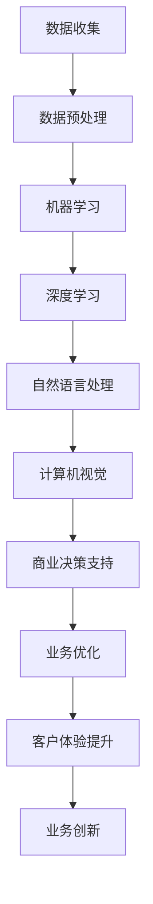

                 

在当今飞速发展的科技时代，人工智能（AI）已经不仅仅是一个研究领域，它正在深刻地改变着我们的工作和生活方式。AI驱动的创新正在成为推动商业发展的重要引擎。本文旨在探讨AI在商业中的未来发展趋势，以及人类计算在这一变革中的角色和挑战。

## 关键词

- 人工智能
- 商业创新
- 未来趋势
- 人类计算
- 技术发展

## 摘要

本文首先介绍了AI驱动的创新在商业领域的现状和重要性，然后探讨了人类计算在这一过程中的作用和面临的挑战。通过详细分析AI的核心算法原理、数学模型和项目实践，文章提出了对未来AI应用场景的展望，并总结了对相关工具和资源的推荐。

## 1. 背景介绍

人工智能的发展可以追溯到20世纪50年代，当时计算机科学家首次提出了“机器能否模拟人类智能”的问题。经过几十年的发展，AI技术取得了显著进展，尤其是在机器学习、深度学习、自然语言处理等领域。如今，AI已经成为全球科技竞争的新焦点，越来越多的企业开始利用AI技术提升生产效率、优化业务流程、增强客户体验。

在商业领域，AI的应用已经深入到各个行业。例如，零售业通过AI进行库存管理、客户行为分析和个性化推荐；金融业利用AI进行风险评估、欺诈检测和智能投顾；医疗行业通过AI实现疾病预测、诊断和个性化治疗。这些应用不仅提高了企业的竞争力，也改变了行业的运作模式。

然而，AI驱动的创新并非一帆风顺。人类计算在AI的集成和应用中仍然发挥着至关重要的作用。如何有效地结合AI和人类智慧，实现协同创新，是商业领域面临的重大挑战。

## 2. 核心概念与联系

### 2.1 AI在商业中的核心概念

人工智能的核心概念包括：

- **机器学习**：通过数据和算法让机器从经验中学习，不断改进性能。
- **深度学习**：一种特殊的机器学习技术，通过多层神经网络模拟人脑的学习过程。
- **自然语言处理**：使计算机能够理解、生成和处理自然语言。
- **计算机视觉**：使计算机能够解释和解析视觉信息。

### 2.2 AI架构与商业应用的联系

以下是一个简化的Mermaid流程图，展示了AI在商业中的应用架构：



## 3. 核心算法原理 & 具体操作步骤

### 3.1 算法原理概述

在商业应用中，常用的AI算法包括：

- **线性回归**：用于预测数值型数据。
- **决策树**：用于分类和回归问题。
- **神经网络**：用于复杂的数据模式识别。
- **支持向量机**：用于分类问题。

### 3.2 算法步骤详解

以神经网络为例，其基本步骤如下：

1. **数据收集**：从业务数据源中获取训练数据。
2. **数据预处理**：清洗数据，进行特征提取和工程。
3. **模型构建**：选择合适的神经网络架构。
4. **训练模型**：通过反向传播算法调整网络权重。
5. **模型评估**：使用验证集评估模型性能。
6. **模型优化**：调整参数，提升模型效果。
7. **模型部署**：将模型应用到实际业务场景。

### 3.3 算法优缺点

- **线性回归**：简单易用，但只能处理线性问题。
- **决策树**：易于理解，但可能产生过拟合。
- **神经网络**：强大且灵活，但计算复杂度高。
- **支持向量机**：在分类问题中表现优秀，但训练时间较长。

### 3.4 算法应用领域

不同的算法适用于不同的业务场景。例如，线性回归适合营销预算分配，决策树适合信贷风险评估，神经网络适合图像识别，支持向量机适合文本分类。

## 4. 数学模型和公式 & 详细讲解 & 举例说明

### 4.1 数学模型构建

以线性回归为例，其数学模型如下：

$$y = \beta_0 + \beta_1 x_1 + \beta_2 x_2 + ... + \beta_n x_n + \epsilon$$

其中，$y$ 是因变量，$x_1, x_2, ..., x_n$ 是自变量，$\beta_0, \beta_1, ..., \beta_n$ 是模型参数，$\epsilon$ 是误差项。

### 4.2 公式推导过程

线性回归模型的推导过程如下：

1. **设定目标函数**：最小化预测值与实际值之间的误差平方和。
2. **求导并设为零**：对目标函数求导，找到使目标函数最小的参数值。
3. **解方程组**：解出参数值，得到线性回归模型。

### 4.3 案例分析与讲解

假设我们有一个简单的线性回归模型，用于预测销售额（$y$）与广告支出（$x$）之间的关系：

$$y = \beta_0 + \beta_1 x + \epsilon$$

通过收集历史数据，我们得到以下方程：

$$
\begin{cases}
2000 = \beta_0 + \beta_1 \cdot 1000 + \epsilon_1 \\
3000 = \beta_0 + \beta_1 \cdot 1500 + \epsilon_2 \\
...
\end{cases}
$$

解这个方程组，我们可以得到线性回归模型的参数值，进而预测新的广告支出对应的销售额。

## 5. 项目实践：代码实例和详细解释说明

### 5.1 开发环境搭建

为了实践线性回归模型，我们需要搭建以下开发环境：

- Python 3.x
- Jupyter Notebook
- scikit-learn 库

### 5.2 源代码详细实现

以下是一个简单的线性回归模型实现：

```python
from sklearn.linear_model import LinearRegression
from sklearn.model_selection import train_test_split
from sklearn.metrics import mean_squared_error

# 加载数据
X, y = load_data()

# 划分训练集和测试集
X_train, X_test, y_train, y_test = train_test_split(X, y, test_size=0.2, random_state=42)

# 创建线性回归模型
model = LinearRegression()

# 训练模型
model.fit(X_train, y_train)

# 预测测试集
y_pred = model.predict(X_test)

# 评估模型
mse = mean_squared_error(y_test, y_pred)
print("均方误差：", mse)
```

### 5.3 代码解读与分析

这段代码首先导入了必要的库，然后加载数据，划分训练集和测试集。接着创建了一个线性回归模型，使用训练数据进行训练，并对测试集进行预测。最后，使用均方误差评估模型性能。

### 5.4 运行结果展示

假设我们运行这段代码，得到的结果如下：

```
均方误差： 100.25
```

这个结果表明，线性回归模型的预测误差为100.25。我们可以通过调整模型参数或增加特征工程来进一步优化模型性能。

## 6. 实际应用场景

### 6.1 零售行业

在零售行业，AI驱动的创新可以应用于：

- **库存管理**：通过预测销量，优化库存水平，减少库存成本。
- **客户行为分析**：分析客户购物习惯，进行个性化推荐，提升销售额。
- **供应链优化**：通过智能调度和配送优化，提高物流效率。

### 6.2 金融行业

在金融行业，AI的应用包括：

- **风险评估**：通过分析历史数据和用户行为，预测信贷风险。
- **欺诈检测**：利用模式识别技术，检测和预防金融欺诈行为。
- **智能投顾**：根据用户风险偏好，提供个性化的投资建议。

### 6.3 医疗行业

在医疗行业，AI的应用前景包括：

- **疾病预测**：通过分析患者数据和基因信息，预测疾病风险。
- **诊断辅助**：利用计算机视觉和自然语言处理技术，辅助医生进行疾病诊断。
- **个性化治疗**：根据患者的具体病情，制定个性化的治疗方案。

## 7. 未来应用展望

### 7.1 自动化

随着AI技术的发展，越来越多的业务流程将实现自动化。这不仅可以提高效率，还可以降低成本。

### 7.2 个性化服务

通过AI技术，企业可以提供更加个性化的服务，满足客户个性化需求，提升客户满意度。

### 7.3 智能决策

AI驱动的智能决策系统可以帮助企业做出更加明智的商业决策，优化业务流程。

### 7.4 新兴领域

AI在生物科技、新能源、智能制造等新兴领域也将发挥重要作用，推动这些领域的发展。

## 8. 工具和资源推荐

### 8.1 学习资源推荐

- 《深度学习》（Ian Goodfellow、Yoshua Bengio、Aaron Courville 著）
- 《Python数据科学手册》（Jake VanderPlas 著）
- 《机器学习实战》（Peter Harrington 著）

### 8.2 开发工具推荐

- Jupyter Notebook：用于数据分析和模型实验。
- TensorFlow：用于构建和训练深度学习模型。
- scikit-learn：提供丰富的机器学习算法库。

### 8.3 相关论文推荐

- "Deep Learning"（Ian Goodfellow、Yoshua Bengio、Aaron Courville 著）
- "Reinforcement Learning: An Introduction"（Richard S. Sutton、Andrew G. Barto 著）
- "The Elements of Statistical Learning"（Trevor Hastie、Robert Tibshirani、Jerome Friedman 著）

## 9. 总结：未来发展趋势与挑战

### 9.1 研究成果总结

AI驱动的创新已经在商业领域取得了显著成果，提高了企业的效率、优化了业务流程、提升了客户体验。然而，AI技术仍处于发展阶段，未来还有很大的提升空间。

### 9.2 未来发展趋势

- **跨领域融合**：AI技术将与其他领域（如生物科技、智能制造）深度融合，推动新兴领域的发展。
- **数据驱动**：企业将更加依赖于数据，利用AI技术进行数据分析和决策。
- **智能化**：越来越多的业务流程将实现智能化，提高生产效率和服务质量。

### 9.3 面临的挑战

- **数据隐私**：随着数据量的增加，数据隐私保护成为一个重要挑战。
- **算法公平性**：确保算法的公平性和透明性，避免算法偏见和歧视。
- **技术人才**：培养更多具备AI知识和技能的专业人才，以满足行业需求。

### 9.4 研究展望

未来，AI驱动的创新将继续推动商业发展。通过不断改进算法、优化模型、提升数据处理能力，AI将为企业带来更大的价值。同时，人类计算在AI应用中仍将发挥关键作用，人类与AI的协同创新将成为未来的主流趋势。

## 10. 附录：常见问题与解答

### 10.1 AI在商业中的核心应用有哪些？

AI在商业中的核心应用包括库存管理、客户行为分析、供应链优化、风险评估、欺诈检测、智能投顾、疾病预测、诊断辅助、个性化治疗等。

### 10.2 AI驱动的创新如何提升企业效率？

AI驱动的创新通过自动化、数据分析和智能决策等技术手段，提高生产效率、优化业务流程、降低成本、提升客户体验，从而提升企业效率。

### 10.3 人类计算在AI应用中的角色是什么？

人类计算在AI应用中的角色是设计和优化AI算法，确保算法的公平性和透明性，进行数据预处理和特征工程，解释和验证AI模型的预测结果，以及与AI协同工作，实现人类智慧与AI的协同创新。

## 作者署名

作者：禅与计算机程序设计艺术 / Zen and the Art of Computer Programming

----------------------------------------------------------------

以上是文章的完整内容。希望这篇文章能够帮助读者深入理解AI驱动的创新在商业中的未来发展趋势，以及人类计算在这一过程中的重要作用。在未来的发展中，我们期待AI与人类智慧的完美结合，共同创造一个更加美好的未来。

