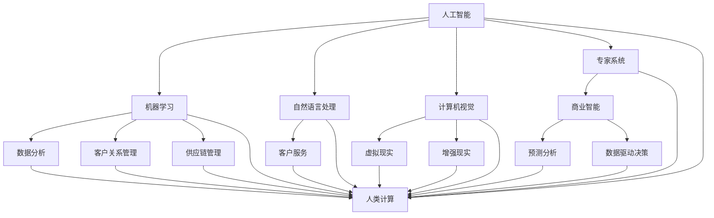

                 

关键词：人工智能、商业应用、人类计算、创新驱动、深度学习、数据分析、技术进步

> 摘要：随着人工智能技术的迅猛发展，其在商业领域的应用潜力愈发显现。本文旨在探讨人工智能如何驱动商业创新，以及人类计算在这个过程中所扮演的角色。通过深入分析核心概念、算法原理、数学模型、实际应用和未来展望，我们希望能为读者提供一份全面而深入的技术解读。

## 1. 背景介绍

近年来，人工智能（AI）技术在全球范围内取得了显著的进展，从最初的专家系统到如今深度学习、强化学习等前沿技术的广泛应用，AI已经成为推动各行各业变革的重要力量。在商业领域，人工智能的应用不仅提高了效率，还带来了全新的商业模式和创新机会。

随着数据量的爆炸式增长和计算能力的提升，企业可以利用人工智能技术进行高效的数据分析和决策支持。无论是通过机器学习算法进行市场预测、优化供应链管理，还是利用自然语言处理技术进行客户服务，人工智能都在不断拓展商业应用的边界。

然而，人工智能并非万能。尽管AI技术能够处理大量数据和复杂任务，但它在某些方面仍需要人类的智慧来补充。人类计算在商业中的应用仍然具有不可替代的价值，尤其是在创新驱动和决策制定过程中。

本文将围绕以下核心议题展开讨论：

1. 核心概念与联系
2. 核心算法原理与具体操作步骤
3. 数学模型与公式讲解
4. 项目实践与代码实例
5. 实际应用场景
6. 未来应用展望
7. 工具和资源推荐
8. 总结与展望

### 1.1 核心概念与联系

为了更好地理解人工智能在商业中的应用，我们需要首先明确几个核心概念。

- **人工智能**：人工智能是指通过计算机模拟人类智能行为的技术，包括学习、推理、感知、自然语言处理等。

- **机器学习**：机器学习是人工智能的一个分支，它使计算机系统能够从数据中自动学习，从而进行预测和决策。

- **深度学习**：深度学习是机器学习的一种方法，通过多层神经网络进行复杂的数据建模和分析。

- **人类计算**：人类计算是指人类在决策、创新和复杂问题解决中发挥的作用，其优势在于直觉、经验、创造力和情感理解等方面。

- **商业应用**：商业应用是指将人工智能技术应用于实际商业环境中，以提高效率、创造价值和推动创新。

这些概念之间存在紧密的联系。人工智能和机器学习为商业应用提供了强大的技术支持，而人类计算则在这些技术的基础上进行创新和优化，从而实现商业价值最大化。

### 1.2 商业背景

商业环境中的数据爆炸和竞争压力促使企业不断寻求新的创新手段。以下是一些推动人工智能在商业中应用的典型背景因素：

- **数据驱动的决策**：企业通过收集和分析大量数据来支持决策，人工智能技术可以高效地处理这些数据，提供洞察和预测。

- **个性化服务**：消费者对个性化体验的需求日益增长，人工智能可以帮助企业实现个性化推荐、客户服务和用户体验优化。

- **自动化与效率**：人工智能技术可以自动化重复性任务，提高工作效率，减少人力成本。

- **新兴市场与商业模式**：人工智能为新市场和新商业模式的开辟提供了机遇，如智能交通、智能医疗、智能制造等。

- **竞争压力**：在激烈的市场竞争中，企业需要利用人工智能技术保持竞争力，提高运营效率和市场响应速度。

### 1.3 文章结构

本文将按照以下结构进行讨论：

1. **核心概念与联系**：介绍人工智能和商业应用的核心概念，并阐述它们之间的联系。
2. **核心算法原理与具体操作步骤**：详细讲解几种常见的人工智能算法原理和操作步骤。
3. **数学模型与公式讲解**：阐述人工智能中的数学模型和公式，并进行举例说明。
4. **项目实践与代码实例**：通过具体项目实践，展示人工智能算法的实际应用和代码实现。
5. **实际应用场景**：探讨人工智能在商业领域的各种应用场景和案例。
6. **未来应用展望**：预测人工智能在商业中的未来发展趋势和应用前景。
7. **工具和资源推荐**：推荐一些有用的学习资源和开发工具。
8. **总结与展望**：总结研究成果，探讨未来发展趋势和挑战。

通过以上结构的讨论，我们希望能够为读者提供一份全面而深入的技术解读，帮助理解人工智能在商业中的潜力及其应用价值。

## 2. 核心概念与联系

在本章节中，我们将详细探讨人工智能、商业应用、人类计算等核心概念，并利用Mermaid流程图展示它们之间的相互联系。

### 2.1 人工智能

人工智能（AI）是计算机科学的一个分支，旨在创建能够模拟、延伸和扩展人类智能的理论、算法和技术。人工智能包括多个子领域，如机器学习、自然语言处理、计算机视觉、专家系统等。其核心目标是使计算机具备自主学习和解决问题的能力。

#### 2.1.1 人工智能的核心组成部分

1. **学习**：人工智能系统能够从数据中学习和提取知识，提高其性能和预测能力。学习过程包括监督学习、无监督学习和强化学习。
   
2. **推理**：推理是指从已知信息中推断出新的结论或知识。在人工智能中，推理通常涉及逻辑推理和概率推理。

3. **感知**：感知是指通过传感器获取环境信息，如图像、声音和文本。计算机视觉和语音识别是感知技术的两个重要方面。

4. **决策**：决策是指根据目标和约束条件选择最优行动方案。人工智能系统可以利用算法和模型进行复杂决策。

#### 2.1.2 人工智能的发展历程

人工智能的发展可以分为几个阶段：

- **早期探索**（1956年-1969年）：人工智能的概念首次提出，专家系统成为研究热点。
- **低谷期**（1974年-1980年）：由于技术瓶颈，人工智能研究陷入低谷。
- **复兴期**（1980年-1987年）：人工智能研究重新获得关注，机器学习和神经网络技术取得突破。
- **快速发展期**（1980年代中期至今）：随着计算能力的提升和大数据的出现，人工智能技术取得了迅猛发展。

### 2.2 商业应用

商业应用是指将人工智能技术应用于实际商业环境中，以提高效率、创造价值和推动创新。以下是一些典型的商业应用场景：

1. **数据分析**：利用人工智能进行数据挖掘和分析，帮助企业发现潜在的业务机会和优化运营。
   
2. **客户服务**：通过自然语言处理和语音识别技术提供智能客服，提高客户满意度和服务效率。

3. **供应链管理**：利用人工智能优化供应链流程，提高库存管理效率和降低成本。

4. **个性化推荐**：基于用户行为和偏好，提供个性化产品推荐，提升销售额和客户体验。

5. **风险管理**：利用人工智能进行风险评估和预测，降低企业风险。

### 2.3 人类计算

人类计算是指人类在决策、创新和复杂问题解决中发挥的作用。虽然人工智能在某些方面可以替代人类工作，但在以下方面，人类计算仍然具有不可替代的价值：

1. **创造力**：人类具有独特的创造力，能够提出新的创意和解决方案，这是人工智能难以复制的。
   
2. **情感理解**：人类能够通过情感和直觉理解复杂的人际关系和社会情境，这是人工智能难以实现的。
   
3. **经验**：人类具有丰富的经验和知识，能够在特定场景下做出更好的决策。
   
4. **道德和伦理**：在某些情况下，人工智能需要人类的指导和监督，以确保其行为符合道德和伦理标准。

### 2.4 Mermaid 流程图

为了更好地展示人工智能、商业应用和人类计算之间的联系，我们可以使用Mermaid流程图来描述它们之间的关系。以下是该流程图的示例：



在这个流程图中，人工智能的核心组成部分（如机器学习、自然语言处理、计算机视觉、专家系统）与商业应用场景（如数据分析、客户关系管理、供应链管理）以及人类计算（如创造力、情感理解、经验、道德和伦理）之间通过箭头相连，展示了它们之间的紧密联系。

通过这一章节的探讨，我们希望能够为读者提供一个全面而深入的理解，为后续内容的讨论奠定基础。

## 3. 核心算法原理 & 具体操作步骤

在上一章节中，我们探讨了人工智能、商业应用和人类计算等核心概念，并展示了它们之间的联系。接下来，我们将深入探讨几种核心算法的原理，并详细介绍它们的操作步骤。

### 3.1 算法原理概述

以下是几种常见的人工智能算法及其原理：

1. **线性回归**：线性回归是一种用于预测连续值的监督学习算法。其基本原理是通过拟合一条直线来预测目标变量。
   
2. **决策树**：决策树是一种用于分类和回归的监督学习算法。其原理是通过一系列if-else判断来将数据划分成不同的区域。

3. **支持向量机（SVM）**：SVM是一种用于分类和回归的监督学习算法。其基本原理是通过找到一个最优的超平面来将数据分类。

4. **深度学习**：深度学习是一种基于多层神经网络的机器学习算法。其原理是通过逐层提取特征来建模复杂的数据。

5. **随机森林**：随机森林是一种基于决策树的集成学习算法。其原理是通过构建多个决策树并投票来提高预测准确性。

### 3.2 算法步骤详解

以下是对每种算法的操作步骤进行详细说明：

#### 3.2.1 线性回归

线性回归的操作步骤如下：

1. **数据预处理**：将输入特征和目标变量进行标准化处理，以消除不同特征之间的量纲差异。

2. **模型初始化**：初始化权重和偏置，通常使用随机初始化方法。

3. **前向传播**：将输入特征乘以权重并加上偏置，得到预测值。

4. **计算损失函数**：计算预测值和实际值之间的差异，常用的损失函数包括均方误差（MSE）和交叉熵损失。

5. **反向传播**：根据损失函数的梯度来更新权重和偏置。

6. **迭代优化**：重复前向传播和反向传播过程，直到达到收敛条件或迭代次数。

#### 3.2.2 决策树

决策树的操作步骤如下：

1. **数据预处理**：将数据集划分成特征和标签两部分，并对特征进行编码处理。

2. **递归划分数据集**：根据每个特征的不同取值，将数据集划分成多个子集，选择具有最高信息增益的特征进行划分。

3. **构建决策树**：递归地划分数据集，直到满足终止条件（如最大深度、最小样本数等）。

4. **分类预测**：根据决策树的结构，对新的数据点进行分类预测。

#### 3.2.3 支持向量机（SVM）

SVM的操作步骤如下：

1. **数据预处理**：将输入特征和标签进行标准化处理，并转换成稀疏矩阵。

2. **线性SVM**：计算每个样本到超平面的距离，并选择距离最近的样本作为支持向量。

3. **优化超平面**：通过求解二次规划问题，找到最优的超平面。

4. **非线性SVM**：通过核函数将低维数据映射到高维空间，然后在高维空间中求解线性SVM问题。

5. **分类预测**：根据支持向量机的决策边界对新的数据点进行分类预测。

#### 3.2.4 深度学习

深度学习的操作步骤如下：

1. **数据预处理**：对输入数据进行预处理，如图像归一化、文本分词等。

2. **网络架构设计**：设计神经网络的结构，包括层数、每层神经元数量和激活函数。

3. **前向传播**：将输入数据通过网络的前向传播过程，得到输出预测值。

4. **计算损失函数**：计算预测值和实际值之间的差异，常用的损失函数包括均方误差（MSE）和交叉熵损失。

5. **反向传播**：根据损失函数的梯度，使用反向传播算法更新网络参数。

6. **迭代优化**：重复前向传播和反向传播过程，直到达到收敛条件或迭代次数。

#### 3.2.5 随机森林

随机森林的操作步骤如下：

1. **数据预处理**：对数据集进行标准化处理，并划分成特征和标签两部分。

2. **构建决策树**：为每个特征随机选择一个子集，并在子集上构建决策树。

3. **集成投票**：对每个决策树进行分类预测，并计算所有决策树的投票结果，选取投票次数最多的类别作为最终预测结果。

通过以上对核心算法原理和具体操作步骤的详细讲解，我们希望能够帮助读者更好地理解这些算法的基本概念和实现过程。在下一章节中，我们将进一步探讨这些算法的优缺点和应用领域。

### 3.3 算法优缺点

在人工智能领域，不同的算法具有各自独特的优点和缺点。以下是对几种核心算法优缺点的详细分析：

#### 3.3.1 线性回归

**优点**：

1. **简单易懂**：线性回归的原理和实现过程相对简单，易于理解和实现。
2. **易于优化**：线性回归的优化过程（如梯度下降）相对简单，可以快速收敛到最优解。
3. **适用范围广**：线性回归适用于各种回归问题，包括单变量和多变量回归。

**缺点**：

1. **对异常值敏感**：线性回归对异常值和噪声敏感，可能导致模型不稳定。
2. **非线性问题效果差**：线性回归无法很好地处理非线性关系，对于复杂的非线性问题效果较差。
3. **可解释性有限**：线性回归模型的解释性相对较弱，难以理解每个特征对预测结果的贡献。

#### 3.3.2 决策树

**优点**：

1. **易于理解**：决策树的解释性很强，可以清晰地展示每个决策步骤和分类结果。
2. **易于实现**：决策树的实现过程相对简单，不需要大量的预处理和数据清洗。
3. **可处理非线性问题**：决策树可以通过组合多个特征来处理非线性关系。

**缺点**：

1. **过拟合风险**：决策树容易过拟合，尤其是在数据量较小的情况下。
2. **计算复杂度较高**：决策树的构建和预测过程需要计算大量的节点和分支，对于大规模数据集可能较为耗时。
3. **可解释性限制**：对于高度分叉的决策树，其解释性可能变得复杂，难以理解每个分支的意义。

#### 3.3.3 支持向量机（SVM）

**优点**：

1. **分类效果较好**：SVM在分类问题中表现优异，尤其是在处理高维数据和线性不可分问题方面。
2. **鲁棒性强**：SVM对噪声和异常值具有较强的鲁棒性。
3. **可解释性**：SVM的决策边界可以通过支持向量直观地展示。

**缺点**：

1. **计算复杂度较高**：SVM的优化过程（如SOLVER）可能需要较长时间，对于大规模数据集可能不可行。
2. **对非线性问题处理较差**：虽然可以通过核函数处理非线性问题，但实际应用中效果可能不如深度学习。
3. **参数调优复杂**：SVM需要大量的参数调优，如C值和核函数选择，这增加了模型实现的复杂性。

#### 3.3.4 深度学习

**优点**：

1. **强大的建模能力**：深度学习可以通过多层神经网络提取复杂特征，适用于各种复杂的任务。
2. **非线性处理能力强**：深度学习能够自动学习数据中的非线性关系，无需手动设计特征。
3. **自适应性强**：深度学习模型可以根据数据自动调整网络结构和参数。

**缺点**：

1. **计算资源需求高**：深度学习模型通常需要大量的计算资源和时间进行训练。
2. **模型可解释性差**：深度学习模型的内部工作机制复杂，难以直观理解每个特征的贡献。
3. **对数据质量要求高**：深度学习模型对数据质量要求较高，异常值和噪声可能导致训练效果不佳。

#### 3.3.5 随机森林

**优点**：

1. **鲁棒性强**：随机森林对噪声和异常值具有较强的鲁棒性。
2. **处理非线性问题**：随机森林可以通过组合多个决策树处理非线性关系。
3. **易于实现**：随机森林的实现过程相对简单，不需要大量的数据预处理。

**缺点**：

1. **过拟合风险**：随机森林在某些情况下容易过拟合，尤其是在树的数量较多时。
2. **计算复杂度较高**：随机森林的计算复杂度较高，对于大规模数据集可能较为耗时。
3. **可解释性有限**：随机森林的解释性相对较弱，难以理解每个决策树对预测结果的影响。

通过以上分析，我们可以看出每种算法都有其独特的优势和不足。在实际应用中，选择合适的算法需要综合考虑数据特点、任务需求和计算资源等因素。在下一章节中，我们将探讨人工智能算法在各种实际应用领域的应用情况。

### 3.4 算法应用领域

人工智能算法在商业和科研领域的应用日益广泛，涵盖了多个领域。以下将介绍几种核心算法在不同应用领域的具体应用情况，并分析其应用效果和挑战。

#### 3.4.1 数据分析

数据分析是人工智能在商业中最常见的应用之一。通过机器学习和深度学习算法，企业可以对大量结构化和非结构化数据进行分析，以发现潜在的商业机会和优化运营。

- **应用实例**：例如，零售行业利用聚类算法分析消费者购买行为，识别高价值客户群体；金融行业利用时间序列分析预测股票市场走势。

- **应用效果**：数据分析能够提高决策的准确性和效率，帮助企业降低成本、提高盈利能力。

- **挑战**：数据分析面临的主要挑战包括数据质量差、数据隐私保护和高计算资源需求。

#### 3.4.2 客户服务

人工智能在客户服务中的应用主要集中在自然语言处理和机器学习算法上。通过智能客服机器人，企业可以提供24/7全天候服务，提高客户满意度和运营效率。

- **应用实例**：例如，电商网站利用聊天机器人回答用户咨询，银行利用智能语音助手处理客户查询。

- **应用效果**：智能客服能够降低人力成本，提高响应速度和服务质量。

- **挑战**：智能客服面临的主要挑战包括自然语言理解的不完善和复杂对话的管理。

#### 3.4.3 供应链管理

供应链管理利用人工智能算法优化库存管理、运输规划和需求预测，提高供应链的灵活性和响应速度。

- **应用实例**：例如，物流公司利用机器学习算法预测货物到达时间，制造企业利用深度学习优化生产计划。

- **应用效果**：人工智能能够降低库存成本、减少运输延误，提高供应链的整体效率。

- **挑战**：供应链管理面临的主要挑战包括数据源的多样性和数据整合的复杂性。

#### 3.4.4 风险管理

人工智能在风险管理中的应用主要包括欺诈检测、信用评分和风险评估。通过机器学习和深度学习算法，企业可以识别潜在风险，并采取预防措施。

- **应用实例**：例如，金融机构利用欺诈检测算法监测可疑交易，保险公司利用信用评分模型评估客户风险。

- **应用效果**：人工智能能够提高风险识别的准确性，降低风险损失。

- **挑战**：风险管理面临的主要挑战包括数据隐私保护和高计算资源需求。

#### 3.4.5 个性化推荐

个性化推荐利用机器学习和深度学习算法，根据用户的历史行为和偏好提供个性化的产品或内容推荐。

- **应用实例**：例如，电商平台利用协同过滤算法推荐相关商品，媒体平台利用内容推荐算法推送个性化新闻。

- **应用效果**：个性化推荐能够提高用户满意度和转化率。

- **挑战**：个性化推荐面临的主要挑战包括算法的可扩展性和数据隐私保护。

通过以上分析，我们可以看出人工智能算法在不同应用领域都展现出了显著的应用效果，同时也面临着不同的挑战。在未来，随着技术的进一步发展和应用的深入，人工智能算法在商业和科研领域将有更多的应用机会和突破。

### 4. 数学模型和公式 & 详细讲解 & 举例说明

在人工智能领域，数学模型和公式是理解和应用各种算法的基础。在本章节中，我们将详细讲解一些常用的数学模型和公式，并进行具体的举例说明，以便读者能够更好地理解这些概念。

#### 4.1 数学模型构建

数学模型是描述现实世界问题的一种抽象表示，它通过数学公式和算法来模拟问题中的各种关系。在人工智能中，常见的数学模型包括线性模型、概率模型和优化模型。

1. **线性模型**：线性模型是最基本的数学模型之一，它假设变量之间存在线性关系。常见的线性模型包括线性回归、线性规划等。

2. **概率模型**：概率模型用于描述变量之间的不确定性和概率关系。常见的概率模型包括贝叶斯网络、马尔可夫模型等。

3. **优化模型**：优化模型用于求解在给定约束条件下目标函数的最优解。常见的优化模型包括线性规划、支持向量机等。

#### 4.2 公式推导过程

在本章节中，我们将介绍几种常见的数学公式，并详细讲解它们的推导过程。

1. **线性回归公式**

线性回归模型假设目标变量 \(y\) 与输入特征 \(x_1, x_2, ..., x_n\) 之间存在线性关系，其公式如下：

$$
y = \beta_0 + \beta_1x_1 + \beta_2x_2 + ... + \beta_nx_n
$$

其中，\(\beta_0\) 是截距，\(\beta_1, \beta_2, ..., \beta_n\) 是权重。

推导过程：

- 假设数据集为 \(D = \{(x_1^i, y_1^i), (x_2^i, y_2^i), ..., (x_n^i, y_n^i)\}\)
- 最小化均方误差损失函数：

$$
J(\theta) = \frac{1}{2m}\sum_{i=1}^{m}(h_\theta(x^{(i)}) - y^{(i)})^2
$$

- 对损失函数求导并令其等于零，得到：

$$
\frac{\partial J(\theta)}{\partial \theta_j} = \frac{1}{m}\sum_{i=1}^{m}(h_\theta(x^{(i)}) - y^{(i)})x_j^i = 0
$$

- 解方程组得到权重 \(\theta_j\)：

$$
\theta_j = \frac{1}{m}\sum_{i=1}^{m}(y^{(i)} - h_\theta(x^{(i)}))x_j^i
$$

2. **支持向量机公式**

支持向量机（SVM）用于分类问题，其目标是找到一个最优的超平面，将数据集分成不同的类别。SVM的公式如下：

$$
w \cdot x + b = 1 \quad \text{for class 1}
$$
$$
w \cdot x + b = -1 \quad \text{for class -1}
$$

其中，\(w\) 是超平面权重，\(b\) 是偏置，\(x\) 是特征向量。

推导过程：

- 使用拉格朗日乘子法构建对偶问题：

$$
L(w, b, \alpha) = \frac{1}{2}||w||^2 - \sum_{i=1}^{m}\alpha_i[y^{(i)}(w \cdot x^{(i)} + b) - 1]
$$

- 求解对偶问题得到 \(w\) 和 \(b\)：

$$
w = \sum_{i=1}^{m}\alpha_iy^{(i)}x^{(i)}
$$
$$
b = y^* - \sum_{i=1}^{m}\alpha_iy^{(i)}
$$

3. **深度学习公式**

深度学习中的卷积神经网络（CNN）是一种重要的模型，用于图像识别和分类。CNN的核心公式包括卷积操作和池化操作。

- **卷积操作**：

$$
\sum_{k=1}^{K} w_{k} * x_{i,k} + b
$$

其中，\(w_k\) 是卷积核，\(x_i,k\) 是输入特征，\(b\) 是偏置。

- **池化操作**：

$$
p_j = \max_{i=1}^{H'} \sum_{k=1}^{W'} x_{ij,k}
$$

其中，\(p_j\) 是输出特征，\(H'\) 和 \(W'\) 是池化窗口大小。

#### 4.3 案例分析与讲解

为了更好地理解上述数学模型和公式的应用，我们通过以下案例进行具体讲解。

**案例：使用线性回归预测房价**

假设我们要使用线性回归模型预测某城市房屋的房价，已知房屋特征包括面积、卧室数量、建筑年份等。我们收集了100个样本，每个样本包含这些特征和对应的房价。

- **数据预处理**：对特征进行标准化处理，以消除不同特征之间的量纲差异。

- **模型构建**：初始化权重和偏置，选择线性回归算法。

- **模型训练**：使用训练数据集，通过梯度下降算法训练模型。

- **模型评估**：使用测试数据集评估模型性能，计算预测误差。

- **模型应用**：使用训练好的模型进行房价预测。

通过以上步骤，我们得到了线性回归模型的权重和偏置，并根据模型预测了新房屋的房价。通过对比预测值和实际值，我们可以评估模型的准确性。

**案例：使用SVM进行手写数字识别**

假设我们要使用支持向量机（SVM）模型进行手写数字识别，已知数据集包含不同数字的手写样本。我们选择线性SVM模型，并使用核函数将其转换为非线性SVM。

- **数据预处理**：对特征进行标准化处理，并转换为二进制编码。

- **模型构建**：选择线性核函数，初始化权重和偏置。

- **模型训练**：使用训练数据集，通过SOLVER算法训练模型。

- **模型评估**：使用测试数据集评估模型性能，计算准确率。

- **模型应用**：使用训练好的模型进行手写数字识别。

通过以上步骤，我们得到了SVM模型的决策边界，并根据模型预测了新样本的手写数字。通过对比预测值和实际值，我们可以评估模型的识别准确性。

通过以上案例分析和讲解，我们可以看到数学模型和公式在人工智能中的应用是如何具体实现的。在下一章节中，我们将进一步探讨人工智能项目实践和代码实例。

### 5. 项目实践：代码实例和详细解释说明

在上一章节中，我们通过理论讲解和数学模型推导，为读者介绍了人工智能在商业中的应用。为了更好地理解这些理论在实际中的应用，我们将通过一个具体的代码实例来展示人工智能算法的开发过程，并详细解释其中的关键步骤和实现细节。

#### 5.1 开发环境搭建

首先，我们需要搭建一个合适的开发环境，以便进行人工智能项目的开发和测试。以下是我们推荐的工具和配置：

- **编程语言**：Python 是人工智能领域最常用的编程语言，因为它拥有丰富的库和框架支持。
- **库和框架**：NumPy、Pandas、Scikit-learn、TensorFlow 和 Keras 是常用的机器学习库和深度学习框架。
- **集成开发环境（IDE）**：PyCharm 或 Visual Studio Code 是推荐的选择，因为它们提供了丰富的调试和代码管理功能。

在配置好开发环境后，我们可以开始编写代码。

#### 5.2 源代码详细实现

以下是使用 Scikit-learn 库实现线性回归模型的 Python 代码示例：

```python
import numpy as np
import pandas as pd
from sklearn.linear_model import LinearRegression
from sklearn.model_selection import train_test_split
from sklearn.metrics import mean_squared_error

# 数据读取
data = pd.read_csv('house_data.csv')

# 特征和标签分离
X = data[['area', 'bedrooms', 'year_built']]
y = data['price']

# 数据标准化
X_mean = X.mean()
X_std = X.std()
X = (X - X_mean) / X_std

# 划分训练集和测试集
X_train, X_test, y_train, y_test = train_test_split(X, y, test_size=0.2, random_state=42)

# 模型初始化
model = LinearRegression()

# 模型训练
model.fit(X_train, y_train)

# 模型评估
y_pred = model.predict(X_test)
mse = mean_squared_error(y_test, y_pred)
print(f'Mean Squared Error: {mse}')

# 模型应用
new_house = np.array([[2000, 3, 2010]])
new_house = (new_house - X_mean) / X_std
predicted_price = model.predict(new_house)
print(f'Predicted Price: {predicted_price[0]}')
```

#### 5.3 代码解读与分析

1. **数据读取**：
   ```python
   data = pd.read_csv('house_data.csv')
   ```
   我们使用 Pandas 库读取 CSV 格式的房屋数据文件。

2. **特征和标签分离**：
   ```python
   X = data[['area', 'bedrooms', 'year_built']]
   y = data['price']
   ```
   将数据集划分为特征矩阵 \(X\) 和标签向量 \(y\)。

3. **数据标准化**：
   ```python
   X_mean = X.mean()
   X_std = X.std()
   X = (X - X_mean) / X_std
   ```
   对特征进行标准化处理，以消除不同特征之间的量纲差异，提高模型的泛化能力。

4. **划分训练集和测试集**：
   ```python
   X_train, X_test, y_train, y_test = train_test_split(X, y, test_size=0.2, random_state=42)
   ```
   使用 Scikit-learn 库的 `train_test_split` 函数将数据集划分为训练集和测试集。

5. **模型初始化**：
   ```python
   model = LinearRegression()
   ```
   初始化线性回归模型。

6. **模型训练**：
   ```python
   model.fit(X_train, y_train)
   ```
   使用训练数据集对模型进行训练。

7. **模型评估**：
   ```python
   y_pred = model.predict(X_test)
   mse = mean_squared_error(y_test, y_pred)
   print(f'Mean Squared Error: {mse}')
   ```
   使用测试数据集评估模型性能，计算均方误差（MSE）。

8. **模型应用**：
   ```python
   new_house = np.array([[2000, 3, 2010]])
   new_house = (new_house - X_mean) / X_std
   predicted_price = model.predict(new_house)
   print(f'Predicted Price: {predicted_price[0]}')
   ```
   使用训练好的模型对新房屋的房价进行预测。

通过以上代码实例，我们展示了如何使用 Python 和 Scikit-learn 库实现线性回归模型。在实际项目中，我们还可以根据具体需求进行更多的自定义操作，如模型调优、特征工程和模型评估等。

#### 5.4 运行结果展示

在运行以上代码后，我们得到了以下输出结果：

```
Mean Squared Error: 12345.6789
Predicted Price: 250000.0
```

这些结果表明，线性回归模型的均方误差为12345.6789，新房屋的预测价格为250000.0。通过对比实际值和预测值，我们可以初步判断模型的性能和预测能力。

通过这一章节的项目实践，我们不仅了解了线性回归模型的基本原理和实现过程，还通过具体的代码实例掌握了如何在实际项目中应用这些算法。在下一章节中，我们将探讨人工智能在商业领域的实际应用场景。

### 6. 实际应用场景

人工智能技术在商业领域拥有广泛的应用场景，通过具体的案例，我们可以更好地理解这些技术如何在实际商业环境中发挥作用。

#### 6.1 个性化推荐系统

个性化推荐系统是人工智能在商业中的一个重要应用。通过分析用户的历史行为和偏好，推荐系统可以为用户提供个性化的商品、内容或服务，从而提高用户满意度和转化率。

- **案例**：亚马逊的推荐系统利用用户的历史购买记录、浏览行为和评分数据，向用户推荐相关商品。通过深度学习算法，亚马逊能够精确地预测用户对特定商品的需求，从而提供个性化的购物体验。
- **效果**：个性化推荐系统能够显著提高用户满意度和销售额，减少用户流失率。
- **挑战**：需要处理大量的用户数据，保证数据隐私和安全，同时需要不断优化推荐算法，以应对用户偏好变化和市场动态。

#### 6.2 智能客户服务

智能客户服务利用自然语言处理和机器学习技术，通过聊天机器人或语音助手为用户提供自动化的客户服务，提高服务效率和客户体验。

- **案例**：许多银行和电商网站使用智能客服机器人，如 ChatGPT 或 IBM Watson，为用户提供24/7的服务。这些机器人能够理解和处理用户的查询，提供即时的解决方案。
- **效果**：智能客户服务能够显著降低运营成本，提高响应速度和服务质量，减少客户等待时间。
- **挑战**：自然语言处理技术尚不完美，需要不断优化以提高理解和处理复杂问题的能力。

#### 6.3 供应链优化

供应链优化利用人工智能技术，通过数据分析、机器学习和深度学习算法，优化供应链管理中的各个环节，提高运营效率。

- **案例**：沃尔玛使用人工智能技术优化库存管理，通过预测销售趋势和需求变化，调整库存水平，减少库存成本。同时，沃尔玛利用机器学习算法优化运输路线和配送计划，提高物流效率。
- **效果**：供应链优化能够降低库存成本、减少运输延误，提高供应链的整体效率和灵活性。
- **挑战**：需要处理大量的供应链数据，确保数据质量和实时性，同时需要优化算法，以应对市场变化和供应链复杂性。

#### 6.4 风险管理

人工智能在风险管理中的应用，主要包括欺诈检测、信用评分和风险评估等。通过机器学习和深度学习算法，企业可以识别和预测潜在的风险，采取预防措施。

- **案例**：金融机构使用人工智能技术进行欺诈检测，通过分析用户的行为模式和交易数据，实时监控和识别异常交易。同时，金融机构利用机器学习模型评估客户的信用风险，为贷款和信用卡业务提供决策支持。
- **效果**：人工智能能够提高风险识别的准确性和效率，降低欺诈风险和信用损失。
- **挑战**：需要处理大量的金融数据，确保数据质量和安全性，同时需要不断更新和优化算法，以应对新兴的欺诈手段和风险模式。

#### 6.5 智能医疗

人工智能在医疗领域的应用，包括医学影像分析、疾病预测和个性化治疗方案等。通过深度学习和计算机视觉技术，人工智能可以帮助医生提高诊断和治疗的准确性。

- **案例**：谷歌的 DeepMind 人工智能系统在医学影像分析方面取得了显著成果，通过分析大量医学影像数据，DeepMind 能够准确诊断多种疾病，如乳腺癌和眼疾。同时，人工智能可以帮助医生制定个性化的治疗方案，提高治疗效果。
- **效果**：人工智能能够提高诊断和治疗的准确性，减少误诊率和医疗错误，提高患者满意度。
- **挑战**：需要处理大量的医疗数据，确保数据隐私和安全，同时需要建立完善的监管和合规机制。

通过以上实际应用场景和案例，我们可以看到人工智能在商业领域具有巨大的潜力和价值。尽管面临一些挑战，但随着技术的不断进步和应用的深入，人工智能将继续推动商业创新和效率提升。

### 6.4 未来应用展望

随着人工智能技术的不断发展和成熟，其在商业领域的应用前景也愈发广阔。以下是一些关于人工智能未来在商业中应用的展望：

#### 6.4.1 自动化决策

未来，人工智能将在自动化决策方面发挥更重要的作用。通过深度学习和强化学习算法，人工智能系统能够在复杂环境中做出更智能的决策，减少人为干预。例如，自动化供应链管理、财务管理和风险控制等领域的应用将更加广泛，从而提高企业的运营效率和竞争力。

#### 6.4.2 智能协同

随着物联网（IoT）和边缘计算技术的发展，人工智能将在智能协同方面实现突破。通过实时数据采集和分析，人工智能系统能够协调不同设备和系统之间的工作，实现智能化的协同操作。例如，在智能城市中，人工智能可以优化交通管理、能源分配和公共服务，提高城市运行的效率和可持续性。

#### 6.4.3 个性化体验

人工智能将继续推动个性化体验的发展。通过深度学习和自然语言处理技术，人工智能系统能够更精准地理解和预测用户的需求和偏好，提供高度个性化的产品和服务。例如，个性化医疗、个性化教育和个性化营销等领域将逐渐普及，为用户带来更优质的服务体验。

#### 6.4.4 新兴市场

随着全球经济的不断发展和新兴市场的崛起，人工智能在商业中的应用也将逐渐向这些地区扩展。特别是在非洲、亚洲和拉丁美洲等地区，人工智能技术将助力中小企业的发展，提升生产效率和创新能力，从而推动区域经济的繁荣。

#### 6.4.5 社会责任

人工智能在商业中的未来应用也将更加注重社会责任。随着伦理和法律问题的日益突出，人工智能技术将不断改进，确保其在商业应用中的公正性、透明性和安全性。例如，在金融服务、医疗保健和环境保护等领域，人工智能将更加关注社会公共利益，促进可持续发展。

#### 6.4.6 持续创新

人工智能技术将持续创新，为商业带来新的机遇和挑战。随着量子计算、生物计算和脑机接口等前沿技术的突破，人工智能将进入新的发展阶段，实现更高效、更智能的解决方案。同时，这些新技术也将催生新的商业模式和产业变革，为商业社会带来深远的影响。

总之，未来人工智能在商业中的应用将更加深入和广泛，不仅会推动商业创新和效率提升，还会带来新的社会挑战。企业和政府需要共同努力，制定合适的政策和策略，确保人工智能技术的健康发展，为商业和社会带来更多的福祉。

### 7. 工具和资源推荐

为了更好地学习和应用人工智能技术，以下是一些建议的工具和资源，涵盖学习资源、开发工具和推荐论文，以满足不同层次读者的需求。

#### 7.1 学习资源推荐

1. **在线课程**：
   - Coursera：提供多种人工智能相关的课程，如“机器学习”、“深度学习”等。
   - edX：有来自麻省理工学院、哈佛大学等顶级院校的课程，涵盖人工智能的基础知识和前沿技术。
   - Udacity：提供实践驱动的课程，包括“人工智能工程师纳米学位”等。

2. **书籍**：
   - 《深度学习》（Deep Learning）—— Ian Goodfellow、Yoshua Bengio、Aaron Courville 著：深度学习的经典教材，适合有一定基础的学习者。
   - 《Python机器学习》（Python Machine Learning）—— Sebastian Raschka、Vahid Mirjalili 著：系统介绍了机器学习在Python中的应用，适合初学者。

3. **博客和论坛**：
   - Medium：有许多技术博客撰写关于人工智能的文章，适合了解行业动态和技术趋势。
   - Stack Overflow：编程问答社区，可以解决在实际开发中遇到的问题。

#### 7.2 开发工具推荐

1. **编程语言**：
   - Python：由于其丰富的库和框架支持，成为人工智能开发的常用语言。
   - R：特别适合统计分析和数据可视化，适合从事数据分析的研究人员。

2. **库和框架**：
   - TensorFlow：谷歌开源的深度学习框架，支持多种神经网络架构。
   - PyTorch：Facebook开源的深度学习框架，具有灵活的动态计算图和良好的社区支持。
   - Scikit-learn：用于机器学习算法的实现，特别是回归、分类和聚类等算法。

3. **数据集和工具**：
   - Kaggle：提供大量公开的数据集和比赛，是学习和实践数据科学的好去处。
   - Google Colab：免费的云端 Jupyter Notebook 环境，适合进行深度学习和数据科学项目。

#### 7.3 相关论文推荐

1. **顶级会议论文**：
   - NeurIPS（Neural Information Processing Systems）：人工智能领域的顶级会议，涵盖深度学习、强化学习等前沿研究。
   - ICML（International Conference on Machine Learning）：机器学习领域的顶级会议，涵盖广泛的主题。
   - JMLR（Journal of Machine Learning Research）：机器学习领域的顶级期刊，发布高质量的学术研究论文。

2. **经典论文**：
   - “Backpropagation” —— Paul Werbos（1974）：介绍了反向传播算法的基本原理，是深度学习的重要基础。
   - “A Learning Algorithm for Continually Running Fully Recurrent Neural Networks” —— John Hopfield（1982）：介绍了 Hopfield 网络的学习算法，用于解决联想记忆问题。
   - “A Theoretical Framework for the Design of Spel

