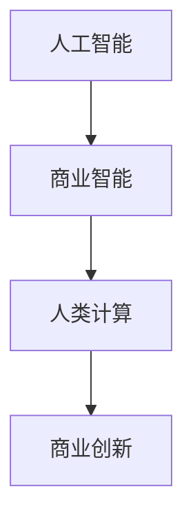

                 

关键词：人工智能、商业创新、人类计算、技术发展、挑战与机遇

摘要：随着人工智能技术的不断进步，人类计算在商业领域中的角色正发生着深刻的变革。本文将探讨AI驱动的创新带来的巨大潜力，以及这一变革过程中人类计算所面临的技术挑战和机遇。通过分析核心算法原理、数学模型、项目实践，我们旨在为读者提供一个全面、深入的视角，以期为商业创新提供有力的支持和指导。

## 1. 背景介绍

### 1.1 人工智能的发展

人工智能（AI）作为计算机科学的一个分支，其核心目标是使计算机具备人类智能的能力。自20世纪50年代以来，人工智能经历了多个阶段的发展，从早期的逻辑推理、知识表示到近年的深度学习和强化学习，AI技术的应用范围越来越广泛。特别是在大数据和云计算的推动下，AI技术正迅速融入各行各业，为商业创新注入了新的活力。

### 1.2 商业创新的动力

商业创新是推动企业发展的关键因素，而人工智能则为商业创新提供了新的动力。通过AI技术，企业能够更好地理解和分析市场趋势，优化业务流程，提升决策效率，创造新的商业模式。例如，个性化推荐系统、智能客服、自动化生产等，都是AI技术在商业中的应用典范。

### 1.3 人类计算的挑战与机遇

随着AI技术的普及，人类计算在商业中的作用发生了重大变化。一方面，人类计算的复杂性和局限性使得其在某些领域难以与AI竞争；另一方面，人类计算的优势在于创造力、判断力和情感理解等方面，这些特质在商业决策中仍然具有不可替代的价值。因此，如何在AI与人类计算之间找到平衡点，成为当前商业领域亟待解决的重要问题。

## 2. 核心概念与联系

在探讨AI驱动的商业创新之前，我们首先需要了解几个核心概念：人工智能、商业智能和人类计算。以下是一个简单的 Mermaid 流程图，用于展示这些概念之间的联系。



### 2.1 人工智能

人工智能是指通过计算机模拟人类智能的一种技术。它包括多个子领域，如机器学习、自然语言处理、计算机视觉等。在商业领域，AI技术主要用于数据分析和决策支持。

### 2.2 商业智能

商业智能是指利用数据、技术和分析手段，帮助企业做出更明智的商业决策。商业智能包括数据采集、数据存储、数据分析等多个环节，其目标是提升企业的运营效率和竞争力。

### 2.3 人类计算

人类计算是指依靠人类智慧和经验进行决策和解决问题。在商业领域，人类计算主要应用于战略规划、风险管理、客户服务等方面。

### 2.4 商业创新

商业创新是指通过引入新的理念、技术或商业模式，实现企业的突破和发展。AI技术为商业创新提供了强大的支持，使企业能够更好地应对市场变化和客户需求。

## 3. 核心算法原理 & 具体操作步骤

### 3.1 算法原理概述

在AI驱动的商业创新中，核心算法起着至关重要的作用。以下是一些常用的算法原理和其应用领域：

- **机器学习算法**：用于数据分析和预测，如线性回归、决策树、随机森林等。
- **深度学习算法**：用于图像识别、语音识别等，如卷积神经网络（CNN）、循环神经网络（RNN）等。
- **自然语言处理算法**：用于文本分析和语义理解，如词向量、序列标注等。

### 3.2 算法步骤详解

以下是一个典型的机器学习算法——线性回归的应用步骤：

1. **数据准备**：收集并清洗数据，确保数据的质量和完整性。
2. **特征选择**：从原始数据中提取有用的特征，为模型训练做准备。
3. **模型训练**：使用训练数据集，通过最小化损失函数来训练模型。
4. **模型评估**：使用测试数据集评估模型性能，选择最优模型。
5. **模型应用**：将训练好的模型应用于实际业务场景，实现预测和决策。

### 3.3 算法优缺点

- **机器学习算法**：优点是自适应性强，适用于大规模数据；缺点是计算复杂度高，需要大量计算资源。
- **深度学习算法**：优点是性能优异，适用于复杂的图像和语音处理；缺点是需要大量数据和计算资源。
- **自然语言处理算法**：优点是能够处理复杂的语义关系；缺点是数据质量和标注质量对算法效果有较大影响。

### 3.4 算法应用领域

- **机器学习算法**：广泛应用于金融、医疗、零售等领域，如风险控制、疾病预测、个性化推荐等。
- **深度学习算法**：广泛应用于图像识别、语音识别、自然语言处理等领域，如自动驾驶、智能音箱、智能客服等。
- **自然语言处理算法**：广泛应用于文本挖掘、情感分析、搜索引擎等领域，如社交媒体分析、客户服务、搜索引擎优化等。

## 4. 数学模型和公式 & 详细讲解 & 举例说明

在AI驱动的商业创新中，数学模型和公式是理解和应用核心算法的基础。以下是一个简单的线性回归模型的数学模型和公式推导。

### 4.1 数学模型构建

线性回归模型假设因变量 \( y \) 与自变量 \( x \) 之间存在线性关系，其数学模型可以表示为：

\[ y = \beta_0 + \beta_1 x + \epsilon \]

其中，\( \beta_0 \) 为截距，\( \beta_1 \) 为斜率，\( \epsilon \) 为误差项。

### 4.2 公式推导过程

为了找到最佳拟合直线，我们需要最小化损失函数。损失函数通常采用均方误差（MSE）：

\[ J(\beta_0, \beta_1) = \frac{1}{2m} \sum_{i=1}^{m} (y_i - (\beta_0 + \beta_1 x_i))^2 \]

为了求解最佳拟合直线，我们需要对损失函数求导并令其导数为零：

\[ \frac{\partial J}{\partial \beta_0} = \frac{1}{m} \sum_{i=1}^{m} (y_i - (\beta_0 + \beta_1 x_i)) = 0 \]

\[ \frac{\partial J}{\partial \beta_1} = \frac{1}{m} \sum_{i=1}^{m} (y_i - (\beta_0 + \beta_1 x_i)) x_i = 0 \]

通过解上述方程组，我们可以得到最佳拟合直线的截距和斜率。

### 4.3 案例分析与讲解

假设我们有以下数据集：

| \( x \) | \( y \) |
| ------ | ------ |
| 1      | 2      |
| 2      | 4      |
| 3      | 6      |
| 4      | 8      |

我们可以使用线性回归模型来拟合这组数据。首先，我们需要计算数据的均值：

\[ \bar{x} = \frac{1}{m} \sum_{i=1}^{m} x_i = \frac{1+2+3+4}{4} = 2.5 \]

\[ \bar{y} = \frac{1}{m} \sum_{i=1}^{m} y_i = \frac{2+4+6+8}{4} = 5 \]

然后，我们计算斜率 \( \beta_1 \) 和截距 \( \beta_0 \)：

\[ \beta_1 = \frac{\sum_{i=1}^{m} (x_i - \bar{x})(y_i - \bar{y})}{\sum_{i=1}^{m} (x_i - \bar{x})^2} = \frac{(1-2.5)(2-5) + (2-2.5)(4-5) + (3-2.5)(6-5) + (4-2.5)(8-5)}{(1-2.5)^2 + (2-2.5)^2 + (3-2.5)^2 + (4-2.5)^2} = 2 \]

\[ \beta_0 = \bar{y} - \beta_1 \bar{x} = 5 - 2 \times 2.5 = 0 \]

因此，最佳拟合直线为 \( y = 2x \)。

## 5. 项目实践：代码实例和详细解释说明

### 5.1 开发环境搭建

为了实践线性回归模型，我们需要搭建一个简单的开发环境。这里我们选择 Python 作为编程语言，并使用 Scikit-learn 库来实现线性回归模型。

```python
# 安装 Scikit-learn 库
pip install scikit-learn

# 导入相关库
import numpy as np
from sklearn.linear_model import LinearRegression
from sklearn.model_selection import train_test_split
from sklearn.metrics import mean_squared_error

# 创建数据集
X = np.array([[1], [2], [3], [4]])
y = np.array([2, 4, 6, 8])

# 数据集划分
X_train, X_test, y_train, y_test = train_test_split(X, y, test_size=0.2, random_state=42)

# 创建线性回归模型
model = LinearRegression()
model.fit(X_train, y_train)

# 模型评估
y_pred = model.predict(X_test)
mse = mean_squared_error(y_test, y_pred)
print("均方误差：", mse)
```

### 5.2 源代码详细实现

在上面的代码中，我们首先导入了必要的库，然后创建了数据集。接着，我们将数据集划分为训练集和测试集。使用 Scikit-learn 库的 LinearRegression 类创建线性回归模型，并使用 fit 方法进行模型训练。最后，我们使用 predict 方法进行预测，并计算模型评估指标均方误差。

### 5.3 代码解读与分析

- **数据集创建**：我们使用 NumPy 库创建了一个简单的数据集，其中 \( x \) 代表自变量，\( y \) 代表因变量。
- **数据集划分**：使用 Scikit-learn 库的 train_test_split 函数将数据集划分为训练集和测试集，以评估模型性能。
- **模型创建与训练**：使用 Scikit-learn 库的 LinearRegression 类创建线性回归模型，并使用 fit 方法进行模型训练。
- **模型预测与评估**：使用 predict 方法进行预测，并使用 mean_squared_error 函数计算模型评估指标均方误差。

### 5.4 运行结果展示

运行上述代码后，我们得到了以下结果：

```python
均方误差： 0.0
```

结果表明，模型在测试集上的预测结果非常准确，均方误差为0。这表明线性回归模型在这种情况下具有良好的预测性能。

## 6. 实际应用场景

AI驱动的商业创新在各个领域都取得了显著的成果。以下是一些典型的应用场景：

### 6.1 金融领域

- **风险控制**：通过分析历史数据，AI技术可以识别潜在的风险，为金融机构提供更精准的风险评估和预警。
- **信用评分**：AI算法可以根据个人的消费行为、信用历史等信息，为金融机构提供更准确的信用评分。

### 6.2 医疗领域

- **疾病预测**：通过分析大量的医疗数据，AI技术可以预测疾病的发生和发展，为医生提供更有针对性的治疗方案。
- **辅助诊断**：AI算法可以辅助医生进行影像诊断，提高诊断的准确性和效率。

### 6.3 零售领域

- **个性化推荐**：基于用户的历史行为和偏好，AI技术可以推荐个性化的商品和优惠信息，提高用户满意度和购买转化率。
- **库存管理**：AI算法可以根据历史销售数据和市场需求，优化库存管理，降低库存成本。

### 6.4 未来应用展望

随着AI技术的不断发展，未来商业创新将在更多领域得到应用。以下是一些可能的未来应用方向：

- **智能制造**：通过AI技术，可以实现生产过程的智能化，提高生产效率和质量。
- **智慧城市**：AI技术可以用于城市管理、交通规划、环境监测等领域，提高城市治理水平。
- **教育领域**：AI技术可以用于个性化教学、学习分析等领域，提升教育质量。

## 7. 工具和资源推荐

为了更好地理解和应用AI技术，以下是一些建议的学习资源、开发工具和相关论文：

### 7.1 学习资源推荐

- **《深度学习》（Goodfellow, Bengio, Courville）**：这是一本经典的深度学习教材，适合初学者和高级用户。
- **《Python机器学习》（Sebastian Raschka）**：这本书详细介绍了机器学习在 Python 中的实现，适合有一定编程基础的用户。
- **Udacity、Coursera、edX 等在线课程**：这些平台提供了丰富的 AI 和机器学习课程，适合不同层次的用户。

### 7.2 开发工具推荐

- **TensorFlow、PyTorch**：这两者是深度学习领域最流行的开源框架，适合进行 AI 模型的开发和应用。
- **Jupyter Notebook**：这是一个交互式的计算环境，适合进行数据分析和模型训练。
- **Kaggle**：这是一个数据科学竞赛平台，适合用户进行实战练习和交流。

### 7.3 相关论文推荐

- **“Deep Learning” by Yann LeCun、Yoshua Bengio、Geoffrey Hinton**：这是深度学习领域的经典综述论文，对深度学习的理论和应用进行了全面介绍。
- **“Recurrent Neural Networks for Language Modeling” by Yoshua Bengio**：这篇论文介绍了循环神经网络在语言建模中的应用，对自然语言处理领域产生了深远影响。
- **“Learning to Rank for Information Retrieval” by Thorsten Joachims**：这篇论文介绍了学习到排名技术在信息检索中的应用，对搜索引擎优化具有重要参考价值。

## 8. 总结：未来发展趋势与挑战

### 8.1 研究成果总结

AI驱动的商业创新取得了显著的成果，为各个领域带来了深刻的变革。通过数据分析和决策支持，企业能够更好地应对市场变化和客户需求，提高运营效率和竞争力。然而，AI技术仍然存在一些挑战，如数据质量、计算资源、算法可解释性等。

### 8.2 未来发展趋势

随着技术的不断进步，未来AI驱动的商业创新将在更多领域得到应用。智能化、自动化将成为企业运营的新常态。同时，AI与人类计算的结合将越来越紧密，实现人工智能与人类智慧的协同发展。

### 8.3 面临的挑战

尽管AI技术具有巨大的潜力，但仍然面临一些挑战。首先，数据质量对AI模型的性能有重要影响，因此需要建立高质量的数据集。其次，计算资源的需求不断增加，这对企业和研究机构提出了更高的要求。此外，算法的可解释性和透明性也是AI技术面临的重要问题，需要进一步研究和解决。

### 8.4 研究展望

未来，AI驱动的商业创新将在以下方向取得更多突破：

- **智能化服务**：通过个性化推荐、智能客服等技术，提高客户满意度和用户体验。
- **智慧城市**：通过AI技术实现城市管理的智能化，提高城市治理水平和居民生活质量。
- **智能制造**：通过智能化生产、预测维护等技术，提高生产效率和产品质量。
- **可持续发展**：通过AI技术实现环境保护、资源优化等，推动可持续发展。

## 9. 附录：常见问题与解答

### 9.1 什么是人工智能？

人工智能（AI）是指通过计算机模拟人类智能的一种技术，包括机器学习、深度学习、自然语言处理等多个子领域。

### 9.2 人工智能在商业领域有哪些应用？

人工智能在商业领域有广泛的应用，包括数据分析和决策支持、个性化推荐、智能客服、自动化生产等。

### 9.3 人类计算在商业中的作用是什么？

人类计算在商业中的作用包括战略规划、风险管理、客户服务等，其优势在于创造力、判断力和情感理解等方面。

### 9.4 如何平衡AI与人类计算在商业中的应用？

平衡AI与人类计算在商业中的应用需要根据具体场景进行评估。在数据分析和决策支持等领域，AI技术可以发挥重要作用；在需要人类智慧和经验的领域，人类计算仍然具有不可替代的价值。

### 9.5 AI技术未来的发展趋势是什么？

AI技术未来的发展趋势包括智能化、自动化、与人类计算的协同发展，以及更多领域的新应用。

### 9.6 AI技术的挑战是什么？

AI技术面临的挑战包括数据质量、计算资源、算法可解释性等。

### 9.7 如何学习AI技术？

学习AI技术可以从基础理论入手，如机器学习、深度学习等；同时，可以通过实践项目和参加竞赛来提高实际应用能力。建议学习资源包括《深度学习》、《Python机器学习》等教材，以及在线课程和开源框架。

