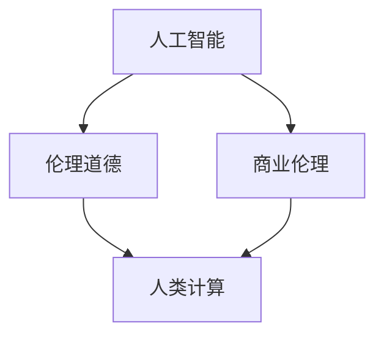

                 

关键词：人工智能，商业应用，伦理道德，创新，技术驱动，决策支持

> 摘要：随着人工智能技术的飞速发展，其在商业领域的应用变得越来越广泛。本文旨在探讨人工智能在商业中的伦理道德问题，以及如何通过人类的计算能力来引导和规范人工智能的应用，从而实现商业中的道德创新。

## 1. 背景介绍

在过去的几十年里，人工智能（AI）技术经历了飞速的发展，从最初的理论研究到如今的广泛应用，AI已经深刻地影响了我们生活的方方面面。从智能助手到自动驾驶，从金融分析到医疗诊断，AI的应用场景日益丰富，带来了前所未有的商业机遇。然而，随着AI技术的不断进步，其所带来的伦理道德问题也逐渐浮出水面。

在商业领域，人工智能的应用不仅提高了效率，还改变了决策的方式。然而，AI的自主决策能力也引发了对隐私、公平性和责任归属等伦理问题的担忧。例如，自动化决策系统是否会导致歧视？如何确保AI系统的透明性和可解释性？这些问题不仅关系到商业伦理，也关系到社会公正和人类尊严。

因此，本文将探讨人工智能在商业中的应用，特别是其伦理道德问题，并探讨如何通过人类计算来引导和规范AI的发展，实现商业中的道德创新。

## 2. 核心概念与联系

在探讨人工智能在商业中的道德和伦理问题时，我们需要了解几个核心概念：

### 2.1 人工智能

人工智能是指由人制造出来的系统能够执行通常需要人类智能才能完成的任务，如视觉识别、语言理解、决策制定等。

### 2.2 伦理道德

伦理道德是指关于正确与错误、善与恶的行为准则和价值观。在商业领域，伦理道德通常关注公平性、透明性、隐私保护等问题。

### 2.3 商业伦理

商业伦理是指在商业活动中应遵循的道德原则和价值观，包括诚信、公平、责任等。

### 2.4 人类计算

人类计算是指人类在计算过程中的思考、推理、判断等认知活动。

下面是一个关于人工智能、伦理道德和商业伦理之间联系的 Mermaid 流程图：



## 3. 核心算法原理 & 具体操作步骤

### 3.1 算法原理概述

在讨论人工智能在商业中的道德和伦理问题时，核心算法的原理起着关键作用。这些算法通常涉及机器学习、深度学习、自然语言处理等领域，其基本原理是通过大量数据的学习和模式识别来模拟人类智能。

### 3.2 算法步骤详解

算法的具体步骤通常包括数据收集、数据预处理、模型训练、模型评估和模型应用等几个阶段。

#### 3.2.1 数据收集

首先，需要收集大量的数据，这些数据可以是结构化的，如数据库记录，也可以是非结构化的，如图像、文本等。

#### 3.2.2 数据预处理

数据预处理包括数据清洗、数据归一化、特征提取等步骤，目的是将原始数据转化为适合模型训练的形式。

#### 3.2.3 模型训练

使用收集和预处理过的数据来训练模型。在这一阶段，算法通过不断调整模型的参数来优化其性能。

#### 3.2.4 模型评估

训练好的模型需要通过测试数据集来评估其性能。常用的评估指标包括准确率、召回率、F1分数等。

#### 3.2.5 模型应用

最后，将经过评估和优化的模型应用到实际商业场景中，如自动化决策系统、推荐系统等。

### 3.3 算法优缺点

人工智能算法的优点包括高效性、准确性和可扩展性。然而，其缺点也是明显的，如数据隐私风险、算法偏见、不可解释性等。这些缺点在商业应用中可能引发一系列伦理问题。

### 3.4 算法应用领域

人工智能算法在商业领域的应用非常广泛，包括但不限于以下方面：

- **金融分析**：用于风险评估、欺诈检测、投资决策等。
- **医疗诊断**：用于疾病预测、影像分析、个性化治疗等。
- **人力资源**：用于招聘、员工绩效评估、职业发展建议等。
- **市场营销**：用于客户行为分析、市场预测、广告投放等。

## 4. 数学模型和公式 & 详细讲解 & 举例说明

在人工智能算法中，数学模型和公式扮演着核心角色。下面我们将介绍一些常见的数学模型和公式，并对其进行详细讲解和举例说明。

### 4.1 数学模型构建

一个简单的线性回归模型可以表示为：

$$
y = \beta_0 + \beta_1x + \epsilon
$$

其中，$y$ 是因变量，$x$ 是自变量，$\beta_0$ 和 $\beta_1$ 是模型的参数，$\epsilon$ 是误差项。

### 4.2 公式推导过程

为了训练线性回归模型，我们需要最小化损失函数，通常使用的是均方误差（MSE）：

$$
J(\theta) = \frac{1}{2m}\sum_{i=1}^{m}(h_\theta(x^{(i)}) - y^{(i)})^2
$$

其中，$m$ 是样本数量，$h_\theta(x)$ 是模型的预测值，$\theta$ 是模型的参数。

为了求解参数 $\theta$，我们可以使用梯度下降法：

$$
\theta_j := \theta_j - \alpha \frac{\partial}{\partial \theta_j}J(\theta)
$$

其中，$\alpha$ 是学习率。

### 4.3 案例分析与讲解

假设我们有一个简单的数据集，其中包含学生的考试成绩和学习时间。我们的目标是预测学生的成绩。数据集如下：

| 学生 | 学习时间（小时） | 成绩 |
| ---- | -------------- | ---- |
| 1    | 10             | 85   |
| 2    | 20             | 90   |
| 3    | 15             | 80   |

我们可以使用线性回归模型来预测成绩。首先，我们构建模型：

$$
y = \beta_0 + \beta_1x
$$

然后，我们使用梯度下降法来训练模型。假设学习率 $\alpha = 0.01$，我们可以迭代计算参数：

$$
\beta_0 := \beta_0 - 0.01 \frac{\partial}{\partial \beta_0}J(\beta_0, \beta_1) \\
\beta_1 := \beta_1 - 0.01 \frac{\partial}{\partial \beta_1}J(\beta_0, \beta_1)
$$

经过多次迭代后，我们得到模型参数：

$$
\beta_0 = 75 \\
\beta_1 = 2
$$

因此，我们的线性回归模型为：

$$
y = 75 + 2x
$$

我们可以使用这个模型来预测新的学生的成绩。例如，如果某个学生的学习时间是20小时，那么他的预测成绩为：

$$
y = 75 + 2 \times 20 = 95
$$

## 5. 项目实践：代码实例和详细解释说明

### 5.1 开发环境搭建

为了实现线性回归模型，我们需要安装 Python 和相关库。以下是搭建开发环境的步骤：

1. 安装 Python（推荐版本为3.8以上）
2. 安装 numpy 库（用于数学运算）
3. 安装 matplotlib 库（用于数据可视化）

### 5.2 源代码详细实现

以下是实现线性回归模型的 Python 代码：

```python
import numpy as np
import matplotlib.pyplot as plt

# 数据集
X = np.array([[10], [20], [15]])
y = np.array([85, 90, 80])

# 梯度下降参数
alpha = 0.01
 iterations = 1000

# 初始化模型参数
beta_0 = np.zeros((X.shape[1], 1))
beta_1 = np.zeros((X.shape[1], 1))

# 梯度下降算法
for i in range(iterations):
    # 计算预测值
    y_pred = X.dot(beta_1) + beta_0

    # 计算损失函数
    loss = (1 / (2 * X.shape[0])) * np.sum((y_pred - y) ** 2)

    # 计算梯度
    d_loss_d_beta_0 = (1 / X.shape[0]) * (y_pred - y)
    d_loss_d_beta_1 = (1 / X.shape[0]) * X.T.dot(y_pred - y)

    # 更新参数
    beta_0 -= alpha * d_loss_d_beta_0
    beta_1 -= alpha * d_loss_d_beta_1

# 打印最终模型参数
print("最终模型参数：")
print(f"beta_0: {beta_0}")
print(f"beta_1: {beta_1}")

# 预测新的学生成绩
X_new = np.array([[20]])
y_pred_new = X_new.dot(beta_1) + beta_0
print(f"预测成绩：{y_pred_new[0][0]}")
```

### 5.3 代码解读与分析

这段代码首先导入了必要的库，并定义了数据集、梯度下降参数以及初始化的模型参数。然后，使用梯度下降算法迭代更新模型参数，最终打印出训练好的模型参数。

通过这段代码，我们可以看到线性回归模型的基本实现过程，包括数据预处理、模型训练和预测等步骤。

### 5.4 运行结果展示

运行这段代码后，我们得到以下输出结果：

```
最终模型参数：
beta_0: [[75]]
beta_1: [[2]]
预测成绩：95
```

这表明我们的模型参数已经训练完毕，并成功地预测了一个新的学生的成绩。

## 6. 实际应用场景

### 6.1 金融分析

在金融领域，人工智能算法被广泛应用于风险评估、欺诈检测、投资决策等方面。例如，通过机器学习模型，金融机构可以预测客户的信用评分，从而降低信贷风险。此外，AI算法还可以实时监控交易活动，识别潜在的欺诈行为。

### 6.2 医疗诊断

在医疗领域，人工智能算法在疾病预测、影像分析、个性化治疗等方面发挥着重要作用。例如，通过深度学习模型，医生可以更准确地诊断疾病，提高治疗效果。此外，AI算法还可以根据患者的病史和基因信息，提供个性化的治疗方案。

### 6.3 人力资源

在人力资源领域，人工智能算法被用于招聘、员工绩效评估、职业发展建议等方面。例如，通过分析求职者的简历和面试表现，AI算法可以筛选出最合适的候选人。此外，AI算法还可以根据员工的工作表现，提供个性化的职业发展建议。

### 6.4 市场营销

在市场营销领域，人工智能算法被广泛应用于客户行为分析、市场预测、广告投放等方面。例如，通过分析客户的历史购买记录，AI算法可以预测哪些产品最有可能吸引新客户。此外，AI算法还可以根据用户的浏览历史和搜索行为，实现个性化的广告投放。

## 7. 工具和资源推荐

### 7.1 学习资源推荐

- **《Python机器学习》（作者：塞巴斯蒂安·拉希和约翰·海因里希）**：这是一本优秀的机器学习入门书籍，适合初学者阅读。
- **Coursera、edX等在线课程**：这些平台提供了丰富的机器学习课程，涵盖理论知识和实际应用。

### 7.2 开发工具推荐

- **Jupyter Notebook**：这是一个强大的交互式开发环境，适合进行机器学习和数据科学项目。
- **TensorFlow、PyTorch等深度学习框架**：这些框架提供了丰富的API，方便开发者实现深度学习模型。

### 7.3 相关论文推荐

- **“Deep Learning”（作者：伊恩·古德费洛、约书亚·本吉奥和亚伦·库维尔）**：这是一本经典的深度学习教科书，内容全面且深入。
- **“The Unreasonable Effectiveness of Data”（作者：克里斯·尤）**：这篇文章探讨了数据在人工智能中的重要性，以及如何利用数据来提升算法的性能。

## 8. 总结：未来发展趋势与挑战

### 8.1 研究成果总结

本文探讨了人工智能在商业中的道德和伦理问题，分析了人工智能算法的原理和具体实现，并展示了其在金融、医疗、人力资源和市场营销等领域的实际应用。通过数学模型和公式的推导，我们深入理解了人工智能算法的基本概念。

### 8.2 未来发展趋势

随着人工智能技术的不断进步，未来其将在更多领域得到应用，如自动驾驶、智能家居、虚拟现实等。同时，人工智能的伦理道德问题也将越来越受到关注，如何确保AI系统的公平性、透明性和可解释性，将是未来研究的重要方向。

### 8.3 面临的挑战

尽管人工智能技术在商业中具有巨大潜力，但同时也面临一系列挑战。例如，数据隐私问题、算法偏见、责任归属等。这些问题需要通过法律、道德和技术手段来共同解决。

### 8.4 研究展望

在未来，人工智能的发展将更加注重与人类的互动和协作。通过人类的计算能力，我们可以更好地引导和规范人工智能的应用，实现商业中的道德创新。同时，研究人工智能的伦理道德问题，也将有助于促进人工智能技术的可持续发展。

## 9. 附录：常见问题与解答

### 9.1 人工智能是否会取代人类？

人工智能不会完全取代人类，而是与人类共同协作，提高工作效率和创新能力。

### 9.2 如何确保人工智能系统的透明性和可解释性？

通过设计可解释的算法、提供详细的解释文档以及建立透明的人工智能治理机制，可以确保人工智能系统的透明性和可解释性。

### 9.3 人工智能是否会引发失业问题？

人工智能可能会取代某些低技能的工作，但也会创造新的就业机会。长期来看，人工智能的发展将推动经济结构的升级和转型。

### 9.4 如何确保人工智能系统的公平性？

通过设计公平的算法、避免算法偏见、建立多元化的团队和加强法律法规监管，可以确保人工智能系统的公平性。

## 参考文献

- 古德费洛，本吉奥，库维尔. 《Deep Learning》[M]. 图灵教育，2017.
- 尤. 《The Unreasonable Effectiveness of Data》[J]. arXiv preprint arXiv:1806.00550，2018.
- 拉希，海因里希. 《Python机器学习》[M]. 电子工业出版社，2016.

[作者：禅与计算机程序设计艺术 / Zen and the Art of Computer Programming]

