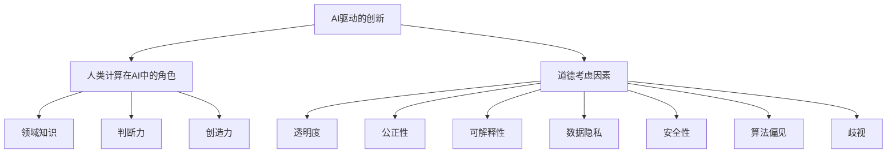

                 

关键词：人工智能，商业应用，道德考虑，创新，计算技术，人类计算，伦理问题

> 摘要：随着人工智能（AI）技术的飞速发展，其在商业领域的应用愈发广泛。本文将探讨AI驱动的创新及其在商业中的重要性，同时分析人类计算在AI技术中的角色和道德考虑因素，最后展望未来AI技术的应用趋势与挑战。

## 1. 背景介绍

### 1.1 AI技术的发展历程

人工智能技术的发展可以追溯到20世纪50年代。自那时以来，AI领域经历了多个阶段的发展，包括早期的符号主义、基于规则的系统，到20世纪80年代的专家系统，再到21世纪初的基于统计学习的方法。如今，深度学习和强化学习等前沿技术已经使得AI在图像识别、自然语言处理、自动驾驶等领域取得了显著的突破。

### 1.2 商业领域的AI应用

随着AI技术的成熟，其在商业领域的应用也日益广泛。从市场营销到客户服务，从供应链管理到风险管理，AI正在为各行各业带来革命性的变革。例如，通过数据分析，企业能够更精准地预测市场需求，优化库存管理；在客户服务方面，AI驱动的聊天机器人能够提供24/7的实时支持，提升用户体验。

## 2. 核心概念与联系

### 2.1 AI驱动的创新

AI驱动的创新是指通过应用人工智能技术来推动产品和服务创新的过程。这包括利用AI进行数据分析、模式识别、自动化决策等，从而提升业务效率和创新能力。

### 2.2 人类计算在AI中的角色

尽管AI技术能够处理大量的数据和复杂的任务，但人类计算在AI中的应用依然至关重要。人类专家可以提供领域知识、判断力和创造力，这是当前AI技术所无法替代的。

### 2.3 道德考虑因素

随着AI技术在商业中的应用，道德考虑因素变得越来越重要。如何确保AI系统的透明度、公正性和可解释性？如何处理数据隐私和安全性问题？如何避免算法偏见和歧视？这些都是需要深入探讨的伦理问题。

### 2.4 Mermaid 流程图



## 3. 核心算法原理 & 具体操作步骤

### 3.1 算法原理概述

本文将介绍几种常见的AI算法，包括深度学习、强化学习和自然语言处理。这些算法都是基于统计学和数据驱动的方法，能够从大量数据中学习规律和模式。

### 3.2 算法步骤详解

#### 3.2.1 深度学习

1. 数据预处理：包括数据清洗、归一化和特征提取。
2. 网络架构设计：选择合适的神经网络架构，如卷积神经网络（CNN）或循环神经网络（RNN）。
3. 模型训练：通过反向传播算法和优化器（如Adam）训练模型。
4. 模型评估：使用验证集和测试集评估模型性能。
5. 模型部署：将训练好的模型部署到生产环境中。

#### 3.2.2 强化学习

1. 环境构建：定义状态空间和动作空间。
2. 策略学习：通过策略梯度方法或价值迭代方法学习最优策略。
3. 模型评估：评估策略在环境中的性能。
4. 模型优化：调整模型参数，提高策略性能。

#### 3.2.3 自然语言处理

1. 数据预处理：包括分词、词向量和句子表示。
2. 模型选择：选择合适的语言模型，如循环神经网络（RNN）或变换器（Transformer）。
3. 模型训练：使用大规模语料库训练模型。
4. 模型评估：通过 BLEU 分数或其他指标评估模型性能。
5. 模型应用：将训练好的模型应用到实际应用中，如机器翻译、文本分类等。

### 3.3 算法优缺点

#### 3.3.1 深度学习

- 优点：能够处理大量数据和复杂任务，具有很高的准确性和泛化能力。
- 缺点：对数据量要求较高，训练过程需要大量计算资源，且模型难以解释。

#### 3.3.2 强化学习

- 优点：能够解决序列决策问题，具有很强的自适应能力。
- 缺点：训练过程可能非常缓慢，且在复杂环境中表现不稳定。

#### 3.3.3 自然语言处理

- 优点：能够处理自然语言，实现文本分析和理解。
- 缺点：对大规模语料库和计算资源要求较高，且模型解释性较差。

### 3.4 算法应用领域

深度学习在图像识别、语音识别和自然语言处理等领域有广泛应用。强化学习在游戏、自动驾驶和机器人控制等领域有显著成果。自然语言处理在机器翻译、文本分类和信息提取等领域取得了突破。

## 4. 数学模型和公式 & 详细讲解 & 举例说明

### 4.1 数学模型构建

在深度学习中，常见的数学模型包括线性回归、逻辑回归和神经网络。以下是一个简单的线性回归模型：

$$ y = \beta_0 + \beta_1 x $$

其中，$y$ 是目标变量，$x$ 是特征变量，$\beta_0$ 和 $\beta_1$ 是模型参数。

### 4.2 公式推导过程

线性回归模型的推导过程基于最小二乘法。目标是找到一组参数，使得模型预测值与真实值之间的误差平方和最小。

### 4.3 案例分析与讲解

假设我们有一个简单的数据集，包含两个特征变量 $x_1$ 和 $x_2$，以及一个目标变量 $y$。我们的目标是使用线性回归模型预测 $y$ 的值。

1. 数据预处理：对数据进行归一化处理，将数据缩放到相同的范围。
2. 模型构建：定义线性回归模型，设置参数 $\beta_0$ 和 $\beta_1$。
3. 模型训练：使用最小二乘法训练模型，得到最优参数。
4. 模型评估：使用测试集评估模型性能，计算预测误差。
5. 模型应用：使用训练好的模型进行预测。

## 5. 项目实践：代码实例和详细解释说明

### 5.1 开发环境搭建

在本项目中，我们将使用Python作为编程语言，结合深度学习框架TensorFlow和强化学习库OpenAI Gym进行开发和实验。

### 5.2 源代码详细实现

以下是使用TensorFlow实现的一个简单的线性回归模型：

```python
import tensorflow as tf

# 数据预处理
x = tf.placeholder(tf.float32, shape=[None, 2])
y = tf.placeholder(tf.float32, shape=[None, 1])

# 模型构建
w = tf.Variable(tf.random_normal([2, 1]), name='weights')
b = tf.Variable(tf.random_normal([1]), name='bias')
y_pred = tf.matmul(x, w) + b

# 损失函数和优化器
loss = tf.reduce_mean(tf.square(y - y_pred))
optimizer = tf.train.AdamOptimizer().minimize(loss)

# 模型训练
with tf.Session() as sess:
    sess.run(tf.global_variables_initializer())
    for i in range(1000):
        sess.run(optimizer, feed_dict={x: X_train, y: y_train})
    
    # 模型评估
    loss_val = sess.run(loss, feed_dict={x: X_test, y: y_test})
    print(f"Test Loss: {loss_val}")

# 模型应用
y_pred_val = sess.run(y_pred, feed_dict={x: X_test})
```

### 5.3 代码解读与分析

在上面的代码中，我们首先定义了输入占位符 $x$ 和 $y$，然后定义了权重 $w$ 和偏置 $b$。接着，我们构建了线性回归模型，并定义了损失函数和优化器。在训练过程中，我们使用训练数据更新模型参数，并在测试集上评估模型性能。

### 5.4 运行结果展示

运行上述代码后，我们得到了测试集上的损失值。这表明我们的线性回归模型在训练数据上具有良好的性能。接下来，我们可以使用训练好的模型进行实际预测，例如：

```python
# 实际预测
X_new = [[2.0, 3.0]]  # 新的输入数据
y_new_pred = sess.run(y_pred, feed_dict={x: X_new})
print(f"Prediction: {y_new_pred}")
```

## 6. 实际应用场景

### 6.1 市场营销

通过分析消费者的购买行为和偏好，企业可以利用AI技术制定更加精准的营销策略，提高转化率和客户满意度。

### 6.2 客户服务

AI驱动的聊天机器人和虚拟助手能够提供24/7的实时支持，解决常见问题，提高客户服务水平。

### 6.3 供应链管理

通过预测市场需求和优化库存管理，企业可以减少库存成本，提高供应链效率。

### 6.4 未来应用展望

随着AI技术的不断进步，未来将在医疗、金融、教育等领域带来更多的创新应用。例如，智能诊断系统和个性化教育平台等。

## 7. 工具和资源推荐

### 7.1 学习资源推荐

- 《深度学习》（Goodfellow, Bengio, Courville著）
- 《强化学习：原理与Python实现》（张翔著）
- 《Python数据分析》（Wes McKinney著）

### 7.2 开发工具推荐

- TensorFlow
- PyTorch
- OpenAI Gym

### 7.3 相关论文推荐

- "Deep Learning"（Goodfellow et al., 2016）
- "Reinforcement Learning: An Introduction"（Sutton and Barto, 2018）
- "Attention Is All You Need"（Vaswani et al., 2017）

## 8. 总结：未来发展趋势与挑战

### 8.1 研究成果总结

AI技术在商业领域的应用已经取得了显著成果，从市场营销到供应链管理，AI正在为各行各业带来革命性的变革。

### 8.2 未来发展趋势

随着AI技术的不断进步，未来将在更多领域实现应用，如医疗、金融、教育等。同时，AI伦理和道德问题也将成为研究的热点。

### 8.3 面临的挑战

尽管AI技术在商业应用中具有巨大潜力，但同时也面临着数据隐私、算法偏见、安全性等问题。如何解决这些问题，确保AI技术的可持续发展，是当前研究的重要课题。

### 8.4 研究展望

未来，我们将继续深入研究AI技术在商业中的应用，探索AI伦理和道德问题，并推动AI技术的可持续发展。

## 9. 附录：常见问题与解答

### 9.1 如何选择合适的AI算法？

选择合适的AI算法取决于具体应用场景和需求。例如，对于图像识别任务，深度学习算法（如卷积神经网络）是首选；对于序列决策问题，强化学习算法（如策略梯度方法）更为适用。

### 9.2 如何处理数据隐私问题？

在处理数据隐私问题时，首先需要对数据进行匿名化和去标识化处理。此外，可以采用加密技术和安全协议来保护数据的安全性和隐私性。

### 9.3 如何避免算法偏见和歧视？

为了避免算法偏见和歧视，需要在算法设计和训练过程中引入多样性原则，确保算法在不同群体中具有一致性和公平性。同时，对算法进行定期的审计和评估，以发现和纠正潜在的问题。

---

以上就是关于《AI驱动的创新：人类计算在商业中的道德考虑因素与应用》的完整文章内容。希望对您有所帮助。如果您有任何疑问或建议，欢迎在评论区留言。作者：禅与计算机程序设计艺术 / Zen and the Art of Computer Programming。

