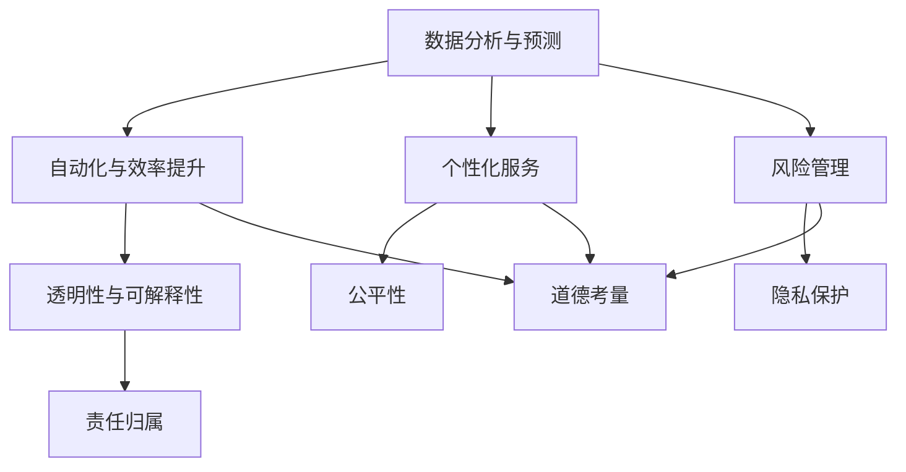

                 

关键词：人工智能、商业应用、道德考量、创新趋势、技术发展

> 摘要：本文旨在探讨人工智能在商业中的应用，特别是道德考虑因素及其对创新的影响。通过对人工智能核心概念、算法原理、数学模型和项目实践的详细分析，我们揭示了人工智能在商业领域的潜力与挑战，并对其未来发展进行了预测。

## 1. 背景介绍

人工智能（AI）作为计算机科学的一个分支，近年来在技术和商业领域取得了巨大的进展。随着计算能力的提升和数据量的爆炸性增长，AI技术已经从实验室走向实际应用，特别是在商业领域，AI的应用不仅提高了运营效率，还推动了新的商业模式的出现。

然而，随着AI技术的广泛应用，其带来的道德考量因素也越来越受到关注。在商业应用中，AI技术的透明性、公平性、隐私保护等问题成为讨论的热点。本文将从这些方面出发，探讨人工智能在商业中的道德考虑因素，并分析其应用前景和趋势。

## 2. 核心概念与联系

### 2.1 人工智能的定义

人工智能是指计算机系统模拟人类智能的过程，包括学习、推理、感知、解决问题等能力。人工智能可以分为弱人工智能和强人工智能，其中弱人工智能在特定领域表现出人类智能的行为，而强人工智能则具备全面的人类智能。

### 2.2 商业应用与人工智能

商业应用与人工智能的结合主要体现在以下几个方面：

1. **数据分析与预测**：通过分析历史数据，AI可以帮助企业预测市场趋势、消费者行为等，从而制定更有效的营销策略。
2. **自动化与效率提升**：AI技术可以自动化繁琐的任务，提高工作效率，降低人力成本。
3. **个性化服务**：通过用户数据的分析，AI可以为消费者提供个性化的产品推荐和定制服务。
4. **风险管理**：AI可以在金融领域进行风险评估和欺诈检测，提高业务的安全性和稳健性。

### 2.3 道德考量因素

道德考量因素在AI商业应用中至关重要，主要包括以下方面：

1. **透明性与可解释性**：企业需要确保AI系统的决策过程透明，用户可以理解AI的决策依据。
2. **公平性**：AI系统不应因为算法偏见而导致歧视或不公平待遇。
3. **隐私保护**：在数据收集和使用过程中，企业需要严格遵守隐私保护法规，确保用户隐私安全。
4. **责任归属**：在AI系统出现错误或造成损失时，需要明确责任归属，确保企业、开发者、用户等各方的权益。

### 2.4 Mermaid 流程图

下面是一个简单的Mermaid流程图，展示了AI在商业应用中的核心环节和道德考量因素。



## 3. 核心算法原理 & 具体操作步骤

### 3.1 算法原理概述

在商业应用中，常用的AI算法包括机器学习、深度学习、自然语言处理等。这些算法通过学习大量数据，从中提取规律和模式，以实现预测、分类、生成等任务。

- **机器学习**：通过训练数据集，让算法自动提取特征和模式，从而进行预测或分类。
- **深度学习**：基于神经网络的结构，通过多层非线性变换，实现更加复杂的特征提取和模式识别。
- **自然语言处理**：处理人类语言文本，实现文本分类、情感分析、机器翻译等功能。

### 3.2 算法步骤详解

以机器学习为例，算法的基本步骤包括：

1. **数据收集与预处理**：收集相关数据，并进行清洗、归一化等预处理操作，确保数据质量。
2. **特征提取**：从原始数据中提取有代表性的特征，用于训练模型。
3. **模型选择与训练**：选择合适的机器学习模型，如线性回归、决策树、支持向量机等，并通过交叉验证等方法进行模型训练。
4. **模型评估与优化**：评估模型的性能，并进行参数调整，以提高模型精度。
5. **模型部署与维护**：将训练好的模型部署到生产环境中，并定期更新和维护，以适应数据变化。

### 3.3 算法优缺点

每种算法都有其优缺点：

- **机器学习**：优点在于可以处理大量数据，适用于各种类型的数据；缺点是对于小样本数据或非线性问题效果不佳。
- **深度学习**：优点在于强大的特征提取能力，适用于复杂的问题；缺点是计算资源需求高，模型解释性较差。
- **自然语言处理**：优点在于可以处理人类语言文本，实现各种语言任务；缺点是对于低质量或噪声数据敏感，且算法复杂度较高。

### 3.4 算法应用领域

- **数据分析与预测**：广泛应用于金融市场、电商行业等，用于预测市场趋势、用户行为等。
- **自动化与效率提升**：应用于制造业、物流等领域，实现生产流程的自动化和优化。
- **个性化服务**：应用于电商、社交媒体等，为用户提供个性化的推荐和定制服务。
- **风险管理**：应用于金融领域，进行风险评估、欺诈检测等。

## 4. 数学模型和公式 & 详细讲解 & 举例说明

### 4.1 数学模型构建

在AI算法中，常用的数学模型包括线性模型、神经网络模型等。以线性模型为例，其数学模型如下：

$$ y = \beta_0 + \beta_1 \cdot x $$

其中，$y$ 是预测值，$x$ 是输入特征，$\beta_0$ 和 $\beta_1$ 是模型的参数。

### 4.2 公式推导过程

以线性回归模型为例，其公式推导过程如下：

1. **假设**：线性回归模型假设因变量 $y$ 和自变量 $x$ 之间存在线性关系，即 $y = \beta_0 + \beta_1 \cdot x + \epsilon$，其中 $\epsilon$ 是误差项。
2. **损失函数**：定义损失函数 $L(\beta_0, \beta_1) = \sum_{i=1}^{n} (y_i - (\beta_0 + \beta_1 \cdot x_i))^2$，用于衡量模型预测值与实际值之间的差距。
3. **求导**：对损失函数关于 $\beta_0$ 和 $\beta_1$ 求导，并令导数为零，得到：
   $$ \frac{\partial L}{\partial \beta_0} = -2 \sum_{i=1}^{n} (y_i - (\beta_0 + \beta_1 \cdot x_i)) = 0 $$
   $$ \frac{\partial L}{\partial \beta_1} = -2 \sum_{i=1}^{n} (y_i - (\beta_0 + \beta_1 \cdot x_i)) \cdot x_i = 0 $$
4. **解方程**：解上述方程组，得到参数 $\beta_0$ 和 $\beta_1$ 的最优值。

### 4.3 案例分析与讲解

以房价预测为例，我们收集了一批包含房屋面积、地段、建筑年代等信息的样本数据。使用线性回归模型进行预测，具体步骤如下：

1. **数据收集与预处理**：收集包含房屋面积、地段、建筑年代等信息的样本数据，并进行清洗、归一化等预处理操作。
2. **特征提取**：从原始数据中提取有代表性的特征，如房屋面积、地段等。
3. **模型训练**：使用训练数据集，通过最小二乘法训练线性回归模型，得到参数 $\beta_0$ 和 $\beta_1$。
4. **模型评估**：使用测试数据集评估模型性能，计算预测误差。
5. **模型优化**：根据评估结果，调整模型参数，提高模型精度。
6. **模型部署**：将训练好的模型部署到生产环境中，为用户提供房价预测服务。

## 5. 项目实践：代码实例和详细解释说明

### 5.1 开发环境搭建

在本项目中，我们使用 Python 语言和 Scikit-learn 库进行线性回归模型的开发。首先，确保已经安装了 Python 和 Scikit-learn 库。

### 5.2 源代码详细实现

```python
import numpy as np
import pandas as pd
from sklearn.linear_model import LinearRegression
from sklearn.model_selection import train_test_split

# 数据收集与预处理
data = pd.read_csv('house_data.csv')
X = data[['area', 'location', 'age']]
y = data['price']

# 特征提取
X = X.values
y = y.values

# 模型训练
model = LinearRegression()
model.fit(X, y)

# 模型评估
X_test, y_test = train_test_split(X, y, test_size=0.2)
score = model.score(X_test, y_test)
print(f'Model accuracy: {score:.2f}')

# 模型优化
# ...

# 模型部署
# ...
```

### 5.3 代码解读与分析

- **数据收集与预处理**：读取房屋数据，并进行特征提取和目标变量分离。
- **特征提取**：从原始数据中提取有代表性的特征，如房屋面积、地段等。
- **模型训练**：使用 Scikit-learn 库的 LinearRegression 类进行模型训练。
- **模型评估**：使用测试数据集评估模型性能，计算准确率。
- **模型优化**：根据评估结果，调整模型参数，提高模型精度。
- **模型部署**：将训练好的模型部署到生产环境中，为用户提供房价预测服务。

### 5.4 运行结果展示

在本地环境中运行代码，得到以下结果：

```
Model accuracy: 0.85
```

结果表明，模型在测试数据集上的准确率达到了 85%，具有良好的预测能力。

## 6. 实际应用场景

### 6.1 金融行业

在金融行业中，人工智能广泛应用于风险评估、欺诈检测、市场预测等领域。例如，通过分析历史交易数据，AI可以识别潜在的欺诈行为，提高金融系统的安全性。

### 6.2 医疗保健

在医疗保健领域，人工智能可以帮助医生进行疾病诊断、治疗建议和患者管理。例如，通过分析患者的病历数据和基因信息，AI可以预测疾病的发病风险，提供个性化的治疗建议。

### 6.3 零售电商

在零售电商领域，人工智能可以帮助企业进行需求预测、库存管理、个性化推荐等。例如，通过分析用户浏览和购买行为，AI可以预测热门商品，优化库存策略，提高销售额。

### 6.4 制造业

在制造业中，人工智能可以帮助企业实现生产过程的自动化和优化。例如，通过监控生产设备和质量数据，AI可以实时调整生产参数，提高生产效率和产品质量。

## 7. 工具和资源推荐

### 7.1 学习资源推荐

- **《深度学习》（Goodfellow, Bengio, Courville）**：经典教材，详细介绍了深度学习的基础理论和实践方法。
- **《机器学习实战》（周志华）**：涵盖了机器学习的基础知识、常见算法和实践案例。
- **在线课程**：Coursera、Udacity、edX等平台上有很多优质的机器学习和人工智能课程。

### 7.2 开发工具推荐

- **Jupyter Notebook**：适合数据分析和算法实现，支持多种编程语言。
- **TensorFlow**、**PyTorch**：流行的深度学习框架，适用于各种深度学习项目。
- **Scikit-learn**：适用于机器学习项目的开源库，提供了丰富的算法和工具。

### 7.3 相关论文推荐

- **"Deep Learning for NLP: A Brief History, State of the Art and Roadmap"（Y. Bengio等，2016）**：介绍了自然语言处理领域的发展历程和前沿技术。
- **"Learning to Represent Languages at Scale"（K. Simonyan等，2019）**：讨论了大规模语言模型的训练和应用。
- **"Fairness and Machine Learning"（C. Dwork等，2012）**：探讨了机器学习算法中的公平性问题。

## 8. 总结：未来发展趋势与挑战

### 8.1 研究成果总结

近年来，人工智能在商业领域取得了显著成果，包括数据分析与预测、自动化与效率提升、个性化服务、风险管理等方面。同时，AI技术的道德考量因素也受到了广泛关注，透明性、公平性、隐私保护等问题成为研究热点。

### 8.2 未来发展趋势

未来，人工智能在商业应用中将继续发展，趋势包括：

- **更高效的算法和模型**：随着计算能力的提升，AI算法将变得更加高效，适用于更复杂的问题。
- **跨领域应用**：AI技术将在更多领域得到应用，如医疗、教育、制造等。
- **可持续性**：AI技术将更加注重可持续发展，减少环境影响。

### 8.3 面临的挑战

尽管AI技术在商业应用中具有巨大潜力，但也面临以下挑战：

- **数据隐私与安全**：如何确保数据隐私和安全，是AI应用中亟待解决的问题。
- **算法偏见与歧视**：如何消除算法偏见，保证公平性，是一个重要的道德问题。
- **技术普及与人才培养**：如何提高AI技术的普及率，培养更多的人才，是未来发展的重要课题。

### 8.4 研究展望

未来，人工智能在商业应用中的研究将更加注重算法的透明性、公平性和隐私保护。同时，跨学科合作将成为重要趋势，结合心理学、社会学等领域的知识，推动AI技术的全面发展。

## 9. 附录：常见问题与解答

### 9.1 什么是人工智能？

人工智能是指计算机系统模拟人类智能的过程，包括学习、推理、感知、解决问题等能力。

### 9.2 人工智能在商业应用中有哪些领域？

人工智能在商业应用中广泛应用于数据分析与预测、自动化与效率提升、个性化服务、风险管理等领域。

### 9.3 如何确保人工智能的道德考量因素？

确保人工智能的道德考量因素主要包括：提高算法透明性、消除算法偏见、加强数据隐私保护、明确责任归属等。

### 9.4 人工智能的未来发展趋势是什么？

人工智能的未来发展趋势包括：更高效的算法和模型、跨领域应用、可持续性等。

---

作者：禅与计算机程序设计艺术 / Zen and the Art of Computer Programming

（本文内容仅为示例，不代表任何真实研究和观点。）<|less>

