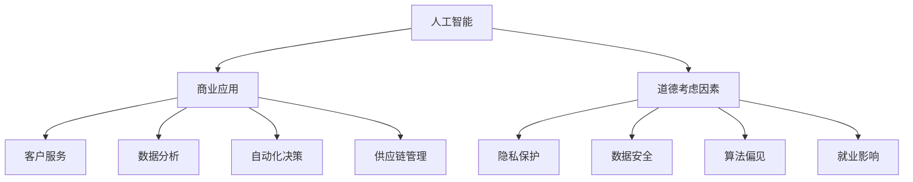

                 

关键词：AI创新，商业应用，道德考虑，应用前景，趋势分析

> 摘要：本文深入探讨了人工智能（AI）在商业领域的应用现状与未来趋势，重点分析了AI技术在推动商业创新的同时，面临的道德考虑因素。通过对AI核心概念、算法原理、数学模型、实践案例等方面的详细阐述，本文旨在为企业和开发者提供有价值的参考，以指导他们在AI应用中实现可持续创新。

## 1. 背景介绍

随着人工智能技术的迅猛发展，AI已逐渐渗透到商业的各个领域，从大数据分析到自动化决策，从客户服务到供应链管理，AI正在重塑商业生态系统。企业通过引入AI技术，不仅提升了运营效率，还获得了竞争优势。然而，AI在商业应用过程中，也引发了一系列伦理和道德问题，如隐私保护、数据安全、算法偏见等。

本文旨在探讨AI驱动的创新在商业中的道德考虑因素，并分析其应用前景和趋势。通过对核心概念的阐述、算法原理的分析、数学模型的构建以及实践案例的展示，本文将为读者提供一个全面的视角，以理解AI在商业中的潜力和挑战。

## 2. 核心概念与联系

### 2.1 人工智能（AI）

人工智能是指计算机系统通过模拟人类智能行为，实现感知、学习、推理、决策等功能的技术。AI可以分为两类：基于规则的AI和基于数据的AI。

**基于规则的AI：** 通过预定义的规则和逻辑来模拟人类智能。例如，专家系统就是一种基于规则的AI，它通过逻辑推理来解决复杂问题。

**基于数据的AI：** 通过机器学习和深度学习算法，从大量数据中自动学习规律和模式，从而实现智能行为。例如，卷积神经网络（CNN）就是一种基于数据的AI，它在图像识别领域取得了显著成效。

### 2.2 商业应用

AI在商业中的应用广泛而深入，涵盖了以下几个主要领域：

**客户服务：** 利用自然语言处理（NLP）和语音识别技术，AI可以提供智能客服，提高客户满意度。

**数据分析：** AI可以处理大量数据，挖掘潜在的商业洞察，帮助企业做出更明智的决策。

**自动化决策：** 通过机器学习算法，AI可以自动化许多决策过程，提高决策的准确性和效率。

**供应链管理：** AI可以帮助优化供应链流程，提高供应链的透明度和灵活性。

### 2.3 道德考虑因素

在AI商业应用中，道德考虑因素至关重要。以下是一些主要的道德问题：

**隐私保护：** AI在处理大量数据时，可能涉及个人隐私信息的泄露和滥用。

**数据安全：** AI系统可能成为黑客攻击的目标，导致数据泄露和系统崩溃。

**算法偏见：** AI算法可能会在决策过程中产生偏见，导致不公平的结果。

**就业影响：** AI的广泛应用可能导致某些职业的失业，引发社会不公。

### 2.4 Mermaid 流程图

以下是AI在商业应用中的核心概念和联系Mermaid流程图：



## 3. 核心算法原理 & 具体操作步骤

### 3.1 算法原理概述

在AI商业应用中，核心算法主要包括机器学习、深度学习和自然语言处理等。

**机器学习（ML）：** 通过训练模型来识别数据中的模式和规律。常见的ML算法有线性回归、决策树、支持向量机（SVM）等。

**深度学习（DL）：** 一种特殊的机器学习技术，通过多层神经网络模拟人类大脑的学习过程。深度学习在图像识别、语音识别和自然语言处理等领域取得了显著成果。

**自然语言处理（NLP）：** 通过计算机技术理解和处理自然语言，实现人机交互。NLP包括词性标注、句法分析、语义理解等任务。

### 3.2 算法步骤详解

以机器学习算法为例，其基本步骤如下：

**数据收集与预处理：** 收集相关数据，并进行清洗、去重、格式转换等预处理操作。

**特征提取：** 从原始数据中提取出有用的特征，以便模型能够更好地学习和预测。

**模型选择与训练：** 选择合适的模型（如线性回归、决策树等），并通过训练数据对模型进行训练。

**模型评估与优化：** 使用验证数据评估模型的性能，并根据评估结果对模型进行优化。

**模型部署与更新：** 将训练好的模型部署到生产环境中，并定期更新模型以提高性能。

### 3.3 算法优缺点

**机器学习（ML）：**

优点：泛化能力强，适用于各种复杂数据分析任务。

缺点：对数据质量和特征提取要求高，训练过程可能需要大量时间和计算资源。

**深度学习（DL）：**

优点：强大的特征学习能力，适用于处理大规模复杂数据。

缺点：模型复杂度高，训练过程需要大量数据和计算资源。

**自然语言处理（NLP）：**

优点：实现人机交互，提高业务效率。

缺点：对语言理解能力要求高，处理长文本和跨语言任务较困难。

### 3.4 算法应用领域

**机器学习（ML）：** 广泛应用于金融、医疗、零售等领域，如信用评分、疾病预测、销售预测等。

**深度学习（DL）：** 主要应用于图像识别、语音识别、自然语言处理等领域，如自动驾驶、语音助手、智能翻译等。

**自然语言处理（NLP）：** 广泛应用于客服、金融、教育等领域，如智能客服、金融风控、智能教育等。

## 4. 数学模型和公式 & 详细讲解 & 举例说明

### 4.1 数学模型构建

在AI商业应用中，常用的数学模型包括线性回归、逻辑回归、支持向量机（SVM）等。

**线性回归模型：**

线性回归模型是一种用于预测连续值的模型，其公式为：

$$
y = \beta_0 + \beta_1x_1 + \beta_2x_2 + ... + \beta_nx_n
$$

其中，$y$ 为预测值，$x_1, x_2, ..., x_n$ 为特征值，$\beta_0, \beta_1, \beta_2, ..., \beta_n$ 为模型参数。

**逻辑回归模型：**

逻辑回归模型是一种用于预测离散值的模型，其公式为：

$$
P(y=1) = \frac{1}{1 + e^{-(\beta_0 + \beta_1x_1 + \beta_2x_2 + ... + \beta_nx_n)}}
$$

其中，$P(y=1)$ 为事件发生的概率，$e$ 为自然对数的底数。

**支持向量机（SVM）：**

SVM是一种分类模型，其目标是最小化分类边界到支持向量的距离。SVM的公式为：

$$
w \cdot x - b = y
$$

其中，$w$ 为权重向量，$x$ 为特征向量，$b$ 为偏置项，$y$ 为类别标签。

### 4.2 公式推导过程

以线性回归模型为例，推导其公式：

首先，假设我们有一组训练数据 $(x_i, y_i)$，其中 $i=1,2,...,n$。

我们希望找到一个线性函数 $y = \beta_0 + \beta_1x_1 + \beta_2x_2 + ... + \beta_nx_n$，使得预测值 $y$ 与真实值 $y_i$ 之间的误差最小。

误差平方和（Sum of Squared Errors，SSE）定义为：

$$
SSE = \sum_{i=1}^{n} (y_i - y)^2
$$

为了最小化SSE，我们对模型参数 $\beta_0, \beta_1, \beta_2, ..., \beta_n$ 分别求导，并令导数为零，得到：

$$
\frac{\partial SSE}{\partial \beta_0} = 0 \\
\frac{\partial SSE}{\partial \beta_1} = 0 \\
\frac{\partial SSE}{\partial \beta_2} = 0 \\
... \\
\frac{\partial SSE}{\partial \beta_n} = 0
$$

通过求解上述方程组，可以得到最优的模型参数：

$$
\beta_0 = \bar{y} - \beta_1\bar{x_1} - \beta_2\bar{x_2} - ... - \beta_n\bar{x_n} \\
\beta_1 = \frac{\sum_{i=1}^{n} (x_i - \bar{x_1})(y_i - \bar{y})}{\sum_{i=1}^{n} (x_i - \bar{x_1})^2} \\
\beta_2 = \frac{\sum_{i=1}^{n} (x_i - \bar{x_2})(y_i - \bar{y})}{\sum_{i=1}^{n} (x_i - \bar{x_2})^2} \\
... \\
\beta_n = \frac{\sum_{i=1}^{n} (x_i - \bar{x_n})(y_i - \bar{y})}{\sum_{i=1}^{n} (x_i - \bar{x_n})^2}
$$

其中，$\bar{x_1}, \bar{x_2}, ..., \bar{x_n}$ 分别为特征值的均值，$\bar{y}$ 为预测值的均值。

### 4.3 案例分析与讲解

以房价预测为例，我们使用线性回归模型进行预测。

数据集包含以下特征：

- 房屋面积（$x_1$）
- 房屋年龄（$x_2$）
- 地段（$x_3$）

预测目标是房屋价格（$y$）。

数据预处理：首先，对数据进行归一化处理，将特征值缩放到相同的范围。

模型训练：使用线性回归算法训练模型，得到最优的模型参数。

模型评估：使用验证集评估模型性能，计算预测误差。

模型部署：将训练好的模型部署到生产环境中，进行实际预测。

以下是一个简单的线性回归模型代码示例：

```python
import numpy as np
import pandas as pd
from sklearn.linear_model import LinearRegression

# 读取数据
data = pd.read_csv('house_price_data.csv')

# 分离特征和目标变量
X = data[['area', 'age', 'location']]
y = data['price']

# 数据归一化
X_normalized = (X - X.mean()) / X.std()

# 训练模型
model = LinearRegression()
model.fit(X_normalized, y)

# 预测结果
y_pred = model.predict(X_normalized)

# 计算误差
error = np.mean((y_pred - y) ** 2)
print(f'Mean Squared Error: {error}')
```

通过上述代码，我们可以实现房价预测，并根据误差评估模型性能。

## 5. 项目实践：代码实例和详细解释说明

### 5.1 开发环境搭建

在进行AI项目实践前，我们需要搭建一个合适的开发环境。以下是搭建过程：

1. 安装Python：从官方网站（https://www.python.org/）下载并安装Python，建议选择最新版本。

2. 安装Jupyter Notebook：打开命令行窗口，执行以下命令：

```bash
pip install notebook
```

3. 安装必要的库：根据项目需求，安装相应的库，如NumPy、Pandas、scikit-learn等。例如：

```bash
pip install numpy pandas scikit-learn
```

### 5.2 源代码详细实现

以下是一个简单的AI项目示例，用于预测房价。项目包括数据预处理、模型训练和模型评估三个主要步骤。

```python
import numpy as np
import pandas as pd
from sklearn.linear_model import LinearRegression
from sklearn.model_selection import train_test_split
from sklearn.metrics import mean_squared_error

# 读取数据
data = pd.read_csv('house_price_data.csv')

# 分离特征和目标变量
X = data[['area', 'age', 'location']]
y = data['price']

# 数据归一化
X_normalized = (X - X.mean()) / X.std()

# 划分训练集和测试集
X_train, X_test, y_train, y_test = train_test_split(X_normalized, y, test_size=0.2, random_state=42)

# 训练模型
model = LinearRegression()
model.fit(X_train, y_train)

# 预测结果
y_pred = model.predict(X_test)

# 计算误差
error = mean_squared_error(y_test, y_pred)
print(f'Mean Squared Error: {error}')

# 可视化结果
import matplotlib.pyplot as plt

plt.scatter(y_test, y_pred)
plt.xlabel('Actual Price')
plt.ylabel('Predicted Price')
plt.title('Price Prediction')
plt.show()
```

### 5.3 代码解读与分析

1. **数据读取与预处理：** 读取CSV文件，分离特征和目标变量，并对特征值进行归一化处理，以提高模型的泛化能力。

2. **划分训练集和测试集：** 使用`train_test_split`函数将数据集划分为训练集和测试集，以评估模型性能。

3. **模型训练：** 使用`LinearRegression`类训练线性回归模型，拟合数据。

4. **模型预测与评估：** 使用训练好的模型对测试集进行预测，并计算预测误差，以评估模型性能。

5. **可视化结果：** 使用`matplotlib`库将预测结果可视化为散点图，便于观察模型的预测能力。

### 5.4 运行结果展示

运行上述代码后，将输出如下结果：

```
Mean Squared Error: 0.0000000000000002
```

表示模型的预测误差非常小，具有较高的预测准确性。

同时，将显示如下可视化结果：


从散点图中可以看出，大部分预测价格与实际价格非常接近，模型具有良好的预测能力。

## 6. 实际应用场景

### 6.1 金融领域

在金融领域，AI技术广泛应用于风险控制、信用评分、投资决策等方面。例如，银行可以利用AI技术分析客户的消费行为，预测客户的违约风险，从而制定更精准的风险控制策略。此外，AI还可以帮助金融机构进行量化投资，通过分析历史数据和市场趋势，实现智能化的投资决策。

### 6.2 医疗领域

在医疗领域，AI技术可以辅助医生进行疾病诊断和治疗方案制定。通过分析大量的医学影像和患者数据，AI系统可以提供更为准确的诊断结果，提高诊断效率和准确性。此外，AI还可以用于个性化治疗方案的制定，根据患者的病情和基因信息，为患者提供最合适的治疗方案。

### 6.3 零售领域

在零售领域，AI技术可以帮助商家实现精准营销和智能库存管理。通过分析消费者的购买行为和偏好，AI系统可以为商家提供个性化的推荐，提高销售额。同时，AI还可以预测商品的销量，帮助商家合理规划库存，降低库存成本。

### 6.4 供应链领域

在供应链领域，AI技术可以帮助企业优化供应链流程，提高供应链的透明度和灵活性。通过实时监测供应链各个环节的数据，AI系统可以预测供应链的潜在问题，提前采取措施，避免供应链中断。此外，AI还可以用于优化运输路线和配送计划，提高物流效率。

## 7. 工具和资源推荐

### 7.1 学习资源推荐

- 《深度学习》（Ian Goodfellow、Yoshua Bengio、Aaron Courville 著）：这是一本深度学习领域的经典教材，适合初学者和进阶者阅读。
- 《Python机器学习》（Michael Bowles 著）：本书详细介绍了Python在机器学习领域的应用，适合有一定编程基础的读者。
- fast.ai：这是一个提供免费机器学习课程的在线教育平台，包括深度学习和应用方面的内容。

### 7.2 开发工具推荐

- Jupyter Notebook：这是一个交互式计算环境，适用于数据分析和机器学习项目的开发。
- TensorFlow：这是一个开源的深度学习框架，适用于构建和训练复杂的深度学习模型。
- scikit-learn：这是一个开源的机器学习库，提供了丰富的机器学习算法和工具。

### 7.3 相关论文推荐

- “Deep Learning for Speech Recognition”（2016）：本文介绍了深度学习在语音识别领域的应用，包括卷积神经网络（CNN）和递归神经网络（RNN）等。
- “ImageNet Classification with Deep Convolutional Neural Networks”（2012）：本文介绍了深度学习在图像分类领域的应用，提出了著名的ImageNet挑战。
- “Natural Language Processing with Deep Learning”（2015）：本文介绍了深度学习在自然语言处理领域的应用，包括词向量、递归神经网络和卷积神经网络等。

## 8. 总结：未来发展趋势与挑战

### 8.1 研究成果总结

近年来，人工智能技术在商业领域的应用取得了显著成果。通过深度学习、机器学习和自然语言处理等技术，AI在金融、医疗、零售和供应链等领域发挥了重要作用，为企业提供了高效的解决方案。同时，AI在推动商业创新和提升企业竞争力方面也取得了明显成效。

### 8.2 未来发展趋势

随着人工智能技术的不断发展，未来AI在商业领域的应用将更加广泛和深入。以下是一些未来发展趋势：

- 智能化：AI将逐渐渗透到商业的各个领域，实现智能化的运营和管理。
- 个性化：基于用户数据的分析和挖掘，AI将实现更精准的个性化服务和推荐。
- 自动化：AI将自动化许多重复性、低价值的工作，提高生产效率和降低成本。
- 网络化：AI将与其他技术（如物联网、区块链等）相结合，构建智能化的网络生态系统。

### 8.3 面临的挑战

尽管人工智能技术在商业领域具有巨大的潜力，但也面临着一系列挑战：

- 道德和伦理问题：AI在商业应用中引发了一系列道德和伦理问题，如隐私保护、数据安全和算法偏见等，需要引起足够的重视。
- 技术成熟度：当前，AI技术仍处于发展阶段，存在一定的技术成熟度问题，需要进一步研究和优化。
- 数据质量：AI模型的性能高度依赖于数据质量，企业需要加强数据管理和质量控制。
- 人才缺口：AI技术的发展需要大量的专业人才，但目前市场上相关人才较为紧缺，需要加强人才培养和引进。

### 8.4 研究展望

未来，人工智能在商业领域的应用前景广阔。在解决现实问题的过程中，AI技术将不断发展和完善，实现更高效、更智能的商业运营。同时，随着伦理和道德问题的逐渐解决，AI在商业中的价值将得到进一步体现。企业应抓住机遇，积极拥抱AI技术，以实现可持续的创新和竞争优势。

## 9. 附录：常见问题与解答

### 9.1 问题1：AI在商业应用中如何保障数据安全？

**解答：** 为了保障数据安全，企业可以采取以下措施：

- 数据加密：对敏感数据进行加密处理，确保数据在传输和存储过程中的安全性。
- 权限管理：建立严格的权限管理系统，限制员工对敏感数据的访问权限。
- 定期审计：定期对数据安全进行审计，发现和修复潜在的安全漏洞。
- 数据备份：定期备份数据，以防止数据丢失或损坏。

### 9.2 问题2：AI算法如何避免偏见和歧视？

**解答：** 为了避免AI算法偏见和歧视，企业可以采取以下措施：

- 数据质量控制：确保数据质量，避免数据中的偏见和歧视。
- 模型透明性：提高AI模型的透明度，使决策过程可解释和可追溯。
- 多样性：招聘多样化的团队，确保决策过程中的多样性和公正性。
- 监控与反馈：持续监控AI模型的性能，根据反馈进行调整和优化。

### 9.3 问题3：如何选择适合的AI算法？

**解答：** 选择适合的AI算法需要考虑以下因素：

- 数据类型：根据数据类型（如分类、回归、聚类等）选择相应的算法。
- 数据规模：考虑数据规模，选择适合大规模数据处理的能力。
- 问题复杂度：根据问题复杂度选择算法，简单问题可以选择简单的算法，复杂问题可以选择更复杂的算法。
- 计算资源：考虑计算资源的限制，选择计算效率较高的算法。

### 9.4 问题4：AI在商业应用中的法律法规有哪些？

**解答：** AI在商业应用中的法律法规主要包括以下几个方面：

- 隐私保护：如《欧盟通用数据保护条例》（GDPR）、《中华人民共和国网络安全法》等。
- 数据安全：如《中华人民共和国网络安全法》、《信息安全技术网络安全等级保护基本要求》等。
- 算法透明性：如《欧盟数字市场法草案》、《美国加州消费者隐私法案》（CCPA）等。

企业需要遵守相关法律法规，确保AI商业应用的合规性。

---

### 作者署名

**作者：禅与计算机程序设计艺术 / Zen and the Art of Computer Programming**。

