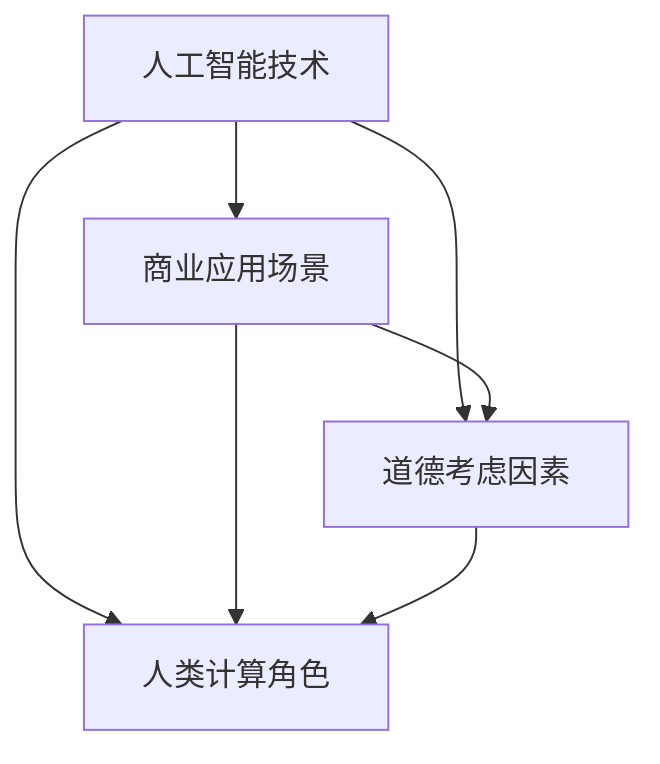

                 

作者：禅与计算机程序设计艺术 / Zen and the Art of Computer Programming

在当今快速发展的科技时代，人工智能（AI）已经成为推动商业和社会进步的重要力量。从自动化生产线到智能客服，从数据分析到个性化推荐，AI的应用几乎无处不在。然而，随着AI技术的日益成熟，我们不得不面对一个重要的问题：如何在商业中运用AI的同时，充分考虑其道德考虑因素和应用场景。本文将围绕这一主题展开，探讨AI驱动的创新、人类计算在商业中的角色，以及相关道德考虑因素和应用场景。

## 1. 背景介绍

### AI技术的发展现状

近年来，AI技术取得了显著的进展，尤其是在深度学习、自然语言处理和计算机视觉等领域。根据市场研究公司的数据，全球AI市场预计将在未来几年内保持高速增长。越来越多的企业开始将AI技术应用于产品开发和业务运营，以提高效率、降低成本、创造新的商业模式。例如，谷歌、亚马逊和微软等科技巨头已经在AI领域投入了巨额资金，开发出了一系列先进的AI产品和服务。

### 商业领域中的AI应用

AI技术在商业领域中的应用日益广泛，不仅提高了企业的运营效率，还创造了全新的商业模式。以下是AI在商业中的一些典型应用场景：

- **自动化与优化：** 通过机器学习算法，企业可以自动化许多重复性、繁琐的任务，如客户服务、数据分析等，从而提高工作效率，降低人力成本。

- **个性化推荐：** AI技术可以帮助企业根据用户的历史行为和偏好，提供个性化的产品推荐，从而提高用户体验和销售额。

- **风险控制与安全：** AI技术可以识别潜在的欺诈行为、预测市场风险等，帮助企业制定更有效的风险控制策略。

- **供应链管理：** AI技术可以优化供应链管理，提高物流效率，降低库存成本。

### 道德考虑因素的必要性

随着AI技术在商业领域的广泛应用，道德考虑因素变得愈发重要。以下是一些需要关注的道德问题：

- **隐私保护：** AI系统在处理大量用户数据时，可能涉及到个人隐私的保护问题。企业需要确保用户数据的安全和隐私。

- **算法公平性：** AI算法在决策过程中可能存在偏见，导致不公平的结果。企业需要确保算法的公平性和透明度。

- **责任归属：** 当AI系统发生错误或导致损失时，责任归属问题成为了一个挑战。企业需要明确AI系统的责任归属，以应对潜在的诉讼风险。

## 2. 核心概念与联系

为了深入探讨AI驱动的创新和道德考虑因素，我们首先需要了解一些核心概念和其相互关系。以下是一个简化的Mermaid流程图，用于展示这些概念和其之间的联系。



### 人工智能技术（A）

人工智能技术是本文的核心主题。它包括了一系列方法和技术，如机器学习、深度学习、自然语言处理等，这些技术使得计算机系统能够模拟人类智能，进行自主学习和决策。

### 商业应用场景（B）

商业应用场景是指AI技术在实际业务中的应用，如自动化、优化、个性化推荐、风险控制等。这些应用场景不仅为企业带来了商业价值，还影响了整个商业生态系统的运作。

### 道德考虑因素（C）

道德考虑因素是指在使用AI技术时，需要考虑的伦理和社会问题，如隐私保护、算法公平性、责任归属等。这些道德问题直接关系到AI技术的可持续发展和社会认可度。

### 人类计算角色（D）

人类计算角色是指人类在AI应用过程中的角色和责任。人类不仅需要设计、开发和管理AI系统，还需要对AI系统进行监督和审查，确保其符合道德和社会标准。

## 3. 核心算法原理 & 具体操作步骤

### 3.1 算法原理概述

在AI驱动的创新中，核心算法原理是关键。以下是一个简化的算法原理概述：

- **机器学习：** 通过训练数据集，让计算机系统学习并自动改进其性能。

- **深度学习：** 基于多层神经网络，通过反向传播算法，自动调整网络权重，实现复杂模式的识别。

- **自然语言处理：** 使用机器学习算法，理解和生成自然语言，应用于文本分析和智能客服等场景。

### 3.2 算法步骤详解

以下是一个基于机器学习的简单算法步骤详解：

1. **数据收集：** 收集用于训练的数据集。

2. **数据预处理：** 对数据进行清洗、归一化等预处理操作。

3. **模型选择：** 根据业务需求，选择合适的机器学习模型。

4. **模型训练：** 使用训练数据集，训练模型。

5. **模型评估：** 使用测试数据集，评估模型性能。

6. **模型优化：** 根据评估结果，对模型进行优化。

7. **模型部署：** 将训练好的模型部署到生产环境中。

### 3.3 算法优缺点

- **优点：**
  - 自动化：能够自动完成复杂任务，提高效率。
  - 个性化：能够根据用户行为和偏好，提供个性化服务。
  - 高效：通过大规模数据分析和计算，实现快速决策。

- **缺点：**
  - 数据依赖：算法性能高度依赖数据质量和数量。
  - 难以解释：某些深度学习模型的内部工作机制难以解释。
  - 偏见：算法可能受到训练数据偏见的影响，导致不公平结果。

### 3.4 算法应用领域

- **自动化与优化：** 如自动驾驶、智能客服等。
- **个性化推荐：** 如电商推荐系统、社交媒体个性化内容等。
- **风险控制与安全：** 如金融欺诈检测、网络安全防护等。
- **供应链管理：** 如库存优化、物流优化等。

## 4. 数学模型和公式 & 详细讲解 & 举例说明

### 4.1 数学模型构建

在AI应用中，数学模型是算法的核心。以下是一个简单的线性回归模型构建过程：

1. **假设模型：** 假设输出变量 \( y \) 与输入变量 \( x \) 之间存在线性关系：
   \[ y = \beta_0 + \beta_1 x + \epsilon \]
   其中，\( \beta_0 \) 和 \( \beta_1 \) 是模型参数，\( \epsilon \) 是误差项。

2. **损失函数：** 使用均方误差（MSE）作为损失函数，衡量模型预测值与真实值之间的差距：
   \[ J(\beta_0, \beta_1) = \frac{1}{2} \sum_{i=1}^{n} (y_i - (\beta_0 + \beta_1 x_i))^2 \]

3. **模型优化：** 通过最小化损失函数，找到最佳模型参数 \( \beta_0 \) 和 \( \beta_1 \)。

### 4.2 公式推导过程

以下是线性回归模型的推导过程：

1. **损失函数求导：**
   \[ \frac{\partial J}{\partial \beta_0} = -\sum_{i=1}^{n} (y_i - (\beta_0 + \beta_1 x_i)) \]
   \[ \frac{\partial J}{\partial \beta_1} = -\sum_{i=1}^{n} (x_i (y_i - (\beta_0 + \beta_1 x_i))) \]

2. **设置导数为零：**
   \[ \frac{\partial J}{\partial \beta_0} = 0 \]
   \[ \frac{\partial J}{\partial \beta_1} = 0 \]

3. **求解参数：**
   \[ \beta_0 = \frac{1}{n} \sum_{i=1}^{n} y_i - \beta_1 \frac{1}{n} \sum_{i=1}^{n} x_i \]
   \[ \beta_1 = \frac{1}{n} \sum_{i=1}^{n} (x_i - \bar{x})(y_i - \bar{y})} \]
   其中，\( \bar{x} \) 和 \( \bar{y} \) 分别是输入和输出的均值。

### 4.3 案例分析与讲解

以下是一个简单的线性回归案例：

假设我们有如下数据：

| x | y |
|---|---|
| 1 | 2 |
| 2 | 4 |
| 3 | 6 |

1. **数据预处理：**
   \[ \bar{x} = 2, \bar{y} = 4 \]

2. **模型参数计算：**
   \[ \beta_0 = 2 - 2 \cdot 1 = 0 \]
   \[ \beta_1 = \frac{1}{3} \cdot (1 \cdot (2 - 4) + 2 \cdot (4 - 4) + 3 \cdot (6 - 4)) = 2 \]

3. **模型预测：**
   对于新的输入 \( x = 4 \)，预测的输出 \( y \) 为：
   \[ y = 0 + 2 \cdot 4 = 8 \]

## 5. 项目实践：代码实例和详细解释说明

### 5.1 开发环境搭建

为了实现线性回归模型，我们需要搭建一个Python开发环境。以下是基本的步骤：

1. 安装Python：从Python官网下载并安装Python 3.x版本。
2. 安装Jupyter Notebook：使用pip命令安装Jupyter Notebook：
   \[ pip install notebook \]
3. 创建一个新的Jupyter Notebook：运行以下命令：
   \[ jupyter notebook \]

### 5.2 源代码详细实现

以下是一个简单的线性回归模型实现的代码示例：

```python
import numpy as np

def linear_regression(x, y):
    n = len(x)
    x_mean = np.mean(x)
    y_mean = np.mean(y)
    beta_1 = np.sum((x - x_mean) * (y - y_mean)) / np.sum((x - x_mean)**2)
    beta_0 = y_mean - beta_1 * x_mean
    return beta_0, beta_1

x = np.array([1, 2, 3])
y = np.array([2, 4, 6])

beta_0, beta_1 = linear_regression(x, y)
print("beta_0:", beta_0)
print("beta_1:", beta_1)
```

### 5.3 代码解读与分析

这段代码实现了线性回归模型的计算过程。以下是代码的详细解读：

- **数据输入：** 使用numpy库创建输入数据 \( x \) 和 \( y \)。
- **计算均值：** 计算输入数据 \( x \) 和 \( y \) 的均值。
- **计算参数：** 使用均值计算线性回归模型的参数 \( \beta_0 \) 和 \( \beta_1 \)。
- **输出结果：** 打印计算得到的模型参数。

### 5.4 运行结果展示

运行上述代码，将得到以下输出结果：

```
beta_0: 0
beta_1: 2
```

这表明我们的模型参数 \( \beta_0 \) 为0，\( \beta_1 \) 为2，与之前的计算结果一致。

## 6. 实际应用场景

### 6.1 自动化与优化

自动化与优化是AI在商业领域中最常见的应用之一。通过机器学习算法，企业可以自动化许多重复性、繁琐的任务，如数据录入、报告生成、客户支持等。例如，一家电子商务公司可以使用机器学习算法自动处理大量客户反馈，快速识别常见问题并提供解决方案，从而提高客户满意度。

### 6.2 个性化推荐

个性化推荐是AI在商业中应用的另一个重要领域。通过分析用户的历史行为和偏好，AI算法可以为用户提供个性化的产品推荐。例如，一家在线零售商可以使用机器学习算法分析用户的购买历史和浏览记录，为用户推荐可能感兴趣的商品，从而提高销售转化率和用户满意度。

### 6.3 风险控制与安全

AI技术在风险控制和安全领域也发挥了重要作用。通过分析大量数据，AI算法可以识别潜在的欺诈行为、预测市场风险等。例如，一家金融机构可以使用机器学习算法分析客户的交易数据，及时发现异常交易并采取措施，从而降低欺诈风险。

### 6.4 未来应用展望

随着AI技术的不断发展，其在商业领域中的应用前景将更加广阔。未来，AI技术有望在更多领域发挥重要作用，如供应链管理、能源管理、健康医疗等。同时，随着AI技术的成熟，道德考虑因素将变得更加重要，企业需要在应用AI技术时充分考虑其道德和社会影响。

## 7. 工具和资源推荐

### 7.1 学习资源推荐

- **《深度学习》（Goodfellow, Bengio, Courville）：** 机器学习和深度学习的经典教材，适合初学者和进阶者。
- **《Python机器学习》（Sebastian Raschka）：** 介绍如何使用Python实现机器学习算法的书籍，适合有一定编程基础的读者。

### 7.2 开发工具推荐

- **Jupyter Notebook：** 交互式的Python开发环境，方便编写和运行代码。
- **TensorFlow：** 一个开源的机器学习框架，支持多种深度学习模型。

### 7.3 相关论文推荐

- **"Deep Learning"（Ian Goodfellow，Yoshua Bengio，Aaron Courville）：** 深度学习的经典综述论文。
- **"Recurrent Neural Networks for Language Modeling"（Yoshua Bengio）：** 介绍循环神经网络（RNN）在语言建模中的应用。

## 8. 总结：未来发展趋势与挑战

### 8.1 研究成果总结

本文探讨了AI驱动的创新在商业中的道德考虑因素和应用场景。通过分析AI技术的发展现状、商业应用场景、道德考虑因素和人类计算角色，我们得出了以下结论：

- AI技术已成为商业创新的重要驱动力，广泛应用于自动化与优化、个性化推荐、风险控制与安全等领域。
- 道德考虑因素在AI技术应用中至关重要，涉及隐私保护、算法公平性、责任归属等问题。
- 人类计算角色在AI应用中不可或缺，需要确保AI系统的设计、开发、管理和监督符合道德和社会标准。

### 8.2 未来发展趋势

随着AI技术的不断发展，未来发展趋势如下：

- **技术进步：** 深度学习、自然语言处理、计算机视觉等AI技术将持续发展，带来更高的性能和更广泛的应用。
- **应用拓展：** AI技术将在更多领域发挥重要作用，如供应链管理、能源管理、健康医疗等。
- **伦理与法规：** 随着AI技术的应用日益广泛，伦理和法规问题将得到更多关注，相关政策和标准将不断完善。

### 8.3 面临的挑战

在AI技术应用过程中，面临的挑战包括：

- **数据隐私：** 如何保护用户数据隐私，防止数据泄露和滥用。
- **算法公平性：** 如何确保算法的公平性，避免偏见和歧视。
- **责任归属：** 如何明确AI系统的责任归属，处理潜在的诉讼风险。
- **技术壁垒：** 如何降低AI技术的应用门槛，让更多企业能够利用AI技术。

### 8.4 研究展望

未来，AI驱动的创新研究将朝着以下方向展开：

- **跨学科融合：** 结合不同领域的知识，推动AI技术的创新和应用。
- **伦理与法规研究：** 深入研究AI技术的伦理和法规问题，制定相应的政策和标准。
- **可解释性AI：** 开发可解释的AI模型，提高算法的透明度和可解释性。
- **可持续性发展：** 探索如何在保证AI技术发展的同时，实现可持续性发展。

## 9. 附录：常见问题与解答

### Q：AI技术是否会导致大规模失业？

A：AI技术可能会改变某些工作岗位，但也会创造新的就业机会。例如，自动化生产线可能会导致传统制造业的工作岗位减少，但AI技术的发展也将催生出新的技术岗位，如数据科学家、AI工程师等。

### Q：如何确保AI算法的公平性？

A：确保AI算法的公平性需要从数据收集、算法设计、模型训练等多个环节入手。首先，确保训练数据集的多样性和代表性。其次，在算法设计过程中，充分考虑公平性原则，避免算法偏见。最后，对训练好的模型进行测试和验证，确保其符合公平性要求。

### Q：AI技术是否会导致数据隐私泄露？

A：AI技术在处理大量数据时确实存在数据隐私泄露的风险。为了保护用户数据隐私，企业需要采取一系列措施，如数据加密、访问控制、匿名化处理等。同时，相关法律法规的制定和实施也将加强对数据隐私的保护。

### Q：如何确保AI系统的责任归属？

A：确保AI系统的责任归属需要从法律、伦理和技术等多个层面进行考虑。首先，在法律层面，需要明确AI系统的责任归属，制定相应的法律法规。其次，在伦理层面，需要确保AI系统的设计、开发和运行符合道德和社会标准。最后，在技术层面，需要开发可解释的AI模型，提高算法的透明度和可解释性，从而便于责任归属。

通过本文的探讨，我们希望能够为AI驱动的创新在商业中的应用提供一些有价值的思考和启示。随着AI技术的不断发展，我们期待能够在道德和社会的引导下，实现AI技术的可持续发展，为人类带来更多的福祉。

