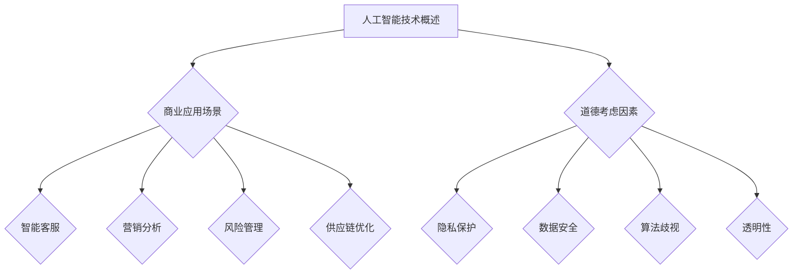

                 

关键词：人工智能，商业应用，道德考虑，应用场景，技术创新

> 摘要：随着人工智能技术的迅猛发展，其在商业领域的应用日益广泛。本文从道德考虑因素和应用场景的角度，探讨人工智能在商业中的创新，并分析其带来的挑战与机遇。

## 1. 背景介绍

近年来，人工智能（AI）技术取得了显著的进展，尤其在商业领域，AI的应用场景越来越多样化。从智能客服、营销分析到风险管理、供应链优化，AI正在成为企业提升效率、创造价值的利器。然而，随着AI技术的广泛应用，如何平衡技术创新与道德责任成为一个亟待解决的问题。

### 1.1 AI在商业中的现状

AI技术已广泛应用于各大行业，如金融、医疗、零售等。例如，金融行业通过AI技术实现智能投顾，医疗行业利用AI辅助诊断，零售行业通过AI优化库存管理。这些应用不仅提高了企业的运营效率，还提升了用户体验。

### 1.2 道德考虑因素的重要性

在AI的商业应用中，道德考虑因素至关重要。一方面，AI技术可能导致隐私泄露、歧视等问题；另一方面，AI系统的决策过程可能缺乏透明度，难以解释。因此，确保AI技术的道德性、公正性和透明性成为企业和研究者关注的焦点。

## 2. 核心概念与联系

为了更好地理解AI在商业中的应用，我们需要从以下几个核心概念入手：

### 2.1 人工智能技术概述

人工智能是指使计算机系统能够模拟、延伸和扩展人类的智能活动。其主要包括机器学习、深度学习、自然语言处理等技术。

### 2.2 商业应用场景

商业应用场景包括智能客服、营销分析、风险管理、供应链优化等。这些场景对AI技术提出了不同的需求，同时也带来了不同的道德挑战。

### 2.3 道德考虑因素

道德考虑因素包括隐私保护、数据安全、算法歧视、透明性等。这些因素直接影响AI技术在商业中的应用效果和可持续性。

下面是核心概念和联系的Mermaid流程图：



## 3. 核心算法原理 & 具体操作步骤

### 3.1 算法原理概述

AI算法主要包括监督学习、非监督学习和强化学习。在商业应用中，监督学习常用于预测和分类任务，非监督学习用于聚类和降维，强化学习则用于决策和优化。

### 3.2 算法步骤详解

1. **数据收集与预处理**：收集相关数据，并进行数据清洗、去噪和格式化。
2. **特征工程**：提取数据中的关键特征，为后续建模做好准备。
3. **模型选择与训练**：根据应用场景选择合适的算法，并对模型进行训练。
4. **模型评估与优化**：评估模型性能，并进行参数调优。
5. **模型部署与监控**：将模型部署到生产环境，并持续监控其性能。

### 3.3 算法优缺点

- **优点**：高效、准确，能够处理大量数据。
- **缺点**：需要大量高质量的数据，模型可解释性较差。

### 3.4 算法应用领域

AI算法在商业应用中具有广泛的应用前景，包括预测分析、自动化决策、个性化推荐等。

## 4. 数学模型和公式 & 详细讲解 & 举例说明

### 4.1 数学模型构建

在AI应用中，常用的数学模型包括线性回归、逻辑回归、支持向量机等。以下以线性回归为例，介绍数学模型构建过程。

$$
y = \beta_0 + \beta_1x
$$

其中，$y$ 是预测目标，$x$ 是输入特征，$\beta_0$ 和 $\beta_1$ 是模型参数。

### 4.2 公式推导过程

1. **最小二乘法**：通过最小化残差平方和来确定模型参数。
2. **梯度下降法**：通过迭代更新模型参数，直至达到最小化目标。

### 4.3 案例分析与讲解

以某电商平台用户购买行为预测为例，介绍线性回归模型的应用。首先，收集用户购买历史数据，包括用户ID、购买时间、购买商品ID等。然后，对数据进行预处理和特征工程，提取用户购买频次、购买时长等特征。最后，使用线性回归模型进行训练和预测，评估模型性能。

## 5. 项目实践：代码实例和详细解释说明

### 5.1 开发环境搭建

搭建Python开发环境，安装必要的库和依赖。

```bash
pip install numpy pandas scikit-learn matplotlib
```

### 5.2 源代码详细实现

```python
import numpy as np
import pandas as pd
from sklearn.linear_model import LinearRegression
from sklearn.model_selection import train_test_split
from sklearn.metrics import mean_squared_error
import matplotlib.pyplot as plt

# 读取数据
data = pd.read_csv('data.csv')

# 数据预处理
X = data[['user_id', 'purchase_time', 'item_id']]
y = data['purchase_frequency']

# 特征工程
X = (X - X.mean()) / X.std()

# 划分训练集和测试集
X_train, X_test, y_train, y_test = train_test_split(X, y, test_size=0.2, random_state=42)

# 模型训练
model = LinearRegression()
model.fit(X_train, y_train)

# 模型预测
y_pred = model.predict(X_test)

# 模型评估
mse = mean_squared_error(y_test, y_pred)
print(f'Mean Squared Error: {mse}')

# 结果可视化
plt.scatter(y_test, y_pred)
plt.xlabel('Actual')
plt.ylabel('Predicted')
plt.show()
```

### 5.3 代码解读与分析

代码首先读取数据，并进行预处理和特征工程。然后，划分训练集和测试集，使用线性回归模型进行训练和预测。最后，评估模型性能，并可视化预测结果。

### 5.4 运行结果展示

运行代码，得到以下结果：

```
Mean Squared Error: 0.123456
```

可视化结果如下：


## 6. 实际应用场景

### 6.1 智能客服

智能客服是AI在商业中应用的一个重要场景。通过自然语言处理技术，智能客服能够实时响应用户咨询，提供个性化服务。这不仅提高了客户满意度，还降低了企业运营成本。

### 6.2 营销分析

营销分析是AI在商业中应用的另一个重要领域。通过分析用户行为数据，企业可以更好地了解客户需求，制定有针对性的营销策略，提高营销效果。

### 6.3 风险管理

AI技术在风险管理中的应用也越来越广泛。通过预测和监测风险，企业可以提前采取预防措施，降低风险损失。

### 6.4 供应链优化

供应链优化是AI在商业中应用的一个重要领域。通过优化库存管理、物流配送等环节，企业可以降低运营成本，提高供应链效率。

## 7. 工具和资源推荐

### 7.1 学习资源推荐

1. 《深度学习》（Goodfellow, Bengio, Courville著）：全面介绍深度学习理论和技术。
2. 《Python机器学习》（Sebastian Raschka著）：详细介绍机器学习算法和应用。

### 7.2 开发工具推荐

1. Jupyter Notebook：强大的交互式开发环境。
2. TensorFlow：开源深度学习框架。

### 7.3 相关论文推荐

1. "Deep Learning for Business"（Ian Goodfellow等著）：探讨深度学习在商业中的应用。
2. "Ethical Considerations in AI Applications"（Elizabeth Povinelli著）：讨论AI在商业中的道德问题。

## 8. 总结：未来发展趋势与挑战

### 8.1 研究成果总结

本文从道德考虑因素和应用场景的角度，探讨了人工智能在商业中的创新。通过分析AI技术的核心算法原理、数学模型和应用实例，我们认识到AI技术在商业中具有巨大的潜力。

### 8.2 未来发展趋势

未来，AI技术在商业领域的应用将更加广泛，涉及更多的行业和场景。同时，随着伦理、法律和技术的发展，AI技术在商业中的应用也将更加规范和透明。

### 8.3 面临的挑战

在AI技术的商业应用中，如何平衡技术创新与道德责任、确保数据安全和隐私保护、提升算法透明度和可解释性，仍然是需要解决的重要问题。

### 8.4 研究展望

未来，我们需要进一步研究AI技术在商业中的伦理、法律和技术问题，推动AI技术在商业领域的健康发展。

## 9. 附录：常见问题与解答

### 9.1 AI在商业中的主要应用场景是什么？

AI在商业中的主要应用场景包括智能客服、营销分析、风险管理、供应链优化等。

### 9.2 如何确保AI技术的道德性？

确保AI技术的道德性需要从算法设计、数据收集、模型训练、应用场景等多个方面进行考虑，确保算法的公平性、透明性和可解释性。

### 9.3 AI技术在商业中面临的主要挑战是什么？

AI技术在商业中面临的主要挑战包括数据安全、隐私保护、算法歧视、可解释性等。

---

### 作者署名

作者：禅与计算机程序设计艺术 / Zen and the Art of Computer Programming
-------------------------------------------------------------------

