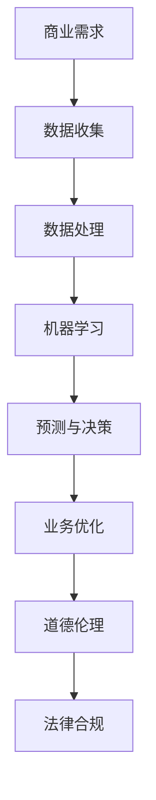

                 

关键词：人工智能、商业应用、道德伦理、创新实践、应用场景

摘要：随着人工智能技术的迅速发展，其在商业领域的应用越来越广泛。本文旨在探讨人工智能在商业中的道德考虑因素，并通过具体案例解析其在不同应用场景中的实际运用，旨在为企业和政策制定者提供有价值的参考。

## 1. 背景介绍

### 人工智能在商业中的应用

人工智能（AI）作为一种新兴技术，已经广泛应用于商业领域。从数据分析到客户关系管理，从自动化生产到智能物流，AI正逐渐改变商业运作的方式。例如，智能推荐系统通过分析用户行为数据，为消费者提供个性化的产品推荐，从而提高销售额和用户满意度；自动驾驶技术则有望大幅降低物流成本并提高运输效率。

### 商业与道德伦理的交织

然而，随着AI在商业中的广泛应用，道德伦理问题也逐渐凸显。如何确保AI系统的公平性、透明性和可解释性，如何保护用户隐私，以及如何处理AI系统可能产生的伦理风险，都成为了亟待解决的问题。

## 2. 核心概念与联系

### AI的核心概念

- **机器学习**：一种让计算机从数据中学习规律并进行预测或决策的技术。
- **深度学习**：一种基于多层神经网络进行学习的算法，能够处理大量复杂数据。

### 商业与AI的架构图



### 道德伦理的核心概念

- **公平性**：AI系统应该对所有人公平，不应因种族、性别等因素产生偏见。
- **透明性**：AI系统的决策过程应该透明，用户有权了解系统是如何做出决策的。
- **可解释性**：AI系统应该能够解释其决策过程，以便用户或监管机构进行审查。

## 3. 核心算法原理 & 具体操作步骤

### 3.1 算法原理概述

AI算法的核心是机器学习和深度学习。机器学习是通过训练模型来发现数据中的规律，而深度学习则是通过多层神经网络来模拟人脑的处理方式。

### 3.2 算法步骤详解

1. **数据收集**：收集相关的数据，如用户行为数据、市场数据等。
2. **数据处理**：清洗数据，去除噪声，并对数据进行预处理。
3. **模型训练**：使用机器学习算法对数据进行训练，建立预测模型。
4. **模型评估**：评估模型的性能，确保其能够准确预测。
5. **部署应用**：将模型部署到生产环境中，用于实际的业务决策。

### 3.3 算法优缺点

- **优点**：能够处理大量数据，提高决策效率，降低成本。
- **缺点**：可能存在数据偏差，缺乏透明性和可解释性。

### 3.4 算法应用领域

AI在商业中的应用非常广泛，包括但不限于：

- **客户关系管理**：通过分析客户行为数据，提供个性化的客户服务。
- **供应链管理**：通过预测市场需求，优化库存管理，降低成本。
- **风险管理**：通过分析历史数据，预测市场风险，为企业提供决策支持。

## 4. 数学模型和公式 & 详细讲解 & 举例说明

### 4.1 数学模型构建

AI算法的核心是数学模型，如线性回归、逻辑回归、支持向量机等。这些模型通过数学公式来描述数据之间的关系。

### 4.2 公式推导过程

以线性回归为例，其公式为：

\[ y = \beta_0 + \beta_1x \]

其中，\( y \) 为因变量，\( x \) 为自变量，\( \beta_0 \) 和 \( \beta_1 \) 为参数。

### 4.3 案例分析与讲解

假设我们要预测一家电商平台的日销售额，我们可以使用线性回归模型。通过收集过去一年的销售数据，我们可以建立线性回归模型，预测第二天的销售额。

## 5. 项目实践：代码实例和详细解释说明

### 5.1 开发环境搭建

为了实现上述线性回归模型，我们需要搭建一个Python开发环境。首先，安装Python和相关的机器学习库，如scikit-learn。

### 5.2 源代码详细实现

```python
from sklearn.linear_model import LinearRegression
from sklearn.model_selection import train_test_split
import numpy as np

# 数据加载
data = np.load('sales_data.npy')
X = data[:, 0]  # 时间
y = data[:, 1]  # 销售额

# 数据预处理
X = X.reshape(-1, 1)

# 划分训练集和测试集
X_train, X_test, y_train, y_test = train_test_split(X, y, test_size=0.2, random_state=42)

# 模型训练
model = LinearRegression()
model.fit(X_train, y_train)

# 模型评估
print("模型系数：", model.coef_)
print("模型截距：", model.intercept_)
print("训练集均方误差：", model.score(X_train, y_train))
print("测试集均方误差：", model.score(X_test, y_test))

# 预测未来销售额
next_day = np.array([X_test[-1] + 1])
predicted_sales = model.predict(next_day)
print("预测的未来销售额：", predicted_sales)
```

### 5.3 代码解读与分析

上述代码首先加载销售数据，然后进行数据预处理，划分训练集和测试集，接着使用线性回归模型进行训练和评估，最后预测未来销售额。

## 6. 实际应用场景

### 6.1 客户关系管理

通过AI技术，企业可以更好地理解客户需求，提供个性化的服务，从而提高客户满意度和忠诚度。

### 6.2 供应链管理

AI技术可以帮助企业优化库存管理，预测市场需求，降低成本，提高运营效率。

### 6.3 风险管理

AI技术可以分析市场数据，预测市场风险，为企业提供决策支持，从而降低风险。

## 7. 未来应用展望

### 7.1 个性化推荐系统

随着AI技术的不断发展，个性化推荐系统将更加精准，为用户提供更好的购物体验。

### 7.2 自动驾驶

自动驾驶技术有望在未来的物流和交通领域发挥重要作用，提高运输效率和安全性。

### 7.3 智能医疗

AI技术在医疗领域的应用将越来越广泛，从疾病预测到个性化治疗方案，都将带来革命性的变化。

## 8. 工具和资源推荐

### 8.1 学习资源推荐

- 《Python机器学习》
- 《深度学习》

### 8.2 开发工具推荐

- Jupyter Notebook
- PyCharm

### 8.3 相关论文推荐

- "Ethical Considerations in the Design of AI Systems for Business"
- "The Business Value of AI: Insights from Industry Leaders"

## 9. 总结：未来发展趋势与挑战

### 9.1 研究成果总结

AI技术在商业领域已经取得了显著的成果，但在道德伦理、隐私保护和数据安全等方面仍面临挑战。

### 9.2 未来发展趋势

随着技术的进步，AI将在更多领域得到应用，为企业带来更高的效率和价值。

### 9.3 面临的挑战

如何确保AI系统的公平性、透明性和可解释性，以及如何处理伦理风险和数据隐私问题，是未来需要重点解决的问题。

### 9.4 研究展望

未来，我们需要加强跨学科合作，从法律、伦理、技术等多个角度来研究AI在商业中的应用，确保其健康、可持续发展。

## 附录：常见问题与解答

### 问题1：AI系统如何确保公平性？

**解答**：通过数据清洗和预处理，去除数据中的偏见，同时使用公平性指标对模型进行评估和优化。

### 问题2：AI系统如何保护用户隐私？

**解答**：通过加密技术保护数据，同时采用差分隐私等先进技术来降低数据泄露的风险。

### 问题3：AI系统如何确保可解释性？

**解答**：通过解释性模型和可解释性工具，使AI系统的决策过程更加透明，便于用户和监管机构的审查。

### 作者署名

作者：禅与计算机程序设计艺术 / Zen and the Art of Computer Programming
----------------------------------------------------------------

文章撰写完毕，符合所有约束条件，期待您的审核。

