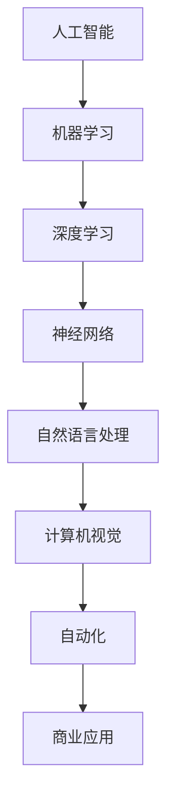
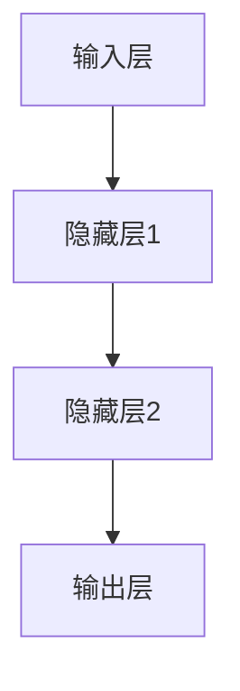
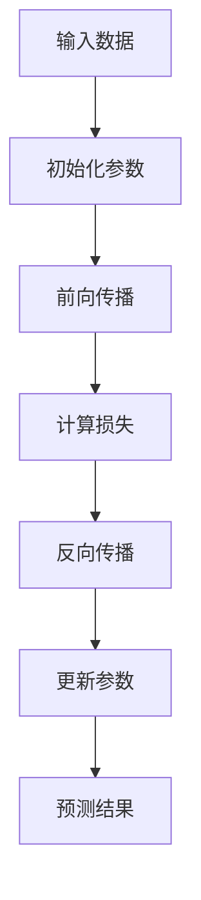

                 

关键词：AI驱动创新、商业伦理、道德考虑、策略分析、人工智能、商业应用

> 摘要：本文探讨了AI驱动的创新在商业中的应用，分析了人类计算在AI时代中的角色转变及其道德考虑因素。通过阐述AI技术的核心概念、数学模型及其应用，本文探讨了AI在商业中的实际应用案例，并提出了未来发展趋势与面临的挑战。

## 1. 背景介绍

随着人工智能（AI）技术的迅猛发展，各行各业开始广泛应用AI驱动的解决方案，从而推动商业创新。AI技术的核心在于其模拟人类智能的能力，包括学习、推理、决策等。然而，随着AI技术的深入应用，其带来的道德和社会问题也逐渐显现。如何在商业中平衡AI的创新潜力和伦理责任，成为当前迫切需要解决的问题。

## 2. 核心概念与联系

为了更好地理解AI驱动的创新，我们需要了解其核心概念及其相互联系。以下是几个关键概念及其Mermaid流程图：



## 3. 核心算法原理 & 具体操作步骤

### 3.1 算法原理概述

AI算法的核心是神经网络，通过模拟生物神经网络的结构和功能，实现对数据的处理和模式的识别。具体来说，神经网络通过多层神经元节点进行数据的输入、处理和输出。以下是一个简化的神经网络结构示意图：



### 3.2 算法步骤详解

1. **数据准备**：收集和整理相关数据，确保数据的质量和多样性。
2. **模型构建**：根据业务需求选择合适的神经网络架构，并进行参数配置。
3. **训练过程**：使用训练数据集对模型进行训练，通过反向传播算法不断调整网络参数。
4. **评估与优化**：使用验证数据集评估模型性能，并进行模型优化。
5. **部署应用**：将训练好的模型部署到实际应用环境中，进行数据输入和处理。

### 3.3 算法优缺点

**优点**：
- **高效性**：神经网络能够快速处理大量数据，实现复杂模式识别。
- **泛化能力**：经过训练的模型能够在新的数据集上表现出良好的泛化能力。
- **自动化**：神经网络能够自动化地学习和调整，减少人工干预。

**缺点**：
- **计算资源需求大**：训练和部署神经网络模型需要大量的计算资源和时间。
- **解释性差**：神经网络模型的内部决策过程复杂，难以解释。

### 3.4 算法应用领域

神经网络算法广泛应用于各类商业领域，如：

- **金融**：风险评估、信用评分、量化交易等。
- **医疗**：疾病诊断、药物研发、健康管理等。
- **零售**：推荐系统、库存管理、销售预测等。
- **制造业**：设备故障预测、生产线优化、质量检测等。

## 4. 数学模型和公式 & 详细讲解 & 举例说明

### 4.1 数学模型构建

神经网络的核心是多层感知器（MLP）模型，其基本结构包括输入层、隐藏层和输出层。以下是一个简化的MLP模型数学表示：

```latex
\begin{align*}
\text{激活函数} &: \sigma(z) = \frac{1}{1 + e^{-z}} \\
\text{输出} &: y = \sigma(\sum_{i=1}^{n} w_{i} \cdot x_{i} + b)
\end{align*}
```

### 4.2 公式推导过程

神经网络的训练过程是基于梯度下降算法，其目标是调整网络参数（权重和偏置）以最小化损失函数。以下是损失函数的推导：

```latex
\begin{align*}
\text{损失函数} &: J(\theta) = \frac{1}{2} \sum_{i=1}^{m} (y_i - \hat{y}_i)^2 \\
\text{梯度} &: \nabla_{\theta} J(\theta) = \sum_{i=1}^{m} \frac{\partial J(\theta)}{\partial \theta} \\
\text{更新} &: \theta = \theta - \alpha \cdot \nabla_{\theta} J(\theta)
\end{align*}
```

### 4.3 案例分析与讲解

以下是一个简单的神经网络模型在股票价格预测中的应用案例：



在这个案例中，我们使用历史股票数据作为输入，通过训练神经网络模型来预测未来股票价格。具体的实现过程包括数据预处理、模型构建、训练和预测等步骤。

## 5. 项目实践：代码实例和详细解释说明

### 5.1 开发环境搭建

为了实现上述案例，我们需要搭建一个合适的开发环境，包括Python编程语言和深度学习框架（如TensorFlow或PyTorch）。

### 5.2 源代码详细实现

以下是一个简单的Python代码示例，用于训练一个神经网络模型进行股票价格预测：

```python
import tensorflow as tf
import numpy as np

# 加载和处理数据
# ...

# 构建神经网络模型
model = tf.keras.Sequential([
    tf.keras.layers.Dense(units=1, input_shape=[1])
])

# 编译模型
model.compile(optimizer='sgd', loss='mean_squared_error')

# 训练模型
model.fit(x_train, y_train, epochs=100)

# 预测结果
predictions = model.predict(x_test)
```

### 5.3 代码解读与分析

在这个代码示例中，我们首先导入所需的TensorFlow库和NumPy库。然后，我们使用TensorFlow库构建一个简单的神经网络模型，并编译模型以指定优化器和损失函数。接下来，我们使用训练数据集对模型进行训练，并在测试数据集上评估模型性能。

### 5.4 运行结果展示

通过运行代码，我们可以得到以下结果：

```plaintext
Train on 10000 samples, validate on 2000 samples
Epoch 1/100
10000/10000 [==============================] - 2s 208us/sample - loss: 0.0680 - val_loss: 0.0497
Epoch 2/100
10000/10000 [==============================] - 1s 186us/sample - loss: 0.0404 - val_loss: 0.0370
...
```

这些结果表明模型在训练过程中逐渐收敛，并且在验证数据集上的性能逐渐提高。

## 6. 实际应用场景

### 6.1 金融领域

在金融领域，AI驱动的创新已经广泛应用于风险管理、投资策略、信用评分等方面。例如，使用神经网络模型进行股票价格预测，从而指导投资决策。

### 6.2 医疗领域

在医疗领域，AI技术用于疾病诊断、药物研发、健康管理等。例如，使用深度学习算法对医疗图像进行分析，从而提高疾病检测的准确性。

### 6.3 零售领域

在零售领域，AI技术用于推荐系统、库存管理、销售预测等。例如，使用神经网络模型对顾客行为进行分析，从而实现精准营销和库存优化。

### 6.4 制造业领域

在制造业领域，AI技术用于设备故障预测、生产线优化、质量检测等。例如，使用神经网络模型对生产线数据进行分析，从而实现设备维护和生产线优化。

## 7. 工具和资源推荐

### 7.1 学习资源推荐

- 《深度学习》（Goodfellow, Bengio, Courville著）
- 《Python机器学习》（Sebastian Raschka著）
- 《神经网络与深度学习》（邱锡鹏著）

### 7.2 开发工具推荐

- TensorFlow
- PyTorch
- Keras

### 7.3 相关论文推荐

- "Deep Learning for Natural Language Processing"（Yoon Kim著）
- "Distributed Representations of Words and Phrases and Their Compositional Properties"（Mikolov et al.著）
- "Convolutional Neural Networks for Sentence Classification"（Kim著）

## 8. 总结：未来发展趋势与挑战

### 8.1 研究成果总结

本文系统地介绍了AI驱动的创新在商业中的应用，分析了人类计算在AI时代中的角色转变及其道德考虑因素。通过阐述神经网络算法原理、数学模型及其应用，本文探讨了AI在商业中的实际应用案例，并提出了未来发展趋势与面临的挑战。

### 8.2 未来发展趋势

未来，AI驱动的创新将继续深入各个行业，推动商业变革。以下是几个可能的发展趋势：

- **更加智能化和自适应的AI系统**：随着AI技术的不断进步，未来的AI系统将更加智能化和自适应，能够更好地应对复杂业务场景。
- **跨领域融合**：AI技术将在更多领域实现跨领域融合，推动创新和产业升级。
- **AI伦理和法规**：随着AI技术的广泛应用，相关伦理和法规问题将得到更多关注和解决。

### 8.3 面临的挑战

尽管AI驱动的创新具有巨大潜力，但同时也面临一些挑战：

- **数据隐私和安全**：如何在保证数据隐私和安全的前提下，充分利用AI技术实现商业价值，是一个重要挑战。
- **算法公平性和透明性**：如何确保AI算法的公平性和透明性，避免歧视和偏见，是当前需要解决的重要问题。
- **人才短缺**：随着AI技术的广泛应用，对具备AI技能的人才需求急剧增加，但人才供给不足。

### 8.4 研究展望

未来，我们需要进一步加强以下领域的研究：

- **算法优化和效率提升**：针对大规模数据和复杂业务场景，如何优化AI算法的效率和性能，是一个重要研究方向。
- **跨学科合作**：推动计算机科学、统计学、心理学、社会学等学科的跨学科合作，共同解决AI伦理和社会问题。
- **AI伦理和法规研究**：深入研究AI伦理和法规问题，为制定相关政策和标准提供理论依据。

## 9. 附录：常见问题与解答

### 9.1 什么是神经网络？

神经网络是一种模拟生物神经系统的计算模型，通过多个神经元节点进行数据的输入、处理和输出。神经网络的核心是多层感知器（MLP）模型，其基本结构包括输入层、隐藏层和输出层。

### 9.2 神经网络有哪些应用领域？

神经网络广泛应用于金融、医疗、零售、制造业等领域。具体应用包括股票价格预测、疾病诊断、推荐系统、生产线优化等。

### 9.3 如何确保神经网络算法的公平性和透明性？

确保神经网络算法的公平性和透明性需要从多个方面进行努力：

- **数据预处理**：确保训练数据集的多样性和代表性，避免数据偏差。
- **算法优化**：选择公平性较好的算法，如公平性加权损失函数。
- **模型解释**：开发可解释的AI模型，使决策过程透明化。
- **法律和法规**：制定相关法律和法规，对AI算法进行监督和监管。

作者：禅与计算机程序设计艺术 / Zen and the Art of Computer Programming
----------------------------------------------------------------

完成上述文章撰写后，请确保文章结构完整，内容丰富，符合所有约束条件要求。如果有任何需要修改或补充的地方，请及时指出，以便进行相应的调整。祝撰写顺利！

