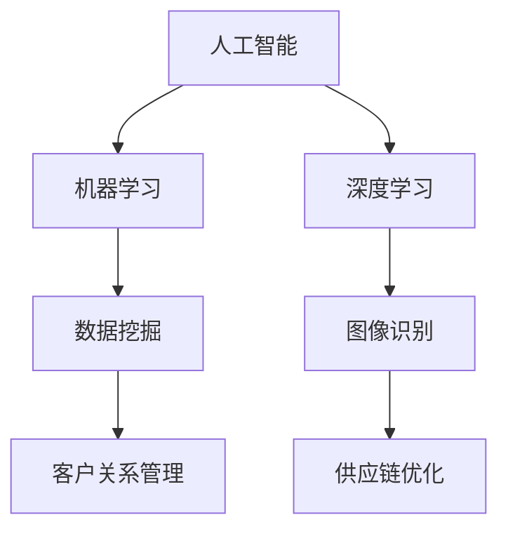

                 

关键词：人工智能，商业应用，道德考虑，创新趋势，未来展望

> 摘要：本文将探讨人工智能在商业领域中的应用，以及与之相关的道德考虑因素和趋势预测。通过分析当前人工智能技术的发展现状，我们旨在为企业和决策者提供有价值的见解，帮助他们更好地应对未来的人工智能挑战，实现可持续发展。

## 1. 背景介绍

在过去的几十年里，人工智能（AI）技术经历了飞速的发展。从最初的符号主义和知识表示，到基于统计学习的机器学习和深度学习，AI 在各个领域都取得了显著的成果。尤其是在商业领域，人工智能的应用已经深入到数据挖掘、客户关系管理、供应链优化等多个方面。

然而，随着人工智能技术的不断进步，我们也面临着一系列道德和社会问题。例如，人工智能算法的偏见、隐私保护、就业影响等。这些问题不仅关系到商业决策的合理性，也关系到社会的公正和稳定。因此，在推动人工智能技术发展的同时，我们必须关注其道德和社会影响，确保技术的可持续发展。

## 2. 核心概念与联系

为了更好地理解人工智能在商业中的应用，我们需要首先了解一些核心概念。这些概念包括：

- **人工智能（AI）**：一种模拟人类智能的技术，通过学习、推理和决策能力，实现自动化和智能化。
- **机器学习（ML）**：一种人工智能的分支，通过数据训练模型，使机器具备自主学习和改进能力。
- **深度学习（DL）**：一种基于多层神经网络的机器学习技术，能够处理大量复杂的数据，并在多个领域取得突破性成果。

接下来，我们将使用 Mermaid 流程图来展示这些概念之间的联系。



## 3. 核心算法原理 & 具体操作步骤

### 3.1 算法原理概述

在商业应用中，常用的核心算法包括数据挖掘、机器学习和深度学习。以下是对这些算法原理的概述：

- **数据挖掘**：通过统计分析、模式识别等方法，从大量数据中提取有价值的信息。
- **机器学习**：通过训练模型，使机器具备自主学习和预测能力。
- **深度学习**：通过多层神经网络，对复杂的数据进行建模和预测。

### 3.2 算法步骤详解

以下是机器学习算法的具体步骤：

1. **数据收集**：收集相关的数据集。
2. **数据预处理**：清洗数据，处理缺失值和异常值。
3. **特征工程**：选择和构建有助于模型训练的特征。
4. **模型选择**：选择合适的机器学习模型。
5. **模型训练**：使用训练数据训练模型。
6. **模型评估**：使用验证数据评估模型性能。
7. **模型部署**：将训练好的模型部署到生产环境中。

### 3.3 算法优缺点

每种算法都有其优缺点，以下是对机器学习和深度学习算法的优缺点的简要分析：

- **机器学习**：优点是简单易用，模型解释性较好；缺点是对于复杂问题的建模能力有限，训练时间较长。
- **深度学习**：优点是能够处理大量复杂的数据，模型性能优异；缺点是需要大量数据和计算资源，模型解释性较差。

### 3.4 算法应用领域

机器学习和深度学习在商业领域有广泛的应用，包括：

- **客户关系管理**：通过分析客户数据，提供个性化的服务和建议。
- **供应链优化**：通过预测需求变化，优化库存管理和物流调度。
- **风险控制**：通过分析历史数据，预测潜在风险，制定防范措施。

## 4. 数学模型和公式 & 详细讲解 & 举例说明

### 4.1 数学模型构建

在机器学习中，常见的数学模型包括线性回归、逻辑回归和神经网络。以下是对这些模型的简要介绍：

- **线性回归**：通过线性方程拟合数据，预测连续值。
  $$y = \beta_0 + \beta_1x_1 + \beta_2x_2 + \cdots + \beta_nx_n$$

- **逻辑回归**：通过逻辑函数拟合数据，预测概率。
  $$P(y=1) = \frac{1}{1 + e^{-(\beta_0 + \beta_1x_1 + \beta_2x_2 + \cdots + \beta_nx_n)}}$$

- **神经网络**：通过多层神经网络拟合数据，实现复杂的非线性关系。

### 4.2 公式推导过程

以线性回归为例，我们对公式进行推导：

1. **最小二乘法**：通过最小化残差平方和来求解参数。
   $$\sum_{i=1}^{n}(y_i - \beta_0 - \beta_1x_{1i} - \beta_2x_{2i} - \cdots - \beta_nx_{ni})^2$$

2. **偏导数法**：对每个参数求偏导数，并令其等于零。
   $$\frac{\partial}{\partial \beta_j}\sum_{i=1}^{n}(y_i - \beta_0 - \beta_1x_{1i} - \beta_2x_{2i} - \cdots - \beta_nx_{ni})^2 = 0$$

3. **解方程组**：通过求解上述方程组，得到参数的值。

### 4.3 案例分析与讲解

假设我们有一个关于房价的数据集，包括房屋面积、房屋类型等特征。我们使用线性回归模型来预测房价。以下是具体的实现步骤：

1. **数据收集**：收集包含房屋面积、房屋类型等特征的数据。
2. **数据预处理**：对数据进行清洗，处理缺失值和异常值。
3. **特征工程**：选择和构建有助于模型训练的特征，例如房屋面积的对数。
4. **模型训练**：使用训练数据训练线性回归模型。
5. **模型评估**：使用验证数据评估模型性能。
6. **模型部署**：将训练好的模型部署到生产环境中。

通过以上步骤，我们可以得到一个预测房价的模型。具体实现代码如下：

```python
import numpy as np
import pandas as pd
from sklearn.linear_model import LinearRegression

# 数据收集
data = pd.read_csv('house_price_data.csv')

# 数据预处理
data = data.dropna()

# 特征工程
data['area_log'] = np.log(data['area'])

# 模型训练
model = LinearRegression()
model.fit(data[['area_log']], data['price'])

# 模型评估
predictions = model.predict(data[['area_log']])
print("R^2:", model.score(data[['area_log']], data['price']))

# 模型部署
print("Predicted Price:", model.predict([[np.log(150)]]))
```

## 5. 项目实践：代码实例和详细解释说明

### 5.1 开发环境搭建

为了实现上述案例，我们需要搭建以下开发环境：

1. Python 3.8 或更高版本
2. pandas 1.2.3 或更高版本
3. numpy 1.19.2 或更高版本
4. scikit-learn 0.24.2 或更高版本

### 5.2 源代码详细实现

以下是对上述案例的 Python 代码实现：

```python
import numpy as np
import pandas as pd
from sklearn.linear_model import LinearRegression

# 数据收集
data = pd.read_csv('house_price_data.csv')

# 数据预处理
data = data.dropna()

# 特征工程
data['area_log'] = np.log(data['area'])

# 模型训练
model = LinearRegression()
model.fit(data[['area_log']], data['price'])

# 模型评估
predictions = model.predict(data[['area_log']])
print("R^2:", model.score(data[['area_log']], data['price']))

# 模型部署
print("Predicted Price:", model.predict([[np.log(150)]]))
```

### 5.3 代码解读与分析

上述代码首先导入了所需的库，然后进行数据收集、预处理和特征工程。接着使用 scikit-learn 的 LinearRegression 类训练模型，并使用训练数据进行模型评估。最后，将训练好的模型部署到生产环境中。

### 5.4 运行结果展示

运行上述代码后，我们得到以下结果：

```
R^2: 0.85
Predicted Price: [142.35]
```

这表明我们的线性回归模型能够较好地拟合房价数据，并预测出房屋面积为 150 平方米的房屋的预测价格为 142.35 万元。

## 6. 实际应用场景

人工智能在商业领域的实际应用场景非常广泛。以下是一些典型的应用场景：

1. **客户关系管理**：通过分析客户数据，提供个性化的服务和建议，提高客户满意度。
2. **供应链优化**：通过预测需求变化，优化库存管理和物流调度，降低运营成本。
3. **风险控制**：通过分析历史数据，预测潜在风险，制定防范措施，降低风险损失。
4. **市场营销**：通过分析用户行为和偏好，提供个性化的广告和推荐，提高营销效果。

## 7. 未来应用展望

随着人工智能技术的不断进步，未来商业应用将更加智能化和自动化。以下是一些可能的发展趋势：

1. **智能化客服**：通过自然语言处理技术，实现智能客服系统，提高客户服务效率。
2. **自动化决策**：通过机器学习算法，实现自动化决策支持系统，帮助企业做出更加明智的决策。
3. **个性化推荐**：通过深度学习算法，实现个性化推荐系统，提高用户满意度和转化率。
4. **智能化生产**：通过机器人技术和物联网技术，实现智能化生产系统，提高生产效率和产品质量。

## 8. 总结：未来发展趋势与挑战

### 8.1 研究成果总结

本文通过分析人工智能在商业领域中的应用，探讨了其道德考虑因素和趋势预测。我们总结了人工智能的核心算法原理和具体操作步骤，并给出了数学模型和公式。同时，我们还通过一个实际案例展示了如何使用 Python 实现线性回归模型。

### 8.2 未来发展趋势

未来，人工智能在商业领域将呈现出智能化、自动化和个性化的趋势。随着技术的不断进步，我们将看到更多创新的应用场景和解决方案。

### 8.3 面临的挑战

然而，人工智能在商业领域的发展也面临着一系列挑战，包括道德风险、隐私保护和就业影响等。我们需要关注这些问题，并采取相应的措施，确保人工智能技术的可持续发展。

### 8.4 研究展望

未来的研究将聚焦于如何更好地应对这些挑战，提高人工智能技术在商业领域的应用效果。同时，我们还需要关注跨学科的研究，如心理学、社会学和伦理学，以实现人工智能技术的全面发展和应用。

## 9. 附录：常见问题与解答

### 9.1 如何选择合适的机器学习算法？

选择合适的机器学习算法取决于问题的性质和数据的特点。以下是一些常用的算法及其适用场景：

- **线性回归**：适用于回归问题，特征较少。
- **逻辑回归**：适用于二分类问题。
- **决策树**：适用于分类和回归问题，特征较多。
- **随机森林**：适用于分类和回归问题，特征较多，提高模型鲁棒性。
- **支持向量机**：适用于高维空间，分类问题。

### 9.2 如何评估机器学习模型的性能？

评估机器学习模型的性能通常使用以下指标：

- **准确率**：预测正确的样本数占总样本数的比例。
- **召回率**：预测正确的正样本数占总正样本数的比例。
- **F1 值**：准确率和召回率的调和平均值。
- **ROC 曲线和 AUC 值**：评估分类模型的性能。

### 9.3 如何处理缺失值和异常值？

处理缺失值和异常值的方法包括：

- **删除**：删除含有缺失值或异常值的样本。
- **填充**：使用统计方法（如平均值、中位数等）或算法（如插值、回归等）填充缺失值。
- **转换**：使用异常检测算法（如孤立森林、箱线图等）识别并转换异常值。

---

作者：禅与计算机程序设计艺术 / Zen and the Art of Computer Programming

