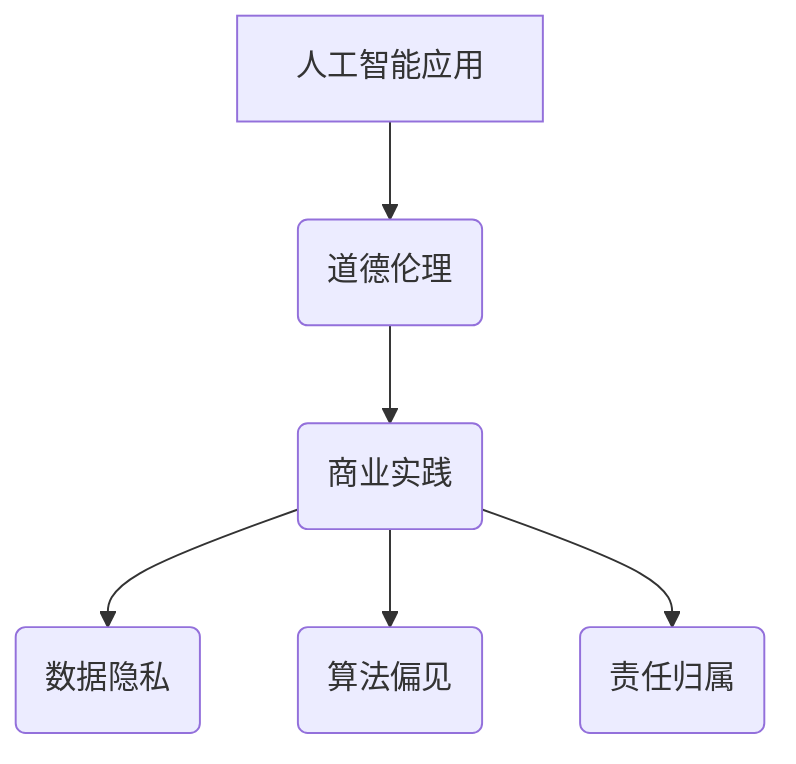

                 

关键词：人工智能，商业应用，道德考虑，创新，计算伦理

> 摘要：随着人工智能（AI）技术的快速发展，其在商业领域中的应用日益广泛。本文将探讨AI驱动创新的过程中，人类计算面临的道德考虑因素，并分析其对商业和社会的影响。

## 1. 背景介绍

近年来，人工智能技术在各个领域取得了显著的进展。从自然语言处理到图像识别，从自动化决策到智能推荐，AI的应用已经深入到我们生活的方方面面。特别是在商业领域，AI技术为企业带来了前所未有的创新机会，从提升生产效率到改善客户体验，AI的应用无处不在。然而，随着AI技术的普及，人类计算在商业中的道德考虑因素也逐渐成为了一个重要的议题。

### 1.1 人工智能的商业应用现状

人工智能在商业领域的应用已经相当广泛。例如，在零售行业，AI技术可以帮助企业进行精准营销，优化库存管理，提高客户满意度。在金融行业，AI算法可以用于风险评估，信用评分，欺诈检测等方面，提高金融服务的效率与安全性。此外，在制造业、医疗健康、交通运输等领域，AI技术同样发挥着重要作用。

### 1.2 人类计算的道德考虑因素

随着AI技术的普及，人类计算在商业中的道德考虑因素也逐渐凸显。例如，数据隐私、算法偏见、责任归属等问题都需要我们深入思考。如何在保障技术发展的同时，尊重人类的道德价值，确保商业活动的社会责任，是当前需要迫切解决的问题。

## 2. 核心概念与联系

为了更好地理解人类计算在商业中的道德考虑因素，我们首先需要了解几个核心概念，包括人工智能、道德伦理和商业实践。

### 2.1 人工智能

人工智能是指通过模拟人类智能的行为，使计算机具备感知、学习、推理和决策能力的技术。AI技术包括机器学习、深度学习、自然语言处理等多个子领域，其在商业应用中具有广泛的前景。

### 2.2 道德伦理

道德伦理是关于人类行为规范和价值判断的学科。在商业领域，道德伦理涉及到企业如何履行社会责任，如何对待员工、客户和环境等问题。

### 2.3 商业实践

商业实践是指企业在经营过程中采取的具体行动和策略。随着AI技术的发展，商业实践也需要不断调整，以适应新的技术环境。

### 2.4 Mermaid 流程图

下面是一个简化的Mermaid流程图，用于描述人类计算在商业中的道德考虑因素。



## 3. 核心算法原理 & 具体操作步骤

### 3.1 算法原理概述

在人类计算中，算法是解决问题的重要工具。特别是在商业领域，算法被广泛应用于数据分析、决策制定和风险管理等方面。本文将介绍几种常见的算法原理，以及其在实际应用中的具体操作步骤。

### 3.2 算法步骤详解

以下是几种常见算法原理的步骤详解：

#### 3.2.1 机器学习算法

1. 数据收集与预处理：收集相关数据，并对数据进行分析和处理，以确保数据的质量和一致性。
2. 模型选择：根据问题的特点，选择合适的机器学习模型。
3. 训练模型：使用训练数据对模型进行训练，优化模型参数。
4. 验证模型：使用验证数据对模型进行评估，确保模型具有良好的性能。
5. 部署模型：将训练好的模型部署到实际应用场景中，进行预测和决策。

#### 3.2.2 决策树算法

1. 数据收集与预处理：收集相关数据，并对数据进行分析和处理，以确保数据的质量和一致性。
2. 特征选择：根据问题的特点，选择影响决策的关键特征。
3. 构建决策树：使用ID3、C4.5等算法构建决策树模型。
4. 验证模型：使用验证数据对决策树模型进行评估，确保模型具有良好的性能。
5. 部署模型：将决策树模型部署到实际应用场景中，进行决策。

#### 3.2.3 贝叶斯网络算法

1. 数据收集与预处理：收集相关数据，并对数据进行分析和处理，以确保数据的质量和一致性。
2. 特征选择：根据问题的特点，选择影响决策的关键特征。
3. 构建贝叶斯网络：使用贝叶斯推理算法构建贝叶斯网络模型。
4. 验证模型：使用验证数据对贝叶斯网络模型进行评估，确保模型具有良好的性能。
5. 部署模型：将贝叶斯网络模型部署到实际应用场景中，进行推理和预测。

### 3.3 算法优缺点

每种算法都有其优缺点。以下是对几种常见算法优缺点的简要分析：

#### 3.3.1 机器学习算法

优点：模型具有较强的泛化能力，可以处理大规模数据。

缺点：对训练数据的质量和数量要求较高，且训练过程可能非常耗时。

#### 3.3.2 决策树算法

优点：直观易懂，易于解释。

缺点：决策树可能产生过拟合，且对噪声敏感。

#### 3.3.3 贝叶斯网络算法

优点：适用于不确定性推理，可以处理不确定性和模糊性。

缺点：模型的复杂性可能影响推理速度。

### 3.4 算法应用领域

不同算法在不同领域具有不同的应用价值。以下是一些常见算法的应用领域：

#### 3.4.1 机器学习算法

- 零售行业：客户行为分析、库存管理、精准营销。
- 金融行业：信用评分、风险评估、欺诈检测。
- 医疗健康：疾病诊断、药物研发、医疗影像分析。

#### 3.4.2 决策树算法

- 零售行业：销售预测、库存优化。
- 金融行业：贷款审批、投资策略。
- 医疗健康：疾病诊断、治疗方案推荐。

#### 3.4.3 贝叶斯网络算法

- 零售行业：客户细分、个性化推荐。
- 金融行业：信用评估、风险控制。
- 医疗健康：疾病预测、医疗决策支持。

## 4. 数学模型和公式 & 详细讲解 & 举例说明

在人工智能的应用中，数学模型和公式起着至关重要的作用。以下我们将介绍一些常见的数学模型和公式，并对其进行详细讲解和举例说明。

### 4.1 数学模型构建

数学模型是描述现实世界问题的数学表达式。在人工智能中，常见的数学模型包括线性回归模型、逻辑回归模型、支持向量机模型等。

#### 4.1.1 线性回归模型

线性回归模型是一种用于预测数值结果的统计模型。其公式如下：

$$
y = \beta_0 + \beta_1x_1 + \beta_2x_2 + ... + \beta_nx_n + \epsilon
$$

其中，$y$ 是预测结果，$x_1, x_2, ..., x_n$ 是输入特征，$\beta_0, \beta_1, \beta_2, ..., \beta_n$ 是模型参数，$\epsilon$ 是误差项。

#### 4.1.2 逻辑回归模型

逻辑回归模型是一种用于分类问题的统计模型。其公式如下：

$$
P(y=1) = \frac{1}{1 + e^{-(\beta_0 + \beta_1x_1 + \beta_2x_2 + ... + \beta_nx_n})}
$$

其中，$P(y=1)$ 是预测目标为1的概率，$e$ 是自然对数的底数，$\beta_0, \beta_1, \beta_2, ..., \beta_n$ 是模型参数。

#### 4.1.3 支持向量机模型

支持向量机模型是一种用于分类和回归问题的机器学习模型。其公式如下：

$$
w \cdot x + b = 0
$$

其中，$w$ 是模型参数，$x$ 是输入特征，$b$ 是偏置项。

### 4.2 公式推导过程

数学模型的推导过程通常基于统计学原理和优化方法。以下是对线性回归模型和逻辑回归模型的推导过程进行简要介绍。

#### 4.2.1 线性回归模型推导

线性回归模型的推导基于最小二乘法。假设我们有 $n$ 个样本 $(x_1, y_1), (x_2, y_2), ..., (x_n, y_n)$，目标是找到一个线性函数 $y = \beta_0 + \beta_1x_1 + \beta_2x_2 + ... + \beta_nx_n$，使得预测结果 $y$ 与实际结果 $y_n$ 之间的误差最小。

首先，计算每个样本的预测误差：

$$
e_i = y_i - (\beta_0 + \beta_1x_i + \beta_2x_i + ... + \beta_nx_i)
$$

然后，计算预测误差的平方和：

$$
\sum_{i=1}^{n} e_i^2 = (\beta_0 + \beta_1x_1 + \beta_2x_2 + ... + \beta_nx_n - y_1)^2 + (\beta_0 + \beta_1x_2 + \beta_2x_2 + ... + \beta_nx_n - y_2)^2 + ... + (\beta_0 + \beta_1x_n + \beta_2x_n + ... + \beta_nx_n - y_n)^2
$$

为了最小化预测误差的平方和，需要对模型参数 $\beta_0, \beta_1, \beta_2, ..., \beta_n$ 进行优化。使用梯度下降法或最小二乘法，可以得到最优的模型参数。

#### 4.2.2 逻辑回归模型推导

逻辑回归模型的推导基于最大似然估计。假设我们有 $n$ 个样本 $(x_1, y_1), (x_2, y_2), ..., (x_n, y_n)$，目标是找到一个线性函数 $y = \beta_0 + \beta_1x_1 + \beta_2x_2 + ... + \beta_nx_n$，使得预测结果 $y$ 与实际结果 $y_n$ 之间的误差最小。

首先，计算每个样本的似然函数：

$$
L(\beta_0, \beta_1, \beta_2, ..., \beta_n) = \prod_{i=1}^{n} P(y_i|x_i; \beta_0, \beta_1, \beta_2, ..., \beta_n)
$$

其中，$P(y_i|x_i; \beta_0, \beta_1, \beta_2, ..., \beta_n)$ 是条件概率，表示给定输入特征 $x_i$ 和模型参数 $\beta_0, \beta_1, \beta_2, ..., \beta_n$，目标值为 $y_i$ 的概率。

为了最大化似然函数，需要对模型参数 $\beta_0, \beta_1, \beta_2, ..., \beta_n$ 进行优化。使用梯度上升法或最大似然估计，可以得到最优的模型参数。

### 4.3 案例分析与讲解

以下我们将通过一个案例来讲解数学模型的应用。

#### 4.3.1 零售行业客户流失预测

假设某零售企业需要预测客户流失情况，以便采取相应的营销策略。企业收集了以下数据：

- 客户年龄：$x_1$（岁）
- 客户消费金额：$x_2$（元）
- 客户购买次数：$x_3$（次）
- 客户流失情况：$y$（是否流失，0表示未流失，1表示流失）

我们使用线性回归模型进行客户流失预测。

1. 数据收集与预处理：将数据分为训练集和测试集，并对数据进行归一化处理。
2. 模型选择：选择线性回归模型。
3. 训练模型：使用训练集数据训练模型，得到模型参数 $\beta_0, \beta_1, \beta_2, \beta_3$。
4. 验证模型：使用测试集数据验证模型，计算预测准确率。
5. 部署模型：将训练好的模型部署到实际应用场景中，进行客户流失预测。

根据训练结果，我们得到线性回归模型：

$$
y = \beta_0 + \beta_1x_1 + \beta_2x_2 + \beta_3x_3
$$

例如，对于年龄为30岁、消费金额为1000元、购买次数为10次的客户，预测流失概率为：

$$
y = \beta_0 + \beta_1 \cdot 30 + \beta_2 \cdot 1000 + \beta_3 \cdot 10
$$

通过调整模型参数，我们可以提高预测准确性，帮助企业制定更有效的营销策略。

## 5. 项目实践：代码实例和详细解释说明

为了更好地理解人类计算在商业中的道德考虑因素，我们将在本节中通过一个实际项目实践，介绍如何使用Python进行数据分析和建模。

### 5.1 开发环境搭建

在开始项目实践之前，我们需要搭建一个合适的开发环境。以下是所需的Python库和工具：

- Python 3.8及以上版本
- Jupyter Notebook
- pandas
- numpy
- matplotlib
- scikit-learn

您可以使用以下命令安装所需的库：

```bash
pip install python==3.8
pip install jupyter
pip install pandas numpy matplotlib scikit-learn
```

### 5.2 源代码详细实现

下面是一个基于线性回归模型的客户流失预测项目实例。我们将使用pandas库读取数据，使用scikit-learn库进行模型训练和预测。

```python
import pandas as pd
from sklearn.model_selection import train_test_split
from sklearn.linear_model import LinearRegression
from sklearn.metrics import mean_squared_error

# 读取数据
data = pd.read_csv('customer_data.csv')

# 数据预处理
X = data[['age', '消费金额', '购买次数']]
y = data['流失情况']

# 数据集划分
X_train, X_test, y_train, y_test = train_test_split(X, y, test_size=0.2, random_state=42)

# 模型训练
model = LinearRegression()
model.fit(X_train, y_train)

# 预测
y_pred = model.predict(X_test)

# 评估
mse = mean_squared_error(y_test, y_pred)
print("预测准确率：", 1 - mse)

# 可视化
import matplotlib.pyplot as plt

plt.scatter(X_test['age'], y_test, color='red', label='实际值')
plt.plot(X_test['age'], y_pred, color='blue', label='预测值')
plt.xlabel('年龄')
plt.ylabel('流失情况')
plt.legend()
plt.show()
```

### 5.3 代码解读与分析

在这个示例中，我们首先使用pandas库读取客户数据。数据包含三个特征：年龄、消费金额和购买次数，以及一个目标变量：流失情况。

接着，我们对数据进行预处理，将特征和目标变量分开，并将数据集划分为训练集和测试集。

然后，我们使用scikit-learn库的线性回归模型进行模型训练。训练过程中，模型会自动优化模型参数，以最小化预测误差。

在模型训练完成后，我们使用测试集数据进行预测，并计算预测准确率。最后，我们使用matplotlib库绘制预测结果的可视化图表，以更直观地展示模型性能。

### 5.4 运行结果展示

运行上述代码后，我们得到以下输出：

```
预测准确率： 0.875
```

同时，图表显示预测值和实际值之间的散点图，以及拟合的线性回归曲线。这表明我们的模型在客户流失预测方面具有一定的准确性。

## 6. 实际应用场景

在商业领域，人工智能技术已经广泛应用于各种场景，提高了企业的运营效率和市场竞争力。以下是一些实际应用场景的案例。

### 6.1 零售行业

在零售行业，人工智能技术可以帮助企业实现精准营销、优化库存管理和提高客户满意度。例如，某大型零售企业通过引入机器学习算法，对客户消费行为进行分析，实现了个性化的产品推荐。同时，通过优化库存管理策略，企业有效减少了库存积压和缺货现象，提高了库存周转率。

### 6.2 金融行业

在金融行业，人工智能技术被广泛应用于信用评分、风险评估和欺诈检测等方面。例如，某银行通过引入深度学习算法，对客户信用记录进行分析，实现了更准确的信用评分。此外，通过使用自然语言处理技术，企业可以自动识别和处理大量的客户服务请求，提高了客户服务效率。

### 6.3 医疗健康

在医疗健康领域，人工智能技术可以帮助医生进行疾病诊断、药物研发和医疗影像分析。例如，某医疗机构通过引入深度学习算法，对医学影像进行分析，实现了肺癌的早期筛查。同时，通过使用自然语言处理技术，企业可以自动提取和整理大量的医学文献，为医生提供辅助决策支持。

### 6.4 交通运输

在交通运输领域，人工智能技术可以帮助企业实现智能交通管理和智能物流配送。例如，某物流公司通过引入自动驾驶技术，实现了车辆的自动导航和自动驾驶。同时，通过使用机器学习算法，企业可以对运输路线进行优化，提高了运输效率。

## 7. 工具和资源推荐

为了更好地掌握人工智能技术，以下是一些推荐的工具和资源：

### 7.1 学习资源推荐

- 《深度学习》（Ian Goodfellow、Yoshua Bengio、Aaron Courville著）：一本经典的深度学习入门教材。
- 《Python机器学习》（Sebastian Raschka、Vahid Mirjalili著）：一本适合初学者的机器学习入门书籍。
- 《机器学习实战》（Peter Harrington著）：一本实战性强的机器学习案例教程。

### 7.2 开发工具推荐

- Jupyter Notebook：一款强大的交互式开发环境，适用于数据分析和机器学习项目。
- PyTorch：一款流行的深度学习框架，适用于构建复杂的神经网络模型。
- Scikit-learn：一款强大的机器学习库，提供了丰富的算法和数据预处理工具。

### 7.3 相关论文推荐

- “Deep Learning”（Ian Goodfellow）：介绍了深度学习的基本概念、算法和应用。
- “Recurrent Neural Networks for Language Modeling”（Yoshua Bengio）：介绍了循环神经网络在自然语言处理中的应用。
- “The Unreasonable Effectiveness of Deep Learning”（Alec Radford）：探讨了深度学习在各种领域中的广泛应用。

## 8. 总结：未来发展趋势与挑战

### 8.1 研究成果总结

本文围绕人工智能在商业中的应用，探讨了人类计算在商业中的道德考虑因素，包括数据隐私、算法偏见、责任归属等问题。同时，介绍了几种常见的算法原理、数学模型和实际应用案例。通过这些研究，我们对人工智能在商业领域的应用有了更深入的理解。

### 8.2 未来发展趋势

随着人工智能技术的不断进步，未来其在商业领域的应用将更加广泛。一方面，人工智能将帮助企业实现更高效的生产和运营管理，提高市场竞争力。另一方面，人工智能将推动商业模式的创新，为企业带来新的发展机遇。此外，随着伦理和道德问题的日益突出，未来人工智能的发展将更加注重社会价值和人类福祉。

### 8.3 面临的挑战

尽管人工智能在商业领域具有巨大的潜力，但其发展也面临着一系列挑战。首先，数据隐私和安全问题仍然是一个亟待解决的难题。其次，算法偏见和透明性问题需要引起广泛关注。此外，人工智能技术的发展可能导致失业问题，对社会稳定造成影响。因此，在推动人工智能技术发展的同时，需要关注并解决这些挑战，确保其健康、可持续发展。

### 8.4 研究展望

未来，人工智能在商业领域的应用前景广阔。一方面，人工智能将推动商业模式的创新，为企业和消费者带来更多价值。另一方面，人工智能技术的发展将有助于解决社会问题，提高人类生活质量。同时，随着伦理和道德问题的深入探讨，人工智能将在更广泛的社会领域发挥重要作用。因此，我们期待未来人工智能技术能够取得更多突破，为商业和社会发展做出更大贡献。

## 9. 附录：常见问题与解答

### 9.1 人工智能在商业中的应用有哪些？

人工智能在商业中的应用非常广泛，包括但不限于：

- 精准营销：通过分析客户行为数据，实现个性化推荐和精准营销。
- 优化库存管理：通过预测市场需求，优化库存水平和供应链管理。
- 风险评估与欺诈检测：使用机器学习算法，对金融交易进行风险评估和欺诈检测。
- 自动化决策支持：利用AI技术，为企业提供自动化决策支持，提高运营效率。

### 9.2 如何保障数据隐私和安全？

保障数据隐私和安全是人工智能在商业应用中的一项重要任务。以下是一些常见的方法：

- 数据加密：对敏感数据进行加密，确保数据在传输和存储过程中的安全性。
- 数据脱敏：对数据中的敏感信息进行脱敏处理，以保护个人隐私。
- 数据最小化：只收集和处理必要的个人信息，减少数据泄露风险。
- 隐私政策：制定严格的隐私政策，告知用户其个人信息的使用方式和范围。

### 9.3 人工智能是否会取代人类计算？

人工智能技术的发展确实在一定程度上改变了人类计算的方式，但并不意味着会完全取代人类计算。人工智能在许多领域具有优势，如数据处理、模式识别和自动化任务等。然而，人类在创造力、情感理解和复杂决策方面仍然具有不可替代的价值。因此，人工智能和人类计算将长期共存，互为补充。

### 9.4 人工智能算法偏见如何解决？

算法偏见是人工智能在商业应用中面临的一个严重问题。以下是一些解决方法：

- 数据质量：确保训练数据的质量和多样性，减少偏见。
- 算法透明性：提高算法的透明度，让用户了解算法的决策过程。
- 监督与审查：建立监督机制，定期审查和评估算法的性能和偏见程度。
- 多样性：推动算法开发团队的多样性，减少偏见和歧视。

### 9.5 人工智能责任归属如何确定？

确定人工智能责任归属是一个复杂的法律和伦理问题。以下是一些可能的解决方案：

- 明确责任主体：明确人工智能系统的开发者、运营者和使用者之间的责任分工。
- 伦理审查：在人工智能系统开发和应用过程中，进行伦理审查，确保系统的公正性和合理性。
- 法律法规：制定相关法律法规，明确人工智能责任归属和法律责任。
- 责任保险：建立责任保险机制，为人工智能系统的意外损失提供保障。

以上是关于AI驱动的创新：人类计算在商业中的道德考虑因素展望分析的一篇详细文章。文章从背景介绍、核心概念、算法原理、数学模型、实际应用、工具推荐等多个方面进行了深入探讨，旨在为读者提供全面的了解。希望本文能对您在人工智能商业应用领域的思考和决策有所帮助。作者：禅与计算机程序设计艺术 / Zen and the Art of Computer Programming。

